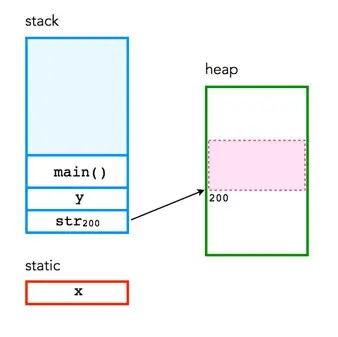
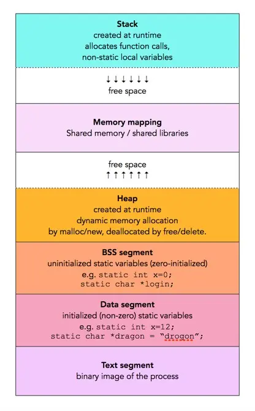
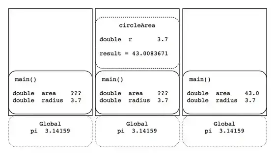

# Memory of C

C的内存使用分为三个部分:

– 静态：全局变量存储，在整个程序运行期间永久存储。
– 栈：局部变量存储（自动、连续内存）。
– 堆：动态存储（大型内存池，不按连续顺序分配）。

<!--more-->


## 静态内存

静态内存在程序的整个生命周期中持续存在，通常用于存储全局变量或使用静态子句创建的变量等内容。例如：

```c
int a;
```

在许多系统上，此变量使用 4 个字节的内存。此内存可以来自两个地方之一。

- 如果变量是在函数外部声明的，则将其视为全局变量，这意味着可以在程序中的任何位置访问该变量。全局变量是静态的，整个程序只有一个副本。
- 在函数内部声明的，变量在堆栈上分配。也可以使用 static 子句强制变量为静态变量。例如:

```c
static int a;
```

## 栈内存

栈用于存储函数内部使用的变量，这是一个LIFO(先进后出)的结构。每次函数声明一个新变量时，它都会被“推送”到栈上。然后，当函数完成运行时，栈上与该函数关联的所有变量都将被删除，并释放它们使用的内存。这导致了函数变量的“局部”范围。栈是一个特殊的内存区域，由 CPU 自动管理，因此您不必分配或释放内存。栈内存分为连续的帧，每次调用函数时，它都会为自己分配一个新的栈帧。

栈的大小通常有限制 - 这可能因操作系统而异。如果程序尝试在栈上放置太多信息，则会发生栈溢出。当栈中的所有内存都已分配，并且进一步的分配开始溢出到内存的其他部分时，就会发生栈溢出。栈溢出也发生在错误使用递归的情况下。

- 堆栈由CPU管理，无法对其进行修改
- 自动分配和释放变量
- 堆栈不是无限的 - 大多数都有上限
- 堆栈随着变量的创建和销毁而增长和收缩
- 堆栈变量仅在创建它们的函数存在时才存在

## 堆内存

堆与栈截然相反。堆是一个可以动态使用的大型内存池 - 它也被称为“免费存储”。堆不是自动管理的内存 - 您必须显式分配（使用 malloc 等函数）并释放（例如free）内存。程序完成后未能释放内存将导致内存泄漏 - 内存仍在“使用”，并且不可用于其他进程。与栈不同，除了计算机中内存的物理大小外，通常对堆（或其创建的变量）的大小没有限制。在堆上创建的变量可以在程序中的任何位置访问。

- 堆由程序员管理，修改无上限
- 在 C 语言中，变量使用 malloc（） 和 free（） 等函数进行分配和释放
- 堆很大，通常受可用物理内存的限制
- 堆需要指针才能访问

## 内存示例

```c
#include <stdio.h>
#include <stdlib.h>

int x;          

int main(void) 
{
    int y;   
    char *str; 

    y = 4;
    printf("stack memory: %d\n", y);

    str = malloc(100*sizeof(char)); 
    str[0] = 'm';
    printf("heap memory: %c\n", str[0]); 
    free(str);         
    return 0;
}
```

变量 x 是静态存储，因为它具有全局性质。y 和 str 都是动态堆栈存储，在程序结束时被释放。 函数 malloc（） 用于将 100 个动态堆存储（每个大小为 char）分配给 str。函数 free（） 会释放与 str 关联的内存。



### string 内存分配

字符串在内存中的存储位置取决于其被声明的方式。

在 C 中使用字符数组声明字符串，则该字符串会被存储在栈中。例如：

```c
char str[] = "Hello, world!";
```

在上面的示例中，字符串 "Hello, world!" 存储在字符数组 str 中，该数组被分配在栈上。由于栈是有限的，因此如果字符串太长，则可能导致栈溢出。

如果使用指针或动态内存分配（例如 malloc() 函数）来声明字符串，则该字符串将被存储在堆中。例如：

```c
char* str = "Hello, world!";
//或者

char* str = new char[13];
strcpy(str, "Hello, world!");
```

在上面的示例中，字符串 "Hello, world!" 存储在堆中，因为我们使用指针或动态内存分配来声明字符串。

> 注意: 堆上分配的特征是使用了指阵。

如果通过指针方式初始化结构体，结构体也是在堆上，否则在栈上。

```c
int main()
{
//在堆空间分配内存
my_person * p = malloc(sizeof(my_person));
strcpy(p->name, "Lilei");
p->age = 30;

//在栈上分配内存
my_person person = { "Elon",18 }; //定义结构体类型为my_person的变量
}
```

## 内存分布



### 静态内存的位置

静态变量（以及全局变量）的变量存储在数据段中。这通常有两个部分：

- 未初始化的数据段，用于存储未初始化的变量。这有时被称为BSS（代表“由符号启动的块”，一种旧的汇编语言，描述用于为未初始化的静态数组分配存储的伪代码）。例如：

```c
int aGlobal;
static int someStaticVar;
```

- 存储初始化变量的初始化数据段。例如：

```c
int aGlobal = 1;
static int someStaticVar = 12;
```

对于下面的代码:

```c
// simple.c
#include <stdio.h>
int main(void)
{
   return 0;
}
```

使用`gcc -c simple.c` 编译(linux环境)，我们会得到一个可以进一步处理的对象文件。我们可以使用 size 命令（打印十进制字节数）来查找一些基本信息。

```sh
$ size simple.o
   text    data     bss     dec     hex filename
     67       0       0      67      43 simple.o
```

如果我们添加一个简单的静态 int。

```c
#include <stdio.h>
int main(void)
{
   static int i;
   return 0;
}
```

再次运行size:

```sh
$ size simple.o        
   text    data     bss     dec     hex filename
     67       0       4      71      47 simple.o
```

可以看到bss增加了静态变量，大小为 4 个字节。

如果我们再添加一个初始化的静态int。

```c
#include <stdio.h>
int main(void)
{
   static int i;
   static int j=10;
   return 0;
}
```

size结果中data部分增加了一个静态变量，大小为4字节。

```sh
$ size simple.o  
   text    data     bss     dec     hex filename
     67       4       4      75      4b simple.o
```

> 注意: size的中的text指的就是代码部分。

### 栈如何工作

考虑以下程序：

```c
 #include <stdio.h>
 double pi = 3.14159;

 double circleArea(double r) 
 {
     return pi * r * r;
 }
 int main(void)
 {
     double area, radius;
     scanf(“%lf”, &radius); // # 1
     area = circleArea(radius);
     printf(“Area = %.2f\n”, area);
     return 0;
 }
```



图表的左边表示 #1 处代码执行完成，读取了用户输入的redius值，全局变量 pi 中的值存储在静态区域中。

图表中间部分表示下一步执行时，对函数 circleArea 的调用。该函数在栈中创建了一个包含内部变量的新帧。return地址存储着result结果。

图的右侧部分显示了对 circleArea 的调用完成后的栈。函数栈帧已被删除，并且变量区域不包含从函数返回的计算面积的result。


### 栈VS堆


