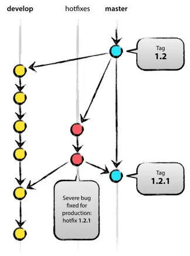

# 一个成功的 Git 分支模型



- 原作者: Vincent Driessen
- 转载自: [https://nvie.com/posts/a-successful-git-branching-model/](https://nvie.com/posts/a-successful-git-branching-model/)


在这篇文章中，我将向你们介绍一个开发模型，早在差不多一年前，我已经将这个模型应用于我的多个项目，而事实证明，这个模型是非常成功的。其实这篇文章我早就打算写了，只是一直没有时间，直到现在。在这篇文章中我将不会谈及任何项目细节，分支策略和发布管理才是本文的核心内容。

<!--more-->


## 为什么是 Git

如果去深入地探讨网络上关于 Git 优缺点的分析，以及 Git 与其他的中心化源代码控制系统的对比，你就可以发现，大家对此都持有自己的观点和看法。就我而言，作为一名开发者，相比其他所有的同类工具，我都更喜爱 Git。毫不过分地说，Git 彻底地改变了我们开发者对于合并和分支操作的看法和感受。我作为一名从传统 CVS/SVN 转到 Git 的开发者，可以说曾经的合并和分支操作总是让人觉得有点可怕（每当合并过程产生了冲突，总让人感到害怕），并且也是一个短期内使用频率很低的操作。

但是来到 Git 这边，情况就完全不一样了。合并和分支操作作为 Git 当中简单轻松的操作，在开发者的日常工作流中往往是核心部分之一。这一点从两者的相关书籍中就可以看出，在 CVS/SVN 的书籍中，合并和分支往往在最后的章节（进阶部分）才抛头露面，而在几乎所有的 Git 书籍中，合并和分支则是在第三章（基础部分）就已经讨论过了。

正是由于这样的简单性与重复性，分支与合并再也不是什么令人害怕的东西了，版本控制工具也成功地成为了合并与分支管理的最佳助手。

讨论够了相关工具，下面就让我们开始进入开发模型的相关内容吧！我接下来介绍的开发模型，需要团队当中所有的开发人员共同遵循，以便使得软件管理可以进入正确的进程。

## 去中心化的中心化

使用我们这一分支模型的存储库有一个共同的特点，那就是它们都有一个“真正”的中心存储库，但是要注意的是，这个存储库所谓的中心仅仅是我们假想的（Git 作为一个去中心化的版本控制系统，在技术层面上来说并不存在所谓的中心），而这个中心存储库，正是为我们 Git 使用者们所熟知的 origin 存储库。


每一个开发者都围绕着 origin 存储库进行着 pull 和 push 操作，这显示出了 origin 存储库的中心性，但是除此之外，每个开发人员都可以从其它对等方拉取他们的更改来组成子团队，这在开发人员过早地将自己进行的工作推送到主分支上之前，与两个或更多的开发者共同完成一个较大的新功能时是很有用的。正如上图所示，这几个开发成员之间可以很自然地形成很小的子团队： Alice 和 Bob，Alice 和 David，以及 Clair 和 David。

在技术层面上，这就好比 Alice 除了自己的存储库，还定义了一个名为 bob 的远程 Git，并且指向了 Bob 的存储库，反之亦然。

## 主要分支（The main branches）

我所要介绍的开发模型，其核心是在许多现有模型的启发下诞生的。我们模型的中心存储库，具有两条主要分支，这两条分支的生命线贯穿了我们整个存储库诞生和消亡，他们分别是：

- master
- develop


在 origin 存储库中的 master 分支应当是面向所有 Git 用户的，在它旁边的另一条分支我们称之为 develop 分支。

在任何时候，origin/master 分支的 HEAD（最前端）所指向的源代码都应该处于可使用的、产品级的状态。

而 origin/develop 分支的 HEAD 则应指向开发人员为下一次发布版所做更改的最新源代码。有些人也称这一分支为 “integration branch（集成分支）”，所有的夜间自动构建正是从这一分支构建而来。

当 develop 分支中的代码逐渐完善，达到了足够稳定、可以准备发布的程度时，所有的修改就可以准备合并回 master 分支，打标签和发布版本号了。具体隐含在其中的内部细节将在后面谈及。

正如你所看到的，每当所做的修改完成了一次向 master 分支的合并请求，也就意味着一个全新的版本被定义和发布了。因此，我们往往对这一合并有着非常严格的要求，以至于我们会去使用一个名为 Git hook 的脚本，每当我们执行了一次面向 master 的 commit，都去全自动地构建与测试我们的软件，并将其部署到产品服务器上。

## 支撑分支（Supporting branches）

紧挨着主要分支 master 和 develop，我们的开发模型引入了许多的支撑分支用于实现多个团队成员之间的平行开发、轻松地进行新功能的跟踪、产品发布版的准备以及协助快速修复线上产品的已知问题。不同于主要分支，这些支撑分支的生命周期都是很有限的，这就意味着当它们的使命完成后，其对应的分支就将被彻底地移除。

我们经常使用的支撑分支有以下几种：

- Feature branches: 新功能分支
- Release branches: 发布分支
- Hotfix branches: 热修复分支

这些不同类型的分支都有着属于自己的使命，并且都受着各自分支规则的严格约束，例如有哪些分支才能够成为它们的源分支，又有哪些分支才是它们执行合并的目标分支等。接下来我们就花上几分钟的时间，来具体讨论一下这些分支各自的意义和相关规则。

另外提一点，其实在技术层面上来讲，并不存在什么“特殊”的分支，这些分支类型和标签仅仅是我们自己定义的，取决于我们自己想要如何使用它，在最原始的层面上来说，他们都只是普通的 Git 分支而已。

### Feature branches（新功能分支）

- 可能的源分支：develop
- 严格指定的合并分支：develop
- 分支命名规范：所有除了 `master`, `develop`, `release-*`, `hotfix-*` 的形式均可。

所有的 feature 分支（也有人称之为 topic branches，主题分支）都是用于开发下一个发布版的新功能，或是某个目标版本的新功能的，因为每当你开始了一个新功能的开发工作，这个功能究竟会在哪个版本当中发布，你或许并不能确定。一个 feature 分支在本质上其生命周期等同于这个功能的开发时长，但是最终并不一定会被合并到 develop 分支中（即成为下一个发布版本中的新特性），也可能由于测试的效果不理想而被直接抛弃。

Feature 分支通常只存在于软件开发者们的版本库中，而不会出现在 origin 版本库中。


#### 创建一个 feature 分支

当我们要开始着手一个新功能的开发时，首先应当从 develop 分支拆出一个新的分支，作为我们新功能开发的 feature 分支。

```sh
$ git checkout -b myfeature develop
Switched to a new branch "myfeature"
```

#### 将开发完成的 feature 分支合并到 develop 分支中

已经完成开发的新功能或许需要合并到 develop 分支中，成为下一个发布版本当的新功能之一：

```sh
$ git check out develop
Switched to branch 'develop'
$ git merge --no-ff myfeature
Updating ea1b82a..05e9557
(Summary of changes)
$ git branch -d myfeatrue
Deleted branch myfeature (was 05e9557).
$ git push origin develop
```

合并中的 —no—ff 标记可以强制为合并操作创建一个新的 commit 对象，将所有原来属于 feature 分支的 commit 记录打包进这个新的 commit 对象中，进而避免 Git 采用 fast-forward 方式进行分支合并，直接将 develop 指向 feature 造成原本属于 feature 分支上 commit 记录丢失（译注：也就是分不出哪些 commit 是原属于 feature 分支上的 commit 了），下面是采用 —no—ff 与 fast-forward 方式进行合并的对比图。


在图中右边那种情况中，一旦完成合并，你将再也无法从 develop 的 Git 记录中分辨出哪些 commit 是来自 feature 分支中提交的修改和增加的新功能了，这意味着如果你想要找出这些 feature 的提交内容，你必须一条一条地在所有提交历史中去找到对应的提交记录。而在这种合并模式下，如果想要撤销整个新功能，那就够你头疼的了。如果你使用了 —no—ff 就可以完全避免这种合并，并且可以轻松地回退。

当然，这样的话将会创建一些空的 commit 对象，但是其带来的益处将远远超过多创建几个 commit 付出的代价。

### Release branches（发布分支）

- 可能的源分支：develop
- 严格指定的合并分支：develop 和 master
- 分支命名规范：`release-*`

Release 分支用于为即将发布的新版本做发布前的一些准备工作，你可以在 release 分支中为新版本的发布做最后的检查，以确保所有微小的细节都是完整且正确的。此外，你也可以在 release 分支中最后修补一些小bug，以及准备发布版的一些元数据（例如版本号、构建日期等）。当这些工作全部完成后，原来的 develop 分支也就准备好接收下一轮大更新的 feature 提交了。

从 develop 分支中拆分出一个 release 分支的合适时机在于，当开发已经（近乎完全）呈现出新版本所期待的状态时，至少新版本中所期望的全部功能应当完成了向 develop 分支的合并。当然，所有计划在未来（更后期）的版本中才发布的 feature 不应被合并，它们至少需要等到 develop 已经为马上到来的下一次更新分出用于发布准备的 release 分支后再请求合并。

另一个标志是，当即将发布的新版本被分配好了版本号时，就可以成为 release 分支的开始，至少这个起始点不应出现在版本号被分配之前。因为在那之前， develop 分支虽然展现出了为 “下一次发布版” 所做出的更改，但其实并不清楚这个所谓的 “下一次发布版” 最终会是 0.3 还是 1.0，直到 release 分支启动，才能够完全确定。也就是说，版本号的决定应在 release 分支的开始时做出，并遵循项目自身的版本号规则。

#### 创建一个 release 分支

Release 分支是从 develop 分支创建而来的。举个例子，产品当前的发布版本号是 1.1.5，并且接下来将有一次大的发布版更新。此时， develop 分支已经为 “下一次发布” 做好了准备，并且我们也决定好了下一个版本号是 1.2（而不是 1.1.6 或 2.0），此时，我们就可以开始创建分支，并根据新的版本号给出 release 分支的名称了：

```sh
$ git checkout -b release-1.2 develop
Switched to a new branch "release-1.2"
$ ./bump-version.sh 1.2
Files modified successfully, version bumped to 1.2.
$ git commit -a -m "Bumped version number to 1.2"
[release-1.2 74d9424] Bumped version number to 1.2
1 files changed, 1 insertions(+), 1 deletions(-)
```

在此，我们创建了一个新的分支并切换过去修改了版本号。这里的 bump-version.sh 是一个虚拟的shell脚本（fictional shell script），用于修改工作副本中的一些文件以反映新版本。（当然，你也可以手动去做相关的修改）然后我们就将新的版本号 commit 了。

这个新的分支将会存在一小段时间，直到这个新版本被完全发布为止。在此期间，一些bug的修复工作就可以直接在这个 release 分支上进行了（而不是又返回 develop 分支去修复）。但是注意，这并不意味着你可以在这个 release 分支上去写新的 feature，因为正如之前所讲的，feature 必须合并到 develop 分支上，因此如果在 release 分支中又有了其它新功能的想法，就忍一忍，把它们留到下一次发布吧。

#### 完成 release 分支

当一个 release 分支已经达到了真正可以 release 的状态时，我们就要开展相关的工作了。首先要明确，我们的 release 分支要合并到 master 分支上（务必时刻牢记，每一个面向 master 的 commit 都代表着一个新版本的发布）。接下来，为向 master 发起的 commit 打上对应的 tag。最后，别忘了将 release 分支上做出的更改和变动合并回 develop 分支，以确保在以后的发布版中不会复现当前这个 release 分支上已经修复过的问题。

前两步的 Git 操作如下：

```sh
$ git checkout master
Switched to branche 'master'
$ git merge --no--ff release-1.2
Merge made by recursive
(Summaru pf changes)
$ git tag -a 1.2
```

> 校订：你也可以使用 -s 或 -u 标记对标签进行加密签名。

至此新版本发布就完成了，并且留下了标签以为将来备查。为了将 release 分支上所做的所有修改保留到以后的版本中，我们还需要将 release 分支合并回 develop 分支：

```sh
$ git checkout develop
Switched to branch 'develop'
$ git merge --no-ff release-1.2
Merge made by recursive
(Summary of changes)
```

上面的操作有可能会产生合并冲突，如果有的话那就处理一下然后提交就好了。

至此，release 分支的使命就完成了，下面我们就可以将其移除：

```sh
$ git branch -d release-1.2
Delete branch release-1.2 (was ff452fe)
```

### Hotfix Branches（热修复分支）

- 可能的源分支：master
- 严格指定的合并分支：develop 和 master
- 分支命名规范：hotfix-*

Hotfix 分支和 release 分支非常相像，它们都是为新版本发布而准备的分支，只不过 hotfix 分支并不是预先计划好的。当线上版本突然出现了某些非预期的问题，并且迫切需要得到修复时，就要启用 hotfix 分支了，而且 hotfix 分支的版本标识应当基于当前的 master 分支版本号。



启用一条独立 hotfix 分支的好处在于，当一个开发者在准备线上产品的紧急修复时，完全不会影响到团队当中其它成员（例如在 develop 分支上开发新功能的成员）的工作。

#### 创建一个 hotfix 分支

Hotfix 分支应当从 master 分支而来。在此我们举一个具体的例子吧，比如说当前的线上版本号是 1.2，而此时这个线上发布版由于相关服务的漏洞而产生了很严重的问题，但是此时的 develop 分支上还在开发新的功能，并且也完全还没达到准备好可以发布的状态，此时我们就要从当前运行的 master 分支中拆出一条热修复分支，针对当前的线上版本来修复相关问题了：

```sh
$ git checkout -b hotfix-1.2.1 master
Switched to a new branch "hotfix-1.2.1"
$ ./bump-version.sh 1.2.1
Files modified successfully, version bumped to 1.2.1
$ git commit -a -m "Bumped version number to 1.2.1"
[hotfix-1.2.1 41e61bb] Bumped version number to 1.2.1
1 files changed, 1 insertions(+), 1 deletions(1)
```

创建 hotfix 分支后别忘了更新版本号！接下来就可以开展修复工作了，修复过程中有可能会提交一个或多个 commit。

```sh
$ git commit -m "Fixed server production problem"
[hotfix-1.2.1 abbe5d6] Fixed server production problem
5 files changed, 32 insertions(+), 19 deletions(-)
```

#### 完成 hotfix 分支

当 hotfix 分支的相关工作做的差不多了，就可以准备将修复结果合并回 master 分支了，但是可别忘了，这些修复也必须要合并到 develop 分支上！否则 develop 分支没有得到更新，下一个发布版本中又会出现相同的问题。这个过程其实和 release 分支的收尾工作是完全一致的。

首先，我们先更新 master 分支并指定发布版本号。

```sh
$ git checkout master
Switched to branch 'master'
$ git merge --no-ff hotfix-1.2.1
Merge made by recursive.
(Summary of changes)
$ git tag -a 1.2.1
```
> 校订：你也可以使用 -s 或 -u 标记对标签进行加密签名。

接下来，将修复的内容也合并到 develop 分支上：

```sh
$ git checkout develop
Swiched to branch 'develop'
$ git merge --no--ff hotfix-1.2.1
Merge made by resursive.
(Summary of changes)
```

这里有一点需要特别注意，如果在 hotfix 分支完工的时刻存在 release 分支，那么你应该将修复合并到 release 分支中，而不是 develop 分支，因为 release 分支在完成的时候也会合并到 develop 分支上，因此直接 merge 到 release 上即可。（当然，如果热修复所针对的问题影响到了当下 develop 分支上的开发，没法等到 release 分支合并的那天，现在就得赶紧得到修复时，将 hotfix 分支直接合并回 develop 也是可以的。）

最后，hotfix 分支就可以被移除了：

```sh
$ git branch -d hotfix-1.2.1
Deleted branched hotfix-1.2.1 (was abbe5d6)
```

## 总结

介绍完了这个分支模型，你会发现其实也没有什么令人称奇和大开眼界的地方，本文所讲述的模型在文章最开始的那张大图中有很清晰的展示，在大多数时候你参考那张图片就好了，它确实对我们的项目管理很有用，图示简洁优雅地阐述了这个分支模型，能够很好地帮助你的团队成员理解模型，并且在项目的分支管理和发布进程上达成一致的认识。

## 反思笔记（2020年3月5日）

这个模型是在2010年构思的，现在是10多年前，也就是Git本身诞生后不久。在这10年里，git-flow（本文中介绍的分支模型）在许多软件团队中变得非常流行，以至于人们开始将其视为某种标准——但不幸的是，它也是一种教条或灵丹妙药。

在这10年里， Git本身在全球掀起了一场风暴。使用Git开发的最流行的软件类型正在更多地转向网络应用——至少在我的过滤气泡中是这样。网络应用通常是持续交付的，而不是回滚的，你不必支持软件的多个运行版本。

这不是我10年前写博客时想到的软件类别。如果您的团队正在持续交付软件， 我建议采用更简单的工作流程(如[GitHub流程](https://docs.github.com/en/get-started/quickstart/github-flow))，而不是试图将git-flow硬塞进入您的团队。

但是，如果您正在构建明确版本化的软件，或者如果您需要支持软件的多个版本，那么git-flow可能仍然像过去10年一样适合您的团队。在这种情况下，请继续阅读。

总之，永远记住灵丹妙药是不存在的。考虑你自己的背景。不要恨。自己决定。

