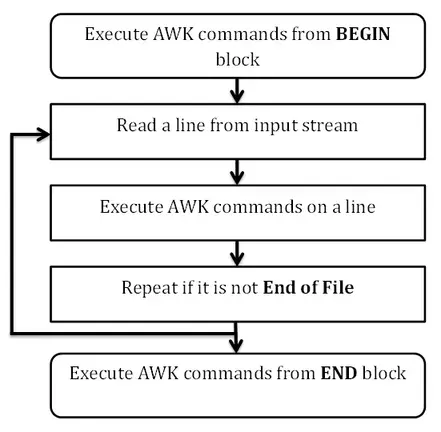

# linux命令awk

Awk的基本功能就是查找具某种模式的文本行（或者其他单位的文本）。当匹配某个模式后，awk会对该行执行指定的动作。Awk然后继续输入行，直到文件输入处理完毕。

<!--more-->

## quick start

awk 命令的大致结构如下:

```sh
awk 'program' inputfile1 inputfile2 inputfile3 ...
## 也可以运行awk程序，不带输入文件
awk 'program'  
## awk会使程序导向到标准输入,直到你输入Ctrl-d 来表示‘end-of-file’
## 在非POSIX 操作系统中，‘end-of-file’有可能不同，如在OS/2 中则是Ctrl-z
```

注意，awk是标准的管道, 如果 'program' 中没有和输入有关的逻辑，awk是不会读取输入的.例如: 

- `awk 'BEGIN { print "Hello World!" }'` 不会读取任何输入。  
-  `awk '{print}'`  会持续读取输入，直到 Ctrl-d

如果awk 程序的程序很长，那么可以使用文件中的代码来执行awk

```sh
awk -f program-file inputfile1 inputfile2 inputfile3 ...
```

举个例子：

1. 创建文件hello

```sh
#! /bin/awk -f
BEGIN { print "Hello World!" }
```
2. 使用awk文件

```sh
$ awk -f hello
Hello World!
```

也可以直接对脚本赋权 `chmod +x hello`，然后就可以直接执行 hello。

> awk不仅是shell命令，还是一门脚本语言！

## awk基础

awk常用于解析结构化的数据，特别是CSV like结构。

```
Beth 4.00 0
Dan 3.75 0
Kathy 4.00 10
Mark 5.00 20
Mary 5.50 22
Susie 4.25 18
```

awk 的数据只有两种类型: 数值与由字符组成的字符串。awk 从输入中每次读取一行, 将行分解为一个个的字段 (默认将字段看作是非空白字符组成的序列)。当前输入行的第一个字段叫作 `$1`, 第二个是 `$2`, 依次类推. 一整行记为 `$0`. 每行的字段数有可能不一样。

awk默认列直接的间隔是空格(多个空格或制表符认为是一个间隔)。

```sh
$ printf "1      2 3" |awk '{print $1,$2,$3}'
1 2 3
```

对于非空格隔开的场景，awk也支持通过`-F`自定义间隔字符。

```sh
$ printf "1,2,3" |awk -F ',' '{print $1,$2,$3}'
1 2 3
## 注意多个间隔字符的区别
$ printf "1,,2,3" |awk -F ',' '{print $1,$2,$3}'
1  2
```

### 数组

Awk 提供了一维数组, 用于存放字符串与数值. 数组与数组元素都不需要事先声明, 也不需要说明数组中有多少个元素. 就像变量一样, 当被提及时, 数组元素就会被创建, 数组元素的默认初始值为 0 或空字符串 "".

```awk
## 将当前输入行赋值给数组 x 的元素 NR.
## NR是内建变量
x[NR] = $0
```

Awk 的数组与大多数其他语言最大的不同点是, 数组元素的下标是字符串. 这个特性使得 awk 具有了一种能力, 关联数组 (associative arrays)「类似Map的实现」。

为了判断某个特定的下标是否出现在数组中, 可以这样写:

```awk
subscript in A
```

如果 `A[subscript]` 已经存在, 那么这个表达式 的值为 1, 否则为 0. 所以, 为了测试 Africa 是否是数组 pop 的一个下标, 可以这样写:

```awk
if ("Africa" in pop)
```

一个数组元素可以通过 `delete array[subscript]`删除.

Awk 不直接支持多维数组, 但是它利用一维数组来近似模拟多维数组. 虽然你可以写出像 i, j 或 s, p, q, r 这样的多维数组下标, 实际上 awk 会将它们都拼接起来 (下标之间用一个分隔符分开), 合成一个单独的下标. 例如:

```
for (i = 1; i <= 10; i++)
  for (j = 1; j <= 10; j++)
    arr[i, j] = 0
```
创建了一个具有 100 个元素的数组, 下标具有形式 1,1 ，1,2 等等. 在 awk 内部, 下标其实是以字符串的形式存储的, 字符串具有形式 1 SUBSEP 1, 1 SUBSEP 2 等等. 内建变量 SUBSEP 用于分隔下标的各个构成成分, 它的默认值是 "\034", 而不是逗号, 之所以使用 "\034" 是因为这个字符不太可能出现在通常的文本中.

为了测试一个多维下标是否是某个数组的成员, 我们需要将下标用括号括起来, 例如

```
if ((i,j) in arr) ...
```

为了遍历一个这样的数组, 可以这样写:

```awk
for (k in arr) ...

#如果需要单独地访问下标的某个成分, 可以使用 split 函数
split(k, x, SUBSEP)
```
> 注意: 数组的元素不能再是数组.

### 内建变量

|变量|意义|默认值|
|:---|:---|:---|
|ARGC|命令行参数的个数|-|
|ARGV|命令行参数数组|-|
|FILENAME |当前输入文件名| -|
|FNR |当前输入文件的记录个数| -|
|FS |控制着输入行的字段分割符 |" "|
|NF |当前记录的字段个数 |-|
|NR |到目前为止读的记录数量| -|
|OFMT |数值的输出格式 |"%.6g"|
|OFS |输出字段分割符 |" "|
|ORS |输出的记录的分割符 |"\n"|
|RLENGTH |被函数 match 匹配的字符串的长度 |-|
|RS| 控制着输入行的记录分割符 |"\n"|
|RSTART |被函数 match 匹配的字符串的开始||
|SUBSEP |下标分割符| "\034|

## awk语言

上面介绍了awk实际上是一门脚本语言，本节将深入介绍awk脚本语言。

awk program的标准结构是由多个模式–动作语句构成的序列。

```
pattern { action }; pattern { action } # comment
pattern { action } # comment
```

- 模式–动作语句, 以及动作内的语句通常用换行符分隔, 但是若干条语句也可以出现在同一行, 只要它们之间用分号分开即可. 分号可以放在任何语句的末尾。
- 动作的左花括号必须与它的模式在同一行; 而剩下的部分, 包括右花括号, 则可以出现在下
面几行.
- 空行会被忽略; 它们可以插入在语句之前或之后, 用于提高程序的可读性. 空格与制表符可
以出现在运算符与操作数的周围, 同样也是为了提高可读性.
- 注释可以出现在任意一行的末尾. 一个注释以井号 (#) 开始, 以换行符结束

在某些语句中, 模式可以不存在; 还有些语句, 动作及其包围它的花括号也可以不存在. 如果程序经过 awk 检查后没有发现语法错误, 它就会每次读取一个输入行, 对读取到的每一行, 按顺序检查每一个模式。 对每一个与当前行匹配的模式, 对应的动作就会执行。 缺失的模式匹配每一个输入行, 因此每一个不带有模式的动作对每一个输入行都会执行。只含有模式而没有动作的语句, 则会打印每一个匹配模式的输入行。



> begin和end是特殊的模式，具体见下一小节模式

### 模式

模式控制着动作的执行: 当模式匹配时, 相应的动作便会执行. 这一小节描述模式的 6 种类
型, 以及匹配它们的条件。

- `BEGIN{ statements}`：在输入被读取之前, statements 执行一次
- `END{ statements}`：当所有输入被读取完毕之后, statements 执行一次
- `expression{ statements}`：每碰到一个使 expression 为真的输入行, statements 就执行. expression 为真指的是其值非零或非空.
- `/regular expression/ { statements}`： 碰到被 regular expression 匹配的一个输入行时, statements 就执行。测试一个字符串是否包含一段可以被正则表达式匹配的子字符串。
- `compound pattern { statements}`：将表达式用 &&(AND), ||(OR), !(NOT), 以及括号组合成一个复合模式; 当 compound pattern 为真时, statements 执行.
- pattern1, pattern2 { statements}: 范围模式匹配多个输入行, 这些输入行从匹配pattern1 的行开始, 到匹配 pattern2的行结束 (包括这两行), 对这其中的每一行执行 statements.

注意事项:

- BEGIN 与 END 不与其他模式组合,且 BEGIN 与 END是唯一两个不能省略动作的模式.
- 一个范围模式不能是其他模式的一部分. pattern1 与 pattern2 可以匹配相同行。

#### begin & end 模式

BEGIN 与 END 这两个模式不匹配任何输入行. 实际情况是, 当 awk 从输入读取数据之前,BEGIN 的语句开始执行; 当所有输入数据被读取完毕, END 的语句开始执行. 于是, BEGIN 与
END 分别提供了一种控制初始化与扫尾的方式. 

BEGIN 与 END 不能与其他模式作组合. 如果有多个 BEGIN, 与其关联的动作会按照它们在程序中出现的顺序执行, 这种行为对多个 END 同样适用. 我们通常将 BEGIN 放在程序开头, 将 END 放在程序末尾。

BEGIN 的一个常见用途是更改输入行被分割为字段的默认方式. 分割字符由一个内建变量FS 控制. 默认情况下字段由空格或 (和) 制表符分割, 此时 FS 的值被设置为一个空格符. 将 FS 设置成一个非空格字符, 就会使该字符成为字段分割符.

#### 表达式模式

任意一个表达式都可以用作任意一个运算符的操作数. 如果一个表达式拥有一个数值形式的值, 而运算符要求一个字符串值, 那么该数值会自动转换成字符串, 类似地, 当运算符要求 一个数值时, 字符串被自动转换成数字。

任意一个表达式都可以当作模式来使用. 如果一个作为模式使用的表达式, 对当前输入行的
求值结果非零或不为空, 那么该模式就匹配该行. 典型的表达式模式是那些涉及到数值或字符串
比较的表达式，例如:

|运算符|意义|
|:---|:---|
|<|小于|
|<=|小于或等于|
|==|等于|
|!=|不等于|
|>=|大于或等于|
|>|大于|
|~|匹配|
|!~|不匹配|

```sh
## Print line number 12 of file.txt
awk 'NR==12' file.txt

## Print only lines that do not match regex in file.txt
awk '!/regex/' file.txt

## Print any line where field 2 is equal to "foo" in file.txt
awk '$2 == "foo"' file.txt

## Print lines where field 2 is NOT equal to "foo" in file.txt
awk '$2 != "foo"' file.txt

## Print line if field 1 matches regex in file.txt
awk '$1 ~ /regex/' file.txt

## Print line if field 1 does NOT match regex in file.txt
awk '$1 !~ /regex/' file.txt
```

数字类型的比较是按照数值大小进行比较，而字符串的比较是以字符为单位逐个相比, 字符间的先后顺序依赖于机器的字符集 (大多数情况下是 ASCII 字符集).一个字符串 “小于” 另一个, 指的是它比另一个字符串更早出现, 例如 "Canada" < "China".  

> 注意，只有当两个字段都是数值时, 比较才会以数值的形式进行。  

#### 复合模式

复合模式是一个组合了其他模式的表达式, 通过括号, 逻辑运算符 ||(OR), &&(AND),
!(NOT) 进行组合. 如果表达式的值为真, 那么复合模式就匹配当前输入行。例如：

```sh
$4 == "Asia" && $3 > 500
$4 == "Asia" || $4 == "Europe"
```

运算符 || 优先级最低, 再往高是 &&, 最高的是 !. && 与 || 从左至右计算操作数的值, 一旦已经知道整个表达式的值, 计算便停止（短路）.

#### 范围模式

一个范围模式由两个被逗号分开的模式组成。

```sh
pat1,pat2
```
范围模式匹配多个输入行, 这些输入行从匹配 pat1的行开始, 到匹配 pat2 的行结束, 包括这两行; pat2 可以与 pat1 匹配到同一行, 这时候模式的范围大小就退化到了一行.

一旦范围的第一个模式匹配到了某个输入行, 那么整个范围模式的匹配就开始了; 如果范围模式的第二个模式一直都没有匹配到某个输入行, 那么范围模式会一直匹配到输入结束.


### 动作

在一个 模式–动作 语句中, 模式决定动作什么时候执行. 有时候动作会非常简单: 一条单独的打印语句或赋值语句. 在有些时候, 动作有可能是多条语句, 语句之间用换行符或分号分开。

动作中的语句可以包括:
- expression, 包括常量, 变量, 赋值, 函数调用等等.
- print expression-list
- printf(format, expression-list)
- if (expression) statements
- if (expression) statements else statements
- while (expression) statements
- for (expression; expression; expression) statements
- for (expression in array) statements
- do statements while (expression)
- break
- continue

#### 值

- 常量 (Constants). Awk 中只有两种类型的常量: 字符串与数值.
  -  将一个字符序列用一对双引号包围起来就创建了一个字符串常量, 正如 "Asia", 或 "hello, world" 或 "". 
  - 一个数值常量可以是一个整数, 就像 1127, 或十进制小数, 3.14, 或者是用科学计数法表示的数: 0.707E-1. 同一个数的不同表示法都拥有相同的值: 1e6, 1.00E6, 10e5, 0.1e7 与1000000 都表示同一个数. 所有的数都用浮点格式存储, 浮点数的精度依赖于机器。
- 变量 (Variables). 表达式可以包含若干种类型的变量: 用户定义的, 内建的, 或字段. 用户定义的变量名字由数字, 字母与下划线构成, 但是名字不能以数字开始. 所有内建变量的名字都只由大写字母组成.
  - 每一个变量都有一个值, 这个值可以是字符串或数值, 或两者都是. 一个未初始化的变量的值是 "" (空字符串) 与 0
  - 因为变量的类型不需要事先声明, 所以 awk 需要根据上下文环境推断出变量的类型. 当需要时, awk 可以把字符串转化为数值, 或反之.
  - 内建变量 (Built-In Variables)在上面的下节中有列出。
  - 字段变量 (Field Variables)就是`$1`,`$2`这种方式引用的字段。字段变量也可以被赋值修改。值得注意的是: 如果 `$0`发生了 改变 (通过赋值或替换), 那么 `$1`, `$2` 等等, 以及 NF 就会被重新计算; 同样的道理, 当 `$1`,`$2` 等被修改了, `$0` 就会被重新构造。字段也可以通过表达式指定. 例如, $(NF-1) 表示当前输入行的倒数第 2 个字段. 表达式两边的括号不能省略: $NF-1 表示最后一个字段减 1 后的值.

有两种惯用语法可以将表达式从一种类型转换成另一种类型:
- number "" 将空字符串拼接到 number 可以将它强制转换成字符串
- string + 0 给字符串加上零可以把它强制转换成数值  

#### 操作符

|操作|运算符|例子|例子的含义|
|:---|:---|:---|:---|
|赋值 |= += -= *= /= %= ^= |x *= 2|x = x * 2|
|条件表达式|?: |x ? y : z| 若 x 为真, 则 y, 否则 z|
|逻辑或|&#124;&#124;| x &#124;&#124; y| 若 x 或 y 为真, 则为 1, 否则为 0|
|逻辑与| &&| x && y |若 x 与 y 都为真, 则为 1, 否则为 0
|数组成员| in| i in a |如果 a[i] 存在, 则为 1, 否则为 0|
|匹配 |~ !~ |$1 ~ /x/| 如果第一个字段包含 x, 则为 1, 否则为 0|
|关系运算 |< <= == != >= > |x == y| 如果 x 等于 y, 则为 1, 否则为 0
|拼接 ||"a" "bc" "abc";| 不存在显式的拼接运算符|
|减法, 加法| + -| x + y |x 与 y 的和
|乘法, 除法, 取模| * / % |x % y x 除以 y 的余数
|单目加, 单目减 |+ -| -x |x 的相反数
|逻辑非 |! |!$1| 若 $1 为空或为 0, 则为 1, 否则为 0|
|指数运算|^| x ^ y| x的y次方|
|自增, 自减 |++ -- |++x, x++ |为 x 加 1
|字段 |$ |$i+1 |1 加上第 i 个字段的值
|组合 |( ) |($i+1)++ |给第 i+1 个字段的值加 1|

运算符按照优先级的升序排列. 优先级高的运算符优先求值; 举例来说, 乘法运算在加法运算之前求值. 所有的运算符都是左结合的, 除了赋值运算符, 条件运算符, 指数运算 — 它们都是右结合的. 左结合性意味着相同优先级的运算符按照从左到右的顺序进行运算; 

因为没有显式的拼接运算符, 所以比较明智的做法是, 在拼接运算中, 将涉及到其他运算的表达式用括号包围起来.

#### 内建函数

|类型|函数|返回值|
|:---|:---|:---|
|算术|atan2(y,x)|y/x 的反正切值, 定义域在 −π 到 π 之间|
|算术|cos(x) |x 的余弦值, x 以弧度为单位|
|算术|exp(x) |x 的指数函数, e^x|
|算术|int(x)|x 的整数部分; 当 x 大于 0 时, 向 0 取整|
|算术|log(x)|x 的自然对数 (以 e 为底)|
|算术|rand() |返回一个随机数 r, 0 ≤ r < 1|
|算术|sin(x) |x 的正弦值, x 以弧度为单位.|
|算术|sqrt(x) |x 的方根|
|算术|srand(x)|x 是 rand() 的新的随机数种子|
|字符串|gsub(r,s) |将 $0 中所有出现的 r 替换为 s, 返回替换发生的次数.|
|字符串|gsub(r,s,t )|将字符串 t 中所有出现的 r 替换为 s, 返回替换发生的次数|
|字符串|index(s,t)| 返回字符串 t 在 s 中第一次出现的位置, 如果 t 没有出现的话, 返回 0.|
|字符串|length(s)| 返回 s 包含的字符个数|
|字符串|match(s,r) |测试 s 是否包含能被 r 匹配的子串, 返回子串的起始位置或 0; 设置 RSTART 与 RLENGTH|
|字符串|split(s,a)| 用 FS 将 s 分割到数组 a 中, 返回字段的个数|
|字符串|split(s,a,fs) |用 fs 分割 s 到数组 a 中, 返回字段的个数|
|字符串|sprintf(fmt,expr-list) |根据格式字符串 fmt 返回格式化后的 expr-list|
|字符串|sub(r,s) |将 $0 的最左最长的, 能被 r 匹配的子字符串替换为 s, 返回替换发生的次数.|
|字符串|sub(r,s,t) |把 t 的最左最长的, 能被 r 匹配的子字符串替换为 s, 返回替换发生的次数.|
|字符串|substr(s,p) |返回 s 中从位置 p 开始的后缀.|
|字符串|substr(s,p,n) |返回 s 中从位置 p 开始的, 长度为 n 的子字符串.|

#### 空语句

单独一个分号表示一个空语句. 在下面这个程序里, for 的循环体是一个空语句.

```awk
BEGIN { FS = "\t" }
{ 
  for (i = 1; i <= NF && $i != ""; i++)
  ;
  if (i <= NF)
  print
}
```
这个程序打印所有的, 包含空字段的行。
### 流程控制

Awk 提供花括号用于语句组合, if-else 用于决策, while, for, do 语句用于循环, 所有这些都来源于 C 语言.
一条单独的语句总是可以被替换为一个被花括号包围起来的语句列表, 列表中的语句用换行符或分号分开, 换行符可以出现在任何左花括号之后, 也可以出现在任何右花括号之前.

#### if-else

```awk
## if-else 具有形式:
if (expression)
statements1
else
statements2
```

else statements2 是可选的. 右括号, statements1, 和关键词 else 后面的换行符是可选的.如果 else 与 statements1 出现在同一行, 并且 statements1 是一条单独的语句, 那么在 statements1 的末尾必须使用分号来终止语句.

```awk
if (e) s=1; else s=2
```

#### while

当条件为真时, while 就会重复执行语句。

```awk
while (expression)
  statements
```

例如:

```awk
{ 
  i = 1
  while (i <= NF) {
    print $i
    i++
  }
}
```

#### for

for 语句是 while 的更加一般的形式:

```awk
for (expression1;expression2;expression3)
  statements
```

例如:

```awk
{ 
  for (i = 1; i <= NF; i++)
    print $i
}
```

#### do-while

do 语句具有形式

```awk
do
  statements
while (expression)
```

#### 其他

有两种语句可以影响循环的运行: break 和 continue. 

- break 会导致控制流马上从包围着它的循环内退出, 循环可以是 while, for , 或 do. 
- continue 导致下一次迭代开始; 它使得执行流马上进入 while 与 do 的测试表达式, 或 for 的 expression3.

next 与 exit 控制用于读取输入行的外层循环. 

- next 使 awk 抓取下一个输入行, 然后从第一个 模式–动作 语句开始匹配模式.
- 在 END 动作里, exit 会导致程序终止, 在其他动作里,exit 会使得程序表现得就好像所有输入都读完了; 不再有输入会被读取, 并执行 END 动作 (如果有 END 的话)。如果 exit 语句包含一个表达式，awk 将 expression 的值作为程序的退出状态返回。

### 自定义函数

除了内建函数, awk 还可以包含用户定义的函数. 定义函数的语句具有形式:

```awk
function name(parameter-list) {
statements
}
```
一个函数定义可以出现在任何 模式–动作 语句可以出现的地方. 于是, awk 程序的通常形式就变成了一系列的, 由换行符或分号分开的 模式–动作 语句与函数定义.

函数体可能包含一个 return 语句, 用于将程序执行流返回至调用函数 (返回的时候可以带
有一个值). 它具有形式`return expression`。例如:

```awk
function max(m, n) {
  return m > n ? m : n
}
```

用户定义的函数可以在任何 模式–动作 语句的任何表达式中使用, 也可以在出现在任何函数体内. 每一个对函数的使用都叫做一个 调用 (call). 如果一个用户定义的函数在函数体内调用了它自身, 我们就说这个函数是 递归 (recursive) 的。

max 函数可以像这样调用:

```awk
{ print max($1, max($2, $3)) } 
function max(m, n) {
  return m > n ? m : n
}
```

> 注意: 调用函数时, 函数名与左括号之间不能留有空白.

一个带有参数 $1 的函数被调用时 ($1 只是一个普通的变量), 函数接收到的参数是变量的值的一份拷贝, 所以函数操作的是变量的拷贝, 而不是变量本身. 这意味着函数不会对函数体外部的变量的值产生影响. (用行话来说, 这样的变量叫做 “标量”, “按值传递” 给函数) 。

然而, 当数组作为函数的参数时, 函数接收到的参数就不是数组的拷贝, 所以函数可以改变数组元素, 或往数组增添新的值 (这叫作 “按引用传递”). 

在函数体内部, 参数是局部变量 — 它们只在函数执行时才存在, 而且它们与程序中其他同名的变量没有任何关联. 但是, 其他所有的变量都是全局的，如果函数体内的某个变量没有出现在参数列表中, 那么整个程序范围内都可以访问该变量.


### 输入&输出

awk通常的输入源是文件和管道输出。awk输入设置如下:

- awk使用输入分隔符FS区分字段(默认空格)，把一个字符串赋值给内建变量 FS 就可以改变字段分隔符. 如果字符串的长度多于一个字符, 那么它会被当成一个正则表达式. 
- awk使用记录分隔符RS来区分记录(默认换行符),如果 RS 被设置成空值，那么记录之间将由一个或多个的空行来分隔, 并且每个记录可以占据多行.当记录由多行组成时, 无论 FS 是什么值, 换行符总是字段分隔符之一.

函数 getline 可以从当前输入行, 或文件, 或管道, 读取输入. getline 抓取下一个记录,按照通常的方式把记录分割成一个个的字段. 它会设置 NF, NR, 和 FNR; 如果存在一个记录, 返回1, 若遇到文件末尾, 返回 0, 发生错误时返回 -1 (例如打开文件失败).

- 表达式 getline x 读取下一条记录到变量 x 中, 并递增 NR 与 FNR, 不会对记录进行分割,所以不会设置 NF。
- 表达式 `getline <"file"` 从文件 file 读取输入. 它不会对 NR 与 FNR 产生影响, 但是会执行字段分割, 并且设置 NF.
- 表达式 `getline x <"file"` 从 file 读取下一条记录, 存到变量 x 中. 记录不会被分割成字段, 变量 NF, NR, 与 FNR 都不会被修改.

|表达式|被设置的变量|
|:---|:---|
|getline|$0, NF, NR, FNR|
|getline var|var, NR, FNR|
|getline <file |$0, NF|
|getline var <file| var|
|cmd &#124; getline |$0, NF
|cmd &#124; getline var |var

print 与 printf（和C语言的Printf一致） 语句可以用来产生输出. print 用于产生简单的输出; printf 用于产
生格式化的输出. 来自 print 与 printf 的输出可以被重定向到文件, 管道与终端.

语句 close(expression) 关闭一个文件或管道, 文件或管道由 expression 指定; expression 的字符串值必须与最初用于创建文件或管道的字符串值相同. 例如:

```
printf("%15s\t%6d\n", c, pop[c]) | "sort -t'\t' +1rn"
close("sort -t'\t' +1rn")
```

关闭上面打开的排序管道.在同一个程序中, 如果你写了一个文件, 而待会儿想要读取它, 那么就需要调用 close. 某一时刻, 同时处于打开状态的文件或管道数量最大值由实现定义.

## 参考

- [1] [AWK程序设计语言](https://github.com/wuzhouhui/awk)
- [2] [gun.gawk](https://www.gnu.org/software/gawk/manual/gawk.htm)

