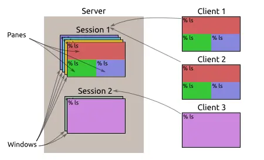

# linux命令tumx

命令行的典型使用方式是，打开一个终端窗口（terminal window，以下简称"窗口"），在里面输入命令。用户与计算机的这种临时的交互，称为一次"会话"（session）。

会话的一个重要特点是，窗口与其中启动的进程是连在一起的。打开窗口，会话开始；关闭窗口，会话结束，会话内部的进程也会随之终止，不管有没有运行完。

一个典型的例子就是，SSH 登录远程计算机，打开一个远程窗口执行命令。这时，网络突然断线，再次登录的时候，是找不回上一次执行的命令的。因为上一次 SSH 会话已经终止了，里面的进程也随之消失了。

为了解决这个问题，会话与窗口可以"解绑"：窗口关闭时，会话并不终止，而是继续运行，等到以后需要的时候，再让会话"绑定"其他窗口。

<!--more-->

## tldr

```sh
## Start a new session:
tmux

## Start a new named session:
tmux new -s name

## List existing sessions:
tmux ls

## Attach to the most recently used session:
tmux attach

## Detach from the current session (inside a tmux session):
Ctrl-B d

## Create a new window (inside a tmux session):
Ctrl-B c

## Switch between sessions and windows (inside a tmux session):
Ctrl-B w

## Kill a session by name:
tmux kill-session -t name
```

## usage 

> [tumx](https://github.com/tmux/tmux): Terminal multiplexer. It allows multiple sessions with windows, panes, and more.

Tmux 就是会话与窗口的"解绑"工具，通过C-S架构将它们彻底分离。



类似的终端复用器还有 GNU Screen。Tmux 与它功能相似，但是更易用，也更强大。


### 安装

```sh
## Ubuntu 或 Debian
$ sudo apt-get install tmux

## CentOS 或 Fedora
$ sudo yum install tmux

## Mac
$ brew install tmux
```

## 使用tmux


如图所示上面就是tmux的日常使用界面。

最下面是状态栏 ，状态栏左侧 `[test] 0:zsh* 1:vim~` 中test 是指session name，0是指session下的第一个window。`zsh*` 是窗口名。状态栏右侧是当前机器信息。

> Tmux 窗口有大量的快捷键。所有快捷键都要通过前缀键唤起。默认的前缀键是Ctrl+b，即先按下Ctrl+b，快捷键才会生效。举例来说，帮助命令的快捷键是Ctrl+b ?。它的用法是，在 Tmux 窗口中，先按下Ctrl+b，再按下?，就会显示帮助信息。

### 会话

```sh
## 新建会话
$ tmux

## 新建一个命名会话
$ tmux new -s <name>

## 查看当前所有tmux会话
$ tmux ls

## 接入最常使用的会话:
$ tmux attach

## 接入会话
## 命名
$ tmux attach -t <name>
## 使用编号
$ tmux attach -t 0

## 当前会话和窗口分离
$ tmux detach

## 杀死会话
## 命名
$ tmux kill-session -t <name>
## 编号
$ tmux kill-session -t 0

#重命名会话
$ tmux rename-session -t 0 <new-name>
```

除了会话命令，tmux在还支持一些会话快捷键。

```sh
Ctrl+b d：分离当前会话。
Ctrl+b s：列出所有会话。
Ctrl+b $：重命名当前会话。
```

### 窗口

tmux的session会默认有一个窗口。也就是窗口0。此外Tmux 也允许新建多个窗口。

```sh
## 新建窗口
$ tmux new-window

#新建一个指定名称的窗口
$ tmux new-window -n <window-name>

## 切换到指定编号的窗口
$ tmux select-window -t <window-number>

## 切换到指定名称的窗口
$ tmux select-window -t <window-name>

## 重命名窗口
$ tmux rename-window <new-name>

## 交换 3 号和 1 号窗口
$ tmux swap-window -s 3 -t 1
## 交换当前和 1 号窗口
$ tmux swap-window -t 1
## 移动当前窗口到 1 号
$ tmux  move-window -t 1
```

下面是一些窗口操作的快捷键。

```sh
Ctrl+b c #创建一个新窗口，状态栏会显示多个窗口的信息。
Ctrl+b p #切换到上一个窗口（按照状态栏上的顺序）。
Ctrl+b n #切换到下一个窗口。
Ctrl+b <number> # 切换到指定编号的窗口，其中的<number>是状态栏上的窗口编号。
Ctrl+b w #从列表中选择窗口。
Ctrl+b f # 从列表中查找窗口。
Ctrl+b , #窗口重命名。
Ctrl+b & # kill 窗口
Ctrl-b :swap-window -s [0-9] -t [0-9] #交换窗口
Ctrl-b : rename-window <new name> # 窗口重命名
```

### 窗格

Tmux 可以将窗口分成多个窗格（pane），每个窗格运行不同的命令。以下命令都是在 Tmux 窗口中执行。

```sh
## 划分上下两个窗格
$ tmux split-window -v
## 划分左右两个窗格
$ tmux split-window -h

## 光标切换到上方窗格
$ tmux select-pane -U
## 光标切换到下方窗格
$ tmux select-pane -D
## 光标切换到左边窗格
$ tmux select-pane -L
## 光标切换到右边窗格
$ tmux select-pane -R

## 当前窗格上移
$ tmux swap-pane -U
## 当前窗格下移
$ tmux swap-pane -D
```

下面是一些窗格的快捷键

```
`Ctrl+b %`：划分左右两个窗格。
`Ctrl+b "`：划分上下两个窗格。
`Ctrl+b <arrow key>`：光标切换到其他窗格。<arrow key>是指向要切换到的窗格的方向键，比如切换到下方窗格，就按方向键↓。
`Ctrl+b ;` ：光标切换到上一个窗格。
`Ctrl+b o` ：光标切换到下一个窗格。
`Ctrl+b {`：当前窗格与上一个窗格交换位置。
`Ctrl+b }`：当前窗格与下一个窗格交换位置。
`Ctrl+b Ctrl+o`：顺时针旋转当前窗口中的所有面板
`Ctrl+b Alt+o`：逆时针旋转当前窗口中的所有面板
`Ctrl+b x`：关闭当前窗格。
`Ctrl+b !`：将当前窗格拆分为一个独立窗口。
`Ctrl+b z`：当前窗格全屏显示，再使用一次会变回原来大小。
`Ctrl+b Ctrl+<arrow key>`：以1个单元格为单位调整当前面板边缘（Mac下被系统快捷键覆盖）
`Ctrl+b Alt+<arrow key>`：以5个单元格为单位调整当前面板边缘
`Ctrl+b q`：显示窗格编号。在编号消失前输入对应的数字可切换到相应的面板
`Ctrl+b t`: 显示时钟。
```

### 窗格同步操作

tmux 支持在窗口中的多个窗格同时输入，输入 Tmux 前缀(Ctrl+b)和一个冒号呼出命令提示行，然后输入`setw synchronize-panes`

```sh
Ctrl+b : setw synchronize-panes
```

可以指定同步窗格开或关，重复执行命令会在两者间切换。这个选项值针对某个窗口有效，不会影响别的会话和窗口。

#### 全部pane同步

在 `.tmux.conf` 中加上如下绑定键:

```sh
bind E command-prompt -p "Command:" \
       "run \"tmux list-panes -a -F '##{session_name}:##{window_index}.##{pane_index}' \
              | xargs -I PANE tmux send-keys -t PANE '%1' Enter\""
```

- 在任何窗格中键入`Ctrl+b E`
- 输入要发送到所有窗格的命令，回车结束

### 调整窗格尺寸
如果不喜欢默认布局，可以重调窗格的尺寸。这几个命令用来调整窗格(通过命令提示行方式修改)：

```sh
Ctrl+b : resize-pane -D          当前窗格向下扩大 1 格
Ctrl+b : resize-pane -U          当前窗格向上扩大 1 格
Ctrl+b : resize-pane -L          当前窗格向左扩大 1 格
Ctrl+b : resize-pane -R          当前窗格向右扩大 1 格
Ctrl+b : resize-pane -D 20       当前窗格向下扩大 20 格
Ctrl+b : resize-pane -t 2 -L 20  编号为 2 的窗格向左扩大 20 格
```

### 其他命令

```sh
## 列出所有快捷键，及其对应的 Tmux 命令
$ tmux list-keys

## 列出所有 Tmux 命令及其参数
$ tmux list-commands

## 列出当前所有 Tmux 会话的信息
$ tmux info

## 重新加载当前的 Tmux 配置
$ tmux source-file ~/.tmux.conf
```

## tumx 配置

相信只要你用过几次tmux，就会发现Ctrl+b指令前缀，着实不太方便。这两个键相距太远，按键成本太高了。因此我们首先需要将它更换为距离更近的Ctrl+a组合键，或者不常用的 ` 键（当然其他键也是可以的）。tmux的用户级配置文件为~/.tmux.conf（没有的话就创建一个）。


### 修改指令前缀

修改tmux指令前缀，只需要增加如下三行即可。

```sh
set -g prefix C-a #
unbind C-b # C-b即Ctrl+b键，unbind意味着解除绑定
bind C-a send-prefix # 绑定Ctrl+a为新的指令前缀

## 从tmux v1.6版起，支持设置第二个指令前缀
set-option -g prefix2 ` # 设置一个不常用的 ` 键作为指令前缀，按键更快些
```

### reload 配置

修改的~/.tmux.conf配置文件有如下两种方式可以令其生效：

```txt
1. restart tmux。
2. 在tmux窗口中，先按下Ctrl+b指令前缀，然后按下冒号 : ，进入到命令模式后输入source-file ~/.tmux.conf，回车后生效。
```

更为优雅的做法是新增一个加载配置文件的快捷指令 ，这样就可以随时随地load新的配置了，如下所示。

```sh
## 绑定快捷键为r
bind r source-file ~/.tmux.conf \; display-message "Config reloaded.."
```

### 新增面板

tmux中，使用最多的功能之一就是新增一个面板。水平方向新增面板的指令是 `Ctrl+b "` ，垂直方向是 `Ctrl+b  %`，" 和 %需要两个键同时按下才能完成，加上指令前缀至少需要3~4次按键才能组成一个完整的指令，同时这个两个键也不够醒目和方便，因此我们可以绑定两个更常用的指令 -、|，如下所示：

```sh
unbind '"'
bind - splitw -v -c '#{pane_current_path}' # 垂直方向新增面板，默认进入当前目录
unbind %
bind | splitw -h -c '#{pane_current_path}' # 水平方向新增面板，默认进入当前目录
```

### 鼠标支持

默认情况下，tmux的多窗口之间的切换以及面板大小调整，需要输入指令才能完成，这一过程，涉及到的指令较多，而且操作麻烦，特别是面板大小调整，指令难以一步到位，这个时候开启鼠标支持就完美了。

对于tmux v2.1(2015.10.28)之前的版本，需加入如下配置：

```sh
setw -g mode-mouse on # 支持鼠标选取文本等
setw -g mouse-resize-pane on # 支持鼠标拖动调整面板的大小(通过拖动面板间的分割线)
setw -g mouse-select-pane on # 支持鼠标选中并切换面板
setw -g mouse-select-window on # 支持鼠标选中并切换窗口(通过点击状态栏窗口名称)
```

有的地方可能会出现set-window-option的写法，setw就是它的别名。

对于tmux v2.1及以上的版本，仅需加入如下配置：

```sh
set-option -g mouse on # 等同于以上4个指令的效果
```

> 需要注意的是，开启鼠标支持后，iTem2默认的鼠标选中即复制功能需要同时按下 Alt 键，才会生效。

### 快速面板切换

指令前缀加方向键可以切换面板，但方向键太远，不够快，不够Geek。没关系，我们可以将面板切换升级为熟悉的h、j、k、l键位。

```sh
## 绑定hjkl键为面板切换的上下左右键
bind -r k select-pane -U # 绑定k为↑
bind -r j select-pane -D # 绑定j为↓
bind -r h select-pane -L # 绑定h为←
bind -r l select-pane -R # 绑定l为→
```

-r表示可重复按键，大概500ms之内，重复的h、j、k、l按键都将有效，完美支持了快速切换的Geek需求。

除了上下左右外， 还有几个快捷指令可以设置。

```sh
bind -r e lastp # 选择最后一个面板
bind -r ^e last # 选择最后一个窗口

bind -r ^u swapp -U # 与前一个面板交换位置
bind -r ^d swapp -D # 与后一个面板交换位置
```

### 面板大小调整
习惯了全键盘操作后，命令的便捷性不言而喻。既然面板切换的指令都可以升级，面板大小调整的指令自然也不能落后。如下配置就可以升级你的操作：

```sh
## 绑定Ctrl+hjkl键为面板上下左右调整边缘的快捷指令
bind -r ^k resizep -U 10 # 绑定Ctrl+k为往↑调整面板边缘10个单元格
bind -r ^j resizep -D 10 # 绑定Ctrl+j为往↓调整面板边缘10个单元格
bind -r ^h resizep -L 10 # 绑定Ctrl+h为往←调整面板边缘10个单元格
bind -r ^l resizep -R 10 # 绑定Ctrl+l为往→调整面板边缘10个单元格
```

### 面板最大化

当窗口中面板的数量逐渐增多时，每个面板的空间就会逐渐减少。为了保证有足够的空间显示内容，tmux从v1.8版本起，提供了面板的最大化功能，输入`Ctrl+b z`，就可以最大化当前面板至窗口大小，只要再重复输入一次，便恢复正常。那么tmux v1.8以下的版本，怎么办呢？别急，有大神提供了如下的解决方案。

首先编写一个zoom脚本，该脚本通过新建一个窗口，交换当前面板与新的窗口默认面板位置，来模拟最大的功能；通过重复一次按键，还原面板位置，并关闭新建的窗口，来模拟还原功能，如下所示：

```sh
#!/bin/bash -f
currentwindow=`tmux list-window | tr '\t' ' ' | sed -n -e '/(active)/s/^[^:]*: *\([^ ]*\) .*/\1/gp'`;
currentpane=`tmux list-panes | sed -n -e '/(active)/s/^\([^:]*\):.*/\1/gp'`;
panecount=`tmux list-panes | wc | sed -e 's/^ *//g' -e 's/ .*$//g'`;
inzoom=`echo $currentwindow | sed -n -e '/^zoom/p'`;
if [ $panecount -ne 1 ]; then
    inzoom="";
fi
if [ $inzoom ]; then
    lastpane=`echo $currentwindow | rev | cut -f 1 -d '@' | rev`;
    lastwindow=`echo $currentwindow | cut -f 2- -d '@' | rev | cut -f 2- -d '@' | rev`;
    tmux select-window -t $lastwindow;
    tmux select-pane -t $lastpane;
    tmux swap-pane -s $currentwindow;
    tmux kill-window -t $currentwindow;
else
    newwindowname=zoom@$currentwindow@$currentpane;
    tmux new-window -d -n $newwindowname;
    tmux swap-pane -s $newwindowname;
    tmux select-window -t $newwindowname;
fi
```

不妨将该脚本存放在~/.tmux目录中（没有则新建目录），接下来只需要绑定一个快捷指令就行，如下。

```sh
unbind z
bind z run ". ~/.tmux/zoom"
```

### 窗口变为面板

通过上面的zoom脚本，面板可以轻松地最大化为一个新的窗口。那么反过来，窗口是不是可以最小化为一个面板呢？

试想这样一个场景：当你打开多个窗口后，然后想将其中几个窗口合并到当前窗口中，以便对比观察输出。

`Ctrl+b  :`，打开命令行，然后输入如下命令：

```sh
# 合并名称为window01的窗口的默认（第一个）面板到当前窗口中
join-pane -s window01
# .1显式指定了第一个面板，.2就是第二个面板(我本地将面板编号起始值设置为1，默认是0)
join-pane -s window01.1 
```
每次执行join-pane命令都会合并一个面板，并且指定的窗口会减少一个面板，直到面板数量为0，窗口关闭。

除了在当前会话中操作外，join-pane命令甚至可以从其它指定会话中合并面板，格式为 `join-pane -s [session_name]:[window].[pane]`，如`join-pane -s 2:1.1`即合并第二个会话的第一个窗口的第一个面板到当前窗口，当目标会话的窗口和面板数量为0时，会话便会关闭。

> 注意：上一节中的swap-pane命令与join-pane语法基本一致。

### 其他配置

```sh
# 绑定m键为在新的panel打开man
bind m command-prompt "splitw -h 'exec man %%'"
## 绑定P键为开启日志功能，如下，面板的输出日志将存储到桌面
bind P pipe-pane -o "cat >>~/Desktop/#W.log" \; display "Toggled logging to ~/Desktop/#W.log"
```

### 恢复用户空间

tmux会话中，Mac的部分命令如 osascript、open、pbcopy 或 pbpaste等可能会失效（失效命令未列全）。

部分bug列表如下：

* [applescript - Unable to run ‘display notification’ using osascript in a tmux session](http://louiszhai.github.io/2017/09/30/tmux/#:~:text=applescript%20%2D%20Unable%20to%20run%20%E2%80%98display%20notification%E2%80%99%20using%20osascript%20in%20a%20tmux%20session)
* [osx - “open” command doesn’t work properly inside tmux](https://stackoverflow.com/questions/30404944/open-command-doesnt-work-properly-inside-tmux/30412054#30412054)
* [clipboard - Can’t paste into MacVim](https://stackoverflow.com/questions/16618992/cant-paste-into-macvim/16661806#16661806)

对此，我们可以通过安装reattach-to-user-namespace包装程序来解决这个问题。

```sh
brew install reattach-to-user-namespace
```


在~/.tmux.conf中添加配置：

```sh
set -g default-command "reattach-to-user-namespace -l $SHELL"
```

这样你的交互式shell最终能够重新连接到用户级的命名空间。由于连接状态能够被子进程继承，故以上配置保证了所有从 shell 启动的命令能够被正确地连接。

有些时候，我们可能会在不同的操作系统中共享配置文件，如果你的tmux版本大于1.9，我们还可以使用if-shell来判断是否Mac系统，然后再指定default-command。

```sh
if-shell 'test "$(uname -s)" = Darwin' 'set-option -g default-command "exec reattach-to-user-namespace -l $SHELL"'
```

对于tmux v1.8及更早的版本，可以使用如下包装后的配置：

```sh
set-option -g default-command 'command -v reattach-to-user-namespace >/dev/null && exec reattach-to-user-namespace -l "$SHELL" || exec "$SHELL"'
```

以上，`$SHELL`对应于你的默认Shell，通常是/usr/bin/bash 或 /usr/local/bin/zsh。

## 复制模式

tmux中操作文本，自然离不开复制模式，通常使用复制模式的步骤如下：

```
输入 `Ctrl+b [` 进入复制模式
按下 空格键 开始复制，移动光标选择复制区域
按下 回车键 复制选中文本并退出复制模式
按下 `Ctrl+b ]` 粘贴文本
```

查看复制模式默认的快捷键风格：

```sh
tmux show-window-options -g mode-keys # mode-keys emacs
```

默认情况下，快捷键为emacs风格。

为了让复制模式更加方便，我们可以将快捷键设置为熟悉的vi风格，如下：

```sh
setw -g mode-keys vi # 开启vi风格后，支持vi的C-d、C-u、hjkl等快捷键
```

### 自定义复制和选择快捷键

除了快捷键外，复制模式的启用、选择、复制、粘贴等按键也可以向vi风格靠拢。

```sh
bind Escape copy-mode # 绑定esc键为进入复制模式
bind -t vi-copy v begin-selection # 绑定v键为开始选择文本
bind -t vi-copy y copy-selection # 绑定y键为复制选中文本
bind p pasteb # 绑定p键为粘贴文本（p键默认用于进入上一个窗口，不建议覆盖）
```

以上，绑定 v、y两键的设置只在tmux v2.4版本以下才有效，对于v2.4及以上的版本，绑定快捷键需要使用 -T 选项，发送指令需要使用 -X 选项，请参考如下设置：

```tmux
bind -T copy-mode-vi v send-keys -X begin-selection
bind -T copy-mode-vi y send-keys -X copy-selection-and-cancel
```

### Buffer缓存

tmux复制操作的内容默认会存进buffer里，buffer是一个粘贴缓存区，新的缓存总是位于栈顶，它的操作命令如下：

```sh
tmux list-buffers # 展示所有的 buffers
tmux show-buffer [-b buffer-name] # 显示指定的 buffer 内容
tmux choose-buffer # 进入 buffer 选择页面(支持jk上下移动选择，回车选中并粘贴 buffer 内容到面板上)
tmux set-buffer # 设置buffer内容
tmux load-buffer [-b buffer-name] file-path # 从文件中加载文本到buffer缓存
tmux save-buffer [-a] [-b buffer-name] path # 保存tmux的buffer缓存到本地
tmux paste-buffer # 粘贴buffer内容到会话中
tmux delete-buffer [-b buffer-name] # 删除指定名称的buffer
```

以上buffer操作在不指定buffer-name时，默认处理是栈顶的buffer缓存。在tmux会话的命令行输入时，可以省略上述tmux前缀。默认情况下，buffers内容是独立于系统粘贴板的，它存在于tmux进程中，且可以在会话间共享。

### 使用系统粘贴板

存在于tmux进程中的buffer缓存，虽然可以在会话间共享，但不能直接与系统粘贴板共享，不免有些遗憾。幸运的是，现在我们有成熟的方案来实现这个功能。

#### 在Linux上使用粘贴板

通常，Linux中可以使用xclip工具来接入系统粘贴板。

首先，需要安装xclip。

```sh
sudo apt-get install xclip
```

然后，.tmux.conf的配置如下。

```sh
## buffer缓存复制到Linux系统粘贴板
bind C-c run " tmux save-buffer - | xclip -i -sel clipboard"
## Linux系统粘贴板内容复制到会话
bind C-v run " tmux set-buffer \"$(xclip -o -sel clipboard)\"; tmux paste-buffer"
```

按下`Ctrl+b  Ctrl+c` 键，buffer缓存的内容将通过xlip程序复制到粘贴板，按下 `Ctrl+b Ctrl+v`，tmux将通过xclip访问粘贴板，然后由set-buffer命令设置给buffer缓存，最后由paste-buffer粘贴到tmux会话中。

#### 在Mac上使用粘贴板

我们都知道，Mac自带 pbcopy 和 pbpaste命令，分别用于复制和粘贴，但在tmux命令中它们却不能正常运行。这里我将详细介绍下原因：

> Mac的粘贴板服务是在引导命名空间注册的。命名空间存在层次之分，更高级别的命名空间拥有访问低级别命名空间（如root引导命名空间）的权限，反之却不行。流程创建的属于Mac登录会话的一部分，它会被自动包含在用户级的引导命名空间中，因此只有用户级的命名空间才能访问粘贴板服务。tmux使用守护进程(3)库函数创建其服务器进程，在Mac OS X 10.5中，苹果改变了守护进程(3)的策略，将生成的过程从最初的引导命名空间移到了根引导命名空间。而根引导命名空间访问权限较低，这意味着tmux服务器，和它的子进程，一同失去了原引导命名空间的访问权限（即无权限访问粘贴板服务）。

如此，我们可以使用一个小小的包装程序来重新连接到合适的命名空间，然后执行访问用户级命名空间的粘贴板服务，这个包装程序就是reattach-to-user-namespace。

那么，Mac下.tmux.conf的配置如下：

```sh
## buffer缓存复制到Mac系统粘贴板
bind C-c run "tmux save-buffer - | reattach-to-user-namespace pbcopy"
## Mac系统粘贴板内容复制到会话
bind C-v run "reattach-to-user-namespace pbpaste | tmux load-buffer - \; paste-buffer -d"
```
reattach-to-user-namespace 作为包装程序来访问Mac粘贴板，按下`Ctrl+b  Ctrl+c` 键，buffer缓存的内容将复制到粘贴板，按下`Ctrl+b  Ctrl+v`键，粘贴板的内容将通过 load-buffer 加载，然后由 paste-buffer 粘贴到tmux会话中。

为了在复制模式中使用Mac系统的粘贴板，可做如下配置：

```sh
## 绑定y键为复制选中文本到Mac系统粘贴板
bind-key -T copy-mode-vi 'y' send-keys -X copy-pipe-and-cancel 'reattach-to-user-namespace pbcopy'
## 鼠标拖动选中文本，并复制到Mac系统粘贴板
bind-key -T copy-mode-vi MouseDragEnd1Pane send -X copy-pipe-and-cancel "pbcopy"
```

完成以上配置后记得重启tmux服务器。至此，复制模式中，按y键将保存选中的文本到Mac系统粘贴板，随后按Command + v键便可粘贴。

## 保存Tmux会话

tmux保护现场的能力依赖于tmux进程，如果进程退出，则意味着会话数据的丢失，因此关机重启后，tmux中的会话将被清空，这不是我们想要见到的。幸运的是，目前有这样两款插件：Tmux Resurrect 和 Tmux Continuum，可以永久保存tmux会话（它们均适用于tmux v1.9及以上版本）。

### Tmux Resurrect

Tmux Resurrect无须任何配置，就能够备份tmux会话中的各种细节，包括窗口、面板的顺序、布局、工作目录，运行程序等等数据。因此它能在系统重启后完全地恢复会话。由于其幂等的恢复机制，它不会试图去恢复一个已经存在的窗口或者面板，所以，即使你不小心多恢复了几次会话，它也不会出现问题，这样主动恢复时我们就不必担心手抖多按了一次。另外，如果你是tmuxinator用户，我也建议你迁移到 tmux-resurrect插件上来，具体请参考[Migrating from tmuxinator](https://github.com/tmux-plugins/tmux-resurrect/blob/master/docs/migrating_from_tmuxinator.md#migrating-from-tmuxinator)。

Tmux Resurrec安装过程如下所示：

```sh
cd ~/.tmux
mkdir plugins
git clone https://github.com/tmux-plugins/tmux-resurrect.git
```

安装后需在~/.tmux.conf中增加一行配置：

```sh
run-shell ~/.tmux/plugins/tmux-resurrect/resurrect.tmux
```

至此安装成功，重载tmux配置。

Tmux Resurrec提供如下两个操作：


* 保存，快捷指令是`Ctrl+b Ctrl+s`，tmux状态栏在保存开始，保存后分别提示”Saving…”，”Tmux environment saved !”。
* 恢复，快捷指令是`Ctrl+b Ctrl+r`，tmux状态栏在恢复开始，恢复后分别提示”Restoring…”，”Tmux restore complete !”。

保存时，tmux会话的详细信息会以文本文件的格式保存到~/.tmux/resurrect目录，恢复时则从此处读取，由于数据文件是明文的，因此你完全可以自由管理或者编辑这些会话状态文件（如果备份频繁，记得定期清除历史备份）。

#### 可选的配置

Tmux Resurrec本身是免配置开箱即用的，但同时也提供了如下选项以便修改其默认设置。

```sh
set -g @resurrect-save 'S' # 修改保存指令为S
set -g @resurrect-restore 'R' 修改恢复指令为R
## 修改会话数据的保持路径，此处不能使用除了$HOME, $HOSTNAME, ~之外的环境变量
set -g @resurrect-dir '/some/path'
```

默认情况下只有一个保守的列表项（即vi vim nvim emacs man less more tail top htop irssi mutt）可以恢复，对此 Restoring programs doc 解释了怎么去恢复额外的项目。

#### 进阶的备份

除了基础备份外，Tmux Resurrec还提供进阶的备份功能，如下所示：

* 恢复vim 和 neovim 会话
* 恢复面板内容
* 恢复shell的历史记录（实验性功能）

进阶的备份功能默认不开启，需要特别配置。

1. 恢复vim 和 neovim 会话，需要完成如下两步：

通过vim的vim-obsession插件保存vim/neovim会话。

```sh
cd ~/.vim/bundle
git clone git://github.com/tpope/vim-obsession.git
vim -u NONE -c "helptags vim-obsession/doc" -c q
```

在~/.tmux.conf中增加两行配置：

```conf
set -g @resurrect-strategy-vim 'session' # for vim
set -g @resurrect-strategy-nvim 'session' # for neovim
```

2. 恢复面板内容，需在~/.tmux.conf中增加一行配置：

```conf
set -g @resurrect-capture-pane-contents 'on' # 开启恢复面板内容功能
```

目前使用该功能时，请确保tmux的default-command没有包含&& 或者||操作符，否则将导致bug。（查看default-command的值，请使用命令tmux show -g default-command。）

3. 恢复shell的历史记录，需在~/.tmux.conf中增加一行配置：

```conf
set -g @resurrect-save-shell-history 'on'
```

由于技术的限制，保存时，只有无前台任务运行的面板，它的shell历史记录才能被保存。

### Tmux Continuum

可能你嫌手动保存和恢复太过麻烦，别担心，这不是问题。Tmux Continuum 在 Tmux Resurrec的基础上更进一步，现在保存和恢复全部自动化了，如你所愿，可以无感使用tmux，不用再担心备份问题。

Tmux Continuum安装过程如下所示（它依赖Tmux Resurrect，请保证已安装Tmux Resurrect插件）：

```sh
cd ~/.tmux/plugins
git clone https://github.com/tmux-plugins/tmux-continuum.git
```

安装后需在~/.tmux.conf中增加一行配置：

```sh
run-shell ~/.tmux/plugins/tmux-continuum/continuum.tmux
```

Tmux Continuum默认每隔15mins备份一次，我设置的是一天一次：

```sh
set -g @continuum-save-interval '1440'
```

关闭自动备份，只需设置时间间隔为 0 即可：

```sh
set -g @continuum-save-interval '0'
```

想要在tmux启动时就恢复最后一次保存的会话环境，需增加如下配置：

```sh
set -g @continuum-restore 'on' # 启用自动恢复
```

如果不想要启动时自动恢复的功能了，直接移除上面这行就行。想要绝对确定自动恢复不会发生，就在用户根目录下创建一个tmux_no_auto_restore空文件（创建命令：touch ~/tmux_no_auto_restore），该文件存在时，自动恢复将不触发。

对于tmux高级用户（可能就是你）而言，同时运行多个tmux服务器也是有可能的。你可能并不希望后面启用的几个tmux服务器自动恢复或者自动保存会话。因此Tmux Continuum会优先在第一个启用的tmux服务器中生效，随后启用的tmux服务器不再享受自动恢复或自动保存会话的待遇。

实际上，不管Tmux Continuum功能有没有启用，或者多久保存一次，我们都有办法从状态栏知晓。Tmux Continuum提供了一个查看运行状态的插值#{continuum_status}，它支持status-right 和 status-left两种状态栏设置，如下所示：

```sh
set -g status-right 'Continuum status: #{continuum_status}'
```

tmux运行时，#{continuum_status} 将显示保存的时间间隔（单位为分钟），此时状态栏会显示：

```sh
Continuum status: 1440
```

如果其自动保存功能关闭了，那么状态栏会显示：

```sh
Continuum status: off
```

借助Tmux Continuum插件，Mac重启时，我们甚至可以选择在Terminal 或者 iTerm2 中自动全屏启用tmux。

为此，需在~/.tmux.conf中增加一行配置：

```sh
set -g @continuum-boot 'on'
```

Mac下，自动启用tmux还支持如下选项：

```sh
set -g @continuum-boot-options 'fullscreen' ，Terminal自动全屏，tmux命令在Terminal中执行。
set -g @continuum-boot-options 'iterm' ， iTerm2 替换 Terminal 应用，tmux命令在iTerm2中执行。
set -g @continuum-boot-options 'iterm,fullscreen'，iTerm2自动全屏，tmux命令在iTerm2中执行。
```

Linux中则没有这些选项，它只能设置为自动启用tmux服务器。

### TPM

以上，我们直接安装了tmux插件。这没有问题，可当插件越来越多时，我们就会需要统一的插件管理器。因此官方提供了tpm（支持tmux v1.9及以上版本）。

tpm安装过程如下所示：

```
cd ~/.tmux/plugins
git clone https://github.com/tmux-plugins/tpm
```

安装后需在~/.tmux.conf中增加如下配置：

```sh
## 默认需要引入的插件
set -g @plugin 'tmux-plugins/tpm'
set -g @plugin 'tmux-plugins/tmux-sensible'

## 引入其他插件的示例
## set -g @plugin 'github_username/plugin_name' # 格式：github用户名/插件名
## set -g @plugin 'git@github.com/user/plugin' # 格式：git@github插件地址

## 初始化tmux插件管理器(保证这行在~/.tmux.conf的非常靠后的位置)
run '~/.tmux/plugins/tpm/tpm'
```

然后重载tmux配置，使得tpm生效。

基于tpm插件管理器，安装插件仅需如下两步：

1. 在~/.tmux.conf中增加新的插件，如set -g @plugin '...'。
2. 按下`Ctrl+b  I`键下载插件，并刷新tmux环境。

更新插件，请按下`Ctrl+b  U` 键，选择待更新的插件后，回车确认并更新。

卸载插件，需如下两步：

1. 在~/.tmux.conf中移除插件所在行。
2. 按下`Ctrl+b  alt + u` 移除插件。

## 会话共享

tmux多会话连接实时同步的功能，使得结对编程成为了可能，这也是开发者最喜欢的功能之一。现在就差一步了，就是借助tmate把tmux会话分享出去。

tmate是tmux的管理工具，它可以轻松的创建tmux会话，并且自动生成ssh链接。

安装tmate

```sh
brew install tmate
```

使用tmate新建一个tmux会话

```sh
tmate
```

查看tmate生成的ssh链接

```sh
tmate show-messages
```

### 共享账号&组会话

使用tmate远程共享tmux会话，受制于多方的网络质量，必然会存在些许延迟。如果共享会话的多方拥有同一个远程服务器的账号，那么我们可以使用组会话解决这个问题。

先在远程服务器上新建一个公共会话，命名为groupSession。

```sh
tmux new -s groupSession
```

其他用户不去直接连接这个会话，而是通过创建一个新的会话来加入上面的公共会话groupSession。

```sh
tmux new -t groupSession -s otherSession
```

此时两个用户都可以在同一个会话里操作，就会好像第二个用户连接到了groupSession的会话一样。此时两个用户都可以创建新建的窗口，新窗口的内容依然会实时同步，但是其中一个用户切换到其它窗口，对另外一个用户没有任何影响，因此在这个共享的组会话中，用户各自的操作可以通过新建窗口来执行。即使第二个用户关闭otherSession会话，共享会话groupSession依然存在。

组会话在共享的同时，又保留了相对的独立，非常适合结对编程场景，它是结对编程最简单的方式，如果账号不能共享，我们就要使用下面的方案了。

### 独立账号&Socket共享会话

开始之前我们需要确保用户对远程服务器上同一个目录拥有相同的读写权限，假设这个目录为/var/tmux/。

使用new-session（简写new）创建会话时，使用的是默认的socket位置，默认socket无法操作，所以我们需要创建一个指定socket文件的会话。

```sh
tmux -S /var/tmux/sharefile
```

另一个用户进入时，需要指定socket文件加入会话。

```sh
tmux -S /var/tmux/sharefile attach
```

这样，两个不同的用户就可以共享同一个会话了。

通常情况下，不同的用户使用不同的配置文件来创建会话，但是，使用指定socket文件创建的tmux会话，会话加载的是第一个创建会话的用户的~/.tmux.conf配置文件，随后加入会话的其他用户，依然使用同一份配置文件。

## Tmux优化

```sh
## 设置窗口面板起始序号
set -g base-index 1 # 设置窗口的起始下标为1
set -g pane-base-index 1 # 设置面板的起始下标为1
## 自定义状态栏
set -g status-utf8 on # 状态栏支持utf8
set -g status-interval 1 # 状态栏刷新时间
set -g status-justify left # 状态栏列表左对齐
setw -g monitor-activity on # 非当前窗口有内容更新时在状态栏通知

set -g status-bg black # 设置状态栏背景黑色
set -g status-fg yellow # 设置状态栏前景黄色
set -g status-style "bg=black, fg=yellow" # 状态栏前景背景色

set -g status-left "#[bg=#FF661D] ❐ #S " # 状态栏左侧内容
set -g status-right 'Continuum status: #{continuum_status}' # 状态栏右侧内容
set -g status-left-length 300 # 状态栏左边长度300
set -g status-right-length 500 # 状态栏左边长度500

set -wg window-status-format " #I #W " # 状态栏窗口名称格式
set -wg window-status-current-format " #I:#W#F " # 状态栏当前窗口名称格式(#I：序号，#w：窗口名称，#F：间隔符)
set -wg window-status-separator "" # 状态栏窗口名称之间的间隔
set -wg window-status-current-style "bg=red" # 状态栏当前窗口名称的样式
set -wg window-status-last-style "fg=red" # 状态栏最后一个窗口名称的样式

set -g message-style "bg=#202529, fg=#91A8BA" # 指定消息通知的前景、后景色

## tmux中使用vim编辑器，文本内容的配色和直接使用vim时有些差距，此时需要开启256 colors的支持，配置如下。
set -g default-terminal "screen-256color"
## 或者
set -g default-terminal "tmux-256color"

## 关闭默认的rename机制
#tmux默认会自动重命名窗口，频繁的命令行操作，将频繁触发重命名，比较浪费CPU性能，性能差的计算机上，问题可能更为明显。建议添加如下配置关闭rename机制。

setw -g automatic-rename off
setw -g allow-rename off

```

tmux默认会同步同一个会话的操作到所有会话连接的终端窗口中，这种同步机制，限制了窗口的大小为最小的会话连接。因此当你开一个大窗口去连接会话时，实际的窗口将自动调整为最小的那个会话连接的窗口，终端剩余的空间将填充排列整齐的小圆点.为了避免这种问题，我们可以在连接会话的时候，断开其他的会话连接。

```sh
tmux a -d
```

如果已经进入了tmux会话中，才发现这种问题，这个时候可以输入命令达到同样的效果。

```sh
Ctrl+b : a -d
```

## 脚本化的Tmux

```sh
#!/usr/bin/env sh

## tmux path
cmd=$(which tmux) 
## session name
session=codefun   

if [ -z $cmd ]; then
  echo "You need to install tmux."
  exit 1
fi

$cmd has -t $session

## session 是否存在
if [ $? != 0 ]; then
  # create a new tmux session, starting vim from a saved session in the new window
  $cmd new-session -d -s $session -n vim #"vim -S ~/.vim/sessions/kittybusiness"

  # Select pane 1, set dir to api, run vim
  $cmd selectp -t 1 
  $cmd send-keys "api;vim" C-m 

  # Split pane 1 horizontal by 65%, start redis-server
  $cmd splitw -h -p 35
  $cmd send-keys "redis-server" C-m 

  # Select pane 2 
  $cmd selectp -t 2
  # Split pane 2 vertiacally by 25%
  $cmd splitw -v -p 75

  # select pane 3, set to api root
  $cmd selectp -t 3
  $cmd send-keys "api" C-m 

  # Select pane 1
  $cmd selectp -t 1

  # create a new window called scratch
  $cmd new-window -t $session:1 -n scratch

  # return to main vim window
  $cmd select-window -t $session:0
fi
## 加载session
$cmd att -t $session
```

### tmux 实现平铺视图

```sh
#!/bin/sh

USERNAME="$USER"
SUFFIXNAME='tmux'
WINDOWNAME='dashboard'
panes=( '1' '2' '3' '4' '5' '6' '7' '8' '9' '10')

############################ USER DEFINE PARAM END #####################################

tmux_dir=$(cd $(dirname $0);pwd)

session="$USERNAME-$SUFFIXNAME"

tmux has-session -t $session 2>/dev/null

if [ $? != 0 ]; then
    echo "init tmux session $session"
    # 创建session
	tmux new-session -d -s $session
    tmux source "${tmux_dir}/tmux.conf"

    tmux  rename-window "$WINDOWNAME-$window_index"
    tmux  select-window -t  $session:0


    length=${#panes[@]}
    for i in "${!panes[@]}"; 
    do 
        pane_index=$((i+1))
        printf "try init pane %s , pane index[%s]\n" "${panes[$i]}" "$pane_index"
        window_index=0
        if [ $((pane_index%4)) -eq 1 ]; then
            echo "Pane ${panes[$i]} create success" 
            tmux  send-keys " clear" C-m
            tmux  send-keys " echo pane ${panes[$i]}" C-m
        else
            echo "Pane ${panes[$i]} create success"  
            tmux  split-window
            tmux  send-keys " clear" C-m
            tmux  send-keys " echo pane ${panes[$i]}" C-m
        fi
        # 判断是否能被4整除
        if [ $((pane_index%4)) -eq 0 ] ; then
            tmux select-layout  tiled #必须要有这一行
            window_index=$((pane_index/4))
            if [ $pane_index -eq $length ] ;then
                echo "pane end, no need create window"
            else
                echo "create window: $WINDOWNAME-$window_index"
                tmux new-window -n "$WINDOWNAME-$window_index"
                tmux select-window -t  $session:$window_index
            fi
        fi
    done
fi

echo "attach tmux session $session"
## 挂载
tmux attach -t $session
```

