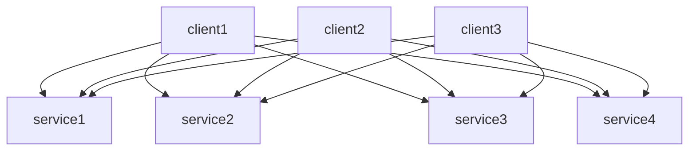
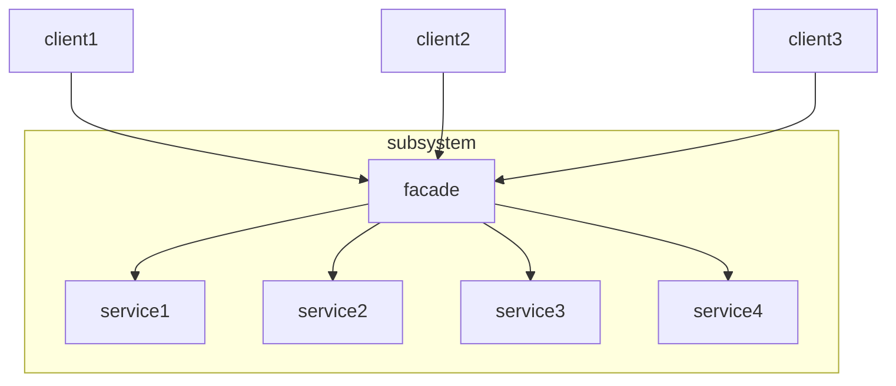

# 设计模式之门面模式

门面模式是一种使用频率非常高的结构型设计模式，它通过引入一个外观角色来简化客户端与子系统之间的交互，为复杂的子系统调用提供一个统一的入口，降低子系统与客户端的耦合度，且客户端调用非常方便。

<!--more-->

## 门面模式的定义

门面模式：为子系统中的一组接口提供一个统一的入口。门面模式定义了一个高层接口，这个接口使得这一子系统更加容易使用。门面模式又被称为外观模式，是一种对象结构型模式。




门面模式是迪米特法则的一种具体实现，通过引入一个新的外观角色可以降低原有系统的复杂度，同时降低客户类与子系统的耦合度。



门面模式包含如下两个角色：

1. Facade（门面角色）：在客户端可以调用它的方法，在门面角色中可以知道相关的（一个或者多个）子系统的功能和责任；在正常情况下，它将所有从客户端发来的请求委派到相应的子系统去，传递给相应的子系统对象处理。
2. SubSystem（子系统角色）：在软件系统中可以有一个或者多个子系统角色，每一个子系统可以不是一个单独的类，而是一个类的集合，它实现子系统的功能；每一个子系统都可以被客户端直接调用，或者被门面角色调用，它处理由门面类传过来的请求；子系统并不知道门面的存在，对于子系统而言，门面角色仅仅是另外一个客户端而已。

```java
class SubSystemA  
{  
    public void MethodA()  
    {  
        //业务实现代码  
    }  
}  
  
class SubSystemB  
{  
    public void MethodB()  
    {  
        //业务实现代码  
     }  
}  
  
class SubSystemC  
{  
    public void MethodC()  
    {  
        //业务实现代码  
    }  
}  

class Facade  
{  
    private SubSystemA obj1 = new SubSystemA();  
    private SubSystemB obj2 = new SubSystemB();  
    private SubSystemC obj3 = new SubSystemC();  
  
    public void Method()  
    {  
        obj1.MethodA();  
        obj2.MethodB();  
        obj3.MethodC();  
    }  
} 
```

## 门面模式总结

### 模式优点

外观模式的主要优点如下：

1. 它对客户端屏蔽了子系统组件，减少了客户端所需处理的对象数目，并使得子系统使用起来更加容易。通过引入外观模式，客户端代码将变得很简单，与之关联的对象也很少。
2. 它实现了子系统与客户端之间的松耦合关系，这使得子系统的变化不会影响到调用它的客户端，只需要调整外观类即可。
3.一个子系统的修改对其他子系统没有任何影响，而且子系统内部变化也不会影响到外观对象。
 
### 模式缺点

外观模式的主要缺点如下：

1. 不能很好地限制客户端直接使用子系统类，如果对客户端访问子系统类做太多的限制则减少了可变性和灵活 性。
2. 如果设计不当，增加新的子系统可能需要修改外观类的源代码，违背了开闭原则。
 
### 模式适用场景

在以下情况下可以考虑使用外观模式：

1. 当要为访问一系列复杂的子系统提供一个简单入口时可以使用外观模式。
2. 客户端程序与多个子系统之间存在很大的依赖性。引入外观类可以将子系统与客户端解耦，从而提高子系统的独立性和可移植性。
3. 在层次化结构中，可以使用外观模式定义系统中每一层的入口，层与层之间不直接产生联系，而通过外观类建立联系，降低层之间的耦合度。

