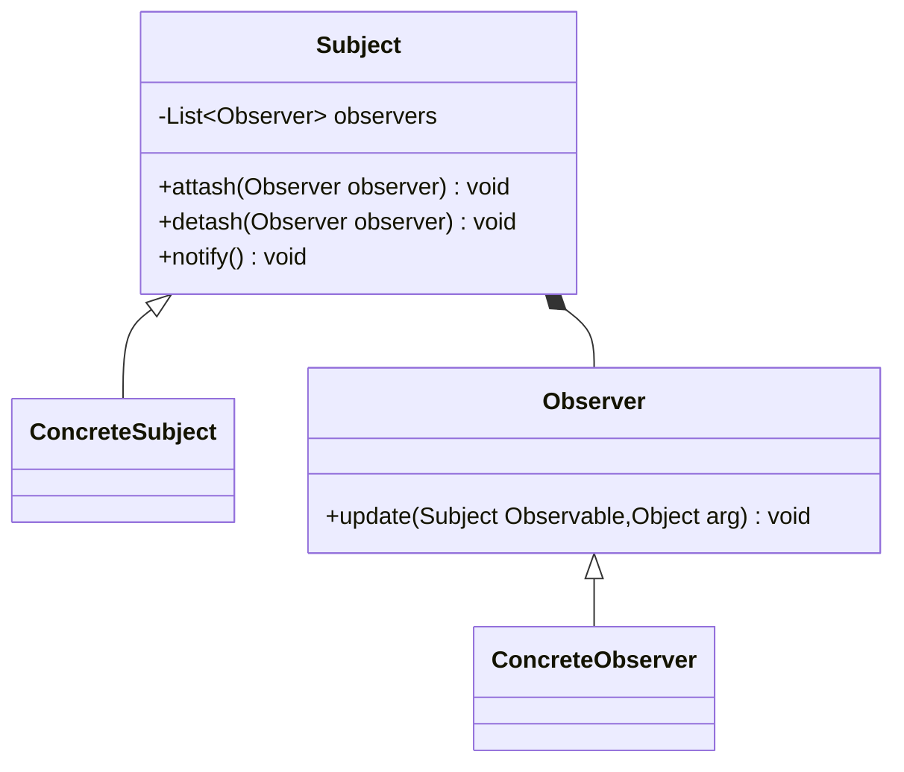

# 设计模式之观察者模式

观察者模式是使用频率最高的设计模式之一，它用于建立一种对象与对象之间的依赖关系，一个对象发生改变时将自动通知其他对象，其他对象将相应作出反应。在观察者模式中，发生改变的对象称为观察目标，而被通知的对象称为观察者，一个观察目标可以对应多个观察者，而且这些观察者之间可以没有任何相互联系，可以根据需要增加和删除观察者，使得系统更易于扩展。

<!--more-->

## 观察者模式的定义

观察者模式(Observer Pattern)：定义对象之间的一种一对多依赖关系，使得每当一个对象状态发生改变时，其相关依赖对象皆得到通知并被自动更新。观察者模式的别名包括发布-订阅（Publish/Subscribe）模式、模型-视图（Model/View）模式、源-监听器（Source/Listener）模式或从属者（Dependents）模式。观察者模式是一种对象行为型模式。



在观察者模式结构图中包含如下几个角色：

* Subject（目标）：目标又称为主题，它是指被观察的对象。在目标中定义了一个观察者集合，一个观察目标可以接受任意数量的观察者来观察，它提供一系列方法来增加和删除观察者对象，同时它定义了通知方法notify()。目标类可以是接口，也可以是抽象类或具体类。
* ConcreteSubject（具体目标）：具体目标是目标类的子类，通常它包含有经常发生改变的数据，当它的状态发生改变时，向它的各个观察者发出通知；同时它还实现了在目标类中定义的抽象业务逻辑方法（如果有的话）。如果无须扩展目标类，则具体目标类可以省略。
* Observer（观察者）：观察者将对观察目标的改变做出反应，观察者一般定义为接口，该接口声明了更新数据的方法update()，因此又称为抽象观察者。
* ConcreteObserver（具体观察者）：在具体观察者中维护一个指向具体目标对象的引用，它存储具体观察者的有关状态，这些状态需要和具体目标的状态保持一致；它实现了在抽象观察者Observer中定义的update()方法。通常在实现时，可以调用具体目标类的attach()方法将自己添加到目标类的集合中或通过detach()方法将自己从目标类的集合中删除。

观察者模式描述了如何建立对象与对象之间的依赖关系，以及如何构造满足这种需求的系统。观察者模式包含观察目标和观察者两类对象，一个目标可以有任意数目的与之相依赖的观察者，一旦观察目标的状态发生改变，所有的观察者都将得到通知。作为对这个通知的响应，每个观察者都将监视观察目标的状态以使其状态与目标状态同步，这种交互也称为发布-订阅(Publish-Subscribe)。观察目标是通知的发布者，它发出通知时并不需要知道谁是它的观察者，可以有任意数目的观察者订阅它并接收通知。

## 代码示例

```java
import java.util.*;  
public abstract class Subject {  
  //定义一个观察者集合用于存储所有观察者对象  
  protected ArrayList observers<Observer> = new ArrayList();  
  
  //注册方法，用于向观察者集合中增加一个观察者  
  public void attach(Observer observer) {  
    observers.add(observer);  
  }  
  
  //注销方法，用于在观察者集合中删除一个观察者  
  public void detach(Observer observer) {  
    observers.remove(observer);  
  }  
  
  //声明抽象通知方法  
  public abstract void notify();
  public abstract void notify(Object obj);
}  

public class ConcreteSubject extends Subject {
  //实现通知方法
  public void notify() {
    //遍历观察者集合，调用每一个观察者的响应方法
    for(Object obs:observers) {
      ((Observer)obs).update(this,null);
    }
  }
  public void notify(Object obj) {
    //遍历观察者集合，调用每一个观察者的响应方法
    for(Object obs:observers) {
      ((Observer)obs).update(this,obj);
    }
  }
}

public interface Observer {
    //声明响应方法
    public void update(Subject subject,Object obj);
} 

public class ConcreteObserver implements Observer {
  //实现响应方法
  public void update(Subject subject,Object obj) {
    //具体响应代码
  }
}
```

> 关于观察者模式，在JDK的java.util包中，提供了`Observable`类以及`Observer`接口。

## 扩展：Java事件处理 

java中的事件机制的参与者有3种角色：

1. event object：事件状态对象,是一类事件的实例。伴随着事件的发生，相应的状态通常都封装在事件状态对象中，该对象必须继承自java.util.EventObject。事件状态对象作为单参传递给应响应该事件的监听者方法中。
2. event source：具体的事件源,事件的生产者。发出某种特定事件的事件源的标识是：遵从规定的设计格式为事件监听者定义注册方法，并接受对指定事件监听者接口实例的引用。
3. event listener：事件监听者,事件的消费者。具体的对监听的事件类，当它监听到event object产生的时候，它就调用相应的方法，进行处理。

java 提供了`java.util.Eventobject,java.util.EventListener`这两个类来处理事件机制。

* `EventListener`：所有事件侦听器接口必须扩展的标记接口。
* `EventObject`：所有事件状态对象都将从其派生的根类。 所有 Event 在构造时都引用了对象 "source"，在逻辑上认为该对象是最初发生有关 Event 的对象。

> `EventObject` 实现了 `Serializable`接口

### 一个例子

```mermaid
classDiagram
class EventObject
class LightEvent{
  -Boolean lightState
  +setLightState(Boolean lightState) void
  +getLightState() Boolean
}
LightEvent ..> LightState
EventObject <|-- LightEvent
class LightListener{
   +listenLight(LightEvent lightEvent) void
}
&lt;&lt;interface>> LightListener
LightListener ..> LightEvent
class Lightlistener1{
  +listenLight(LightEvent lightEvent) void
}
LightListener<|.. Lightlistener1
class ListenerRegister{
  -List~LightListener~ listeners
  +addListener(LightListener listener) void
  +removeListener(LightListener listener) void
  +notifyListeners(LightEvent event) void
}
ListenerRegister *-- LightListener
class Console{
  -ListenerRegister register
  -Boolean[] lights
  +setLight(boolean light, int index) void
  +addListener(LightListener listener) void
  +removeListener(LightListener listener) void
  +notifyListeners(LightEvent event) void
}
Console ..> ListenerRegister
Console ..> LightListener
```

```java
// 事件状态
import java.util.EventObject;
public class LightEvent extends EventObject {  
  private static final long serialVersionUID = -1256654879784096588L;
  private boolean lightstate = false; 
  private String lightname;
    
  public String getLightname() {
    return lightname;
  }

  public boolean getLightstate() {
    return lightstate;
  }

  public LightEvent(Object source,String name,boolean state) {
    super(source);
    this.lightstate = state;
    this.lightname = name;
  }
}

// 监听者
public interface Lightlistener{
  public abstract void listenlight (LightEvent event);
}

public class Lightlistener1 implements Lightlistener{
  public void listenlight (LightEvent event){
    if(event.getLightstate()){
      System.out.println(""+event.getLightname()+">> is on");
    }else{
      System.out.println(""+event.getLightname()+">> is off");
    }
  };
}

import java.util.*;
// 注册listener
public class Listenerregister {
  public List<Lightlistener> listenerlist = new ArrayList<Lightlistener>();
  
  public void addListener(Lightlistener listener) {
    listenerlist.add(listener);
  }
  public void removeListener(Lightlistener listener) {
    listenerlist.remove(listener);
  }    
  public void notifylisteners(LightEvent event){
    for(Lightlistener tmplistener : listenerlist){
      tmplistener.listenlight(event);
    }
  }
}

import java.util.*;
// 事件源
public class Console {
  private listenerregister register = new listenerregister();
  private boolean[] lights = new boolean[10] ;
  private Random randomer = new Random();
    
  public void setLights(boolean light, int index) {
    this.lights[index] = light;
    String name = "Light "+ index;
    LightEvent event = new LightEvent(this,name,light);
    notifylisteners(event);
  }
  
  public void notifylisteners(LightEvent event){
    register.notifylisteners(event);
  }

  public void addListener(Lightlistener listener) {
    register.addListener(listener);
  }

  public void removeListener(Lightlistener listener) {
    register.removeListener(listener);
  }
    
  public static void main(String[] args) throws InterruptedException {
    System.out.println("Console>> Console is started.");
    Console console = new Console();
    console.addListener(new lightlistener1());
    while(true){
      System.out.println("lights>> lights are changing.");
      for(int i=0;i<10;i++){
        console.setLights(console.randomer.nextBoolean(), i);
      }
      Thread.sleep(1000);
    }
  }
}
```

## 观察者模式总结

### 主要优点

观察者模式的主要优点如下：

1. 观察者模式可以实现表示层和数据逻辑层的分离，定义了稳定的消息更新传递机制，并抽象了更新接口，使得可以有各种各样不同的表示层充当具体观察者角色。
2. 观察者模式在观察目标和观察者之间建立一个抽象的耦合。观察目标只需要维持一个抽象观察者的集合，无须了解其具体观察者。由于观察目标和观察者没有紧密地耦合在一起，因此它们可以属于不同的抽象化层次。
3. 观察者模式支持广播通信，观察目标会向所有已注册的观察者对象发送通知，简化了一对多系统设计的难度。
4. 观察者模式满足“开闭原则”的要求，增加新的具体观察者无须修改原有系统代码，在具体观察者与观察目标之间不存在关联关系的情况下，增加新的观察目标也很方便。

### 主要缺点

观察者模式的主要缺点如下：
1. 如果一个观察目标对象有很多直接和间接观察者，将所有的观察者都通知到会花费很多时间。
2. 如果在观察者和观察目标之间存在循环依赖，观察目标会触发它们之间进行循环调用，可能导致系统崩溃。
3. 观察者模式没有相应的机制让观察者知道所观察的目标对象是怎么发生变化的，而仅仅只是知道观察目标发生了变化。

### 适用场景

在以下情况下可以考虑使用观察者模式：

1. 一个抽象模型有两个方面，其中一个方面依赖于另一个方面，将这两个方面封装在独立的对象中使它们可以各自独立地改变和复用。
2. 一个对象的改变将导致一个或多个其他对象也发生改变，而并不知道具体有多少对象将发生改变，也不知道这些对象是谁。
3.  需要在系统中创建一个触发链，A对象的行为将影响B对象，B对象的行为将影响C对象……，可以使用观察者模式创建一种链式触发机制。

