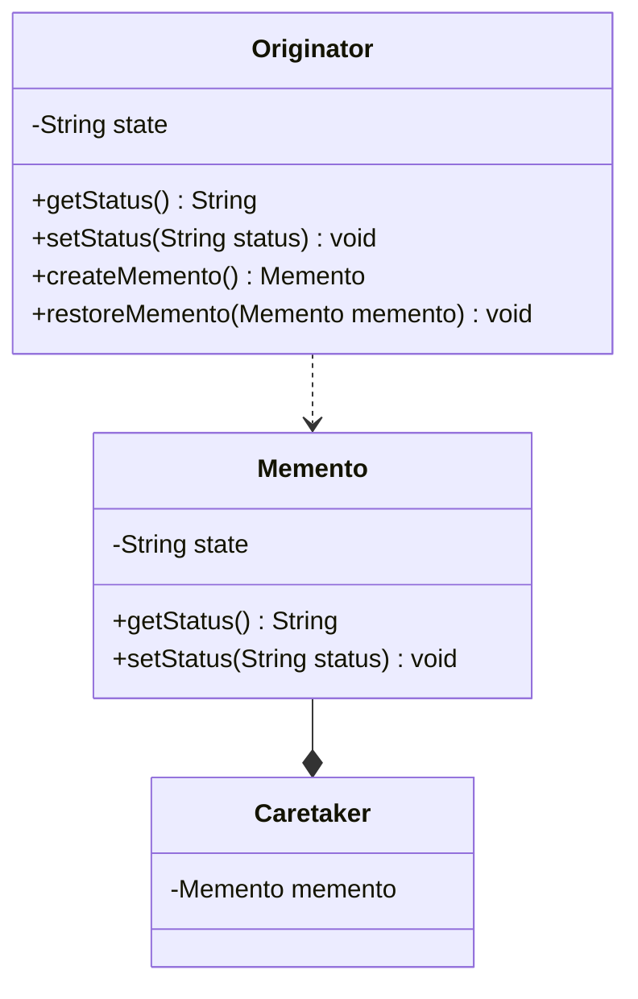

# 设计模式之备忘录模式

备忘录模式提供了一种状态恢复的实现机制，使得用户可以方便地回到一个特定的历史步骤，当新的状态无效或者存在问题时，可以使用暂时存储起来的备忘录将状态复原，当前很多软件都提供了撤销(Undo)操作，其中就使用了备忘录模式。

<!--more-->

## 备忘录模式定义

备忘录模式(Memento Pattern)：在不破坏封装的前提下，捕获一个对象的内部状态，并在该对象之外保存这个状态，这样可以在以后将对象恢复到原先保存的状态。它是一种对象行为型模式。



在备忘录模式结构图中包含如下几个角色：

* Originator（原发器）：它是一个普通类，可以创建一个备忘录，并存储它的当前内部状态，也可以使用备忘录来恢复其内部状态，一般将需要保存内部状态的类设计为原发器。
* Memento（备忘录)：存储原发器的内部状态，根据原发器来决定保存哪些内部状态。备忘录的设计一般可以参考原发器的设计，根据实际需要确定备忘录类中的属性。需要注意的是，**除了原发器本身与负责人类之外，备忘录对象不能直接供其他类使用，原发器的设计在不同的编程语言中实现机制会有所不同**。
* Caretaker（负责人）：负责人又称为管理者，它负责保存备忘录，但是不能对备忘录的内容进行操作或检查。在负责人类中可以存储一个或多个备忘录对象，它只负责存储对象，而不能修改对象，也无须知道对象的实现细节。

## 代码示例

```java
public class Originator{
  private String state;

  public String getState(){
    return this.state;
  }
  public void setState(String state){
    this.state = state;
  }

  public Memento createMemento(){
    return new Memento(this);
  }

  public void restoreMemento(Memento m) {  
　　　　 this.setState(m.getSate());
  }  
}

class Memento {  // 此处不能为 public 
  // 备忘录状态
  private String state;  
  
  public Memento(Originator o) {  
　　　state = o.getState();  
  }  
  
  public void setState(String state) {  
     this.state=state;  
  }  
  
  public String getState() {  
      return this.state;  
  }  
}  

// 在Caretaker类中不应该直接调用Memento中的状态改变方法，它的作用仅仅用于存储备忘录对象。
public class Caretaker {  
    private Memento memento;  
  
    public Memento getMemento() {  
        return memento;  
    }  
  
    public void setMemento(Memento memento) {  
        this.memento=memento;  
    }  
}  
```

## 封装备份类

在设计备忘录类时需要考虑其封装性，除了Originator类，不允许其他类来调用备忘录类Memento的构造函数与相关方法，如果不考虑封装性，允许其他类调用setState()等方法，将导致在备忘录中保存的历史状态发生改变，通过撤销操作所恢复的状态就不再是真实的历史状态，备忘录模式也就失去了本身的意义。
      
在使用Java语言实现备忘录模式时，一般通过将Memento类与Originator类定义在同一个包(package)中来实现封装，在Java语言中可使用默认访问标识符来定义Memento类，即保证其包内可见。只有Originator类可以对Memento进行访问，而限制了其他类对Memento的访问。在 Memento中保存了Originator的state值，如果Originator中的state值改变之后需撤销，可以通过调用它的restoreMemento()方法进行恢复。

### clone 方式的备忘录模式

原发器\(Originator\)融合备忘录和负责人角色，将备忘录变成private属性，并且不提供对其修改的方法，这样保证了备忘录的封装性。

```java
public class Originator implements Cloneable{
  private Originator backup;
  private String state;

  public String getState(){
    return this.state;
  }
  public void setState(String state){
    this.state = state;
  }

  public Memento createMemento(){
    return this.backup = this;
  }

  public void restoreMemento() {  
　　　　 this.setState(this.backup.getSate());
  }  

  @override
  protected Originator clone() throws CloneNotSupportedException{
    return ()super.clone();
  }
}
```

### 更好的封装

上述的基于clone 模式的备忘录模式，合并了Originator，Memento，Caretaker三个角色，适用于简单地场景。

```mermaid
classDiagram
class IMemento
&lt;&lt;interface>> IMemento

class Memento{
  -String state
  +getStatus() String
  +setStatus(String status) void
}
IMemento <|.. Memento
class Originator{
  -String state
  +getStatus() String
  +setStatus(String status) void
  +createMemento() IMemento
  +restoreMemento(IMemento memento) void
}
Originator ..> IMemento
class Caretaker{
  -Memento memento
}
IMemento --* Caretaker
```

使用了双重接口设计，对原发器采用宽接口，对负责人采用窄接口。

```java
public class Originator {
  private String state;

  public String getState(){
    return this.state;
  }
  public void setState(String state){
    this.state = state;
  }

  public IMemento createMemento(){
    return new Memento(this);
  }

  public void restoreMemento(IMemento m) {  
　　　　 this.setState(m.getSate());
  }  

  private class Memento implements IMemento{
    private String state;  
  
    public Memento(Originator o) {  
　　　 state = o.getState();  
    }  
  
    public void setState(String state) {  
      this.state=state;  
   }  
  
    public String getState() {  
      return this.state;  
    }  
  }
}

public interface IMemento{
  // 无法通过IMemento接口修改备份数据
}

public class Caretaker {  
    private IMemento memento;  
  
    public IMemento getMemento() {  
        return memento;  
    }  
  
    public void setMemento(IMemento memento) {  
        this.memento=memento;  
    }  
}  
```

## 备忘录模式的扩展

### 多状态的备忘录实现

多个属性状态备份，可以通过将属性以属性名为key存储在Map中来实现。下面是实现多属性备份和恢复的方法:

```java
public class MementoUtils {
    public static HashMap<String,Object> backup(Object bean){
        HashMap<String,Object> map = new HashMap<String,Object>();
        try {
            BeanInfo beanInfo = Introspector.getBeanInfo(bean.getClass());
            PropertyDescriptor[] descriptors = beanInfo.getPropertyDescriptors();
            for(PropertyDescriptor des : descriptors){
                //读取属性的名称
                String fileName = des.getName();
                //读取属性的方法
                Method getter = des.getReadMethod();
                Object fieldValue = getter.invoke(bean, new Object[]{});
                if(!fileName.equalsIgnoreCase("class"))
                    map.put(fileName, fieldValue);
            }
        } catch (IntrospectionException | IllegalAccessException | IllegalArgumentException | InvocationTargetException e) {
            // TODO Auto-generated catch block
            e.printStackTrace();
        }
        return map;
    }
    public static void restoreMap(Object bean, HashMap<String,Object> map){
        try {
            BeanInfo beanInfo = Introspector.getBeanInfo(bean.getClass());
            //获取属性描述
            PropertyDescriptor[] descriptor = beanInfo.getPropertyDescriptors();
            for(PropertyDescriptor des : descriptor){
                //属性名称
                String fileName = des.getName();
                if(map.containsKey(fileName)){
                    Method setter = des.getWriteMethod();
                    setter.invoke(bean, new Object[]{map.get(fileName)});
                }
            }
        } catch (IntrospectionException | IllegalAccessException | IllegalArgumentException | InvocationTargetException e) {
            // TODO Auto-generated catch block
            e.printStackTrace();
        }
    }
}
```

### 多备份的备忘录实现

关于多次备份，可以针对每次备份保存下备份对应的检查点，通常是指时间点。只需要对负责人类稍作修改。

```java
public class Caretaker {
    private HashMap<String,Memento> mementoMap = new HashMap<String,Memento>();
    public void setMemento(String id,Memento4 memento){
        this.mementoMap.put(id, memento);
    }
    public Memento getMemento(String id){
        return this.mementoMap.get(id);
    }
}
```

> 因为Map中的备份实例一直不会被销毁，为了避免内存溢出问题，最好设置备份数量的上限。

## 备忘录模式总结

### 主要优点
      
备忘录模式的主要优点如下：

1. 它提供了一种状态恢复的实现机制，使得用户可以方便地回到一个特定的历史步骤，当新的状态无效或者存在问题时，可以使用暂时存储起来的备忘录将状态复原。
2. 备忘录实现了对信息的封装，一个备忘录对象是一种原发器对象状态的表示，不会被其他代码所改动。备忘录保存了原发器的状态，采用列表、堆栈等集合来存储备忘录对象可以实现多次撤销操作。
 
### 主要缺点

备忘录模式的主要缺点如下：

* 资源消耗过大，如果需要保存的原发器类的成员变量太多，就不可避免需要占用大量的存储空间，每保存一次对象的状态都需要消耗一定的系统资源。
 
### 适用场景

在以下情况下可以考虑使用备忘录模式：

1. 保存一个对象在某一个时刻的全部状态或部分状态，这样以后需要时它能够恢复到先前的状态，实现撤销操作。
2. 防止外界对象破坏一个对象历史状态的封装性，避免将对象历史状态的实现细节暴露给外界对象。

