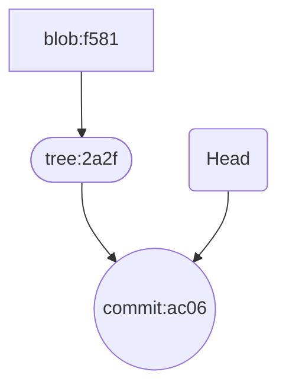
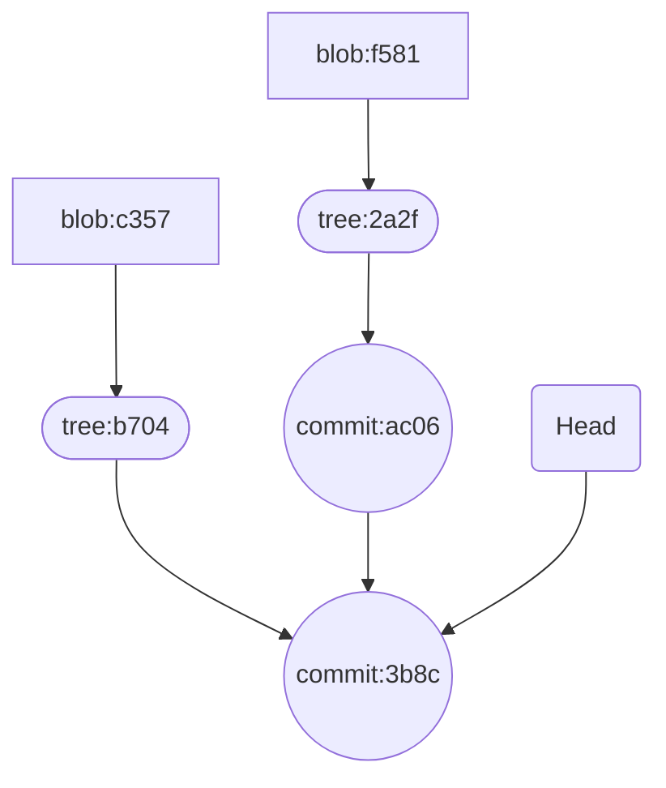
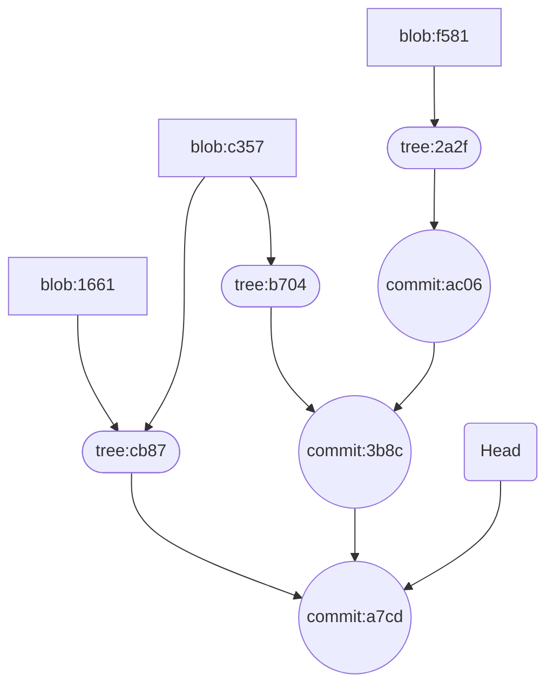

# git内部原理

之前的文章介绍了 [git的基础知识](/posts/2017/01/7f091a13/)和[git-flow模型](/posts/2016/11/d973b0bd/)。本篇文章将深入了解下git的内部原理。

<!--more-->

## git仓库变化

### 初始化
我们先通过`git init`命令创建一个空仓库。此时，git在当前目录下创建`.git`文件夹。通过tree命令可以查看当前git仓库的结构。

```sh
$ tree -a
.
└── .git
    ├── HEAD   # 存储当前工作区所在分支
    ├── config # git相关配置
    ├── description
    ├── hooks  # git 钩子
    │   ├── applypatch-msg.sample
    │   ├── commit-msg.sample
    │   ├── fsmonitor-watchman.sample
    │   ├── post-update.sample
    │   ├── pre-applypatch.sample
    │   ├── pre-commit.sample
    │   ├── pre-merge-commit.sample
    │   ├── pre-push.sample
    │   ├── pre-rebase.sample
    │   ├── pre-receive.sample
    │   ├── prepare-commit-msg.sample
    │   ├── push-to-checkout.sample
    │   └── update.sample
    ├── info
    │   └── exclude
    ├── objects # 存储git对象
    │   ├── info
    │   └── pack
    └── refs
        ├── heads
        └── tags
```

### first commit

```sh
echo "first line in file" > README.md
```

下面我们创建一个新文件 README.md，并增加一行内容`first line in file`。此时`.git/`中不会有变化，因为都是在工作目录中修改。然后，通过`git add -A`将文件加入到暂存区。可以看到`.git/objects`下面增加了一个新文件。

```sh
.git
└── objects
    ├── f5
    │   └── 81c7046f61bd034a3a7b231cf5fcbb6566b969
    ├── info
    └── pack
```

我们用`git cat-file -p f581` 查看下其内容:

```sh
$ git cat-file -p f581
first line in file
$ git cat-file -t f581
blob
```

这个object是一个blob类型的节点,储存着README.md文件的内容。

接下来我们提交这一次修改，`git commit -m 'first commit'`。

```sh
.git
├── logs
│   ├── HEAD
│   └── refs
│       └── heads
│           └── main
├── objects
│   ├── 2a
│   │   └── 2ff2b4352a3ad662a9bafcf17eb8be955cfa3d
│   ├── ac
│   │   └── 06ec23dcd8d950cb329a407e6b3ef7408b72cc
│   ├── f5
│   │   └── 81c7046f61bd034a3a7b231cf5fcbb6566b969
│   ├── info
│   └── pack
└── refs
    ├── heads
        └── main
```

`.git/logs/refs/heads/main` 中记录了main分支的提交记录

```sh
cat .git/logs/refs/heads/main
0000000000000000000000000000000000000000 ac06ec23dcd8d950cb329a407e6b3ef7408b72cc victorchu <victorchu0610@outlook.com> 1704436466 +0800	commit (initial): first commit
```

`.git/refs/heads/main` 中记录了main分支的HEAD指针

```sh
$ cat .git/refs/heads/main
ac06ec23dcd8d950cb329a407e6b3ef7408b72cc
```

接下来，我们关注下objects中的新增对象。

```sh
$ git cat-file -p 2a2f
100644 blob f581c7046f61bd034a3a7b231cf5fcbb6566b969	README.md
$ git cat-file -t 2a2f
tree
```
2a2f是tree类型的对象，将当前的目录结构打了一个快照。里面存储了，子目录 (tree)，文件列表 (blob)，文件类型以及一些数据文件权限模型等。

```sh
$ git cat-file -p ac06
tree 2a2ff2b4352a3ad662a9bafcf17eb8be955cfa3d
author victorchu <victorchu0610@outlook.com> 1704436466 +0800
committer victorchu <victorchu0610@outlook.com> 1704436466 +0800

first commit
$ git cat-file -t ac06
commit
```
ac06是commit类型的对象，储存的是一个提交的信息，包括对应目录结构的快照tree的哈希值，上一个提交的哈希值（这里由于是第一个提交，所以没有父节点。在一个merge提交中还会出现多个父节点），提交的作者以及提交的具体时间，最后是该提交的信息。




### 修改文件

我们再次修改文件README.md，并将修改加入暂存区。

```sh
$ echo "second line in file" >> README.md
$ git add -A
```

`.git/` 下多出来一个文件`.git/objects/c3/571777b63f53b3f577674ff56f7ceb2d12c4d2`。

```sh
$ git cat-file -p c357
first line in file
second line in file
```

这也说明，git存储的是文件快照，而不是修改。

接下来，我们提交修改`git commit -m 'second commit'`。

```sh
$ git cat-file -p 3b8c
tree b704baff8d9aeed978ad4e29c1c5d78f011136d8
parent ac06ec23dcd8d950cb329a407e6b3ef7408b72cc
author victorchu <victorchu0610@outlook.com> 1704437074 +0800
committer victorchu <victorchu0610@outlook.com> 1704437074 +0800

second commit
```

可以看到本次提交中有了上一次提交的引用。



### 新增文件

新增TODO文件。

```sh
$ echo "create new file TODO" > TODO
$ git add -A
$ git cat-file -p 1661
create new file TODO
```

然后提交修改`git commit -m 'add TODO file'`。

```sh
$ git cat-file -p cb87
100644 blob c3571777b63f53b3f577674ff56f7ceb2d12c4d2	README.md
100644 blob 166173fbb99735bfb78b9a668a5c5a06c41ed573	TODO
```

注意，README.md文件还是使用的上次的 blob c357。这也说明，git提交会复用未修改的blob



### tag

tag 是一个"固化的分支"，一旦打上 tag 之后，这个 tag 代表的内容将永远不可变，因为 tag 只会关联当时版本库中最后一个 commit 对象。

分支的话，随着不断的提交，内容会不断的改变，因为分支指向的最后一个 commit 不断改变。所以一般应用或者软件版本的发布一般用 tag。

git 的 Tag 类型有两种：

- lightweight (轻量级)
- annotated (含附注)

#### lightweight

创建方式：`git tag tagName`。这种方式创建的 Tag，git 底层不会创建一个真正意义上的 tag 对象，而是直接指向一个 commit 对象，此时如果使用 git cat-file -t tagName 会返回一个 commit。

```sh
$ git tag v1
$ cat .git/refs/tags/v1
a7cdfa847d29c150c85ccd0a5df2dd0390fabc47
$ git cat-file -t v1
commit
$ git cat-file -p v1
tree cb8755c85797880e45f80193f81b80d8110f075d
parent 3b8ce753f21f860805fe07f94687c5452fefbc6d
author victorchu <victorchu0610@outlook.com> 1704858475 +0800
committer victorchu <victorchu0610@outlook.com> 1704858475 +0800

add TODO file
```

#### annotated

创建方式：`git tag -a tagName -m ''`, 这种方式创建的标签，git 底层会创建一个 tag 对象，tag 对象会包含相关的 commit 信息和 tagger 等额外信息，此时如果使用 `git cat-file -t tagname` 会返回一个 tag。

```sh
$ cat .git/refs/tags/todo
366a41f4ed74330bd7435479d1763823bb0aa6be
$ git cat-file -t todo
tag
$ git cat-file -p todo
object a7cdfa847d29c150c85ccd0a5df2dd0390fabc47
type commit
tag todo
tagger victorchu <victorchu0610@outlook.com> 1704870420 +0800

tmp
```

### pack

`.git/objects/pack`目录用于存放打包压缩对象。pack对象主要用于文件在网络上传输，减少网络消耗。为了节省存储空间，可以手动触发打包压缩操作 (git gc)，将松散对象打包成 pack 文件对象。也可以将 pack 文件解压缩成松散对象 (git unpack-objects)。

```sh
## gc 后，原来松散的对象都没了
$ git gc
$ cd .git/objects
$ tree -a
.
├── info
│   ├── commit-graph
│   └── packs
└── pack
    ├── pack-186b8d3f49f2208eaa6156ca5c79fff84f2b0551.idx
    └── pack-186b8d3f49f2208eaa6156ca5c79fff84f2b0551.pack
```

为了加快 pack 文件的检索效率，git 会基于 pack 文件生成相应的索引 idx 文件。我们可以通过`git verify-pack -v`查看包内容。

```sh
$ git verify-pack -v .git/objects/pack/pack-186b8d3f49f2208eaa6156ca5c79fff84f2b0551.pack
a7cdfa847d29c150c85ccd0a5df2dd0390fabc47 commit 236 157 12
366a41f4ed74330bd7435479d1763823bb0aa6be tag    136 122 169
3b8ce753f21f860805fe07f94687c5452fefbc6d commit 236 152 291
ac06ec23dcd8d950cb329a407e6b3ef7408b72cc commit 187 122 443
cb8755c85797880e45f80193f81b80d8110f075d tree   69 77 565
b704baff8d9aeed978ad4e29c1c5d78f011136d8 tree   37 48 642
2a2ff2b4352a3ad662a9bafcf17eb8be955cfa3d tree   37 48 690
c3571777b63f53b3f577674ff56f7ceb2d12c4d2 blob   39 37 738
166173fbb99735bfb78b9a668a5c5a06c41ed573 blob   21 31 775
f581c7046f61bd034a3a7b231cf5fcbb6566b969 blob   19 29 806
non delta: 10 objects
.git/objects/pack/pack-186b8d3f49f2208eaa6156ca5c79fff84f2b0551.pack: ok
```

pack 文件设计非常精密和巧妙，本着降低文件大小，减少文件传输，降低网络开销和安全传输的原则设计的。pack 文件主要有三部分组成，Header， Body， Trailer

- Header 部分主要 4-byte "PACK", 4-byte "版本号", 4-byte "Object 条目数"。
- Body 部分主要是一个个 Git 对象依次存储，存储位置在 idx 索引文件中记录改对象在 pack 文件中的偏移量 offset。
- Trailer 部分主要是所有 Objects 的名(SHA-1)的校验和，为了安全可靠的文件传输。


## 参考

- [1] [Git内部原理](https://git-scm.com/book/en/v2/Git-Internals-Plumbing-and-Porcelain)
- [2] [pack file](https://shafiul.github.io/gitbook/7_the_packfile.html)

