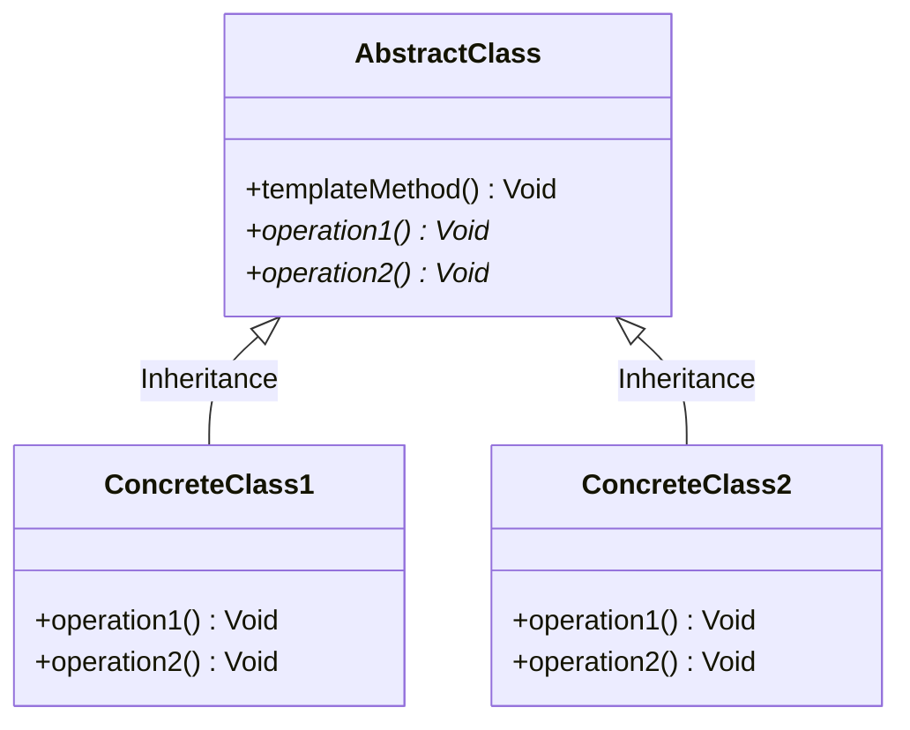

# 设计模式之模板方法模式

在软件开发中，会遇到下面这种情况：

某个方法的实现需要多个步骤，其中有些步骤是固定的，而有些步骤并不固定，存在可变性。为了提高代码的复用性和系统的灵活性，可以使用一种称之为模板方法模式的设计模式来对这类情况进行设计。

<!--more-->

## 什么是模板方法模式

定义一个操作中算法的框架，而将一些步骤延迟到子类中。模板方法模式使得子类可以不改变一个算法的结构即可重定义该算法的某些特定步骤。

在模板方法模式中，将实现功能的每一个步骤所对应的方法称为基本方法。而调用这些基本方法同时定义基本方法的执行次序的方法称为模板方法。在模板方法模式中，可以将相同的代码放在父类中，将其具体实现放在不同的子类中。

### 设计模式结构



模板方法模式包含如下两个角色：

1. AbstractClass\(抽象类\): 在抽象类中定义了一系列基本方法，每一个基本方法对应算法的一个步骤，在其子类中可以继承或覆盖这些步骤。同时，在抽象类中实现了一个模板方法，用于定义一个算法的框架。

2. ConcreteClass\(具体子类\): 它是抽象类的子类，用于实现在父类中声明的抽象基本操作以完成子类特定算法的步骤，也可以覆盖在父类中已经实现的具体基本操作。

> 为了防止恶意的操作，一般模板方法都会加上final关键字，防止子类覆盖。

## 模板方法模式的扩展

### 钩子方法\(Hook Method\)

我们可以通过钩子方法来扩展模板方法模式:

1. 第一类钩子方法可以与一些具体步骤“挂钩”，以实现在不同条件下执行模板方法中的不同步骤，这类钩子方法的返回类型通常是bool类型的，这类方法名一般为IsXXX()，用于对某个条件进行判断，如果条件满足则执行某一步骤，否则将不执行，如下代码片段所示：

```java
//模板方法  
public void TemplateMethod()   
{  
    Open();  
    Display();  
    //通过钩子方法来确定某步骤是否执行  
    if (IsPrint())   
    {  
        Print();  
    }  
}  
  
//钩子方法  
public bool IsPrint()  
{  
    return true;  
}  
```

2.   还有一类钩子方法就是实现体为空的具体方法，子类可以根据需要覆盖或者继承这些钩子方法，与抽象方法相比，这类钩子方法的好处在于子类如果没有覆盖父类中定义的钩子方法，编译可以正常通过，但是如果没有覆盖父类中声明的抽象方法，编译将报错。

## 模板方法模式的优缺点

模板方法模式是基于继承的代码复用技术，它体现了面向对象的诸多重要思想，是一种使用较为频繁的模式。模板方法模式广泛应用于框架设计中，以确保通过父类来控制处理流程的逻辑顺序（如框架的初始化，测试流程的设置等）。

### 优点

模板方法模式的主要优点如下：

1. 在父类中形式化地定义一个算法，而由它的子类来实现细节的处理，在子类实现详细的处理算法时并不会改变算法中步骤的执行次序。
2. 模板方法模式是一种代码复用技术，它在类库设计中尤为重要，它提取了类库中的公共行为，将公共行为放在父类中，而通过其子类来实现不同的行为，它鼓励我们恰当使用继承来实现代码复用。
3. 可实现一种反向控制结构，通过子类覆盖父类的钩子方法来决定某一特定步骤是否需要执行。
4. 在模板方法模式中可以通过子类来覆盖父类的基本方法，不同的子类可以提供基本方法的不同实现，更换和增加新的子类很方便，符合单一职责原则和开闭原则。

### 缺点

模板方法模式的主要缺点如下：

* 需要为每一个基本方法的不同实现提供一个子类，如果父类中可变的基本方法太多，将会导致类的个数增加，系统更加庞大，设计也更加抽象。

## 使用场景

在以下情况下可以考虑使用模板方法模式：

1. 对一些复杂的算法进行分割，将其算法中固定不变的部分设计为模板方法和父类具体方法，而一些可以改变的细节由其子类来实现。即：一次性实现一个算法的不变部分，并将可变的行为留给子类来实现。
2. 各子类中公共的行为应被提取出来并集中到一个公共父类中以避免代码重复。
3. 需要通过子类来决定父类算法中某个步骤是否执行，实现子类对父类的反向控制。

