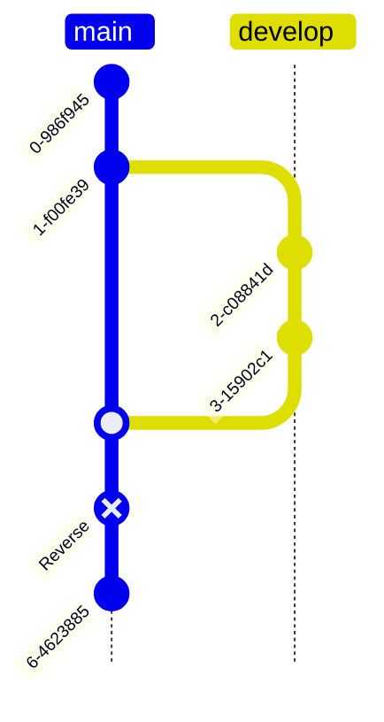

# Git Quickstart

Git 是一个开源的分布式版本控制系统，Git 不仅仅是个版本控制系统，它也是个内容管理系统(CMS)，工作管理系统等。

<!--more-->

## 版本控制

> 版本控制是一种记录一个或若干文件内容变化，以便将来查阅特定版本修订情况的系统。 

最初的版本控制是本地版本控制系统，大多都是采用某种简单的数据库来记录文件的历次更新差异。接下来人们又遇到一个问题，如何让在不同系统上的开发者协同工作？ 于是有了集中化的版本控制系统。这类系统都有一个单一的集中管理的服务器，保存所有文件的修订版本，而协同工作的人们都通过客户端连到这台服务器，取出最新的文件或者提交更新。

对于集中化的版本控制系统，显而易见的缺点是中央服务器的单点故障。 如果宕机一小时，那么在这一小时内，谁都无法提交更新，也就无法协同工作。 如果中心数据库所在的磁盘发生损坏，又没有做恰当备份，将丢失所有数据。

为了解决上面的问题。分布式版本控制系统因此诞生。在这类系统中，客户端并不只提取最新版本的文件快照， 而是把代码仓库完整地镜像下来，包括完整的历史记录。 这么一来，任何一处协同工作用的服务器发生故障，事后都可以用任何一个镜像出来的本地仓库恢复。 

### Git 的版本是什么？

Git 和其它版本控制系统的主要差别在于 Git 对待数据的方式。 从概念上来说，其它大部分系统以文件变更列表的方式存储信息，这类系统将它们存储的信息看作是一组基本文件和每个文件随时间逐步累积的差异(它们通常称作 基于差异(delta-based)的版本控制)。


Git 不按照以上方式对待或保存数据。反之，Git 更像是把数据看作是对小型文件系统的一系列快照。 在 Git 中，每当你提交更新或保存项目状态时，它基本上就会对当时的全部文件创建一个快照并保存这个快照的索引。 为了效率，如果文件没有修改，Git 不再重新存储该文件，而是只保留一个链接指向之前存储的文件。Git 对待数据更像是一个 快照流。


Git 中所有的数据在存储前都计算校验和(SHA-1 散列HASH)，然后以校验和来引用。这意味着不可能在 Git 不知情时更改任何文件内容或目录内容。Git 数据库中保存的信息都是以文件内容的哈希值来索引，而不是文件名。

## Git

### 三种状态

Git 有三种状态: 

- 已提交(committed): 表示数据已经安全地保存在本地数据库中。
- 已修改(modified): 表示修改了文件，但还没保存到数据库中。
- 已暂存(staged): 表示对一个已修改文件的当前版本做了标记，使之包含在下次提交的快照中。

Git 项目拥有三个阶段：工作区、暂存区以及 Git 目录 来对应上面的三种状态。


- 工作区是对项目的某个版本独立提取出来的内容。 这些从 Git 仓库的压缩数据库中提取出来的文件，放在磁盘上供你使用或修改。
- 暂存区是一个文件，保存了下次将要提交的文件列表信息，一般在 Git 仓库目录中。 按照 Git 的术语叫做“索引”，不过一般说法还是叫“暂存区”。
- Git 仓库目录是 Git 用来保存项目的元数据和对象数据库的地方。 这是 Git 中最重要的部分，从其它计算机克隆仓库时，复制的就是这里的数据。

基本的 Git 工作流程如下：

- 在工作区中修改文件。
- 将你想要下次提交的更改选择性地暂存，这样只会将更改的部分添加到暂存区。
- 提交更新，找到暂存区的文件，将快照永久性存储到 Git 目录。

### 基础操作

git 仓库可以通过 `git clone` 同步远程仓库或者 `git init` 本地创建空仓库。

- `git add [file]`: 将需要进行版本管理的文件放入暂存区域。
- `git checkout`: 
    - `git checkout .`, `git checkout [file]` 会清除工作区中未添加到暂存区的修改，用暂存区内容替换工作区。
    - `git checkout HEAD .`, `git checkout HEAD [file]` 会清除工作区、暂存区的修改，用HEAD指向的当前分支最新版本替换暂存区、工作区。
- `git commit`:将暂存区域的文件提交到Git仓库。
- `git reset [commit]`: 用来撤销修改、回退版本的指令。
- `git checkout/switch [branch]`: 用于切换本地仓库的分支
- `git push`: 将本地仓库推送到远程仓库，同步版本库。
- `git fetch/pull`: 从服务端更新到本地，区别是git pull多了一个步骤，就是自动合并更新工作区。


#### git add

git add 命令如下:

```sh
## 添加文件到暂存区，包括修改的文件、新增的文件
git add [file1] [file2]	

## 同上，添加目录到暂存区，包括子目录
git add [dir]	

## 同上，添加所有修改、新增文件（未跟踪）到暂存区
git add .
git add -a

## 删除工作区文件，并且将这次删除放入暂存区
git rm [file]	

## 改名文件，并且将这个改名放入暂存区
git mv [file-original] [file-renamed]
```

#### git commit

git commit提交是以时间顺序排列被保存到数据库中的，每一次提交（commit）就会产生一条记录：commit id + 描述 + 快照内容。

- commit id：根据修改的文件内容采用摘要算法（SHA1）计算出不重复的40位字符,一般本地指令中可以只用前几位。
- 描述：针对本次提交的描述说明
- 快照：就是完整的版本文件，以对象树的结构存在仓库下`.git\objects`目录下

多个提交就形成了一条时间线，每次提交完，会移动当前分支(main) HEAD的“指针”位置。


git commit 命令如下:

```sh
## 提交变更，参数-m设置提交的描述信息，应该正确提交，不带该参数会进入说明编辑模式
git commit -m [message]

## 参数-a，表示直接从工作区提交到版本库，略过了git add步骤，不包括新增的文件
git commit -a -m [message]

## 提交暂存区的指定文件到仓库区
git commit [file] -m [message]

## 使用一次新的commit，替代上一次提交
## 如果代码没有任何新变化，则用来改写上一次commit的提交信息
git commit --amend -m [message]
```


#### git diff

git diff用来比较不同文件版本之间的差异。


```sh
## 查看暂存区和工作区的差异
git diff 

## 查看暂存区和工作区指定文件的差异
git diff [file]

## 查看暂存区与git历史库HEAD的差异
git diff --cached/--staged

## 查看暂存区与git历史库HEAD的指定文件差异
git diff --cached/--staged [file]

## 查看已暂存的+未暂存的所有改动，与版本HEAD进行比较
git diff HEAD
## 与上一个版本比较。HEAD~表示上一个版本，HEAD~10为最近第10个版本
git diff HEAD~

## 查看两次提交之间的差异
git diff [commit_id] [commit_id]

## 查看工作区和分支直接的差异
git diff [branch]
```

#### git checkout(覆盖修改)

checkout命令用于从历史提交（或者暂存区域）中拷贝文件到工作目录。当给定某个文件名（或者打开-p选项，或者文件名和-p选项同时打开）时，git会从指定的提交中拷贝文件到暂存区域和工作目录。比如，git checkout HEAD~ foo.c会将提交节点HEAD~(即当前提交节点的父节点)中的foo.c复制到工作目录并且加到暂存区域中。（如果命令中没有指定提交节点，则会从暂存区域中拷贝内容。）注意当前分支不会发生变化。


```sh
## 撤销工作区的（未暂存）修改，把暂存区恢复到工作区。不影响暂存区，如果没暂存，则撤销所有工作区修改
git checkout .	
## 同上，file指定文件
git checkout [file]	

## 撤销工作区、暂存区的修改，用HEAD指向的当前分支最新版本替换工作区、暂存区
git checkout HEAD .	
## 同上，file指定文件
git checkout HEAD [file]	
```

#### git reset

reset命令把当前分支指向另一个位置，并且有选择的变动工作目录和索引。也用来在从历史仓库中复制文件到索引，而不动工作目录。


如果给了文件名(或者 -p选项), 那么工作效果和带文件名的checkout差不多，除了索引被更新。

```sh
## 撤销暂存区状态，同git reset HEAD，不影响工作区
git reset
## 同上，指定文件file，HEAD可省略
git reset HEAD [file]
## 回退到指定版本，清空暂存区，不影响工作区。工作区需要手动git checkout签出
git reset [commit]	
## 移动分支master、HEAD到指定的版本，不影响暂存区、工作区，需手动git checkout签出更新
git reset --soft [commit]	
## 撤销工作区、暂存区的修改，用当前最新版
git reset --hard HEAD	
## 回退到上一个版本，并重置工作区、暂存区内容。
git reset --hard HEAD~	
## 回退到指定版本，并重置工作区、暂存区内容。
git reset --hard [commit]	
```

reset有三种模式，对应三种参数：mixed（默认模式）、soft、hard。三种参数的主要区别就是对工作区、暂存区的操作不同。

|模式名称|描述|HEAD的位置|暂存区|工作区|
|:---|:---|:---|:---|:---|
|soft|回退到某一个版本，工作区不变，需手动git checkout|修改	|不修改|不修改|
|mixed(默认)|撤销暂存区状态，不影响工作区，需手动git checkout|修改|修改|不修改|
|hard|重置未提交修改（工作区、暂存区）|修改|修改|修改|

> 穿梭前，用git log可以查看提交历史，以便确定要回退到哪个版本。要重返未来，用git reflog查看命令历史，以便确定要回到未来的哪个版本。

#### git revert

git revert 安全的撤销某一个提交记录，基本原理就是生产一个新的提交，用原提交的逆向操作来完成撤销操作。注意，这不同于reset，reset是回退版本，revert只是用于撤销某一次历史提交，操作是比较安全的。



```sh
## 撤销一个提交，会用一个新的提交（原提交的逆向操作）来完成撤销操作，如果已push则重新push即可
git revert[commit]	
```

#### 回退总结

- 还没提交的怎么撤销？
    - 还未提交的修改（工作区、暂存区）不想要了，用签出指令（checkout）进行撤销清除。
    - 或者用checkout的新版回滚指令reset。
- 已提交如何撤销？
    - reset、revert
    - 已push的提交先本地撤销，然后强制推送git push origin -f(记得先pull获取更新)。

#### git stash	

git stash 把未提交内容隐藏起来，包括未暂存、已暂存。 等以后恢复现场后继续工作。

```sh
## 查看所有被隐藏的内容列表
git stash list	
## 恢复被隐藏的内容，同时删除隐藏记录
git stash pop	
## 同git stash，可以备注说明message
git stash save "message"	
## 恢复被隐藏的文件，但是隐藏记录不删除
git stash apply	
## 删除隐藏记录
git stash drop	
```

例如当你正在dev分支开发一个功能时，代码写了一半，突然有一个线上的bug急需要马上修改。dev分支Bug没写完，不方便提交，就不能切换到主分支去修复线上bug。Git提供一个stash功能，可以把当前工作区、暂存区 未提交的内容“隐藏”起来，就像什么都没发生一样。

```sh
## 有未提交修改，切换分支时报错
$ git checkout dev
error: Your local changes to the following files would be overwritten by checkout:
        README.md
Please commit your changes or stash them before you switch branches.
Aborting
 
## 隐藏
$ git stash
Saved working directory and index state WIP on main: 2bc012c s
 
## 查看被隐藏的内容
$ git stash list
stash@{0}: WIP on main: 2bc012c s
 
## 比较一下，什么都没有，一切都没有发生过！
$ git diff
 
## 去其他分支修改bug，修复完成回到当前分支，恢复工作区
$ git stash pop
```

### 分支

分支就是指向某一个提交记录的“指针”引用，因此创建分支是非常快的，不管仓库多大。当我们运行`git branch develop`就创建了一个名字为develop的分支。


#### git branch

```sh
## 列出所有本地分支，* 标记的为当前head
git branch	

## 列出所有远程分支
git branch -r	

## 列出所有本地分支和远程分支，用不同颜色区分
git branch -a	

## 新建一个分支，但依然停留在当前分支
git branch [branch-name]

## 删除dev分支，-D（大写）强制删除
git branch -d dev

## 新建一个分支，指向指定commit id
git branch [branch] [commit]	

## 新建一个分支，与指定的远程分支建立关联
git branch --track [local_branch] [remote_branch]

## 在现有分支与指定的远程分支之间建立跟踪关联
git branch --set-upstream [local_branch] [remote_repo]/[remote_branch]
```

#### git checkout(分支切换)

```sh
## 切换到指定分支，并更新工作区
git checkout [branch]
git switch [branch]

## 从当前分支创建并切换到dev分支
git checkout -b dev
git switch -c dev

## 从本地dev分支代码创建一个 feature1分支，并切换到新分支
git checkout -b feature1 dev	

## 从远端remote的hotfix分支创建本地hotfix分支
git checkout -b hotfix remote hotfix	
```

#### git merge

git merge 命令把不同分支合并起来。合并前，索引必须和当前提交相同。如果另一个分支是当前提交的祖父节点，那么合并命令将什么也不做。 另一种情况是如果当前提交是另一个分支的祖父节点，就导致fast-forward合并。指向只是简单的移动，并生成一个新的提交。


否则就是一次真正的合并。默认把当前提交(ed489 如下所示)和另一个提交(33104)以及他们的共同祖父节点(b325c)进行一次三方合并。结果是先保存当前目录和索引，然后和父节点33104一起做一次新提交(f8bc5)。


- 如果两边变更的文件不同，没有什么冲突，就自动合并了。
- 如果有修改同一个文件，则会存在冲突，到底该采用哪边的，程序无法判断，就换产生冲突。冲突内容需要人工修改后再重新提交，才能完成最终的合并。

#### Cherry Pick

cherry-pick命令"复制"一个提交节点并在当前分支做一次完全一样的新提交。


#### git rebase

衍合是合并命令的另一种选择。合并把两个父分支合并进行一次提交，提交历史不是线性的。衍合在当前分支上重演另一个分支的历史，提交历史是线性的。 本质上，这是线性化的自动的 cherry-pick。


上面的命令都在topic分支中进行，而不是main分支，在main分支上重演，并且把分支指向新的节点。注意旧提交(169a6和2c33a)没有被引用，将被回收。要限制回滚范围，使用--onto选项。

`git rebase --onto main 169a6` 在main分支上重演当前分支从169a6以来的最近几个提交，即2c33a。

> 复杂的变基操作可以使用交互式的git rebase --interactive

### 标签

标签（Tags）指的是某个分支某个特定时间点的状态，是对某一个提交记录的的固定“指针”引用。可以理解为某一次提交（编号）的别名，常用来标记版本。所以发布时，一般都会打一个版本标签，作为该版本的快照，指向对应提交commit。


#### 分离状态

当HEAD处于分离状态（不依附于任一分支，例如通过git checkout tag）时，提交操作可以正常进行，但是不会更新任何已命名的分支。(你可以认为这是在更新一个匿名分支。)


一旦此后你切换到别的分支，比如说main，那么这个提交节点（可能）再也不会被引用到，然后就会被丢弃掉了。注意这个命令之后就不会有东西引用2eecb。


如果你想保存这个状态，可以用命令git checkout -b name来创建一个新的分支。

#### git tag

```sh
## 查看标签列表
git tag	

## 查看名称是“a”开头的标签列表，带查询参数
git tag -l 'a*'	

## 查看标签信息
git show [tag]	

## 创建一个标签，默认标签是打在最新提交的commit上的
git tag [tag]	

## 新建一个tag在指定commit上
git tag [tag] [commit_id]	

## 创建标签v5.1.1039，-a指定标签名，-m指定说明文字
git tag -a v5.1 -m'v5.1版本'	

## 删除本地标签
git tag -d [tagname]	

## 切换标签，同切换分支
git checkout v5.1.1039	

## 推送标签，标签不会默认随代码推送推送到服务端
git push [remote] v5.1

## 提交所有tag
git push [remote] --tags	
```


### 远程仓库

```sh
## 从远程仓库克隆到本地（当前目录）
git clone [git_url]	

## 从远程仓库的指定分支克隆到本地（当前目录）
git clone -b [remote_branch]  [git_url]

## 查看所有远程仓库
git remote -v	

## 显示某个远程仓库的信息
git remote show [remote_repo]	

## 增加一个新的远程仓库，并命名
git remote add [name] [url]	

## 修改远程仓库名称
git remote rename [oldName] [newName]	

## 获取远程仓库的所有变动到本地仓库，不会自动合并！需要手动合并
git fetch [remote]	
```

#### git pull

git pull 取回远程仓库的变化，并与本地版本合并

```sh
## 取回远程仓库的变化，并与本地版本合并
git pull [remote_repo] [remote_branch]:[local_branch]

## 远程指定分支拉取到本地当前分支上
git pull [remote_repo] [remote_branch]

## 将与本地当前分支同名的远程分支拉取到本地当前分支上
git pull
```

#### git push

```sh
## 将本地当前分支 推送到 远程指定分支上
git push [remote_repo] [local_branch]:[remote_branch]

## 将本地当前分支推送到指定远程分支上
git push origin [remote_branch]

## 将本地当前分支推送到同名的远程分支上
git push
```

#### fetch与pull区别

- git fetch 只获取更新，不影响分支HEAD的位置。
- git pull = git fetch + git merge，除了获取更新，还会自动合并。

## 参考

- [1] [Pro Git](https://git-scm.com/book/zh/v2)
- [2] [图解Git](https://marklodato.github.io/visual-git-guide/index-zh-cn.html)
- [3] [Git 可视化教程](https://onlywei.github.io/explain-git-with-d3)
- [4] [Git 课程](https://learngitbranching.js.org/?locale=zh_CN)

