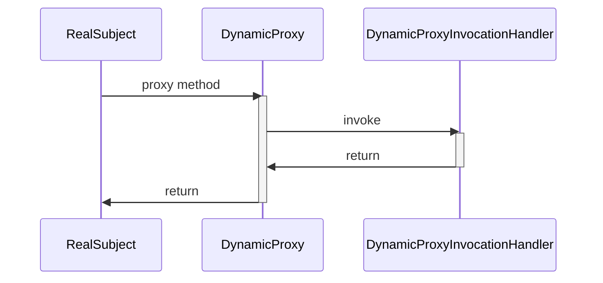

# 设计模式之代理模式

代理模式：给某一个对象提供一个代理或占位符，并由代理对象来控制对原对象的访问。代理模式是一种对象结构型模式。在代理模式中引入了一个新的代理对象，代理对象在客户端对象和目标对象之间起到中介的作用，它去掉客户不能看到的内容和服务或者增添客户需要的额外的新服务。

<!--more-->

## 代理模式的结构

```mermaid
classDiagram
class Subject{
    +request() void
}
&lt;&lt;interface>> Subject

class RealSubject{
    +request() void
}
Subject <|.. RealSubject

class Proxy{
    -RealSubject realSubject
    +before() void
    +request() void
    +after() void
}
Subject <|.. Proxy
Proxy *-- RealSubject
```

代理模式包含如下三个角色：
1. Subject\(抽象主题角色\)：它声明了真实主题和代理主题的共同接口，这样一来在任何使用真实主题的地方都可以使用代理主题，客户端通常需要针对抽象主题角色进行编程。
2. Proxy\(代理主题角色\)：它包含了对真实主题的引用，从而可以在任何时候操作真实主题对象；在代理主题角色中提供一个与真实主题角色相同的接口，以便在任何时候都可以替代真实主题；代理主题角色还可以控制对真实主题的使用，负责在需要的时候创建和删除真实主题对象，并对真实主题对象的使用加以约束。通常，在代理主题角色中，客户端在调用所引用的真实主题操作之前或之后还需要执行其他操作，而不仅仅是单纯调用真实主题对象中的操作。
3. RealSubject\(真实主题角色\)：它定义了代理角色所代表的真实对象，在真实主题角色中实现了真实的业务操作，客户端可以通过代理主题角色间接调用真实主题角色中定义的操作。

## 代理模式的扩展

### 普通代理

普通代理要求客户端只能访问代理角色，不能访问真实角色。在这个模式下，代理角色屏蔽了真实角色变化对高层模块的影响，下面举个例子：

```java
// 抽象接口
public interface IExecutor {
    // 业务
    void execute();
}

// 代理角色
public class ProxyExecutor implements IExecutor{
    // 真实角色实例
    private IExecutor executor = null;

    public ProxyExecutor(Stirng name){
        try{
            executor = new Executor(this,name);
        }catch(Exception e){
            //TODO
        }
    }

    public void execute(){
        executor.execute();
    }
}

// 真实角色
public class Executor implements IExecutor{

    private String name = null;
    
    public Executor(IExecutor proxyExecutor,String name){
        if(proxyExecutor == null){
            throw new Exception("init error");
        }else{
            this.name = name;
        }
    } 

    public void execute(){
        System.out.println("execute something here");
    }
}
```

### 强制代理

强制代理必须通过真实角色找到代理角色，使用真实角色制定的代理角色才能访问。

```java
// 抽象接口
public interface IExecutor {
    // 业务
    void execute();

    // 用于返回代理，代理角色的返回值是this
    IExecutor getProxy();
}
// 代理角色
public class ProxyExecutor implements IExecutor{
    // 真实角色实例
    private IExecutor executor = null;

    public ProxyExecutor(IExecutor executor){
        this.executor = executor;
    }

    public void execute(){
        executor.execute();
    }

    public IExecutor getProxy(){
        return this;
    }
}

// 真实角色
public class Executor implements IExecutor{
    // 管理代理角色
    private IExecutor proxyExecutor = null;
    private String name = null;
    
    public Executor(String name){
        this.name = name;
    } 

    public void execute(){
        if(proxyExecutor != null){
            System.out.println("execute something here");
        }else{
            System.out.println("请使用代理");
        }
    }

    public IExecutor getProxy(){
        proxyExecutor = new ProxyExecutor(this);
        return this.proxyExecutor;
    }
}

// client 使用
public class client{
    public static void main(String[] args){
        IExecutor executor = new Executor("A");
        IExecutor proxy = executor.getProxy();
        proxy.execute();
    }
}

```

### 虚拟代理

虚拟代理只有在需要时才初始化真实角色，避免被代理对象过多，导致初始化慢。

```java
public class Proxy implements Subject{
    // 被代理对象
    private Subject subject = null;

    public void request(){
        if(subject == null){
            subject = new RealSubject();
        }
        subject.request();
    }
}

```

### 动态代理

动态代理在实现阶段不关心代理谁，而在运行时才指定代理哪个对象，一个典型的例子是**Java基于接口的动态代理**。

```mermaid
classDiagram
class Subject{
    +request() void
}
&lt;&lt;interface>> Subject

class RealSubject{
    +request() void
}
Subject <|.. RealSubject

class Proxy{
    -InvocationHandler invocationHandler
}

class InvocationHandler{
    -Subject subject
    +invoke(Object proxy, Method method, Object[] args) Object
}
&lt;&lt;interface>> InvocationHandler

class DynamicProxyInvocationHandler{
    +invoke(Object proxy, Method method, Object[] args) Object
}
InvocationHandler <|..DynamicProxyInvocationHandler

class DynamicProxy{
    +request() void
}
Subject <|.. DynamicProxy
Proxy <|-- DynamicProxy
Proxy *-- InvocationHandler
DynamicProxyInvocationHandler *-- RealSubject
```

在java的动态代理机制中，有两个重要的类或接口，一个是 InvocationHandler\(Interface\)、另一个则是 Proxy\(Class\)，这一个类和接口是实现我们动态代理所必须用到的。

每一个动态代理类都必须要实现InvocationHandler这个接口，并且每个代理类的实例都关联到了一个handler，当我们通过代理对象调用一个方法的时候，这个方法的调用就会被转发为由InvocationHandler这个接口的 invoke 方法来进行调用。我们来看看InvocationHandler这个接口的唯一方法 invoke 方法。

动态代理类在运行期被创建时实现了被代理类所实现的一组接口，代理类中的组件中包含了实现`InvocationHandler`接口的代理方法实例。对于被代理类方法的调用，都会被实现同样接口的动态代理类分发给内部的`InvocationHandler`实例，被分发的参数包括：被代理类实例，反射的方法实例，以及方法的入参数组。



## 应用

### 优点

1. 能够协调调用者和被调用者，在一定程度上降低了系统的耦合度。
2. 客户端可以针对抽象主题角色进行编程，增加和更换代理类无须修改源代码，符合开闭原则，系统具有较好的灵活性和可扩展性。

### 缺点

1. 由于在客户端和真实主题之间增加了代理对象，因此有些类型的代理模式可能会造成请求的处理速度变慢。
2. 实现代理模式需要额外的工作，而且有些代理模式的实现过程较为复杂。

