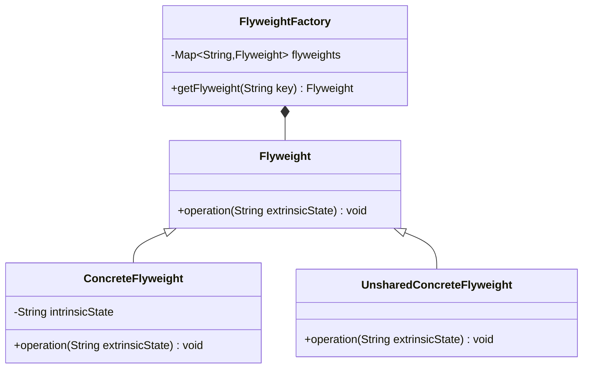

# 设计模式之享元模式

享元模式以共享的方式高效地支持大量细粒度对象的重用，享元对象能做到共享的关键是区分了内部状态(Intrinsic State)和外部状态(Extrinsic State)。下面将对享元的内部状态和外部状态进行简单的介绍：

1. 内部状态是存储在享元对象内部并且不会随环境改变而改变的状态，内部状态可以共享。如字符的内容，不会随外部环境的变化而变化，无论在任何环境下字符“a”始终是“a”，都不会变成“b”。
2. 外部状态是随环境改变而改变的、不可以共享的状态。享元对象的外部状态通常由客户端保存，并在享元对象被创建之后，需要使用的时候再传入到享元对象内部。一个外部状态与另一个外部状态之间是相互独立的。如字符的颜色，可以在不同的地方有不同的颜色，例如有的“a”是红色的，有的“a”是绿色的，字符的大小也是如此，有的“a”是五号字，有的“a”是四号字。

通过区分内部状态和外部状态，我们可以将具有相同内部状态的对象存储在享元池中，享元池中的对象是可以实现共享的，需要的时候就将对象从享元池中取出，实现对象的复用。通过向取出的对象注入不同的外部状态，可以得到一系列相似的对象，而这些对象在内存中实际上只存储一份。

<!--more-->

## 享元模式的定义

享元模式(Flyweight Pattern)：运用共享技术有效地支持大量细粒度对象的复用。系统只使用少量的对象，而这些对象都很相似，状态变化很小，可以实现对象的多次复用。由于享元模式要求能够共享的对象必须是细粒度对象，因此它又称为轻量级模式，它是一种对象结构型模式。

在享元模式结构图中包含如下几个角色：



1. Flyweight（抽象享元类）：通常是一个接口或抽象类，在抽象享元类中声明了具体享元类公共的方法，这些方法可以向外界提供享元对象的内部数据（内部状态），同时也可以通过这些方法来设置外部数据（外部状态）。
2. ConcreteFlyweight（具体享元类）：它实现了抽象享元类，其实例称为享元对象；在具体享元类中为内部状态提供了存储空间。通常我们可以结合单例模式来设计具体享元类，为每一个具体享元类提供唯一的享元对象。
3. UnsharedConcreteFlyweight（非共享具体享元类）：并不是所有的抽象享元类的子类都需要被共享，不能被共享的子类可设计为非共享具体享元类；当需要一个非共享具体享元类的对象时可以直接通过实例化创建。
4. FlyweightFactory（享元工厂类）：享元工厂类用于创建并管理享元对象，它针对抽象享元类编程，将各种类型的具体享元对象存储在一个享元池中，享元池一般设计为一个存储“键值对”的集合（也可以是其他类型的集合），可以结合工厂模式进行设计；当用户请求一个具体享元对象时，享元工厂提供一个存储在享元池中已创建的实例或者创建一个新的实例（如果不存在的话），返回新创建的实例并将其存储在享元池中。

在享元模式中引入了享元工厂类，享元工厂类的作用在于提供一个用于存储享元对象的享元池，当用户需要对象时，首先从享元池中获取，如果享元池中不存在，则创建一个新的享元对象返回给用户，并在享元池中保存该新增对象。

```java
public class FlyweightFactory {
  //定义一个HashMap用于存储享元对象，实现享元池
  private HashMap flyweights = new HashMap();

  public Flyweight getFlyweight(String key){
    //如果对象存在，则直接从享元池获取
    if(flyweights.containsKey(key)){
      return(Flyweight)flyweights.get(key);
    }
    //如果对象不存在，先创建一个新的对象添加到享元池中，然后返回
    else {
      Flyweight fw = newConcreteFlyweight();
      flyweights.put(key,fw);
      return fw;
    }
  }
}
```

享元类的设计是享元模式的要点之一，在享元类中要将内部状态和外部状态分开处理，通常将内部状态作为享元类的成员变量，而外部状态通过注入的方式添加到享元类中。

```java
public class Flyweight {
  //内部状态intrinsicState作为成员变量，同一个享元对象其内部状态是一致的
  private String intrinsicState;
      
  public  Flyweight(String intrinsicState) {
    this.intrinsicState=intrinsicState;
  }
  //外部状态extrinsicState在使用时由外部设置，不保存在享元对象中，即使是同一个对象，在每一次调用时也可以传入不同的外部状态
  public void operation(String  extrinsicState) {
    ......
  }     
}
```

- 单纯享元模式: 在单纯享元模式中，所有的具体享元类都是可以共享的，不存在非共享具体享元类。
- 复合享元模式: 将一些单纯享元对象使用组合模式加以组合，还可以形成复合享元对象，这样的复合享元对象本身不能共享，但是它们可以分解成单纯享元对象，而后者则可以共享。 

通过复合享元模式，可以确保复合享元类CompositeConcreteFlyweight中所包含的每个单纯享元类ConcreteFlyweight都具有相同的外部状态，而这些单纯享元的内部状态往往可以不同。如果希望为多个内部状态不同的享元对象设置相同的外部状态，可以考虑使用复合享元模式。

```java
// UnsharedConcreteFlyweight  非共享具体享元类
public class CompositeConcreteFlyweight extends Flyweight{

  private List<Flyweight> flyweights;
      
  public void add(Flyweight flyweight){
    ......
  }

  public void remove(Flyweight flyweight){
    ......
  }
  //外部状态extrinsicState在使用时由外部设置，不保存在享元对象中，即使是同一个对象，在每一次调用时也可以传入不同的外部状态
  public void operation(String  extrinsicState) {
    ......
  }     
}
```

## 与其他模式的联用

享元模式通常需要和其他模式一起联用，几种常见的联用方式如下：

1. 在享元模式的享元工厂类中通常提供一个静态的工厂方法用于返回享元对象，使用简单工厂模式来生成享元对象。
2. 在一个系统中，通常只有唯一一个享元工厂，因此可以使用单例模式进行享元工厂类的设计。
3. 享元模式可以结合组合模式形成复合享元模式，统一对多个享元对象设置外部状态。

## 享元模式总结

当系统中存在大量相同或者相似的对象时，享元模式是一种较好的解决方案，它通过共享技术实现相同或相似的细粒度对象的复用，从而节约了内存空间，提高了系统性能。相比其他结构型设计模式，享元模式的使用频率并不算太高，但是作为一种以“节约内存，提高性能”为出发点的设计模式，它在软件开发中还是得到了一定程度的应用。

### 主要优点

享元模式的主要优点如下：
1. 可以减少内存中对象的数量，使得相同或相似对象在内存中只保存一份，从而可以节约系统资源，提高系统性能。
2. 享元模式的外部状态相对独立，而且不会影响其内部状态，从而使得享元对象可以在不同的环境中被共享。

### 主要缺点
       
享元模式的主要缺点如下：

1. 享元模式使得系统变得复杂，需要分离出内部状态和外部状态，这使得程序的逻辑复杂化。
2.  为了使对象可以共享，享元模式需要将享元对象的部分状态外部化，而读取外部状态将使得运行时间变长。

### 适用场景

在以下情况下可以考虑使用享元模式：

1. 一个系统有大量相同或者相似的对象，造成内存的大量耗费。
2.  对象的大部分状态都可以外部化，可以将这些外部状态传入对象中。
3.  在使用享元模式时需要维护一个存储享元对象的享元池，而这需要耗费一定的系统资源，因此，应当在需要多次重复使用享元对象时才值得使用享元模式。

