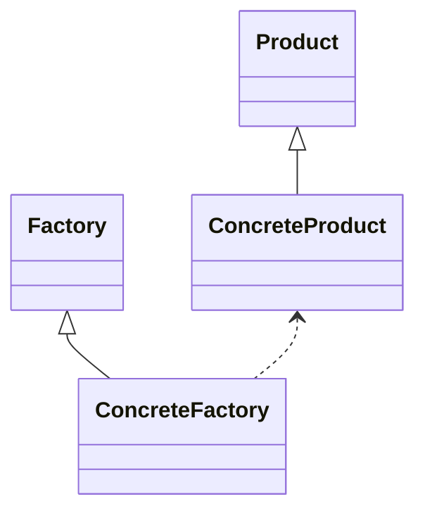
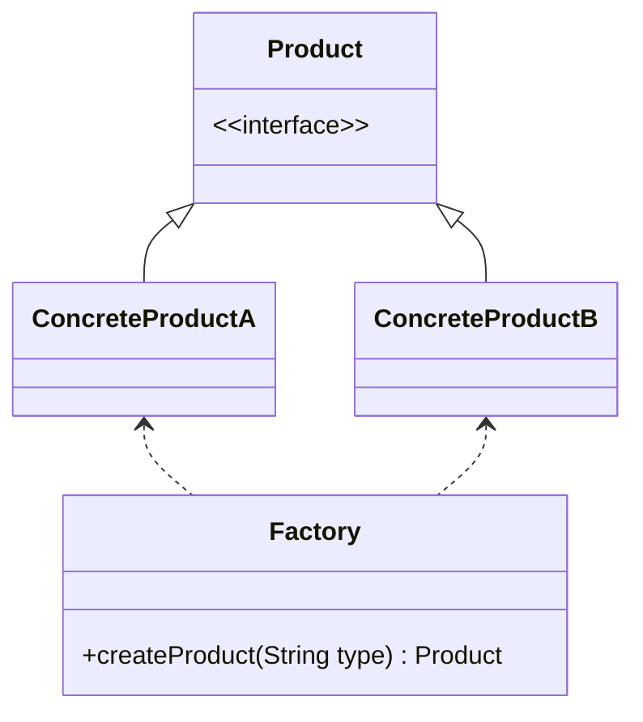

# 设计模式之工厂模式

在面向对象编程中, 最通常的方法是一个new操作符产生一个对象实例,new操作符就是用来构造对象实例的。但是在一些情况下,new操作符直接生成对象会带来一些问题。举例来说,许多类型对象的创造需要一系列的步骤: 你可能需要计算或取得对象的初始设置;选择生成哪个子对象实例;或在生成你需要的对象之前必须先生成一些辅助功能的对象。在这些情况,新对象的建立就是一个“过程”，不仅是一个操作，像一部大机器中的一个齿轮传动。

那么如何能轻松方便地构造对象实例，而不必关心构造对象实例的细节和复杂过程呢？答案就是工厂模式。
<!--more-->

## 什么是工厂模式

工厂方法模式(Factory Method Pattern)：定义一个用于创建对象的接口，让子类决定将哪一个类实例化。工厂方法模式让一个类的实例化延迟到其子类。工厂方法模式又简称为工厂模式(Factory Pattern)，又可称作虚拟构造器模式(Virtual Constructor Pattern)或多态工厂模式(Polymorphic Factory Pattern)。工厂方法模式是一种类创建型模式。

工厂方法模式提供一个抽象工厂接口来声明抽象工厂方法，而由其子类来具体实现工厂方法，生产具体的产品。工厂方法模式结构如下图所示：



在工厂方法模式结构图中包含如下几个角色：

* Product（抽象产品）：它是定义产品的接口，是工厂方法模式所创建对象的超类型，也就是产品对象的公共父类。
* ConcreteProduct（具体产品）：它实现了抽象产品接口，某种类型的具体产品由专门的具体工厂创建，具体工厂和具体产品之间一一对应。
* Factory（抽象工厂）：在抽象工厂类中，声明了工厂方法(Factory Method)，用于返回一个产品。抽象工厂是工厂方法模式的核心，所有创建对象的工厂类都必须实现该接口。
* ConcreteFactory（具体工厂）：它是抽象工厂类的子类，实现了抽象工厂中定义的工厂方法，并可由客户端调用，返回一个具体产品类的实例。

### 代码示例

* 抽象产品类

```java
public abstract class Product {  
    //所有产品类的公共业务方法  
    public void methodSame() {  
        //公共方法的实现  
    }  
  
    //声明抽象业务方法  
    public abstract void methodDiff();  
}  
```

* 具体产品子类

```java
public class ConcreteProduct extends Product {  
    //实现业务方法  
    public void methodDiff() {  
        //业务方法的实现  
    }  
}
```

* 抽象工厂接口

```java
interface Factory {  
    public Product factoryMethod();  
} 
```

* 具体工厂实现类

```java
class ConcreteFactory implements Factory {  
    public Product factoryMethod() {  
        return new ConcreteProduct();  
    }  
} 
```

* 实际使用

```java
Factory factory;  
factory = new ConcreteFactory(); //可通过配置文件实现  
Product product;  
product = factory.factoryMethod();  
```

## 扩展使用

### 简单工厂模式

简单工厂模式(Simple Factory Pattern)：定义一个工厂类，它可以根据参数的不同返回不同类的实例，被创建的实例通常都具有共同的父类。因为在简单工厂模式中用于创建实例的方法是静态(static)方法，因此简单工厂模式又被称为静态工厂方法(Static Factory Method)模式，它属于类创建型模式。简单工厂模式的要点在于：当你需要什么，只需要传入一个正确的参数，就可以获取你所需要的对象，而无须知道其创建细节。

简单工厂模式结构中包含如下几个角色：

* Factory（工厂角色）：工厂角色即工厂类，它是简单工厂模式的核心，负责实现创建所有产品实例的内部逻辑；工厂类可以被外界直接调用，创建所需的产品对象；在工厂类中提供了静态的工厂方法factoryMethod()，它的返回类型为抽象产品类型Product。
* Product（抽象产品角色）：它是工厂类所创建的所有对象的父类，封装了各种产品对象的公有方法，它的引入将提高系统的灵活性，使得在工厂类中只需定义一个通用的工厂方法，因为所有创建的具体产品对象都是其子类对象。
* ConcreteProduct（具体产品角色）：它是简单工厂模式的创建目标，所有被创建的对象都充当这个角色的某个具体类的实例。每一个具体产品角色都继承了抽象产品角色，需要实现在抽象产品中声明的抽象方法。

在简单工厂模式中，客户端通过工厂类来创建一个产品类的实例，而无须直接使用new关键字来创建对象，它是工厂模式家族中最简单的一员。



### 替换单例模式

```java
public class Singleton{

    private Singleton(){}

    public void doSomething(){ 
        // 业务代码
        ...
    }
}
```

单例模式的核心要求就是内存中只有一个对象，上面的Singleton保证不能通过正常的方法构造建立一个对象，我们可以通过反射创建Singleton的单例对象。代码如下：

```java
public class SingletonFactory{
    private static Singleton singleton;
    static{
        try{
            Class c1 = Class.forName(Singleton.class.getName());
            // 获得无餐构造
            Constructor constructor = c1.getDeclaredConstructor();
            // 设置访问权限
            constructor.setAccessible(true);
            // 构造实例
            singleton = (Singleton)constructor.newInstance();
        }catch(Exception e){
            // handle exception
        }
    }
}
```

## 优缺点

### 优点

1. 在工厂方法模式中，工厂方法用来创建客户所需要的产品，同时还向客户隐藏了哪种具体产品类将被实例化这一细节，用户只需要关心所需产品对应的工厂，无须关心创建细节，甚至无须知道具体产品类的类名。
2. 基于工厂角色和产品角色的多态性设计是工厂方法模式的关键。它能够让工厂可以自主确定创建何种产品对象，而如何创建这个对象的细节则完全封装在具体工厂内部。工厂方法模式之所以又被称为多态工厂模式，就正是因为所有的具体工厂类都具有同一抽象父类。
3. 使用工厂方法模式的另一个优点是在系统中加入新产品时，无须修改抽象工厂和抽象产品提供的接口，无须修改客户端，也无须修改其他的具体工厂和具体产品，而只要添加一个具体工厂和具体产品就可以了，这样，系统的可扩展性也就变得非常好，完全符合“开闭原则”。

### 缺点

1. 在添加新产品时，需要编写新的具体产品类，而且还要提供与之对应的具体工厂类，系统中类的个数将成对增加，在一定程度上增加了系统的复杂度，有更多的类需要编译和运行，会给系统带来一些额外的开销。
2. 由于考虑到系统的可扩展性，需要引入抽象层，在客户端代码中均使用抽象层进行定义，增加了系统的抽象性和理解难度，且在实现时可能需要用到DOM、反射等技术，增加了系统的实现难度。

## 使用场景

1. 客户端不知道它所需要的对象的类。在工厂方法模式中，客户端不需要知道具体产品类的类名，只需要知道所对应的工厂即可，具体的产品对象由具体工厂类创建，可将具体工厂类的类名存储在配置文件或数据库中。
2. 抽象工厂类通过其子类来指定创建哪个对象。在工厂方法模式中，对于抽象工厂类只需要提供一个创建产品的接口，而由其子类来确定具体要创建的对象，利用面向对象的多态性和里氏代换原则，在程序运行时，子类对象将覆盖父类对象，从而使得系统更容易扩展。

