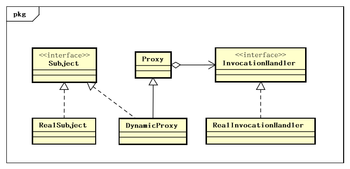

# Java动态代理


本文将会介绍 Jdk 中动态代理的实现，源码版本基于Java 8。

<!--more-->



Java动态代理把代理操作抽象成`InvocationHandler`接口，实际上的代理类`DynamicProxy`，实现了抽象主题`Subject`，通过继承Proxy类获得组件`InvocationHandler`，从而使用`InvocationHandler`的方法代理`RealSubject`的方法，下面是个例子。

## 例子

* 首先我们定义了一个Subject类型的接口，为其声明了3个方法：

```java
public interface Subject {

    void logIn();

    void playGames();

    void logOut();
}
```

* 接着，定义了一个类来实现这个接口，这个类就是我们的真实对象，RealSubject类：

```java
public class RealSubject implements Subject{

    @Override
    public void logIn(){
        System.out.println("Logging In ...");
    }

    @Override
    public void playGames(){
        System.out.println("Playing Games ...");
    }

    @Override
    public void logOut(){
        System.out.println("Logging Out ...");
    }

}
```

* 下一步，我们就要定义一个动态代理类了，实现 InvocationHandler 这个接口：

```java
public class MyInvocationHandler implements InvocationHandler {

    // 这个就是我们要代理的真实对象
    private Subject subject;

    // 构造方法，给我们要代理的真实对象赋初值
    public MyInvocationHandler(Subject subject){
        this.subject = subject;
    }

    @Override
    public Object invoke(Object proxy, Method method, Object[] args) throws InvocationTargetException, IllegalAccessException {
        System.out.println("before Method:" + method);
        // 当代理对象调用真实对象的方法时，其会自动的跳转到代理对象关联的handler对象的invoke方法来进行调用
        method.invoke(subject, args);

        System.out.println("after Method:" + method);

        return null;
    }
}
```

* 最后是ProxyClient类：

```java
public class ProxyClient {

    public static void main(String[] args) {

        Subject realSubject = new RealSubject();
        InvocationHandler handler = new MyInvocationHandler(realSubject);

        /*
         * 通过Proxy的newProxyInstance方法来创建我们的代理对象
         * 第一个参数 handler.getClass().getClassLoader() ，我们这里使用handler这个类的ClassLoader对象来加载我们的代理对象
         * 第二个参数realSubject.getClass().getInterfaces()，我们这里为代理对象提供的接口是真实对象所实行的接口，表示我要代理的是该真实对象，这样我就能调用这组接口中的方法了
         * 第三个参数handler， 我们这里将这个代理对象关联到了上方的 InvocationHandler 这个对象上
         */
        Subject subject = (Subject) Proxy.newProxyInstance(handler.getClass().getClassLoader(), realSubject
                .getClass().getInterfaces(), handler);
        System.out.println(subject.getClass().getCanonicalName());
        subject.logIn();
        subject.playGames();
        subject.logOut();
    }
}

```

* 输出

```
com.sun.proxy.$Proxy0
before Method:public abstract void info.victorchu.j8.proxy.Subject.logIn()
Logging In ...
after Method:public abstract void info.victorchu.j8.proxy.Subject.logIn()
before Method:public abstract void info.victorchu.j8.proxy.Subject.playGames()
Playing Games ...
after Method:public abstract void info.victorchu.j8.proxy.Subject.playGames()
before Method:public abstract void info.victorchu.j8.proxy.Subject.logOut()
Logging Out ...
after Method:public abstract void info.victorchu.j8.proxy.Subject.logOut()
```

## 机制详解

在java的动态代理机制中，有两个重要的类或接口，一个是 InvocationHandler\(Interface\)、另一个则是 Proxy\(Class\)，这一个类和接口是实现我们动态代理所必须用到的。

### InvocationHandler

每一个动态代理类都必须要实现InvocationHandler这个接口，并且每个代理类的实例都关联到了一个handler，当我们通过代理对象调用一个方法的时候，这个方法的调用就会被转发为由InvocationHandler这个接口的 invoke 方法来进行调用。我们来看看InvocationHandler这个接口的唯一方法 invoke 方法。

```java
/*
 * proxy:　 指代我们所代理的那个真实对象
 * method:　指代的是我们所要调用真实对象实现的接口的某个方法的Method对象
 * args:　　指代的是调用真实对象某个方法时接受的参数数组，如果无自变量参数，为null。参数中的值类型会被装箱成对应的包装类。
 */
Object invoke(Object proxy, Method method, Object[] args) throws Throwable
```

### Proxy

Proxy类提供了静态方法用于创建动态代理类和实例，也是所有动态代理类的父类。

```java
// 静态方法创建动态代理类
InvocationHandler handler = new MyInvocationHandler(...);
Class<?> proxyClass = Proxy.getProxyClass(Foo.class.getClassLoader(), Foo.class);
Foo f = (Foo) proxyClass.getConstructor(InvocationHandler.class).newInstance(handler);

// 简单的使用方式
Foo f = (Foo) Proxy.newProxyInstance(Foo.class.getClassLoader(),new Class<?>[] { Foo.class },handler);
```

动态代理类在运行期被创建时实现了被代理类所实现的一组接口，代理类中的组件中包含了实现`InvocationHandler`接口的代理方法实例。对于被代理类方法的调用，都会被实现同样接口的动态代理类分发给内部的`InvocationHandler`实例，被分发的参数包括：被代理类实例，反射的方法实例，以及方法的入参数组。

动态生成的代理类有以下特性：

1. 如果所有的代理接口是public的，那么动态代理类是public，final的且不能是抽象类。
2. 如果有一个代理接口是non-public的，那么动态代理类也是non-public的，final，且不为抽象类。
3. 动态代理类的类名以"$Proxy"开头，具体类名未知。
4. 动态代理类继承类`java.lang.reflect.Proxy`。
5. 动态代理类在创建时，以相同的顺序实现被代理类实现的接口。
6. 如果动态代理类实现了一个non-public接口，那么它会和该接口定义在同一个package下。否则，动态代理类的包名也是未确定的。
7. `Proxy.isProxyClass`方法可以判断一个类是不是代理类，是的话返回true。

## 源码解析

### Proxy类源码

Proxy 类的private内部类 ProxyClassFactory 实际生成动态代理类。

```java
// 摘自 openJDk
private static final class ProxyClassFactory implements BiFunction<ClassLoader, Class<?>[], Class<?>>
{
    // prefix for all proxy class names
    private static final String proxyClassNamePrefix = "$Proxy";

    // next number to use for generation of unique proxy class names
    private static final AtomicLong nextUniqueNumber = new AtomicLong();

    @Override
    public Class<?> apply(ClassLoader loader, Class<?>[] interfaces) {
        Map<Class<?>, Boolean> interfaceSet = new IdentityHashMap<>(interfaces.length);
        for (Class<?> intf : interfaces) {
           /*
             * Verify that the class loader resolves the name of this
             * interface to the same Class object.
             */
            Class<?> interfaceClass = null;
            try {
                interfaceClass = Class.forName(intf.getName(), false, loader);
            } catch (ClassNotFoundException e) {
            }
            if (interfaceClass != intf) {
                throw new IllegalArgumentException(intf + " is not visible from class loader");
            }
            /*
             * Verify that the Class object actually represents an
             * interface.
             */
            if (!interfaceClass.isInterface()) {
                throw new IllegalArgumentException(interfaceClass.getName() + " is not an interface");
            }
            /*
             * Verify that this interface is not a duplicate.
             */
            if (interfaceSet.put(interfaceClass, Boolean.TRUE) != null) {
                throw new IllegalArgumentException("repeated interface: " +interfaceClass.getName());
            }
        }

        String proxyPkg = null;     // package to define proxy class in
        int accessFlags = Modifier.PUBLIC | Modifier.FINAL;
        /*
         * 生成动态代理类类名
         * Record the package of a non-public proxy interface so that the
         * proxy class will be defined in the same package.  Verify that
         * all non-public proxy interfaces are in the same package.
         */
        for (Class<?> intf : interfaces) {
            int flags = intf.getModifiers();
            if (!Modifier.isPublic(flags)) {
                accessFlags = Modifier.FINAL;
                String name = intf.getName();
                int n = name.lastIndexOf('.');
                String pkg = ((n == -1) ? "" : name.substring(0, n + 1));
                if (proxyPkg == null) {
                    proxyPkg = pkg;
                } else if (!pkg.equals(proxyPkg)) {
                    throw new IllegalArgumentException("non-public interfaces from different packages");
                }
            }
        }
        if (proxyPkg == null) {
            // if no non-public proxy interfaces, use com.sun.proxy package
            proxyPkg = ReflectUtil.PROXY_PACKAGE + ".";
        }
        /*
         * 生成动态代理类类名
         */
        long num = nextUniqueNumber.getAndIncrement();
        String proxyName = proxyPkg + proxyClassNamePrefix + num;
        /*
         * 此处生成了动态代理类
         */
        byte[] proxyClassFile = ProxyGenerator.generateProxyClass(proxyName, interfaces, accessFlags);
        try {
            return defineClass0(loader, proxyName,proxyClassFile, 0, proxyClassFile.length);
        } catch (ClassFormatError e) {
            /*
             * A ClassFormatError here means that (barring bugs in the
             * proxy class generation code) there was some other
             * invalid aspect of the arguments supplied to the proxy
             * class creation (such as virtual machine limitations
             * exceeded).
             */
            throw new IllegalArgumentException(e.toString());
        }
    }
}
```

创建动态类型后，使用`newProxyInstance()`方法构造对象实例。

```java
 public static Object newProxyInstance(ClassLoader loader,
                                          Class<?>[] interfaces,
                                          InvocationHandler h)
        throws IllegalArgumentException
    {
        Objects.requireNonNull(h);

        final Class<?>[] intfs = interfaces.clone();
        final SecurityManager sm = System.getSecurityManager();
        if (sm != null) {
            checkProxyAccess(Reflection.getCallerClass(), loader, intfs);
        }

        /*
         * Look up or generate the designated proxy class.
         */
        Class<?> cl = getProxyClass0(loader, intfs);

        /*
         * Invoke its constructor with the designated invocation handler.
         */
        try {
            if (sm != null) {
                checkNewProxyPermission(Reflection.getCallerClass(), cl);
            }

            final Constructor<?> cons = cl.getConstructor(constructorParams);
            final InvocationHandler ih = h;
            if (!Modifier.isPublic(cl.getModifiers())) {
                AccessController.doPrivileged(new PrivilegedAction<Void>() {
                    public Void run() {
                        cons.setAccessible(true);
                        return null;
                    }
                });
            }
            // 创建动态代理类实例
            return cons.newInstance(new Object[]{h});
        } catch (IllegalAccessException|InstantiationException e) {
            throw new InternalError(e.toString(), e);
        } catch (InvocationTargetException e) {
            Throwable t = e.getCause();
            if (t instanceof RuntimeException) {
                throw (RuntimeException) t;
            } else {
                throw new InternalError(t.toString(), t);
            }
        } catch (NoSuchMethodException e) {
            throw new InternalError(e.toString(), e);
        }
    }
```

### 生成的动态代理类源码

动态代理类源代码生成工具类项目地址[chutian0610/code-lab](https://github.com/chutian0610/code-lab/blob/main/demos/jdk-lab/src/main/java/info/victorchu/jdk/lab/usage/proxy/ProxyClassGenerator.java)：

```java
import sun.misc.ProxyGenerator;

import java.io.FileOutputStream;
import java.io.IOException;

public class ProxyClassGenerator {

    public static void generateClass(){
        Subject realSubject = new RealSubject();
        byte[] classFile = ProxyGenerator.generateProxyClass("$Proxy0",
                RealSubject.class.getInterfaces());
        String path= System.getProperty("user.dir");

        FileOutputStream out = null;

        try {
            System.out.println(path);
            out = new FileOutputStream(path+"/$Proxy0.class");
            out.write(classFile);
            out.flush();
        } catch (Exception e) {
            e.printStackTrace();
        } finally {
            try {
                out.close();
            } catch (IOException e) {
                e.printStackTrace();
            }
        }
    }

    public static void main(String[] args) {
        generateClass();
    }
}
```

或者可以使用ProxyGenerator代码中的debug flag。

- jdk8及之前，在程序中使用了System.setProperty对变量进行设置`System.setProperty("sun.misc.ProxyGenerator.saveGeneratedFiles", "true");`或者在运行时加入jvm 参数 `-Dsun.misc.ProxyGenerator.saveGeneratedFiles=true`
- jdk8之后, 在程序中使用了System.setProperty对变量进行设置 `System.setProperty("jdk.proxy.ProxyGenerator.saveGeneratedFiles", "true");`或者在运行时加入jvm 参数 `-Djdk.proxy.ProxyGenerator.saveGeneratedFiles=true`


动态代理类源代码：

```java
import info.victorchu.j8.proxy.Subject;
import java.lang.reflect.InvocationHandler;
import java.lang.reflect.Method;
import java.lang.reflect.Proxy;
import java.lang.reflect.UndeclaredThrowableException;

public final class $Proxy0 extends Proxy implements Subject {
    private static Method m1;
    private static Method m5;
    private static Method m2;
    private static Method m3;
    private static Method m4;
    private static Method m0;

    public $Proxy0(InvocationHandler var1) throws  {
        super(var1);
    }

    public final boolean equals(Object var1) throws  {
        try {
            return (Boolean)super.h.invoke(this, m1, new Object[]{var1});
        } catch (RuntimeException | Error var3) {
            throw var3;
        } catch (Throwable var4) {
            throw new UndeclaredThrowableException(var4);
        }
    }

    public final void logIn() throws  {
        try {
            super.h.invoke(this, m5, (Object[])null);
        } catch (RuntimeException | Error var2) {
            throw var2;
        } catch (Throwable var3) {
            throw new UndeclaredThrowableException(var3);
        }
    }

    public final String toString() throws  {
        try {
            return (String)super.h.invoke(this, m2, (Object[])null);
        } catch (RuntimeException | Error var2) {
            throw var2;
        } catch (Throwable var3) {
            throw new UndeclaredThrowableException(var3);
        }
    }

    public final void playGames() throws  {
        try {
            super.h.invoke(this, m3, (Object[])null);
        } catch (RuntimeException | Error var2) {
            throw var2;
        } catch (Throwable var3) {
            throw new UndeclaredThrowableException(var3);
        }
    }

    public final void logOut() throws  {
        try {
            super.h.invoke(this, m4, (Object[])null);
        } catch (RuntimeException | Error var2) {
            throw var2;
        } catch (Throwable var3) {
            throw new UndeclaredThrowableException(var3);
        }
    }

    public final int hashCode() throws  {
        try {
            return (Integer)super.h.invoke(this, m0, (Object[])null);
        } catch (RuntimeException | Error var2) {
            throw var2;
        } catch (Throwable var3) {
            throw new UndeclaredThrowableException(var3);
        }
    }

    static {
        try {
            m1 = Class.forName("java.lang.Object").getMethod("equals", Class.forName("java.lang.Object"));
            m5 = Class.forName("info.victorchu.j8.proxy.Subject").getMethod("logIn");
            m2 = Class.forName("java.lang.Object").getMethod("toString");
            m3 = Class.forName("info.victorchu.j8.proxy.Subject").getMethod("playGames");
            m4 = Class.forName("info.victorchu.j8.proxy.Subject").getMethod("logOut");
            m0 = Class.forName("java.lang.Object").getMethod("hashCode");
        } catch (NoSuchMethodException var2) {
            throw new NoSuchMethodError(var2.getMessage());
        } catch (ClassNotFoundException var3) {
            throw new NoClassDefFoundError(var3.getMessage());
        }
    }
}
```

equals、toString和hashCode三个方法，为什么需要重写？

从源码中可以看到，这三个方法实际是调用了InvocationHandler接口实现类的相应方法。而我们知道动态代理类其实相当于一个中间件，通过动态代理类我们实际想要调用的是被代理类的方法，这么一想就很好理解了——重写这三个方法的原因是为了让动态代理类与被代理类划上”≈“号。

如果没有重写这三个方法，那么它们的hashcode与toString将会返回不同值，这样实现的动态代理类也就不完善了。为什么说是”≈“号而不是”=“号呢？因为动态代理类实际是一个`com.sun.proxy.$Proxy0`类，虽然它具有与被代理类相同的状态（包括大部分方法与属性），但实际上这两个类通过equals方法来比较返回的会是 false，因为它们的内存地址是不一样的(被代理类未重写equals方法，实际调用的是`Object#equals`，因此其实比较的是内存地址)。

