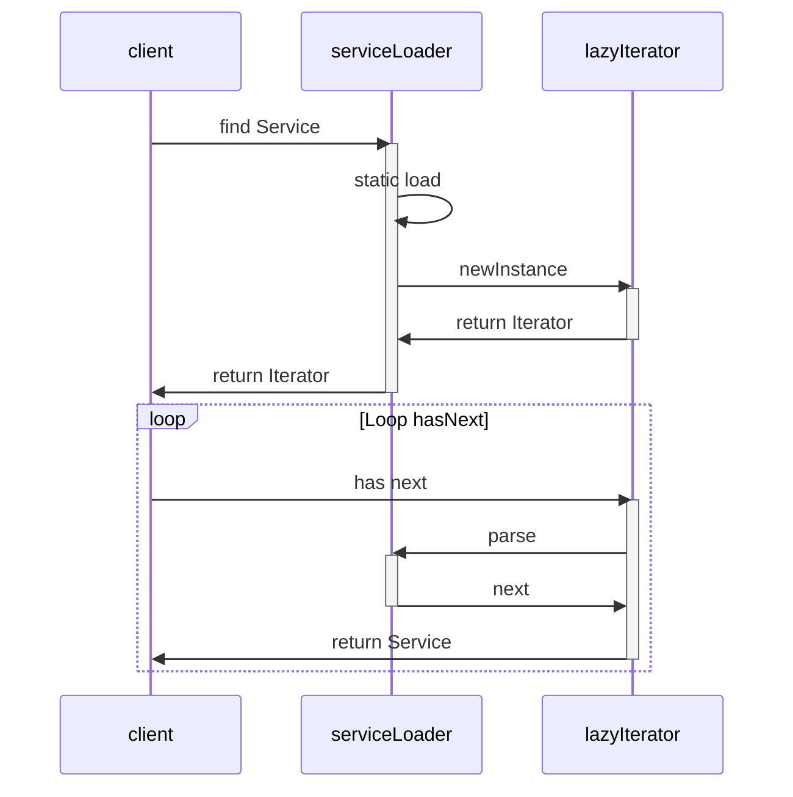

# Java SPI 机制

先描述下API（Application Programming Interface ）。在java中，我们使用java提供的很多类、类的方法、数据结构来编写我们的应用程序，最终完成我们需求的程序功能，这里的类、方法、数据结构即是jdk提供的api。api的意义，其实就是这些提供给你完成某项功能的类、接口或者方法。

而SPI（Service Provider Interface）是指一些提供给你**继承、扩展，完成自定义功能**的类、接口或者方法。我们系统里抽象的各个模块，往往有很多不同的实现方案，比如日志模块的方案，xml解析模块、jdbc模块的方案等。面向的对象的设计里，我们一般推荐模块之间基于接口编程，模块之间不对实现类进行硬编码。一旦代码里涉及具体的实现类，就违反了可拔插的原则，如果需要替换一种实现，就需要修改代码。为了实现在模块装配的时候能不在程序里动态指明，这就需要一种服务发现机制。

java spi就是提供这样的一个机制：为某个接口寻找服务实现的机制。有点类似IOC的思想，就是将装配的控制权移到程序之外，在模块化设计中这个机制尤其重要。

<!--more-->

## SPI 的约定

java spi的具体约定为:当服务的提供者，提供了服务接口的一种实现之后，在jar包的META-INF/services/目录里同时创建一个以服务接口命名的文件。该文件里就是实现该服务接口的具体实现类。而当外部程序装配这个模块的时候，就能通过该jar包META-INF/services/里的配置文件找到具体的实现类名，并装载实例化，完成模块的注入。 基于这样一个约定就能很好的找到服务接口的实现类，而不需要再代码里制定。

这里有个例子：JDBC。jdbc4.0以前， 开发人员还需要基于Class.forName("xxx")的方式来装载驱动，jdbc4也基于spi的机制来发现驱动提供商了，可以通过META-INF/services/java.sql.Driver文件里指定实现类的方式来暴露驱动提供者。

## SPI 使用例子

假设有一个内容搜索系统，搜索模块基于接口编程。搜索的实现可能是基于文件系统的搜索，也可能是基于数据库的搜索。

```java
package info.victorchu.spi;
public interface Search {
    // 同一个 service 可能会加载多个实现，这时候需要对实现做是否适配判断，例如，jdbc 的acceptUrl。
    Boolean canSearch(String query);
    String search(String query);
}


public class FileSearch implements Search{
    @Override
    public Boolean canSearch(String query) {
        return query.startsWith("file://");
    }

    @Override
    public String search(String query) {
        return "文件搜索";
    }
}


public class DataBaseSearch implements Search{
    @Override
    public Boolean canSearch(String query) {
        return query.startsWith("db://");
    }

    @Override
    public String search(String query) {
        return "数据库搜索";
    }
}

public class DoSearch {
    public static String search(String query) {
        ServiceLoader<Search> sl = ServiceLoader.load(Search.class);
        Iterator<Search> s = sl.iterator();
        while (s.hasNext()) {
            Search ss = s.next();
            if(ss.canSearch(query)) {
                return ss.search(query);
            }
        }
        throw new RuntimeException("No Search Impl Found");
        
    }
}
```

最后在META-INF/services目录下创建info.victorchu.spi.Search文件.

```sh
 .
├── pom.xml
└── src
    └── main
        ├── java
        │   └── info
        │       └── victorchu
        │           └── spi
        │               ├── DataBaseSearch.java
        │               ├── DoSearch.java
        │               ├── FileSearch.java
        │               └── Search.java
        └── resources
            └── META-INF
                └── services
                   └── info.victorchu.spi.Search

```

## SPI 的源码实现

jdk提供服务实现查找的一个工具类：java.util.ServiceLoader\<S\>，整个流程的时序图如下


ServiceLoader 的源码:

```java 
public final class ServiceLoader<S> implements Iterable<S>{
    // SPI 查找路径
    private static final String PREFIX = "META-INF/services/";

    // 被加载的服务
    private final Class<S> service;

    // 定位，加载和实例化提供商服务的类加载器
    private final ClassLoader loader;

    // The access control context taken when the ServiceLoader is created
    private final AccessControlContext acc;

    // 顺序缓存提供商服务
    private LinkedHashMap<String,S> providers = new LinkedHashMap<>();

    // 懒搜索迭代器
    private LazyIterator lookupIterator;

    /**
     * 清空当前loader的缓存提供商服务，重新加载所有服务。
     * 在调用该方法后，如果接下来调用 iterator()方法，会懒搜索，实例化提供商服务。
     * 这个方法是为了把新的提供商服务加入运行中的Java 虚拟机。
     */
    public void reload() {
        providers.clear();
        lookupIterator = new LazyIterator(service, loader);
    }

    private ServiceLoader(Class<S> svc, ClassLoader cl) {
        service = Objects.requireNonNull(svc, "Service interface cannot be null");
        // 设置service 的类加载器
        loader = (cl == null) ? ClassLoader.getSystemClassLoader() : cl;
        // 安全控制
        acc = (System.getSecurityManager() != null) ? AccessController.getContext() : null;
        reload();
    }

    // 失败处理 
    private static void fail(Class<?> service, String msg, Throwable cause) throws ServiceConfigurationError{
        throw new ServiceConfigurationError(service.getName() + ": " + msg,cause);
    }

    private static void fail(Class<?> service, String msg)throws ServiceConfigurationError{
        throw new ServiceConfigurationError(service.getName() + ": " + msg);
    }

    private static void fail(Class<?> service, URL u, int line, String msg) throws ServiceConfigurationError{
        fail(service, u + ":" + line + ": " + msg);
    }

　 // 从给定的配置文件读取一行，把服务提供商名字加入名称列表。
    private int parseLine(Class<?> service, URL u, BufferedReader r, int lc,List<String> names) throws IOException, ServiceConfigurationError　{
        String ln = r.readLine();
        if (ln == null) {
            return -1;
        }
        // '#' 后面的是注释
        int ci = ln.indexOf('#');
        if (ci >= 0) ln = ln.substring(0, ci);
        ln = ln.trim();
        int n = ln.length();
        if (n != 0) {
            if ((ln.indexOf(' ') >= 0) || (ln.indexOf('\t') >= 0))
                fail(service, u, lc, "Illegal configuration-file syntax");
            int cp = ln.codePointAt(0);
            if (!Character.isJavaIdentifierStart(cp))
                fail(service, u, lc, "Illegal provider-class name: " + ln);
            for (int i = Character.charCount(cp); i < n; i += Character.charCount(cp)) {
                cp = ln.codePointAt(i);
                if (!Character.isJavaIdentifierPart(cp) && (cp != '.'))
                    fail(service, u, lc, "Illegal provider-class name: " + ln);
            }
            if (!providers.containsKey(ln) && !names.contains(ln))
                names.add(ln);
        }
        return lc + 1;
    }

    // 把给定URL的文件内容当作提供服务配置文件解析。
    private Iterator<String> parse(Class<?> service, URL u)　throws ServiceConfigurationError　{
        InputStream in = null;
        BufferedReader r = null;
        ArrayList<String> names = new ArrayList<>();
        try {
            in = u.openStream();
            r = new BufferedReader(new InputStreamReader(in, "utf-8"));
            int lc = 1;
            while ((lc = parseLine(service, u, r, lc, names)) >= 0);
        } catch (IOException x) {
            fail(service, "Error reading configuration file", x);
        } finally {
            try {
                if (r != null) r.close();
                if (in != null) in.close();
            } catch (IOException y) {
                fail(service, "Error closing configuration file", y);
            }
        }
        return names.iterator();
    }

    //　懒搜索迭代器
    private class LazyIterator implements Iterator<S>
    {

        Class<S> service;
        ClassLoader loader;
        Enumeration<URL> configs = null;
        Iterator<String> pending = null;
        String nextName = null;

        private LazyIterator(Class<S> service, ClassLoader loader) {
            this.service = service;
            this.loader = loader;
        }

        private boolean hasNextService() {
            if (nextName != null) {
                return true;
            }
            if (configs == null) {
                try {
                    //获取META-INF/services/目录下对应类型文件
                    String fullName = PREFIX + service.getName();
                    // 懒搜索
                    if (loader == null)
                        configs = ClassLoader.getSystemResources(fullName);
                    else
                        configs = loader.getResources(fullName);
                } catch (IOException x) {
                    fail(service, "Error locating configuration files", x);
                }
            }
            while ((pending == null) || !pending.hasNext()) {
                if (!configs.hasMoreElements()) {
                    return false;
                }
                pending = parse(service, configs.nextElement());
            }
            nextName = pending.next();
            return true;
        }

        private S nextService() {
            if (!hasNextService())
                throw new NoSuchElementException();
            String cn = nextName;
            nextName = null;
            Class<?> c = null;
            try {
                //反射加载类
                c = Class.forName(cn, false, loader);
            } catch (ClassNotFoundException x) {
                fail(service,
                     "Provider " + cn + " not found");
            }
            if (!service.isAssignableFrom(c)) {
                fail(service,
                     "Provider " + cn  + " not a subtype");
            }
            try {
                //实例化
                S p = service.cast(c.newInstance());
                //放进缓存
                providers.put(cn, p);
                return p;
            } catch (Throwable x) {
                fail(service,
                     "Provider " + cn + " could not be instantiated",
                     x);
            }
            throw new Error();          // This cannot happen
        }

        public boolean hasNext() {
            if (acc == null) {
                return hasNextService();
            } else {
                PrivilegedAction<Boolean> action = new PrivilegedAction<Boolean>() {
                    public Boolean run() { return hasNextService(); }
                };
                return AccessController.doPrivileged(action, acc);
            }
        }

        public S next() {
            if (acc == null) {
                return nextService();
            } else {
                PrivilegedAction<S> action = new PrivilegedAction<S>() {
                    public S run() { return nextService(); }
                };
                return AccessController.doPrivileged(action, acc);
            }
        }

        public void remove() {
            throw new UnsupportedOperationException();
        }

    }

    /**
     * 懒加载服务的所有提供商。
     */
    public Iterator<S> iterator() {
        return new Iterator<S>() {

            Iterator<Map.Entry<String,S>> knownProviders
                = providers.entrySet().iterator();

            public boolean hasNext() {
                if (knownProviders.hasNext())
                    return true;
                return lookupIterator.hasNext();
            }

            public S next() {
                if (knownProviders.hasNext())
                    return knownProviders.next().getValue();
                return lookupIterator.next();
            }

            public void remove() {
                throw new UnsupportedOperationException();
            }

        };
    }

    /**
     * 使用ClassLoader,为给定的服务创建一个新的service loader。
     */
    public static <S> ServiceLoader<S> load(Class<S> service,
                                            ClassLoader loader)
    {
        return new ServiceLoader<>(service, loader);
    }

    /**
     * 使用ClassLoader,为给定的服务创建一个新的service loader。
     */
    public static <S> ServiceLoader<S> load(Class<S> service) {
        ClassLoader cl = Thread.currentThread().getContextClassLoader();
        return ServiceLoader.load(service, cl);
    }

    /**
     * 使用ClassLoader,为给定的服务创建一个新的service loader。
     */
    public static <S> ServiceLoader<S> loadInstalled(Class<S> service) {
        ClassLoader cl = ClassLoader.getSystemClassLoader();
        ClassLoader prev = null;
        while (cl != null) {
            prev = cl;
            cl = cl.getParent();
        }
        return ServiceLoader.load(service, prev);
    }

    public String toString() {
        return "java.util.ServiceLoader[" + service.getName() + "]";
    }
}
```

