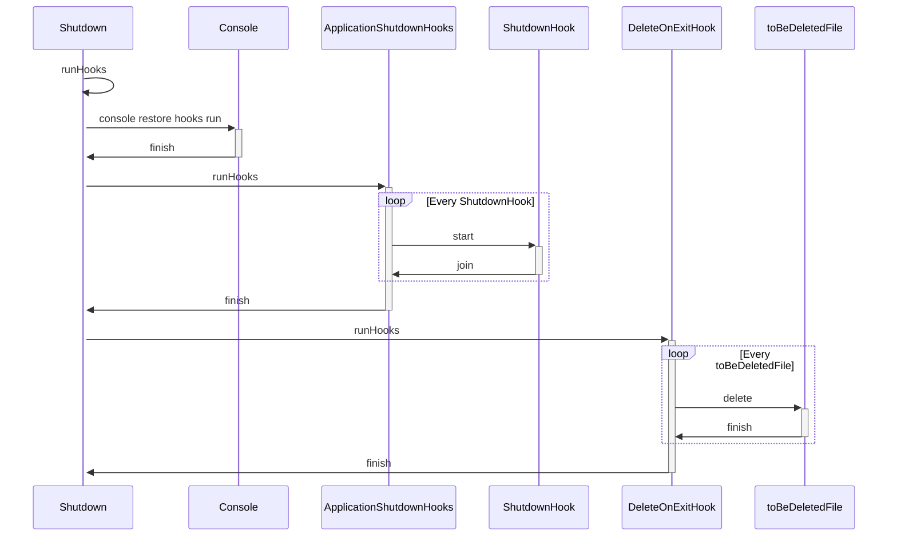
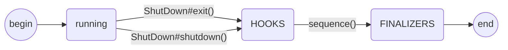

# Java应用如何使用shutdownhook

在线上Java程序中经常遇到进程程挂掉，一些状态没有正确的保存下来，这时候就需要在JVM关掉的时候执行一些清理现场的代码。

<!--more-->

JDK在1.3之后提供了Java Runtime.addShutdownHook(Thread hook)方法，可以注册一个JVM关闭的钩子，这个钩子可以在以下几种场景被调用：

1. 程序正常退出
2. 使用System.exit()
3. 终端使用Ctrl+C触发的中断
4. 系统关闭
5. 使用Kill pid命令干掉进程(kill -9|19 除外)

关闭钩子在以下情景不会被调用：

- 通过kill -9命令杀死进程——所以kill -9|19 一定要慎用；
- 程序中执行到了Runtime.getRuntime().halt()方法，该方法会强行关闭虚拟机；
- 操作系统突然崩溃，或机器掉电。

> 注意，一旦开始执行ShutdownHook时，无法再向JVM中addShutdownHook。

在JDK中方法的声明：

```java
public void addShutdownHook(Thread hook)
参数
hook -- 一个初始化但尚未启动的线程对象，注册到JVM钩子的运行代码。
异常
IllegalArgumentException -- 如果指定的钩已被注册，或如果它可以判定钩已经运行或已被运行
IllegalStateException -- 如果虚拟机已经是在关闭的过程中
SecurityException -- 如果存在安全管理器并且它拒绝的RuntimePermission（“shutdownHooks”）
```

## 中断信号

在Linux信号机制中，存在多种进程中断信号（Linux信号列表 ）。其中比较典型的有 SIGNKILL(9)，SIGSTOP(19) 和 SIGNTERM(15).

SIGNKILL(9),SIGSTOP(19) 和 SIGNTERM(15)的区别在于：
SIGNKILL(9),SIGSTOP(19) 的效果是立即杀死进程. 该信号不能被阻塞, 处理和忽略。
SIGNTERM(15) 的效果是正常退出进程，退出前可以被阻塞或回调处理。并且它是Linux缺省的程序中断信号。

在使用`kill -9|19 pid`时JVM注册的钩子不会被调用。 kill 命令默认信号是 `15` ，`9|19` 时会强制关闭。通常在使⽤ `kill -9|19` 前，应该先使⽤ `kill -15`，给⽬标进程⼀个清理善后⼯作的机会。如果没有，可能会留下⼀些不完整的⽂件或状态，从⽽影响服务的再次启动。

## demo

```java
public class TestShutdownHook {
    static Timer timer = new Timer("job-timer");
    static AtomicInteger count = new AtomicInteger(0);

    /**
     * hook线程
     */
    static class CleanWorkThread extends Thread{
        @Override
        public void run() {
            System.out.println("clean some work.");
            timer.cancel();
            try {
                System.out.println("try sleep 2s.");
                Thread.sleep(2 * 1000);
                System.out.println("sleep 2s.");
            } catch (InterruptedException e) {
                e.printStackTrace();
            }
        }
    }
    public static void main(String[] args) throws InterruptedException {
        //将hook线程添加到运行时环境中去
        Runtime.getRuntime().addShutdownHook(new CleanWorkThread());
        System.out.println("ShutdownHook added");
        //简单模拟
        timer.schedule(new TimerTask() {
            @Override
            public void run() {
                count.getAndIncrement();
                System.out.println("doing job " + count);
                if (count.get() == 3) {  //执行了3次后退出
                    System.exit(0);
                }
            }
        }, 0, 2 * 1000);
    }
}
```

output:

```sh
ShutdownHook added
doing job 1
doing job 2
doing job 3
clean some work.
try sleep 2s.
sleep 2s.
```

## 源码分析

Runtime类中对ShutdownHook的操作都是通过工具类ApplicationShutdownHooks来实现的。

```java
class ApplicationShutdownHooks {
    private static IdentityHashMap<Thread, Thread> hooks;
    static {
        try {
            // 注册根shutdown(shutdown 槽)
            Shutdown.add(1 /* shutdown hook 调用顺序 */,
                false /* not registered if shutdown in progress，默认为false */,
                new Runnable() {
                    public void run() {
                        runHooks();
                    }
                }
            );
            hooks = new IdentityHashMap<>();
        } catch (IllegalStateException e) {
            // application shutdown hooks cannot be added if
            // shutdown is in progress.
            hooks = null;
        }
    }

    private ApplicationShutdownHooks() {}
    // 添加钩子
    static synchronized void add(Thread hook) {
        // shutdown hooks执行中无法添加新钩子
        if(hooks == null)
            throw new IllegalStateException("Shutdown in progress");

        if (hook.isAlive())
            throw new IllegalArgumentException("Hook already running");

        if (hooks.containsKey(hook))
            throw new IllegalArgumentException("Hook previously registered");

        hooks.put(hook, hook);
    }

    static synchronized boolean remove(Thread hook) {
        if(hooks == null)
            throw new IllegalStateException("Shutdown in progress");

        if (hook == null)
            throw new NullPointerException();

        return hooks.remove(hook) != null;
    }

    /* 遍历所有 application hooks 并启动线程*/
    static void runHooks() {
        Collection<Thread> threads;
        synchronized(ApplicationShutdownHooks.class) {
            threads = hooks.keySet();
            hooks = null;
        }

        for (Thread hook : threads) {// 顺序调起 hooks
            hook.start(); // 此处start说明shutdown hook 是乱序执行的
        }
        // 等待所有 hooks 运行完毕退出
        for (Thread hook : threads) {
            while (true) {
                try {
                    hook.join(); // hook 线程阻塞当前线程
                    break;
                } catch (InterruptedException ignored) {
                }
            }
        }
    }
}
```

ApplicationShutdownHooks 类中也有一个集合`IdentityHashMap<Thread, Thread> hooks` ，专门用来存放由用户自定义的 Application hooks 类型的 ShutdownHook 。通过`ApplicationShutdownHooks#add` 方法添加进 hooks 集合中。

然后在 runHooks 方法里挨个启动 ShutdownHook 线程，并发执行。注意这里的 runHooks 方法是 ApplicationShutdownHooks 类中的。

在 ApplicationShutdownHooks 类的静态代码块中会将 runHooks 方法封装成 Runnable 添加进 Shutdown 类中的 hooks 数组中。注意这里 Shutdown#add 方法传递进的索引是 1 。

### Shutdown

下面来看下Shutdown的源码。Shutdown 类中，包含了一个 `Runnable[]` hooks 数组，容量为 10 。JDK 中的 ShutdownHook 是以类型来分类的，数组 hooks 每一个槽中存放的是一种特定类型的 ShutdownHook 。

- (0) Console restore hook ：处理命令行
- (1) Application hooks
- (2) DeleteOnExit hook

在程序代码中通过 Runtime.getRuntime().addShutdownHook 注册的是 Application hooks 类型的 ShutdownHook ，存放在数组 hooks 中索引为 1 的槽中。

参数 registerShutdownInProgress 表示是否允许在 JVM 关闭流程开始之后，继续向 JVM 添加 ShutdownHook 。默认为 false 表示不允许。否则将会抛出 IllegalStateException 异常。



Shutdown的源码如下:

```java
class Shutdown {
    // Shutdown 状态 枚举
    private static final int RUNNING = 0;
    private static final int HOOKS = 1;
    private static final int FINALIZERS = 2;
    // 存储 Shutdown状态
    private static int state = RUNNING;

    // 是否退出时执行所有回收器
    private static boolean runFinalizersOnExit = false;
    private static final int MAX_SYSTEM_HOOKS = 10; // 最大hook slot 数是10
    private static final Runnable[] hooks = new Runnable[MAX_SYSTEM_HOOKS];

    // 当前运行的hook在数组中的位置
    private static int currentRunningHook = 0;

    private static class Lock { };
    private static Object lock = new Lock();
    private static Object haltLock = new Lock();

    // 被 Runtime.runFinalizersOnExit() 调用
    static void setRunFinalizersOnExit(boolean run) {
        synchronized (lock) {
            runFinalizersOnExit = run;
        }
    }

    /**
     * 添加新的shutdown，检查状态和配置
     *
     * 除了注册DeleteOnExitHook的时侯，registerShutdownInProgress 参数默认设为false.
     * application shutdown hooks 在运行中的时候，可能会向DeleteOnExitHook添加文件
     * File.deleteOnExit() 会调用 DeleteOnExitHook.add(path);
     */
    static void add(int slot, boolean registerShutdownInProgress, Runnable hook) {
        synchronized (lock) {
            if (hooks[slot] != null)
                throw new InternalError("Shutdown hook at slot " + slot + " already registered");

            if (!registerShutdownInProgress) {
                if (state > RUNNING)
                    throw new IllegalStateException("Shutdown in progress");
            } else {
                // 1. 已经执行完了hook 阶段
                // 2. 还在处理hook阶段，但是已经处理完了这个slot
                if (state > HOOKS || (state == HOOKS && slot <= currentRunningHook))
                    throw new IllegalStateException("Shutdown in progress");
            }

            hooks[slot] = hook;
        }
    }

    /* 运行所有的shutdownhook
     */
    private static void runHooks() {
        for (int i=0; i < MAX_SYSTEM_HOOKS; i++) {
            try {
                Runnable hook;
                synchronized (lock) {
                    // 确保数组的可见性
                    currentRunningHook = i;
                    hook = hooks[i];
                }
                if (hook != null) hook.run(); // 注意此处是顺序执行的
                // 使用的是run,而不是start()
            } catch(Throwable t) {
                if (t instanceof ThreadDeath) {
                    ThreadDeath td = (ThreadDeath)t;
                    throw td;
                }
            }
        }
    }
    // 强制结束，status是非零退出码。注册的 ShutdownHook 不会被运行和执行，
    // 如果此时 JVM 正在执行。ShutdownHook 当调用该方法后，
    // JVM 进程将会被强制关闭，并不会等待 ShutdownHook 执行完毕。
    static void halt(int status) {
        synchronized (haltLock) {
            // 此处加类锁,是为了防止处理 delete-on-shutdown 文件列表时的并发问题
            halt0(status);
        }
    }
    static native void halt0(int status);

    /* 实际上等同调用 java.lang.ref.Finalizer.runAllFinalizers */
    private static native void runAllFinalizers();


    /* 真正的shutdown逻辑。
     */
    private static void sequence() {
        synchronized (lock) {
            /* 防止守护线程在jvm 执行shutdown后调用exit()
             */
            if (state != HOOKS) return;
        }
        runHooks(); // 运行钩子方法
        boolean rfoe;
        synchronized (lock) {
            state = FINALIZERS; // 此处修改了state
            rfoe = runFinalizersOnExit;
        }
        if (rfoe) runAllFinalizers(); // 执行所有的 finalizer
    }


    /* 被Runtime.exit()调用, 或者被系统终止事件handler调用。
     */
    static void exit(int status) {
        boolean runMoreFinalizers = false;
        synchronized (lock) {
            if (status != 0) runFinalizersOnExit = false;  // 不正常退出
            switch (state) {
            case RUNNING:       /* Initiate shutdown */
                state = HOOKS;
                break;
            case HOOKS:         /* Stall and halt */
                break;
            case FINALIZERS:
                if (status != 0) {
                    // 非0状态立即停止
                    halt(status);
                } else {
                    // 执行finalizer后退出
                    runMoreFinalizers = runFinalizersOnExit;
                }
                break;
            }
        }
        if (runMoreFinalizers) {
            runAllFinalizers();
            halt(status);
        }
        synchronized (Shutdown.class) {
            /* Synchronize on the class object, causing any other thread
             * that attempts to initiate shutdown to stall indefinitely
             */
            sequence();
            halt(status);
        }
    }

    /* 
     * Invoked by the JNI DestroyJavaVM procedure when the last non-daemon
     * thread has finished.  Unlike the exit method, this method does not
     * actually halt the VM.
     */
    static void shutdown() {
        synchronized (lock) {
            switch (state) {
            case RUNNING:       /* Initiate shutdown */
                state = HOOKS;
                break;
            case HOOKS:         /* Stall and then return */
            case FINALIZERS:
                break;
            }
        }
        synchronized (Shutdown.class) {
            sequence();
        }
    }
}
```

shutdown的字段state的状态机如下图所示:



触发ShowdownHook执行的原因有3个:

- 最后一个非收获进程退出时，通过`JNI DestroyJavaVM`调用 `Shutdown#shutdown`
- 调用`Runtime.exit(status)`或`System.exit(status)`
- 系统信号Terminator(status不为0)

> 注意，Shutdown#exit(status)的参数不为0时，Finalizers不会运行

### delete-on-exit file list

java.io.File的deleteOnExit()方法可以在JVM退出时，删除文件。主要的实现就是DeleteOnExitHook.

```java
class DeleteOnExitHook {
    private static LinkedHashSet<String> files = new LinkedHashSet<>();
    static {
        // DeleteOnExitHook 必须是最后一个被调用的shutdown hook。
        // Application shutdown hooks 可能会向 delete on exit file list中添加文件,
        // 此时shutdown的状态是 hooks， 所以将 registerShutdownInProgress 设置为 true.
        sun.misc.SharedSecrets.getJavaLangAccess()
            .registerShutdownHook(2 /* Shutdown hook invocation order */,
                true /* register even if shutdown in progress */,
                new Runnable() {
                    public void run() {
                       runHooks();
                    }
                }
        );
    }

    private DeleteOnExitHook() {}

    static synchronized void add(String file) {
        if(files == null) {
            // DeleteOnExitHook is running. Too late to add a file
            throw new IllegalStateException("Shutdown in progress");
        }

        files.add(file);
    }

    static void runHooks() {
        LinkedHashSet<String> theFiles;

        synchronized (DeleteOnExitHook.class) {
            theFiles = files;
            files = null;
        }

        ArrayList<String> toBeDeleted = new ArrayList<>(theFiles);

        // reverse the list to maintain previous jdk deletion order.
        // Last in first deleted.
        Collections.reverse(toBeDeleted);
        for (String filename : toBeDeleted) {
            (new File(filename)).delete();
        }
    }
}
```

---
* 本文JDK源码基于Java8

