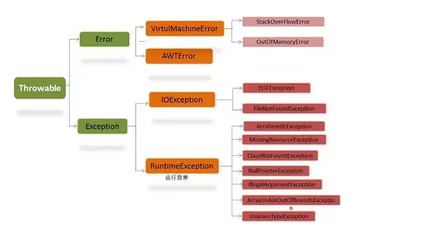

# Java 异常处理


> 1. Java 的基本原理就是“形式错误的代码不会运行”\(编译错误="形式错误的代码"\)。  
> 2. 捕获错误最理想的是在编译期间,最好在试图运行程序以前。然而,并非所有错误都能在编译期间侦测到。有些问题必须在运行期间解决,让错误的缔结者通过一些手续向接收者传递一些适当的信息,使其知道该如何正确地处理遇到的问题。
>> 摘自 `<thinking in java 4th>`

<!--more-->

## 异常基本介绍

"违例"(Exception)表示"例外"情况。当一个Exception产生时,要么解决这个问题(catch),要么将与错误有关的信息发送到更高一级的处理(throw),在更恰当的地方解决。

### 违例的构造

和 Java 的其他任何对象一样,需要用 new 在内存堆里创建违例,并需调用一个构建器。在所有标准违例中,存在着两个构建器:第一个是默认构建器,第二个则需使用一个字串自变量,使我们能在违例里置入相关信息。我们可根据需要掷出任何类型的“可掷”对象。通常情况下,我们要为每种不同类型的错误“掷”出一类不同的违例。我们的思路是在违例对象以及挑选的违例对象类型中保存信息。(通常,唯一的信息是违例对象的类型,而违例对象中保存的没什么意义)。

### 违例的捕获

"警戒区"代表一个特殊的代码区域,有可能产生违例,并在后面跟随用于控制那些违例的代码。

#### try 块

```java
    try{
        // 可能产生Exception的代码
    }
```

#### 违例控制(catch)

生成的Exception 必须在某处中止(违例控制器 => catch)。针对想捕获的每种违例类型,都必须有一个相应的违例控制器。违例控制器紧接在 try 块后面,且用 catch(捕获)关键字标记。

```java
try{
    // 可能产生异常的代码
}catch(type1 id1){
    // 处理类型为type1的Exception
}catch(type2 id2){
    // 处理类型为type2的
}
```

若“掷”出一个违例,违例控制机制就会搜寻自变量与违例类型相符的第一个控制器。随后,它会进入那个 catch 从句,并认为违例已得到控制(一旦 catch 从句结束,对控制器的搜索也会停止)。只有相符的 catch 从句才会得到执行。

>注意：一个衍生异常类对象可与基础异常类的一个控制器相配。

```java
//异常匹配
class Annoyance extends Exception {}
class Sneeze extends Annoyance {}

public class Human {
  public static void main(String[] args) {
    try {
      throw new Sneeze();
    } catch(Annoyance a) {
      System.out.println("Caught Annoyance");
    }  catch(Sneeze s) {
    System.out.println("Caught Sneeze");
    }
  }
}
//-----------------------------------------------
//output:
//Caught Annoyance
```

在违例控制理论中,共存在两种基本方法。

* 在“中断”方法中,我们假定错误非常关键,没有办法返回违例发生的地方。无论谁只要“掷”出一个违例,就表明没有办法补救错误,而且也不希望再回来。
* 另一种方法叫作“恢复”。它意味着违例控制器有责任来纠正当前的状况,然后取得出错的方法,假定下一次会成功执行。若使用恢复,意味着在违例得到控制以后仍然想继续执行。

#### 违例规范

方法声明时在自变量列表的后面，加上“违例规范”。

```java
void f() throws Exception1,Exception2 { }
//throws 后面跟随全部潜在的违例类型。
```

#### 捕获所有违例

```java
catch(Exception e){ }
```

Exception 类是常见违例的基础类,所以实际使用时,应该将其放在控制器列表的末尾，防止其他控制器失效。
捕获到Exception 后可以调用:

* 获得详细消息 `getMessage()`
* 获得调用堆栈路径 `printStackTrace()`

### 重新抛出违例

* 重新抛出捕获的异常

```java
catch(Exception e){
  throw e; //重新抛出捕获的句柄
}
```

若只是简单地重新掷出当前违例,在调用printStackTrace()方法时,会输出违例真正的产生位置,而不是重新掷出的位置。若想更新堆栈信息(将当前的堆栈信息填充到原来的违例对象里),可以调用fillInStackTrace()方法.

```java
catch(Exception e){
    throw e.fillInStackTrace();
}
```

* 从捕获的违例中重新抛出一个不同的违例

这样做,会得到与使用fillInStackTrace()类似的效果:与违例起源地有关的信息会全部丢失,我们留下的是与新的 throw 有关的信息。

## Java Exception 



在 Java 中，所有的异常都有一个共同的祖先 Throwable（可抛出）。Throwable 指定代码中可用异常传播机制通过 Java 应用程序传输的任何问题的共性。Throwable： 有两个重要的子类：Exception（异常）和 Error（错误），二者都是 Java 异常处理的重要子类，各自都包含大量子类。

* Error（错误）:是程序无法处理的错误，表示运行应用程序中较严重问题。
    大多数错误与代码编写者执行的操作无关，而表示代码运行时 JVM（Java 虚拟机）出现的问题。例如，Java虚拟机运行错误（Virtual MachineError），当 JVM 不再有继续执行操作所需的内存资源时，将出现 OutOfMemoryError。这些异常发生时，Java虚拟机（JVM）一般会选择线程终止。。 这些错误表示故障发生于虚拟机自身、或者发生在虚拟机试图执行应用时，如Java虚拟机运行错误（Virtual MachineError）、类定义错误（NoClassDefFoundError）等。这些错误是不可查的，因为它们在应用程序的控制和处理能力之 外，而且绝大多数是程序运行时不允许出现的状况。对于设计合理的应用程序来说，即使确实发生了错误，本质上也不应该试图去处理它所引起的异常状况。在 Java中，错误通过Error的子类描述。

* Exception（异常）:是程序本身可以处理的异常。
    Exception 类有一个重要的子类 RuntimeException。RuntimeException 类及其子类表示“JVM 常用操作”引发的错误。例如，若试图使用空值对象引用、除数为零或数组越界，则分别引发运行时异常（NullPointerException、 ArithmeticException）和 ArrayIndexOutOfBoundException。

> 注意：异常和错误的区别：异常能被程序本身可以处理，错误是无法处理。

### Exception

Exception 这种异常分两大类运行时异常和非运行时异常(编译异常)。

* 运行时异常：
    都是RuntimeException类及其子类异常，如NullPointerException(下标越界异常)等，这些异常是不检查异常，程序中可以选择捕获处理，也可以不处理。这些异常一般是由程序逻辑错误引起的，程序应该从逻辑角度尽可能避免这类异常的发生。运行时异常的特点是Java编译器不会检查它，也就是说，当程序中可能出现这类异常，即使没有用try-catch语句捕获它，也没有用throws子句声明抛出它，也会编译通过。

* 非运行时异常 （编译异常）：
    是 RuntimeException以外的异常，类型上都属于Exception类及其子类。从程序语法角度讲是必须进行处理的异常，如果不处理，程序就不能编译通过。当程序中可能出现这类异常，要么用try-catch语句捕获它，要么用throws子句声明抛出它，否则编译不会通过。

### 自定义违例

自定义异常Example

```java
class MyException extends Exception {
  public MyException() {}
  public MyException(String msg) {
    super(msg);
  }
}

class SimpleException extends Exception {
}
```

### 继承中的违例限制

* 基类方法没有抛出异常，衍生类覆盖的方法也不能抛出异常。
* 若基类方法抛出异常，衍生类方法可不抛出异常，或抛出同样的异常(基类抛出的异常及其子类)
* 衍生类的构造器可以增加抛出的异常种类，但必须处理基类构造器的异常。注意：衍生类上溯造型到基础类型时,编译器就会强迫我们捕获针对基础类的违例。

> “违例规范接口”可能在继承和覆盖时变得更“窄”,但它不会变得更“宽”——这与继承时的类接口规则(衍生类方法是对基类接口的扩展)是正好相反的。
>> 摘自 `<thinking in java 4th>`

### finally

try-catch语句还可以包括第三部分，就是finally子句。它表示无论是否出现异常，都应当执行的内容。try-catch-finally语句的一般语法形式为：

```java
try {  
        // 可能会发生异常的程序代码  
    } catch (Type1 id1) {  
        // 捕获并处理try抛出的异常类型Type1  
    } catch (Type2 id2) {  
        // 捕获并处理try抛出的异常类型Type2  
    } finally {  
        // 无论是否发生异常，都将执行的语句块  
    }  
```

小结：

* try 块：用于捕获异常。其后可接零个或多个catch块，如果没有catch块，则必须跟一个finally块。
* catch 块：用于处理try捕获到的异常。
* finally 块：无论是否捕获或处理异常，finally块里的语句都会被执行。当在try块或catch块中遇到return语句时，finally语句块将在方法返回之前被执行。

在以下3种特殊情况下，finally块不会被执行完：

* JVM 过早终止（调用 System.exit(int)）；
* 在 finally 块中抛出一个未处理的异常；
* 计算机断电、失火、或遭遇病毒攻击。

### try、catch、finally语句块的执行顺序

* 当try没有捕获到异常时，try语句块中的语句逐一被执行，程序将跳过catch语句块，执行finally语句块和其后的语句；
* 当try语句块里的某条语句出现异常时，而没有处理此异常的catch语句块时，此异常将会抛给JVM处理，finally语句块里的语句还是会被执行，但finally语句块后的语句不会被执行；
* 当try捕获到异常，catch语句块里有处理此异常的情况：在try语句块中是按照顺序来执行的，当执行到某一条语句出现异常时，程序将跳到 catch语句块，并与catch语句块逐一匹配，找到与之对应的处理程序，其他的catch语句块将不会被执行，而try语句块中，出现异常之后的语句 也不会被执行，catch语句块执行完后，执行finally语句块里的语句，最后执行finally语句块后的语句；

### finaly 带来的问题

#### try -finally 中的丢失

* 返回值的覆盖：

```java
public class testfinally {

    private String test(){
        try{
            System.out.println("try starts...");
            return "success";
        }
        finally{
            System.out.println("finally starts...");
            return "false";
        }
    }
    public static void main(String[] argvs){
        String result = new testfinally().test();
        System.out.println("result is: "+result);
    }
}
//--------------------------------------
//output:
//try starts...
//finally starts...
//result is: false
```

* 返回值的副本操作:

```java
public class testfinally {
    private String test(){
        String flag = "";
        try{
            System.out.println("try starts...");
            flag = "success";
            return flag;
        }
        finally{
            System.out.println("finally starts...");
            flag = flag + "-> return after finally";
            System.out.println("flag is: "+flag);
        }
    }

    public static void main(String[] argvs){
        String result = new testfinally().test();
        System.out.println("result is: "+result);
    }
}
//-------------------------------------------
//output:
//try starts...
//finally starts...
//flag is: success-> return after finally
//result is: success
```

考虑下面的一个例子:

```java
public int inc(){
    int x;
    try {
        x = 1;
        // throw new RuntimeException();
        return x;
    } catch (Exception e) {
        x =2;
        return x;
    } finally{
        x = 3;
        // System.out.println("x:" + x);
        // return x;
    }
}
```

- 在没有出现异常的情况下，先执行了`x=1`;然后执行`return x;`时，首先是将x的一个副本保存在本地变量表中，执行return之前必须执行finally中的操作：`x=3`;将x的值设置为了3，但是return 时是将本地变量表中保存的x的那个副本拿出来放到栈顶返回。故没出异常时，返回值为1；
- 出Exception异常或其子类异常时，返回值是2；
- 如果出现非 Exception异常，则执行完x=3之后，抛出异常，没有返回值。

#### catch-finally 中的丢失

* 抛出异常覆盖：

```java
public class testfinally {

    private String test() throws Exception {
        String flag = "";
        try{
            System.out.println("try starts...");
            throw new Exception();
        } catch (Exception e) {
            System.out.println("catch starts...");
            throw e;
        }
        finally{
            System.out.println("finally starts...");
            flag = "-> return in finally";
            return flag;
        }
    }

    public static void main(String[] argvs){
        try {
            String result = new testfinally().test();
            System.out.println("result is: "+result);
        }catch(Exception e){
            e.printStackTrace();
        }

    }
}
//-------------------------------------------
//output:
//try starts...
//catch starts...
//finally starts...
//result is: -> return in finally

public class testfinally {

    private String test() throws Exception {
        String flag = "";
        try{
            System.out.println("try starts...");
            throw new Exception("from try");
        } catch (Exception e) {
            System.out.println("catch starts...");
            throw e;
        }
        finally{
            System.out.println("finally starts...");
            throw new Exception("from finally");
        }
    }

    public static void main(String[] argvs){
        try {
            String result = new testfinally().test();
            System.out.println("result is: "+result);
        }catch(Exception e){
            e.printStackTrace();
        }
    }
}
//----------------------------------------
//output：
//try starts...
//catch starts...
//finally starts...
//java.lang.Exception: from finally
//at mytest1.testfinally.test(testfinally.java:16)
//at mytest1.testfinally.main(testfinally.java:22)
```

* 返回值的副本操作

```java
public class FinallyTest {  

    public static int method(){  
        int a=1;  
        try{  
            throw new Exception();  
        }catch(Exception e){  
            System.out.println("catch:a="+a);  
            return a;  
        }finally{  
            a=2;  
            System.out.println("finally:a="+a);  
        }  
    }  
    public static void main(String[] args) {  
        // TODO Auto-generated method stub  
        System.out.println(method());  
    }  
  
}  
//-------------------------------------------
//output:
//catch:a=1
//finally:a=2
//1
```

## Effective Java Exception

### 只针对异常的情况才使用异常

__*异常只应该被用于不正常的条件，它们永远不应该被用于正常的控制流。*__

* 异常机制的设计初衷是用于不正常的情况，所以很少会会JVM实现试图对它们的性能进行优化。所以，创建、抛出和捕获异常的开销是很昂贵的。
* 把代码放在try-catch中返回阻止了JVM实现本来可能要执行的某些特定的优化。
* 对数组进行遍历的标准模式并不会导致冗余的检查，有些现代的JVM实现会将它们优化掉。

#### 举个例子

```java
try {
    int i=0;
    while (true) {
        arr[i]=0;
        i++;
    }
} catch (IndexOutOfBoundsException e) {
}
```

```java
for (int i=0; i<arr.length; i++) {
    arr[i]=0;
}
```

显然我们应该避免第一种代码的使用方式；这对API设计也有启发，`设计良好的API不应该强迫客户端为了正常的控制流而使用异常。`如果类有“状态相关”的方法，也应该提供“状态测试”方法。例如，Iterator接口有一个“状态相关”方法`next()`，和相应的”状态测试“方法`hasNext()`。

### 对可恢复的情况使用受检异常，对编程错误使用运行时异常

* 运行时异常
    RuntimeException类及其子类都被称为运行时异常。
* 被检查的异常
    Exception的子类中除了"运行时异常"之外的其它子类都属于被检查异常。

它们的区别是：Java编译器会对"被检查的异常"进行检查，而对"运行时异常"不会检查。也就是说，对于被检查的异常，要么通过throws进行声明抛出，要么通过try-catch进行捕获处理，否则不能通过编译。而对于运行时异常，倘若既"没有通过throws声明抛出它"，也"没有用try-catch语句捕获它"，还是会编译通过。当然，虽说Java编译器不会检查运行时异常，但是，我们同样可以通过throws对该异常进行说明，或通过try-catch进行捕获。

ArithmeticException\(例如，除数为0\)，IndexOutOfBoundsException\(例如，数组越界\)等都属于运行时异常。*对于这种异常，我们应该通过修改代码进行避免它的产生。而对于被检查的异常，则可以通过处理让程序恢复运行。*

### 避免不必要地使用受检的异常

"被检查的异常"是Java语言的一个很好的特性。与返回代码不同，"被检查的异常"会强迫程序员处理例外的条件，大大提高了程序的可靠性。

但是，过分使用被检查异常会使API用起来非常不方便。如果一个方法抛出一个或多个被检查的异常，那么调用该方法的代码则必须在一个或多个catch语句块中处理这些异常，或者必须通过throws声明抛出这些异常。无论是通过catch处理，还是通过throws声明抛出，都给程序员添加了不可忽略的负担。

适用于"被检查的异常"必须同时满足两个条件：

* 第一，即使正确使用API并不能阻止异常条件的发生。
* 第二，一旦产生了异常，使用API的程序员可以采取有用的动作对程序进行处理。

#### 把受检的异常变成未受检的异常

"把受检的异常变成未受检的异常"的一种方法是，把抛出异常的方法分为两个方法，其中第一个方法返回一个boolean，表明是否抛出异常。例子如下:

```java
// 受检异常
try{
    obj.action(args);
}catch(CheckedException e){
    //处理受检异常
}

//------------- 重构 -----------------
// 状态测试方法
if(obj.actionPermitted(args)){
    obj.action(atgs);
}else{
    //处理异常case
}
```

>注意，如果对象将在缺少外部同步的情况下并发访问，或可被外界改变状态，这种重构就是不恰当的。

### 优先使用标准的异常

代码重用是值得提倡的，异常也不例外。重用现有的异常有几个好处：

1. 它使得你的API更加易于学习和使用，因为它与程序员已经熟悉的习惯用法是一致的。
2. 对于用到这些API的程序而言，它们的可读性更好，因为它们不会充斥着程序员不熟悉的异常。
3. 异常类越少，意味着内存占用越小，并且转载这些类的时间开销也越小。

Java标准异常中有几个是经常被使用的异常。如下表格：

|异常|使用场合|
|:---|:---|
|IllegalArgumentException|参数的值不合适|
|IllegalStateException|参数的状态不合适|
|NullPointerException|在null被禁止的情况下参数值为null|
|IndexOutOfBoundsException|下标越界|
|ConcurrentModificationException|在禁止并发修改的情况下，对象检测到并发修改|
|UnsupportedOperationException|对象不支持客户请求的方法|

在许可的条件下，其它的异常也可以被重用。例如，如果你要实现诸如复数或者矩阵之类的算术对象，那么重用ArithmeticException和NumberFormatException将是非常合适的。如果一个异常满足你的需要，则不要犹豫，使用就可以，不过你一定要确保抛出异常的条件与该异常的文档中描述的条件一致。这种重用必须建立在语义的基础上，而不是名字的基础上！

### 抛出与抽象相对应的异常

如果一个方法抛出的异常与它执行的任务没有明显的关联关系，这种情形会让人不知所措。当一个方法传递一个由低层抽象抛出的异常时，往往会发生这种情况。这种情况发生时，不仅让人困惑，而且也"污染"了高层API。

为了避免这个问题，*高层实现应该捕获低层的异常，同时抛出一个可以按照高层抽象进行介绍的异常。这种做法被称为"异常转译(exception translation)"。*

例如，在Java的集合框架AbstractSequentialList的get()方法如下：

```java
public E get(int index) {
    try {
        return listIterator(index).next();
    } catch (NoSuchElementException exc) {
        throw new IndexOutOfBoundsException("Index: "+index);
    }
}
```

listIterator\(index\)会返回ListIterator对象，调用该对象的next\(\)方法可能会抛出NoSuchElementException异常。而在get\(\)方法中，抛出NoSuchElementException异常会让人感到困惑。所以，get\()\对NoSuchElementException进行了捕获，并抛出了IndexOutOfBoundsException异常。即，相当于将NoSuchElementException转译成了IndexOutOfBoundsException异常。

一种特殊的异常转译形式称为异常链，如果底层的异常对于调试高层异常有帮助，异常链就很合适。低层的异常被传递到高层异常，高层异常提供访问方法`Throwable.getCause()`。

```java
// 异常链
try{
    ...
}catch(LowerLevelException cause){
    throw new IndexOutOfBoundsException(cause);
}
```

处理低层异常的最好做法是，在调用底层方法之前检查参数的有效性，保证会成功执行，从而避免抛出异常。

如果无法避免低层异常，还可以让更高层将高层调用和低层问题隔离开来，例如使用logging记录异常。

### 每个方法抛出的异常都要有文档

1. 要单独的声明被检查的异常，并且利用Javadoc的`@throws`标记，准确地记录下每个异常被抛出的条件。这些异常将是方法成功执行的"前提条件"。
2. 使用Javadoc的`@throws`标签记录下一个方法可能抛出的未受检异常，但是不要使用throws关键字将未受检的异常包含在方法的声明中。

> 如果一个类中的许多方法处于同样的原因而抛出同一个异常，那么在该类的文档注释中对这个异常做文档，而不是为每个方法单独做文档，这是可以接受的。

### 在细节消息中包含能捕获失败的信息

简而言之，当我们自定义异常或者抛出异常时，应该包含失败相关的信息。当一个程序由于一个未被捕获的异常而失败的时候，系统会自动打印出该异常的栈轨迹。在栈轨迹中包含该异常的字符串表示。典型情况下它包含该异常类的类名，以及紧随其后的细节消息。

### 努力使失败保持原子性

当一个对象抛出一个异常之后，我们总期望这个对象仍然保持在一种定义良好的可用状态之中。对于被检查的异常而言，这尤为重要，因为调用者通常期望从被检查的异常中恢复过来。
一般而言，一个失败的方法调用应该保持使对象保持在"它在被调用之前的状态"。具有这种属性的方法被称为具有"失败原子性\(failure atomic\)"。可以理解为，失败了还保持着原子性。对象保持"失败原子性"的方式有几种：

1. 设计一个非可变对象。
2. 对于在可变对象上执行操作的方法，获得"失败原子性"的最常见方法是，在执行操作之前检查参数的有效性。如Stack.java中的pop方法：

```java
public Object pop() {
    if (size==0)
        throw new EmptyStackException();
    Object result = elements[--size];
    elements[size] = null;
    return result;
}
```

3. 与上一种方法类似，可以对计算处理过程调整顺序，使得任何可能会失败的计算部分都发生在对象状态被修改之前。 
4. 编写一段恢复代码，由它来解释操作过程中发生的失败，以及使对象回滚到操作开始之前的状态上。
5. 在对象的一份临时拷贝上执行操作，当操作完成之后再把临时拷贝中的结果复制给原来的对象。

虽然"保持对象的失败原子性"是期望目标，但它并不总是可以做得到。例如，如果多个线程企图在没有适当的同步机制的情况下，并发的访问一个对象，那么该对象就有可能被留在不一致的状态中。即使在可以实现"失败原子性"的场合，它也不是总被期望的。对于某些操作，它会显著的增加开销或者复杂性。

总的规则是：作为方法规范的一部分，任何一个异常都不应该改变对象调用该方法之前的状态，如果这条规则被违反，则API文档中应该清楚的指明对象将会处于什么样的状态。

### 不要忽略异常

__*当一个API的设计者声明一个方法会抛出某个异常的时候，他们正在试图说明某些事情。所以，请不要忽略它！*__ 忽略异常的代码如下：

```java
try {
    ...
} catch (SomeException e) {
}
```

空的catch块会使异常达不到应有的目的，异常的目的是强迫你处理不正常的条件。忽略一个异常，就如同忽略一个火警信号一样 -- 若把火警信号器关闭了，那么当真正的火灾发生时，就没有人看到火警信号了。所以，至少catch块应该包含一条说明，用来解释为什么忽略这个异常是合适的。

## 通用优雅处理

在java中我们常见的2类异常:

1. 普通Exception类,也就是我们常说的受检异常或者Checked Exception。
2. RuntimeException类，即运行时异常。

> 前者会强制要求抛出它的方法声明throws，调用者必须显式地去处理这个异常。设计的目的是为了提醒开发者处理一些场景中必然可能存在的异常情况。比如网络异常造成IOException。

但是现实，往往事与愿违。大部分情况下的异常，我们都是一路往外抛。所以渐渐的java程序员处理Exception的常见手段就是外面包一层RuntimeException，接着往上丢。这种解决思想尤其在Spring中到处出现。

```java
try{

}catch(Exception e){
    throw new RuntimeException(e);
}
```

或者是JDK中的一些实现。

```java
// ForkJoinTask.java
static void rethrow(Throwable ex) {
    if (ex != null)
        ForkJoinTask.<RuntimeException>uncheckedThrow(ex);
}

@SuppressWarnings("unchecked") 
static <T extends Throwable>
    void uncheckedThrow(Throwable t) throws T {
    throw (T)t; // rely on vacuous cast
}
```
利用泛型将我们传入的Throwable强转为RuntimeException。虽然事实上我们不是RuntimeException。但是没关系。因为JVM并不关心这个。泛型最后存储为字节码时并没有泛型的信息。这样写只是为了骗过javac编译器(注意`@SuppressWarnings("unchecked")`)。

Lombok的`@SneakyThrows`就是为了消除这样的模板代码。使用注解后不需要担心Exception的处理。

```java
import lombok.SneakyThrows;

public class SneakyThrowsExample implements Runnable {
  @SneakyThrows(UnsupportedEncodingException.class)
  public String utf8ToString(byte[] bytes) {
    return new String(bytes, "UTF-8");
  }
  
  @SneakyThrows
  public void run() {
    throw new Throwable();
  }
}
```

真正生成的代码:

```java
public class SneakyThrowsExample implements Runnable {
  public String utf8ToString(byte[] bytes) {
    try {
      return new String(bytes, "UTF-8");
    } catch (UnsupportedEncodingException e) {
      throw Lombok.sneakyThrow(e);
    }
  }
  
  public void run() {
    try {
      throw new Throwable();
    } catch (Throwable t) {
      throw Lombok.sneakyThrow(t);
    }
  }
}
// ---------------------- sneakyThrow ----------------------------
public static RuntimeException sneakyThrow(Throwable t) {
    if (t == null) throw new NullPointerException("t");
    return Lombok.<RuntimeException>sneakyThrow0(t);
}

private static <T extends Throwable> T sneakyThrow0(Throwable t) throws T {
    throw (T)t;
}
```

## Exception Puzzles in 《Java Puzzles》

### 极端不可思议

下面的三个程序每一个都会打印些什么? 不要假设它们都可以通过编译。

* 第一个程序

```java
import java.io.IOException;
public class Arcane1 {
    public static void main(String[] args) {
        try {
            System.out.println("Hello world");
        } catch(IOException e) {
            System.out.println("I've never seen println fail!");
        }
    }
}
```

* 第二个程序

```java
public class Arcane2 {
    public static void main(String[] args) {
        try {
            // If you have nothing nice to say, say nothing
        } catch(Exception e) {
            System.out.println("This can't happen");
        }
    }
}
```

* 第三个程序

```java
interface Type1 {
    void f() throws CloneNotSupportedException;
}

interface Type2 {
    void f() throws InterruptedException;
}

interface Type3 extends Type1, Type2 {
}

public class Arcane3 implements Type3 {
    public void f() {
        System.out.println("Hello world");
    }
    public static void main(String[] args) {
        Type3 t3 = new Arcane3();
        t3.f();
    }
}
```

#### 运行结果

1. 第一个程序编译出错！

```
Arcane1.java:9: exception java.io.IOException is never thrown in body of corresponding try statement
        } catch(IOException e) {
          ^
1 error
```

2. 第二个程序能正常编译和运行。
3. 第三个程序能正常编译和运行。输出结果是: Hello world

#### 结果说明

1. Arcane1展示了被检查异常的一个基本原则。它看起来应该是可以编译的:`try`子句执行I/O,并且 `catch`子句捕获`IOException`异常。但是这个程序不能编译,因为`println`方法没有声明会抛出任何被检查异常,而`IOException`却正是一个被检查异常。语言规范中描述道:如果一个`catch`子句要捕获一个类型为E的被检查异常,而其相对应的`try`子句不能抛出E 的某种子类型的异常,那么这就是一个编译期错误。

2. 基于同样的理由,第二个程序,Arcane2,看起来应该是不可以编译的,但是它却可以。它之所以可以编译,是因为它唯一的`catch`子句检查了`Exception`。尽管在这一点上十分含混不清,但是捕获`Exception`或`Throwble`的`catch`子句是合法的,不管与其相对应的`try`子句的内容为何。尽管 Arcane2是一个合法的程序,但是`catch`子句的内容永远的不会被执行,这个程序什么都不会打印。

3. 第三个程序Arcane3,看起来它也不能编译。方法f在Type1接口中声明要抛出被检查异常`CloneNotSupportedException`,并且在Type2接口中声明要抛出被检查异常`InterruptedException`。Type3接口继承了Type1和Type2,因此,看起来在静态类型为Type3的对象上调用方法 f 时, 有潜在可能会抛出这些异常。一个方法必须要么捕获其方法体可以抛出的所有被检查异常,要么声明它将抛出这些异常。Arcane3的main方法在静态类型为Type3的对象上调用了方法 f,但它对`CloneNotSupportedException`和`InterruptedExceptioin`并没有作这些处理。那么,为什么这个程序可以编译呢? 

    上述分析的缺陷在于对“Type3.f 可以抛出在Type1.f 上声明的异常和在Type2.f上声明的异常”所做的假设。这并不正确,因为每一个接口都限制了方法f可以抛出的被检查异常集合。__*一个方法可以抛出的被检查异常集合是它所适用的所有类型声明要抛出的被检查异常集合的交集,而不是合集。*__ 因此,静态类型为 Type3 的对象上的f方法根本就不能抛出任何被检查异常。因此,Arcane3可以毫无错误地通过编译,并且打印 Hello world。

### 不受欢迎的宾客

```java
public class UnwelcomeGuest {
    public static final long GUEST_USER_ID = -1;
    private static final long USER_ID;
    static {
        try {
            USER_ID = getUserIdFromEnvironment();
        } catch (IdUnavailableException e) {
            USER_ID = GUEST_USER_ID;
            System.out.println("Logging in as guest");
        }
    }
    private static long getUserIdFromEnvironment() 
        throws IdUnavailableException {
        throw new IdUnavailableException();
    }

    public static void main(String[] args) {
        System.out.println("User ID: " + USER_ID);
    }
}
class IdUnavailableException extends Exception {
}
```

上面的代码执行结果是什么？

#### 运行结果

```
UnwelcomeGuest.java:10: variable USER_ID might already have been assigned
            USER_ID = GUEST_USER_ID;
            ^
1 error
```

#### 结果说明

问题出在哪里了?`USER_ID`域是一个空`final(blank final)`,它是一个在声明中没有进行初始化操作的final域。很明显,只有在对`USER_ID`赋值失败时,才会在`try`语句块中抛出异常,因此,在`catch`语句块中赋值是相当安全的。不管怎样执行静态初始化操作语句块,只会对`USER_ID`赋值一次,这正是空final所要求的。为什么编译器不知道这些呢? 

要确定一个程序是否可以不止一次地对一个空 final 进行赋值是一个很困难的问题。为了能够编写出一个编译器,语言规范在这一点上采用了保守的方式。在程序中,一个空 final 域只有在它是明确未赋过值的地方才可以被赋值。规范长篇大论,对此术语提供了一个准确的但保守的定义。 因为它是保守的,所以编译器必须拒绝某些可以证明是安全的程序。这个谜题就展示了这样的一个程序。幸运的是, 你不必为了编写 Java 程序而去学习那些骇人的用于明确赋值的细节。通常明确赋值规则不会有任何妨碍。如果碰巧你编写了一个真的可能会对一个空final赋值超过一次的程序,编译器会帮你指出的。只有在极少的情况下,就像本谜题一样, 你才会编写出一个安全的程序, 但是它并不满足规范的形式化要求。编译器的抱怨就好像是你编写了一个不安全的程序一样,而且你必须修改你的程序以满足它。

#### solution

解决这类问题的最好方式就是将这个烦人的域从空 final 类型改变为普通的final 类型,用一个静态域的初始化操作替换掉静态的初始化语句块。

```java
   - private static final long USER_ID;
   - static {
   -     try {
   -         USER_ID = getUserIdFromEnvironment(); //一次赋值
   -     } catch (IdUnavailableException e) {
   -         USER_ID = GUEST_USER_ID;  //两次赋值
   -         System.out.println("Logging in as guest");
   -     }
   - }
   ---------------------------------------------
   + private static final long USER_ID = getUserIdOrGuest(); //一次赋值
   + private static long getUserIdOrGuest() {
   +     try {
   +         return getUserIdFromEnvironment();
   +     } catch (IdUnavailableException e) {
   +         System.out.println("Logging in as guest");
   +         return GUEST_USER_ID;
   +     }
   + }
```

### 您好，再见

```java
public class HelloGoodbye {
    public static void main(String[] args) {
        try {
            System.out.println("Hello world");
            System.exit(0);
        } finally {
            System.out.println("Goodbye world");
        }
    }
}
```

#### 运行结果

```
Hello World
```

#### 结果说明

这个程序包含两个`println`语句: 一个在`try`语句块中, 另一个在相应的`finally`语句块中。`try`语句块执行它的`println`语句,并且通过调用`System.exit`来提前结束执行。在此时,你可能希望控制权会转交给`finally`语句块。然而,如果你运行该程序,就会发现它永远不会说再见:它只打印了"Hello world"。这是否违背了"Indecisive示例"中所解释的原则呢? 不论`try`语句块的执行是正常地还是意外地结束,`finally`语句块确实都会执行。然而在这个程序中,`try`语句块根本就没有结束其执行过程。`System.exit`方法将停止当前线程和所有其他当场死亡的线程。`finally`子句的出现并不能给予线程继续去执行的特殊权限。

当`System.exit`被调用时,虚拟机在关闭前要执行两项清理工作。首先,它执行所有的关闭挂钩操作,这些挂钩已经注册到了`Runtime.addShutdownHook`上。这对于释放VM之外的资源将很有帮助。务必要为那些必须在VM退出之前发生的行为关闭挂钩。下面的程序版本示范了这种技术,它可以如我们所期望地打印出"Hello world"和"Goodbye world":

```java
public class HelloGoodbye1 {
    public static void main(String[] args) {
        System.out.println("Hello world");
        Runtime.getRuntime().addShutdownHook(
        new Thread() {
            public void run() {
            System.out.println("Goodbye world");
            }
        });
        System.exit(0);
    }
}
```

`System.exit`将立即停止所有的程序线程,它并不会使`finally`语句块得到调用,但是它在停止VM之前会执行关闭挂钩操作。当VM被关闭时,请使用关闭挂钩来终止外部资源。

### 不情愿的构造器

```java
public class Reluctant {
    private Reluctant internalInstance = new Reluctant();
    public Reluctant() throws Exception {
        throw new Exception("I'm not coming out");
    }
    public static void main(String[] args) {
        try {
            Reluctant b = new Reluctant();
            System.out.println("Surprise!");
        } catch (Exception ex) {
            System.out.println("I told you so");
        }
    }
}
```

#### 运行结果

```java
Exception in thread "main" java.lang.StackOverflowError
    at Reluctant.<init>(Reluctant.java:3)
    ...
```

#### 结果说明

main方法调用了`Reluctant`构造器,它将抛出一个异常。你可能期望`catch`子句能够捕获这个异常,并且打印"I told you so"。凑近仔细看看这个程序就会发现,Reluctant实例还包含第二个内部实例,它的构造器也会抛出一个异常。无论抛出哪一个异常,看起来main中的`catch`子句都应该捕获它,因此预测该程序将打印"I told you"应该是一个安全的赌注。但是当你尝试着去运行它时,就会发现它压根没有去做这类的事情:它抛出了`StackOverflowError`异常,为什么呢?

与大多数抛出`StackOverflowError`异常的程序一样,本程序也包含了一个无限递归。当你调用一个构造器时,实例变量的初始化操作将先于构造器的程序体而运行。在本谜题中,internalInstance变量的初始化操作递归调用了构造器,而该构造器通过再次调用Reluctant构造器而初始化该变量自己的internalInstance域,如此无限递归下去。这些递归调用在构造器程序体获得执行机会之前就会抛出`StackOverflowError`异常,因为`StackOverflowError`是`Error`的子类型而不是`Exception`的子类型,所以`catch`子句无法捕获它。对于一个对象包含与它自己类型相同的实例的情况,并不少见。例如,链接列表节点、树节点和图节点都属于这种情况。你必须非常小心地初始化这样的包含实例,以避免`StackOverflowError`异常。

