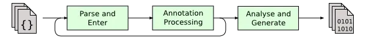
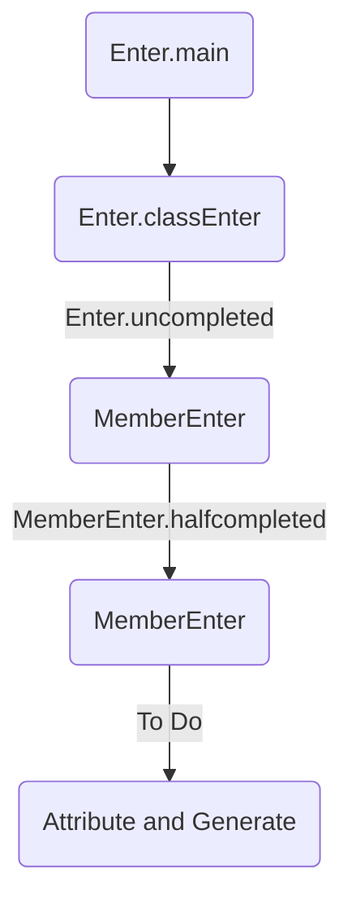
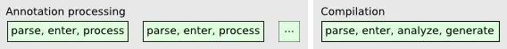
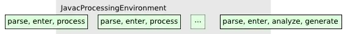

# Java注解

Annotations是一种元数据，其作用在于提供程序本身以外的一些数据信息，也就是说Annotation他不会属于程序代码本身，不参与逻辑运算，故而不会对原程序代码的操作产生直接的影响。

* 为编译器提供辅助信息 — Annotations可以为编译器提供而外信息，以便于检测错误，抑制警告等.
* 编译源代码时进行而外操作 — 软件工具可以通过处理Annotation信息来生成原代码，xml文件等等.
* 运行时处理 — 有一些annotation甚至可以在程序运行时被检测，使用.

<!--more-->

## 元注解

元注解的作用就是负责注解其他注解。它们被用来提供对其它 annotation类型作说明。Java定义的元注解：

* `@Target`
* `@Retention`
* `@Documented`
* `@Inherited`
* `@Native`
* `@Repeatable`

### `@Target`

`@Target` 指明了注解修饰的对象范围。`@Target` 接受参数类型为 java.lang.annotation.ElementType。ElementType 包含以下Enum 值:

* ANNOTATION_TYPE: 用于描述注解类型
* CONSTRUCTOR: 用于描述构造器
* FIELD: 用于描述域，包括Enum常量
* LOCAL_VARIABLE: 用于描述局部变量
* METHOD: 用于描述方法
* PACKAGE: 用于描述包
* PARAMETER: 用于描述参数
* TYPE: 用于描述类，接口（包括注解类型）或Enum类型
* TYPE_PARAMETER: 用于描述泛型
* TYPE_USE: 用于描述类型检查

```java
/*注解Table 可以用于注解类、接口(包括注解类型) 或enum声明
 *而注解NoDBColumn仅可用于注解类的成员变量。
 */
@Target(ElementType.TYPE)
public @interface Table {
    /**
     * 数据表名称注解，默认值为类名称
     * @return
     */
    public String tableName() default "className";
}

@Target(ElementType.FIELD)
public @interface NoDBColumn {

}
```

### `@Retention`

`@Retention`定义了该Annotation被保留的时间长短：某些Annotation仅出现在源代码中，而被编译器丢弃；而另一些却被编译在class文件中；编译在class文件中的Annotation可能会被虚拟机忽略，而另一些在class被装载时将被读取（请注意并不影响class的执行，因为Annotation与class在使用上是被分离的）。使用这个meta-Annotation可以对 Annotation的“生命周期”限制。取值（java.lang.annotation.RetentionPolicy）有：

* SOURCE:在源文件中有效（即源文件保留）
* CLASS:在class文件中有效（即class保留）
* RUNTIME:在运行时有效（即运行时保留）


```java
/* Column注解的的RetentionPolicy的属性值是RUTIME,
 * 这样注解处理器可以通过反射，获取到该注解的属性值.
 */
@Target(ElementType.FIELD)
@Retention(RetentionPolicy.RUNTIME)
public @interface Column {
    public String name() default "fieldName";
    public String setFuncName() default "setField";
    public String getFuncName() default "getField";
    public boolean defaultDBValue() default false;
}
```

### `@Documented`

`@Documented`注解表示每当使用指定的注解时，使用Javadoc工具记录这些元素。默认情况下，注解不包括在Javadoc中。 `@Documented` 是一个标记注解，没有成员。

```java
@Target(ElementType.FIELD)
@Retention(RetentionPolicy.RUNTIME)
@Documented
public @interface Column {
    public String name() default "fieldName";
    public String setFuncName() default "setField";
    public String getFuncName() default "getField";
    public boolean defaultDBValue() default false;
}
```

### `@Inherited`

`@Inherited`元注解是一个标记注解，`@Inherited`表示被标注的注解是可被继承的。如果一个使用`@Inherited`修饰的注解被用于一个class，则这个annotation将被用于该class的子类。

```java
@Target({ElementType.METHOD, ElementType.TYPE})
@Inherited
public @interface Greeting {
    public enum FontColor{ BULE,RED,GREEN};
    String name();
    FontColor fontColor() default FontColor.GREEN;
}
```

注意，`@Inherited` 只能让子类获取父类标记在Type上的注解。如果注解标记在父类方法上，子类覆盖的方法无法获取到注解。如果子类实现一个或多个接口，也不会从它实现的接口继承任何注释。

想实现方法上注解的继承，你可以通过反射在继承链上找到方法上的注解,例如Spring提供了AnnotationUtils用于处理Annotation。

```java
public static <A extends Annotation> A getInheritedAnnotation(
    Class<A> annotationClass, AnnotatedElement element)
{
    A annotation = element.getAnnotation(annotationClass);
    if (annotation == null && element instanceof Method)
        annotation = getOverriddenAnnotation(annotationClass, (Method) element);
    return annotation;
}

private static <A extends Annotation> A getOverriddenAnnotation(
    Class<A> annotationClass, Method method)
{
    final Class<?> methodClass = method.getDeclaringClass();
    final String name = method.getName();
    final Class<?>[] params = method.getParameterTypes();

    // prioritize all superclasses over all interfaces
    final Class<?> superclass = methodClass.getSuperclass();
    if (superclass != null)
    {
        final A annotation =
            getOverriddenAnnotationFrom(annotationClass, superclass, name, params);
        if (annotation != null)
            return annotation;
    }

    // depth-first search over interface hierarchy
    for (final Class<?> intf : methodClass.getInterfaces())
    {
        final A annotation =
            getOverriddenAnnotationFrom(annotationClass, intf, name, params);
        if (annotation != null)
            return annotation;
    }

    return null;
}

private static <A extends Annotation> A getOverriddenAnnotationFrom(
    Class<A> annotationClass, Class<?> searchClass, String name, Class<?>[] params)
{
    try
    {
        final Method method = searchClass.getMethod(name, params);
        final A annotation = method.getAnnotation(annotationClass);
        if (annotation != null)
            return annotation;
        return getOverriddenAnnotation(annotationClass, method);
    }
    catch (final NoSuchMethodException e)
    {
        return null;
    }
}
```

### `@Native`

用于表示可从Native方法获取的常量属性。

### `@Repeatable`

表示标记的注释可以多次应用于同一声明或类型使用，即重复注解。

#### 重复注解示例

```java
// 在每月最后一天和每周五 11:00 pm 执行doPeriodicCleanup
@Schedule(dayOfMonth="last")
@Schedule(dayOfWeek="Fri", hour="23")
public void doPeriodicCleanup() { ... }
```

为了实现重复注解，需要下面两步：

#### 声明一个可重复注解类型

```java
import java.lang.annotation.Repeatable;

@Repeatable(Schedules.class)
public @interface Schedule {
  String dayOfMonth() default "first";
  String dayOfWeek() default "Mon";
  int hour() default 12;
}
```

`@Repeatable` 注解的值是注解容器的类型，java 编译器用它来存储重复注解。

#### 声明该类型注解容器

```java
public @interface Schedules {
    Schedule[] value();
}
```

注解容器必须拥有数组类型的变量属性，数组元素类型必须是重复注解的类型。

## Java 自身使用的注解

在 java.lang 中使用了下面5个注解：

### `@Deprecated`

`@Deprecated` 注解表示标记的元素已被弃用，不应再使用。

使用例子：

```java
/ **
  * @deprecated
  * 解释为什么它被弃用
  * /
  @Deprecated
  static void deprecatedMethod（）{}
```

### `@Override`

`@Override` 注解表示意图覆盖超类中声明的元素。

```java
// 标记方法作为超类方法已被覆盖
@Override
int overriddenMethod（）{}
```

### `@SuppressWarnings`

`@SuppressWarnings` 注释告诉编译器压制它将会生成的特定警告。

```java
// 使用已弃用的方法，告诉编译器不生成警告
@SuppressWarnings（“deprecation”）
void useDeprecatedMethod（）{
  //弃用警告
  objectOne.deprecatedMethod（）;
}
```

### `@SafeVarargs`

`@SafeVarargs` 注解在应用于方法或构造函数时，声明该代码对其参数不执行潜在的不安全操作。

### `@FunctionalInterface`

`@FunctionalInterface` 注解，在Java SE 8引入，表示该类型声明意在成为功能的接口，由Java语言规范所定义的。

## 自定义运行时注解

java 自定义注解分为两种, 运行时注解和编译期注解。

`@Retention(RetentionPolicy.RUNTIME)`表示运行时保留的注解。我们可以在运行时，通过java反射机制，获取到注解信息。

接口AnnotatedElement表示程序中的注解元素，可以使用反射读取。接口中返回的所有注解都是不可变和可序列化的，接口方法返回的数组可以被修改，但不会影响原有的注解。接口的getAnnotationsByType\(Class\)和getDeclaredAnnotationsByType\(Class\)方法支持重复注解。

### 目标为class的注解

```java
import java.lang.annotation.ElementType;
import java.lang.annotation.Retention;
import java.lang.annotation.RetentionPolicy;
import java.lang.annotation.Target;

@Retention(RetentionPolicy.RUNTIME)
@Target(ElementType.TYPE)
public @interface ClassInfo {

    String name() default "";

    String description() default "";
}
```

### 目标为方法的注解

```java
import java.lang.annotation.ElementType;
import java.lang.annotation.Retention;
import java.lang.annotation.RetentionPolicy;
import java.lang.annotation.Target;

@Retention(RetentionPolicy.RUNTIME)
@Target(ElementType.METHOD)
public @interface MethodInfo {

    String name() default "";

    String description() default "";
}
```

### 目标为属性的注解

```java
import java.lang.annotation.ElementType;
import java.lang.annotation.Retention;
import java.lang.annotation.RetentionPolicy;
import java.lang.annotation.Target;

@Retention(RetentionPolicy.RUNTIME)
@Target(ElementType.FIELD)
public @interface FieldInfo {

    String name() default "";

    String description() default "";
}
```

### 注解处理工具

```java
import java.lang.reflect.Field;
import java.lang.reflect.Method;

public class InfoUtil {
    public static void HandleInfo(Class<?> clazz){
        if(clazz.isAnnotationPresent(ClassInfo.class)) {
            ClassInfo classInfo = clazz.getAnnotation(ClassInfo.class);
            System.out.println("classInfo:\n"+classInfo.name()+"::"+classInfo.description());
        }

        Method[] methods = clazz.getDeclaredMethods();
        for(Method item: methods){
            if(item.isAnnotationPresent(MethodInfo.class)){
                MethodInfo methodInfo = item.getAnnotation(MethodInfo.class);
                System.out.println("methodInfo:\n"+methodInfo.name()+"::"+methodInfo.description());
            }
        }

        Field[] fields = clazz.getDeclaredFields();
        for(Field item: fields){
            if(item.isAnnotationPresent(FieldInfo.class)){
                FieldInfo fieldInfo = item.getAnnotation(FieldInfo.class);
                System.out.println("methodInfo:\n"+fieldInfo.name()+"::"+fieldInfo.description());
            }
        }
    }
}
```

### 实体类demo

```java
@ClassInfo(name = "DemoClass",description = "A demo class for annotation")
public class Demo {

    @FieldInfo(name = "DemoField",description = "A demo field for annotation")
    private String name;

    @MethodInfo(name = "DemoMethod", description = "A demo method for annotation")
    public String getName() {
        return name;
    }
}
```

### 测试类

```java
public class Test {
    public static void main(String[] args){
        InfoUtil.HandleInfo(Demo.class);
    }
}
```

```sh
classInfo:
DemoClass::A demo class for annotation
methodInfo:
DemoMethod::A demo method for annotation
methodInfo:
DemoField::A demo field for annotation
```

## 自定义注解之编译时注解

在介绍编译期注解前，先介绍下注解处理原理，JVM编译处理流程如下:

1. 在命令行上指定的所有源文件被读取，解析为语法树，然后将所有外部可见定义输入到编译器的符号表中。
2. 调用所有适当的注释处理器。如果任何注释处理器生成任何新的源或类文件，则重新启动编译，直到不创建新文件。
3. 最后，解析器创建的语法树被分析并转换成类文件。在分析过程中，可能会发现对其他类的引用。编译器将检查这些类的源和类路径; 如果在源路径上找到这些文件，那么这些文件也将被编译，尽管它们不会被注释处理。



### 处理流程详细介绍

#### Parse and Enter 阶段

源文件被scanner处理成unicode字符流，parser 读取字符流，使用TreeMaker构建语法树，语法树的节点都是JCTree的子类(这些子类都实现了com.sun.source.Tree的子接口)构建的。我们先看下包`com.sun.source.tree`中的java程序的语法节点类。


每个生成的语法树都被传递给Enter(Enter 继承了JCTree及其子类的访问者类 visitor)。



1. 在第一阶段，对所有类递归下降遍历tree及其成员类的tree。每个类都有一个 MemberEnter 对象作为处理结果返回。
2. 将所有类中出现的符号输入到类自身的符号表中，所有类符号、类的参数类型符号（泛型参数类型）、超类符号和继承的接口类型符号等都存储到一个未处理的列表中。
3. 将这个未处理的列表中所有的类都解析到各自的类符号列表中，这个操作是在MemberEnter.complete()中完成(默认构造器也是在这里完成的)。

代码流程如下(com.sun.source.Tree 包位于 JAVA_HOME/lib/tools.jar 中，如需使用，要把tools.jar 加到项目的classpath中。`com.sun.tools.javac.Main.compile()` 是 javac的主入口。):

```java
// 程序调试入口
public class App
{
    public static void main( String[] args )
    {
        String[] optionsAndSources = {
                "/test/Apple.java" // 此处应是绝对路径
        };
        com.sun.tools.javac.Main.compile(optionsAndSources,new PrintWriter(System.out));
    }
}

// com.sun.tools.javac.main.JavaCompiler
public void compile(List<JavaFileObject> var1, List<String> var2, Iterable<? extends Processor> var3) {
  // ...
    // 1. 初始化编译期注解处理器
    this.initProcessAnnotations(var3);
    // 2. 执行注解处理
    this.delegateCompiler = this.processAnnotations(
      this.enterTrees(  // 1.2 输入到符号表  
        this.stopIfError(CompileState.PARSE,
        this.parseFiles(var1))) // 1.1 词法分析，语法分析
        , var2);
    this.delegateCompiler.compile2(); // 分析和字节码生成
  // ...
}

private void compile2() {
  // ...
  case BY_TODO:
    while(true) {
      if (this.todo.isEmpty()) {
        break label44;
      }
      this.generate(         // 3.4 生成字节码
        this.desugar(        // 3.3 解语法糖
          this.flow(         // 3.2 流分析
            this.attribute(  // 3.1标注
              (Env)this.todo.remove()))));
    }
  // ...
}
```

词法分析主要借助`com.sun.tools.javac.parser`包，语法分析主要借助了`com.sun.tools.javac.tree`包。代码调用栈如下:

```
JavaCompiler.parseFiles
  -> JavaCompiler.parse(JavaFileObject var1)
    -> JavaCompiler.parse(JavaFileObject var1, CharSequence var2)
      -> JavacParser.parseCompilationUnit()
        -> com.sun.tools.javac.tree.TreeMaker
```

#### 注解处理

这一部分主要由`com.sun.tools.javac.processing.JavacProcessingEnvironment`处理。注释处理是编译之前的一个初步步骤。该步骤包括一系列轮次，每个轮次用于解析和输入源文件，然后确定并调用任何适当的注释处理器。在初始回合之后，如果任何被调用的注释处理器生成任何需要作为最终编译的一部分的新源文件或类文件，则将执行后续轮次。最后，当完成所有必要的轮次后，将执行实际编译。



实际上在解析了要编译的文件且确定其包含的注解后，才知道是否需要执行注解处理。因此，为了避免在没有执行注释处理的情况下不必要地解析和输入源文件，JavacProcessingEnvironment与概念模型有细微的差异，同时仍然满足在实际编译之前整个注释处理发生的概念要求。



#### 分析生成

一旦指定的所有文件都已被解析并输入到编译器的符号表中，并且在结束了所有的注释处理，JavaCompiler继续分析语法树以生成相应的类文件。此阶段包括类型检查、控制流分析、泛型的类型擦除、去除语法糖、字节码生成等操作。

* `com.sun.tools.javac.comp.Attr`:检查语义的合理性并进行逻辑判断，类型是否匹配，是否初始化，泛型是否可推导，字符串常量合并
* `com.sun.tools.javac.comp.Check`:协助attr，变量类型是否正确
* `com.sun.tools.javac.comp.Resolve`:协助attr，变量方法类的访问是否合法，是否是静态变量
* `com.sun.tools.javac.comp.ConstFold`:协助attr，常量折叠
* `com.sun.tools.javac.comp.Infer`:协助attr，推导泛型
* `com.sun.tools.javac.comp.Flow`: 数据流分析和替换等价源代码的分析（即上面的进一步语义分析）
* `com.sun.tools.javac.comp.TransTypes`: 涉及泛型类型的代码将转换为没有泛型类型的代码
* `com.sun.tools.javac.comp.Lower`: 处理语法糖”，Lower通过替换等效的，更简单的树来重写语法树以消除特定类型的子树
* `com.sun.tools.javac.jvm.Gen`:遍历语法树生成最终的java字节码
* `com.sun.tools.javac.jvm.Items`:辅助gen，这个类表示任何可寻址的操作项，这些操作项都可以作为一个单位出现在操作栈上
* `com.sun.tools.javac.jvm.Code`:辅助gen，存储生成的字节码，并提供一些能够影射操作码的方法

一旦类被写为类文件，其大部分语法树和生成的字节码将不再需要。为了节省内存，将清除对树的这些部分和符号的引用，以允许垃圾收集器恢复内存。

### 例子

首先是定义一个注解：

```java
@Target(ElementType.TYPE)
@Retention(RetentionPolicy.CLASS) // compile time annotation
public @interface ClassInfoPrinter {
}
```

`@Retention(RetentionPolicy.CLASS)`是必须的，这样才能在编译期获取注解信息。

接下来我们实现自定义的注解处理器：

```java
// 注解处理器支持的注解
@SupportedAnnotationTypes(
        "info.victorchu.demos.annotation.ClassInfoPrinter")
@SupportedSourceVersion(SourceVersion.RELEASE_8)
public class ClassInfoPrinterProcessor extends AbstractProcessor {
    @Override
    public boolean process(Set<? extends TypeElement> annotations, RoundEnvironment roundEnv) {
        // annotations 是注解处理器要处理的所有注解
        // 此处只有 @ClassInfoPrinter
        for (TypeElement  annotation: annotations) {
            for ( Element element : roundEnv.getElementsAnnotatedWith(annotation) ) {
                processingEnv.getMessager().printMessage(Diagnostic.Kind.NOTE, "found @ClassInfoPrinter at " + element);
            }
        }
        return false;
    }
}
```

到处，我们完成了注解处理的所有工作。下面是如何使用，annotation 可以和maven 结合使用，

```xml
<?xml version="1.0" encoding="UTF-8"?>

<project xmlns="http://maven.apache.org/POM/4.0.0" xmlns:xsi="http://www.w3.org/2001/XMLSchema-instance"
         xsi:schemaLocation="http://maven.apache.org/POM/4.0.0 http://maven.apache.org/xsd/maven-4.0.0.xsd">
    <modelVersion>4.0.0</modelVersion>
    <groupId>info.victorchu.demos</groupId>
    <version>1.0-SNAPSHOT</version>
    <artifactId>processed</artifactId>

    <name>processed</name>
    <dependencies>
        <dependency>
            <groupId>info.victorchu.demos</groupId>
            <!--processor 模块中存放了上面介绍的注解和注解处理器-->
            <artifactId>processor</artifactId>
            <version>1.0-SNAPSHOT</version>
        </dependency>
    </dependencies>

    <build>
        <plugins>
            <plugin>
                <artifactId>maven-compiler-plugin</artifactId>
                <configuration>
                    <annotationProcessors>
                        <annotationProcessor>info.victorchu.demos.processor.ClassInfoPrinterProcessor</annotationProcessor>
                    </annotationProcessors>
                    <showWarnings>true</showWarnings>
                </configuration>
            </plugin>
        </plugins>
    </build>
</project>
```

如果不使用maven，也可以通过java 提供的方式使用注解处理器。

1. 处理器本身和注解必须已经单独编译，并出现在类路径中，因此，应该做的第一件事是：

```sh
javac -proc:none info/victorchu/demos/processor/ClassInfoPrinterProcessor.java
javac -proc:none info/victorchu/demos/processor/ClassInfoPrinter.java
```

> `-proc:none` 选项的意思是停用所有注解处理器(可选)

2. 然后，使用-processor 指定刚编译的注解处理器类，对源文件进行编译：

```sh
javac -processor info.victorchu.demos.processor.ClassInfoPrinterProcessor Person.java
```

3. 要一次性指定多个注解处理器，可以用逗号分隔它们的类名，如下所示：

```sh
javac -processor package1.Processor1,package2.Processor2 SourceFile.java
```

如果不想在编译时指定，可以结合java 的SPI 机制，在`META-INF/services/javax.annotation.processing.Processor`文件中加上想要使用的注解处理器类名。

### 深入代码
#### 抽象注解处理器

JDK 提供了易于扩展的抽象注解处理器：

```java
// javax.annotation.processing.AbstractProcessor
public abstract class AbstractProcessor implements Processor {
    // 上下文环境
    protected ProcessingEnvironment processingEnv;
    private boolean initialized = false;

    protected AbstractProcessor() {}
    // 处理器支持的选项，可以通过SupportedOptions注解来快速设置
    public Set<String> getSupportedOptions() {
        SupportedOptions so = this.getClass().getAnnotation(SupportedOptions.class);
        if  (so == null)
            return Collections.emptySet();
        else
            return arrayToSet(so.value());
    }
    // 处理器支持的注解类型，可以通过 SupportedAnnotationTypes注解来快速设置
    public Set<String> getSupportedAnnotationTypes() {
            SupportedAnnotationTypes sat = this.getClass().getAnnotation(SupportedAnnotationTypes.class);
            if  (sat == null) {
                if (isInitialized())
                    processingEnv.getMessager().printMessage(Diagnostic.Kind.WARNING,
                                                             "No SupportedAnnotationTypes annotation " +
                                                             "found on " + this.getClass().getName() +
                                                             ", returning an empty set.");
                return Collections.emptySet();
            }
            else
                return arrayToSet(sat.value());
        }
    // 处理器支持的源码版本，可以通过注解SupportedSourceVersion快速设置，默认1.6
    public SourceVersion getSupportedSourceVersion() {
        SupportedSourceVersion ssv = this.getClass().getAnnotation(SupportedSourceVersion.class);
        SourceVersion sv = null;
        if (ssv == null) {
            sv = SourceVersion.RELEASE_6;
            if (isInitialized())
                processingEnv.getMessager().printMessage(Diagnostic.Kind.WARNING,
                                                         "No SupportedSourceVersion annotation " +
                                                         "found on " + this.getClass().getName() +
                                                         ", returning " + sv + ".");
        } else
            sv = ssv.value();
        return sv;
    }
    // 处理器生命周期方法：初始化。ProcessingEnvironment提供了很多工具接口实现
    public synchronized void init(ProcessingEnvironment processingEnv) {
        if (initialized)
            throw new IllegalStateException("Cannot call init more than once.");
        Objects.requireNonNull(processingEnv, "Tool provided null ProcessingEnvironment");

        this.processingEnv = processingEnv;
        initialized = true;
    }
    // 处理器业务逻辑，需子类实现
    public abstract boolean process(Set<? extends TypeElement> annotations,
                                    RoundEnvironment roundEnv);
  // ... ...
}
```

要实现我们自己的注解处理器，需要继承AbstractProcessor,并实现process方法。

### 注解处理上下文 ProcessingEnvironment

在实现process方法前，我们先了解下JDK 提供的工具类。ProcessingEnvironment 提供了编写新文件，报告错误信息和提供一些实用工具。Hotspot的实现类是`com.sun.tools.javac.processing`包中的JavacProcessingEnvironment。

```java
public interface ProcessingEnvironment {
  /**
    * 返回传递给注解处理器的特定选项。返回的结构是key-value对
    * 如果option没有对应的值,那么value是 null。
    * 不同的工具接收选项的方法不同，命令行可以通过在字符串前面加上"-A"，来表示注解处理器的选项.
    */
  Map<String,String> getOptions();

    /**
     * 返回用于报告信息的messager
     */
    Messager getMessager();

    /**
     * 返回用于创建资源文件的filer
     */
    Filer getFiler();

    /**
     * 返回element工具集合
     */
    Elements getElementUtils();

    /**
     * 返回type工具集合
     */
    Types getTypeUtils();

    /**
     * 返回源码版本，filer 创建的文件必须符合
     */
    SourceVersion getSourceVersion();

    /**
     * 返回当前的语言.若无，为null
     */
    Locale getLocale();
}
```

### filer

Filer是个接口，hotspot的实现类是`com.sun.tools.javac.processing`包中的JavacFiler。该接口支持注解处理器创建新文件。通过这种方式创建的文件会被实现类感知，并且能够更好地管理这些文件。一共有3种文件类型：源文件，类文件和辅助资源文件。注意。这样创建的文件(源文件，类文件)在写入流(write或outputStream) 被关闭后，才会被后面的注解处理器处理。辅助资源文件不会参加之后的注解处理。

```java
public interface Filer {
    /* 创建一个新的源文件并返回一个对象以允许对其进行写入.可以创建类型的源文件或包.
     * 文件的名称和路径（相对于源文件的根输出位置）基于要在该文件中声明的项目的名称以及该项目的指定模块（如果有）。
     * 如果在单个文件（即，单个编译单元）中声明了多个类型，则文件名应与主体顶级类型的名称（例如，公共类型）相对应。
     * 可以创建源文件来保存有关软件包的信息，包括软件包批注。要为命名包创建源文件，请将name参数作为包的名称，后跟".package-info"；。要为未命名的软件包创建源文件，请使用"package-info"。
     * 可选模块名称以类型名称或程序包名称为前缀，并使用"/"字符分隔。例如，要为a.B 模块中的类型 foo创建源文件，请使用name参数"foo/a.B"。
     * 如果没有给出明确的模块前缀，并且环境中支持模块，则将推断出合适的模块。如果无法推断出合适的模块，则抛出错误FilerException。
     */
    JavaFileObject createSourceFile(CharSequence name,
                                    Element... originatingElements) throws IOException;
    /*和createSourceFile 类似，但是该方法创建的是一个新的二进制类文件。
     */
    JavaFileObject createClassFile(CharSequence name,
                                   Element... originatingElements) throws IOException;
    /*
     * 创建一个新的辅助资源文件进行写入，并为其返回文件对象。
     * 该文件可以与新创建的源文件，新创建的二进制文件或其他受支持的位置一起放置,条件是 CLASS_OUTPUT或SOURCE_OUTPUT必须得到支持。
     * 可以相对于某个模块和/或程序包（如源文件和类文件）来命名资源，并以相对路径名命名。在广义上说，新文件的全名是串联的location， moduleAndPkg和relativeName。
     * 如果moduleAndPkg包含“ /”字符，则“/”字符之前的前缀是模块名称，而“/”字符之后的后缀是程序包名称。软件包后缀可能为空。
     * 如果moduleAndPkg 不包含“/字符，整个参数将解释为程序包名称。
     */
    FileObject createResource(JavaFileManager.Location location,
                             CharSequence pkg,
                             CharSequence relativeName,
                             Element... originatingElements) throws IOException;
    /* 返回用于读取现有资源的对象
     */
    FileObject getResource(JavaFileManager.Location location,
                           CharSequence pkg,
                           CharSequence relativeName) throws IOException;
}
```

拿到JavaFileObject或FileObject,就可以对文件进一步修改。

### 应用场景

依赖 JSR-269 开发的典型的第三方库有，代码自动生成的 [Lombok](https://projectlombok.org/) 和 Google [Auto](https://github.com/google/auto)，代码检查的 [Checker](https://checkerframework.org/) 和 Google [Error Prone](http://errorprone.info/)，编译阶段完成依赖注入的 Google [Dagger 2](https://github.com/google/dagger) 等。实际应用中，由于字节码的版本问题，创建新文件会比修改java语法树的方式更安全一些。

## 参考资料

- [1] [Java官方Tutorial](http://docs.oracle.com/javase/tutorial/java/annotations/)
- [2] [jsr-269, 注解处理器](https://jcp.org/en/jsr/detail?id=269)
- [3] [compilation overview](http://openjdk.java.net/groups/compiler/doc/compilation-overview/index.html)

