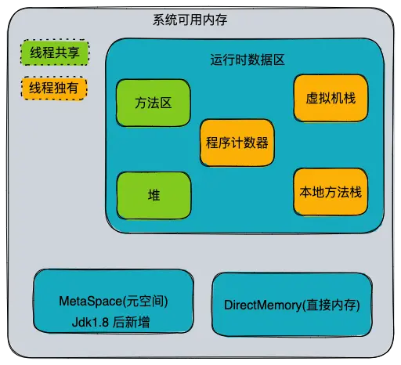
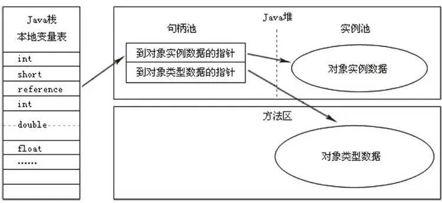
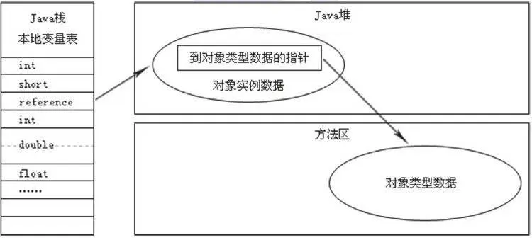

# Java虚拟机-内存布局


本文介绍 Java 虚拟机的内存布局。

<!--more-->



## 程序计数器

程序计数器\(Program Counter Register\)可以视作当前线程所执行字节码的行号指示器。

在虚拟机的概念模型中，字节码解释器通过改变程序计数器的值来选取下一条需要执行的字节码指令，分支、循环、跳转、异常处理、线程恢复等基本功能都需要依赖计数器。

在任一时刻，一个cpu内核只会执行一个线程中的指令；java的多线程是通过线程轮流切换并分配处理器执行时间的方式来实现的。为了线程切换后能恢复到正确位置，显然每个线程都需要私有的程序计数器。

如果线程正在执行的是Java方法，计数器记录的是正在执行的虚拟机字节码指令地址；如果正在执行的是Native方法，计数器的值为空\(Undefined\)。

> 该内存区域没有规定任何OutOfMemoryError出现情况。

## 虚拟机栈


Java虚拟机栈\(Java Virtual Machine Stacks\)是Java方法执行的内存模型，也是线程私有的。

每个方法执行时JVM都会创建一个栈帧，用于存储局部变量表，操作数栈，动态链接等信息。每个方法从调用到执行完成的过程，就对应一个栈帧在虚拟机中入栈到出栈的过程。

我们常说的数据存储在栈或堆上，这里的“栈”就是指虚拟机栈中的局部变量表这一部分。局部变量表存放了:

- 编译期可知的各种基本数据类型\(boolean,byte,char,short,int,long,float,double\) 
- reference,对象引用\(指向对象起始地址的引用或指向一个代表对象的句柄或其他与此对象相关的位置\)
- returnAddress类型\(指向一条字节码指令地址\)。

float和double类型的数据会占用2个局部变量空间，其他的数据类型只占用一个。局部变量表所需的内存空间在编译期会完成分配，运行期不会改变其大小。

> 注意，这里说的“大小”是指变量槽的数量，虚拟机真正使用多大的内存空间（譬如按照1个变量槽占用32个比特、64个比特，或者更多）来实现一个变量槽，这是完全由具体的虚拟机实现自行决定的事情。

> 后面的文章会具体介绍栈空间


对于Java虚拟机栈这个区域，在《Java虚拟机规范》中定义了两种异常情况：

1. 栈溢出异常`StackOverflowError`: 线程请求的栈深度大于虚拟机所允许的深度。
2. 内存不足异常`OutOfMemoryError`: 线程申请栈空间失败。

```java
/**
 * VM option: -Xss256k
 *  ************* output ************
 * Exception in thread "main" java.lang.StackOverflowError
 * at JavaVMStackSOF.stackLength(JavaVMStackSOF.java:10)
 * at JavaVMStackSOF.stackLength(JavaVMStackSOF.java:10)
 */
public class JavaVMStackSOF {

    private int stackLength =1 ;

    public  void stackLength(){
        stackLength ++;
        stackLength();
    }

    public static void main(String[] args){
        JavaVMStackSOF javaVMStackSOF = new JavaVMStackSOF();
        try{
            javaVMStackSOF.stackLength();
        }catch (Exception e){
            e.printStackTrace();
        }
    }
}
```

在单线程下，无论是栈帧太大还是虚拟机容量太小，当内存无法分配时，虚拟机抛出的都是`StackOverflowError`。如果不仅限于单线程，通过不断建立线程的方式可以产生内存溢出异常，其原因是因为操作系统分配给每个进程的内存是有限制的，多开线程会消耗进程的内存空间，从而导致`OutOfMemoryError`

```java
/**
 * VM option: -Xss2M
 */
 public class JavaVMStackOOM{
    private void dontStop(){
        while(true){
        }
    }
    private void stackLeakByThread(){
        while(true){
            Thread thread = new Thread(new Runnable(){
                @Override
                public void run(){
                    dontStop();
                }
            });
            thread.start();
        }
    }
    public static void main(String[] args){
        JavaVMStackOOM javaVMStackOOM = new JavaVMStackOOM();
        javaVMStackOOM.stackLeakByThread();
    }
 }
```

## 本地方法栈

本地方法栈\(Native Mehtod Stack\)与虚拟机栈的作用是十分相似的，同样是线程私有的。区别在于虚拟机栈为虚拟机执行Java方法服务，而本地方法栈则为虚拟机的Native方法服务。

《Java虚拟机规范》对本地方法栈中方法使用的语言、使用方式与数据结构并没有任何强制规定，因此具体的虚拟机可以根据需要自由实现它，甚至有的Java虚拟机（譬如HotSpot虚拟机）直接就把本地方法栈和虚拟机栈合二为一。

与虚拟机栈一样，有两种异常情况：

1. 栈溢出异常`StackOverflowError`
2. 内存不足异常`OutOfMemoryError`

## 堆


Java堆是被所有线程共享的一块内存区域，在虚拟机启动时创建。几乎所有的对象实例以及数组都在这里分配内存。但随着编译器的即时编译技术的进步和逃逸分析技术的成熟，并不是"所有的"对象都会在堆上分配。例如在jvm开启了逃逸分析的相关选项后，不会逃逸的对象将在栈上分配。

Java堆是垃圾收集器管理的主要区域，也常被称为"GC堆"。如果从分配内存的角度看，所有线程共享的Java堆中可以划分出多个线程私有的分配缓冲区（Thread Local Allocation Buffer，TLAB），以提升对象分配时的效率。不过无论从什么角度，无论如何划分，都不会改变Java堆中存储内容的共性，无论是哪个区域，存储的都只能是对象的实例，将Java堆细分的目的只是为了更好地回收内存，或者更快地分配内存。

根据《Java虚拟机规范》的规定，Java堆可以处于物理上不连续的内存空间中，但在逻辑上它应该被视为连续的，这点就像我们用磁盘空间去存储文件一样，并不要求每个文件都连续存放。但对于大对象（典型的如数组对象），多数虚拟机实现出于实现简单、存储高效的考虑，很可能会要求连续的内存空间。

Java堆既可以被实现成固定大小的，也可以是可扩展的，不过当前主流的Java虚拟机都是按照可扩展来实现的。如果在Java堆中没有内存完成实例分配，并且堆也无法再扩展时，Java虚拟机将会抛出OutOfMemoryError异常。

## 方法区

方法区\(Method Area\)和Java堆一样，是各个线程共享的内存区域。用于存储已被虚拟机加载的类信息、常量、静态变量、即时编译器编译后的代码等数据。

在JDK6的时候HotSpot使用永久代来实现方法区，好处是省去专门为方法区编写内存管理代码的工作。但这种设计导致了Java应用更容易遇到内存溢出的问题(永久代有-XX：MaxPermSize的上限，即使不设置也有默认大小)。

到了JDK7的HotSpot，把原本放在永久代的字符串常量池、静态变量等移出，而到了JDK8，终于完全废弃了永久代的概念，改用与JRockit、J9一样在本地内存中实现的元空间（Metaspace）来代替，把JDK7中永久代还剩余的内容（主要是类型信息）全部移到元空间中。

《Java虚拟机规范》对方法区的约束是非常宽松的，除了和Java堆一样不需要连续的内存和可以选择固定大小或者可扩展外，甚至还可以选择不实现垃圾收集。相对而言，垃圾收集行为在这个区域的确是比较少出现的，但并非数据进入了方法区就如永久代的名字一样“永久”存在了。这区域的内存回收目标主要是针对常量池的回收和对类型的卸载，一般来说这个区域的回收效果比较难令人满意，尤其是类型的卸载，条件相当苛刻，但是这部分区域的回收有时又确实是必要的。

方法区内存不足时，会抛出内存不足异常`OutOfMemoryError`。

### 运行时常量池

运行时常量池是方法区的一部分,class文件中除了有类的版本、字段、方法、接口等描述信息，还有一项是常量池；常量池用于存放编译期生成的各种字面量和符号引用，这部分内容将在类加载后存放在方法区的常量池。

Java虚拟机对于Class文件每一部分（自然也包括常量池）的格式都有严格规定，如每一个字节用于存储哪种数据都必须符合规范上的要求才会被虚拟机认可、加载和执行，但对于运行时常量池，《Java虚拟机规范》并没有做任何细节的要求，不同提供商实现的虚拟机可以按照自己的需要来实现这个内存区域，不过一般来说，除了保存Class文件中描述的符号引用外，还会把由符号引用翻译出来的直接引用也存储在运行时常量池中。

## 直接内存

直接内存\(Direct Memory\)并不是虚拟机运行时数据区的一部分，也不是Java虚拟机规范中定义的内存区域。但这部分内存也可能到导致`OutOfMemoryError`异常的出现。

在JDK1.4中新加入了NIO（NewInput/Output）类，引入了一种基于通道（Channel）与缓冲区（Buffer）的I/O方式，它可以使用Native函数库直接分配堆外内存，然后通过一个存储在Java堆里面的DirectByteBuffer对象作为这块内存的引用进行操作。这样能在一些场景中显著提高性能，因为避免了在Java堆和Native堆中来回复制数据。

显然，本机直接内存的分配不会受到Java堆大小的限制，但是，既然是内存，则肯定还是会受到本机总内存（包括物理内存、SWAP分区或者分页文件）大小以及处理器寻址空间的限制，一般服务器管理员配置虚拟机参数时，会根据实际内存去设置Xmx等参数信息，但经常忽略掉直接内存，使得各个内存区域总和大于物理内存限制（包括物理的和操作系统级的限制），从而导致动态扩展时出现OutOfMemoryError异常。

## HotSpot虚拟机对象

### 创建对象

当虚拟机遇到一条new指令时，

1. 首先，检查这个指令的参数是否能在常量池中定位到一个类的符号引用，以及它对应的类是否加载，解析和初始化过。如果没有，执行类的加载。
2. 类成功加载后，虚拟机为对象分配内存。对象所需内存的大小在类加载时已经确定，要做的仅是从Java堆中分配一块内存空间。
    * 假设Java堆中内存是绝对规整的，那么可以在用过的内存和空闲的内存中间放着一个指针作为分界点的指示器。那么分配内存就是将指针向空闲空间挪动一段与对象大小相等的距离。这种分配方式叫做"指针碰撞"。
    * 如果Java的内存不是规整的，已用内存和空闲内存交错，那么需要维护一个列表，记录那些内存是可用的，在分配时从列表中找到一块足够大的空间划分给对象，并更新列表上的记录。这种分配方式叫做"空闲列表".
    * 在CMS的实现里面，为了能在多数情况下分配得更快，设计了一个叫作LinearAllocationBuffer的分配缓冲区，通过空闲列表拿到一大块分配缓冲区之后，在它里面仍然可以使用指针碰撞方式来分配。
3. 还有一个要考虑的问题是对象创建在虚拟机中十分频繁，即使是修改一个指针的值，在并发状态下也并不是线程安全的。解决这个问题有两种方案：
    * 对分配空间的动作进行同步处理，实际上虚拟机采用CAS和失败重试的方式保证更新操作的原子性。
    * 把内存分配的动作按线程划分在不同的空间进行，即每个线程在堆先分配一小块内存，称为本地线程分配缓冲\(Thread Local Allocation Buffer,TLAB\)；先在线程自身的TLAB上分配，只有当TLAB使用完分配新的TLAB时，才需要同步锁定。
4. 分配完内存后，虚拟机需要将分配到的内存空间都初始化为零值\(不包括对象头\)，如果使用TLAB，这一工作过程也可以提前至TLAB分配时进行。这一步操作保证了对象的实例字段在Java代码中可以不赋初始值就直接使用。
5. 接下来是虚拟机对对象进行必要的设置，例如，这个对象是哪个类的实例、如何找到类的元数据信息、对象的hash码、对象的GC分代年龄等信息。这些信息存放在对象的对象头中。__*到此为止，虚拟机创建了一个新的对象。*__
6. 此时对象还没有初始化——<init>方法还没有执行，所有的字段都还为零，在虚拟机执行new指令之后会紧接着执行<init>方法，这样一个对象才完全生产出来。

在虚拟机中，对象在[内存中的布局](/posts/2017/04/7937355a/)可以分为3个区域:对象头、实例数据和对齐填充。本文就不多做介绍了。

### 访问对象

建立对象是为了使用对象，Java程序需要通过虚拟机栈上的reference数据来操作堆上的具体对象。reference类型在Java虚拟机规范中只规定了一个指向对象的引用，并没有定义这个引用该如何实现定位、访问堆中的对象的基本位置。

目前主流的访问方式有使用句柄和直接指针两种方式。

* 使用句柄访问

如果使用句柄的话，Java堆中会划分出一块内存作为句柄池，reference中存放的就是对象的句柄地址，而对象的句柄地址中包含了对象实例数据和类型数据各自的具体指针地址信息。



* 直接指针访问

如果使用直接指针访问，那么Java堆对象的布局中将放置类型数据的相关信息，reference中存储的就是对象地址。



这两种访问方式各有优势：

1. 使用句柄访问的好处是reference中存储的是稳定的句柄地址，对象移动\(垃圾回收时会移动对象\)时只会改变句柄中的实例数据指针，本身不用修改。
2. 使用直接指针的最大好处是速度更快，它会节省一次指针定位的时间开销，由于java的对象访问十分频繁，节省的资源也十分可观。sun公司的HotSpot就是使用第二种方式访问对象的。

