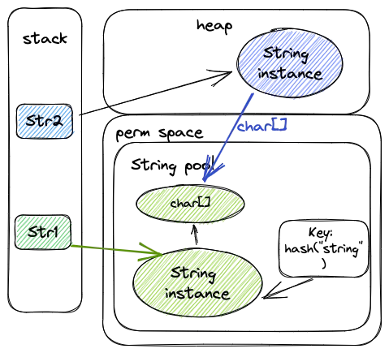
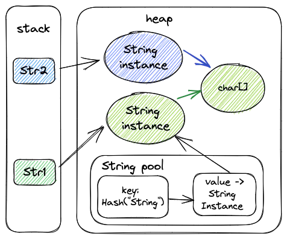
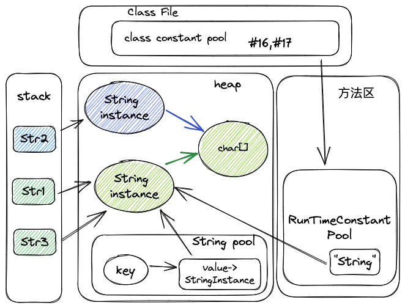

# Java-String和intern方法


本文介绍和深入分析 Java 中 String 类的 intern 方法。

<!--more-->
先来看个 Demo:

```java
public class JavaStringTest {
    public static void main(String[] args){
        String str1 = "string";
        String str2 = new String("string");
        String str3 = str2.intern();

        System.out.println(str1==str2);
        System.out.println(str1==str3);

    }
}
/**
 * -------- output ----------
 * false
 * true
 */
```

字符串不属于基本类型，但是可以像基本类型一样，直接通过字面量赋值，当然也可以通过new来生成一个字符串对象。不过通过字面量赋值的方式和new的方式生成字符串有本质的区别：



* 通过字面量赋值创建字符串时，会优先在常量池中查找(通过hash("string")方法)是否已经存在相同的字符串(`char[]`)，倘若已经存在，栈中的引用直接指向该字符串在常量池中记录的实例地址(图中绿色实例)；倘若不存在，则在常量池中生成一个字符串对象，再将栈中的引用指向该字符串在常量池中记录的实例地址。
* 而通过new的方式创建字符串时，就直接在堆中中生成一个字符串对象(图中蓝色实例)，该对象的value部分指向字符串常量池中的字符串(从字面量的value获取char[]地址)。栈中的引用指向该对象(图中蓝色实例)。见构造函数部分:

```java
public String(String original) {
    this.value = original.value;
    this.hash = original.hash;
}
```

* 对于堆中的字符串对象，可以通过 intern()方法来将字符串添加到常量池中，并返回指向该常量的引用。

根据上面的信息，我们就能理解上面输出的原因: 

1. 因为str1指向的是字符串中的常量维护的对象，str2是在堆中生成的对象，所以str1==str2返回false。
2. str2调用intern方法，会将str2中值（“abc”）复制到常量池中，但是常量池中已经存在该字符串（即str1指向的字符串），所以直接返回该字符串的引用，因此str1==str2返回true。

## 进阶

先介绍一个JVM指令:

ldc：Push item from run-time constant pool，从运行常量池中加载指定项的引用到栈。ldc指令就是触发lazy resolve动作的条件。如果该项尚未resolve就resolve它，并返回resolve后的内容。在遇到String类型常量时，resolve的过程如果发现String table（全局字符串常量池）已经有了内容匹配的java.lang.String的引用，则直接返回这个引用，反之，如果没有则会在Java堆里创建一个对应内容的String对象，然后在String table中记录下这个引用，并将这个引用返回。

### "+" 操作符

对于`+` 操作符

- 如果是常量相加，编译器将其直接转化为常量。
- 如果不是常量相加，编译器将其转化为 `StringBuilder.append`来实现字符串的拼接。

```java
@Override
public String toString() {
    // Create a copy, don't share the array
    return new String(value, 0, count);
}
```

以下面代码为例子:

```java
public class JavaStringAdd {
    
    public static void main(String[] args) {
        String str1 = "baseStr01";
        String str2 = "base"+"Str"+"01";
        // 这里可以看成是 StringBuilder.toString()
        // 即是 new String("baseStr01")
        // 显然str3 != str1
        String str3 = "baseStr"+new String("01");
        System.out.println(str2 == str1);
        System.out.println(str2 == str3);
    }
}
/**
 * -------- output ----------
 * true
 * false
 */
```

结合反编译的字节码:

```java
public static void main(java.lang.String[]);
    descriptor: ([Ljava/lang/String;)V
    flags: (0x0009) ACC_PUBLIC, ACC_STATIC
    Code:
      stack=4, locals=4, args_size=1
         0: ldc           #16                 // String baseStr01
         2: astore_1
         # 注意此处编译器直接将最终常量计算出来
         3: ldc           #16                 // String baseStr01
         5: astore_2
         # 涉及到非常量的操作(即通过new创建String)，“+”会被转化为StringBuilder.append()
         6: new           #18                 // class java/lang/StringBuilder
         9: dup
        10: ldc           #20                 // String baseStr
        12: invokespecial #22                 // Method java/lang/StringBuilder."<init>":(Ljava/lang/String;)V
        15: new           #25                 // class java/lang/String
        18: dup
        19: ldc           #27                 // String 01
        21: invokespecial #29                 // Method java/lang/String."<init>":(Ljava/lang/String;)V
        24: invokevirtual #30                 // Method java/lang/StringBuilder.append:(Ljava/lang/String;)Ljava/lang/StringBuilder;
        27: invokevirtual #34                 // Method java/lang/StringBuilder.toString:()Ljava/lang/String;
        30: astore_3
```

### JDK1.6 和JDK1.7+的区别

```java
public class Test01 {
    public static void main(String[] args) {
        // 这里调用了 StringBuilder.toString()
        // 可以看成是 new String("str01")
        // 此处使用StringBuilder是为了让StringTable不存在对应的字面量
        String str2 = new String("str")+new String("01");
        str2.intern();
        String str1 = "str01";
        System.out.println(str2==str1);//#1
    }
}
```

```java
public class Test02 {
    public static void main(String[] args) {
        String str1 = "str01";
        // 这里调用了 StringBuilder.toString()
        // 可以看成是 new String("str01")
        String str2 = new String("str")+new String("01");
        str2.intern();
        System.out.println(str2 == str1);//#2
    }
}
```

|jdk|Test01|Test02|
|:---|:---|:---|
|1.6|false|false|
|1.7|true|false|

根据对代码的分析，应该可以很简单得出 JDK 1.6 的结果，因为 不论Test01还是Test02中str2 和 str1本来就是指向不同的位置，理应返回false。

比较奇怪的问题在于JDK 1.7后，对于第一种情况返回true，但是调换了一下位置返回的结果就变成了false。这个原因主要是从JDK 1.7后，HotSpot 将常量池从永久代移到了堆中，正因为如此，JDK 1.7 后的intern方法在实现上发生了比较大的改变。



JDK 1.7后，intern方法还是会先去查询常量池中是否有已经存在，如果存在，则返回常量池中的引用，这一点与之前没有区别，区别在于，如果在常量池找不到对应的字符串，则不会再在常量池中初始化`char[]`对应的对象(绿色对象)，而是将原字符串对象的引用存储在常量池中(直接使用蓝色对象的引用)。而1.6永远返回的是永久代对象(绿色对象)。所以:

* 结果 #1：在第一种情况下，因为常量池中没有“str01”这个字符串，所以会在堆中生成一个新的字符串对象，然后intern方法会将对象地存储到常量池中，而在进行字面量赋值的时候，常量池中已经存在，所以直接返回该引用即可，因此str1和str2都指向堆中的字符串，返回true。

* 结果 #2：调换位置以后，因为在进行字面量赋值（String str1 = "str01"）的时候，常量池中不存在，所以str1指向的常量池中字符串对应对象的位置，而str2指向的是堆中的对象，再进行intern方法时，对str1和str2已经没有影响了，所以返回false。

#### openJDK代码

jdk1.6:

```cpp
oop StringTable::intern(Handle string_or_null, jchar* name,
                        int len, TRAPS) {
  unsigned int hashValue = hash_string(name, len);
  int index = the_table()->hash_to_index(hashValue);
  oop found_string = the_table()->lookup(index, name, len, hashValue);

  // Found
  if (found_string != NULL) return found_string;

  debug_only(StableMemoryChecker smc(name, len * sizeof(name[0])));
  assert(!Universe::heap()->is_in_reserved(name) || GC_locker::is_active(),
         "proposed name of symbol must be stable");

  Handle string;
  // try to reuse the string if possible
  // 注意此处String对象必须是is_perm的
  if (!string_or_null.is_null() && (!JavaObjectsInPerm || string_or_null()->is_perm())) {
    string = string_or_null;
  } else {
    // 注意这里是创建一个终身对象，和1.7不同
    // https://mail.openjdk.org/pipermail/hotspot-dev/2011-February/003887.html
    string = java_lang_String::create_tenured_from_unicode(name, len, CHECK_NULL);
  }

  // Grab the StringTable_lock before getting the_table() because it could
  // change at safepoint.
  MutexLocker ml(StringTable_lock, THREAD);

  // Otherwise, add to symbol to table
  return the_table()->basic_add(index, string, name, len,
                                hashValue, CHECK_NULL);
}
```

再看下1.7的:

```cpp
oop StringTable::intern(Handle string_or_null, jchar* name,
                        int len, TRAPS) {
  unsigned int hashValue = hash_string(name, len);
  int index = the_table()->hash_to_index(hashValue);
  oop found_string = the_table()->lookup(index, name, len, hashValue);

  // Found
  if (found_string != NULL) return found_string;

  debug_only(StableMemoryChecker smc(name, len * sizeof(name[0])));
  assert(!Universe::heap()->is_in_reserved(name),
         "proposed name of symbol must be stable");

  Handle string;
  // try to reuse the string if possible
  // 此处没有了对永久代的约束,直接使用当前字符串对象
  if (!string_or_null.is_null()) {
    string = string_or_null;
  } else {
    string = java_lang_String::create_from_unicode(name, len, CHECK_NULL);
  }

  // Grab the StringTable_lock before getting the_table() because it could
  // change at safepoint.
  MutexLocker ml(StringTable_lock, THREAD);
  // 将字符串对象加入常量池
  // Otherwise, add to symbol to table
  return the_table()->basic_add(index, string, name, len,
                                hashValue, CHECK_NULL);
}
```

## 如何控制字符串常量池

在Java 6中，我们唯一可以执行的配置是在程序调用期间使用MaxPermSize JVM选项设置PermGen空间：

```sh
-XX:MaxPermSize=1G
```

在 Java 7 中，我们有更详细的选项来检查和扩展/减小池大小。

```sh
## 打印StringTable的统计
-XX:+PrintStringTableStatistics
## 控制池大小
-XX:StringTableSize=65536
```

通常优化常量池参数常常是由于空间不足，同时应该注意到常量池大小的增加，会导致内存占用变多，从而带来风险。

java9引入了`JEP 254.Compact Strings Improvement`,用于实现紧凑字符串。Java 8和之前的String内部都由char[]表示。 每个char存储在内存中的2个字节中。 oracle的JDK开发人员分析了许多客户端的应用程序堆转储，他们注意到大多数字符串只能使用Latin-1 characters set。 Latin-1 characters set中的字符可以存储在一个字节中，比char数据类型存储少50％（1个字节）。

因此，JDK开发人员默认将String类的内部存储从`char[]`为`byte[]`。这节省了堆内存的大量空间，因为字符串对象实际上占据了堆内存的很大一部分。

可以使用java命令的`-XX:+CompactStrings`参数来控制应用程序中此功能的使用。

## 内部实现

JVM中使用字符串常量池(StringTable)存储字符串常量(即在代码中的字符串字面量)，通过StringTable可以实现相同内容的字符串共享。在Java7之后，StringTable存放在内存堆中，其数据结构是HashTable。我们以文章开始的Demo为例，分析下字符串如何在JVM中的存储。

```java
public class JavaString {
    public static void main(String[] args){
        String str1 = "string";
        String str2 = new String("string");
        String str3 = str2.intern();

        System.out.println(str1==str2);
        System.out.println(str1==str3);
    }
}
```

上面代码对应的字节码中我们主要关注class常量池和main函数部分, 先来看下class常量池:

```sh
Constant pool:
  ... ...
  #16 = String             #17            // string
  #17 = Utf8               string
```

java class文件中的常量池(Constant Pool)，用于存放编译器生成的各种字面量(Literal)和 符号引用(Symbolic References)。字面量就是我们所说的常量概念，如文本字符串、被声明为final的常量值等。

- 常量池中的CONSTANT_Utf8	常量指一个 UTF-8 编码的Unicode字符串
- 常量池中的CONSTANT_String	常量指String 类型字面值，通常会指向一个Utf8常量

例如上面class常量池中 `#16 -> #17`。注意，class常量池是存储在文件中的，其常量地址是逻辑地址，并不是实际上内存中的地址。

接下来需要了解的是[oracle.运行时常量池](https://docs.oracle.com/javase/specs/jvms/se8/html/jvms-5.html#jvms-5.1)，运行时常量池的作用是存储class文件常量池中的符号信息，在类的解析阶段会把这些符号引用转换成直接引用(实例对象的内存地址),翻译出来的直接引用也是存储在运行时常量池中。class文件常量池的大部分数据会被加载到运行时常量池。

运行时常量池是每个类或接口都有一个，jvm在执行某个类的时候，必须经过加载、连接、初始化，而连接又包括验证、准备、解析三个阶段。

- 当类加载到内存中后，jvm就会将class常量池中的内容存放到运行时常量池中。
- 然后经过验证，准备阶段之后，在堆中生成字符串常量的实例对象（也就是上例中str1所指向的”string”实例对象），并将这个对象的引用存到全局String Pool中，也就是StringTable中。
- 最后在解析阶段，要把运行时常量池中的符号引用替换成直接引用(直接查询StringTable，保证StringTable里的引用值与运行时常量池中的引用值一致)。



## 一个容易混淆的点

字面量方式声明的字符串，JVM会隐式的放入字符串常量池中。所以下面的代码会创建两个字符串实例:

```java
// "string"
// str2
String str2 = new String("string");
```

但是如果使用String类的其他构造方式，例如使用`char[]`为参数的构造器:

```java
// jdk 1.7+
public class JavaStringTest {
    public static void main(String[] args) {
        char[] chars = new char[]{
            's','t','r','i','n','g'
        };
        String str = new String(chars, 0, chars.length);
        str.intern();
        String str2 = "string";
        System.out.print(str == str2);
    }
}
/**
 * -------- output ----------
 * true
 */
```

这是因为构造字符串对象str时，该对象只存在于heap中，没有放入字符串常量池。调用intern方法后，会在字符串常量池中记录`hash("string")-> String instance`这样的kv结构，当再次声明str2时，直接返回的是字符串常量池中记录的oop。

## 参考

- [1] [紧凑字符串](https://cr.openjdk.org/~shade/density/state-of-string-density-v1.txt)
- [2] [JVM规范.运行时常量池](https://docs.oracle.com/javase/specs/jvms/se8/html/jvms-5.html#jvms-5.1)
- [3] [2.2.6运行时常量池与字符串常量池应该不是同一个池](https://github.com/fenixsoft/jvm_book/issues/112)

