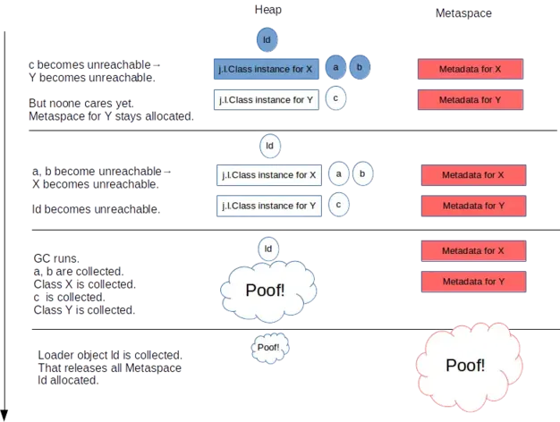
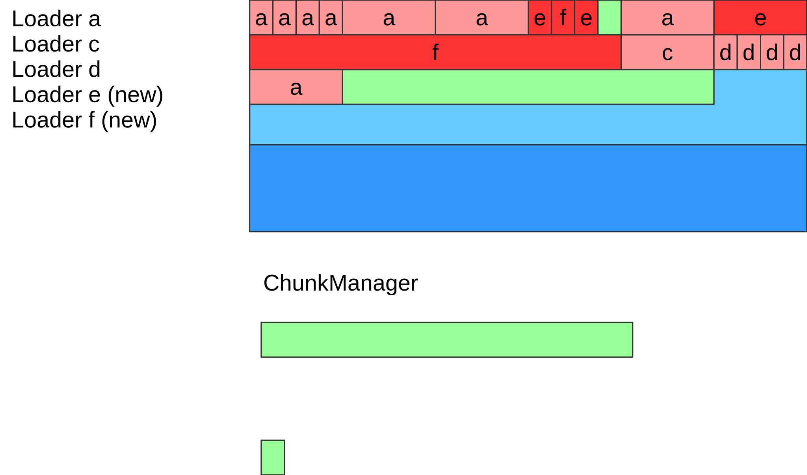
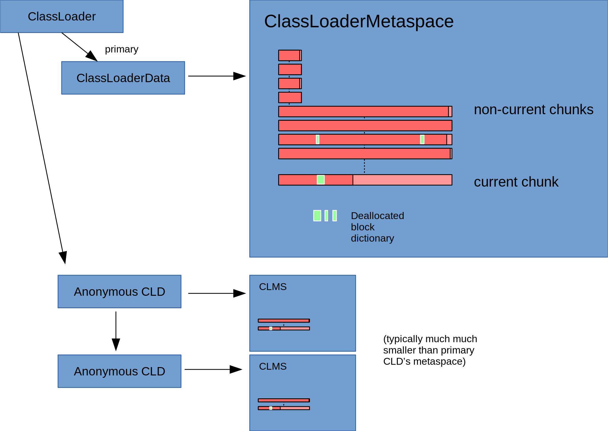
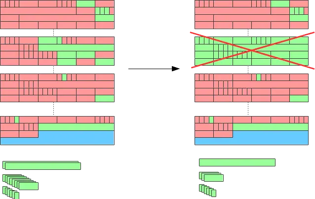
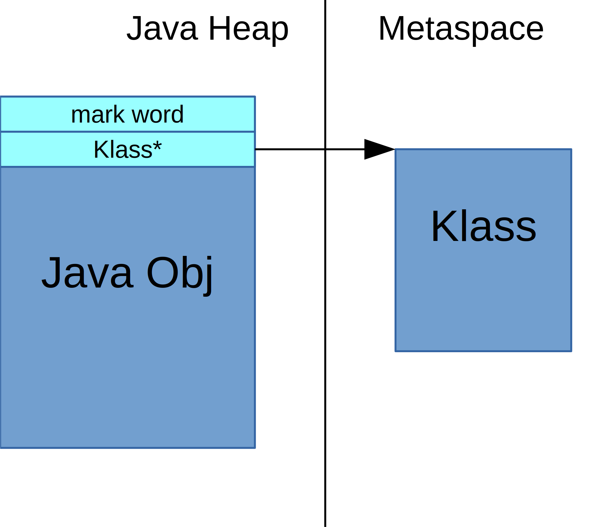
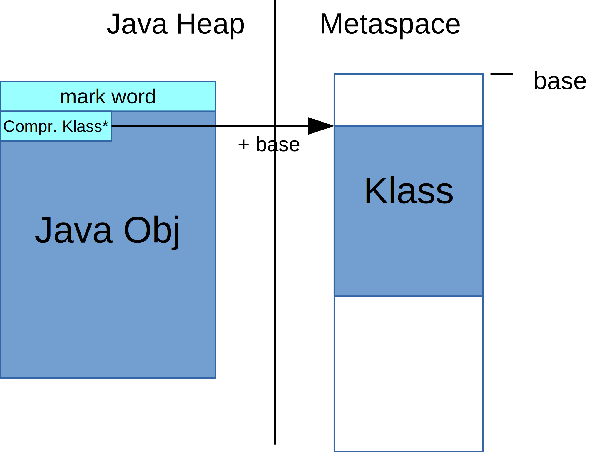
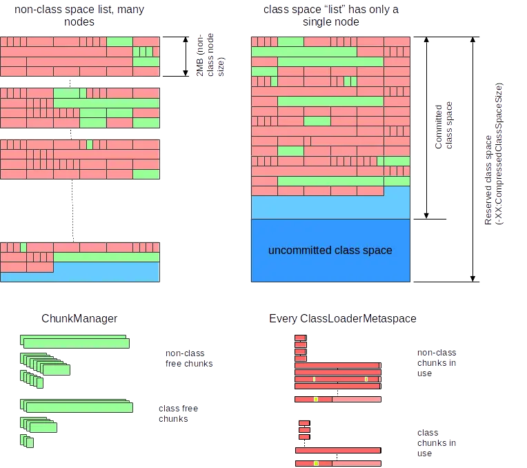
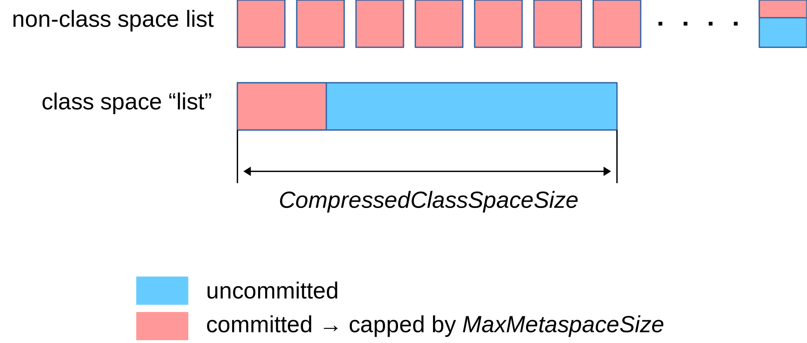

# Java虚拟机-元空间

在HotSpot JVM(jvm 8以前)中，永久代中用于存放类和方法的元数据以及常量池，在Java中对应能通过反射获取到的数据，比如Class和Method。每当一个类初次被加载的时候，它的元数据都会放到永久代中。永久代是有大小限制的(启动时设置)，因此如果加载的类太多，很有可能导致永久代内存溢出(java.lang.OutOfMemoryError: PermGen)。Java 8为了解决这一问题，彻底将永久代移除出了HotSpot JVM，将其原有的数据迁移至Java Heap或Metaspace[<sup>1</sup>](#refer-anchor-1)。

<!--more-->

## 什么是元空间？

元空间是 VM 用于存储类元数据的内存。类元数据是 JVM 进程中 Java 类的运行时表示形式 - 基本上是 JVM 处理 Java 类所需的任何信息。这包括但不限于 JVM 类文件格式中数据的运行时表示。

- Klass 结构，Java 类运行时状态的 VM 内部表示。这包括 vtable 和 itable。
- 方法元数据 - 运行时等效于类文件中的[method_info](https://docs.oracle.com/javase/specs/jvms/se8/html/jvms-4.html#jvms-4.6)，包含[字节码](https://docs.oracle.com/javase/specs/jvms/se8/html/jvms-4.html#jvms-4.7.3)，[异常表](https://docs.oracle.com/javase/specs/jvms/se8/html/jvms-4.html#jvms-4.7.5)，[常量](https://docs.oracle.com/javase/specs/jvms/se8/html/jvms-4.html#jvms-4.7.2)等内容。
- [常量池](https://docs.oracle.com/javase/specs/jvms/se8/html/jvms-4.html#jvms-4.4)
- 注解
- 方法计数器，记录方法被执行的次数，用来辅助 JIT 决策；
- 其他

虽然每个Java类都关联了一个 java.lang.Class 的实例，但它是一个贮存在堆中的 Java 对象。类的类元数据不是一个 Java 对象，它不在堆中，而是在 Metaspace 中。

### 类加载&卸载

当一个类被加载并且它在JVM中的运行时表示正在准备时，Metaspace由它的类加载器分配来存储该类的元数据。


为类分配的Metaspace归其类加载器所有[^1]。它仅在卸载该类加载器本身时释放，而不是之前。只有在这个加载器加载的所有类不再有活动实例，并且没有对这些类及其类加载器的引用，并且GC确实运行后，才会发生[这种情况](https://docs.oracle.com/javase/specs/jls/se7/html/jls-12.html#jls-12.7)。



但是，“释放Metaspace”并不一定意味着内存返回给操作系统。该内存的全部或一部分可以保留在JVM中；它可能会被重用以供将来的类加载，但当前它在JVM进程中未被使用。这部分的大小主要取决于Metaspace的碎片程度——Metaspace的已使用部分和空闲部分的交错程度。此外，Metaspace的一部分（压缩类空间）根本不会返回给操作系统。

### Metaspace 和 GC

Metaspace 只在 GC 运行并且卸载类加载器的时候才会释放空间。当然，在某些时候，需要主动触发 GC 来回收一些没用的 class metadata，即使这个时候对于堆空间来说，还达不到 GC 的条件。

Metaspace 可能在两种情况下触发 GC：

- 分配空间时：虚拟机维护了一个阈值，如果 Metaspace 的空间大小超过了这个阈值，那么在新的空间分配申请时，虚拟机首先会通过收集可以卸载的类加载器来达到复用空间的目的，而不是扩大 Metaspace 的空间，这个时候会触发 GC。这个阈值会上下调整，和 Metaspace 已经占用的操作系统内存保持一个距离。
- 碰到 Metaspace OOM：Metaspace 的总使用空间达到了 MaxMetaspaceSize 设置的阈值，或者 Compressed Class Space 被使用光了，如果这次 GC 真的通过卸载类加载器腾出了很多的空间，这很好，否则的话，我们会进入一个糟糕的 GC 周期，即使我们有足够的堆内存。

## Metaspace 架构

CLD（ClassLoaderData）实例拥有Metaspace Arena。Arena 内通过指针碰撞为类元数据和其他目的分配内存。当空间被用完时，Arena动态地增长。当类加载器被卸载时，它的CLD被删除，Arena被删除，它的内存返回到元空间。这些内存被保存在metaspace中以备以后重用，但是metaspace可能会根据需要决定取消提交部分或全部内存。

全局存在一个`MetaspaceContext`：它在OS级别管理底层内存。对于Arena，它提供了一个粗粒度的分配API，以块的形式分配内存。它还保留了从死亡Arena释放出来的碎片。

```
 +--------+  +--------+  +--------+  +--------+
 |  CLD   |  |  CLD   |  |  CLD   |  |  CLD   |
 +--------+  +--------+  +--------+  +--------+
     |           |           |           |       
     |           |           |           |       allocates variable-sized,
     |           |           |           |       typically small-tiny metaspace blocks 
     v           v           v           v  
 +--------+  +--------+  +--------+  +--------+
 | arena  |  | arena  |  | arena  |  | arena  |
 +--------+  +--------+  +--------+  +--------+
     |           |           |           |       
     |           |           |           |       allocate and, on death, release-in-bulk
     |           |           |           |       medium-sized chunks (1k..4m)
     |           |           |           |       
     v           v           v           v  
 +--------------------------------------------+
 |                                            |
 |         Metaspace Context                  |
 |          (incl chunk freelist)             |
 |                                            |
 +--------------------------------------------+
        |            |            |
        |            |            |              map/commit/uncommit/release
        |            |            |
        v            v            v
   +---------+  +---------+  +---------+
   |         |  |         |  |         |
   | virtual |  | virtual |  | virtual |
   | space   |  | space   |  | space   |
   |         |  |         |  |         |
   +---------+  +---------+  +---------+
```


如果压缩类指针被禁用，并且我们没有压缩类空间，则只存在一个全局上下文。如果启用了压缩类指针，我们将类空间分配与非类空间分配分开。所以我们有两个全局元空间上下文：一个保存Klass结构的分配（“压缩类空间”），一个保存其他所有内容（“非类”元空间），每个CLD现在有两个arena，一个与非类上下文关联，一个与类空间关联。在这种模式下，Klass结构的内存从类空间分配，所有其他元空间从非类元空间分配：

```
        +--------+              +--------+
        |  CLD   |              |  CLD   |
        +--------+              +--------+
         /     \                 /     \          Each CLD has two arenas...             
        /       \               /       \       
       /         \             /         \      
      v           v           v           v             
  +--------+  +--------+  +--------+  +--------+
  | noncl  |  | class  |  | noncl  |  | class  |
  | arena  |  | arena  |  | arena  |  | arena  |
  +--------+  +--------+  +--------+  +--------+
      |              \      /            |       
      |               --------\          |        Non-class arenas take from non-class context,
      |                   /   |          |        class arenas take from class context
      |         /---------    |          |       
      v         v             v          v  
  +--------------------+  +------------------------+
  |                    |  |                        |
  | Metaspace Context  |  | Metaspace Context      |
  |     (nonclass)     |  |     (class)            |
  |                    |  |                        |
  +--------------------+  +------------------------+
         |            |            |
         |            |            |                    Non-class context: list of smallish mappings
         |            |            |                    Class context: one large mapping (the class space)
         v            v            v
  +--------+  +--------+  +----------------~~~~~~~-----+
  |        |  |        |  |                            |
  | virtual|  | virt   |  | virt space (class space)   |
  | space  |  | space  |  |                            |
  |        |  |        |  |                            |
  +--------+  +--------+  +----------------~~~~~~~-----+

```

从上面的图可以发现，与大多数其他重要的分配器一样，Metaspace是分层实现的。

- 在底部，内存从操作系统分配大region
- 在中间，我们将这些region切分成不那么大的chunk并将它们交给类加载器。
- 在顶部，类加载器切割这些块以服务调用者代码。

### 底层：空间列表

在最底层，JVM 先申请虚拟内存(MEM_RESERVE)，然后按需要通过 mmap 接口向操作系统提交物理内存(MEM_COMMIT)，在 64 位平台上，每次申请 2MB 空间。每次申请过来的内存区域，作为一个 Node放到全局链表中 [VirtualSpaceLis](http://hg.openjdk.java.net/jdk/jdk11/file/1ddf9a99e4ad/src/hotspot/share/memory/metaspace/virtualSpaceList.hpp#l39)。


- 每个Node内部需要维护一个高水位线标记，将已提交的空间和仍未提交的空间分开。当 Node 内已提交内存快达到水位线的时候，向操作系统commit新的内存页。并且相应地提高水位线。保留一点空白以避免过于频繁地调用操作系统。
- 这种情况一直持续到Node被完全用完，然后，一个新的节点会被申请，并加入链表中。旧节点被退役^[退役节点的剩余空间不会丢失，而是被分割成块并添加到全局自由空间中]。

内存是从一个名为MetaChunk的节点分配的。它们有三种大小，分别命名为专用、小型和中型——命名是历史性的——通常大小为1K/4K/64K^[受是否32/64位VM，是否是压缩区域影响]。

因此，VirtualSpaceList及其节点是全局结构，而Metachunk属于一个类加载器。VirtualSpaceList中的单个节点可能并且经常包含来自不同类加载器的chunk：


当类加载器及其所有关联的类被卸载时，用于保存其类元数据的Metaspace被释放。所有空闲块都被添加到全局空闲列表(块管理器):


这些块可以被重用：如果另一个类加载器开始加载类并分配Metaspace，它可能会得到一个空闲块，而不是分配一个新块。



### 中间层: Metachunk

当一个类加载器向Metaspace请求一块元数据（通常是少量的——几十或几百字节）的内存时(比如200字节)，它会得到一个Metachunk——一块通常比它请求的大得多的内存。

为什么会这样？因为直接从全局VirtualSpaceList分配内存是昂贵的。VirtualSpaceList是全局结构，需要加锁。我们不想太频繁地这样做，所以会给加载器一个更大的内存块-即Metachunk -加载器将使用它来更快地满足未来的分配，并发地分配给其他加载器，而不加锁。只有当该块用完时，加载器才会再次干扰全局VirtualSpaceList。

Metaspace分配器如何决定将多大的块交给加载器？(这都是猜测)

- 一个新启动的标准加载器将获得小的4K块，直到达到任意阈值，在此阈值处Metaspace分配器明显失去耐心，并开始为加载器提供更大的64K块。
- 引导程序类加载器被称为加载器，它倾向于加载大量类。所以分配器从一开始就给了它一个巨大的块(4M)。这可以通过InitialBootClassLoaderMetaspaceSize进行调整。
- 反射类加载器(jdk.internal.reflect.DelegatingClassLoader)和匿名类的类装入器^[不是真实的类加载器，但这种区别现在并不重要]都只装入一个类。所以他们从一开始就得到了非常小的块(1K)，因为假设他们很快就会停止需要Metaspace，给他们更多的东西都是浪费。

__请注意，这整个优化__ 在加载器很快就会需要空间的假设下，为加载器提供比它目前需要的更多的空间 -- 是对该加载器未来分配行为的一种押注，可能正确，也可能不正确。它们可能会在分配器递给它们一大块的时候停止加载。

### 上层: Metablock

在Metachunk中，我们有第二个类加载器本地分配器。它将Metachunk划分为小的分配单元。这些单元被称为Metablock，并且是分发给调用者的实际单元(例如，Metablock包含一个InstanceKlass)。这个类加载器本地分配器可以是原始的，因此很快:

类元数据的生存期与类加载器绑定，当类加载器死亡时，它将被批量释放。所以JVM不需要关心释放随机metablock[^2].不像通用的malloc分配器。

让我们来看看一个Metachunk: 


一开始，它只包含头部。随后的分配仅在顶部分配。同样，分配器不必是智能的，因为它可以依赖于大容量释放的整个元数据。注意当前chunk的“未使用”部分：由于块由一个类加载器拥有，因此该部分只能由同一个加载器使用。如果加载器停止加载类，则该空间实际上被浪费了。

### ClassLoaderData和ClassLoaderMetaspace


`ClassloaderData != ClassLoaderMetaspace`。我们一直在说“Metaspace内存由它的类加载器拥有”-但这里我们有点撒谎，这是一种简化。随着匿名类的加入，情况变得更加复杂：

这些是为[动态语言支持](https://jcp.org/en/jsr/detail?id=292)而生成的结构。当一个加载器加载一个匿名类时，这个类会得到它自己独立的ClassLoaderData，它的生存期与匿名类的生存期相耦合，而不是与外壳类加载器相耦合（所以它-及其相关的元数据-可以在外壳加载器被收集之前被收集）。这意味着类加载器对所有正常加载的类都有一个 Main ClassLoaderData结构，对每个匿名类都有一个secondary ClassLoaderData结构。

这种分离的目的之一是为了避免不必要地延长Lambda和Method句柄等Metaspace分配的生命周期。



### 那么，内存何时返回到操作系统？

让我们再看看内存何时返回到操作系统。当一个VirtualSpaceListNode中的所有块都空闲时，该节点本身将被删除, 并从VirtualSpaceList中删除该节点。它的空闲块将从Metaspace全局空闲列表中删除。节点被取消映射，其内存返回到操作系统。节点被“清除”。



要使节点中的所有块都空闲，拥有这些块的所有类加载器必须已经死亡。这是否可能在很大程度上取决于碎片化:

- 一个节点的大小是2 MB; 块的大小从1K到64K不等;通常的负载是每个节点大约150 - 200个块。如果这些块都是由单个类加载器分配的，则收集该加载器将释放节点并将其内存释放给操作系统。
- 但是，如果这些块由不同的类加载器拥有，它们的生命周期不同，那么什么都不会被释放。当我们处理许多小型类加载器(例如，匿名类的加载器或反射委托器)时，可能会出现这种情况。
- 另外，请注意，Metaspace(压缩类空间)的一部分将永远不会释放回操作系统。

## 什么是压缩类空间

在64位平台上，hotspot使用称为压缩对象指针（CompressedOops）和压缩类指针的优化技术。两者都是同一事物的变体。压缩指针是一种引用数据的方式-Java堆中的对象或Metaspace中的类元数据-即使在64位平台上也使用32位引用。

这有许多优点，例如，更小的指针大小导致减少内存占用和更好地使用缓存，并且在某些平台上可以使用更多的寄存器。

由于最终需要一个64位的地址来访问那个东西，那个32位的“指针”实际上是一个偏移量--可能是移位的--进入一个具有已知公共基址的区域。关于Metaspace，我们不关心压缩的oops，但必须处理压缩的类指针：

- 每个Java对象在其头部都有一个对Metaspace中Java堆之外的本机结构的引用: [Klass](http://hg.openjdk.java.net/jdk/jdk11/file/1ddf9a99e4ad/src/hotspot/share/oops/klass.hpp#l78)结构。



当使用压缩类指针时，该引用是一个32位值。为了找到该结构的真实的64位地址，我们向其添加已知的公共基址，并且还可能将值左移三位:



该技术对在何处分配这些Klass结构设置了技术限制：Klass结构的每个可能的位置必须落在4G的范围内（未移位模式）|32G（移位模式），可从公共基地址获得32位偏移^[与压缩对象指针不同，压缩类指针不会移动以扩展其范围。没有技术上的理由不这样做，因为Klass分配也有一个共同的对齐方式。它只是没有得到执行]。这两个限制都意味着我们需要将Metaspace分配为一个连续区域。

当通过系统API(如malloc或mmap)从系统分配内存时，地址由系统选择，并且可以是适合类型范围的任何值。因此，在64位平台上，当然不能保证随后的分配将产生范围限制内的地址。例如，一个mmap调用可以映射到0x000000070000000，一个映射到0x0000000f0000000。

因此，我们必须使用单个mmap调用来为Klass对象建立区域。因此，我们需要预先知道这个区域的大小，它不能大于32G。它也永远不能可靠地扩展，因为超出其末端的地址范围可能已经被占用。

这些限制是苛刻的。它们也只对Klass结构真正需要，而不是对其他类元数据：目前只有Klass实例使用压缩引用。其他元数据使用64位指针进行寻址，因此可以放置在任何地方。

因此，我们决定将元空间分成两部分：“非类部分”和“类部分”：

- 类别部分，存放Klass结构，必须作为一个连续区域分配，其不能大于32G。
- 包含其他所有内容的非类部分则没有限制。

> 类部分被称为“压缩类空间”，尽管这有点用词不当，因为Klass结构本身没有被压缩，而是指向它们的指针。

压缩类空间的大小由`-XX:CompressedClassSpaceSize`确定。因为我们需要预先知道类空间的大小，所以该参数不能为空。如果省略，则默认为1GB(HotSpot人为地限制压缩类空间大小最大在3G)。

还要注意，我们总是在谈论虚拟大小，而不是提交大小。该内存仅在需要时提交。非常简单，大多数现代操作系统上的虚拟大小几乎不需要任何成本，它只是一个地址空间预留。

由于Klass结构的平均大小为1K，因此具有1G默认大小的压缩类空间将能够托管大约一百万个Klass结构。这是我们可以加载的类数量的唯一真实的限制。

还请注意，当我们在没有CompressedClassPointers的情况下运行时，CompressedOops会被禁用。如果我们通过`-XX:-CompressedOops`手动关闭CompressedOops，或者Java堆大于或等于32G，就会发生这种情况。

### 实现

为了重用现有的Metaspace实现，应用了一个技巧: 全局结构VirtualSpaceList和ChunkManager都被复制，现在存在于两个变体中，一个“类空间”变体和一个“非类空间”变体。

但是由于我们需要类空间的连续地址范围，我们不能真正使用映射区域链;因此类空间列表是退化的：它只包含一个节点，不能增长。这个节点与它在非类列表中的兄弟节点相比是巨大的。该节点是压缩的类空间。



ClassLoaderMetaspace -每个类加载器的结构，保存这个类加载器使用的块-现在需要两个链接的块列表，一个用于保存非类块，一个用于类块。这也意味着我们将当前节点的“空闲”部分加倍，因为现在我们有两个节点。

### 开关：CompressedClassPointers，CompressedOops

- `-XX:+UseCompressedOops`启用压缩对象指针。
- `-XX:+UseCompressedClassPointers`启用压缩类指针。

这两个都是默认打开的，但可以手动关闭。如果压缩类指针被关闭，我们将没有压缩类空间，并且`-XX:CompressedClassSpaceSize`开关将被忽略。

`-XX:+UseCompressedClassPointers`需要`-XX:+UseCompressedOops`,但反之不然: 可以在没有压缩类指针的情况下运行压缩的oops。这可能有助于在某些病态的情况下减少Metaspace内存占用。一般情况下，建议不要单独使用这些开关。

> 请注意，压缩对象指针需要Java堆`<`32G。因此，如果Java堆`>=` 32G，压缩的oops将被关闭，这也将关闭压缩的类指针。

## Metaspace大小

有两个参数可以限制Metaspace大小:

- `-XX:MaxMetaspaceSize` 确定允许Metaspace的最大提交阈值,它包括非类空间和类空间。默认情况下它是无限的。
- `-XX:CompressedClassSpaceSize` 确定Metaspace的压缩类空间的虚拟大小(前提是能开启klass压缩指针)。它的默认值是1G(注意：这部分内存是reserved，不是commited)。

下图说明了这两个限制是如何工作的:



- 红色部分是Metaspace提交部分的总和，包括非类空间节点和一个巨型类空间节点。此总和受`-XX:MaxMetaspaceSize`限制。尝试提交比`-XX:MaxMetaspaceSize`更多的内存将导致OutOfMemoryError(Metaspace)。
- `-XX:CompressedClassSpaceSize`决定了一个巨型类空间节点的保留大小。它包括已提交的部分和(蓝色)尚未提交的部分。如果该节点已满，我们将获得OutOfMemoryError("Compressed Class Space")。

> 注意: CompressedClassPointers 默认情况下是打开的，但如果关闭，将不会有压缩类空间，`-XX:CompressedClassSpaceSize`将被忽略，Metaspace将只受`-XX:MaxMetaspaceSize`的限制

### 一个类需要多少Metaspace？

对于每个加载的类，将从类和非类空间中的类元数据分配空间。


#### 类空间

在类空间中是Klass结构，它是固定大小的。

接下来是两个可变大小的结构，vtable和itable。前者的大小随着方法的数量而增长，后者的大小随着从实现的接口继承的接口方法的数量而增长。

接下来是一个描述Java类中Object引用成员位置的映射，即非静态Oopmap。该结构也是可变尺寸的，尽管通常非常小。

vtable和itable通常都很小，但对于奇怪的大型类，它们可以增长到巨大的比例。一个有30000个方法的类的vtable大小为240k，当从一个有30000个方法的接口派生时也是一个itable。但这些都是测试用例，除了自动代码生成之外，现实中几乎找不到这样的类。

#### 非类空间

非类空间的有很多东西，其中最大的贡献者是:

- 常量池，大小可变。
- 任何类方法的Meta数据：ConstMethod结构与许多相关的，很大程度上可变大小的嵌入式结构，如方法字节码，局部变量表，异常表，参数信息，签名等。
- 用于控制JIT的方法数据
- 注释

### 测量大小

在JDK 11中，jcmd添加了一个新的诊断命令：VM.metspace。此命令对于分析Metaspace消耗非常有用。

不带参数使用时，该命令将打印出一个简短的标准统计数据。

```sh
$ jcmd wildfly VM.metaspace

## 第一部分向我们展示了active类加载器使用的块的信息：
Total Usage ( 1041 loaders):

## Non-Class:、Class:-这些行列出了非类空间和类空间的块使用情况。
  Non-Class: 2837 chunks,     58,62 MB capacity,    53,54 MB ( 91%) used,     4,90 MB (  8%) free,     2,59 KB ( <1%) waste,   177,31 KB ( <1%) overhead, deallocated: 5065 blocks with 1,01 MB
  Class: 1653 chunks,      9,93 MB capacity,     7,44 MB ( 75%) used,     2,40 MB ( 24%) free,   208 bytes ( <1%) waste,   103,31 KB (  1%) overhead, deallocated: 653 blocks with 285,77 KB
## Both: -总结了两个空间的块使用情况，因此也是整个VM的块使用情况。
  Both: 4490 chunks,     68,55 MB capacity,    60,98 MB ( 89%) used,     7,29 MB ( 11%) free,     2,79 KB ( <1%) waste,   280,62 KB ( <1%) overhead, deallocated: 5718 blocks with 1,29 MB
## VM出于Metaspace目的而使用的虚拟空间的总和, reserved是从OS为Metaspace保留的总内存，committed显然是已提交的部分.
## committed比in-use chunk的容量大是正常的，因为它还包含自由列表中的空闲chunk和HWM margin(主动提交但尚未划分到元块中的空间)
## 提交的内存大小=使用中的块容量+空闲中的块容量+ HWM余量。
Virtual space:
  Non-class space:       60,00 MB reserved,      58,75 MB ( 98%) committed 
  Class space:      248,00 MB reserved,      10,00 MB (  4%) committed 
  Both:      308,00 MB reserved,      68,75 MB ( 22%) committed 
## 空闲列表中有多少块等待重用
Chunk freelists:
  Non-Class:
  specialized chunks:    1, capacity 1,00 KB
        small chunks:   11, capacity 44,00 KB
      medium chunks: (none)
    humongous chunks: (none)
              Total:   12, capacity=45,00 KB
  
  Class:
  specialized chunks: (none)
        small chunks:    2, capacity 4,00 KB
        medium chunks: (none)
    humongous chunks: (none)
                Total:    2, capacity=4,00 KB
## 各种浪费点
Waste (percentages refer to total committed size 68,75 MB):
              Committed unused:    156,00 KB ( <1%)
        Waste in chunks in use:      2,79 KB ( <1%)
         Free in chunks in use:      7,29 MB ( 11%)
     Overhead in chunks in use:    280,62 KB ( <1%)
                In free chunks:     49,00 KB ( <1%)
Deallocated from chunks in use:      1,29 MB (  2%) (5718 blocks)
                       -total-:      9,06 MB ( 13%)


MaxMetaspaceSize: 256,00 MB
InitialBootClassLoaderMetaspaceSize: 4,00 MB
UseCompressedClassPointers: true
CompressedClassSpaceSize: 248,00 MB
```

## 永久代

> 永久代存在于 jdk 1.7及以前的版本。

PermGen是Permanent Generation的缩写，它是HotSpot对于JVM方法区的一种实现，也常被称为永久代。

永久代是一片连续的堆空间，在JVM启动之前通过在命令行设置参数-XX:MaxPermSize来设定永久代最大可分配的内存空间，永久代的垃圾收集是和老年代(old generation)在一起的，因此无论谁满了，都会触发永久代和老年代的垃圾收集。

一个常见的问题是，当JVM加载的类信息容量超过了参数-XX：MaxPermSize设定的值时，应用将会抛出OOM异常。特别地是，在Java 7之前，字符串常量池实际上保留在PermGen里，这种情况导致的`java.lang.OutOfMemoryError: PermGen space`，常会让人产生误解。

移除永久代的工作从JDK1.7就开始了。JDK1.7中，存储在永久代的部分数据就已经转移到了Java Heap或者是 Native Heap。但永久代仍存在于JDK1.7中，并没完全移除，譬如符号引用(Symbols)转移到了native heap；字面量(interned strings)转移到了java heap；类的静态变量(class statics)转移到了java heap。

```java
// 以2的指数级不断的生成新的字符串，这样可以比较快速的消耗内存
import java.util.ArrayList;
import java.util.List;
 
public class StringOomMock {
    static String  base = "string";
    public static void main(String[] args) {
        List<String> list = new ArrayList<String>();
        for (int i=0;i< Integer.MAX_VALUE;i++){
            String str = base + base;
            base = str;
            list.add(str.intern());
        }
    }
}
```

分别在JDK1.6,1.7,1.8下面运行这段代码：JDK 1.6下，会出现"PermGen Space"的内存溢出，而在 JDK 1.7和 JDK 1.8 中，会出现堆内存溢出。

永久代在JDK8中被完全的移除了。所以永久代的参数-XX:PermSize和-XX：MaxPermSize也被移除了。在JDK8中,classe metadata(the virtual machines internal presentation of Java class),被存储在叫做Metaspace的native memory(本地内存)中。 

## 参考

<div id="refer-anchor-1"></div>

- [1] [JEP 122: Remove the Permanent Generation](https://openjdk.org/jeps/122)
- [2] [what is metaspace](https://stuefe.de/posts/metaspace/what-is-metaspace/)
- [3] [Metaspace Architecture](https://stuefe.de/posts/metaspace/metaspace-architecture/)
- [4] [What is Compressed Class Space?](https://stuefe.de/posts/metaspace/what-is-compressed-class-space/)
- [5] [Sizing Metaspace](https://stuefe.de/posts/metaspace/sizing-metaspace/)
- [6] [Analyze Metaspace with jcmd VM.metaspace](https://stuefe.de/posts/metaspace/analyze-metaspace-with-jcmd/)
- [7] [JDK-6962931 : move interned strings out of the perm gen](https://bugs.java.com/bugdatabase/view_bug.do?bug_id=6962931)
- [8] [PermGen Elimination project is promoting](http://mail.openjdk.java.net/pipermail/hotspot-dev/2012-September/006679.html)
- [9] [Where Has the Java PermGen Gone?](https://www.infoq.com/articles/Java-PERMGEN-Removed/)
- [10] [HotSpot.Metaspace](https://wiki.openjdk.org/display/HotSpot/Metaspace)


[^1]: 这是一种简化。Metaspace由ClassLoaderData对象拥有，该对象通常(但不总是)与类加载器具有1：1的关系
[^2]: 有一些例外情况，分配的Metaspace可以在其类卸载之前释放。例如，如果重新定义了一个类，则不再需要旧元数据的一部分。或者，如果在类加载过程中发生错误，我们可能已经为这个类分配了元数据，而这个类现在被搁置了。在所有这些情况下，Metablock都被添加到一个小的自由块字典中，并且可能会重新用于同一加载器的后续分配。这些块被称为`释放`。

