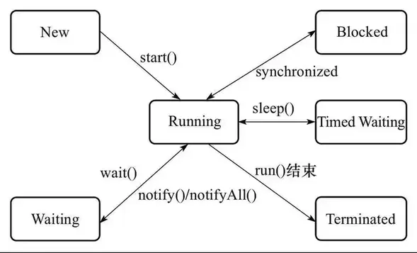

# Java并发之Thread

线程有时也被称为轻量级的进程。进程和线程都提供了一个执行环境，但创建一个新的线程比创建一个新的进程需要的资源要少。 线程是在进程中存在的，每个进程最少有一个线程。线程共享进程的资源，包括内存和打开的文件。这样提高了效率，但潜在的问题就是线程间的通信。 

<!--more-->

## 线程的实现

线程的实现主要有3种方式:

* 使用内核线程实现;
* 使用用户线程实现
* 使用用户线程加轻量级进程混合实现。

内核线程就是直接由操作系统内核支持的线程，这类线程由内核来完成线程切换，内核通过调度器调度线程，并将线程的任务映射到各个处理器上。

轻量级进程是内核线程的一种高级接口——轻量级进程，轻量级进程就是通常意义上所说的线程，每个轻量级进程都由一个内核线程支持，这种轻量级进程与内核进程之间1:1的关系称为一对一线程模型。每个轻量级进程都是一个独立的调度单元，即使有一个轻量级进程在系统调用中被阻塞了，也不会影响整个进程。轻量级进程有它的局限性:

1. 基于内核线程实现，所以各种线程操作，如创建，析构和同步，都需要进行系统调用，这需要在用户态和内核态之间来回切换，代价较高。
2. 每个轻量级进程都需要一个内核线程的支持，需要消耗一定的内核资源。因此，一个系统支持的轻量级进程的数量是有限的。

用户线程的广义定义是:一个线程只要不是内核线程，就可以认为是用户线程。所以，广义地说，轻量级进程也是用户线程。但是，轻量级进程的实现始终是建立在内核上的。用户线程的狭义定义是指完全建立在用户空间上的线程库，系统内核不能感知线程存在的实现。用户线程的建立、同步、销毁和调度完全在用户态中完成，不需要内核的帮助。这种线程快速高效，常用于实现进程与线程的1:N关系。用户线程的劣势在于没有内核的支持，所有的线程操作都需要自己实现，程序一般比较复杂。

用户线程加轻量级进程混合实现:将轻量级进程作为用户线程和内核线程之间的桥梁。主流的操作系统都提供了线程实现，java 语言则提供了在不同硬件和操作系统平台下对线程操作的统一处理。每个执行了`start()`方法并且还未结束的Thread实例，都代表一个线程。Thread类中的关键方法大都是声明为Native\(平台相关\)的。

### 线程调度

线程调度的主要方式有2种:协同式线程调度和抢占式线程调度。

使用协同式线程调度的多线程系统，线程的执行时间由线程自身来控制，线程完成自身任务后，要主动通知系统切换到另外一个线程上。协同式系统的最大好处在于实现简单，且不存在线程同步问题。同样，坏处也很明显，如果一个线程有问题，一直不告知系统切换就会一直阻塞在那。使用抢占式调度的系统，线程由系统来分配时间，线程的切换不受自身控制。在这种情况下，不存在线程导致整个进程阻塞的情况，Java线程的调度方式就是抢占式调度。

## 定义并启动一个线程

使用`Thread`新建线程有两种写法：

### 继承Thread类

```java
Thread helloThread = new Thread() {
    @Override
    public void run() {
        System.out.println("Hello from a thread!");
    }
}

helloThread.start();
```

### 实现Runnable接口

`Runnable`对象仅包含一个`run()`方法，在这个方法中定义的代码将在会线程中执行。将`Runnable`对象传递给`Thread`类的构造函数即可。

```java
public class HelloRunnable implements Runnable {
    public void run() {
        System.out.println("Hello from a thread!");
    }
    public static void main(String args[]) {
        (new Thread(new HelloRunnable())).start();
    }
}
```
Thread#start 方法会调用 Thread 的 run 方法

```java
// Thread 的 run()
public void run() {
    // target 就是传入的 Runnable 对象
    if (target != null) {
        target.run();
    }
}
```

### Thread.start

开启新线程需要调用Thread.start()方法，直接调用run()方法，只会在当前线程串行执行run()方法。

```java
class MyThread extends Thread{
    public MyThread(String name) {
        super(name);
    }

    public void run(){
        System.out.println(Thread.currentThread().getName()+" is running");
    }
};

public class Demo {
    public static void main(String[] args) {
        Thread mythread=new MyThread("mythread");

        System.out.println(Thread.currentThread().getName()+" call mythread.run()");
        mythread.run();

        System.out.println(Thread.currentThread().getName()+" call mythread.start()");
        mythread.start();
    }  
}
/* ------out put ---------
 * main call mythread.run()
 * main is running
 * main call mythread.start()
 * mythread is running
 */
```

1. `Thread.currentThread()`方法可以返回代码段正在被哪个线程调用的信息。
2. 执行`start()`方法的顺序并不代表线程启动的顺序。

### `isAlive()`方法

方法`isAlive()`的功能是判断当前的线程是否处于活动状态。活动状态是指线程已经启动且尚未终止。返回true表示线程还"存活"。

### `sleep()`方法

方法`sleep()`的作用是在指定的毫秒数内让当前正在执行的线程暂停执行。

### `getId()`方法

`getId()`方法的作用是取得线程的唯一标识。

## 终止线程

一般来说，线程执行完后就会结束；但是，一些后台线程可能会常驻系统，不会正常终结。如何正常关闭一个线程？JDK的Thread提供了`stop()`方法，但要注意的是该方法已经被弃用。使用该方法会带来不安全性。

### 强行终止线程导致数据不一致

```java
class User{
    private int id;
    private String name;
    public User() {
        this.id = 0;
        this.name = "0";
    }
    // 省略 setter and getter
    @Override
    public String toString() {
        return "user -> [ id = "+id+", name = "+name+" ]";
    }
}
```
此时我们通过 Thread 来修改User对象的属性。
```java
    Thread thread = new Thread(){
            @Override
            public void run(){
                while(true) {
                    int tmp = (int) System.currentTimeMillis() / 1000;
                    user.setId(tmp);
                    try {
                        Thread.sleep(99);
                    } catch (InterruptedException e) {
                        e.printStackTrace();
                    }
                    user.setName(String.valueOf(tmp));
                }
            }
        };
        thread.start();
        Thread.sleep(100);
        thread.stop();
        System.out.println(user);
//-----------------------
//user -> [ id = -1064621, name = 0 ]
```

显然，此处的id与name并不相同，stop方法强行终止了setName方法的执行。

### 直接释放锁，破坏对象一致性

```java
public class StopThread {

    public static User user = new User();

    public static class Reader implements Runnable{
        public void run() {
            while(true) {
                synchronized (StopThread.class) {
                    if (user.getId()!= Integer.parseInt(user.getName())) {
                        System.out.println(user);
                    }
                }
                Thread.yield();
            }
        }
    }

    public static class Writer implements Runnable{
        public void run() {
            while (true){
                synchronized (StopThread.class){
                    int tmp = (int) System.currentTimeMillis()/1000;
                    user.setId(tmp);
                    try {
                        Thread.sleep(100);
                    } catch (InterruptedException e) {
                        e.printStackTrace();
                    }
                    user.setName(String.valueOf(tmp));
                }
                Thread.yield();
            }
        }
    }

    public static void main(String[] args) throws InterruptedException {
        new Thread(new Reader()).start();
        while(true) {
            Thread thread = new Thread(new Writer());
            thread.start();
            Thread.sleep(150);
            thread.stop();
        }
    }
}
```

`Thread.stop()`在结束线程时，会直接终止线程，立即释放线程所持有的锁。假设当前写入线程写入数据进行到一半，并强行终止，对象数据不一致；又因为锁已经被释放，读进程将读入不一致对象。

```json
user -> [ id = -1063553, name = -1063554 ]
user -> [ id = -1063552, name = -1063553 ]
```

总结下，`Thread.stop()`的使用会带来数据不一致的问题，所以尽量避免使用该方法。大多数stop的使用，应当被替换为简单修改某些共享变量来指示其目标线程将停止运行的代码。目标线程应当有规律的检查这些变量。并且，如果这些变量指示其将停止运行，目标线程应当以某种有序的方式从它的run方法返回。为了确保停止请求的及时传达，变量必须是 volatile 的（或者变量的访问被同步）。

下面是一个例子：

```java
    private volatile Thread blinker;
    public void stop() {
        blinker = null;
    }
    public void run() {
        Thread thisThread = Thread.currentThread();
        while (blinker == thisThread) {
            try {
                thisThread.sleep(interval);
            } catch (InterruptedException e){
            }
            repaint();
        }
    }
```

综上，`Thread.stop()`方法已经不被推荐使用，JDK 更推荐通过线程中断来实现线程终止。

## 线程中断

中断是给线程的一个指示，告诉它应该停止正在做的事并去做其他事情。一个线程究竟要怎么响应中断请求取决于程序员。一个线程通过调用对被中断线程的Thread对象的`interrupt()`方法，发送中断信号。为了让中断机制正常工作，被中断的线程必须支持它自己的中断（即要自己处理中断）。中断的相关方法有3个:

```java
public void Thread.interrupt()              // 中断线程
public boolean Thread.isInterrupted()       // 判断是否中断
public static boolean Thread.interrupted()  // 判断是否中断，并清除当前中断状态
```

### `Thread.interrupt()`

```java
public void interrupt() {
         if (this != Thread.currentThread())
             checkAccess();
         synchronized (blockerLock) {
             Interruptible b = blocker;
             if (b != null) {
                // 此处的interrupt0 是native方法
                 interrupt0();           // Just to set the interrupt flag
                 b.interrupt(this);
                 return;
             }
         }
         interrupt0();
     }
```

中断本线程。无返回值。具体作用分以下几种情况：

* 如果该线程正阻塞于Object类的`wait()`、`wait(long)`、`wait(long, int)`方法，或者Thread类的`join()`、join(long)、`join(long, int)`、`sleep(long)`、`sleep(long, int)`方法，则该线程的中断状态将被清除，并收到一个`java.lang.InterruptedException`。
* 如果该线程正阻塞于interruptible channel上的I/O操作，则该通道将被关闭，同时该线程的中断状态被设置，并收到一个`java.nio.channels.ClosedByInterruptException`。
如果该线程正阻塞于一个`java.nio.channels.Selector`操作，则该线程的中断状态被设置，它将立即从选择操作返回，并可能带有一个非零值，就好像调用`java.nio.channels.Selector.wakeup()`方法一样。
* 如果上述条件都不成立，则该线程的中断状态将被设置。中断一个不处于活动状态的线程不会有任何作用。如果是其他线程在中断该线程，则`java.lang.Thread.checkAccess()`方法就会被调用，这可能抛出`java.lang.SecurityException`。

### `Thread.isInterrupted`

```java
public static boolean interrupted() {
    return currentThread().isInterrupted(true);
}
```

检测当前线程是否已经中断，是则返回true，否则false，并清除中断状态。换言之，如果该方法被连续调用两次，第二次必将返回false，除非在第一次与第二次的瞬间线程再次被中断。如果中断调用时线程已经不处于活动状态，则返回false。

### `Thread.interrupted()`

```java
public boolean isInterrupted() {
    return isInterrupted(false);
}
```

检测当前线程是否已经中断，是则返回true，否则false。中断状态不受该方法的影响。如果中断调用时线程已经不处于活动状态，则返回false。

interrupted()与isInterrupted()的唯一区别是，前者会读取并清除中断状态，后者仅读取状态。在hotspot源码中，两者均通过调用的native方法`private native boolean isInterrupted(boolean ClearInterrupted);`来实现，区别是参数值ClearInterrupted不同。

### 使用中断

注意，`Thread.interrupt()`方法只是修改了当前线程的中断状态，为使中断生效，我们需要自己实现处理中断的逻辑。

```java
public class InterruptThread {

    public static void main(String[] args) throws InterruptedException {
        Thread thread = new Thread(){
            @Override
            public void run() {
                while(true) {
                    // 此处处理正常loop 时的中断
                    if(Thread.currentThread().isInterrupted()){
                        System.out.println("Thread is Interrupted!");
                        break; // 调出循环
                    }
                    System.out.println("Thread is Running!");
                    try {
                        // 如果此时中断，会触发 InterruptedException
                        Thread.sleep(1000);
                    } catch (InterruptedException e) {
                        // 阻塞时被中断
                        // 1. 需要设置下中断状态，以便下次正常loop执行时跳出执行
                        // 2. 也可以直接抛到外层，由外层处理(不推荐)
                        Thread.currentThread().interrupt();
                        e.printStackTrace();
                    }
                    Thread.yield();
                }
            }
        };

        thread.start();
        Thread.sleep(5000);
        System.out.println("interrupt Thread!");
        thread.interrupt();
    }
}
```

当线程阻塞于wait/join/sleep时，中断状态会被清除掉，同时收到InterruptedException。如果不加处理，下次循环开始时，就无法捕获这个中断。因此，在编写多线程代码的时候，任何时候捕获到InterruptedException，要么继续上抛，要么重置中断状态，这是最安全的做法。

当某个方法抛出InterruptedException时，表示该方法是一个阻塞方法。当在代码中调用一个将抛出InterruptedException异常的方法时，你自己的方法也就变成了一个阻塞方法，并且必须要处理对中断的相应。对于库代码来说，有两种选择：

- 传递InterruptedException。这是最明智的策略，将异常传递给方法的调用者。
- 恢复中断。在不能上抛的情况下，如Runnable方法，必须捕获InterruptedException，并通过当前线程的interrupt()方法恢复中断状态，这样在调用栈中更高层的代码将看到引发了一个中断。如下:

```java
public void run() {
    try {
          // 1.调用阻塞方法
        } catch (InterruptedException e) {
            // important：2.恢复被中断的状态
            Thread.currentThread().interrupt();    
        }
}
```

## wait & notify

JDK在`java.lang.Object`中提供了两个接口`wait()`和`notify()`:

```java
public final void wait() throws InterruptedException {
        wait(0);
}
public final native void wait(long timeout) throws InterruptedException;
public final void wait(long timeout, int nanos) throws InterruptedException;

public final native void notify();
public final native void notifyAll();
```

如果一个线程调用了`object.wait()`，它就会进入object对象的等待队列。当`object.notify()` 被调用时，会从等待队列中随机选择一个线程，将其唤醒。注意，这里的选择是不公平的，完全随机。除了`notify()`方法外，`notifyAll()`会唤醒等待队列中所有的等待线程。

注意，`wait()`和`notify()/notifyAll()`必须在synchronized同步代码块中使用。

### 执行过程

1. 当线程T1执行`wait()`时，会把当前的锁S1释放，然后让出CPU，进入等待状态。
2. 当获得锁的线程T2执行`notify/notifyAll`s方法时，会唤醒一个处于等待该对象锁状态的的线程T1，然后继续往下执行，直到执行完退出对象锁锁住的区域（synchronized修饰的代码块）后再释放锁。
3. T1被唤醒后，会尝试获得锁S1，当顺利获得锁S1后，才能真正继续执行下去。

从这里可以看出，notify/notifyAll()执行后，并不立即释放锁，而是要等到执行完临界区中代码后，再释放。在实际编程中，我们应该尽量在线程调用notify/notifyAll()后，立即退出临界区。即不要在notify/notifyAll()后面再写一些耗时的代码。

### 代码示例

```java
public class waitandnotify {
    private final  Object lock = new Object();
    public class T1 extends Thread{
        @Override
        public void run(){
            System.out.println(System.currentTimeMillis()+ "-> T1 start() ");
            synchronized (lock){
                System.out.println(System.currentTimeMillis()+ "-> T1 begin wait() ");
                try {
                    lock.wait();
                } catch (InterruptedException e) {
                    Thread.currentThread().interrupt();
                }
                System.out.println(System.currentTimeMillis()+ "-> T1 end wait() ");
            }
        }
    }
    public class T2 extends Thread{
        @Override
        public void run(){
            System.out.println(System.currentTimeMillis()+ "-> T2 start() ");
            synchronized (lock){
                System.out.println(System.currentTimeMillis()+ "-> T2 begin notify() ");
                lock.notify();
                try {
                    Thread.sleep(5000);
                } catch (InterruptedException e) {
                    Thread.currentThread().interrupt();
                }
                System.out.println(System.currentTimeMillis()+ "-> T2 end notify() ");
            }
        }
    }

    public static void main(String[] args){
        waitandnotify client = new waitandnotify();
        Thread t1 = client.new T1();
        Thread t2 = client.new T2();
        t1.start();
        t2.start();
    }
}
/*1502699128356-> T1 start() 
 *1502699128356-> T1 begin wait() 
 *1502699128356-> T2 start() 
 *1502699128356-> T2 begin notify() 
 *1502699133357-> T2 end notify() 
 *1502699133357-> T1 end wait() 
 */
```

显然，从时间戳可以看出T2通知T1继续执行后，T1并不能继续执行，而是等待T2释放object的锁，并重新获得锁后才继续执行。

`Object.wait()`和`Thread.sleep()`都可以让线程等待若干分钟。除了wait方法可以被唤醒之外，另一个主要区别是wait方法会释放目标对象的锁，而sleep方法不会释放资源。当然，`Object.wait()`只是把当前线程占用的目标对象的锁释放，其他占用的对象的锁状态不会发生变化。

## suspend & resume

### 简单使用

```java
public class suspend_resume {

    public static class ChangeThread1 extends Thread{
        private  int i= 0;
        public void run() {
            while (true) {
                    System.out.println(System.currentTimeMillis() + "-> Thread ::" + ++i);
            }
        }
    }
    public static void main(String[] args) throws InterruptedException {

        ChangeThread1 thread1 = new ChangeThread1();
        thread1.start();
        Thread.sleep(100);
        System.out.println(System.currentTimeMillis()+"------begin-----suspend ");
        thread1.suspend();
        Thread.sleep(10);
        thread1.resume();
        System.out.println(System.currentTimeMillis()+"-------end-----resume ");
        thread1.suspend();
    }
}
```
__输出:__

```
1502791453031-> Thread ::11696
1502791453031-> Thread ::11697
1502791453031-> Thread ::11698
1502791453031-> Thread ::11699
1502791453031-> Thread ::11700
1502791453031------begin-----suspend 
1502791453031-> Thread ::11701
1502791453031-> Thread ::11702
1502791453031-> Thread ::11703
1502791453031-> Thread ::11704
1502791453031-> Thread ::11705
1502791453042-> Thread ::11706 // 此处可从时间戳看出暂停了10 millis
1502791453042-------end-----resume 
```

### 注意事项

suspend和resume这对API已经被标注为弃用。不推荐使用suspend去挂起线程是因为suspend方法在导致线程暂停的同时，并不会释放任何资源。其他线程无妨访问被占用的锁，直到对应的线程进行了resume操作，被挂起的线程才能继续。其他阻塞在相关锁的线程也可以继续执行。

但是如果`resume()`操作意外地在`suspend()`方法前执行，那么被挂起的线程很难继续被执行，更严重的情况是，挂起线程如果占据锁，那么这个锁将一直得不到释放，从而导致整个系统不正常工作。下面就是一个例子：

```java
public class suspend_resume_dead_lock {

    public static Object lock = new Object();

    public static class ChangeObjectThread extends Thread{
        public ChangeObjectThread(String name) {
            super(name);
        }

        @Override
        public void run() {
            System.out.println(System.currentTimeMillis()+" -> "+this.getName()+"======= begin ======");
            synchronized (lock){
                System.out.println(System.currentTimeMillis()+" -> "+this.getName()+"+++++++ enter lock ++++++");
                Thread.currentThread().suspend();
            }
        }
    }

    public static void main(String[] args) throws InterruptedException {
        ChangeObjectThread thread1 = new ChangeObjectThread("thread1");
        thread1.start();
        Thread.sleep(100);
        System.out.println(System.currentTimeMillis()+" -> ######### sleep 100 ##########");
        ChangeObjectThread thread2 = new ChangeObjectThread("thread2");
        thread2.start();
        Thread.sleep(100);
        System.out.println(System.currentTimeMillis()+" -> ######### sleep 100 ##########");
        thread1.resume();
        thread2.resume();
    }
}
/** output:
 * 1504072559572 -> thread1======= begin ======
 * 1504072559573 -> thread1+++++++ enter lock ++++++
 * 1504072559672 -> ######### sleep 100 ##########
 * 1504072559672 -> thread2======= begin ======
 * 1504072559772 -> ######### sleep 100 ##########
 * 1504072559772 -> thread2+++++++ enter lock ++++++
 * 此时没有退出！！！
 */
```

由输出的时间戳可以发现thread1调用`suspend()`后一直占据锁，直到执行`resume()`后释放占用的锁。__值得注意的是，`thread2.resume()`并没有生效，程序最后并没有退出。__下面是对于没有正常退出的分析：

```sh
## 查看 java pid
$ jps
8256 suspend_resume_dead_lock
## 查看线程信息
$ jstack 8256
"thread2" #13 prio=5 os_prio=0 tid=0x000000001a4a0800 nid=0x5278 runnable [0x000000001c14e000]
   java.lang.Thread.State: RUNNABLE
        at java.lang.Thread.suspend0(Native Method)
        at java.lang.Thread.suspend(Thread.java:1032)
        at suspend_resume_dead_lock$ChangeObjectThread.run(suspend_resume_dead_lock.java:18)
        - locked <0x00000000d609c8b8> (a java.lang.Object)

```

线程信息中thread2的状态是`java.lang.Thread.State: RUNNABLE`，这是因为时间先后顺序的问题，主线程中的`thread2.resume()`并未生效，从而导致thread2一直挂起，并占用锁。__危险！！！__

## join

在存在多线程的应用中，考虑下面这种情况：一个线程的输入，依赖于其他线程的执行完成才能继续执行。

JDK提供了`join()`方法来实现这一操作。

```java
public final void join() throws InterruptedException {
        join(0);
}
public final synchronized void join(long millis, int nanos) throws InterruptedException;
public final synchronized void join(long millis) throws InterruptedException;
```

第一个无参join方法表示无限等待，会一直阻塞当前线程，直到目标线程对象执行完毕。第二个和第三个方法给出了最大等待时间，如果超过最大时间，目标线程还在执行，当前线程会停止等待继续执行。下面是一个使用例子：

```java
public class SimpleJoinDemo {
    public volatile static int count =0;
    public static class IncreaseCountThread extends Thread{
        @Override
        public void run() {
            for (int i =0;i<1000000000;i++){
                count ++;
            }
        }
    }

    public static void main(String[] args) throws InterruptedException {
        Thread increaseCountThread = new IncreaseCountThread();
        increaseCountThread.start();
        increaseCountThread.join();
        System.out.println("field count is: "+String.valueOf(count));
    }
}
/*
 * field count is: 1000000000
 */
```

`join()`方法的本质是让调用线程\(当前执行线程\)wait在被调用线程实例上。join的核心代码如下：

```java
public final synchronized void join(long millis)
    throws InterruptedException {
        long base = System.currentTimeMillis();
        long now = 0;

        if (millis < 0) {
            throw new IllegalArgumentException("timeout value is negative");
        }

        if (millis == 0) {
            while (isAlive()) {
                wait(0);
            }
        } else {
            while (isAlive()) {
                long delay = millis - now;
                if (delay <= 0) {
                    break;
                }
                wait(delay);
                now = System.currentTimeMillis() - base;
            }
        }
    }
```

可以看到join方法的底层实现是wait()方法，当线程执行完后，会在结束前调用`notifyAll()`通知所有的等待线程继续。__因此,值得注意的是，不要在Thread对象实例中使用`wait()`或`notify()|notifyAll()`方法。这可能会影响系统API。__

## yield

yield是一个静态的本地方法，作用是让当前运行线程回到可运行状态，以允许具有相同优先级的其他线程获得运行机会。因此，使用yield()的目的是让相同优先级的线程之间能适当的轮转执行。但是，实际中无法保证yield()达到让步目的，因为让步的线程还有可能被线程调度程序再次选中。所以有可能刚刚让出cpu资源，又竞争成功重新获取cpu资源。

```java
 public static native void yield();
```

## onSpinWait

> 该方法在 JDK9开始引入

```java
public class MyTest {
    static volatile boolean temp = true;
 
    public static void main(String[] args) throws InterruptedException {
        Thread thread = new Thread(() -> {
            while (temp) {
                Thread.sleep(0);
            }
            System.out.print("exit");
        });
        thread.start();
        Thread.sleep(3000L);
        temp = false;
    }
 
}
```

一般情况下，我们让线程等待一段时间都是使用Thread.sleep()命令。如果我们想要停顿的时间足够短，取一个极端情况，等待时间为0。那么每次都会停顿 0 毫秒，然后返回。

使用Thread.sleep(0)的目的是让当前线程主动放弃CPU的执行时间片，以便给其他具有相同优先级的线程执行的机会。虽然参数为0，但实际上并不是让线程休眠0毫秒，而是让线程进入就绪状态，等待重新获取CPU执行时间。

使用Thread.sleep(0)的主要意义在于提高多线程程序的公平性和响应性。当一个线程执行Thread.sleep(0)时，操作系统会重新调度其他就绪状态的线程，这样可以避免某个线程长时间占用CPU而导致其他线程无法得到执行的情况，从而提高了程序的公平性。但是会比空实现增加部分耗时。

```java
@IntrinsicCandidate
public static void onSpinWait() {}
```

onSpinWait()方法是空实现，被@IntrinsicCandidate修饰，在JDK中，被@IntrinsicCandidate修饰的方法作为内部候选方法（intrinsic candidate）。内部候选方法是指可以由编译器或虚拟机进行特殊处理的方法，以提供更高效的执行方式或更好的性能。

那么 JDK 做了什么优化？

参考 JVM 的源码:

```cpp
// https://github.com/openjdk/jdk/blob/master/src/hotspot/cpu/x86/x86.ad
instruct onspinwait() %{
  match(OnSpinWait);
  ins_cost(200);

  format %{
    $$template
    $$emit$$"pause\t! membar_onspinwait"
  %}
  ins_encode %{
    __ pause();
  %}
  ins_pipe(pipe_slow);
%}
// https://github.com/openjdk/jdk/blob/master/src/hotspot/cpu/riscv/riscv.ad
instruct spin_wait() %{
  predicate(UseZihintpause);
  match(OnSpinWait);
  ins_cost(CACHE_MISS_COST);

  format %{ "spin_wait" %}

  ins_encode %{
    __ pause();
  %}

  ins_pipe(pipe_serial);
%}
```

x86 的机器，在 x86 的环境下 Thread.onSpinWait() 在被调用一定次数后，C1 编译器就会将其替换成使用 [PAUSE](https://www.felixcloutier.com/x86/pause) 这个 x86 指令实现（同样 riscv 也是改写为自己的 PAUSE 指令）。

PAUSE 指令是针对这种自旋等待策略实现而产生的一个特殊指令，它会告诉处理器所执行的代码序列是一个不断检查某个状态位是否就绪的代码（即 spin-wait loop），这样的话，然后 CPU 分支预测就会据这个提示而避开内存序列冲突，CPU 就不会将这块读取的内存进行缓存，也就是说对 spin-wait loop 不做缓存，不做指令
重新排序等动作。从而提高 spin-wait loop 的执行效率。


## 线程的生命周期

Java 在枚举类`Thread.State`中定义了线程的几种状态：

* NEW
    新建状态：线程刚刚创建，尚未启动。
* RUNNABLE
    就绪状态：线程可执行，等待获取CPU使用权。
* BLOCKED
    阻塞状态：运行的线程在获取对象的同步锁时，若该同步锁被别的线程占用，则JVM会把该线程放入锁池中。
* WAITING
    等待状态：运行的线程执行`wait()`,`join()`或`LockSupport.park()`方法，JVM会把该线程放入等待池中。当前线程在等待另一线程的特定动作。
* TIMED_WAITING
    限时等待状态：运行的线程执行带时间参数`wait()`,带时间参数`join()`,`sleep()`,`LockSupport.parkNanos()`或`LockSupport.parkUntil()`方法，JVM会把该线程放入等待池中。当前线程在等待另一线程的特定动作。
* TERMINATED
    死亡状态：线程执行完成或者因异常退出，结束生命周期。



## 线程管理：线程组

在系统中如果线程数量很多，而且功能分配比较明确，就可以把相同功能的线程放置在一个线程组里。可以把线程归属到某一个线程组中，线程组中可以有线程对象，也可以有线程组，组中还可以有线程，这样的组织结构有点类似于树的形式。线程组的作用是：***可以批量管理线程或线程组对象，有效地对线程或线程组对象进行组织***。

### 一级关联\(ThreadGroup -> Thread\)

Thread 对象通过构造器初始化时传入ThreadGroup对象，实现与ThreadGroup对象的关联。Thread 对象通过方法`getThreadGroup()`可以获得所属线程组。

```java
public Thread(ThreadGroup group, String name){...}
public Thread(ThreadGroup group, Runnable target){...}
public Thread(ThreadGroup group, Runnable target, String name){...}
public Thread(ThreadGroup group, Runnable target, String name,long stackSize){...}
```

### 批量中断组内线程

ThreadGroup 对象通过`ThreadGroup.interrupt()`方法批量中断组内线程。

```java
public class ThreadGroup2ThreadDemo {

    public static class  myThread implements Runnable{

        public void run() {
            try{
                while (!Thread.currentThread().isInterrupted())
                {
                    System.out.println(
                            "Group: " + Thread.currentThread().getThreadGroup().getName()+
                            " >> Thread: " + Thread.currentThread().getName());
                    Thread.sleep(300);
                }
            }
            catch (InterruptedException e) {
                e.printStackTrace();
            }
        }
    }

    public static void main(String[] args) throws InterruptedException {
        ThreadGroup threadGroup = new ThreadGroup("group1");
        Thread t1 = new Thread(threadGroup,new myThread());
        Thread t2 = new Thread(threadGroup,new myThread());
        // 线程启动(start)后才会加入线程组
        System.out.println("线程组中活动线程数量"+threadGroup.activeCount());
        t1.start();
        t2.start();
        Thread.sleep(100);
        System.out.println("线程组中活动线程数量"+threadGroup.activeCount());
        Thread.sleep(3000);
        threadGroup.interrupt();
    }
}
```

**output:**

```
线程组中活动线程数量0
Group: group1 >> Thread: Thread-0
Group: group1 >> Thread: Thread-1
线程组中活动线程数量2
Group: group1 >> Thread: Thread-0
Group: group1 >> Thread: Thread-1
Group: group1 >> Thread: Thread-0
Group: group1 >> Thread: Thread-1
Group: group1 >> Thread: Thread-0
Group: group1 >> Thread: Thread-1
Group: group1 >> Thread: Thread-0
Group: group1 >> Thread: Thread-1
Group: group1 >> Thread: Thread-0
Group: group1 >> Thread: Thread-1
Group: group1 >> Thread: Thread-0
Group: group1 >> Thread: Thread-1
Group: group1 >> Thread: Thread-0
Group: group1 >> Thread: Thread-1
Group: group1 >> Thread: Thread-0
Group: group1 >> Thread: Thread-1
Group: group1 >> Thread: Thread-0
Group: group1 >> Thread: Thread-1
Group: group1 >> Thread: Thread-0
Group: group1 >> Thread: Thread-1
java.lang.InterruptedException: sleep interrupted
    at java.lang.Thread.sleep(Native Method)
    at cn.victor.test.ThreadGroup2ThreadDemo$myThread.run(ThreadGroup2ThreadDemo.java:14)
    at java.lang.Thread.run(Thread.java:748)
java.lang.InterruptedException: sleep interrupted
    at java.lang.Thread.sleep(Native Method)
    at cn.victor.test.ThreadGroup2ThreadDemo$myThread.run(ThreadGroup2ThreadDemo.java:14)
    at java.lang.Thread.run(Thread.java:748)

Process finished with exit code 0
```

### 多级关联

ThreadGroup 对象之间的关联关系也是通过构造器建立。

```java
public ThreadGroup(ThreadGroup parent, String name){...}
```

* ThreadGroup 对象通过方法`getParent()`可以获得父线程组。

* 父级线程组的中断方法会调用子级线程组的中断方法。

```java
public final void interrupt() {
    int ngroupsSnapshot;
    ThreadGroup[] groupsSnapshot;
    synchronized (this) {
        checkAccess();
        for (int i = 0 ; i < nthreads ; i++) {
            threads[i].interrupt();
        }
        ngroupsSnapshot = ngroups;
        if (groups != null) {
            groupsSnapshot = Arrays.copyOf(groups, ngroupsSnapshot);
        } else {
            groupsSnapshot = null;
        }
    }
    for (int i = 0 ; i < ngroupsSnapshot ; i++) {
        groupsSnapshot[i].interrupt();
    }
}
```

### 线程组的递归处理

#### `list()`

> Prints information about this thread group to the standard output. This method is useful only for debugging.

上面是官方文档的说明，list方法用于向标准输出输出线程组的信息，这个方法仅用于debug。从源码中，可以看出list方法会递归输出多级关联的所有信息。

```java
public void list() {
    list(System.out, 0);
}
void More list(PrintStream out, int indent) {
    int ngroupsSnapshot;
    ThreadGroup[] groupsSnapshot;
    synchronized (this) {
        for (int j = 0 ; j < indent ; j++) {
            out.print(" ");
        }
        out.println(this);
        indent += 4;
        for (int i = 0 ; i < nthreads ; i++) {
            for (int j = 0 ; j < indent ; j++) {
                out.print(" ");
            }
            out.println(threads[i]);
        }
        ngroupsSnapshot = ngroups;
        if (groups != null) {
            groupsSnapshot = Arrays.copyOf(groups, ngroupsSnapshot);
        } else {
            groupsSnapshot = null;
        }
    }
    // 此处递归
    for (int i = 0 ; i < ngroupsSnapshot ; i++) {
        groupsSnapshot[i].list(out, indent);
    }
}
```

#### `enumerate()`

enumerate方法的作用是枚举线程组的内容，把内容放入对应的容器中。enumerate 既可以枚举当前线程组的线程也可以枚举当前线程组的子线程组。`enumerate()`的递归与非递归控制是通过boolean值控制的。

```java
public int enumerate(ThreadGroup list[], boolean recurse) {...}
public int enumerate(Thread list[], boolean recurse){...}
```

显然从源码中可以看出，当传参为true时，会进行递归操作。

```java
private int enumerate(Thread list[], int n, boolean recurse) {
    int ngroupsSnapshot = 0;
    ThreadGroup[] groupsSnapshot = null;
    synchronized (this) {
        if (destroyed) {
            return 0;
        }
        int nt = nthreads;
        if (nt > list.length - n) {
            nt = list.length - n;
        }
        for (int i = 0; i < nt; i++) {
            if (threads[i].isAlive()) {
                list[n++] = threads[i];
            }
        }
        if (recurse) {
            ngroupsSnapshot = ngroups;
            if (groups != null) {
                groupsSnapshot = Arrays.copyOf(groups, ngroupsSnapshot);
            } else {
                groupsSnapshot = null;
            }
        }
    }
    if (recurse) {
        for (int i = 0 ; i < ngroupsSnapshot ; i++) {
            n = groupsSnapshot[i].enumerate(list, n, true);
        }
    }
    return n;
}
```

#### 例子

```java
public class ThreadGroup2GroupDemo {

    public static class  myThread implements Runnable{

        public void run() {
            try{
                while (!Thread.currentThread().isInterrupted())
                {
                    Thread.sleep(300);
                }
            }
            catch (InterruptedException e) {
                e.printStackTrace();
            }
        }
    }

    public static void main(String[] args) throws InterruptedException {
        /** 构建线程组结构
         *   head -> parentGroup -> p-A
         *                       -> p-B
         *                       -> childGroup -> c-a
         *                                     -> c-b
         *                                     -> childChildGroup -> cc-a
         */
        ThreadGroup parentGroup = new ThreadGroup("parentGroup");
        ThreadGroup childGroup = new ThreadGroup(parentGroup,"childGroup");
        ThreadGroup childChildGroup = new ThreadGroup(childGroup,"childChildGroup");

        Thread pThreadA = new Thread(parentGroup,new myThread(),"p-A");
        Thread pThreadB = new Thread(parentGroup,new myThread(),"p-B");
        Thread cThreada = new Thread(childGroup,new myThread(),"c-a");
        Thread cThreadb = new Thread(childGroup,new myThread(),"c-b");
        Thread ccThreada = new Thread(childChildGroup,new myThread(),"cc-a");


        pThreadA.start();
        pThreadB.start();
        cThreada.start();
        cThreadb.start();
        ccThreada.start();

        parentGroup.list();

        ThreadGroup[] list1 = new ThreadGroup[parentGroup.activeGroupCount()];
        System.out.println("递归获取线程组");
        parentGroup.enumerate(list1,true);
        for(int i =0;i<list1.length;i++){
            System.out.println(list1[i].getName());
        }
        ThreadGroup[] list2 = new ThreadGroup[parentGroup.activeGroupCount()];
        System.out.println("非递归获取线程组");
        parentGroup.enumerate(list2,false);
        for(int i =0;i<list2.length;i++){
            if(list2[i]!=null) {
                System.out.println(list2[i].getName());
            }
        }

        Thread[] list3 = new Thread[parentGroup.activeCount()];
        System.out.println("递归获取线程");
        parentGroup.enumerate(list3,true);
        for(int i =0;i<list3.length;i++){
            System.out.println(list3[i].getName());
        }
        Thread[] list4 = new Thread[parentGroup.activeCount()];
        System.out.println("非递归获取线程");
        parentGroup.enumerate(list4,false);
        for(int i =0;i<list4.length;i++){
            if(list4[i]!=null) {
                System.out.println(list4[i].getName());
            }
        }

        Thread.sleep(1000);
        // 中断所有线程
        parentGroup.interrupt();

    }
}
```

**output:**

```
java.lang.ThreadGroup[name=parentGroup,maxpri=10]
    Thread[p-A,5,parentGroup]
    Thread[p-B,5,parentGroup]
    java.lang.ThreadGroup[name=childGroup,maxpri=10]
        Thread[c-a,5,childGroup]
        Thread[c-b,5,childGroup]
        java.lang.ThreadGroup[name=childChildGroup,maxpri=10]
            Thread[cc-a,5,childChildGroup]
递归获取线程组
childGroup
childChildGroup
非递归获取线程组
childGroup
递归获取线程
p-A
p-B
c-a
c-b
cc-a
非递归获取线程
p-A
p-B
java.lang.InterruptedException: sleep interrupted
    at java.lang.Thread.sleep(Native Method)
    at cn.victor.test.ThreadGroup2GroupDemo$myThread.run(ThreadGroup2GroupDemo.java:11)
    at java.lang.Thread.run(Thread.java:748)
java.lang.InterruptedException: sleep interrupted
    at java.lang.Thread.sleep(Native Method)
    at cn.victor.test.ThreadGroup2GroupDemo$myThread.run(ThreadGroup2GroupDemo.java:11)
    at java.lang.Thread.run(Thread.java:748)
java.lang.InterruptedException: sleep interrupted
    at java.lang.Thread.sleep(Native Method)
    at cn.victor.test.ThreadGroup2GroupDemo$myThread.run(ThreadGroup2GroupDemo.java:11)
    at java.lang.Thread.run(Thread.java:748)
java.lang.InterruptedException: sleep interrupted
    at java.lang.Thread.sleep(Native Method)
    at cn.victor.test.ThreadGroup2GroupDemo$myThread.run(ThreadGroup2GroupDemo.java:11)
    at java.lang.Thread.run(Thread.java:748)
java.lang.InterruptedException: sleep interrupted
    at java.lang.Thread.sleep(Native Method)
    at cn.victor.test.ThreadGroup2GroupDemo$myThread.run(ThreadGroup2GroupDemo.java:11)
    at java.lang.Thread.run(Thread.java:748)

Process finished with exit code 0
```

### 线程组自动归属

自动归属是指对于初始化时没有指定所属线程组的Thread和ThreadGroup对象，他们会被自动归属到当前线程所属的线程组中。

```java
// openJdk 1.8

//　ThreadGroup 不指定线程组的初始化方法
public ThreadGroup(String name) {
    this(Thread.currentThread().getThreadGroup(), name);
}

// Thread init 初始化方法
private void init(ThreadGroup g, Runnable target, String name,
                       long stackSize, AccessControlContext acc) {
    Thread parent = currentThread();
    SecurityManager security = System.getSecurityManager();
    if (g == null) {
        /* Determine if it's an applet or not */
        /* If there is a security manager, ask the security manager what to do. */
        if (security != null) {
            g = security.getThreadGroup();
            /** 
             * // In Class SecurityManager
             * public ThreadGroup getThreadGroup() {
             * return Thread.currentThread().getThreadGroup();
             * }
             */
        }
 
        /* If the security doesn't have a strong opinion of the matter use the parent thread group. */
        if (g == null) {
            g = parent.getThreadGroup();
        }
    }
    ... ...
}
```

### 根线程组

根线程组就是系统线程组system，根线程组上没有父线程组。查看OpenJdk的ThreadGroup源码，可以发现下面这段代码。这是用于C代码调用，来生成系统线程组的。

```java
/**
 * Creates an empty Thread group that is not in any Thread group.
 * This method is used to create the system Thread group.
 */
private ThreadGroup() {     // called from C code
    this.name = "system";
    this.maxPriority = Thread.MAX_PRIORITY;
    this.parent = null;
}
```

### 未捕获异常的统一处理

```java
// openJdk 1.8 source code
public void uncaughtException(Thread t, Throwable e) {  
    if (parent != null) {  
        parent.uncaughtException(t, e);//父线程组不为空，设置到父线程组  
    } else {  
        Thread.UncaughtExceptionHandler ueh =   
        Thread.getDefaultUncaughtExceptionHandler();  
        if (ueh != null) { 
            // 默认异常处理器
            ueh.uncaughtException(t, e);  
        } else if (!(e instanceof ThreadDeath)) {  
            System.err.print("Exception in thread \"" + t.getName() + "\" ");  
            e.printStackTrace(System.err);  
        }  
    }  
}  
```

* 如果当前线程组有父线程组，调用父线程组的`uncaughtException`方法。
* 如果父线程组不存在，但是有默认异常处理器，调用异常处理器的`uncaughtException`方法。
* 如果没有指定异常处理器，输出异常日志。注意，如果异常是`ThreadDeath`，忽略该异常。

可以在子类中覆盖ThreadGroup的`uncaughtException`方法来统一处理线程组异常。

### 线程优先级

现代操作系统一般是分时操作系统，即一台计算机采用时间片轮转的方式同时为若干用户提供服务。线程分配得到的时间片的多少决定了线程使用处理器资源的多少，也对应了线程优先级这个概念。JAVA线程中使用一个int 值priority来控制优先级，范围为1-10,其中10的优先级最高，1的优先级最低。

```java
// 最小优先级
public final static int MIN_PRIORITY = 1;
// 默认优先级
public final static int NORM_PRIORITY = 5;
// 最大优先级
public final static int MAX_PRIORITY = 10;

// native method
private native void setPriority0(int newPriority);

// API
public final void setPriority(int newPriority) {
    ThreadGroup g;
    checkAccess();
    if (newPriority > MAX_PRIORITY || newPriority < MIN_PRIORITY) {
        throw new IllegalArgumentException();
    }
    if((g = getThreadGroup()) != null) {
        // 线程有限级不能比线程组优先级大
        if (newPriority > g.getMaxPriority()) {
            newPriority = g.getMaxPriority();
        }
        setPriority0(priority = newPriority);
    }
}
```

#### 线程的优先级有继承性

在Java中，线程的优先级具有继承性，比如，A线程启动B线程，则B线程的优先级与A是一样。

```java
public class ThreadPriority {

    public static class MyThread extends Thread{

        @Override
        public void run(){
            System.out.println("MyThread priority is :"+ this.getPriority());
        }
    }

    public static void main(String[] args){
        System.out.println("main Thread priority is:"+ Thread.currentThread().getPriority());
        Thread.currentThread().setPriority(8);
        System.out.println("After seted, main Thread priority is:"+ Thread.currentThread().getPriority());
        Thread myThread = new MyThread();
        myThread.start();
    }
}
/*
 * main Thread priority is:5
 * After seted, main Thread priority is:8
 * MyThread priority is :8
 */
```

#### 优先级规则

1. CPU尽量把执行资源让给优先级高的线程，即优先级高的线程总是大部分会先执行，但是这不代笔高优先级的线程全部先执行完再执行低优先级的线程。
2. 优先级具有随机性，优先级高的不一定每次都先执行。

> 注意, 线程优先级不能作为程序正确性的依赖，因为操作系统可以完全不用理会JAVA线程对于优先级的设定。


```java
public class TestPriority
{
    private static volatile boolean notStart=true;
    private static volatile boolean notEnd=true;

    public static void main(String[] args) throws Exception
    {
        List<Job> jobs = new ArrayList<>();
        for(int i = 0;i<10;i++)
        {
            int priority = i<5?Thread.MIN_PRIORITY:Thread.MAX_PRIORITY;
            Job job=new Job(priority);
            jobs.add(job);
            Thread thread=new Thread(job, "Thread:"+i);
            thread.setPriority(priority);
            thread.start();

        }//使用这个循环启动了10个线程

        notStart=false;
        TimeUnit.SECONDS.sleep(10);//main线程沉睡10s，使得10个小线程执行结束
        notEnd=false;

        for(Job job:jobs)
        {
            System.out.println("JOB priority:"+job.priority+","+job.jobCount);
        }
    }
    static class Job implements Runnable
    {
        private int priority;
        private long jobCount;
        public Job(int priority)
        {
            this.priority=priority;
        }
        public void run()
        {
            while(notStart)
            {
                Thread.yield();//这里确保main线程将10个小线程启动成功
            }

            while(notEnd)
            {
                Thread.yield();//这里让出CPU资源，使得10个线程自由竞争。
                jobCount++;//记录竞争状态，反映线程的优先级。
            }
        }
    }
}

/** ------ out put ------
 * // OS: Ubuntu
 * JOB priority:1,20002078
 * JOB priority:1,21466360
 * JOB priority:1,20064881
 * JOB priority:1,21806089
 * JOB priority:1,17341995
 * JOB priority:10,21941482
 * JOB priority:10,15592763
 * JOB priority:10,23662996
 * JOB priority:10,17024857
 * JOB priority:10,17770879
 */
```

显然，根据输出我们可以发现Linux 操作系统并没有理会JAVA设置的优先级。

而在window系统上，我们可能得到这样的结果:

```java
JOB priority:1,1099494
JOB priority:1,1097710
JOB priority:1,1099911
JOB priority:1,1100411
JOB priority:1,1099721
JOB priority:10,5208263
JOB priority:10,5198474
JOB priority:10,5213148
JOB priority:10,5184842
JOB priority:10,5172312
```

这就符合了线程的优先级规则。

### 守护进程

Java的线程有两种类型: 用户进程和守护进程(daemon)。守护进程是一种特殊的线程，当进程中不存在非守护线程的时候，则守护进程自动销毁，典型的守护进程是垃圾回收进程。

```java
public class DaemonTest {

    public static class MyThread extends Thread {
        @Override
        public void run() {
            while (true) {
                System.out.println("a thread alive");
                try {
                    Thread.sleep(100);
                } catch (InterruptedException e) {
                    e.printStackTrace();
                }
            }
        }
    }

    public static void main(String[] args) throws InterruptedException {
        Thread myThread = new MyThread();
        myThread.setDaemon(true);
        myThread.start();
        /**
         * 如果将　myThread.setDaemon(true)　放在start()方法后,
         * myThread 将被当做用户线程,程序会一直执行下去.
         */
        Thread.sleep(500);
    }
}
/** ----- out put -----
 * a thread alive
 * a thread alive
 * a thread alive
 * a thread alive
 * a thread alive
 * Process finished with exit code 0
 */
```

