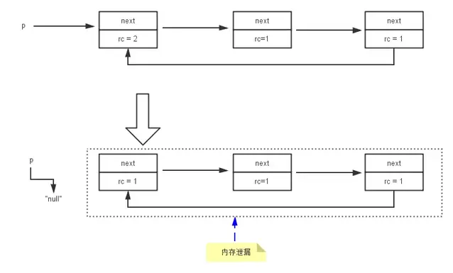
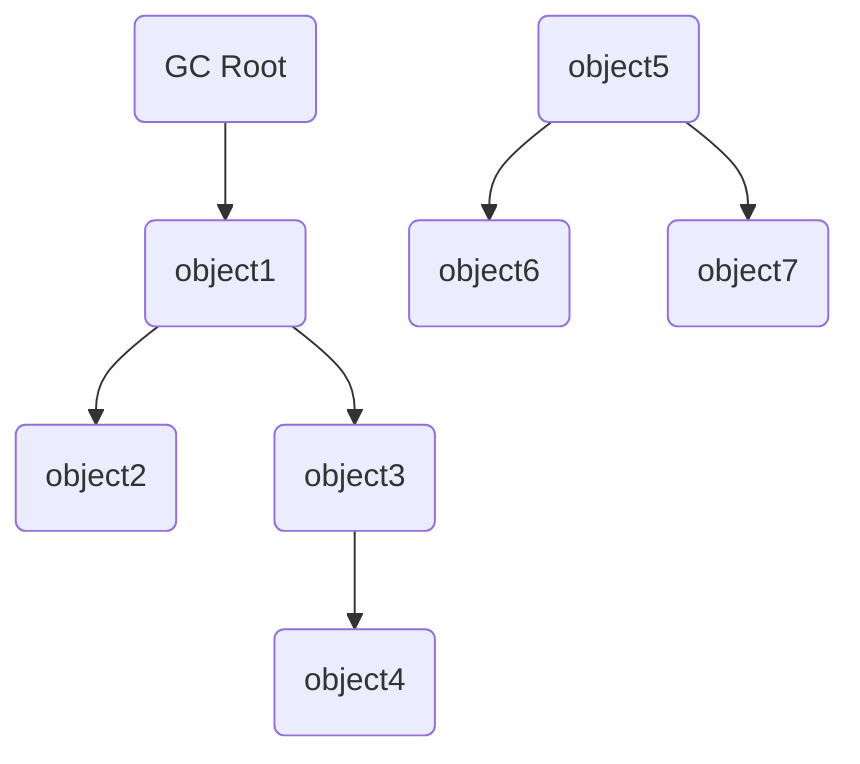

# Java虚拟机-GC简介

GC的三个问题：

1. 哪些内存需要回收？
2. 什么时候回收？
3. 如何回收？

<!--more-->

对于Java内存的各个区域，

* 程序计数器、虚拟机栈、本地方法栈这3个区域属于线程私有区域，随线程生死。虚拟机栈中的栈帧随着方法的进入和退出执行出栈，入栈操作。每个栈帧分配多少内存基本上在类结构中就可以确定，并且方法结束或线程结束时回收内存。因此这几个区域内不需要考虑回收内存。
* java堆和方法区是属于线程共享区域。只有在程序运行时才能知道创建了多少对象，内存是动态分配的，因此，我们需要考虑的是这部分内存的动态回收。

## 如何判断对象已死？

垃圾回收器在对堆进行回收时，必须先要判断对象是"生存"还是"死亡"。在学习GC之前，你首先应该记住一个单词：“stop-the-world”。Stop-the-world会在任何一种GC算法中发生。Stop-the-world意味着 JVM 因为要执行GC而停止了应用程序的执行。当Stop-the-world发生时，除了GC所需的线程以外，所有线程都处于等待状态，直到GC任务完成。

### 非"stop-the-world"的引用计数算法

引用计数算法实际上是通过在对象头中分配一个空间来保存该对象被引用的次数。如果该对象被其它对象引用，则它的引用计数加一，如果删除对该对象的引用，那么它的引用计数就减一，当该对象的引用计数为0时，那么该对象就会被回收。

比如说，当我们编写以下代码时，abc这个字符串对象的引用计数值为1.

```java
String p = new String("abc");
```

而当我们去除abc字符串对象的引用时，则abc字符串对象的引用计数减1.

```java
p = null;
```

当某对象的引用计数为0时，垃圾回收就发生了。引用计数垃圾收集机制只在引用计数变化为0时即刻发生，而且只针对某一个对象以及它所依赖的其它对象。垃圾收集的开销被分摊到整个应用程序的运行当中了，而不是在进行垃圾收集时，要挂起整个应用的运行，直到对堆中所有对象的处理都结束。

### 无法解决的问题

引用计数算法有一个比较大的问题，那就是它不能处理环形数据 - 即如果有两个对象相互引用，那么这两个对象就不能被回收，因为它们的引用计数始终为1。这也就是我们常说的“内存泄漏”问题。比如下图展示的将p变量赋值为null值后所出现的内存泄漏。



### Java 是否采用引用计数策略？

```java
public class ReferenceCountingGC {
    public Object instance = null;

    private static final int _1MB = 1024 * 1024;
    /**
     * 这个成员属性的唯一意义就是占点内存，以便能在GC日志中看清楚是否被回收过
     */
    private byte[] bigSize = new byte[2 * _1MB];

    public static void main(String[] args) {
        ReferenceCountingGC objA = new ReferenceCountingGC();
        ReferenceCountingGC objB = new ReferenceCountingGC();
        objA.instance = objB;
        objB.instance = objA;

        objA = null;
        objB = null;

        //假设在这行发生了GC，objA和ojbB是否被回收
        // 会，表示不是引用计数方式回收
        System.gc();
    }
}
```

### 分析

为了分析JVM GC，我们需要开启部分JVM Option。  
- `-verbose:gc`  -> 开启打印垃圾回收日志  
- `-XX:+PrintGCTimeStamps` -> 打印垃圾回收时间信息时的时间格式  
- `-XX:+PrintGCDetails` -> 打印垃圾回收详情

```log
0.544: [GC (System.gc()) [PSYoungGen: 6717K->464K(76288K)] 6717K->472K(251392K), 0.0013687 secs] [Times: user=0.01 sys=0.00, real=0.00 secs] 
0.545: [Full GC (System.gc()) [PSYoungGen: 464K->0K(76288K)] [ParOldGen: 8K->336K(175104K)] 472K->336K(251392K), [Metaspace: 2636K->2636K(1056768K)], 0.0040871 secs] [Times: user=0.01 sys=0.00, real=0.00 secs] 
Heap
 PSYoungGen      total 76288K, used 655K [0x000000076ab00000, 0x0000000770000000, 0x00000007c0000000)
  eden space 65536K, 1% used [0x000000076ab00000,0x000000076aba3ee8,0x000000076eb00000)
  from space 10752K, 0% used [0x000000076eb00000,0x000000076eb00000,0x000000076f580000)
  to   space 10752K, 0% used [0x000000076f580000,0x000000076f580000,0x0000000770000000)
 ParOldGen       total 175104K, used 336K [0x00000006c0000000, 0x00000006cab00000, 0x000000076ab00000)
  object space 175104K, 0% used [0x00000006c0000000,0x00000006c00540f0,0x00000006cab00000)
 Metaspace       used 2643K, capacity 4486K, committed 4864K, reserved 1056768K
  class space    used 287K, capacity 386K, committed 512K, reserved 1048576K
```

显然，从`Full GC (System.gc()) [PSYoungGen: 464K->0K(76288K)] [ParOldGen: 8K->336K(175104K)] 472K->336K(251392K)`中，可以得出结论Java回收了对象A与B，那么可以推知Java 的虚拟机没有使用引用计数策略。

### 可达性分析算法\(GC Roots Analysis\)

在主流的商用程序语言中\(Java和C#\)，都是使用可达性分析算法判断对象是否存活的。这个算法的基本思路就是通过一系列名为`GC Roots`的对象作为起始点，从这些节点开始向下搜索，搜索所走过的路径称为引用链\(Reference Chain\)，当一个对象到`GC Roots`没有任何引用链相连时，则证明此对象是不可用的，下图对象`object5`,`object6`,`object7`虽然有互相判断，但它们到`GC Roots`是不可达的，所以它们将会判定为是可回收对象。



在Java语言里，可作为GC Roots对象的包括如下几种：

* 在虚拟机栈（栈帧中的本地变量表）中引用的对象，譬如各个线程被调用的方法堆栈中使用到的参数、局部变量、临时变量等。
* 在方法区中类静态属性引用的对象，譬如Java类的引用类型静态变量。
* 在方法区中常量引用的对象，譬如字符串常量池（StringTable）里的引用。
* 在本地方法栈中JNI（即通常所说的Native方法）引用的对象。
* Java虚拟机内部的引用，如基本数据类型对应的Class对象，一些常驻的异常对象（比如NullPointExcepiton、OutOfMemoryError）等，还有系统类加载器。
* 所有被同步锁（synchronized关键字）持有的对象。
* 反映Java虚拟机内部情况的JMXBean、JVMTI中注册的回调、本地代码缓存等。

除了这些固定的GCRoots集合以外，根据用户所选用的垃圾收集器以及当前回收的内存区域不同，还可以有其他对象“临时性”地加入，共同构成完整GCRoots集合。譬如后文将会提到的分代收集和局部回收（PartialGC），如果只针对Java堆中某一块区域发起垃圾收集时（如最典型的只针对新生代的垃圾收集），必须考虑到内存区域是虚拟机自己的实现细节（在用户视角里任何内存区域都是不可见的），更不是孤立封闭的，所以某个区域里的对象完全有可能被位于堆中其他区域的对象所引用，这时候就需要将这些关联区域的对象也一并加入GCRoots集合中去，才能保证可达性分析的正确性。

### 引用

在JDK1.2版之后，Java对引用的概念进行了扩充，将引用分为强引用（StronglyReference）、软引用（SoftReference）、弱引用（WeakReference）和虚引用（PhantomReference）4种，这4种引用强度依次逐渐减弱。

### Root不可达 ≠ 非死不可

即使在可达性分析算法中不可达的对象，也并非是“非死不可”的，这时候它们暂时处于“缓刑”阶段，要真正宣告一个对象死亡，至少要经历再次标记过程。

__*标记的前提是对象在进行可达性分析后发现没有与GC Roots相连接的引用链。*__

* 第一次标记并进行一次筛选
  * 筛选的条件是此对象是否有必要执行`finalize()`方法。当对象没有覆盖`finalize()`方法，或者`finzlize()`方法已经被虚拟机调用过，虚拟机将这两种情况都视为“没有必要执行”，对象直接被回收。

* 第二次标记
  * 如果这个对象被判定为有必要执行`finalize()`方法，那么这个对象将会被放置在一个名为：F-Queue的队列之中，并在稍后由一条虚拟机自动建立的、低优先级的Finalizer线程去执行。这里所谓的“执行”是指虚拟机会触发这个方法，但并不承诺会等待它运行结束。这样做的原因是，如果一个对象`finalize()`方法中执行缓慢，或者发生死循环（更极端的情况），将很可能会导致F-Queue队列中的其他对象永久处于等待状态，甚至导致整个内存回收系统崩溃。
  * `Finalize()`方法是对象脱逃死亡命运的最后一次机会，稍后GC将对F-Queue中的对象进行第二次小规模标记，如果对象要在`finalize()`中成功拯救自己----只要重新与引用链上的任何的一个对象建立关联即可，譬如把自己赋值给某个类变量或对象的成员变量，那在第二次标记时它将移除出“即将回收”的集合。如果对象这时候还没逃脱，那基本上它就真的被回收了。

```java
/**
 * 摘自 深入理解Java虚拟机 第3章
 * 1、对象可以在被GC时自我拯救
 * 2、这种自救的机会只有一次，因为一个对象的finalize()方法最多只能被系统自动调用一次。
 */
public class FinalizeEscapeGC {
    public static FinalizeEscapeGC SAVE_HOOK = null;

    public void isAlive() {
        System.out.println("yes, I am still alive");
    }

    protected void finalize() throws Throwable {
        super.finalize();
        System.out.println("finalize method executed!");
        FinalizeEscapeGC.SAVE_HOOK = this;
    }

    public static void main(String[] args) throws InterruptedException {
        SAVE_HOOK = new FinalizeEscapeGC();

        //对象第一次成功拯救自己
        SAVE_HOOK = null;
        System.gc();

        //因为finalize方法优先级很低，所有暂停0.5秒以等待它
        Thread.sleep(500);
        if (SAVE_HOOK != null) {
            SAVE_HOOK.isAlive();
        } else {
            System.out.println("no ,I am dead QAQ!");
        }

        //-----------------------
        //以上代码与上面的完全相同,但这次自救却失败了！！！
        SAVE_HOOK = null;
        System.gc();

        //因为finalize方法优先级很低，所有暂停0.5秒以等待它
        Thread.sleep(500);
        if (SAVE_HOOK != null) {
            SAVE_HOOK.isAlive();
        } else {
            System.out.println("no ,I am dead QAQ!");
        }
    }
}
// --------------- output -----------------
// finalize method executed!
// yes, I am still alive
// no, I am dead QAQ!
 
```

## 方法区的回收

相比于堆中的垃圾回收，方法区\(或者HotSpot虚拟机中的永久代\)的垃圾回收效率较低。Java虚拟机规范也说过可以不要求在虚拟机方法区中实现垃圾回收。

方法区的垃圾回收主要集中在两个部分：废弃常量和无用的类。

### 废弃常量

回收废弃常量与回收Java堆中的对象很相似。如果没有任何对象引用常量池中常量，GC时如果需要，JVM会把该常量从池中清除。

举个常量池中字面量回收的例子，假如一个字符串“java”曾经进入常量池中，但是当前系统又没有任何一个字符串对象的值是“java”，换句话说，已经没有任何字符串对象引用常量池中的“java”常量，且虚拟机中也没有其他地方引用这个字面量。如果在这时发生内存回收，而且垃圾收集器判断确有必要的话，这个“java”常量就将会被系统清理出常量池。常量池中其他类（接口）、方法、字段的符号引用也与此类似。

### 无用的类

1. 该类所有实例已被回收。
2. 加载类的ClassLoader已被回收。
3. 该类对应的Class对象没有被引用，无法在任何地方通过反射访问该类的方法。

如果同时满足上面3个条件，JVM就可以对无用类进行回收。

### JVM 参数

- 是否对类回收
  - `-Xnoclassgc`
- 查看类加载和卸载信息
  - `-verbose:class`
  - `-XX:+TraceClassLoading`
  - `-XX:+TraceClassUnLoading`

Java虚拟机被允许对满足上述三个条件的无用类进行回收，这里说的仅仅是“被允许”，而并不是和对象一样，没有引用了就必然会回收。关于是否要对类型进行回收，HotSpot虚拟机提供了Xnoclassgc参数进行控制，还可以使用`verbose:class`以及`XX:+TraceClassLoading`,`XX:+TraceClassUnLoading`查看类加载和卸载信息，其中`verbose:class`和`XX:+TraceClassLoading`可以在Product版的虚拟机中使用，`XX:+TraceClassUnLoading`参数需要FastDebug版的虚拟机支持。

在大量使用反射、动态代理、CGLib等字节码框架，动态生成JSP以及OSGi这类频繁自定义类加载器的场景中，通常都需要Java虚拟机具备类型卸载的能力，以保证不会对方法区造成过大的内存压力。

## 何时触发GC?

针对HotSpot VM的实现，它里面的GC其实准确分类只有两大种：

* Partial GC：并不收集整个GC堆的模式
    * Young GC：只收集young gen的GC
    * Old GC：只收集old gen的GC。只有CMS的concurrent collection是这个模式
    * Mixed GC：收集整个young gen以及部分old gen的GC。只有G1有这个模式
* Full GC：收集整个堆，包括young gen、old gen、perm gen（如果存在的话）等所有部分的模式。

Major GC通常是跟full GC是等价的，收集整个GC堆。但因为HotSpot VM发展了这么多年，外界对各种名词的解读已经完全混乱了，当有人说“major GC”的时候一定要问清楚他想要指的是上面的full GC还是old GC。

最简单的分代式GC策略，按HotSpot VM的serial GC的实现来看，触发条件是：

* young GC：当young gen中的eden区分配满的时候触发。注意young GC中有部分存活对象会晋升到old gen，所以young GC后old gen的占用量通常会有所升高。
* full GC：当准备要触发一次young GC时，如果发现统计数据说之前young GC的平均晋升大小比目前old gen剩余的空间大，则不会触发young GC而是转为触发full GC（因为HotSpot VM的GC里，除了CMS的concurrent collection之外，其它能收集old gen的GC都会同时收集整个GC堆，包括young gen，所以不需要事先触发一次单独的young GC）
* 如果有perm gen的话，要在perm gen分配空间但已经没有足够空间时，也要触发一次full GC
* System.gc()、heap dump带GC，默认也是触发full GC。

