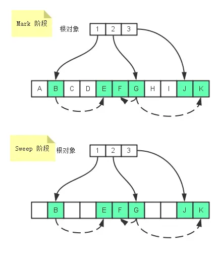
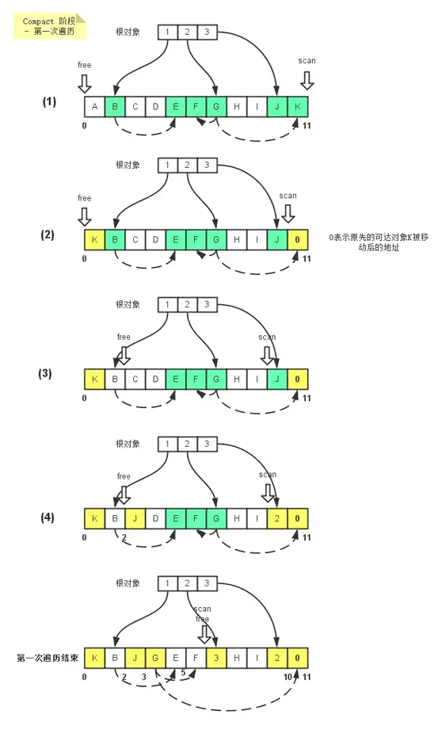
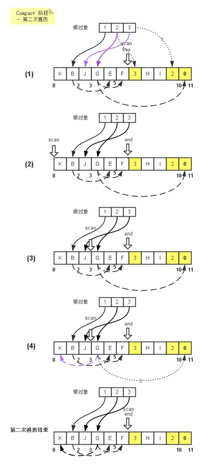
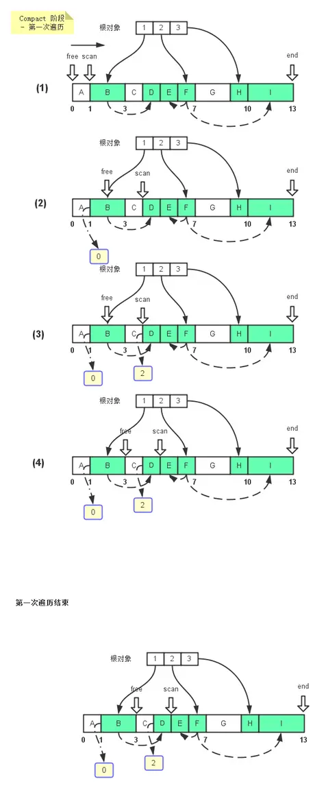

# Java虚拟机-GC算法简介

在了解垃圾回收算法前，我们先要了解几个基本概念。

首先是mutator和collector，这两个名词经常在垃圾收集算法中出现，collector指的就是垃圾收集器，而mutator是指除了垃圾收集器之外的部分，比如说我们应用程序本身。mutator的职责一般是NEW\(分配内存\),READ\(从内存中读取内容\),WRITE\(将内容写入内存\)，而collector则就是回收不再使用的内存来供mutator进行NEW操作的使用。

第二个基本概念是关于mutator roots\(mutator根对象\),mutator根对象一般指的是分配在堆内存之外，可以直接被mutator直接访问到的对象，一般是指静态/全局变量以及Thread-Local变量\(在Java中，存储在java.lang.ThreadLocal中的变量和分配在栈上的变量,方法内部的临时变量等都属于此类\).

第三个基本概念是关于可达对象的定义，从mutator根对象开始进行遍历，可以被访问到的对象都称为是可达对象。这些对象也是mutator\(你的应用程序\)正在使用的对象。

<!--more-->

## 标记-清除算法

最基础的收集算法是标记-清除算法\(mark-sweep\)，顾名思义，标记-清除算法分为两个阶段，标记\(mark\)和清除\(sweep\)。

* 在标记阶段，遍历所有的`GC Roots`，然后将所有`GC Roots`可达的对象标记为存活的对象。一般是在对象的header中，将其记录为可达对象。
* 在清除阶段，对堆内存(heap memory)从头到尾进行线性的遍历，如果发现某个对象没有标记为可达对象\(通过读取对象的header信息\)，就将其回收.

上图我们可以看到，在Mark阶段，从根对象1可以访问到B对象，从B对象又可以访问到E对象，所以B,E对象都是可达的。同理，F,G,J,K也都是可达对象。到了Sweep阶段，所有非可达对象都会被回收。同时，在进行标记和清除阶段时会将整个应用程序暂停，等待标记清除结束后才会恢复应用程序的运行。

### 缺点

标记-清除算法的不足主要有两个：

1. 标记和清除这两个过程的效率不高。
2. 标记清楚后会产生大量不连续的内存碎片，当空间碎片太多时，可能会导致分配较大对象时，无法找到足够的连续内存，从而需要再次触发垃圾收集动作。

## 半区复制算法

为了提高回收效率，半区复制算法出现了。之所以叫半区复制，是因为它将堆内存对半分为两个半区，只用其中一个半区来进行对象内存的分配，如果在这个半区内存不够给新的对象分配了，那么就开始进行垃圾收集，将这个半区中的所有可达对象都拷贝到另外一个半区中去，然后继续在另外那个半区进行新对象的内存分配。

### 三色抽象法

在我们深入半区复制算法原理前，我们需要了解下什么是三色抽象法。对于一个对象，垃圾收集器可以将其标记为灰色，黑色和白色中的一种，每种颜色代表不同的含义，

* 灰色 - 表示垃圾收集器已经访问过该对象，但是还没有访问过它的所有孩子节点。
* 黑色 - 表示该对象以及它的所有孩子节点都已经被垃圾收集器访问过了。
* 白色 - 表示该对象从来没有被垃圾收集器访问过，这就是非可达对象。
* 
三色抽象法也可以用在标记-清除算法。当垃圾收集结束后，可达对象都被标记为黑色，非可达对象都被标记为白色，不会有灰色对象存在。在半区复制算法里，我们也采用了三色抽象法来标记对象。

### 算法原理

实际上半区复制算法的实现跟标记-压缩算法的实现差不多， 都是采用的深度遍历算法：

__*我们假设A,B对象是根对象。*__

1. 首先先交换左右半区\(ToSpace, FromSpace\), 同时设置free指针和top指针。
2. 遍历处理根对象A,B。先将A对象复制到free指针指向的位置，同时将A对象复制后的地址\(迁移地址\)写到原先A对象所在的位置，图中虚线的箭头表示。可以看到A对象已经被collector访问过了，但是还没有访问其孩子节点，所以将其标为了灰色。紧接着scan，free指针继续向前移动。
3. 由于是深度遍历算法，紧接collector会先遍历处理A对象所引用的对象C，当发现对象C没有迁移地址时，说明它还没有被复制，由于它又是可达对象，所以接着collector会将它复制到当前free指针指向的位置，即对象A后面。对象C复制完后，会用其复制后的地址来更新A原先对C的引用，同时也写到原先C对象所在的地址上。
4. 接着collector会处理对象C的孩子节点\(深度遍历算法\)，由于对象C没有引用任何对象，于是对象C的处理结束，将其标记为黑色。然后collector接着处理A对象的另外一个孩子节点E对象，处理方式跟处理对象C一致。
5. 对象E也没有孩子节点，collector也将其标识为黑色。
6. 到目前为此，A对象也全部处理结束了，于是collector将其标识为黑色，然后接着去处理对象B。当复制B对象结束后，发现B对象所引用的对象C有迁移地址，于是就更新其对对象C的引用，使其指向FromSpace半区中对象C的迁移地址,即C对象复制后所在ToSpace的地址。这个情况下就不需要再次复制对象C了。
7. 当所有的可达对象都从FromSpace半区复制到ToSpace半区后，垃圾收集结束。新对象的内存分配从free指针指向的位置开始进行分配。
从垃圾收集过程中对象的移动顺序来看，collector将相邻的对象都复制在相近的位置上。

### 缺点

复制算法主要的缺点，就是相比于标记-清除和标记-压缩垃圾回收器，它的可用堆内存减少了一半。同时对于大对象，复制比标记的代价更大。所以半区复制算法更一般适合回收小的，存活期短的对象。

因此，目前大多数商业虚拟机都采用这种收集算法来回收新生代，由于新生代的对象98%都是"朝生夕死"，所以实际上并不是按照1:1划分内存，Hotspot虚拟机的策略是:

1. 将内存分为一块较大的Eden空间和两块较小的Survivor空间，每次使用Eden和一块Survivor。
2. 回收时，将Eden空间和Survivor中还存活的对象一次性复制到另一个Survivor空间里，清理掉Eden和Survivor。

> Hotspot默认Eden和Survivor的大小比例是8:1。当Survivor的空间不够时，需要依赖其他内存\(老年代\)进行分配担保\(对象进入老年代\)。 

## 标记-压缩算法

复制算法在对象存活率较高时，会进行大量的复制操作，降低效率。此外一旦比例大于1:1，就需要额外的空间进行分配担保。

### 算法原理

标记-压缩算法分为两个阶段，一个是标记(mark)，一个是压缩(compact)。其中标记阶段跟标记-清除算法中的标记阶段是一样的。

而对于压缩阶段，它的工作就是移动所有的可达对象到堆内存的同一个区域中，使他们紧凑的排列在一起，从而将所有非可达对象释放出来的空闲内存都集中在一起，通过这样的方式来达到减少内存碎片的目的。在压缩阶段，由于要移动可达对象，那么需要考虑移动对象时的顺序，一般分为下面三种：

* 任意顺序 - 即不考虑原先对象的排列顺序，也不考虑对象间的引用关系，随意的移动可达对象，这样可能会有内存访问的局部性问题。
* 线性顺序 - 在重新排列对象时，会考虑对象间的引用关系，比如A对象引用了B对象，那么就会尽可能的将A，B对象排列在一起。
* 滑动顺序 - 顾名思义，就是在重新排列对象时，将对象按照原先堆内存中的排列顺序滑动到堆的一端。

现在大多数的垃圾收集算法都是按照任意顺序或滑动顺序去实现的。下面我们分别来看下它们各自的算法原理。

### Two-Finger 算法

Two-Finger算法来自Edwards, 它在压缩阶段移动对象时是任意顺序移动的，它最适用于处理包含 __*固定大小对象*__的内存区域。由于Mark阶段都是跟标记-清除算法一致的，这里我们只关注Compact阶段。

Two-Finger算法是一个Two Passes算法，即需要遍历堆内存两次，第一次遍历是将堆末尾的可达对象移动到堆开始的空闲内存单元去，第二次遍历则需要修改可达对象的引用，因为一些可达对象已经被移动到别的地址，而原先引用它们的对象还指向着它们移动前的地址。

在这两次遍历过程中，首尾两个指针分别从堆的头尾两个位置向中间移动，直至两个指针相遇，由于它们的运动轨迹酷似两根手指向中间移动的轨迹，因此称为Two Finger算法。

#### 第一次遍历

第一次遍历的原理是，头指针\(free\)沿着堆头向堆尾前进，直到找到一个空闲的内存单元\(即没有被标记为可达对象的内存单元\)，如遇到可达对象，则清除其标记。接着尾指针\(scan\)从堆尾向堆头方向前进，直到找到一个被标记为可达的内存单元。最后，collector将可达对象从尾指针\(scan)指向的位置移动到头指针(free)指向的位置，最后将可达对象移动后的位置(当前free指针指向的位置)写到原先可达对象处于的位置(当前尾指针scan指向的位置), 为下一次的遍历 - 更新对象相互间的引用做好准备。注：当移动可达对象时，其引用的对象在可达对象移动后保持不变，如下图中的G对象移动后依然指向位置5和位置10。

#### 第二次遍历

第二次的遍历是为了更新引用关系，一个可达对象可以被其他对象引用，比如上图中的K对象，如果其被移动后，引用它的对象比如说G并不知道它被移动了，那么这第二次的遍历就是为了告诉G它所引用的对象K已经被移动到新的位置上去了，它需要更新它对K的引用。

第二次遍历，collector先会对根对象进行遍历，比如根对象2引用着位置6的内存单元，根据算法，该位置大于等于end指针所指向的位置 - 即第一次遍历free指针和scan指针相遇的位置，那么我们就认为这个位置的对象已经被移动，需要更新根对象2的引用关系，即从引用位置6改为引用位置3(位置6的内存单元中记录着该对象被移动后的新位置)。同理，在移动G对象的时候，也是要判断看G所引用的内存单元位置是否大于end指针指向的位置，如果小于，则不处理。否则则修改G的引用关系。

### LISP2 算法

Lisp2算法是一种应用更为广泛的压缩算法，它属于滑动顺序算法中的一种。它跟Two-Finger算法的不同还在于它可以处理不同大小的对象，而不再是固定大小的对象。同时，计算出来的可达对象的迁移地址需要额外的空间进行存储而不再是复写原先对象所在的位置。最后，Lips2算法需要进行3次堆内存的遍历。

#### 第一次遍历

第一次遍历，collecor仅仅是计算和记录可达对象应该迁移去的地址。

1. 指针free,scan同时指向堆起始位置，同时scan指针向堆尾移动，目的是要找到被标记的可达对象。
2. 找到可达对象后，在scan指针对应的位置分配一个额外的空间来存储该可达对象应该迁移到的地址 - 就是free指针指向的位置0，同时free指针向堆尾移动B对象大小的距离- free'指针指向的位置。最后scan指针继续往前走，直到寻找到下一个可达对象D - scan'指针指向的位置。
3. 同理，在可达对象D处分配一块空间来保存对象D应该迁移到的位置，由于B对象已经占用了2个内存单元，所以对象E的迁移地址是从位置2开始，也就是当前free指针指向的位置。
4. 指针free，scan继续向前移动。
5. 第一次遍历完后，所有的可达对象都有了对应的迁移地址，free指针指向位置9，因为所有的可达对象总共占了9个单元大小的空间\(B+D+E+F+H+I\)。

#### 第二次遍历

第二次遍历主要是修改对象间的引用关系，基本跟Two Finger算法的第二次遍历一样。

1. 修改根对象的引用关系，根对象1引用对象B，对象B的迁移地址为0，于是collector将根对象对B对象的引用指向它的迁移地址 - 位置0， 现在A对象所处的位置。
2. 同理，对于根对象2，3都执行同样的操作，将它们对其所引用的对象的引用修改为对应的它们所引用的对象的迁移地址。
3. 通过scan指针遍历堆内存，更新所有的可达对象对其引用对象的引用为其引用对象的迁移地址。比如说，对于可达对象B， 它引用了对象D，D的迁移地址是2，那么B直接将其对D对象的引用重新指向2这个位置。
4. 第二次遍历结束后的对象之间的引用关系。

#### 第三次遍历

第三次遍历则是根据可达对象的迁移地址去移动可达对象，比如说可达对象B，它的迁移地址是0，那么就将其移动到位置0，同时去除可达对象的标记，以便下次垃圾收集。

所有可达对象移动结束后，内存单元展示为：

### 缺点

标记-压缩算法虽然缓解的内存碎片问题，但是它也引用了额外的开销，比如说额外的空间来保存迁移地址，需要遍历多次堆内存等。

## 分代收集算法

当前的商业虚拟机的垃圾收集都采取了分代回收算法。分代回收算法，实质是一套符合大多数程序运行实际情况的经验法则，它建立在两个分代假说之上：

* 弱分代假说(WeakGenerationalHypothesis):绝大多数对象都是朝生夕灭的。
* 强分代假说(StrongGenerationalHypothesis):熬过越多次垃圾收集过程的对象就越难以消亡。

这两个分代假说共同奠定了多款常用的垃圾收集器的一致的设计原则：收集器应该将Java堆划分出不同的区域，然后将回收对象依据其年龄（年龄即对象熬过垃圾收集过程的次数）分配到不同的区域之中存储。显而易见，如果一个区域中大多数对象都是朝生夕灭，难以熬过垃圾收集过程的话，那么把它们集中放在一起，每次回收时只关注如何保留少量存活而不是去标记那些大量将要被回收的对象，就能以较低代价回收到大量的空间；如果剩下的都是难以消亡的对象，那把它们集中放在一块，虚拟机便可以使用较低的频率来回收这个区域，这就同时兼顾了垃圾收集的时间开销和内存的空间有效利用。

在Java堆划分出不同的区域之后，垃圾收集器才可以每次只回收其中某一个或者某些部分的区域——因而才有了“MinorGC”“MajorGC”“FullGC”这样的回收类型的划分；也才能够针对不同的区域安排与里面存储对象存亡特征相匹配的垃圾收集算法——因而发展出了“标记复制算法”“标记清除算法”“标记整理算法”等针对性的垃圾收集算法。

分代收集并非只是简单划分一下内存区域那么容易，它至少存在一个明显的困难：对象不是孤立的，对象之间会存在跨代引用。假如要现在进行一次只局限于新生代区域内的收集（MinorGC），但新生代中的对象是完全有可能被老年代所引用的，为了找出该区域中的存活对象，不得不在固定的GCRoots之外，再额外遍历整个老年代中所有对象来确保可达性分析结果的正确性，反过来也是一样。遍历整个老年代所有对象的方案虽然理论上可行，但无疑会为内存回收带来很大的性能负担。为了解决这个问题，就需要对分代收集理论添加第三条经验法则:

* 跨代引用假说(IntergenerationalReferenceHypothesis):跨代引用相对于同代引用来说仅占极少数。

依据这条假说，我们就不应再为了少量的跨代引用去扫描整个老年代，也不必浪费空间专门记录每一个对象是否存在及存在哪些跨代引用，只需在新生代上建立一个全局的数据结构（该结构被称为“记忆集”，RememberedSet），这个结构把老年代划分成若干小块，标识出老年代的哪一块内存会存在跨代引用。此后当发生MinorGC时，只有包含了跨代引用的小块内存里的对象才会被加入到GCRoots进行扫描。虽然这种方法需要在对象改变引用关系（如将自己或者某个属性赋值）时维护记录数据的正确性，会增加一些运行时的开销，但比起收集时扫描整个老年代来说仍然是划算的。

分代回收的名词:

* 部分收集（PartialGC）：指目标不是完整收集整个Java堆的垃圾收集，其中又分为：
  * 新生代收集（MinorGC/YoungGC）：指目标只是新生代的垃圾收集。
  * 老年代收集（MajorGC/OldGC）：指目标只是老年代的垃圾收集。目前只有CMS收集器会有单独收集老年代的行为。另外请注意“MajorGC”这个说法现在有点混淆，在不同资料上常有不同所指，读者需按上下文区分到底是指老年代的收集还是整堆收集。
  * 混合收集（MixedGC）：指目标是收集整个新生代以及部分老年代的垃圾收集。目前只有G1收集器会有这种行为。
* 整堆收集（FullGC）：收集整个Java堆和方法区的垃圾收集。

分代收集理论也有其缺陷，最新出现(或在实验中)的几款垃圾收集器都展现出了面向全区域收集设计的思想。

