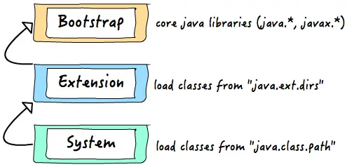
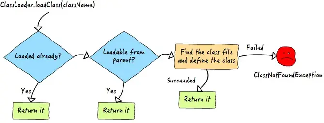

# Java 类加载

在java代码中，类型的加载，连接与初始化过程都是在程序运行期间完成的（类class文件信息在编译期间已经确定好）。


类从被加载到虚拟机内存中开始，到卸载出内存为止，它的整个生命周期包括：加载`Loading`、验证`Verification`、准备`Preparation`、解析`Resolution`、初始化`Initialization`、使用`Using`和卸载`Unloading`7个阶段。其中准备、验证、解析3个部分统称为连接`Linking`。

加载、验证、准备、初始化和卸载这5个阶段的顺序是确定的，类的加载过程必须按照这种顺序按部就班地开始，而解析阶段则不一定：它在某些情况下可以在初始化阶段之后再开始，这是为了支持Java语言的运行时绑定\(也称为动态绑定或晚期绑定\)。

>注意，本文的JDK版本是Java 1.8，在Java 9 引进模块化后，ClassLoader也有了一些新变化。

<!--more-->

## 何时类加载

什么时候开始加载？Java 虚拟机规范中没有进行强制约束，这点可以交由虚拟机自行把握。

但是对于初始化阶段，虚拟机规范定义了有且只有5种情况需要对类进行初始化。这5种行为被称为主动引用。

1. 使用new、getstatic、putstatic和invokestatic这4条字节码指令时，如果类没有进行初始化，需要先初始化。对应的代码场景是:使用new实例化对象时、读取或设置类的静态字段\(被final修饰，在编译期把结果放入常量池的静态字段除外\)和调用类的静态方法时。
2. 使用java.lang.reflect包下方法对类进行反射时，如果类没有进行过初始化，先初始化。
3. 初始化一个类时，如果其父类还没有进行过初始化，先初始化其父类。
4. 当虚拟机启动时，用户需要指定一个执行的主类，虚拟机会先初始化这个主类。
5. 当使用JDK1.7的动态语言支持时，如果一个java.lang.invoke.MethodHandle实例的解析结果为REF\_getStatic、REF\_invokeStatic的方法句柄，并且这个方法句柄对应的类没有初始化，则对其初始化。

除了这5种行为，其他的引用类的方式都被称为被动引用。

* 通过子类引用父类的静态字段，不会导致子类初始化。

  ```java
    public class SuperClass{
      public static int value;
    }
    public class SubClass extends SuperClass{}
    public class test{
      public static void main(String[] args){
        System.out.println(SubClass.value);
        // 没有输出
      }
    }
  ```

* 通过数组定义来引用类，不会触发类的初始化。

  ```java
    public class test{
      public static void main(String[] args){
        SuperClass superclass = new SuperClass[10];
        // superclass 的类型是 [LSuperClass ,有虚拟机生成的数组Class
        // 没有输出
      }
    }
  ```

* 常量会在编译期存入常量池，不会触发定义常量的类的初始化。

  ```java
    public class ConstantClass{
      public static final String hello = "hello";
    }
    public class Test{
      public static void main(String[] args){
        System.out.println(ConstantClass.hello);
      }
    }
  ```

编译期已经把ConstantClass.hello 转化为test类的常量池中常量, 所以此处的字节码是直接从 Test class 的常量池中取出，[不会加载ConstantClass](https://github.com/chutian0610/code-lab/tree/main/demos/jdk-lab/src/main/java/info/victorchu/jdk/lab/usage/type/classload/demos/TestClassLoad.java). 如果将 hello 定义成 `UUID.randomUUID().toString()`, 当一个常量的值并非编译期间可以确定的,那么其值就不会被放到调用类的常量池当中，这时在程序运行时,会导致主动使用这个常量所在的类,显然会导致这个类被初始化。

* 接口也有初始化过程，接口与类的区别仅在第3种情况: 接口初始化是，并不要求其父接口全部完成初始化，可以懒加载。

```java
public class Test5 {
    public static void main(String[] args) {
        System.out.println(ChildInterface.b);
    }
}

interface ParentInterface{
    public static final int a = 5;
}

interface ChildInterface extends ParentInterface{
    public static int b = new Random().nextInt(4);
}
```

JVM 日志验证:使用`-XX:+TraceClassLoading` 或者是 `-verbose:class` 命令行选项开启查看类加载信息的功能。

## 加载动作

加载是查找具有特定名称的类或接口类型的二进制表示并从该二进制表示创建类或接口的过程。在加载阶段，虚拟机需要完成以下3件事情：

1. 通过一个类的全限定名来获取定义此类的二进制字节流；
2. 将这个字节流所代表的静态存储结构转化为方法区的运行时数据结构；
3. 在内存中生成一个代表这个类的java.lang.Class对象，作为方法区这个类的各种数据的访问入口；

首先要说明的是Java获取类的二进制流有多种方式：

1. 从Zip包中读取，例如 JAR，WAR，EAR等格式。
2. 从网络中获取，例如Applet。
3. 运行时动态生成，例如Java的动态代理。
4. 其他文件生成，例如JSP生成对应的Class类。
5. ... ...

值得一提的是，对于非数组类，加载阶段是通过类加载器来实现的\(可以是系统提供的引导类加载器，也可以是自定义的类加载器\);而数组类并不通过类加载器加载，它是由JVM直接创建的。当然，数组类的元素类型\(数组去掉所有维度的类型\)还是要靠类加载器加载。

数组类的创建遵循以下原则:

1. 如果数组的组件类型\(数组去掉一个维度的类型\)是引用类型，那么就采用类加载器去加载这个组件类型，数组将会在加载组件类型的类加载器的类名空间上被标识。
2. 如果数组的组件类型不是引用类型，如int\[\],那么Java虚拟机会把数组标记为与引导类加载器关联。
3. 数组类的可见性与它的组件类型可见性一致，如果组件类型不是引用类型，那么数组类的可见性默认为Public。

加载阶段完成后，虚拟机外部的二进制字节流就按照虚拟机所需的格式存储在方法区之中，方法区的数据存储格式由虚拟机自行定义实现，虚拟机规范未规定具体数据结构。然后在内存中实例化一个java.lang.Class类的对象\(未规定存储在java堆中，hotspot虚拟机将Class对象存储在方法区。\)

> 注意, 加载阶段和连接阶段的部分内容是交叉进行的，加载尚未完成时，连接阶段可能已经开始了。

### 验证

验证是连接的第一步。这一阶段的目的是保证 class 文件符合虚拟机规范。[java 虚拟机规范](https://docs.oracle.com/javase/specs/jvms/se8/html/jvms-4.html#jvms-4.10)对 class 文件验证给出了一些建议:

Java虚拟机实现可以使用两种策略进行验证：

* 必须使用类型检查进行验证来验证class版本号大于或等于50.0的文件(JDK 1.6及之后)。
* 所有Java虚拟机实现都必须支持通过类型推断进行验证，以验证class版本号小于50.0的文件，但那些符合Java ME CLDC和Java Card配置文件的实现除外。

1.6 之后的jvm 进行了优化，在 方法体的code属性的属性表中增加了名为 StackMapTable 的属性，这项属性描述了方法体中所有基本块(按控制流拆分的代码块)开始时，本地变量表和操作栈应有的状态。在字节码验证阶段，就不需要根据程序推导这些状态的合法性，只需要检查StackMapTable中记录是否合法。

具体的验证实现，此处就不赘述了，可以通过上面的链接查看。

### 准备

准备工作包括为类或接口创建静态字段，并将这些字段初始化为其类型默认值。在通常情况下，静态字段在准备阶段是默认值，但是，如果字段的属性表中有 ConstantValue 属性，那么在准备阶段变量就还会被初始化成ConstantValue 属性所指定的值。

```java
public static int value = 123;         // 0
public static final int value = 123;  // 123
// final 修饰的值在class 中有 ConstantValue
```

初始默认值如下:

|type|value|
|:---|:---|
|int|0|
|long|0L|
|short|(short)0|
|char|'\u0000'|
|boolean|false|
|float|0.0f|
|double|0.0d|
|reference|null|

### 解析

在前面的 JVM 内存介绍中有提到过运行时常量池，Java虚拟机为每个类型维护一个常量池，这是一种运行时数据结构，它的很多功能类似于符号表。

class 文件中的constant_pool 表用于在类或接口创建时构造[运行时常量池](https://docs.oracle.com/javase/specs/jvms/se8/html/jvms-5.html#jvms-5.1)，运行时常量池中的所有引用最初都是符号的。运行时常量池中的符号引用是从class中派生的。

解析阶段是虚拟机将常量池中的符号引用换成直接引用的过程。

* 符号引用: 符号引用使用一组符号来描述所引用目标，符号可以是任何形式的字面量，只要使用时能无歧义的定位到目标即可。符号引用和虚拟机内存无关，其字面量明确定义在class 文件中。
* 直接引用: 直接引用可以是直接指向目标的指针，相对偏移量或是一个能间接定位目标的句柄。直接引用和虚拟机的内存布局相关，同一符号引用在不同虚拟机实例上的直接引用一般不会相同，有直接引用,说明对象已在内存中。

虚拟机规范未规定解析的发生时间，只要求在执行 anewarray, checkcast, getfield, getstatic, instanceof, invokedynamic, invokeinterface, invokespecial, invokestatic, invokevirtual, ldc, ldc_w, multianewarray, new, putfield, 和putstatic这些用于操作符号引用的指令之前，先对符号引用进行解析。

对同一个符号引用进行多次解析，是很常见的事情。除了 invokedynamic 指令外，虚拟机实现可以对第一次解析的结果进行缓存，在运行时常量池记录直接引用，并把常量标识为已解析状态。这样可以避免多次重复解析。

对于 invokedynamic指令，因为该指令是用于动态语言支持的,所以，只有当程序执行到这的时候，解析动作才能进行。

### 初始化

类的初始化是类加载的最后一步。在准备阶段，静态变量已经赋过初始值。而在初始化阶段，则根据代码中的逻辑去初始化，初始化阶段是执行类构造器`<cinit>()`方法的过程。

* `<cinit>()`方法是编译器自动收集类中所有静态变量赋值和 static 代码块合并而成。编译器收集的顺序是在源文件中出现顺序。
* `<cinit>()`方法与类的构造方法`<init>()`不同，不需要显式调用父类的构造器，虚拟机会保证子类的`<cinit>()`方法执行前，已经执行了父类的`<cinit>()`方法。
* 执行接口中的`<cinit>()`方法，不需要先执行父接口的`<cinit>()`方法，只有使用父接口的静态变量时，才会执行`<cinit>()`方法。
* 接口的实现类，在初始化时，不需要执行接口的`<cinit>()`方法。
* `<cinit>()`方法对于类或接口不是必须的，如果一个类中没有静态变量，编译器可以不生成`<cinit>()`方法。
* 虚拟机会保证多线程环境下，`<cinit>()`方法被正确地加锁，同步。如果有多个线程同时去初始化一个类，那么只有一个线程会执行`<cinit>()`方法，其它的线程都会被阻塞。直到类的构造器执行完毕。(单例模式的实现方案之一)

代码示例见[Java 对象启动顺序](../1f719186/index.html)

## 类加载器

类加载器的设计目的是，通过一个类的全限定名来获取定义此类的二进制字节流。但在 Java 程序中的作用并不仅局限于类的加载-初始化阶段。对于任意一个类，都需要由加载它的类加载器和这个类本身一同才能确定其在 JVM 中的一致性，也就是说: 比较两个类是否"相等"，只有在这两个类是同一个类加载器的前提下才有意义，否则即使两个类来自同一个class 文件，被同一个虚拟机加载，若加载的类加载器不同，这两个类就不同。

这里的相等包括Class对象的equals()方法，isAssignableFrom()方法，isInstance()方法的返回结果,也包括 instanceof 关键字的返回结果。



如上图所示，java 提供了3种类加载器:

* Bootstrap ClassLoader: 启动类加载器，这个加载器负责加载`$JAVAHOME/jre/lib`下的，或是被`-Xbootclasspath`参数所指定的路径下的类库加载到虚拟机内存。用户在编写自定义加载器时，如果想把加载请求指派给启动类加载器，可以直接使用 null 代替。这个类加载器是使用 C++ 语言实现的。
* Extension ClassLoader: 扩展类加载器,这个加载器由 `sun.misc.Launcher$ExtClassLoader`实现，这个加载器负责加载`$JAVAHOME/jre/lib/ext`下的,或是被`java.ext.dirs`变量所指定的路径下的所有类库。
* Application ClassLoader: 应用程序类加载器,这个加载器由 `sun.misc.Launcher$AppClassLoader`实现，这个类加载器是ClassLoader中的 getSystemClassLoader()方法的返回值，负则加载 ClassPath上所指定的类库，一般是程序中默认的加载器。

像图中的类加载器之间的关系，也被称为双亲委派模型。双亲委派模型要求除了顶层的启动类加载器之外，其余的类加载器都要有自己的父加载器，这里的父子关系，一般不是通过继承，而是通过组合实现的。

```java
package java.lang;
public abstract class ClassLoader {
    // The parent class loader for delegation
    // Note: VM hardcoded the offset of this field, thus all new fields
    // must be added *after* it.
    private final ClassLoader parent;
    // ... ...
}
// ClassLoader的继承关系
// java.lang.ClassLoader
//     -> java.security.SecureClassLoader
//         -> java.net.URLClassLoader
//             -> sun.misc.Launcher$ExtClassLoader
//             -> sun.misc.Launcher$AppClassLoader
```

一个类加载器查找class和resource时，是通过“委托模式”进行的：它首先判断这个class是不是已经加载成功，如果没有的话它并不是自己进行查找，而是先通过父加载器，然后递归下去，直到Bootstrap ClassLoader，如果Bootstrap classloader找到了，直接返回，如果没有找到，则一级一级返回，最后到达自身去查找这些对象。这种机制就叫做双亲委托。


## 类卸载

当某个类被加载、连接和初始化后，它的生命周期就开始了。当代表某个类的Class对象不再被引用，即不可触及（没有引用指向）时，Class对象就会结束生命周期，某个类在方法区内的数据也会被卸载，从而结束类的生命周期。

一个类何时结束生命周期，取决于代表它的Class对象何时结束生命周期。

- 一个类的实例总是引用代表这个类的Class对象。 在 Object类中定义了getClass()方法，这个方法返回代表对象所属类的Class对象的引用。此外，所有的Java类都有一个静态属性class，它引用代表这个类的Class对象。
- 类加载器内部也会持有类对象的引用
  - 由Java虚拟机自带的类加载器所加载的类，在虚拟机的生命周期中，始终不会被卸载。前面已经介绍过，Java虚拟机自带的类加载器包括根类加载器、扩展类加载器和系统类加载器。Java虚拟机本身会始终引用这些类加载器，而这些类加载器则会始终引用它们所加载的类的Class对象，因此这些Class对象始终是可触及的。
  - 由用户自定义的类加载器所加载的类是可以被卸载的。运行程序时，某个类由loader加载。在类加载器的内部实现中，用一个Java集合来存放所加载类的引用。 另一方面，一个Class对象总是会引用它的类加载器， 调用Class对象的getClassLoader()方法,就能获得它的类加载器。由此可见,代表某个类的Class实例与loader之间为双向关联关系。

```java
// 使用JVM参数 -XX:+TraceClassUnloading 来打印类的卸载消息
public static void main(String[] args) throws Exception {
     UserClassLoader userClassLoader = new UserClassLoader();
     userClassLoader.setPath("~/test/");
     Class<?> clazz = userClassLoader.loadClass("XXX");//不能是当前类
     Object object = clazz.newInstance();
     //让类和自定义类加载器不再互相引用
     userClassLoader = null;
     clazz = null;
     object = null;
     // 强制触发一次 GC。
     System.gc(); 
     //此时可以看到 unload class 的日志。
 }
```

