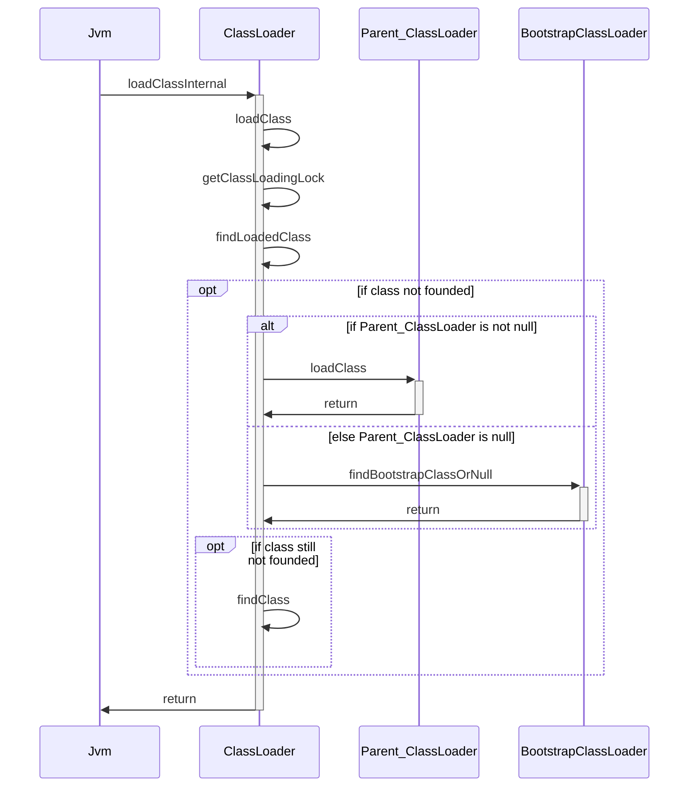
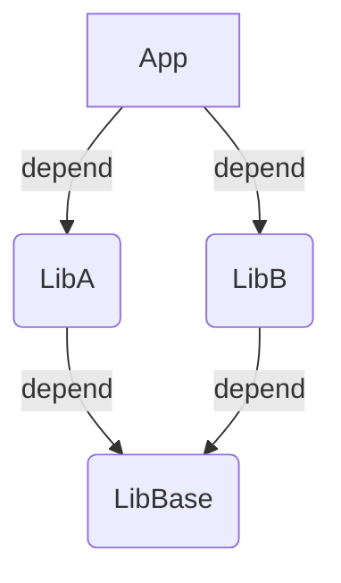
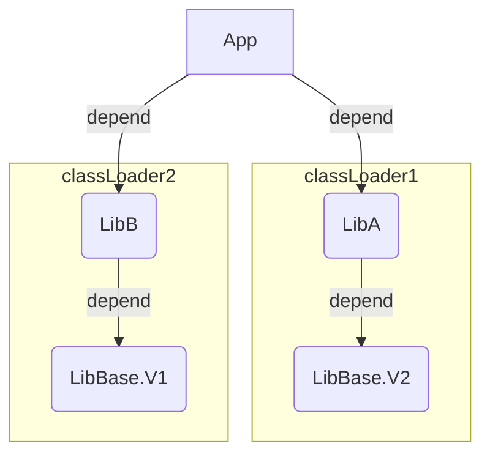

# java 类加载器

前面我们介绍了[Java的类加载流程](/posts/2017/10/51a7bdd0/)。这篇文章，我们来详细了解下java的类加载器。

<!--more-->

一个类加载器查找class和resource时，是通过“委托模式”进行的：它首先判断这个class是不是已经加载成功，如果没有的话它并不是自己进行查找，而是先通过父加载器，然后递归下去，直到Bootstrap ClassLoader，如果Bootstrap classloader找到了，直接返回，如果没有找到，则一级一级返回，最后到达自身去查找这些对象。这种机制就叫做双亲委托。下面我们来分析下ClassLoader的源码。

## 并行加载

```java
public abstract class ClassLoader {
  // 并行加载ClassLoader 配置
  private static class ParallelLoaders {
        private ParallelLoaders() {}
        // set中存储了并行加载的类加载器
        private static final Set<Class<? extends ClassLoader>> loaderTypes =
            Collections.newSetFromMap(
                new WeakHashMap<Class<? extends ClassLoader>, Boolean>());
        static {
            // 保证 所有classLoader的父类是可并行的
            synchronized (loaderTypes) { loaderTypes.add(ClassLoader.class); }
        }

        /**
         * 将给定的ClassLoader子类，注册为并行加载。
         * 注册成功返回true, 如果父类未注册成功，返回false
         */
        static boolean register(Class<? extends ClassLoader> c) {
            synchronized (loaderTypes) {
                if (loaderTypes.contains(c.getSuperclass())) {
                    loaderTypes.add(c);
                    return true;
                } else {
                    return false;
                }
            }
        }
        static boolean isRegistered(Class<? extends ClassLoader> c) {
            synchronized (loaderTypes) {
                return loaderTypes.contains(c);
            }
        }
    }

    // 注册并行类加载的方法
    @CallerSensitive
    protected static boolean registerAsParallelCapable() {
        Class<? extends ClassLoader> callerClass =
            Reflection.getCallerClass().asSubclass(ClassLoader.class);
        return ParallelLoaders.register(callerClass);
    }
```

上面的ParallelLoaders中存储了所以可以并行加载的classLoader。支持并行加载的ClassLoader可以注册自己例如: 

```java
public abstract class FlinkUserCodeClassLoader extends URLClassLoader {
  
    static {
        ClassLoader.registerAsParallelCapable();
    }
}
```

下面来看下普通加载和并行加载的具体流程。

```java
public abstract class ClassLoader {
   // key是类名，value 是锁对象
    private final ConcurrentHashMap<String, Object> parallelLockMap;

    // This method is invoked by the virtual machine to load a class.
    // 加载流程的入口，
    private Class<?> loadClassInternal(String name) throws ClassNotFoundException{
        // For backward compatibility, explicitly lock on 'this' when
        // the current class loader is not parallel capable.
        if (parallelLockMap == null) {
            synchronized (this) {
                 return loadClass(name);
            }
        } else {
            return loadClass(name);
        }
    }
    public Class<?> loadClass(String name) throws ClassNotFoundException{
        return loadClass(name,false);
    }
    protected Class<?> loadClass(String name, boolean resolve) throws ClassNotFoundException{
       // 获取锁，此时如果支持并行加载，获取的是class对应的锁，
       // 不支持并行加载，获取的是当前classloader类. 
        synchronized (getClassLoadingLock(name)) {
            // First, check if the class has already been loaded
            Class<?> c = findLoadedClass(name);
            if (c == null) {
                long t0 = System.nanoTime();
                try {
                    if (parent != null) {
                        c = parent.loadClass(name, false);
                    } else {
                        c = findBootstrapClassOrNull(name);
                    }
                } catch (ClassNotFoundException e) {
                    // ClassNotFoundException thrown if class not found
                    // from the non-null parent class loader
                }

                if (c == null) {
                    long t1 = System.nanoTime();
                    // 如果还是找不到，就自己找
                    // 该方法由ClassLoader的子类自己实现
                    c = findClass(name);

                    // this is the defining class loader; record the stats
                    sun.misc.PerfCounter.getParentDelegationTime().addTime(t1 - t0);
                    sun.misc.PerfCounter.getFindClassTime().addElapsedTimeFrom(t1);
                    sun.misc.PerfCounter.getFindClasses().increment();
                }
            }
            if (resolve) {
                resolveClass(c);
            }
            return c;
        }
    }
        protected Object getClassLoadingLock(String className) {
        Object lock = this;
        if (parallelLockMap != null) {
            Object newLock = new Object();
            lock = parallelLockMap.putIfAbsent(className, newLock);
            if (lock == null) {
                lock = newLock;
            }
        }
        return lock;
    }
    // .. ... 
}
```

时序图如下：


## 获取Classloader

获取类加载器的几种方法:

```java
// 获取当前类的加载器
String.class.getClassLoader();
// 获取线程上下文类加载器
Thread.currentThread().getContextClassLoader();
// 获取系统类加载器
ClassLoader.getSystemClassLoader()
```

### 线程上下文类加载器

线程上下文类加载器的一般使用模式:

1. 获取
2. 使用
3. 还原

```java
//获取
ClassLoader classLoader = Thread.currentThread.getContextClassLoader();
  try{
    //设置要使用的类加载器, 如cls就是启动类加载器就可以加载到实现类了 
    //ServiceLoader加载SPI时，默认就是采用的线程类加载器
    Thread.currentThread.setContextClassLoader(cls);
    //使用，里面调用了Thread.currentThread().getContextClassLoader(),获取当前线程的上下文类加载器做某些事情
    SomeMethod();
  }finally{
    //还原
    Thread.currentThread.setContextClassLoader(classLoader);
}
```

在双亲委托模型下，类加载是由下至上的，即下层的类加载器会委托上层的加载。但是对于SPI来说，有些接口是java核心库所提供的，而java核心库是由启动类加载器来加载的，而这些接口的实现来自于不同的jar包（厂商提供）java的启动类加载器是不会加载其他来源的jar包，这样传统的双亲委托模型就无法满足SPI的要求，而通过给当前线程设置上下文类加载器,就可以由设置的上下文类加载器来实现对于接口实现类的加载。

### Object.getClass.getClassLoader

Object.getClass.getClassLoader() 会返回对象所使用类的类加载器。


### ClassLoader.getSystemClassLoader

ClassLoader.getSystemClassLoader() 会返回系统类加载器。系统类加载器的实例是由系统属性 "java.system.class.loader" 控制的。

1. 如果系统属性是默认值null,那么getSystemClassLoader的返回值就是上面的`sun.misc.Launcher$AppClassLoader`.
2. 当定义了系统属性时系统会让默认的AppClassLoader这个类加载器去加载即将成为系统类加载器的这个自定义加载器。
3. 该系统属性的值(方法名)将作为系统类加载器的类名。必须在自定义的类加载器中编写一个构造函数，该构造函数只接受一个参数，类型是类加载器，用作类加载器的委托父类。然后使用应用程序类加载器,作为这个构造函数的参数。此时自定义的类加载器将成为系统类加载器。

```java
// java -Djava.system.class.loader=info.victorchu.type.TestSystemClassLoader info.victorchu.type.ClassLoaderTest
public class TestSystemClassLoader extends ClassLoader{
    public TestSystemClassLoader(ClassLoader parent){
        super(parent);
    }
}
```

getSystemClassLoader用于哪里？

1. 返回用于委托的系统类加载器。他是新的(自定义)类加载器的默认委托双亲(父类)，并且是通常用于启动应用程序(main方法)的类加载器。
2. 此方法首先在程序运行时启动时很早被调用，此时创建并设置系统类加载器；并将其设置为调用该方法的线程的上下文类加载器。

下面来看看getSystemClassLoader的逻辑。

```java
 @CallerSensitive
  public static ClassLoader getSystemClassLoader() {
  	//初始化系统类加载器
    initSystemClassLoader();
    if (scl == null) {
      return null;
    }
    //获取安全管理器
    SecurityManager sm = System.getSecurityManager();
    if (sm != null) {
      checkClassLoaderPermission(scl, Reflection.getCallerClass());
    }
    return scl;
  }
  //初始化系统类加载器
   private static synchronized void initSystemClassLoader() {
  //如果系统类加载器没有被设置
    if (!sclSet) {
      //系统类加载器没有被设置又不为空 矛盾 就抛异常
      if (scl != null)
        throw new IllegalStateException("recursive invocation");
        //Launcher.getLauncher 获取该实例
        sun.misc.Launcher l = sun.misc.Launcher.getLauncher();
        if (l != null) {
          //创建成功
          Throwable oops = null;
          //把Launcher 中的系统类加载器付给当前类的类加载器
          scl = l.getClassLoader();
          try {
            //获取类加载器对象
            scl = AccessController.doPrivileged(
                new SystemClassLoaderAction(scl));//传入系统类加载器作为父加载器
          } catch (PrivilegedActionException pae) {
            oops = pae.getCause();
            if (oops instanceof InvocationTargetException) {
              oops = oops.getCause();
            }
          }
          if (oops != null) {
            if (oops instanceof Error) {
              throw (Error) oops;   
            } else {
              // wrap the exception
              throw new Error(oops);
           }
          }
        }
        //此时系统类加载器设置完成
        sclSet = true;
      }
  }
```
接下来看看 SystemClassLoaderAction中的逻辑。
```java
class SystemClassLoaderAction
    implements PrivilegedExceptionAction<ClassLoader> {
    private ClassLoader parent;

    SystemClassLoaderAction(ClassLoader parent) {
        this.parent = parent;
    }

    public ClassLoader run() throws Exception {
    //获取java.system.class.loader 系统属性
        String cls = System.getProperty("java.system.class.loader");
        if (cls == null) {
          //如果改系统属性没被设置返回 appClassLoader
          // 此时的 TCCL 是 APPClassLoader，见sun.misc.Launcher 中代码
           return parent;
        }
		//如果自定义了系统类加载器
		//获取cls名的Class参数为（ClassLoader.class）的构造函数 
		//Class.forName 加载cls对应的二进制名 并使用父类（parent）初始化（true）
        Constructor<?> ctor = Class.forName(cls, true, parent)
            .getDeclaredConstructor(new Class<?>[] { ClassLoader.class });
        //将父类加载器即系统类加载器传给了自定义类加载器
        //所以当自定义类加载器在设置完时是由appClassLoader去加载的
        //获取自定义的ClassLoader类
        ClassLoader sys = (ClassLoader) ctor.newInstance(
            new Object[] { parent });            
        Thread.currentThread().setContextClassLoader(sys);
        //返回自定义类加载器
        return sys;
    }
}
```
## Class.forName

Class.forName()有两个重载的方法，都是public方法。

```java
// 参数initialize 表示该类是否必须被初始化
public static Class<?> forName(String className)
public static Class<?> forName(String name, boolean initialize, ClassLoader loader)

// 实际调用forName0
@CallerSensitive
public static Class<?> forName(String className) throws ClassNotFoundException {
   //获取调用者的Class对象 单参默认使用调用者的类加载器
    Class<?> caller = Reflection.getCallerClass();
    return forName0(className, true, ClassLoader.getClassLoader(caller), caller);
}
public static Class<?> forName(String name, boolean initialize, ClassLoader loader)
    throws ClassNotFoundException
{
    Class<?> caller = null;
    SecurityManager sm = System.getSecurityManager();
    if (sm != null) {
        // Reflective call to get caller class is only needed if a security manager
        // is present.  Avoid the overhead of making this call otherwise.
        caller = Reflection.getCallerClass();
        if (loader == null) {
            ClassLoader ccl = ClassLoader.getClassLoader(caller);
            if (ccl != null) {
                sm.checkPermission(
                    SecurityConstants.GET_CLASSLOADER_PERMISSION);
            }
        }
    }
    return forName0(name, initialize, loader, caller);
}
```


Class.forName 和 ClassLoader.loadClass(name)的区别：

* Class.forName会获取当前的类加载器，而 ClassLoader.loadClass(name)可以使用外部的类加载器。
* Class.forName() 方法中，initialize参数(默认填充true)控制类在加载的过程中是否进行初始化。ClassLoader.loadClass(name)方法中，实际调用loadClass(name,resolve:false),resolve参数控制类在加载的过程中是否进行link(resolve为true，会执行静态代码块)。

```java
package info.victorchu.type.classload;

public class DemoClass {
    private String name;

    private static boolean flag;
    static {
        flag = false;
        System.out.println("flag 的值为：" + flag);
    }
    public String getName() {
        return name;
    }
    public void setName(String name) {
        this.name = name;
    }
}

public class ClassLoaderDemo {
    public static void main(String [] args){
        try {
            ClassLoader system = ClassLoader.getSystemClassLoader();
            Class<DemoClass> cls = null;
            System.out.println("----------方法1----------");
            cls = (Class<DemoClass>)Class.forName("info.victorchu.type.classload.DemoClass");

            System.out.println("----------方法2----------");
            cls = (Class<DemoClass>)Class.forName("info.victorchu.type.classload.DemoClass", false, system);

            // 类加载过程中的缓存机制，由于方法1已经加载了该类，因此方法3不会再次加载该类
            System.out.println("----------方法3----------");
            cls = (Class<DemoClass>)Class.forName("info.victorchu.type.classload.DemoClass", true, system);

        } catch (ClassNotFoundException e) {
            // TODO Auto-generated catch block
            e.printStackTrace();
        }
    }
}
public class ClassLoaderDemo1 {
    public static void main(String [] args){
        try {
            ClassLoader system = ClassLoader.getSystemClassLoader();
            //没有执行静态代码块，由此可见DemoClass只是进行了装载，没有进行链接与初始化。
            System.out.println("----------方法4----------");
            Class<DemoClass> cls  = (Class<DemoClass>)ClassLoader.getSystemClassLoader().loadClass("info.victorchu.type.classload.DemoClass");

        } catch (Exception e) {
            e.printStackTrace();
        }
    }
}
// output1
//----------方法1----------
//flag 的值为：false
//----------方法2----------
//----------方法3----------
// output2
//----------方法4----------
```

## Class.newInstance

在通过Class.forName或loadClass获取类对象后，通常会使用Class.newInstance方法获取类的实例。Class.newInstance与显式调用构造器的区别在于:

1. new使用的类加载器是当前类加载器，newinstance的类加载器由前面的类对象的类加载器决定。
2. new是静态加载，newinstance是通过反射动态加载。因此两者执行效率也不同。
3. newinstance:只能调用无参构造。new:能调用任何public构造。

Class.newInstance 常见于通过配置文件中的类名，获取类对象，然后再生成对象。通过这种方式实现了动态化。

## 自定义类加载器

> 有些类可能不是起源于一个文件;他们可能会产生从其他来源，如网络。ClassLoader的方法defineClass将字节数组转换为类的实例。可以很好的帮助自定义类加载器的实现。

编写一个自定义classLoader:
```java
class NetworkClassLoader extends ClassLoader {
    String host;
    int port;
 
    public Class findClass(String name) {
      byte[] b = loadClassData(name);
      return defineClass(name, b, 0, b.length);//通过名字将Class对象返回给调用者
    }
 
    private byte[] loadClassData(String name) {
      // load the class data from the connection
      .
    }
}
```

### 类命名空间

- 每个类加载器都有自己的命名空间，命名空间由该类加载器及所有父加载器所加载的类组成。同一个命名空间内的类是相互可见的。只是可见，但不一定能互相访问，能不能访问由修饰符决定，比如private public 等。
  - 在同一个命名空间中，不会出现类的完整名字（包括类的包名） 相同的两个类。
  -  在不同的命名空间中，有可能会出现类的完整名字（包括类的包名）相同的两个类。
- 子加载器的命名空间包含所有父加载器的命名空间。因此由子加载器加载的类能看见父加载器加载的类。例如系统类加载器加载的类能看见根类加载器加载的类。
  - 父加载器加载的类不可以看到子类加载器加载的类
  - 但是子类加载器加载的类可以看到父类加载器加载的类

命名空间的一个大的应用场景是隔离。

应用App依赖库LibA和LibB，而LibA和LibB又同时依赖LibBase，而LibA和LibB都是其他团队开发的。



其中LibA发布了一个重要的修复版本，但是依赖LibBase v2.0，而LibB还没有升级版本，LibBase还不是兼容的，那么此时升级就会面临困难。
在生产环境中这种情况往往更恶劣，可能是好几层的间接依赖关系。隔离容器用于解决这种问题。它把LibA和LibB的环境完全隔离开来，LibBase即使类名完全相同也不互相冲突，使得LibA和LibB的升级互不影响。众所周知，Java中判定两个类是否相同，看的是类名和其对应的class loader，两者同时相同才表示相等。隔离容器正是利用这种特性实现的。



隔离的核心：

* class的区分由class name和载入其的class loader共同决定。
* 当在class A中使用了class B时，JVM默认会用class A的class loader去加载class B。

我们有两种方案来实现隔离。

1. (parent first): 覆写自定义classLoader的findClass 方法，这也是JDK的注释中推荐的，ClassLoader的findClass的实现是直接抛出ClassNotFound异常，我们在这里可以直接使用URLClassLoader，findClass方法支持从路径加载Class。此外，我们还要保证当前自定义ClassLoader的URL不在上级parent ClassLoader的URL中，这样才可以保证父类ClassLoader加载不到该类，将该任务交给子类实现。
2. (child first): 覆写自定义ClassLoader的loadClass 方法，这样我们会直接打破双亲委派模型。

下面是 ClassLoader的一个例子:

```java
/**
 * 双模类加载器。
 * 1. parent first 模式。
 * 2. child first 模式。
 */
public class DualModeClassLoader extends URLClassLoader {
    static {
        ClassLoader.registerAsParallelCapable();
    }

    private final String[] alwaysParentFirstPatterns;

    private Boolean parentFirst;

    public DualModeClassLoader(URL[] urls, ClassLoader parent, String[] alwaysParentFirstPatterns, Boolean parentFirst) {
        super(urls, parent);
        this.alwaysParentFirstPatterns = alwaysParentFirstPatterns;
        this.parentFirst = parentFirst;
    }

    @Override
    public final Class<?> loadClass(String name, boolean resolve) throws ClassNotFoundException {
        if(parentFirst){
          return loadClassParentFirst(name, resolve);
        }else{
          return loadClassChildFirst(name,resolve);
        }
    }
    public final Class<?> loadClassChildFirst(String name, boolean resolve) throws ClassNotFoundException {
        // First, check if the class has already been loaded
        Class<?> c = findLoadedClass(name);
        if (c == null) {
            // check whether the class should go parent-first
            for (String alwaysParentFirstPattern : alwaysParentFirstPatterns) {
                if (name.startsWith(alwaysParentFirstPattern)) {
                    return super.loadClass(name, resolve);
                }
            }
            try {
                // check the URLs
                c = findClass(name);
            } catch (ClassNotFoundException e) {
                // let URLClassLoader do it, which will eventually call the parent
                c = super.loadClass(name, resolve);
            }
        } else if (resolve) {
            resolveClass(c);
        }
        return c;
    }
    public final Class<?> loadClassParentFirst(String name, boolean resolve) throws ClassNotFoundException {
        return super.loadClass(name, resolve);
    }
}
```

