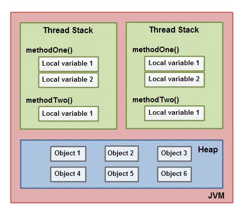
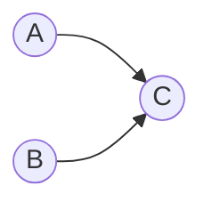
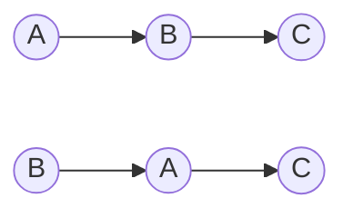

# Java虚拟机-Java内存模型

多任务处理在现代计算机操作系统中是一个必备功能。计算机的运算能力变得十分强大的同时，运算速度与存储和通信子系统速度的差距太大，大量的时间都花费在磁盘I/O、网络通信和数据库访问上，因此为了避免处理器的大部分时间都花费在等待其它资源，一种行之有效的方法是让计算机同时处理多项任务。

<!--more-->

## 高速缓存

"让计算机并发执行若干个运算任务"与"更充分地利用计算机处理器的效能"之间并没有想象中的简单，其中一个重要的复杂性来源是，绝大多数的运算任务都不可能只靠处理器"计算"完成。处理器至少要和内存交互，如读取运算数据、存储运算结果等。由于计算机存储设备与处理器的运算速度有极大的差距，所以现代计算机系统加入了一层读写速度接近处理器的**高速缓存\(Cache Memory\)**，把它作为内存和处理器之间的缓冲。


### 缓存不一致问题

基于高速缓存的存储交互很好的解决了处理器与内存之间的矛盾，也引入了新的问题：缓存一致性问题。

当程序在运行过程中，会将运算需要的数据从主存复制一份到CPU的高速缓存当中，那么CPU进行计算时就可以直接从它的高速缓存读取数据和向其中写入数据，当运算结束之后，再将高速缓存中的数据刷新到主存当中。举个简单的例子，比如下面的这段代码：

```
i = i + 1;
```

当线程执行这个语句时，会先从主存当中读取i的值，然后复制一份到高速缓存当中，然后CPU执行指令对i进行加1操作，然后将数据写入高速缓存，最后将高速缓存中i最新的值刷新到主存当中。

这个代码在单线程中运行是没有任何问题的，但是在多线程中运行就会有问题了。在多核CPU中，每条线程可能运行于不同的CPU中，因此每个线程运行时有自己的高速缓存（对单核CPU来说，其实也会出现这种问题，只不过是以线程调度的形式来分别执行的）。

以多核CPU为例。比如同时有2个线程执行这段代码，假如初始时i的值为0，那么我们希望两个线程执行完之后i的值变为2。但是事实会是这样吗？

可能存在下面一种情况：初始时，两个线程分别读取i的值存入各自所在的CPU的高速缓存当中，然后线程1进行加1操作，然后把i的最新值1写入到内存。此时线程2的高速缓存当中i的值还是0，进行加1操作之后，i的值为1，然后线程2把i的值写入内存。最终结果i的值是1，而不是2。

这就是著名的缓存一致性问题。通常称这种被多个线程访问的变量为共享变量。也就是说，如果一个变量在多个CPU中都存在缓存（一般在多线程编程时才会出现），那么就可能存在缓存不一致的问题。

### 解决方案

在多处理器系统中，每个处理器有自己的高速缓存，而他们又共享同一块内存\(main memory 主要内存\)，当多个处理器运算都涉及到同一块内存区域的时候，就有可能发生缓存不一致的现象。

为了解决缓存不一致性问题，通常来说有以下2种解决方法：

1. 通过在总线加LOCK#锁的方式
2. 通过缓存一致性协议

这2种方式都是硬件层面上提供的方式。在早期的CPU当中，是通过在总线上加LOCK#锁的形式来解决缓存不一致的问题。因为CPU和其他部件进行通信都是通过总线来进行的，如果对总线加LOCK#锁的话，也就是说阻塞了其他CPU对其他部件访问（如内存），从而使得只能有一个CPU能使用这个变量的内存。比如上面例子中 如果一个线程在执行 i = i +1，如果在执行这段代码的过程中，在总线上发出了LCOK#锁的信号，那么只有等待这段代码完全执行完毕之后，其他CPU才能从变量i所在的内存读取变量，然后进行相应的操作。这样就解决了缓存不一致的问题。

但是上面的方式会有一个问题，由于在锁住总线期间，其他CPU无法访问内存，导致效率低下。
所以就出现了缓存一致性协议。最出名的就是Intel 的MESI协议，MESI协议保证了每个缓存中使用的共享变量的副本是一致的。它核心的思想是：

__*当CPU写数据时，如果发现操作的变量是共享变量，即在其他CPU中也存在该变量的副本，会发出信号通知其他CPU将该变量的缓存行置为无效状态，因此当其他CPU需要读取这个变量时，发现自己缓存中缓存该变量的缓存行是无效的，那么它就会从内存重新读取。*__

## CPU指令重排序

除了增加高速缓存之外，为了使处理器内部的运算单元能被充分利用，处理器可能会对输入代码重排序优化，处理器会保证重排序的结果与顺序执行的结果是一致的，但并不保证程序中各个语句计算的先后顺序与输入代码顺序一致。

### 背景知识

现代CPU的主频越来越高，与cache的交互次数也越来越多。当CPU的计算速度远远超过访问cache时，会产生cache wait，过多的cache wait就会造成性能瓶颈。

针对这种情况，多数架构\(包括X86\)采用了一种将cache分片的解决方案，即将一块cache划分成互不关联地多个 slots \(逻辑存储单元，又名 [Memory Bank](http://en.wikipedia.org/wiki/Memory_Bank) 或 Cache Bank\)，CPU可以自行选择在多个空闲bank 中进行存取。这种[SMP](http://en.wikipedia.org/wiki/Symmetric_multiprocessing)的设计，显著提高了CPU的并行处理能力，也回避了cache访问瓶颈。

* Memory Bank的划分

一般 Memory bank 是按cache address来划分的。比如 偶数adress 0×12345000分到 bank 0, 奇数address 0×123451001分到 bank1。

**重排序分为两种:**  
- 编译期重排。编译源代码时，编译器依据对上下文的分析，对指令进行重排序，以之更适合于CPU的并行执行。  
- 运行期重排，CPU在执行过程中，动态分析依赖部件的效能，对指令做重排序优化。

### 原理介绍


从图中可以看到，这是一台配备双CPU的计算机，cache 按地址被分成了两块 cache banks，分别是cache bank0 和 cache bank1。

理想的内存访问指令顺序：

1. CPU0往cache address 0×12345000 写入一个数字 1。因为address 0×12345000是偶数，所以值被写入 bank0.
2. CPU1读取 bank0 address 0×12345000 的值，即数字1。
3. CPU0往 cache 地址 0×123451001写入一个数字 2。因为address 0×123451001是奇数，所以值被写入 bank1.
4. CPU1读取 bank1 address 0×123451001 的值，即数字2。

重排序后的内存访问指令顺序：

1. CPU0 准备往 bank0 address 0×12345000 写入数字 1。
2. CPU0检查 bank0 的可用性。发现 bank0 处于 busy 状态。
3. CPU0 为了防止 cache等待，发挥最大效能，将内存访问指令重排序。即先执行后面的 bank1 address 0×123451001 数字2的写入请求。
4. CPU0检查 bank1 可用性，发现bank1处于 idle 状态。
5. CPU0 将数字2写入 bank 1 address 0×123451001。
6. CPU1来读取 0×12345000，未读到 数字1，出错。
7. CPU0 继续检查 bank0 的可用性，发现这次bank0 可用了，然后将数字1写入 0×12345000。
8. CPU1 读取 0×12345101，读到数字2，正确。

从上述触发步骤中，可以看到第 3 步发生了指令重排序，并导致第 6步读到错误的数据。

## JVM 内存模型

在JVM内部，Java内存模型把内存分成了两部分：线程栈区和堆区，下图展示了Java内存模型在JVM中的逻辑视图： 


JVM中运行的每个线程都拥有自己的线程栈，线程栈包含了当前线程执行的方法调用相关信息，我们也把它称作调用栈。随着代码的不断执行，调用栈会不断变化。线程栈还包含了当前方法的所有本地变量信息。一个线程只能读取自己的线程栈，也就是说，线程中的本地变量对其它线程是不可见的。即使两个线程执行的是同一段代码，它们也会各自在自己的线程栈中创建本地变量，因此，每个线程中的本地变量都会有自己的版本。

所有原始类型(boolean,byte,short,char,int,long,float,double)的本地变量都直接保存在线程栈当中，对于它们的值各个线程之间都是独立的。对于原始类型的本地变量，一个线程可以传递一个副本给另一个线程，当它们之间是无法共享的。

堆区包含了Java应用创建的所有对象信息，不管对象是哪个线程创建的，其中的对象包括原始类型的封装类（如Byte、Integer、Long等等）。不管对象是属于一个成员变量还是方法中的本地变量，它都会被存储在堆区。

下图展示了调用栈和本地变量都存储在栈区，对象都存储在堆区： 



一个本地变量如果是原始类型，那么它会被完全存储到栈区。一个本地变量也有可能是一个对象的引用，这种情况下，这个本地引用会被存储到栈中，但是对象本身仍然存储在堆区。对于一个对象的成员方法，这些方法中包含本地变量，仍需要存储在栈区，即使它们所属的对象在堆区。对于一个对象的成员变量，不管它是原始类型还是包装类型，都会被存储到堆区。Static类型的变量以及类本身相关信息都会随着类本身存储在堆区\(HotSpot虚拟机中是方法区\)。

堆中的对象可以被多线程共享。如果一个线程获得一个对象的引用，它便可访问这个对象的成员变量。如果两个线程同时调用了同一个对象的同一个方法，那么这两个线程便可同时访问这个对象的成员变量，但是对于本地变量，每个线程都会拷贝一份到自己的线程栈中。下图展示了上面描述的过程: 


两个线程拥有一些列的本地变量。其中一个本地变量\(Local Variable 2\)指向堆上的一个共享对象\(Object 3\)。这两个线程分别拥有同一个对象的不同引用。这些引用都是本地变量，因此存放在各自线程的线程栈上。这两个不同的引用指向堆上同一个对象。

注意，这个共享对象\(Object 3\)持有Object2和Object4一个引用作为其成员变量\(如图中Object3指向Object2和Object4的箭头\)。通过在Object3中这些成员变量引用，这两个线程就可以访问Object2和Object4。

这张图也展示了指向堆上两个不同对象的一个本地变量。在这种情况下，指向两个不同对象的引用不是同一个对象。理论上，两个线程都可以访问Object1和Object5，如果两个线程都拥有两个对象的引用。但是在上图中，每一个线程仅有一个引用指向两个对象其中之一。

### Java 共享变量

从上面的介绍，我们可以知道java中，所有实例域、静态域和数组元素存储在堆内存中，堆内存在线程之间共享。局部变量\(Local variables\)，方法定义参数\(java语言规范称之为formal method parameters\)和异常处理器参数\(exception handler parameters\)不会在线程之间共享，它们不会有内存可见性问题，也不受内存模型的影响。

> 注意：如果局部变量是一个reference 类型，它引用的对象在Java堆中可以被各个线程共享，但是reference本身在Java栈的局部变量表中，是线程私有的。

Java线程之间的通信由Java内存模型\(JMM\)控制，JMM决定一个线程对共享变量的写入何时对另一个线程可见。从抽象的角度来看，JMM定义了线程和主内存之间的抽象关系：线程之间的共享变量存储在主内存\(main memory\)中，每个线程都有一个私有的本地内存\(local memory\)，本地内存中存储了该线程读/写共享变量的副本。本地内存是JMM的一个抽象概念，并不真实存在。它涵盖了缓存，写缓冲区，寄存器以及其他的硬件和编译器优化。


线程对变量的所有操作（读取、赋值）都必须在工作内存中进行，而不能直接读写主内存中的变量。不同线程之间无法直接访问对方工作内存中的变量，线程间变量值的传递均需要在主内存来完成。上图中，线程A与线程B之间如要通信的话，必须要经历下面2个步骤：

* 首先，线程A把本地内存A中更新过的共享变量刷新到主内存中去。
* 然后，线程B到主内存中去读取线程A之前已更新过的共享变量。

### 内存间交互操作

关于主内存与工作内存之间的具体交互协议，即一个变量如何从主内存拷贝到工作内存、如何从工作内存同步到主内存之间的实现细节，Java内存模型定义了以下八种操作来完成：

* lock\(锁定\)：作用于主内存的变量，把一个变量标识为一条线程独占状态。
* unlock\(解锁\)：作用于主内存变量，把一个处于锁定状态的变量释放出来，释放后的变量才可以被其他线程锁定。
* read\(读取\)：作用于主内存变量，把一个变量值从主内存传输到线程的工作内存中，以便随后的load动作使用
* load\(载入\)：作用于工作内存的变量，它把read操作从主内存中得到的变量值放入工作内存的变量副本中。
* use\(使用\)：作用于工作内存的变量，把工作内存中的一个变量值传递给执行引擎，每当虚拟机遇到一个需要使用变量的值的字节码指令时将会执行这个操作。
* assign\(赋值\)：作用于工作内存的变量，它把一个从执行引擎接收到的值赋值给工作内存的变量，每当虚拟机遇到一个给变量赋值的字节码指令时执行这个操作。
* store\(存储\)：作用于工作内存的变量，把工作内存中的一个变量的值传送到主内存中，以便随后的write的操作。
* write\(写入\)：作用于主内存的变量，它把store操作从工作内存中一个变量的值传送到主内存的变量中。

如果要把一个变量从主内存中复制到工作内存，就需要按顺寻地执行read和load操作，如果把变量从工作内存中同步回主内存中，就要按顺序地执行store和write操作。Java内存模型只要求上述操作必须按顺序执行，而没有保证必须是连续执行。也就是read和load之间，store和write之间是可以插入其他指令的。如对主内存中的变量a,b进行访问时，可能的顺序是read a，read b，load b， load a。Java内存模型还规定了在执行上述八种基本操作时，必须满足如下规则:

* 不允许read和load、store和write操作之一单独出现。
* 不允许一个线程丢弃它的最近assign的操作，即变量在工作内存中改变了之后必须同步到主内存中。
* 不允许一个线程无原因地\(没有发生过任何assign操作\)把数据从工作内存同步回主内存中。
* 一个新的变量只能在主内存中诞生，不允许在工作内存中直接使用一个未被初始化\(load或assign\)的变量。即就是对一个变量实施use和store操作之前，必须先执行过了assign和load操作。
* 一个变量在同一时刻只允许一条线程对其进行lock操作，lock和unlock必须成对出现
* 如果对一个变量执行lock操作，将会清空工作内存中此变量的值，在执行引擎使用这个变量前需要重新执行load或assign操作初始化变量的值
* 如果一个变量事先没有被lock操作锁定，则不允许对它执行unlock操作；也不允许去unlock一个被其他线程锁定的变量。
* 对一个变量执行unlock操作之前，必须先把此变量同步到主内存中\(执行store和write操作\)。

## 指令重排序

在执行程序时为了提高性能，编译器和处理器经常会对指令进行重排序。重排序分成三种类型：

* 编译器优化的重排序。编译器在不改变单线程程序语义放入前提下，可以重新安排语句的执行顺序。
* 指令级并行的重排序。现代处理器采用了指令级并行技术来将多条指令重叠执行。如果不存在数据依赖性，处理器可以改变语句对应机器指令的执行顺序。
* 内存系统的重排序。由于处理器使用缓存和读写缓冲区，这使得加载和存储操作看上去可能是在乱序执行。


上述的1属于编译器重排序，2和3属于处理器重排序。这些重排序都可能会导致多线程程序出现内存可见性问题。对于编译器，JMM的编译器重排序规则会禁止特定类型的编译器重排序（不是所有的编译器重排序都要禁止）。对于处理器重排序，JMM的处理器重排序规则会要求java编译器在生成指令序列时，插入特定类型的内存屏障（memory barriers，intel称之为memory fence）指令，通过内存屏障指令来禁止特定类型的处理器重排序（不是所有的处理器重排序都要禁止）。

JMM属于语言级的内存模型，它确保在不同的编译器和不同的处理器平台之上，通过禁止特定类型的编译器重排序和处理器重排序，为程序员提供一致的内存可见性保证。

### 重排序－－内存屏障指令

> 用于解决前面提到过的CPU缓存一致性问题。

现代的处理器使用写缓冲区来临时保存向内存写入的数据，但每个处理器上的写缓冲区，仅仅对它所在的处理器可见。这个特性会对内存操作的执行顺序产生重要的影响：处理器对内存的读/写操作的执行顺序，不一定与内存实际发生的读/写操作顺序一致！

为了保证内存可见性，java编译器在生成指令序列的适当位置会插入内存屏障指令来禁止特定类型的处理器重排序。JMM把内存屏障指令分为下列四类：

|屏障类型|指令示例|说明|
|:---|:---|:---|
|LoadLoad Barriers|Load1; LoadLoad; Load2|确保Load1数据的装载，之前于Load2及所有后续装载指令的装载。|
|StoreStore Barriers|Store1; StoreStore; Store2|确保Store1数据对其他处理器可见（刷新到内存），之前于Store2及所有后续存储指令的存储。|
|LoadStore Barriers|Load1; LoadStore; Store2|确保Load1数据装载，之前于Store2及所有后续的存储指令刷新到内存。|
|StoreLoad Barriers|Store1; StoreLoad; Load2|确保Store1数据对其他处理器变得可见\(指刷新到内存\)，之前于Load2及所有后续装载指令的装载。StoreLoad Barriers会使该屏障之前的所有内存访问指令\(存储和装载指令\)完成之后，才执行该屏障之后的内存访问指令。|

> [The JSR-133 Cookbook for Compiler Writers](http://g.oswego.edu/dl/jmm/cookbook.html)

### 重排序－－规则

#### 数据依赖性

如果两个操作访问同一个变量，且这两个操作中有一个为写操作，此时这两个操作之间就存在数据依赖性。数据依赖分下列三种类型：

|名称|示例|说明|
|:---|:---|:---|
|写后读|`a=1;b=a;`|写一个变量之后，再读这个位置。|
|写后写|`a=1;a=2;`|写一个变量之后，再写这个变量。|
|读后写|`a=b;b=1;`|读一个变量之后，再写这个变量。|

上面三种情况，只要重排序两个操作的执行顺序，程序的执行结果将会被改变。编译器和处理器在重排序时，会遵守数据依赖性，编译器和处理器不会改变存在数据依赖关系的两个操作的执行顺序。

>注意，这里所说的数据依赖性仅针对单个处理器中执行的指令序列和单个线程中执行的操作，不同处理器之间和不同线程之间的数据依赖性不被编译器和处理器考虑。

#### as-if-serial

as-if-serial语义的意思指：不管怎么重排序（编译器和处理器为了提高并行度），（单线程）程序的执行结果不能被改变。编译器，runtime 和处理器都必须遵守as-if-serial语义。

为了遵守as-if-serial语义，编译器和处理器不会对存在数据依赖关系的操作做重排序，因为这种重排序会改变执行结果。但是，如果操作之间不存在数据依赖关系，这些操作可能被编译器和处理器重排序。为了具体说明，请看下面计算圆面积的代码示例：

```java
double pi  = 3.14;    //A
double r   = 1.0;     //B
double area = pi * r * r; //C
```

上面三个操作的数据依赖关系如下图所示：



如上图所示，A和C之间存在数据依赖关系，同时B和C之间也存在数据依赖关系。因此在最终执行的指令序列中，C不能被重排序到A和B的前面（C排到A和B的前面，程序的结果将会被改变）。但A和B之间没有数据依赖关系，编译器和处理器可以重排序A和B之间的执行顺序。下图是该程序的两种执行顺序：



as-if-serial语义把单线程程序保护了起来，遵守as-if-serial语义的编译器，runtime 和处理器共同为编写单线程程序的程序员创建了一个幻觉：单线程程序是按程序的顺序来执行的。as-if-serial语义使单线程程序员无需担心重排序会干扰他们，也无需担心内存可见性问题。

#### happens-before 原则

Java语言中有一个“先行发生”（happen—before）的规则，它是Java内存模型中定义的两项操作之间的偏序关系，如果操作A先行发生于操作B，其意思就是说，在发生操作B之前，操作A产生的影响都能被操作B观察到，“影响”包括修改了内存中共享变量的值、发送了消息、调用了方法等，它与时间上的先后发生基本没有太大关系。

举例来说，假设存在如下三个线程，分别执行对应的操作:


* 线程A中执行如下操作：i=1
* 线程B中执行如下操作：j=i
* 线程C中执行如下操作：i=2

假设线程A中的操作”i=1“ happen—before线程B中的操作“j=i”，那么就可以保证在线程B的操作执行后，变量j的值一定为1，即线程B观察到了线程A中操作“i=1”所产生的影响；现在，我们依然保持线程A和线程B之间的happen—before关系，同时线程C出现在了线程A和线程B的操作之间，但是C与B并没有happen—before关系，那么j的值就不确定了，线程C对变量i的影响可能会被线程B观察到，也可能不会，这时线程B就存在读取到不是最新数据的风险，不具备线程安全性。

下面是Java内存模型中的八条可保证happen—before的规则，它们无需任何同步器协助就已经存在，可以在编码中直接使用。如果两个操作之间的关系不在此列，并且无法从下列规则推导出来的话，它们就没有顺序性保障，虚拟机可以对它们进行随机地重排序。

1. 程序次序规则：在一个单独的线程中，按照程序代码的执行流顺序\(时间上\)先执行的操作happen—before\(时间上\)后执行的操作。
2. 管理锁定规则：一个unlock操作先行发生于后面\(时间上的先后顺序，下同\)对同一个锁的lock操作。
3. volatile变量规则：对一个volatile变量的写操作先行发生于后面对该变量的读操作。
4. 线程启动规则：Thread对象的start()方法先行发生于此线程的每一个动作。
5. 线程终止规则：线程的所有操作都先行发生于对此线程的终止检测，可以通过Thread.join()方法结束、Thread.isAlive()的返回值等手段检测到线程已经终止执行。
6. 线程中断规则：对线程interrupt()方法的调用先行发生于被中断线程的代码检测到中断时事件的发生。
7. 对象终结规则：一个对象的初始化完成\(构造函数执行结束\)先行发生于它的finalize()方法的开始。
8. 传递性：如果操作A 线性发生于操作B，操作B先行发生于操作C，那么可以得出A先行发生于操作C。

### volatile 变量的特殊规则

volatile变量具有两种特性:

#### 可见性

volatile变量对所有线程可见。这里的可见性是指当一条线程修改了变量的值，新值对于其他线程是立刻可知的。普通变量不能做到这点，普通变量的值在线程间传递需要通过主内存来完成。volatile变量在各个线程的工作内存中不存在一致性问题\(在各个线程的工作内存中，volatile变量存在值不一致的情况，但是每次使用前都会刷新，所以可以看作不存在不一致问题\)。

尽管volatile变量的读是一致的，但是volatile变量在并发下仍会存在安全问题\(写不一致\)。在不符合以下两条规则的运算场景中，我们仍要通过加锁\(synchronized或使用java.util.concurrent中的原子类\)来保证原子性。

* 运算结果不依赖变量的瞬时值，或者只有单一线程修改变量。
* 变量不需要与其他的状态变量共同参与不变约束。

#### 禁止指令重排序

volatile关键字本身通过加入内存屏障来禁止指令的重排序，保证代码执行顺序与程序顺序相同。

## 并发编程模型

在并发编程中，我们需要处理两个关键问题：线程之间如何通信及线程之间如何同步（这里的线程是指并发执行的活动实体）。通信是指线程之间以何种机制来交换信息。在命令式编程中，线程之间的通信机制有两种：共享内存和消息传递。

在共享内存的并发模型里，线程之间共享程序的公共状态，线程之间通过写-读内存中的公共状态来隐式进行通信。在消息传递的并发模型里，线程之间没有公共状态，线程之间必须通过明确的发送消息来显式进行通信。

同步是指程序用于控制不同线程之间操作发生相对顺序的机制。在共享内存并发模型里，同步是显式进行的。程序员必须显式指定某个方法或某段代码需要在线程之间互斥执行。在消息传递的并发模型里，由于消息的发送必须在消息的接收之前，因此同步是隐式进行的。

Java的并发采用的是共享内存模型，Java线程之间的通信总是隐式进行，整个通信过程对程序员完全透明。

Java内存模型是围绕着并发编程中***原子性、可见性、有序性***这三个特征来建立的，那我们依次看一下这三个特征：

### 原子性

> 一个操作不能被打断，要么全部执行完毕，要么不执行。

由Java内存模型来直接保证的原子性操作包括read,load,assign,use,store和write，基本数据类型的访问读写是原子操作\(32位JVM中的long,double操作是非原子性的\)。

在32位的JVM中，JVM会将对64位数据的读写操作划分为两次32位的操作进行，Java虚拟机规范允许long、double类型的变量在32位虚拟机中是非原子操作。实际上，商用虚拟机几乎都把64位数据的读写操作实现成原子性操作。

如果应用场景需要一个更大范围的原子性保证，Java内存模型还提供了lock和unlock操作来满足要求，尽管虚拟机没有把lock和unlock操作直接开放给用户使用，但提供了更高层次的字节码指令monitorenter和monitorexit来隐式地使用，这两个字节码反映到代码中就是同步块－synchronized。

### 可见性

> 一个线程对共享变量修改后，其他的线程能够立即看到这种变化。

Java内存模型是通过将在工作内存中的变量修改后的值同步到主内存，在读取变量前从主内存刷新最新值到工作内存中，这种依赖主内存的方式来实现可见性的。无论是普通变量还是volatile变量都是如此，区别在于：volatile的特殊规则保证了volatile变量值修改后的新值立刻同步到主内存，每次使用volatile变量前立即从主内存中刷新，因此volatile保证了多线程之间的操作变量的可见性，而普通变量则不能保证这一点。

除了volatile关键字能实现可见性之外，还有synchronized,Lock，final也是可以的。

使用synchronized关键字，在同步方法/同步块开始时（Monitor Enter）,使用共享变量时会从主内存中刷新变量值到工作内存中（即从主内存中读取最新值到线程私有的工作内存中），在同步方法/同步块结束时(Monitor Exit),会将工作内存中的变量值同步到主内存中去（即将线程私有的工作内存中的值写入到主内存进行同步）。

使用Lock接口的最常用的实现ReentrantLock(重入锁)来实现可见性：当我们在方法的开始位置执行lock.lock()方法，这和synchronized开始位置（Monitor Enter）有相同的语义，即使用共享变量时会从主内存中刷新变量值到工作内存中（即从主内存中读取最新值到线程私有的工作内存中），在方法的最后finally块里执行lock.unlock()方法，和synchronized结束位置（Monitor Exit）有相同的语义,即会将工作内存中的变量值同步到主内存中去（即将线程私有的工作内存中的值写入到主内存进行同步）。

### 有序性

对于一个线程的代码而言，我们总是以为代码的执行是从前往后的，依次执行的。这么说不能说完全不对，在单线程程序里，确实会这样执行；但是在多线程并发时，程序的执行就有可能出现乱序。用一句话可以总结为：在本线程内观察，操作都是有序的；如果在一个线程中观察另外一个线程，所有的操作都是无序的。前半句是指“线程内表现为串行语义（WithIn Thread As-if-Serial Semantics）”,后半句是指“指令重排”现象和“工作内存和主内存同步延迟”现象。

Java提供了两个关键字volatile和synchronized来保证多线程之间操作的有序性,volatile关键字本身通过加入内存屏障来禁止指令的重排序，而synchronized关键字通过一个变量在同一时间只允许有一个线程对其进行加锁的规则来实现，在"synchronized"单线程程序中，不会发生“指令重排”和“工作内存和主内存同步延迟”现象，这些现象只在多线程程序中出现。

### 构造方法中加强的final

final域是不可变的，所以它至少必须在构造方法中初始化，也可以直接在声明的同时就定义。为了确保在new这个对象时，不会看到final域的值有变化的情况，所以需要一个内存屏障的保证，确保对final域赋值，和把这个对象的引用赋值给引用对象时，不能进行重排序。这样才能确保new出来的对象拿到引用之前，final域就已经被赋值了。

注意，volatile也能禁止重排序，但是没有实现final在构造器中的加强。因此在构造器中的volatile变量赋值可能发生在对象引用后。

- [stackoverflow.Can a volatile variable that is never assigned null to ever contain null?](https://stackoverflow.com/questions/34341547/can-a-volatile-variable-that-is-never-assigned-null-to-ever-contain-null)  
- [stackoverflow.Ensuring safe publication and thread safety in java by means of static factories](https://stackoverflow.com/questions/20404761/ensuring-safe-publication-and-thread-safety-in-java-by-means-of-static-factories)

例如JDK1.6 中ConcurrentHashMap的HashEntry类。在注释中说明了volatile的问题

```java
/**
  * Because the value field is volatile, not final, it is legal wrt
  * the Java Memory Model for an unsynchronized reader to see null
  * instead of initial value when read via a data race.  Although a
  * reordering leading to this is not likely to ever actually
  * occur, the Segment.readValueUnderLock method is used as a
  * backup in case a null (pre-initialized) value is ever seen in
  * an unsynchronized access method.
  */
static final class HashEntry<K,V> {
    final K key;                       // 声明 key 为 final 的
    final int hash;                   // 声明 hash 值为 final 的
    volatile V value;                // 声明 value 被volatile所修饰
    final HashEntry<K,V> next;      // 声明 next 为 final 的

    HashEntry(K key, int hash, HashEntry<K,V> next, V value) {
        this.key = key;
        this.hash = hash;
        this.next = next;
        this.value = value;
    }
    // ...
}
```

当final域是引用对象时，还需要加强到如下：

* 在构造函数内对一个final域的写入,与随后把这个被构造对象的引用赋值给一个引用变量,这两个操作之间不能重排序。编译器会在 final 域的写之后，构造函数 return 之前，插入一个 StoreStore 屏障。
* 初次读一个包含 final域的对象的引用,与随后初次读这个final域,这两个操作之间不能重排序。
* 在构造函数内对一个final引用的对象的成员域的写入,与随后在构造函数外把这个被构造对象的引用赋值给一个引用变量,这两个操作之间不能重排序。编译器会在读 final 域操作的前面插入一个 LoadLoad 屏障。

为了修补之前内存模型的缺陷，JSR-133专家组增强了final的语义。通过为final域增加写和读重排序规则,可以为java程序员提供初始化安全保证:只要对象是正确构造的 (被构造对象的引用在构造函数中没有“逸出”),那么不需要使用同步(指 lock 和 volatile 的使用),就可以保证任意线程都能看到这个 final 域在构造函数中被 初始化之后的值。

