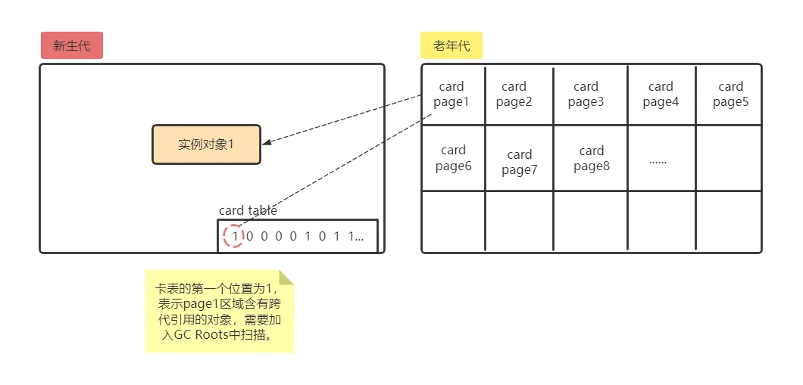
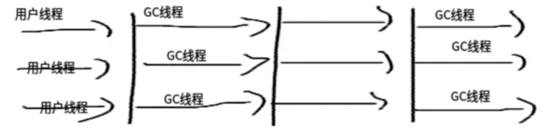
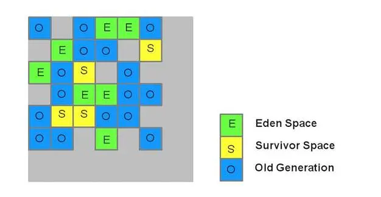

# Java虚拟机-GC收集器

HotSpot虚拟机实现GC算法时，必须对算法的执行效率有严格的考量，才能保证虚拟机的高效运行。本文介绍了HotSpotGC 算法的部分内部实现。

<!--more-->

## 枚举根节点

可达性分析根据GC Roots节点找出引用链，而GC Roots的节点主要在全局引用\(常量或类静态属性\)和执行上下文\(栈中的本地变量表\)。如果要一一枚举，显然会消耗很多时间。另外，在执行可达性分析时，需要`stop-the-world`操作，即在分析期间，整个执行系统冻结在某个时间点上，不能出现分析过程中对象引用关系还在不断变化的情况。

> 准确式内存管理：虚拟机可以准确知道内存中某个位置的数据是什么类型，例如内存中有一个32位的整数123456，虚拟机将会有能力分辨出来，这是一个数值为123456的整数，还是一个指向123456地址的reference类型。

目前主流的Java虚拟机都使用的是准确式内存管理，所以当执行系统停顿后，不需要枚举所有执行上下文和全局引用位置，虚拟机通过OopMap来得知哪些地方存放着对象引用。在类加载的时候，HotSpot就把对象内什么偏移量上是什么类型的数据计算出来，在JIT即时编译过程中，也会在特定位置记录下栈和寄存器中哪些位置是引用。

## 安全点

在OopMap的帮助下，HotSpot可以快速的完成GC Roots枚举，这带来了一个新问题，能够导致引用关系变化的\(OopMap内容变化的指令非常多\)，如果为每条指令都生成对应的OopMap，那会需要大量的额外空间，GC的成本会非常高。

实际上，HotSpot并没有为每条指令都生成OopMap，只是在特定的安全点记录了这些信息。即程序执行时并非在所有地方都能停下来GC，只有到达安全点才能暂停。安全点的选定基本上是以"是否具有让程序长时间执行的特征"为标准选定的。因为每条指令执行的时间都很短暂，"长时间执行"的明显特征就是序列复用，例如方法调用，循环跳转，异常跳转等。

对于安全点，另一个需要考虑的问题是如何在GC发生时让所有线程\(不包括执行JNI调用的线程\)都跑到"最近"的安全点上再停顿下来。这里有两种方案：

1. 抢先式中断： 抢先式中断不需要线程的执行代码去主动配合，在GC发生时，先把所有线程中断，如果发现有线程中断的地方不在安全点，就恢复线程，让它跑到安全点。现在几乎没有使用这个方案的。
2. 主动式中断：当GC需要中断线程的时候，不直接对线程操作，而是简单地设置一个标志，各个线程执行时主动去轮询这个标志，发现中断标志为真的时候，就自己中断挂起，轮询的位置和安全点是重合的，再加上创建对象需要分配内存的地方。

## 安全区域

考虑一种情况，如果程序没有执行，例如处于sleep或blocked状态，那么程序无法响应JVM的中断请求，也就无法完成主动式中断。此时，采用一种方案，安全区域。

安全区域\(Safe Region\)是指一段代码片段中，引用关系不会发生变化。在这个区域中任何地方开始GC都是安全的。在线程执行到安全区域中的代码时，首先标识自己进入了安全区域，那么，在这段时间里JVM发起GC时，不会管标识自己为安全区域状态的线程。当线程要离开Safe Region时，它要检查系统是否完成根节点枚举或整个GC，如果完成就继续执行，否则，等待可安全离开Safe Region的信号。

## 跨代引用

假如要现在进行一次只局限于新生代区域内的收集(Minor GC)，但新生代的实例对象1在老年代中被引用，为了找出该区域(新生代)中所有的存活对象，不得不在固定的GC Roots之外，再额外遍历整个老年代中所有对象来确保可达性分析结果的正确性，反过来也是一样。遍历整个老年代所有对象的方案虽然理论上可行，但无疑会为内存回收带来很大的性能负担。

事实上并不只是新生代、老年代之间才有跨代引用的问题，所有涉及部分区域收集(Partial GC)行为的垃圾收集器(例如 G1)，都会面临相同的问题。

首先，跨代引用相对于同代引用来说仅占极少数。原因是跨代引用的对象应该倾向于同时生存或者同时死亡的（如果某个新生代对象存在跨代引用，由于老年代对象难以消亡，该引用会使得新生代对象在收集时同样得以存活，进而在年龄增长之后晋升到老年代中，这时跨代引用也随即被消除了）。

依据上面说所，就不应再为了少量的跨代引用去扫描整个老年代，也不必浪费空间专门记录每一个对象是否存在及存在哪些跨代引用，只需在新生代上建立一个全局的数据结构(该结构被称为 “记忆集” ，Remembered Set)， 这个结构把老年代划分成若干小块，标识出老年代的哪一块内存会存在跨代引用。 此后当发生Minor GC时，只有包含了跨代引用的小块内存里的对象才会被加入到GCRoots进行扫描。虽然这种方法需要在对象改变引用关系(如将自己或者某个属性赋值)时维护记录数据的正确性，会增加一些运行时的开销，但比起收集时扫描整个老年代来说仍然是划算的。

### 记录集

记忆集是一种用于记录从非收集区域指向收集区域的指针集合的抽象数据结构。如果我们不考虑效率和成本的话，最简单的实现可以用非收集区域中所有含跨代引用的对象数组来实现这个数据结构，如下面代码所示:

```c
Class RememberedSet {
    Object[] set[OBJECT_INTERGENERATIONAL_REFERENCE_SIZE]; 
}
```

这种记录全部含跨代引用对象的实现方案，无论是空间占用还是维护成本都相当高昂。而在垃圾收集的场景中，收集器只需要通过记忆集判断出某一块非收集区域是否存在有指向了收集区域的指针就可以了，并不需要了解这些跨代指针的全部细节。那设计者在实现记忆集的时候，便可以选择更为粗犷的记录粒度来节省记忆集的存储和维护成本。下面列举了一些可供选择（当然也可以选择这个范围以外的）的记录精度：

- 字长精度： 每个记录精确到一个机器字长（就是处理器的寻址位数，如常见的32位或64位，这个 精度决定了机器访问物理内存地址的指针长度），该字包含跨代指针。
- 对象精度： 每个记录精确到一个对象，该对象里有字段含有跨代指针。
- 卡精度： 每个记录精确到一块内存区域，该区域内有对象含有跨代指针。

第三种“卡精度”所指的是用一种称为 “卡表”(Card Table) 的方式去实现记忆集，这也是目前最常用的记忆集的实现形式。

### 卡表

卡表是使用一个 字节数组`CARD_TABLE[]`实现，每个元素对应其标识的内存区域一块特定大小的内存块，每个内存块称为卡页，hotspot使用的卡页是 $2^9$ 大小 即512字节。这样我们就可以把某个区域按照卡页进行划分，假如我们现在要对新生代区域进行垃圾回收，那么就可以把老年代区域看成是一个卡页一个卡页划分好的，如下图所示



因为cardpage1中存在指向新生代的跨代引用，所以对应卡表的第一个位置为1，表明该page区域存在跨代应用的对象。

- 卡表角度： 因为page1中存在跨代饮用的对象，所以卡表对应的第一个位置记为1，表明page1这个元素变脏。
- 内存回收角度： 因为卡表的第一个位置为1，表明该page区域存在跨代应用的对象，垃圾回收的时候需要扫描该区域。

一个卡页的内存中通常包含不止一个对象，只要卡页内有一个(或更多)对象的字段存在着跨代指针，那就将对应卡表的数组元素的值标识为1，称为这个元素变脏，没有则标识为0。在垃圾收集发生时，只要筛选出卡表中变脏的元素，就能轻易得出哪些卡页内存块中包含跨代指针，把它们加入GC Roots中一并扫描。这样就不需要扫描整个老年代大大减少GC Roots的扫描范围。

## 垃圾回收器的常规匹配

* HotSpot 垃圾收集器


### Serial 收集器

Serial收集器是一个**新生代收集器**，**单线程执行**，使用复制算法。它在进行垃圾收集时，它不仅只会使用一个CPU或者一条收集线程去完成垃圾收集作，而且必须暂停其他所有的工作线程(用户线程),直到它收集完成。


是Jvm client模式下默认的新生代收集器。对于限定单个CPU的环境来说，简单高效，Serial收集器由于没有线程交互的开销，专心做垃圾收集自然可以获得最高的单线程收集效率，因此是运行在Client模式下的虚拟机的不错选择（比如桌面应用场景）。

### PartNew 收集器

ParNew收集器其实就是**serial收集器的多线程版本**，使用复制算法。除了使用多条线程进行垃圾收集之外，其余行为与Serial收集器一样。



是运行在Service模式下虚拟机中首选的新生代收集器，其中一个与性能无关的原因就是除了Serial收集器外，目前只有ParNew收集器能与CMS收集器配合工作。PreNew收集器在单CPU环境中绝对没有Serial的效果好，由于存在线程交互的开销，该收集器在超线程技术实现的双CPU中都不能一定超过Serial收集器。默认开启的垃圾收集器线程数就是CPU数量，可通过`-XX：parallelGCThreads`参数来限制收集器线程数

> 垃圾收集器的并发并行
> 
> *并行（Parallel）*：指多条垃圾收集器线程并行工作，但此时用户线程仍然处于等待。  
> *并发（Concurrent）*：指用户线程与垃圾收集器线程同时执行（但不一定是并行的，可能会交替执行），用户程序在继续运行，而垃圾收集器程序运行于另一个CPU之上。

### Parallel Scavenge\(并行回收GC\)收集器

Parallel Scavenge收集器也是一个新生代收集器，它也是使用复制算法的收集器，又是并行多线程收集器。parallel Scavenge收集器的特点是它的关注点与其他收集器不同，CMS等收集器的关注点是尽可能地缩短垃圾收集时用户线程的停顿时间，而parallel Scavenge收集器的目标则是达到一个可控制的吞吐量。吞吐量= 程序运行时间/(程序运行时间 + 垃圾收集时间)，虚拟机总共运行了100分钟。其中垃圾收集花掉1分钟，那吞吐量就是99%。

短停顿时间适合和用户交互的程序，体验好。高吞吐量适合高效利用CPU，主要用于后台运算不需要太多交互。

Parallel Scavenge收集器提供了两个参数来精确控制吞吐量：

1. 最大垃圾收集器停顿时间（`-XX：MaxGCPauseMillis`大于0的毫秒数，停顿时间小了就要牺牲相应的吞吐量和新生代空间）
2. 设置吞吐量大小（`-XX：GCTimeRatio`大于0小于100的整数，默认99，也就是允许最大1%的垃圾回收时间）。

还有一个参数表示自适应调节策略(GC Ergonomics)`-XX：UseAdaptiveSizePolicy`。就不用手动设置新生代大小`-Xmn`、Eden和Survivor区的比例`-XX：SurvivorRatio`今生老年代对象大小`-XX：PretenureSizeThreshold`，会根据当前系统的运行情况手机监控信息，动态调整停顿时间和吞吐量大小。也是其与PreNew收集器的一个重要区别，也是其无法与CMS收集器搭配使用的原因（CMS收集器尽可能地缩短垃圾收集时用户线程的停顿时间，以提升交互体验）。

### Serial Old\(串行GC\)收集器

Serial Old是Serial收集器的老年代版本，它同样使用一个单线程执行收集，使用“标记-整理”算法。主要使用在Client模式下的虚拟机。


如果在Service模式下使用：

1. 一种是在JDK1.5以及之前的版本中与Parallel Scavenge收集器搭配使用，因为那时还没有Parallel  Old老年代收集器搭配；
2. 另一种就是作为CMS收集器的后备预案，在并发收集发生Concurrent Model Failure时使用。

### Parallel Old\(并行GC\)收集器

Parallel Old是Parallel Scavenge收集器的老年代版本，使用多线程和“标记-整理”算法，JDK1.6才提供。由于之前有一个Parallel Scavenge新生代收集器，，但是却无老年代收集器与之完美结合，只能采用Serial Old老年代收集器，但是由于Serial Old收集器在服务端应用性能上低下（毕竟单线程，多CPU浪费了），其吞吐量反而不一定有PreNew+CMS组合。


### CMS\(并发GC\)收集器

CMS(Concurrent Mark Sweep)收集器是一种以获取最短回收停顿时间为目标的收集器。CMS收集器是HotSpot虚拟机中的一款真正意义上的并发收集器，第一次实现了让垃圾回收线程和用户线程（基本上）同时工作。用CMS收集老年代的时候，新生代只能选择Serial或者ParNew收集器。

CMS收集器是基于“标记-清除”算法实现的，整个收集过程大致分为4个步骤：
1. 初始标记\(CMS initial mark\)
2. 并发标记\(CMS concurrenr mark\)
3. 重新标记\(CMS remark\)
4. 并发清除\(CMS concurrent sweep\)

其中初始标记、重新标记这两个步骤任然需要停顿其他用户线程（Stop The World）。初始标记仅仅只是标记出GC ROOTS能直接关联到的对象，速度很快，并发标记阶段是进行GC ROOTS 根搜索算法阶段，会判定对象是否存活。而重新标记阶段则是为了修正并发标记期间，因用户程序继续运行而导致标记产生变动的那一部分对象的标记记录，这个阶段的停顿时间会被初始标记阶段稍长，但比并发标记阶段要短。由于整个过程中耗时最长的并发标记和并发清除过程中，收集器线程都可以与用户线程一起工作，所以整体来说，CMS收集器的内存回收过程是与用户线程一起并发执行的。


CMS收集器的优点：并发收集、低停顿，但是CMS还远远达不到完美，主要有三个显著缺点：

1. CMS收集器对CPU资源非常敏感。在并发\(并发标记、并发清除\)阶段，虽然不会导致用户线程停顿，但是会占用CPU资源而导致应用程序变慢，总吞吐量下降。CMS默认启动的回收线程数是：\(CPU数量+3\) / 4。收集器线程所占用的CPU数量为：\(CPU+3\)/4=0.25+3/\(4*CPU\)。因此这时垃圾收集器始终不会占用少于25%的CPU，因此当进行并发阶段时，虽然用户线程可以跑，但是很缓慢，特别是双核CPU的时候，已经占用了5/8的CPU，吞吐量会很低。为了解决这种情况，产生了“增量式并发收集器”\(Incremental Concurrent Mark Sweep/i-CMS\)。就是采用抢占方式来模拟多任务机制，就是在并发（并发标记、并发清除）阶段，让GC线程、用户线程交替执行，尽量减少GC线程独占CPU，这样垃圾收集过程更长，但是对用户程序影响小一些。实际上`i-CMS`效果很一般，目前已经被声明为“deprecated”。
2. CMS收集器无法处理浮动垃圾，可能出现“Concurrent Mode Failure“，失败后而导致另一次Full GC的产生。由于CMS并发清理阶段用户线程还在运行，伴随程序的运行自热会有新的垃圾不断产生，这一部分垃圾出现在标记过程之后，CMS无法在本次收集中处理它们，只好留待下一次GC时将其清理掉。这一部分垃圾称为“浮动垃圾”。也是由于在垃圾收集阶段用户线程还需要运行，即需要预留足够的内存空间给用户线程使用，因此CMS收集器不能像其他收集器那样等到老年代几乎完全被填满了再进行收集，需要预留一部分内存空间提供并发收集时的程序运作使用。在默认设置下，CMS收集器在老年代使用了68%的空间时就会被激活，也可以通过参数`-XX:CMSInitiatingOccupancyFraction`的值来提高触发百分比，以降低内存回收次数提高性能。JDK1.6中，CMS收集器的启动阈值已经提升到92%。要是CMS运行期间预留的内存无法满足程序其他线程需要，就会出现“Concurrent Mode Failure”失败，这时候虚拟机将启动后备预案：临时启用Serial Old收集器来重新进行老年代的垃圾收集，这样停顿时间就很长了。所以说参数`-XX:CMSInitiatingOccupancyFraction`设置的过高将会很容易导致“Concurrent Mode Failure”失败，性能反而降低。
3. 最后一个缺点，CMS是基于“标记-清除”算法实现的收集器，使用“标记-清除”算法收集后，会产生大量碎片。空间碎片太多时，将会给对象分配带来很多麻烦，比如说大对象，内存空间找不到连续的空间来分配不得不提前触发一次Full GC。为了解决这个问题，CMS收集器提供了一个`-XX:UseCMSCompactAtFullCollection`开关参数，用于在Full GC之后增加一个内存碎片的合并整理过程，但是内存整理过程是无法并发的，因此解决了空间碎片问题，却使停顿时间变长。还可通过`-XX:CMSFullGCBeforeCompaction`参数设置执行多少次不压缩的Full GC之后，跟着来一次碎片整理过程（默认值是0，表示每次进入Full GC时都进行碎片整理）。

### G1收集器

G1(Garbage First)收集器是JDK1.7提供的一个新的面向服务端应用的垃圾收集器，其目标就是替换掉JDK1.5发布的CMS收集器。其优点有：

1. 并发与并行：G1能充分利用多CPU、多核环境下的硬件优势，使用多个CPU（CPU或CPU核心）来缩短停顿（Stop The World）时间。
2. 分代收集：G1不需要与其他收集器配合就能独立管理整个GC堆，但他能够采用不同方式去处理新建对象和已经存活了一段时间、熬过多次GC的老年代对象以获取更好收集效果。
3. 空间整合：从整体来看是基于“标记-整理”算法实现，从局部（两个Region之间）来看是基于“复制”算法实现的，但是都意味着G1运行期间不会产生内存碎片空间，更健康，遇到大对象时，不会因为没有连续空间而进行下一次GC，甚至一次Full GC。
4. 可预测的停顿：降低停顿是G1和CMS共同关注点，但G1除了追求低停顿，还能建立可预测的停顿模型，可以明确地指定在一个长度为M的时间片内，消耗在垃圾收集的时间不超过N毫秒
5. 跨代特性：之前的收集器进行收集的范围都是整个新生代或老年代，而G1扩展到整个Java堆(包括新生代，老年代)。

那么是怎么实现的呢？

1. 如何实现新生代和老年代全范围收集：其实它的Java堆布局就不同于其余收集器，它将整个Java堆划分为多个大小相等的独立区域（Region），仍然保留新生代和老年代的概念，可是不是物理隔离的，都是一部分Region（不需要连续）的集合。


2. 如何建立可预测的停顿时间模型：是因为有了独立区域Region的存在，就避免在Java堆中进行全区域的垃圾收集，G1跟踪各个Region里面的垃圾堆积的价值大小（回收可以获得的空间大小和回收所需要的时间的经验值），后台维护一个优先队列，根据每次允许的收集时间，优先回收价值最大的Region（Garbage-First理念）。因此使用Region划分内存空间以及有优先级的区域回收方式，保证了有限时间获得尽可能高的收集效率。


3. 如何保证垃圾回收真的在Region区域进行而不会扩散到全局：由于Region并不是孤立的，一个Region的对象可以被整个Java堆的任意其余Region的对象所引用，在做可达性判定确定对象是否存活时，仍然会关联到Java堆的任意对象，G1中这种情况特别明显。而以前在别的分代收集里面，新生代规模要比老年代小许多，新生代收集也频繁得多，也会涉及到扫描新生代时也会扫描老年代的情况，相反亦然。解决：G1收集器Region之间的对象引用以及新生代和老年代之间的对象引用，虚拟机都是使用Remembered Set来避免全堆扫描。G1中每个Region都有一个与之对应的Remembered Set,虚拟机发现程序在对Reference类型的数据进行写操作时，会产生一个Write Barrier暂时中断写操作，检查Reference引用的对象是否处于不同的Region之中(分代的例子中就检查是否老年代对象引用了新生代的对象)，如果是则通过CardTable把相关引用信息记录到被引用对象所属的Region的Remembered Set之中，当进行内存回收时，在GC根节点的枚举范围中加入Remembered Set即可避免全堆扫描。

忽略Remembered Set的维护，G1的运行步骤可简单描述为：

1. 初始标记(Initial Marking)：
    - 初始标记仅仅标记GC Roots能直接关联到的对象，并且修改TAMS（Next Top at Mark Start）的值，让下一阶段用户程序并发运行时，能在正确可用的Region中创建新的对象。这阶段需要停顿线程，不可并行执行，但是时间很短。
2. 并发标记(Concurrenr Marking)：
    - 此阶段是从GC Roots开始对堆中对象进行可达性分析，找出存活对象，此阶段时间较长可与用户程序并发执行。
3. 最终标记(Final Marking)：
    - 此阶段是为了修正在并发标记期间因为用户线程继续运行而导致标记产生变动的那一份标记记录，虚拟机将这段时间对象变化记录在线程Remembered Set Logs里面，最终标记阶段需要把Remembered Set Logs的数据合并到Remembered Set中，这段时间需要停顿线程，但是可并行执行。
4. 筛选回收(Live Data Counting And Evacution):
    - 对各个Region的回收价值和成本进行排序，根据用户期望的GC停顿时间来制定回收计划。如果现有的垃圾收集器没有出现任何问题，没有任何理由去选择G1，如果应用追求低停顿，G1可选择，如果追求吞吐量，和Parallel Scavenge/Parallel Old组合相比G1并没有特别的优势。  

### Client、Server模式默认GC

|jvm模式|新生代GC方式|老年代和持久代GC方式|
|:----|:----|:----|
|Client|Serial 串行GC|Serial Old 串行GC|
|Server|Parallel Scavenge 并行回收GC|Parallel Old 并行GC|

### GC组合方式

|JVM参数|新生代GC方式|老年代和持久代GC方式|
|:----|:----|:----|
|-XX:+UseSerialGC|Serial 串行GC|Serial Old 串行GC|
|-XX:+UseParallelGC|Parallel Scavenge 并行回收GC|Serial Old 并行GC|
|-XX:+UseConcMarkSweepGC|ParNew 并行GC|CMS 并发GC，当出现“Concurrent Mode Failure”时，采用Serial Old 串行GC|
|-XX:+UseParNewGC|ParNew 并行GC|Serial Old 串行GC|
|-XX:+UseParallelOldGC|Parallel Scavenge 并行回收GC|Parallel Old 并行GC|
|-XX:+UseConcMarkSweepGC;-XX:+UseParNewGC|Serial 串行GC|CMS并发GC，当出现“Concurrent Mode Failure”时,采用Serial Old 串行GC|

### 相关JVM 参数

|参数|描述|
|:---|:---|
|-XX:+UseSerialGC|Jvm运行在Client模式下的默认值，打开此开关后，使用Serial + Serial Old的收集器组合进行内存回收|
|-XX:+UseParNewGC|打开此开关后，使用ParNew + Serial Old的收集器进行垃圾回收|
|-XX:+UseConcMarkSweepGC|使用ParNew + CMS +  Serial Old的收集器组合进行内存回收，Serial Old作为CMS出现“Concurrent Mode Failure”失败后的后备收集器使用。|
|-XX:+UseParallelGC|Jvm运行在Server模式下的默认值，打开此开关后，使用Parallel Scavenge +  Serial Old的收集器组合进行回收|
|-XX:+UseParallelOldGC|使用Parallel Scavenge +  Parallel Old的收集器组合进行回收|
|-XX:SurvivorRatio|新生代中Eden区域与Survivor区域的容量比值，默认为8，代表Eden:Subrvivor = 8:1|
|-XX:PretenureSizeThreshold|直接晋升到老年代对象的大小，设置这个参数后，大于这个参数的对象将直接在老年代分配|
|-XX:MaxTenuringThreshold|晋升到老年代的对象年龄，每次Minor GC之后，年龄就加1，当超过这个参数的值时进入老年代|
|-XX:UseAdaptiveSizePolicy|动态调整java堆中各个区域的大小以及进入老年代的年龄|
|-XX:+HandlePromotionFailure|是否允许新生代收集担保，进行一次minor gc后, 另一块Survivor空间不足时，将直接会在老年代中保留|
|-XX:ParallelGCThreads|设置并行GC进行内存回收的线程数|
|-XX:GCTimeRatio|GC时间占总时间的比列，默认值为99，即允许1%的GC时间，仅在使用Parallel Scavenge 收集器时有效|
|-XX:MaxGCPauseMillis|设置GC的最大停顿时间，在Parallel Scavenge 收集器下有效|
|-XX:CMSInitiatingOccupancyFraction|设置CMS收集器在老年代空间被使用多少后出发垃圾收集，默认值为68%，仅在CMS收集器时有效，-XX:CMSInitiatingOccupancyFraction=70
|-XX:+UseCMSCompactAtFullCollection|由于CMS收集器会产生碎片，此参数设置在垃圾收集器后是否需要一次内存碎片整理过程，仅在CMS收集器时有效|
|-XX:+CMSFullGCBeforeCompaction|设置CMS收集器在进行若干次垃圾收集后再进行一次内存碎片整理过程，通常与UseCMSCompactAtFullCollection参数一起使用|
|-XX:+UseFastAccessorMethods|原始类型优化|
|-XX:+DisableExplicitGC|是否关闭手动System.gc|
|-XX:+CMSParallelRemarkEnabled|降低标记停顿|
|-XX:LargePageSizeInBytes|内存页的大小不可设置过大，会影响Perm的大小，-XX:LargePageSizeInBytes=128m|

