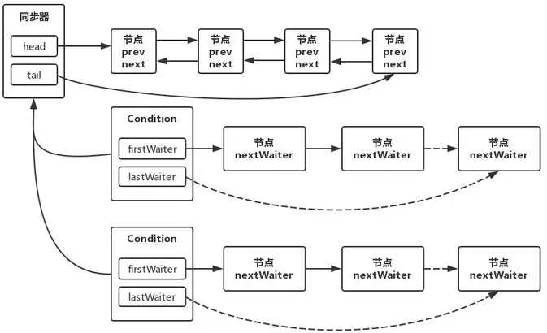

# Java并发之Lock原理解析

同步器是实现锁的关键，利用同步器将锁的语义实现，然后在锁的实现中聚合同步器。可以这样理解：锁的API是面向使用者的，它定义了与锁交互的公共行为，而每个锁需要完成特定的操作也是透过这些行为来完成的（比如：可以允许两个线程进行加锁，排除两个以上的线程），但是实现是依托给同步器来完成；同步器面向的是线程访问和资源控制，它定义了线程对资源是否能够获取以及线程的排队等操作。锁和同步器很好的隔离了二者所需要关注的领域，严格意义上讲，同步器可以适用于除了锁以外的其他同步设施上（包括锁）。

`AbstractQueuedSynchronizer`提供了一个基于FIFO队列，可以用于构建锁或者其他相关同步装置\(Lock, Semaphore, Latch, Barrier\)的基础框架。`AbstractQueuedSynchronizer`的子类推荐作为为自定义同步装置的内部类，同步器自身没有实现任何同步接口，它仅仅是定义了若干acquire之类的方法来供使用。该同步器即可以作为互斥模式也可以作为共享模式，当它被定义为一个互斥模式时，其他线程对其的获取就被阻止，而共享模式对于多个线程获取都可以成功。

<!--more-->

## AbstractQueuedSynchronizer的数据结构

`AbstractQueuedSynchronizer`利用了一个int来表示状态，期望它能够成为实现大部分同步需求的基础。使用的方法是继承，子类通过继承同步器并需要实现它的方法来管理其状态，管理的方式就是通过类似acquire和release的方式来操纵状态。然而多线程环境中对状态的操纵必须确保原子性，因此子类对于状态的把握，需要使用这个同步器提供的以下三个方法对状态进行操作：

```java
java.util.concurrent.locks.AbstractQueuedSynchronizer.getState()
java.util.concurrent.locks.AbstractQueuedSynchronizer.setState(int)
java.util.concurrent.locks.AbstractQueuedSynchronizer.compareAndSetState(int, int)
```

类似模板模式，AQS暴露给子类一些方法实现(如tryAcquire，tryRelease), 获取操作通常是依赖state状态的，当状态允许时获取成功否则加入等待队列一直等待到允许的状态发生时重新获取，\(读锁的state是资源许可数，写锁是重入数\)例如，Semaphore中当state(即许可数量)小于等于0时，获取不能成功。释放操作通过会修改状态并判断是否能让其他等待的线程能够重新获取，例如ReentrantLock中释放会减少重入次数并检查重入次数是否达到了0，达到0说明已经解锁，这时会通知其他等待线程重新获取。

同步器的实现依赖于一个FIFO队列，那么队列中的元素Node就是保存着线程引用和线程状态的容器，每个线程对同步器的访问，都可以看做是队列中的一个节点。Node的主要包含以下成员变量：

```java
class Node {
  // 一个标识符，指示节点使用共享模式等待
  static final Node SHARED = new Node();
  // 一个标识符，指示节点使用独占模式等待
  static final Node EXCLUSIVE = null;
  // 等待状态值，表示线程已被取消
  static final int CANCELLED =  1;
  // 等待状态值,表示继任的线程需要取消阻塞
  // 当前节点的后继节点已经通过park阻塞，因此当当前节点释放或取消时必须unpark他的后继节点
  static final int SIGNAL    = -1;
  // 等待状态值,表示线程由于阻塞而等待
  static final int CONDITION = -2;
  // 等待状态值,表示处于共享模式下，下一次的acquireShared无条件的传播
  static final int PROPAGATE = -3;
  // 节点当前等待状态值, 0:None of the above
  volatile int waitStatus;
  // 前驱节点
  volatile Node prev;
  // 后继节点
  volatile Node next;
  // 当前线程
  volatile Thread thread;
  // 指向下一个处于阻塞等待的节点
  Node nextWaiter;
}
```

### 线程等待队列

AQS的核心是一个线程等待队列，采用的是一个先进先出FIFO队列,AQS基于CLH进行修改作为线程等待队列。

CLH队列使用pred引用前节点形成一个队列，入队enqueue和出队dequeue操作都可以通过原子操作完成。初始化时，head和tail都会指向一个dummy节点,CLH队列的入队一个新的Node可以用伪代码来表示:

```java
do{
    node.pred = tail;
} while(!tail.compareAndSet(pred, node));
```

每个节点的释放状态由前置节点存放，所以spinlock的自旋可以表示为: 

```java
while(node.pred.status != RELEASED) {
    // spin
}
```

出队可以通过更新head来完成，通过将head设置为刚刚获得锁的节点`head = node`。

CLH队列有很多优点，包括入队和出队非常快、无锁、非阻塞，并且是否有线程等待只需要判断head和tail是否相等。
CLH中并没有只有向后的指针引用后继节点，每个节点只需要修改自己的状态就能通知后继节点。但是在AQS这样的阻塞同步器中，需要主动唤醒(unpark)后继节点。所以在AQS中增加了next引用引用后继节点，但是并没有合适的方法使用CAS进行无锁插入双向链表的方法，所以节点的插入并不是原子完成的，需要在CAS替换tail完成后调用pred.next=node。

```java
while(true) {
    t = tail;
    node.pred = t;
    if (tail.compareAndSet(t, node)) {
        t.next = node;
        break;
    }
}
// 详细代码见 enq()）
```

> 所以next节点为null并不能表示这个节点是尾节点，next引用只能当做是一个优化路径，当next节点不存在或是被撤销时，需要从tail开始使用pred进行反向遍历来进行精确的check。

另外一个改动是使用Node中的status状态来控制阻塞而不是像CLH中控制自旋，但是在AQS中这个状态并不能表示这个线程能从acquire操作中返回，在AQS中排队的线程只有在通过了子类实现的tryAcquire方法后才能从acquire中返回，所以这个阻塞状态只能说明这个活跃线程队列的头结点的时候可以去调用tryAcquire方法，如果失败了还需要重新阻塞。

## AbstractQueuedSynchronizer暴露的API

AQS仅仅只是提供独占锁和共享锁两种方式，但是每种方式都有响应中断和不响应中断的区别，所以说AQS锁的更细粒度的划分为：

* 不响应中断的独占锁(acquire)
* 响应中断的独占锁(acquireInterruptibly)
* 不响应中断的共享锁(acquireShared)
* 响应中断的共享锁(acquireSharedInterruptibly)

而释放锁的方式只有两种，独占锁的释放与共享锁的释放。分别为：

* 独占锁的释放(release)
* 共享锁的释放(releaseShared)

### “不响应中断的独占锁”模式

在AQS中，“不响应中断的独占锁”模式的获取锁的的入口是以下方法:

```java
public final void acquire(int arg) {
  if (!tryAcquire(arg) && acquireQueued(addWaiter(Node.EXCLUSIVE), arg))
    selfInterrupt();
}

static void selfInterrupt() {
  Thread.currentThread().interrupt();
}
```

tryAcquire方法是子类实现的一个方法，如果tryAcquire返回的是true，即表明当前线程获得了锁，自然也就不需要构建数据结构进行阻塞等待。如果tryAcquire方法返回的是false，那么当前线程没有获得锁，接着执行"acquireQueued(addWaiter(Node.EXCLUSIVE), arg))"这句代码，这句话很明显，它是由两步构成的：

1. addWaiter(Node.EXCLUSIVE), arg)，将当前线程封装成一个节点，添加到“等待锁的线程队列”中去。
2. acquireQueued，当前线程所在节点目前在“等待锁的线程队列”中，当前线程仍然尝试从等待队列中去获取锁。

具体分析addWaiter(Node.EXCLUSIVE), arg)流程：

```java
private Node addWaiter(Node mode) {
    Node node = new Node(Thread.currentThread(), mode);
    // Try the fast path of enq; backup to full enq on failure
    Node pred = tail;
    if (pred != null) {
        node.prev = pred;
        if (compareAndSetTail(pred, node)) {
            pred.next = node;
            return node;
        }
    }
    enq(node);
    return node;
}
```

我们给addWaiter传递的参数是Node.EXCLUSIVE，从传入的参数我们知道这是独占模式的。并且获取当前线程thread，将当前线程thread以及EXCLUSIVE独占模式，构造成一个节点Node。构造完成之后，需要入队，即加入到“等待锁的线程队列CLH”中。

如何入队？首先尝试的是快速入队。何为快速入队？直接把我们刚才构造的node的前驱指针指向当前尾节点，然后通过CAS操作把我们刚才构造的node作为新的尾节点，最后再把原来老的尾节点的后继指针指向现在的新的尾节点。说了那么多，那么快速入队的大前提是什么？那就是这个“等待锁的线程队列CLH”必须先存在。

如果不存在，那么只能走常规的入队操作流程，也就是进入到enq(node)方法中。从这里我们也可以知道，其实enq(node)在AQS的整个生命周期中只会执行一次，因为只有第一次初始化“等待锁的线程队列CLH”才会走到这里，后来的入队都会走“快速入队”流程。假设我们这里还没有“等待锁的线程队列CLH”，即当前的tail节点为null，那么就会进入enq(node)方法。

下面我们看下enq(node)方法的源代码:

```java
private Node enq(final Node node) {
    for (;;) {
        Node t = tail;
        if (t == null) { // Must initialize
            if (compareAndSetHead(new Node()))
                tail = head;
        } else {
            node.prev = t;
            if (compareAndSetTail(t, node)) {
                t.next = node;
                return t;
            }
        }
    }
}
```

如果尾节点为空，即当前数据结构中没有节点，那么new一个不带任何状态的Node作为头节点，并且将head赋值给tail。如果尾节点不为空，那么并发下使用CAS算法将当前Node追加成为尾节点，由于是一个for(;;)循环，因此所有没有成功acquire的Node最终都会被追加到数据结构中。

acquireQueued(final Node node, int arg)流程：

```java
final boolean acquireQueued(final Node node, int arg) {
    boolean failed = true;
    try {
        boolean interrupted = false;
        for (;;) {
            // 获取node的前驱节点
            final Node p = node.predecessor();
            if (p == head && tryAcquire(arg)) {
                //前驱是头结点且获得锁
                setHead(node);
                p.next = null; // help GC
                failed = false;
                return interrupted;
            }
            if (shouldParkAfterFailedAcquire(p, node) &&
                parkAndCheckInterrupt())
                interrupted = true;
        }
    } finally {
        if (failed)
            cancelAcquire(node); // Cancels an ongoing attempt to acquire.
    }
}

private void setHead(Node node) {
    head = node;
    node.thread = null;
    node.prev = null;
}
```

如果当前线程所在节点的前继节点是head节点，那么当前节点就再次的tryAcquire了一次。如果当前线程所在节点tryAcquire成功了，那么执行setHead方法，将当前节点作为head、将当前节点中的thread设置为null、将当前节点的prev设置为null，这保证了数据结构中头结点永远是一个不带Thread的空节点。

如果当前线程所在节点的前继节点不是head节点或者当前线程所在节点tryAcquire失败了，那么它就需要判断自己需不需要进行阻塞了，因为至少到目前为止，它真的没有机会再去获取锁了。当前线程进行阻塞的大前提是，需要寻找一个前继节点的waitStatus为SIGNAL的节点，这是AQS约定的。只有自己节点的前继节点的waitStatus是SIGNAL，我这个节点才可以安心的去阻塞。因为我的前继节点的waitStatus是SIGNAL，就相当于我告诉了我的前继节点，我将要去阻塞了。

shouldParkAfterFailedAcquire(Node pred, Node node)源码：

```java
private static boolean shouldParkAfterFailedAcquire(Node pred, Node node) {
    int ws = pred.waitStatus;
    if (ws == Node.SIGNAL)
        /*
          * This node has already set status asking a release
          * to signal it, so it can safely park.
          */
        return true;
    if (ws > 0) {
        /*
          * 前驱节点终止了. 跳过前驱节点，再尝试
          * 此处删除了无效的线程终止节点
          */
        do {
            node.prev = pred = pred.prev;
        } while (pred.waitStatus > 0);
        pred.next = node;
    } else {
        // 找到一个前驱节点waitStats不是CANCELLED的并且最靠近head节点的那一个为止
        // 用CAS机制把前驱节点的waitStatus更新为SIGNAL状态
        compareAndSetWaitStatus(pred, ws, Node.SIGNAL);
    }
    return false;
}

private final boolean parkAndCheckInterrupt() {
    LockSupport.park(this);
    return Thread.interrupted();
}
```

1. 这里会判断当前节点的前驱节点的状态，如果当前节点的前驱节点的waitStatus是SIGNAL，返回true，表示当前节点应当park。这个时候就会调用parkAndCheckInterrupt()方法.当前线程就会被阻塞住。从这个方法还可以看出，如果这个线程被唤醒了，这个线程自己会返回在它阻塞期间有没有被中断过。需要注意的是，Thread.interrupted()会清除当前线程的中断标记位。在acquireQueued(final Node node, int arg)方法中，如果这个线程被唤醒了，并且曾经在阻塞期间被中断过，就将中断标识符interrupted置为true。接着线程又会进入acquireQueued(final Node node, int arg)的for循环中。如果当前这个被唤醒的线程是正常被唤醒的，那么它的前继节点就应该是head，这个时候当前被唤醒的线程就会执行tryAcquire方法去获取锁。如果假设它获取锁成功了，那么它会把自己设置为head节点，并且把head节点的持有线程设置为null，以保持head节点是dummy节点，接着当前线程就去做自己的业务了。

2. 如果当前节点的前驱节点的waitStatus>0，相当于CANCELLED（因为状态值里面只有CANCELLED是大于0的），那么CANCELLED的节点作废，当前节点不断向前找并重新连接为双向队列，直到找到一个前驱节点waitStats不是CANCELLED的并且最靠近head节点的那一个为止。它的前驱节点不是SIGNAL状态且waitStatus<=0，利用CAS机制把前驱节点的waitStatus更新为SIGNAL状态。在这种情况下parkAndCheckInterrupt返回的是false，也就是说当前节点持有的线程还是不死心，它还需要最后一次tryAcquire，这也是它最后的一次挣扎的机会了。如果这一次失败了，就必须进行阻塞。

这里针对acquire做一下总结：

1. 状态的维护；需要在锁定时，需要维护一个状态(int类型)，而对状态的操作是原子和非阻塞的，通过同步器提供的对状态访问的方法对状态进行操纵，并且利用compareAndSet来确保原子性的修改。
2. 状态的获取；一旦成功的修改了状态，当前线程或者说节点，就被设置为头节点。
3. sync队列的维护。在获取资源未果的过程中条件不符合的情况下(不该自己，前驱节点不是头节点或者没有获取到资源)进入睡眠状态，停止线程调度器对当前节点线程的调度。这时引入的一个释放的问题，也就是说使睡眠中的Node或者说线程获得通知的关键，就是前驱节点的通知，而这一个过程就是释放，释放会通知它的后继节点从睡眠中返回准备运行。


如上图所示，其中的判定退出队列的条件，判定条件是否满足和休眠当前线程就是完成了自旋spin的过程。

***下面来看看release()操作***

此方法是独占模式下线程释放共享资源的顶层入口。它会释放指定量的资源，如果彻底释放了（即state=0）,它会唤醒等待队列里的其他线程来获取资源。下面是release()的源码：

```java
public final boolean release(int arg) {
    if (tryRelease(arg)) {
        Node h = head;
        if (h != null && h.waitStatus != 0)
            unparkSuccessor(h);
        return true;
    }
    return false;
}
```

调用tryRelease来释放资源。有一点需要注意的是，它是根据tryRelease的返回值来判断该线程是否已经完成释放掉资源了！所以自定义同步器在设计tryRelease的时候要明确这一点！！跟tryAcquire一样，这个方法是需要独占模式的自定义同步器去实现的。正常来说，tryRelease都会成功的，因为这是独占模式，该线程来释放资源，那么它肯定已经拿到独占资源了，直接减掉相应量的资源即可(state-=arg)，也不需要考虑线程安全的问题。但要注意它的返回值，上面已经提到了，release是根据tryRelease的返回值来判断该线程是否已经完成释放掉资源了！所以自定义同步器在实现时，如果已经彻底释放资源(state=0)，要返回true，否则返回false。如果没有彻底释放资源，也就是出现了重入的情况，需要多次释放。如果释放成功了，我们就需要唤醒head节点的下一个节点所持有的线程。基本逻辑如下:

1. 首先拿到head节点，判断head节点不等于null，并且head节点的waitStatus是不等于0的话，就去唤醒head节点的下一个节点所持有的线程。
2. 调用unparkSuccessor(Node node)方法唤醒head节点的下一个节点所持有的线程。

接下来看下unparkSuccessor(Node node)方法的源代码：

```java
private void unparkSuccessor(Node node) {
  /*
    * If status is negative (i.e., possibly needing signal) try
    * to clear in anticipation of signalling.  It is OK if this
    * fails or if status is changed by waiting thread.
    */
  int ws = node.waitStatus;
  if (ws < 0)
      compareAndSetWaitStatus(node, ws, 0);

  /*
    * Thread to unpark is held in successor, which is normally
    * just the next node.  But if cancelled or apparently null,
    * traverse backwards from tail to find the actual
    * non-cancelled successor.
    */
  Node s = node.next;
  if (s == null || s.waitStatus > 0) {
      s = null;
      for (Node t = tail; t != null && t != node; t = t.prev)
          if (t.waitStatus <= 0)
              s = t;
  }
  if (s != null)
      LockSupport.unpark(s.thread);
}
```

用unpark()唤醒等待队列中最前边的那个未放弃的线程，这里我们也用s来表示吧。此时，再和acquireQueued()联系起来，s被唤醒后，进入if (p == head && tryAcquire(arg))的判断（即使p!=head也没关系，它会再进入shouldParkAfterFailedAcquire()寻找一个安全点。这里既然s已经是等待队列中最前边的那个未放弃的线程了，那么通过shouldParkAfterFailedAcquire()的调整，s也必然会跑到head的next结点，下一次自旋p==head就成立啦），然后s把自己设置成head标杆结点，表示自己已经获取到资源了，acquire()也返回了！

### “响应中断的独占锁”模式

```java
// 用于实现Lock的lockInterruptibly方法
public final void acquireInterruptibly(int arg)
        throws InterruptedException {
    if (Thread.interrupted())
        throw new InterruptedException();
    if (!tryAcquire(arg))
        doAcquireInterruptibly(arg);
}
```

tryAcquire方法前面说过了，是子类实现的一个方法，如果tryAcquire返回的是true，即表明当前线程获得了锁，自然也就不需要构建数据结构进行阻塞等待。如果tryAcquire方法返回的是false，那么当前线程没有获得锁，接着执行"doAcquireInterruptibly(int arg)"这句代码。所有的这一切都是基于当前线程没有被interrupted的。

doAcquireInterruptibly(int arg)流程：

```java
private void doAcquireInterruptibly(int arg) throws InterruptedException {
  final Node node = addWaiter(Node.EXCLUSIVE);
  boolean failed = true;
  try {
      for (;;) {
          final Node p = node.predecessor();
          if (p == head && tryAcquire(arg)) {
              setHead(node);
              p.next = null; // help GC
              failed = false;
              return;
          }
          if (shouldParkAfterFailedAcquire(p, node) &&
              parkAndCheckInterrupt())
              throw new InterruptedException(); // 此处是区别，响应中断
      }
  } finally {
      if (failed)
          cancelAcquire(node);
  }
}
```

与上面提到的`acquireQueued()`方法的区别在于阻塞的线程被唤醒后会抛出中断异常。

### “不响应中断的共享锁”模式

> 共享模式和之前的独占模式有所区别。以文件的查看为例，如果一个程序在对其进行读取操作，那么这一时刻，对这个文件的写操作就被阻塞，相反，这一时刻另一个程序对其进行同样的读操作是可以进行的。如果一个程序在对其进行写操作，那么所有的读与写操作在这一时刻就被阻塞，直到这个程序完成写操作。

“不响应中断的共享锁”模式的获取锁的的入口是以下方法:

```java
public final void acquireShared(int arg) {
    if (tryAcquireShared(arg) < 0)
        doAcquireShared(arg);
}
```

tryAcquireShared是共享方式尝试获取资源。负数表示失败；0表示成功，但没有剩余可用资源；正数表示成功，且有剩余资源。如果tryAcquireShared返回的是负数，即表明当前线程获取锁失败，自然也就需要构建数据结构进行阻塞等待，此时需要进入到doAcquireShared方法了。如果tryAcquireShared方法返回的是正数，那么当前线程已经获得了锁，则直接跳过，去执行自己的业务。

如果tryAcquireShared返回的是负数, 那么流程会走doAcquireShared方法：

```java
private void doAcquireShared(int arg) {
  final Node node = addWaiter(Node.SHARED);
  boolean failed = true;
  try {
      boolean interrupted = false;
      for (;;) {
          final Node p = node.predecessor();
          if (p == head) {
              int r = tryAcquireShared(arg);
              if (r >= 0) {
                  setHeadAndPropagate(node, r);
                  p.next = null; // help GC
                  if (interrupted)
                      selfInterrupt();
                  failed = false;
                  return;
              }
          }
          if (shouldParkAfterFailedAcquire(p, node) &&
              parkAndCheckInterrupt())
              interrupted = true;
      }
  } finally {
      if (failed)
          cancelAcquire(node);
  }
}
```

* 在方法内部，我们将当前线程封装成了一个Node.SHARED节点。构造完成之后，将该节点入队;
* 如果当前线程所在节点的前继节点是head节点，那么当前节点就再次的tryAcquireShared了一次。如果tryAcquireShared的返回值是大于等于0的，就证明当前线程成功的获取了共享锁，那么执行setHeadAndPropagate方法，将当前节点作为head、将当前节点中的thread设置为null、将当前节点的prev设置为null，这保证了数据结构中头结点永远是一个不带Thread的空节点。其中setHeadAndPropagate方法的第二个参数是tryAcquireShared方法的返回值，我们知道: 负数表示失败；0表示成功，但没有剩余可用资源；正数表示成功，且有剩余资源。

```java
private void setHeadAndPropagate(Node node, int propagate) {
    Node h = head; // Record old head for check below
    setHead(node);
    /*
      * Try to signal next queued node if:
      *   Propagation was indicated by caller,
      *     or was recorded (as h.waitStatus either before
      *     or after setHead) by a previous operation
      *     (note: this uses sign-check of waitStatus because
      *      PROPAGATE status may transition to SIGNAL.)
      * and
      *   The next node is waiting in shared mode,
      *     or we don't know, because it appears null
      *
      * The conservatism in both of these checks may cause
      * unnecessary wake-ups, but only when there are multiple
      * racing acquires/releases, so most need signals now or soon
      * anyway.
      */
    if (propagate > 0 || h == null || h.waitStatus < 0 ||
        (h = head) == null || h.waitStatus < 0) {
        Node s = node.next;
        if (s == null || s.isShared())
            doReleaseShared();
    }
}

private void setHead(Node node) {
    head = node;
    node.thread = null;
    node.prev = null;
}
```

> 当propagate大于0的时候，就证明我们现在共享锁的资源充足，可能目前有线程阻塞在队列中，我们需要去唤醒当前节点的下一个节点，这就是共享锁唤醒的传播性。

* 如果当前线程所在节点的前继节点不是head节点，那么它就需要判断自己需不需要进行阻塞了，因为至少到目前为止，它真的没有机会再去获取锁了。当前线程进行阻塞的大前提是，需要寻找一个前继节点的waitStatus为SIGNAL的节点，这是AQS约定的。只有自己节点的前继节点的waitStatus是SIGNAL，我这个节点才可以安心的去阻塞。因为我的前继节点的waitStatus是SIGNAL，就相当于我告诉了我的前继节点，我将要去阻塞了，到时候请唤醒我。

`releaseShared()`是共享模式下线程释放共享资源的顶层入口。它会释放指定量的资源，如果彻底释放了（即state=0）,它会唤醒等待队列里的其他线程来获取资源。

```java
public final boolean releaseShared(int arg) {
    if (tryReleaseShared(arg)) {
        doReleaseShared();
        return true;
    }
    return false;
}

private void doReleaseShared() {
  /*
    * Ensure that a release propagates, even if there are other
    * in-progress acquires/releases.  This proceeds in the usual
    * way of trying to unparkSuccessor of head if it needs
    * signal. But if it does not, status is set to PROPAGATE to
    * ensure that upon release, propagation continues.
    * Additionally, we must loop in case a new node is added
    * while we are doing this. Also, unlike other uses of
    * unparkSuccessor, we need to know if CAS to reset status
    * fails, if so rechecking.
    */
  for (;;) {
      Node h = head;
      if (h != null && h != tail) {
          int ws = h.waitStatus;
          if (ws == Node.SIGNAL) {
              if (!compareAndSetWaitStatus(h, Node.SIGNAL, 0))
                  continue;            // loop to recheck cases
              unparkSuccessor(h);
          }
          else if (ws == 0 &&
                    !compareAndSetWaitStatus(h, 0, Node.PROPAGATE))
              continue;                // loop on failed CAS
      }
      if (h == head)                   // loop if head changed
          break;
  }
}
```

释放掉资源后，唤醒后继。跟独占模式下的release()相似，但有一点稍微需要注意：独占模式下的tryRelease()在完全释放掉资源（state=0）后，才会返回true去唤醒其他线程，这主要是基于独占下可重入的考量；而共享模式下的releaseShared()则没有这种要求，共享模式实质就是控制一定量的线程并发执行，那么拥有资源的线程在释放掉部分资源时就可以唤醒后继等待结点。

> 例如，资源总量是13，A（5）和B（7）分别获取到资源并发运行，C（4）来时只剩1个资源就需要等待。A在运行过程中释放掉2个资源量，然后tryReleaseShared(2)返回true唤醒C，C一看只有3个仍不够继续等待；随后B又释放2个，tryReleaseShared(2)返回true唤醒C，C一看有5个够自己用了，然后C就可以跟A和B一起运行。而ReentrantReadWriteLock读锁的tryReleaseShared()只有在完全释放掉资源（state=0）才返回true，所以自定义同步器可以根据需要决定tryReleaseShared()的返回值。

### “响应中断的共享锁”模式

“响应中断的共享锁”模式的获取锁的的入口是以下方法:

```java
public final void acquireSharedInterruptibly(int arg)
        throws InterruptedException {
    if (Thread.interrupted())
        throw new InterruptedException();
    if (tryAcquireShared(arg) < 0)
        doAcquireSharedInterruptibly(arg);
}
private void doAcquireSharedInterruptibly(int arg)
    throws InterruptedException {
    final Node node = addWaiter(Node.SHARED);
    boolean failed = true;
    try {
        for (;;) {
            final Node p = node.predecessor();
            if (p == head) {
                int r = tryAcquireShared(arg);
                if (r >= 0) {
                    setHeadAndPropagate(node, r);
                    p.next = null; // help GC
                    failed = false;
                    return;
                }
            }
            if (shouldParkAfterFailedAcquire(p, node) &&
                parkAndCheckInterrupt())
                throw new InterruptedException();  // 此处不同的处理
        }
    } finally {
        if (failed)
            cancelAcquire(node);
    }
}
```
## 可重入锁

ReentrantLock实现了Lock接口，Lock接口中定义了lock与unlock相关操作，并且还存在newCondition方法，表示生成一个条件。

重入锁相比 synchronized 有哪些优势：

* 可以在线程等待锁的时候中断线程\(`lockInterruptibly`\)，synchronized 是做不到的。
* 可以尝试获取锁，如果获取不到就放弃，或者设置一定的时间，这也是 synchroized 做不到的。
* 可以设置公平锁，synchronized 默认是非公平锁，无法实现公平锁。

### 公平与非公平

ReentrantLock类内部总共存在Sync、NonfairSync、FairSync三个类，NonfairSync与FairSync类继承自Sync类，Sync类继承自AbstractQueuedSynchronizer抽象类。ReentrantLock还提供了公平锁和非公平锁的选择，构造方法接受一个可选的公平参数（默认非公平锁），当设置为true时，表示公平锁，否则为非公平锁。公平锁与非公平锁的区别在于公平锁的锁获取是有顺序的。但是公平锁的效率往往没有非公平锁的效率高，在许多线程访问的情况下，公平锁表现出较低的吞吐量。

```java
abstract static class Sync extends AbstractQueuedSynchronizer {
  /**
    * Performs {@link Lock#lock}. The main reason for subclassing
    * is to allow fast path for nonfair version.
    */
  abstract void lock();

  /**
    * Performs non-fair tryLock.  tryAcquire is implemented in
    * subclasses, but both need nonfair try for trylock method.
    */
  final boolean nonfairTryAcquire(int acquires) {
      final Thread current = Thread.currentThread();
      int c = getState();
      if (c == 0) { // 可以获得锁
          if (compareAndSetState(0, acquires)) {
              setExclusiveOwnerThread(current);
              return true;
          }
      }
      else if (current == getExclusiveOwnerThread()) { // 重入
          int nextc = c + acquires;
          if (nextc < 0) // overflow 锁的最大上限int.max
              throw new Error("Maximum lock count exceeded");
          setState(nextc);
          return true;
      }
      return false;
  }

  protected final boolean tryRelease(int releases) {
      int c = getState() - releases;
      if (Thread.currentThread() != getExclusiveOwnerThread())
          throw new IllegalMonitorStateException();
      boolean free = false;
      if (c == 0) {
          free = true;
          setExclusiveOwnerThread(null);
      }
      setState(c);
      return free;
  }
  ...
}
```

#### NonfairSync

```java
static final class NonfairSync extends Sync {
    private static final long serialVersionUID = 7316153563782823691L;

    /**
      * Performs lock.  Try immediate barge, backing up to normal
      * acquire on failure.
      */
    final void lock() {
        if (compareAndSetState(0, 1))
            setExclusiveOwnerThread(Thread.currentThread()); // 非公平锁，不参与队列排队，尝试直接插队
        else
            acquire(1);
    }

    protected final boolean tryAcquire(int acquires) {
        return nonfairTryAcquire(acquires);
    }
}
```

#### FairSync

```java
static final class FairSync extends Sync {
  private static final long serialVersionUID = -3000897897090466540L;

  final void lock() {
      acquire(1); // 公平锁，从队列head开始
  }

  /**
    * Fair version of tryAcquire.  Don't grant access unless
    * recursive call or no waiters or is first.
    */
  protected final boolean tryAcquire(int acquires) {
      final Thread current = Thread.currentThread();
      int c = getState();
      if (c == 0) {
          if (!hasQueuedPredecessors() &&
              compareAndSetState(0, acquires)) {
              setExclusiveOwnerThread(current);
              return true;
          }
      }
      else if (current == getExclusiveOwnerThread()) {
          int nextc = c + acquires;
          if (nextc < 0)
              throw new Error("Maximum lock count exceeded");
          setState(nextc);
          return true;
      }
      return false;
  }
}
```

## 读写锁

所谓读写锁，是对访问资源共享锁和排斥锁，一般的重入性语义为 如果对资源加了写锁，其他线程无法再获得写锁与读锁，但是持有写锁的线程，可以对资源加读锁（锁降级）；如果一个线程对资源加了读锁，其他线程可以继续加读锁。java.util.concurrent.locks中关于多写锁的接口：

```java
public interface ReadWriteLock {
    /**
     * Returns the lock used for reading.
     *
     * @return the lock used for reading.
     */
    Lock readLock();

    /**
     * Returns the lock used for writing.
     *
     * @return the lock used for writing.
     */
    Lock writeLock();
}
```

ReentrantReadWriterLock通过两个内部类实现Lock接口，分别是ReadLock,WriterLock类。与ReentrantLock一样，ReentrantReadWriterLock同样使用自己的内部类Sync（继承AbstractQueuedSynchronizer）实现CLH算法。

```java
/*
* Read vs write count extraction constants and functions.
* Lock state is logically divided into two unsigned shorts:
* The lower one representing the exclusive (writer) lock hold count,
* and the upper the shared (reader) hold count.
*/

static final int SHARED_SHIFT   = 16;
static final int SHARED_UNIT    = (1 << SHARED_SHIFT);
static final int MAX_COUNT      = (1 << SHARED_SHIFT) - 1;
static final int EXCLUSIVE_MASK = (1 << SHARED_SHIFT) - 1;

/** Returns the number of shared holds represented in count  */
static int sharedCount(int c)    { return c >>> SHARED_SHIFT; }
/** Returns the number of exclusive holds represented in count  */
static int exclusiveCount(int c) { return c & EXCLUSIVE_MASK; }
```

ReentrantReadWriterLock使用一个32位的int类型来表示锁被占用的线程数\(AbstractQueuedSynchronizer中的state\)，高16位用来表示读锁占有的线程数量，用低16位表示写锁被同一个线程申请的次数。

* SHARED_SHIFT，表示读锁占用的位数，常量16
* SHARED_UNIT，增加一个读锁，按照上述设计，就相当于增加 SHARED_UNIT；
* MAX_COUNT,表示申请读锁最大的线程数量，为65535
* EXCLUSIVE_MASK,表示计算写锁的具体值时，该值为 15个1,用 getState & EXCLUSIVE_MASK算出写锁的线程数，大于1表示重入。

比如，现在当前，申请读锁的线程数为13个，写锁一个，那state怎么表示？

上文说过，用一个32位的int类型的高16位表示读锁线程数，13的二进制为`1101`,那state的二进制表示为 `00000000 00001101 00000000 00000001`，十进制数为851969， 接下在具体获取锁时，需要根据这个851968这个值得出上文中的 13 与 1。要算成13，只需要将state 无符号向左移位16位置，得出`00000000 00001101`，就出13，根据851969要算成低16位置，只需要用该`00000000 00001101 00000000 00000001` & `111111111111111`（15位），就可以得出`00000001`,就是利用了1&1得1,1&0得0这个技巧。

```java
/**
    * The number of reentrant read locks held by current thread.
    * Initialized only in constructor and readObject.
    * Removed whenever a thread's read hold count drops to 0.
    */
private transient ThreadLocalHoldCounter readHolds;

/**
    * The hold count of the last thread to successfully acquire
    * readLock. This saves ThreadLocal lookup in the common case
    * where the next thread to release is the last one to
    * acquire. This is non-volatile since it is just used
    * as a heuristic, and would be great for threads to cache.
    *
    * <p>Can outlive the Thread for which it is caching the read
    * hold count, but avoids garbage retention by not retaining a
    * reference to the Thread.
    *
    * <p>Accessed via a benign data race; relies on the memory
    * model's final field and out-of-thin-air guarantees.
    */
private transient HoldCounter cachedHoldCounter;

/**
    * firstReader is the first thread to have acquired the read lock.
    * firstReaderHoldCount is firstReader's hold count.
    *
    * <p>More precisely, firstReader is the unique thread that last
    * changed the shared count from 0 to 1, and has not released the
    * read lock since then; null if there is no such thread.
    *
    * <p>Cannot cause garbage retention unless the thread terminated
    * without relinquishing its read locks, since tryReleaseShared
    * sets it to null.
    *
    * <p>Accessed via a benign data race; relies on the memory
    * model's out-of-thin-air guarantees for references.
    *
    * <p>This allows tracking of read holds for uncontended read
    * locks to be very cheap.
    */
private transient Thread firstReader = null;
private transient int firstReaderHoldCount;
```

上述这4个变量，其实就是完成一件事情，将获取读锁的线程放入线程本地变量(ThreadLocal)，方便从整个上 下文，根据当前线程获取持有锁的次数信息。其实 firstReader,firstReaderHoldCount ,cachedHoldCounter 这三个变量就是为readHolds变量服务的，是一个优化手段，尽量减少直接使用readHolds.get方法的次数，firstReader与firstReadHoldCount保存第一个获取读锁的线程，也就是readHolds中并不会保存第一个获取读锁的线程；cachedHoldCounter 缓存的是最后一个获取线程的HolderCount信息，该变量主要是在如果当前线程多次获取读锁时，减少从readHolds中获取HoldCounter的次数。

### sync

```java
 /**
    * Returns true if the current thread, when trying to acquire
    * the read lock, and otherwise eligible to do so, should block
    * because of policy for overtaking other waiting threads.
    */
abstract boolean readerShouldBlock();

/**
    * Returns true if the current thread, when trying to acquire
    * the write lock, and otherwise eligible to do so, should block
    * because of policy for overtaking other waiting threads.
    */
abstract boolean writerShouldBlock();
```

Sync中提供了很多方法，但是有两个方法是抽象的，子类必须实现。

#### 公平

```java
final boolean writerShouldBlock() {
    return hasQueuedPredecessors();
}
final boolean readerShouldBlock() {
    return hasQueuedPredecessors();
}
//// --> call AbstractQueuedSynchronizer.hasQueuedPredecessors
public final boolean hasQueuedPredecessors() {
    // The correctness of this depends on head being initialized
    // before tail and on head.next being accurate if the current
    // thread is first in queue.
    Node t = tail; // Read fields in reverse initialization order
    Node h = head;
    Node s;
    return h != t &&
        ((s = h.next) == null || s.thread != Thread.currentThread());
}
```

writerShouldBlock和readerShouldBlock方法都表示当有别的线程也在尝试获取锁时，是否应该阻塞。 
对于公平模式，hasQueuedPredecessors()方法表示前面是否有等待线程。一旦前面有等待线程，那么为了遵循公平，当前线程也就应该被挂起。

#### 非公平

```java
final boolean writerShouldBlock() {
    return false; // writers can always barge
}
final boolean readerShouldBlock() {
    /* As a heuristic to avoid indefinite writer starvation,
        * block if the thread that momentarily appears to be head
        * of queue, if one exists, is a waiting writer.  This is
        * only a probabilistic effect since a new reader will not
        * block if there is a waiting writer behind other enabled
        * readers that have not yet drained from the queue.
        */
    return apparentlyFirstQueuedIsExclusive();   //该方法，具体又是在 AbstractQueuedSynchronizer中
}
//// --> call AbstractQueuedSynchronizer.apparentlyFirstQueuedIsExclusive
/**
     * Returns {@code true} if the apparent first queued thread, if one
     * exists, is waiting in exclusive mode.  If this method returns
     * {@code true}, and the current thread is attempting to acquire in
     * shared mode (that is, this method is invoked from {@link
     * #tryAcquireShared}) then it is guaranteed that the current thread
     * is not the first queued thread.  Used only as a heuristic in
     * ReentrantReadWriteLock.
     */
    final boolean apparentlyFirstQueuedIsExclusive() {
        Node h, s;
        return (h = head) != null &&
            (s = h.next)  != null &&
            !s.isShared()         &&
            s.thread != null;
    }
```

可以看到，非公平模式下，writerShouldBlock直接返回false，说明不需要阻塞；

而readShouldBlock调用了apparentFirstQueuedIsExcluisve()方法。即判断阻塞队列中 head 的第一个后继节点是否是来获取写锁的，如果是的话，让这个写锁先来，避免写锁饥饿。

- 如果当前占据的锁是读锁，那么紧接着的下一个读线程不应排队，排队s若不为null，`!s.isShared()`一定是true。当前线程需要排队。  
- 如果当前占据的锁是写锁，那么一定是当前线程占据了写锁，同时在申请读锁。如果此时下一个是写线程在等待，当前线程需要排队。

排队的原因，在注释中有说，为了防止等待写锁线程的无限饥饿

### ReadLock

```java
/**
    * Acquires the read lock.
    *
    * <p>Acquires the read lock if the write lock is not held by
    * another thread and returns immediately.
    *
    * <p>If the write lock is held by another thread then
    * the current thread becomes disabled for thread scheduling
    * purposes and lies dormant until the read lock has been acquired.
    */
public void lock() {
    sync.acquireShared(1);
}
//// --> call AbstractQueuedSynchronizer.acquireShared
public final void acquireShared(int arg) {
    if (tryAcquireShared(arg) < 0)
        doAcquireShared(arg);
    // 在 AQS 中，如果 tryAcquireShared(arg) 方法返回值小于 0 代表没有获取到共享锁(读锁)，大于 0 代表获取到
}
//// --> call ReentrantReadWriteLock.Sync.tryAcquireShared
protected final int tryAcquireShared(int unused) {
    /*
        * Walkthrough:
        * 1. If write lock held by another thread, fail.
        * 2. Otherwise, this thread is eligible for
        *    lock wrt state, so ask if it should block
        *    because of queue policy. If not, try
        *    to grant by CASing state and updating count.
        *    Note that step does not check for reentrant
        *    acquires, which is postponed to full version
        *    to avoid having to check hold count in
        *    the more typical non-reentrant case.
        * 3. If step 2 fails either because thread
        *    apparently not eligible or CAS fails or count
        *    saturated, chain to version with full retry loop.
        */
    Thread current = Thread.currentThread();
    int c = getState(); // 获取当前锁状态
    if (exclusiveCount(c) != 0 &&     // 有线程已经抢占了写锁
        getExclusiveOwnerThread() != current)  // 写线程不是当前线程
        return -1;  // 返回-1，进入lock等待队列  
    int r = sharedCount(c); // 获取当前读线程数
    if (!readerShouldBlock() &&  // 当前读线程是否应当排队
        r < MAX_COUNT &&  
        compareAndSetState(c, c + SHARED_UNIT)) { // cas 新增读状态成功
        if (r == 0) { // 如果r=0, 表示，当前线程为第一个获取读锁的线程
            firstReader = current;
            firstReaderHoldCount = 1; // 如果第一个获取读锁的对象为当前对象，将firstReaderHoldCount 加一
        } else if (firstReader == current) {
            firstReaderHoldCount++;
        } else {
            // 如果不是第一个获取多锁的线程，将该线程持有锁的次数信息，放入线程本地变量中，方便在整个请求上下文（请求锁、释放锁等过程中）使用持有锁次数信息
            HoldCounter rh = cachedHoldCounter;
            if (rh == null || rh.tid != getThreadId(current))
                cachedHoldCounter = rh = readHolds.get();
            else if (rh.count == 0)
                readHolds.set(rh);
            rh.count++;
        }
        return 1; // 成功获取锁
    }
    return fullTryAcquireShared(current);
}
```
获取读锁失败后的操作
```java
/**
    * Full version of acquire for reads, that handles CAS misses
    * and reentrant reads not dealt with in tryAcquireShared.
    */
// 第一次尝试获取读锁失败后
final int fullTryAcquireShared(Thread current) {
    /*
        * This code is in part redundant with that in
        * tryAcquireShared but is simpler overall by not
        * complicating tryAcquireShared with interactions between
        * retries and lazily reading hold counts.
        */
    HoldCounter rh = null;
    for (;;) {
        int c = getState();
        if (exclusiveCount(c) != 0) {
            if (getExclusiveOwnerThread() != current)
                return -1;
                // 如果当前线程不是写锁的持有者，直接返回-1，
                // 结束尝试获取读锁，需要排队去申请读锁。
            // else we hold the exclusive lock; blocking here
            // would cause deadlock.
        } else if (readerShouldBlock()) {
            // readerShouldBlock() 为 true，说明阻塞队列中有其他线程在等待
            // Make sure we're not acquiring read lock reentrantly
            if (firstReader == current) {
                // firstReader 线程重入读锁，直接到下面的 CAS
                // assert firstReaderHoldCount > 0;
            } else {
                if (rh == null) {
                    rh = cachedHoldCounter;
                    if (rh == null || rh.tid != getThreadId(current)) {
                        rh = readHolds.get();
                        if (rh.count == 0)
                        // 如果发现 count == 0，也就是说，纯属上一行代码初始化的，那么执行 remove
                            readHolds.remove();
                    }
                }
                if (rh.count == 0)
                    return -1;
            }
        }
        if (sharedCount(c) == MAX_COUNT)
            throw new Error("Maximum lock count exceeded");
        if (compareAndSetState(c, c + SHARED_UNIT)) { // cas获取读锁
            if (sharedCount(c) == 0) {
                firstReader = current;
                firstReaderHoldCount = 1;
            } else if (firstReader == current) {
                firstReaderHoldCount++;
            } else {
                 // 下面这几行，就是将 cachedHoldCounter 设置为当前线程
                if (rh == null)
                    rh = cachedHoldCounter;
                if (rh == null || rh.tid != getThreadId(current))
                    rh = readHolds.get();
                else if (rh.count == 0)
                    readHolds.set(rh);
                rh.count++;  // 计数+1
                cachedHoldCounter = rh; // cache for release
            }
            return 1; // 成功获得锁
        }
    }
```

下面来看看读锁的释放:

```java
/**
    * Attempts to release this lock.
    *
    * <p>If the number of readers is now zero then the lock
    * is made available for write lock attempts.
    */
public void unlock() {
    sync.releaseShared(1);
}
//// --> call AbstractQueuedSynchronizer.releaseShared
public final boolean releaseShared(int arg) {
    if (tryReleaseShared(arg)) {
        doReleaseShared(); // 唤醒后继节点
        return true;
    }
    return false;
}
//// --> call ReentrantReadWriteLock.Sync.tryReleaseShared
protected final boolean tryReleaseShared(int unused) {
    Thread current = Thread.currentThread();
    if (firstReader == current) {
        // assert firstReaderHoldCount > 0;
        if (firstReaderHoldCount == 1) //如果等于 1，那么这次解锁后就不再持有锁了，把 firstReader 置为 null，给后来的线程用
            firstReader = null;
        else
            firstReaderHoldCount--;
    } else {
        // 判断 cachedHoldCounter 是否缓存的是当前线程，不是的话要到 ThreadLocal 中取
        HoldCounter rh = cachedHoldCounter;
        if (rh == null || rh.tid != getThreadId(current))
            rh = readHolds.get();
        int count = rh.count;
        if (count <= 1) {
            // 这一步将 ThreadLocal remove 掉，防止内存泄漏。因为已经不再持有读锁了
            readHolds.remove();
            if (count <= 0)
                throw unmatchedUnlockException();
        }
        --rh.count;
    }
    for (;;) {
        int c = getState();
        int nextc = c - SHARED_UNIT;
        //nextc 是 state 高 16 位减 1 后的值
        if (compareAndSetState(c, nextc))
            // Releasing the read lock has no effect on readers,
            // but it may allow waiting writers to proceed if
            // both read and write locks are now free.
            // 如果 nextc == 0，那就是 state 全部 32 位都为 0，也就是读锁和写锁都空了
            // 此时这里返回 true 的话，其实是帮助唤醒后继节点中的获取写锁的线程
            return nextc == 0;
    }
}
```

### WriteLock

写锁是独占锁。如果有读锁被占用，写锁获取是要进入到阻塞队列中等待的。

```java
// WriteLock
public void lock() {
    sync.acquire(1);
}
// AQS
public final void acquire(int arg) {
    if (!tryAcquire(arg) &&
        // 如果 tryAcquire 失败，那么进入到阻塞队列等待
        acquireQueued(addWaiter(Node.EXCLUSIVE), arg))
        selfInterrupt();
}

// Sync
protected final boolean tryAcquire(int acquires) {

    Thread current = Thread.currentThread();
    int c = getState();
    int w = exclusiveCount(c);
    if (c != 0) {

        // 看下这里返回 false 的情况：
        //   c != 0 && w == 0: 写锁可用，但是有线程持有读锁(也可能是自己持有)
        //   c != 0 && w !=0 && current != getExclusiveOwnerThread(): 其他线程持有写锁
        //   也就是说，只要有读锁或写锁被占用，这次就不能获取到写锁
        if (w == 0 || current != getExclusiveOwnerThread())
            return false;

        if (w + exclusiveCount(acquires) > MAX_COUNT)
            throw new Error("Maximum lock count exceeded");

        // 这里不需要 CAS，仔细看就知道了，能到这里的，只可能是写锁重入，不然在上面的 if 就拦截了
        setState(c + acquires);
        return true;
    }

    // 如果写锁获取不需要 block，那么进行 CAS，成功就代表获取到了写锁
    if (writerShouldBlock() ||
        !compareAndSetState(c, c + acquires))
        return false;
    setExclusiveOwnerThread(current);
    return true;
}

// unlock
public void unlock() {
    sync.release(1);
}

// AQS
public final boolean release(int arg) {
    // 1. 释放锁
    if (tryRelease(arg)) {
        // 2. 如果独占锁释放"完全"，唤醒后继节点
        Node h = head;
        if (h != null && h.waitStatus != 0)
            unparkSuccessor(h);
        return true;
    }
    return false;
}

// Sync 
// 释放锁，是线程安全的，因为写锁是独占锁，具有排他性
// 实现很简单，state 减 1 就是了
protected final boolean tryRelease(int releases) {
    if (!isHeldExclusively())
        throw new IllegalMonitorStateException();
    int nextc = getState() - releases;
    boolean free = exclusiveCount(nextc) == 0;
    if (free)
        setExclusiveOwnerThread(null);
    setState(nextc);
    // 如果 exclusiveCount(nextc) == 0，也就是说包括重入的，所有的写锁都释放了，
    // 那么返回 true，这样会进行唤醒后继节点的操作。
    return free;
}
```

### 锁降级

Doug Lea 没有说写锁更高级，如果有线程持有读锁，那么写锁获取也需要等待。

不过从源码中也可以看出，确实会给写锁一些特殊照顾，如非公平模式下，为了提高吞吐量，lock 的时候会先 CAS 竞争一下，能成功就代表读锁获取成功了，但是如果发现 head.next 是获取写锁的线程，就不会去做 CAS 操作。

Doug Lea 将持有写锁的线程，去获取读锁的过程称为锁降级（Lock downgrading）。这样，此线程就既持有写锁又持有读锁。

```java
void processCachedData() {
        // 获取读锁
        rwl.readLock().lock();
        if (!cacheValid) { // 如果缓存过期了，或者为 null
            // 释放掉读锁，然后获取写锁 (后面会看到，没释放掉读锁就获取写锁，会发生死锁情况)
            rwl.readLock().unlock();
            rwl.writeLock().lock();

            try {
                if (!cacheValid) { // 重新判断，因为在等待写锁的过程中，可能前面有其他写线程执行过了
                    data = ...
                    cacheValid = true;
                }
                // 获取读锁 (持有写锁的情况下，是允许获取读锁的，称为 “锁降级”，反之不行。)
                rwl.readLock().lock();
            } finally {
                // 释放写锁，此时还剩一个读锁
                rwl.writeLock().unlock(); // Unlock write, still hold read
            }
        }
        try {
            use(data);
        } finally {
            // 释放读锁
            rwl.readLock().unlock();
        }
    }
```


## Condition

条件（也称为条件队列 或条件变量）为线程提供了一个含义，以便在某个状态条件现在可能为 true 的另一个线程通知它之前，一直挂起该线程（即让其“等待”）。因为访问此共享状态信息发生在不同的线程中，所以它必须受保护，因此要将某种形式的锁与该条件相关联。

```java
public interface Condition {
    void await() throws InterruptedException;
    boolean await(long time, TimeUnit unit) throws InterruptedException;
    long awaitNanos(long nanosTimeout) throws InterruptedException;
    boolean await(long time, TimeUnit unit) throws InterruptedException;
    void awaitUninterruptibly();
    boolean awaitUntil(Date deadline) throws InterruptedException;
    void signal();
    void signalAll();
}
```

以上是Condition接口定义的方法，await*对应于Object.wait，signal对应于Object.notify，signalAll对应于Object.notifyAll。特别说明的是Condition的接口改变名称就是为了避免与Object中的wait/notify/notifyAll的语义和使用上混淆，因为Condition同样有wait/notify/notifyAll方法。

每一个Lock可以有任意数据的Condition对象，Condition是与Lock绑定的，所以就有Lock的公平性特性：如果是公平锁，线程为按照FIFO的顺序从Condition.await中释放，如果是非公平锁，那么后续的锁竞争就不保证FIFO顺序了。

### 等待队列

等待队列是一个FIFO的队列，在队列中的每个节点都包含了一个线程引用，该线程就是在Condition对象上等待的线程，如果一个线程调用了Condition.await()方法，那么该线程将会释放锁、构造成节点加入等待队列并进入等待状态。

一个Condition包含一个等待队列，Condition拥有首节点（firstWaiter）和尾节点（lastWaiter）。当前线程调用Condition.await()方法，将会以当前线程构造节点，并将节点从尾部加入等待队列。Condition拥有首尾节点的引用，而新增节点只需要将原有的尾节点nextWaiter指向它，并且更新尾节点即可。上述节点引用更新的过程并没有使用CAS保证，原因在于调用await()方法的线程必定是获取了锁的线程，也就是说该过程是由锁来保证线程安全的。在Object的监视器模型上，一个对象拥有一个同步队列和等待队列，而并发包中的Lock（更确切地说是同步器）拥有一个同步队列和多个等待队列。



### await & signal|signalAll


线程awaitThread先通过lock.lock()方法获取锁成功后调用了condition.await方法进入等待队列，而另一个线程signalThread通过lock.lock()方法获取锁成功后调用了condition.signal或者signalAll方法，使得线程awaitThread能够有机会移入到同步队列中，当其他线程释放lock后使得线程awaitThread能够有机会获取lock，从而使得线程awaitThread能够从await方法中退出执行后续操作。如果awaitThread获取lock失败会直接进入到同步队列。

### condition 源码分析

Condition实例的产生方式是`newCondition()`方法，通过追踪方法。我们可以发现Condition的生产方法调用链是:

```java
// ReentrantLock
public Condition newCondition() {
    return sync.newCondition();
}
// --> sync.newCondition()
final ConditionObject newCondition() {
    return new ConditionObject();
}
// -->  AbstractQueuedSynchronizer.ConditionObject.<init>
public class ConditionObject implements Condition, java.io.Serializable {
    // 头结点
    private transient Node firstWaiter;
    // 尾节点
    private transient Node lastWaiter;
    public ConditionObject() { }
    // ...
}
```

#### `await()` 方法

调用Condition的await()方法（或者以await开头的方法），会使当前线程进入等待队列并释放锁，同时线程状态变为等待状态。当从await()方法返回时，当前线程一定获取了Condition相关联的锁。如果从队列（同步队列和等待队列）的角度看await()方法，当调用await()方法时，相当于同步队列的首节点（获取了锁的节点）移动到Condition的等待队列中。

```java
public final void await() throws InterruptedException {
    if (Thread.interrupted())
        throw new InterruptedException();
    // 当前线程加入等待队列
    Node node = addConditionWaiter();
    // 释放同步状态，也就是释放锁
    int savedState = fullyRelease(node);
    int interruptMode = 0;
    while (!isOnSyncQueue(node)) {
        // 释放完毕后，遍历AQS的队列，看当前节点是否在队列中，
        //不在,说明它还没有竞争锁的资格，所以继续将自己沉睡。
        LockSupport.park(this);
        if ((interruptMode = checkInterruptWhileWaiting(node)) != 0)
            break;
    }
    // 被唤醒后，重新开始正式竞争锁，同样，如果竞争不到还是会将自己沉睡，等待唤醒重新开始竞争
    if (acquireQueued(node, savedState) && interruptMode != THROW_IE)
        interruptMode = REINTERRUPT;
    if (node.nextWaiter != null) // clean up if cancelled
        unlinkCancelledWaiters();
    if (interruptMode != 0)
        reportInterruptAfterWait(interruptMode);
}
```

#### addConditionWaiter

addConditionWaiter方法主要用于调用Condition.await 时将当前节点封装成 一个Node, 加入到 Condition Queue里面。

```java
private Node addConditionWaiter() {
    Node t = lastWaiter;
    // If lastWaiter is cancelled, clean out.
    if (t != null && t.waitStatus != Node.CONDITION) {
        // 调用 unlinkCancelledWaiters 对 "waitStatus != Node.CONDITION" 的节点进行删除
        //(在Condition里面的Node的waitStatus 要么是CONDITION(正常), 要么就是 (signal/timeout/interrupt))
        unlinkCancelledWaiters();
        t = lastWaiter;
    }
    // 封装node并放到尾节点
    Node node = new Node(Thread.currentThread(), Node.CONDITION);
    if (t == null)
        firstWaiter = node;
    else
        t.nextWaiter = node;
    lastWaiter = node;
    return node;
}
```

这里有1个问题, 何时出现 `t.waitStatus != Node.CONDITION` ？

* ConditionObject.await ->
* checkInterruptWhileWaiting ->
* transferAfterCancelledWait "compareAndSetWaitStatus(node, Node.CONDITION, 0)"

导致这种情况一般是 线程中断或 await 超时。注意: 当Condition进行 awiat 超时或被中断时, Condition里面的节点是没有被删除掉的, 需要其他 await 在将线程加入 Condition Queue 时调用addConditionWaiter而进而删除, 或 await 操作差不多结束时, 调用 "node.nextWaiter != null" 进行判断而删除 (通过 signal 进行唤醒时 node.nextWaiter 会被置空, 而中断和超时时不会)。

#### unlinkCancelledWaiters

```java
private void unlinkCancelledWaiters(){
    Node t = firstWaiter;
    Node trail = null;
    while(t != null){
        Node next = t.nextWaiter;
        // 1. 先初始化 next 节点
        if(t.waitStatus != Node.CONDITION){
            // 2. 节点无效
            t.nextWaiter = null;
            // 3. Node.nextWaiter 置空
            if(trail == null){
                // 4. 一次都没有遇到有效的节点
                firstWaiter = next;
                // 5. 将 next 赋值给 firstWaiter(此时 next 可能也是无效的, 这只是一个临时处理)
            }else{
                trail.nextWaiter = next;
                // 6. next 赋值给 trail.nextWaiter, 这一步其实就是删除节点 t
            }
            if(next == null){
                // 7. next == null 说明 已经遍历 完了 Condition Queue
                lastWaiter = trail;
            }
        }else{
            trail = t;
            // 8. 将有效节点赋值给 trail
        }
        t = next;
    }
}
```

#### fullyRelease

```java
final int fullyRelease(Node node) {
    boolean failed = true;
    try {
        int savedState = getState();
        if (release(savedState)) {
            failed = false;
            return savedState; // 保存节点状态
        } else {
            throw new IllegalMonitorStateException();
        }
    } finally {
        if (failed)
            node.waitStatus = Node.CANCELLED;
    }
}
```

#### signal()

调用Condition的signal()方法，将会唤醒在等待队列中等待时间最长的节点（首节点），在唤醒节点之前，会将节点移到同步队列中.调用该方法的前置条件是当前线程必须获取了锁，可以看到signal()方法进行了isHeldExclusively()检查，也就是当前线程必须是获取了锁的线程。接着获取等待队列的首节点，将其移动到同步队列并使用LockSupport唤醒节点中的线程.

```java
public final void signal() {
    if (!isHeldExclusively())
        throw new IllegalMonitorStateException();
    Node first = firstWaiter;
    //firstWaiter为condition自己维护的一个链表的头结点，
    //取出第一个节点后开始唤醒操作
    if (first != null)
        doSignal(first);
}
public final void signalAll() {
    if (!isHeldExclusively())
        throw new IllegalMonitorStateException();
    Node first = firstWaiter;
    if (first != null)
        doSignalAll(first);
}
```

#### doSignal

```java
private void doSignal(Node first) {
    do {
        // 将 first.nextWaiter 赋值给 firstWaiter
        if ( (firstWaiter = first.nextWaiter) == null)
            //这时若 firstWaiter == null, 则说明 Condition 为空了, 所以直接置空 lastWaiter
            lastWaiter = null;
        first.nextWaiter = null;
    } while (!transferForSignal(first) &&
                (first = firstWaiter) != null);
}
private void doSignalAll(Node first) {
    lastWaiter = firstWaiter = null;
    do {
        Node next = first.nextWaiter;
        first.nextWaiter = null;
        transferForSignal(first);
        first = next;
    } while (first != null);
}
final boolean transferForSignal(Node node) {
    // 无法CAS改变 waitStatus为0, 节点已经终止
    if (!compareAndSetWaitStatus(node, Node.CONDITION, 0))
        return false;
    // AQS 入队，返回前驱节点
    Node p = enq(node);
    int ws = p.waitStatus;
    //如果前驱节点结点的状态为cancel 或者修改waitStatus失败，则直接唤醒。
    // 否则等待AQS竞争锁时唤醒
    if (ws > 0 || !compareAndSetWaitStatus(p, ws, Node.SIGNAL))
        LockSupport.unpark(node.thread);
    return true;
}
```

signal()方法只是将Condition等待队列头结点移出队列，此时该线程节点还是阻塞的，同时将该节点的线程重新包装加入AQS等待队列，当调用unlock方法时，会唤醒AQS等待队列的第二个节点，假如这个新节点是处于第二个位置，那么它将会被唤醒，否则，继续阻塞。

#### await 不响应中断

```java
public final void awaitUninterruptibly(){
    Node node = addConditionWaiter();
    int savedState = fullyRelease(node);
    boolean interrupted = false;
    // 线程中断标识
    while(!isOnSyncQueue(node)){
        //这里是一个 while loop, 调用 isOnSyncQueue 判断当前的 Node 是否已经被转移到 Sync Queue 里面
       LockSupport.park(this);
       // 若当前 node 不在 sync queue 里面, 则先 block 一下等待其他线程调用 signal 进行唤醒;
        if(Thread.interrupted()){
            //判断这是唤醒是 signal 还是 interrupted(Thread.interrupted()会清楚线程的中断标记, interrupted进行记录)
            interrupted = true;
            // 说明这次唤醒是被中断而唤醒的,这个标记若是true的话, 在 awiat 离开时还要 自己中断一下(selfInterrupt), 其他的函数可能需要线程的中断标识
        }
    }
    if(acquireQueued(node, savedState) || interrupted){
        //acquireQueued 返回 true 说明线程在 block 的过程中式被 inetrrupt 过
        selfInterrupt();
        //自我中断, 外面的线程可以通过这个标识知道, 整个 awaitUninterruptibly 运行过程中 是否被中断过
    }
}
// 下面两个是用于追踪 调用 awaitXXX 方法时线程有没有被中断过
// 主要的区别是
// 1. REINTERRUPT: 代表线程是在 signal 后被中断的 (REINTERRUPT = re-interrupt 再次中断 最后会调用 selfInterrupt)
// 2. THROW_IE: 代表在接受 signal 前被中断的, 则直接抛出异常 (Throw_IE = throw inner exception)
```

## 参考

- [1] [Doug Lea's AQS paper](http://gee.cs.oswego.edu/dl/papers/aqs.pdf)

