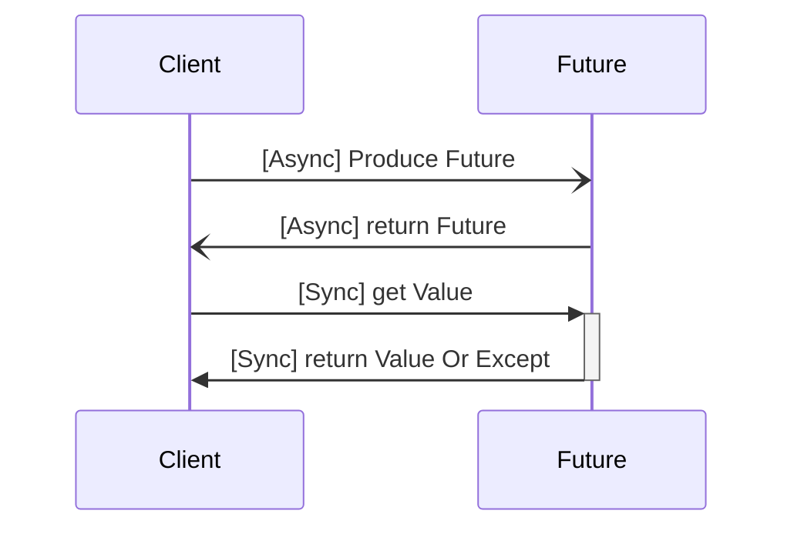
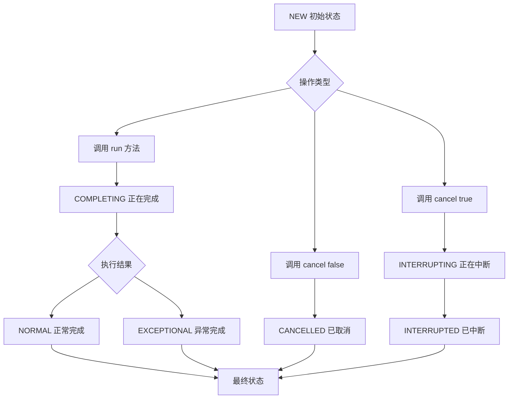

# Java并发之Future


持续更新中...


Future 是 Java 中的一个接口，用于表示异步计算的结果。它可以在多线程环境下执行异步操作，并在需要时获取其结果。在本文中，我们将详细介绍 Future 任务机制和 FutureTask 的实现原理及使用方法。

<!--more-->

## Future 接口

Future 可以基于 Callable 或 Runnable创建。表示异步任务的返回值。

```mermaid
classDiagram
    class Future{
        + cancel(boolean mayInterruptIfRunning) boolean
        + isCancelled() boolean
        + isDone() boolean
        + get() ~V~ 
        + get(long timeout, TimeUnit unit) ~V~
    }
    &lt;&lt;interface>> Future
```

Future的使用时序图如下:



## Callable转 Future的源码追踪

首先我们从任务提交开始，在AbstractExecutorService中的源码如下：

```java
public <T> Future<T> submit(Callable<T> task) {
    if (task == null) throw new NullPointerException();
        RunnableFuture<T> ftask = newTaskFor(task);
        execute(ftask);
        return ftask;
    }
protected <T> RunnableFuture<T> newTaskFor(Runnable runnable, T value) {
    return new FutureTask<T>(runnable, value);
}
public FutureTask(Callable<V> callable) {
    if (callable == null)
        throw new NullPointerException();
        this.callable = callable;
        this.state = NEW;       // ensure visibility of callable
    }
```

可以看到Callable任务被包装成了RunnableFuture对象，通过了线程池的execute方法提交任务并且立刻返回对象本身，而线程池是接受Runnable，必然RunnableFuture继承了Runnable。


## 真正的实现FutureTask

FutureTask被生产者和消费者共享，生产者运行run方法计算结果，消费者通过get方法获取结果。

### FutureTask状态

```java
  //FutureTask类中用来保存状态的变量，下面常量就是具体的状态表示
    private volatile int state;
    private static final int NEW          = 0;
    private static final int COMPLETING   = 1;
    private static final int NORMAL       = 2;
    private static final int EXCEPTIONAL  = 3;
    private static final int CANCELLED    = 4;
    private static final int INTERRUPTING = 5;
    private static final int INTERRUPTED  = 6;
```

状态流转如下:




### run

```java
public void run() {
    // 状态不为new 或者 执行线程不为空，结束 run
    // CAS 更新
    if (state != NEW ||
        !UNSAFE.compareAndSwapObject(this, runnerOffset,
                                        null, Thread.currentThread()))
        return;
    try {
        Callable<V> c = callable;
        if (c != null && state == NEW) {
            V result;
            boolean ran;
            try {
                result = c.call();
                ran = true;
            } catch (Throwable ex) {
                result = null;
                ran = false;
                setException(ex);
            }
            if (ran)
                // call 执行成功，设置结果
                set(result);
        }
    } finally {
        // runner must be non-null until state is settled to prevent concurrent calls to run()
        // CAS的条件
        runner = null;
        // state must be re-read after nulling runner to prevent leaked interrupts
        int s = state;
        if (s >= INTERRUPTING)
            handlePossibleCancellationInterrupt(s);
    }
}
```

### set 

```java
protected void set(V v) {
    // cas 状态更新 new -> completing
    if (UNSAFE.compareAndSwapInt(this, stateOffset, NEW, COMPLETING)) {
        // future的结果
        outcome = v;
        // cas 状态更新 completing -> normal
        UNSAFE.putOrderedInt(this, stateOffset, NORMAL); // final state
        // 唤醒阻塞在get（） 方法上面的线程
        finishCompletion();
    }
}
protected void setException(Throwable t) {
    // 如果抛出异常，设置到当前任务的执行状态为正在运行
    if (UNSAFE.compareAndSwapInt(this, stateOffset, NEW, COMPLETING)) {
        // 将异常值赋值给outcome
        outcome = t;
        // 将当前线程的最终状态设置为执行异常
        UNSAFE.putOrderedInt(this, stateOffset, EXCEPTIONAL); // final state
        // 完成任务之后，做清理，详细源码分析，参考： 5.1.3、 finishCompletion()
        finishCompletion();
    }
}
```

### runAndReset

这个方法同run方法比较的区别是call方法执行后除了发生异常不设置结果。

```java
protected boolean runAndReset() {
    if (state != NEW ||
        !UNSAFE.compareAndSwapObject(this, runnerOffset,
                                        null, Thread.currentThread()))
        return false;
    boolean ran = false;
    int s = state;
    try {
        Callable<V> c = callable;
        if (c != null && s == NEW) {
            try {
                c.call(); // don't set result
                ran = true;
            } catch (Throwable ex) {
                setException(ex);
            }
        }
    } finally {
        runner = null;
        s = state;
        if (s >= INTERRUPTING)
            handlePossibleCancellationInterrupt(s);
    }
    return ran && s == NEW;
}
```

### get

```java
public V get() throws InterruptedException, ExecutionException {
    int s = state;
    // 未完成，阻塞等待
    if (s <= COMPLETING)
        s = awaitDone(false, 0L);
    return report(s);
}
public V get(long timeout, TimeUnit unit) throws InterruptedException, ExecutionException, TimeoutException {
    if (unit == null)
        throw new NullPointerException();
    int s = state;
    if (s <= COMPLETING &&
        (s = awaitDone(true, unit.toNanos(timeout))) <= COMPLETING)
        throw new TimeoutException();
    return report(s);
}
private V report(int s) throws ExecutionException {
    Object x = outcome;
    if (s == NORMAL)
        return (V)x;
    if (s >= CANCELLED)
        throw new CancellationException();
    throw new ExecutionException((Throwable)x);
}
```
awaitDone内部是轮询判断任务的状态。
- 当执行的线程被中断时，调用removeWaiter移除等待节点WaitNode，抛出中断异常
- 当状态为已经完成，直接返回
- 当状态为完成中，通过Thread.yield()让出CPU时间
- 如果当前线程还没有创建WaitNode等待节点保存到等待队列里面去，则新建一个等待节点，插入到等待链表，表明当前线程也准备进入等待该任务完成的队列中去。
- 最后是进入阻塞的动作，通过LockSupport.park，如果设置了超时的时间，则将时间作为参数传递到park中。

```java
// ***********************************************************************************
 private int awaitDone(boolean timed, long nanos) throws InterruptedException {
    // 是否有时间限制
    final long deadline = timed ? System.nanoTime() + nanos : 0L;
    WaitNode q = null;
    boolean queued = false;
    for (;;) {
        if (Thread.interrupted()) {
            removeWaiter(q);
            throw new InterruptedException();
        }

        int s = state;
        if (s > COMPLETING) {
            if (q != null)
                q.thread = null;
            return s;
        }
        else if (s == COMPLETING) // cannot time out yet
            Thread.yield();
        // 下面的情况 s == new
        else if (q == null)
            q = new WaitNode();
        else if (!queued)
        // 将当前线程加入等待队列
            queued = UNSAFE.compareAndSwapObject(this, waitersOffset,
                                                    q.next = waiters, q);
        else if (timed) {
            nanos = deadline - System.nanoTime();
            if (nanos <= 0L) {
                removeWaiter(q);
                return state;
            }
            // 挂起
            LockSupport.parkNanos(this, nanos);
        }
        else
            // 挂起
            LockSupport.park(this);
    }
}
// =========================================================================
static final class WaitNode {
    volatile Thread thread;
    volatile WaitNode next;
    WaitNode() {
        thread = Thread.currentThread();
    }
}
```

### cancel

```java
// 终止任务
public boolean cancel(boolean mayInterruptIfRunning) {
    // 状态不为 new 或者修改状态失败，cas
    if (!(state == NEW &&
            UNSAFE.compareAndSwapInt(this, stateOffset, NEW,
                mayInterruptIfRunning ? INTERRUPTING : CANCELLED)))
        return false;
    try {    // in case call to interrupt throws exception
        if (mayInterruptIfRunning) {
            try {
                Thread t = runner; // runner -- 执行callable 的线程
                if (t != null)
                    t.interrupt();
            } finally { // final state
                UNSAFE.putOrderedInt(this, stateOffset, INTERRUPTED);
            }
        }
    } finally {
        //将阻塞在等待这个任务完成的线程唤醒，具体操作是LockSupport.unpark(t)
        finishCompletion();
    }
    return true;
}
private void finishCompletion() {
    // assert state > COMPLETING;
    for (WaitNode q; (q = waiters) != null;) {
        if (UNSAFE.compareAndSwapObject(this, waitersOffset, q, null)) {
            for (;;) {
                Thread t = q.thread;
                if (t != null) {
                    q.thread = null;
                    LockSupport.unpark(t);
                }
                WaitNode next = q.next;
                if (next == null)
                    break;
                q.next = null; // unlink to help gc
                q = next;
            }
            break;
        }
    }
    done();
    callable = null; // to reduce footprint
}
```

注意 Future 的 cancel 并不一定能真正的 cancel。可以看到 future 是通过线程的interrupt方法去终止执行的，如果在 Runnable 或 Callable中没有响应interrupt异常，那么 cancel 是不生效的。

### 其它方法

FutureTask 还实现了其它一些方法：

```java
// 判断是否终止任务
public boolean isCancelled() {
    return state >= CANCELLED;
}
// 判断任务是否完成
public boolean isDone() {
    return state != NEW;
}
```

## ListenableFuture

由于 Future 的 get 方法是阻塞方法，实际使用时还是无法实现异步编程，于是就有了 ListenableFuture。由于ListenableFuture不是 JDK 提供的能力，很多项目都自己实现了(Spring,ElasticSearch,Guava)。接下来主要介绍使用最多的 Guava 中的 ListenableFuture。

