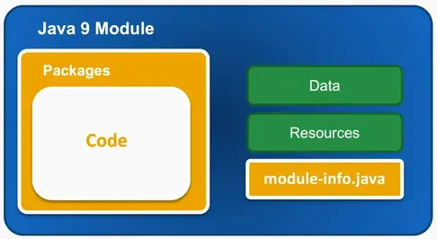
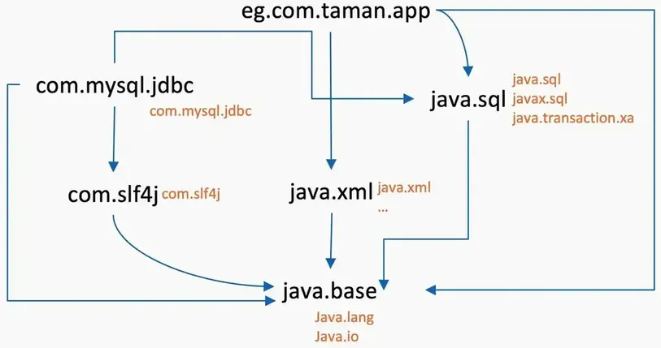
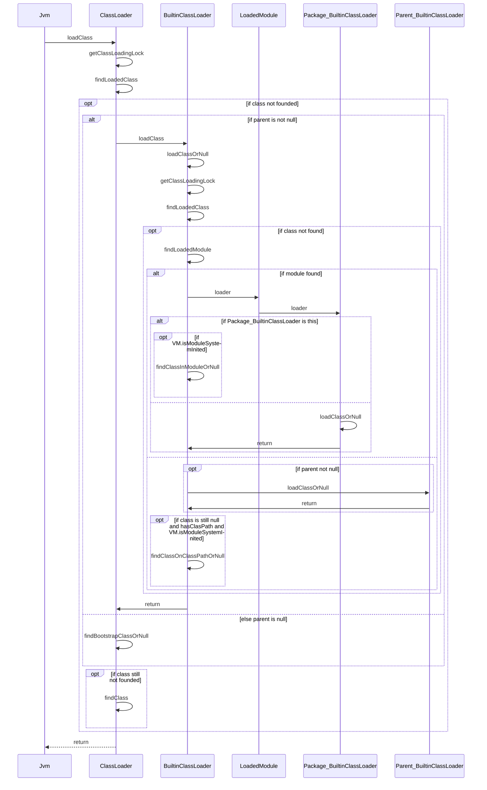

# Java 模块化

JDK 从Java 9开始 在包之上引入了一个新的抽象级别，正式名称为 Java 平台模块系统 （JPMS），简称“模块”。Java 模块是一种打包机制，使您能够将 Java 应用程序或 Java API 打包为单独的 Java 模块。Java 模块被打包为模块化 JAR 文件。Java 模块可以指定它包含哪些 Java 包，这些包应该对使用此模块的其他 Java 模块可见。Java 模块还必须指定完成其工作所需的其他 Java 模块。

<!--more-->

## Java 模块的优势

* 更精简的JDK，所有 Java 平台 API 都被拆分为单独的模块。将所有 Java API 拆分为模块的好处是，您现在可以指定应用程序需要的 Java 平台的哪些模块。了解应用程序需要哪些 Java 平台模块后，Java 可以打包应用程序，仅包括应用程序实际使用的 Java 平台模块。
* 更强的封装，Java 模块必须显式告知模块中的哪些 Java 包将导出（可见）到使用该模块的其他 Java 模块。Java 模块可以包含未导出的 Java 包。其他 Java 模块不能使用未导出的包中的类。此类包只能在包含它们的 Java 模块内部使用。未导出的包也称为隐藏包或封装包。
* 缺失模块的启动检测, 应用程序模块指定它使用的其他模块（Java API 模块或第三方模块）。因此，Java VM 可以从应用程序模块检查整个模块的依赖关系图，并在 Java VM 启动时向前检查。如果在启动时找不到任何必需的模块，Java VM 将报告缺少的模块并关闭。

## 模块

模块是代码、数据和资源的集合。它是一组相关的包和类型（类、抽象类、接口等），其中包含代码、数据文件和一些静态资源。




模块描述符module-info.java是 Java 9 模块中的资源之一。（模块描述符是模块声明的编译版本。创建此文件时，您必须知道两位信息：模块将依赖于什么以及它将导出什么。

每个模块仅包含一组相关代码和数据来支持单一责任原则（SRP）：“类的更改原因不应超过一个。（我们的想法是设计一个具有一个职责的类。更简单地说：模块=代码+数据。

所有 JDK 和用户定义模块的默认模块是`java.base`(基本模块)。这是一个独立的模块，不依赖任何其他模块。


具有显式依赖关系是模块化的主要基础之一。此外模块还提供了更好的封装。以`java.base`为例。


`java.lang`,`java.util`,`java.io` 是`java.base`模块中的公共接口。而在模块中可以看到 `sun.util`和`jdk.internal`的被屏蔽的包，这些包是内部实现细节。并且其他模块将无法访问这些包中的内容。

我们可以通过` java --list-modules` 命令来列出所有的java 模块。对于模块而言。

- 每个模块都有一个唯一的名称
- 每个模块在源文件中都有一些描述
- 模块描述符文件放置在顶级目录中
- 每个模块可以有任意数量的包和类型
- 一个模块可以依赖于任意数量的模块

必须为 Java 模块指定一个唯一的名称。例如，有效的模块名称可以是

```
info.victorchu.module
```

Java 模块名称遵循与 Java 包相同的命名规则。但是，您不应在 Java 9 及以后的模块名称（或包名、类名、方法名、变量名等）中使用下划线，因为 Java 希望将来使用下划线作为保留标识符。如果可能的话，建议将 Java 模块命名为与模块中包含的根 Java 包的名称相同的名称.


### 模块目录结构

在Java9之前的项目结构是这样的：`info.victorchu.greetings`，对应目录结构是 `src/info/victorchu/greetings`(可以参考JDK src的文件布局).从Java 9开始，Java平台模块系统提供了一种替代的目录结构，可以更容易地编译Java源代码。从 Java 9 开始，模块可以嵌套在与模块同名的根目录下。

```
src/info.victorchu.greetings/info/victorchu/greetings
```


当然，对于多模块项目，其路径应该是:

```
src/info.victorchu.greetings/info/victorchu/greetings
src/info.victorchu.world/info/victorchu/world
```

> 即此时sourceRoot 是 info.victorchu.greetings ，而不是 src文件夹

当然，java module也可以和maven module集成在一起。参见[示例](https://github.com/chutian0610/code-lab/tree/main/demos/java-modules)


#### 打包&运行

Java 9 引入了一系列新的参数用于编译和运行模块，其中最重要的两个参数是 -p 和 -m。-p 参数指定模块路径，多个模块之间用 “:”(Mac, Linux)或者 “;”(Windows)分隔，同时适用于 javac 命令和 java 命令，用法和Java 8 中的 -cp非常类似。-m 参数指定待运行的模块主函数，输入格式为模块名/主函数所在的类名，仅适用于 java 命令。两个参数的基本用法如下：

```sh
javac -d <out> -p <module_path> <source,source>
## javac -d out --module-source-path src/main/java --module com.taman.hello
## module_path 通常比模块目录高一级

java -p <module_path> -m <module>/<main_class>
```

使用jar 命令将模块打包成模块化jar。

```sh
jar --create --file hello.jar
      --module-version 0.1
      --main-class com.taman.hello.HelloWorldApp
      -C mods/com.taman.hello  .
## --create指定该命令应创建新的 JAR 文件。
## --file 指定 JAR 文件的名称，后跟名称 
## --main-class指定应用的入口点的类完全限定名称。
## -C指定编译的模块根目录
## 然后在当前目录下得到了hello.jar这个jar包
```
使用JDK自带的jmod命令把一个jar包转换成模块：

```sh
jmod create --class-path hello.jar hello.jmod
```

现在，JRE自身的标准库已经分拆成了模块，只需要带上程序用到的模块，其他的模块就可以被裁剪掉。怎么裁剪JRE呢？并不是说把系统安装的JRE给删掉部分模块，而是“复制”一份JRE，但只带上用到的模块。为此，JDK提供了jlink命令来干这件事。命令如下：

```sh
jlink --module-path hello.jmod --add-modules java.base,java.xml,hello.world --output jre/
cd jre
## 执行独立应用程序
bin/java --module com.taman.hello/com.taman.hello.HelloWorldApp
```

### 模块标识语法

每个java 模块都需要一个模块描述符，文件名`module-info.java`。其位于`src/info.victorchu.greetings/module-info.java`.模块描述符指定模块导出哪些包，以及模块需要哪些其他模块。

通过如下语法定义一个module。

```
ModuleDeclaration:
  {Annotation} [open] module Identifier {. Identifier} { {ModuleDirective} }

ModuleDirective:
  requires {RequiresModifier} ModuleName;
  exports PackageName [to ModuleName {, ModuleName}] ;
  opens PackageName [to ModuleName {, ModuleName}] ;
  uses TypeName ;
  provides TypeName with TypeName {, TypeName} ;

RequiresModifier:
  (one of)transitive static
```

更直观的结构:

```
[open ] module <module> {

    requires [transitive] module1;

    exports <package> [to <module1>[,<module2>...]];
    opens <package>  [to <module1>[,<module2>...]];

    provides <interface | abstract class>
        with <class1>[,<class2>...];
    
     uses <interface | abstract class>;
}
```

模块使用模块名声明一个模块。模块名称应全局唯一，不可重复。模块名称由一个或多个 Java Identifier 组成，这些Identifier由 `.` 标记分隔。例如 `info.victorchu.greetings`。
- 模块有两种，普通模块和开放模块。模块的类型决定了模块外部代码对模块中类型以及这些类型的成员的访问的权限。
  - 普通模块，在编译时和运行时仅向显式导出的包中的类型授予访问权限。
  - 开放模块，在编译时仅对显式导出的包中的类型授予访问权限，但在运行时授予对其包中的所有类型的访问权限，就像导出所有包一样。
  - 对于模块外部代码（不论模块是普通还是开放），在编译或运行时仅对模块导出包中的public与protected 修饰的类型和这些类型的public与protected类型成员授予访问权限。未导出的包，在编译或运行期间不会授予其中的类型和类型成员访问权限。
  - 模块内的代码，在编译或运行时可以访问模块中所有包的public与protected类型和这些类型的public与protected类型变量。
- 不同于编译期和运行期，对于Java的反射API: 
  - 普通模块仅对显式导出或显式打开（或两者都有）的包中的类型授予反射访问权限
  - 开放模块内的所有包都允许通过 Java 反射访问，模块声明体内不再允许使用 opens 语句。
  - 对于普通模块的外部代码，对模块中导出且未被打开的包，仅允许反射包中的public与protected类型和这些类型的public与protected类型成员。对模块中打开的包（无论是否导出），允许反射包中所有的类和类成员。未被导出且未被打开的包不允许反射。对于模块内代码，模块中所有包的类型和类型成员都允许反射。
  - 对于打开模块外的代码，模块中所有包的类型和类型成员都允许反射。对于模块内代码，模块中所有包的类型和类型成员都允许反射。

模块体声明指定了模块对其他模块的依赖性(requires)，提供给其他模块的包(exports && opens)，使用的服务(uses)以及自己提供的服务(provides)。

```java
module com.example.foo {
    requires com.example.foo.http;
    requires java.logging;

    requires transitive com.example.foo.network;
    exports com.example.foo.bar;
    exports com.example.foo.internal to com.example.foo.probe;
    opens com.example.foo.quux;
    opens com.example.foo.internal to com.example.foo.network, com.example.foo.probe;
    uses com.example.foo.spi.Intf;
    provides com.example.foo.spi.Intf with com.example.foo.Impl;
}
```

#### require

require 模块指令指定此模块依赖于另一个模块 — 此关系称为模块依赖项。每个模块必须显式声明其依赖项。

- `requires [transitive]` : 声明模块依赖，一次只能声明一个依赖，如果依赖多个模块，需要多次声明。加上 transitive 关键词表示传递依赖，比如模块 A 依赖模块 B，模块 B 传递依赖模块 C，那么模块 A 就会自动依赖模块 C，类似于 Maven。
- `java.base`模块会默认隐式依赖，不需要显式声明。
- `requires [static]`: 静态require 表示只在编译时需要模块，但是运行时是可选的。这称为可选依赖。

#### export

`exports [to [, ...]]`: 导出模块内的包(允许直接 import 使用)，一次导出一个包，如果需要导出多个包，需要多次声明。如果需要定向导出，可以使用 to 关键词，后面加上模块列表(逗号分隔)。

#### open

`opens [to [, ...]]`: 开放模块内的包(允许通过 Java 反射访问)，一次开放一个包，如果需要开放多个包，需要多次声明。如果需要定向开放，可以使用 to 关键词，后面加上模块列表(逗号分隔)。

#### use & provide

- `provides with [, ...]`: 声明模块提供的 Java SPI 服务，一次可以声明多个服务实现类(逗号分隔)。
- `uses` : 声明模块依赖的 Java SPI 服务，加上之后模块内的代码就可以通过 ServiceLoader.load(Class) 一次性加载所声明的 SPI 服务的所有实现类。



`eg.com.taman.app` 模块使用 Mysql数据库。假设mysql的驱动程序由`com.mysql.jdbc`提供:
 
```java
module com.mysql.jdbc {
    requires java.sql;
    requires org.slf4j;
    exports com.mysql.jdbc; // com.mysql.jdbc 是java.sql.Driver 的实现
}
```
对于使用此驱动程序的模块，类必须能够通过`java.sqlServiceLoader`反射实例化驱动程序类;为此，模块系统必须将驱动程序模块添加到模块图中并解析其依赖项。为了使它更简洁，更容易完成任务，有use module指令。我们在java.sql 模块中定义 spi。

```java
module java.sql {
    requires public java.logging;
    requires public java.xml;
    exports java.sql;
    exports javax.sql;
    exports javax.transaction.xa;
    uses java.sql.Driver; // spi
}
```

然后在 com.mysql.jdbc 模块中提供实现。

```java
module com.mysql.jdbc {
    requires java.sql;
    requires org.slf4j;
    exports com.mysql.jdbc;
    provides java.sql.Driver with com.mysql.jdbc.Driver;
    // 指令的“with”部分指定实现接口或扩展抽象类的类的名称。
}
```

## 兼容

对于未经模块化的jar包，该怎么处理？如何使用java9兼容？

java9 提出了未命名模块(unnamed module)和自动模块(automatic module)来处理这个问题。

一个未经模块化改造的 jar 文件是转为未命名模块还是自动模块，取决于这个 jar 文件出现的路径，如果是类路径，那么就会转为未命名模块，如果是模块路径，那么就会转为自动模块。注意，自动模块也属于命名模块的范畴，其名称是模块系统基于 jar 文件名自动推导得出的，比如 com.foo.bar-1.0.0.jar 文件推导得出的自动模块名是 com.foo.bar。

- 所有类路径(`-cp`)下的jar文件自动转为未命名模块
  - exports 所有包(只针对未命名模块)
  - requires 所有模块
  - 如果遇到分裂包，命名模块胜出
- 模块路径(`-p`)下的未经处理的jar文件自动转为自动模块
  - exports 所有包
  - requires 所有命名模块
  - 允许访问所有未命名模块的类

除此之外，两者还有一个关键区别，分裂包规则适用于自动模块，但对未命名模块无效，也即多个未命名模块可以导出同一个包，但自动模块不允许。

> 分裂包: 不同模块导出相同的包

未命名模块和自动模块存在的意义在于，无论传入的 jar 文件是否一个合法的模块(包含 module descriptor)，Java 内部都可以统一的以模块的方式进行处理，这也是 Java 9 兼容老版本应用的架构原理。运行老版本应用时，所有 jar 文件都出现在类路径下，也就是转为未命名模块，对于未命名模块而言，默认导出所有包并且依赖所有模块，因此应用可以正常运行。

基于未命名模块和自动模块，相应的就产生了两种老版本应用的迁移策略，或者说模块化策略。下面以demo应用为例:


### Bottom-up 自底向上策略

第一种策略，叫做自底向上(bottom-up)策略，即根据 jar 包依赖关系(如果依赖关系比较复杂，可以使用 jdeps 工具进行分析)，沿着依赖树自底向上对 jar 包进行模块化改造(在 jar 包的源代码根目录下添加合法的模块描述文件 module-info.java)。初始时，所有 jar 包都是非模块化的，全部置于类路径下(转为未命名模块)，应用以传统方式启动。然后，开始自底向上对 jar 包进行模块化改造，改造完的 jar 包就移到模块路径下，这期间应用仍以传统方式启动。最后，等所有 jar 包都完成模块化改造，应用改为 -m 方式启动，这也标志着应用已经迁移为真正的 Java 9 应用。

假设初始时，所有 jar 包都是非模块化的，此时应用运行命令为：

```
java -cp mod1.jar:mod2a.jar:mod2b.jar:mod3.jar:mod4.jar mod1.Main 
```

对 mod3 和 mod4 进行模块化改造。完成之后，此时 mod1, mod2a, mod2b 还是普通的 jar 文件，新的运行命令为：

```
java -cp mod1.jar:mod2a.jar:mod2b.jar -p mod3.jar:mod4.jar --add-modules mod3,mod4 mod1.Main 
```
不管是编译时，还是运行时，模块系统首先都要确定一个或者多个根模块(root module)，然后从这些根模块开始根据模块依赖关系在模块路径中循环找出所有可观察到的模块(observable module)，这些可观察到的模块加上类路径下的 jar 文件最终构成了编译时环境和运行时环境。那么根模块是如何确定的呢?对于运行时而言，如果应用是通过 -m 方式启动的，那么根模块就是 -m 指定的主模块;如果应用是通过传统方式启动的，那么根模块就是所有的 java.* 模块即 JRE(参见图-2)。回到前面的例子，如果不加 --add-modules 参数，那么运行时环境中除了 JRE 就只有 mod1.jar、mod2a.jar、mod2b.jar，没有 mod3、mod4 模块，就会报 java.lang.ClassNotFoundException 异常。--add-modules 参数的作用就是手动指定额外的根模块，这样应用就可以正常运行了。

当全部改造完时:

```
java -p mod1.jar:mod2a.jar:mod2b.jar:mod3.jar:mod4.jar -m mod1/mod1.Main
```

注意此时应用是以 -m 方式启动，并且指定了 mod1 为主模块(也是根模块)，因此所有其他模块根据依赖关系都会被识别为可观察到的模块并加入到运行时环境，应用可以正常运行。

### Top-down 自上而下策略

自底向上策略很容易理解，实施路径也很清晰，但它有一个隐含的假设，即所有 jar 包都是可以模块化的，那如果其中有 jar 包无法进行模块化改造(比如 jar 包是一个第三方类库)，怎么办?别慌，我们再来看第二种策略，叫做自上而下(top-down)策略。

它的基本思路是，根据 jar 包依赖关系，从主应用开始，沿着依赖树自上而下分析各个 jar 包模块化改造的可能性，将 jar 包分为两类，一类是可以改造的，一类是无法改造的。对于第一类，我们仍然采用自底向上策略进行改造，直至主应用完成改造，对于第二类，需要从一开始就放入模块路径，即转为自动模块。这里就要谈一下自动模块设计的精妙之处，首先，自动模块会导出所有包，这样就保证第一类 jar 包可以照常访问自动模块，其次，自动模块依赖所有命名模块，并且允许访问所有未命名模块的类(这一点很重要，因为除自动模块之外，其它命名模块是不允许访问未命名模块的类)，这样就保证自动模块自身可以照常访问其他类。等到主应用完成模块化改造，应用的启动方式就可以改为 -m方式。

还是以示例工程为例，假设 mod4 是一个第三方 jar 包，无法进行模块化改造，那么最终改造完之后，虽然应用运行命令和之前一样还是java -p mod1.jar:mod2a.jar:mod2b.jar:mod3.jar:mod4.jar -m mod1/mod1.Main.  mod1、mod2a、mod2b、mod3 是真正的模块，mod4 未做任何改造，借由模块系统转为自动模块。

> 注意这个情况下可能存在分裂包，要修改模块源码 ！！！

## 类加载


Java 9之前的类加载器分成三个层次，分别是：

- 引导类加载器（boostrap class loader）：虚拟机内置的类加载器，通常以null表示，从引导类路径加载。
- 扩展类加载器（extension class loader）：从扩展目录加载类。它是JDK 1.2中引入的扩展机制的产物。它的父类加载器为引导类加载器。
- 应用类加载器（application class loader）：从应用的CLASSPATH中加载类。它的父类加载器为扩展类加载器。

这其中的扩展类加载器和应用类加载器都是URLClassLoader的实例。

Java 9仍然保留了三层类加载器结构，**不过为了支持模块系统，对它们做了一些调整。扩展机制被移除，扩展类加载器由于向后兼容性的原因被保留，不过被重命名为平台类加载器（platform class loader）。可以通过ClassLoader的新方法getPlatformClassLoader()来获取**。Java 9中的内置类加载器如下所示。

- 引导类加载器：定义核心Java SE和JDK模块。
- 平台类加载器：定义部分Java SE和JDK模块。
- 应用或系统类加载器：定义CLASSPATH上的类和模块路径中的模块。

在Java 9中，**平台类加载器和系统类加载器不再是URLClassLoader类的对象，现在启动类加载器、平台类加载器、应用程序类加载器全都继承于 jdk.internal.loader.BuiltinClassLoader**。这会影响一个常见的用来在运行时向系统类加载器的查找路径中添加条目的hack。该hack把系统类加载器转型成URLClassLoader并调用其addURL()方法。该hack在Java 9无法工作，因为转型为URLClassLoader会失败。

```java
public static void addPath(String s) throws Exception {
  File f = new File(s);
  URL u = f.toURL();
  URLClassLoader urlClassLoader = (URLClassLoader)
      ClassLoader.getSystemClassLoader();
  Class urlClass = URLClassLoader.class;
  Method method = urlClass.getDeclaredMethod("addURL", new Class[]{URL.class});
  method.setAccessible(true);
  method.invoke(urlClassLoader, new Object[]{u});
}
```

在Java 9中，类加载器有了名称。该名称在构造方法中指定，可以通过getName()方法来获取。平台类加载器的名称是platform，应用类加载器的名称是app。类加载器的名称在调试与类加载器相关的问题时会非常有用。

Java 9中可以访问到引导类加载器了，即jdk.internal.loader.BootLoader。不过在编译时和运行时需要参数--add-exports java.base/jdk.internal.loader=ALL-UNNAMED来开放jdk.internal.loader包到未命名模块，或者是到你自己的应用模块。否则的话，仍然会返回null。

**类加载的委派关系也发生了变动**。当平台及应用程序类加载器收到类加载请求，
- 如果当前类已经加载了则直接返回。
- 如果没加载，则根据名称找到对应的模块有没有加载。
- 如果对应模块没有加载，则委派给父加载器去加载。
- 如果对应模块已经加载了，则委派给对应模块的加载器去加载。
- 在模块里即使使用`java.lang.Thread#setContextClassLoader`方法改变当前上下文的类加载器，或者在模块里直接使用非当前模块的类加载器去加载当前模块里的类，最终使用的还是加载当前模块的类加载器。




Java9之前的版本中没有模块化时只有一个初始化，Java9中分成了3个阶段，阶段2是模块化的初始化工作，主要是boot layer的加载，bootlayer里包含的是平台系统依赖的一些模块，阶段3是访问控制设置，类加载器的状态变更等，

1. Java9之前虚拟机初始化. 
  - Initialize the system class.  Called after thread initialization. java.lang.System#initializeSystemClass
2. Java9虚拟机初始化系统类分成了3个阶段:
  - 阶段1 Initialize the system class.  Called after thread initialization. java.lang.System#initPhase1
  - 阶段2 Invoked by VM.  Phase 2 module system initialization.Only classes in java.base can be loaded in this phase. java.lang.System#initPhase2
  - 阶段3 Invoked by VM.  Phase 3 is the final system initialization: java.lang.System#initPhase3
    -  set security manager
    - set system class loader
    - set TCCL

Java9里的获取系统类加载器时是根据不同的initLevel来做安全校验，Level为4是表示系统初始化ok了，应用调用此方法获取AppClassLoader时校验反射安全，而虚拟机在0-2的状态里则不校验，直接返回AppClassLoader。initLevel从0到1的过程也就是上面说的阶段1，1到2的过程就是阶段2，2到3再到4是在阶段3里做的，3到4的过程如下：
 
```java
// initializing the system class loader
  VM.initLevel(3);

// system class loader initialized
  ClassLoader scl = ClassLoader.initSystemClassLoader();

// set TCCL
  Thread.currentThread().setContextClassLoader(scl);

// system is fully initialized
  VM.initLevel(4);

// java.lang.ClassLoader#getSystemClassLoader
 public static ClassLoader getSystemClassLoader() {
        switch (VM.initLevel()) {
            case 0:
            case 1:
            case 2:
                // the system class loader is the built-in app class loader during startup
                return getBuiltinAppClassLoader();
            case 3:
                String msg = "getSystemClassLoader should only be called after VM booted ";
                throw new InternalError(msg);
            case 4:
                // system fully initialized
                assert VM.isBooted() && scl != null;
                SecurityManager sm = System.getSecurityManager();
                if (sm != null) {
                    checkClassLoaderPermission(scl, Reflection.getCallerClass());
                }
                return scl;
            default:
                throw new InternalError("should not reach here
                                                            ");
        }
    }
```

**Java9 废弃了方法 `java.lang.Class#newInstance`**.

```java
public class ClassLoaderTest {

    public static void main(String[] args) {


        ClassLoader loader = Thread.currentThread().getContextClassLoader();
        try {
            /** Java9之前的使用方式 */
            Class clazz = loader.loadClass("test.Car ");
            Object obj = clazz.newInstance();
            Car car = (Car) obj;
            car.run();

        } catch (ClassNotFoundException e) {
            System.err.println(e);
        } catch (InstantiationException e) {
            System.err.println(e);
        } catch (IllegalAccessException e) {
            System.err.println(e);
        }

        try {
            /** Java9的使用方式 */
            Class clazz = loader.loadClass("test.Car ");
            // 支持带参数的构造器调用
            Object obj = clazz.getDeclaredConstructor(String.class).newInstance("Benz ");
            Car car = (Car) obj;
            car.run();

        } catch (ClassNotFoundException e) {
            System.err.println(e);
        } catch (NoSuchMethodException e) {
            System.err.println(e);
        } catch (SecurityException e) {
            System.err.println(e);
        } catch (InstantiationException e) {
            System.err.println(e);
        } catch (IllegalAccessException e) {
            System.err.println(e);
        } catch (IllegalArgumentException e) {
            System.err.println(e);
        } catch (InvocationTargetException e) {
            System.err.println(e);
        }

    }
}
```

## 参考

- [1] [Project Jigsaw](http://openjdk.java.net/projects/jigsaw/)
- [2] [The State of the Module System](http://openjdk.java.net/projects/jigsaw/spec/sotms/)
- [3] [Modules in the Java Language and VM](https://docs.oracle.com/javase/specs/jls/se9/html/jls-7.html#jls-7.7)
- [4] [Tutorial : Java 9+ modularity: The theory and motivations behind modularity -1 ](https://developer.ibm.com/tutorials/java-modularity-1/)
- [5] [Tutorial : Java 9+ modularity: The theory and motivations behind modularity -2 ](https://developer.ibm.com/tutorials/java-modularity-2/)
- [6] [Tutorial : Java 9+ modularity: The theory and motivations behind modularity -3 ](https://developer.ibm.com/tutorials/java-modularity-3/)
- [7] [Tutorial : Java 9+ modularity: The theory and motivations behind modularity -4 ](https://developer.ibm.com/tutorials/java-modularity-4/)
- [8] [Tutorial : Java 9+ modularity: The theory and motivations behind modularity -5 ](https://developer.ibm.com/tutorials/java-modularity-5/)

