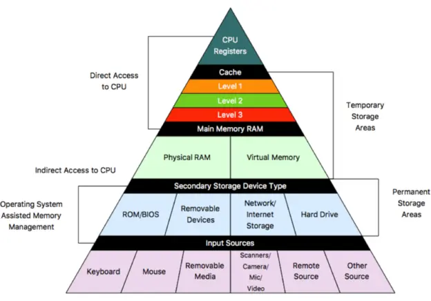
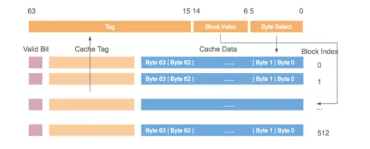
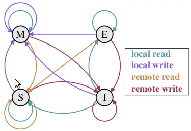
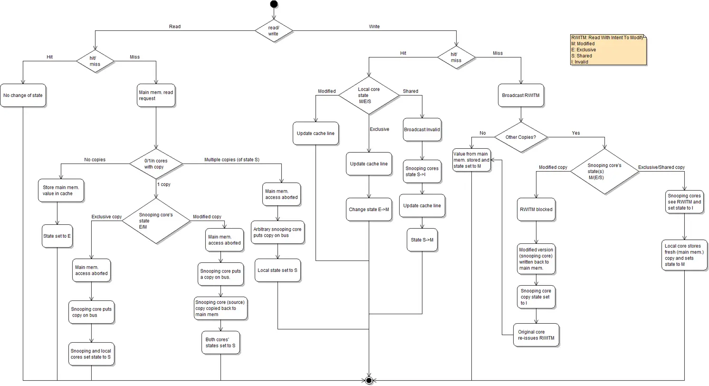

# CPU Memory Cache

曾今计算机稳定的基本结构悄然改变，硬件开发人员开始致力于优化单个子系统。于是电脑一些组件的性能大大的落后因而成为了瓶颈。由于开销的原因，大容量存储器和内存子系统相对于其他组件来说改善得更为缓慢。

大容量存储的性能问题往往靠软件来改善: 操作系统将常用(且最有可能被用)的数据放在主存中，因为后者的速度要快上几个数量级。或者将缓存加入存储设备中，这样就可以在不修改操作系统的前提下提升性能。(然而，为了在使用缓存时保证数据的完整性，仍然要作出一些修改).

而解决内存的瓶颈更为困难，它与大容量存储不同，几乎每种方案都需要对硬件作出修改。目前，这些变更主要有以下这些方式:

* RAM的硬件设计(速度与并发度)
* 内存控制器的设计
* CPU缓存
* 设备的直接内存访问(DMA)

<!--more-->

## Cpu Cache

在了解 cpu cache 前，先了解下cpu。经过了多年的演变。个人计算机和小型服务器有了标准化芯片组，该芯片组包括北桥和南桥两部分。


所有CPU（在上图中为两个,可以有更多）通过公共总线（Front Side Bus，FSB）连接到北桥。此外，北桥还包含内存控制器，其实现方式确定了用于计算机的RAM芯片的类型。不同类型的RAM，例如DRAM，Rambus和SDRAM，需要不同的内存控制器。要访问所有其他系统设备，北桥必须与南桥通信。南桥，通常称为I/O桥，通过各种不同的总线处理与设备的通信。现今，PCI，PCI Express,SATA和USB总线是最常见的。

这种系统结构,有几个点需要注意下:

1. 从一个CPU到另一个CPU的所有数据通信必须通过用于与北桥通信的同一总线传输。
2. 与RAM的所有通信都必须通过北桥。
3. RAM只有一个端口(不会在本文档中讨论多端口RAM，因为在商用硬件中（至少在程序员可以访问它的地方）找不到这种类型的RAM)。
4. CPU和连接到南桥的设备之间的通信通过北桥进行路由。

此设计中有两个瓶颈:

* 一个瓶颈涉及设备对RAM的访问,在PC的早期，与任一I/O桥上的设备的所有通信都必须通过CPU,这会对整体系统性能产生负面影响。要解决此问题，某些设备能够直接内存访问(DMA),DMA允许设备在北桥的帮助下直接在RAM中存储和接收数据，而无需CPU的干预.现在,连接到任何总线的所有高性能设备都可以使用DMA。尽管这大大减少了CPU的工作量，但由于DMA请求与CPU的RAM访问竞争，这也导致了北桥带宽的竞争。因此，必须考虑这个问题。
* 第二个瓶颈涉及从北桥到RAM的总线。在早期的系统上，所有RAM芯片只有一条总线，因此无法并行访问。最新的RAM类型支持多条独立的总线，这将使可用带宽增加。在可用带宽有限的情况下，以最小化延迟的方式安排内存访问非常重要。正如我们将看到的，尽管使用了CPU缓存，但处理器要快得多，并且必须等待访问内存。如果多个超线程，内核或处理器同时访问内存，则内存访问的等待时间会更长,同样,对于DMA的操作也是如此。除了并发以外，访问模式也会极大地影响内存子系统、特别是多通道内存子系统的性能。在一些比较昂贵的系统上，北桥自己不含内存控制器，而是连接到外部的多个内存控制器上。


这种架构的好处在于，多条内存总线的存在，使得总带宽也随之增加了。而且也可以支持更多的内存。通过同时访问不同内存区，还可以降低延时。

使用外部内存控制器并不是唯一的办法，另一个最近比较流行的方法是将控制器集成到CPU内部，将内存直连到每个CPU。


通过采用这样的架构，系统里有几个处理器，就可以有几个内存库(memory bank)。比如，在4 CPU的计算机上，不需要一个拥有巨大带宽的复杂北桥，就可以实现4倍的内存带宽。
 
同样也有缺点。首先，系统仍然要让所有内存能被所有处理器所访问，导致内存不再是统一的资源(NUMA即得名于此)。处理器能以正常的速度访问本地内存(连接到该处理器的内存)。但它访问其它处理器的内存时，却需要使用处理器之间的互联通道。比如说，CPU1如果要访问CPU2的内存，则需要使用它们之间的互联通道。如果它需要访问CPU 4的内存，那么需要跨越两条互联通道。

下图是计算机的基本结构。L1、L2、L3分别表示一级缓存、二级缓存、三级缓存，越靠近CPU的缓存，速度越快，容量也越小。所以L1缓存很小但很快，并且紧靠着在使用它的CPU内核；L2大一些，也慢一些，并且仍然只能被一个单独的CPU核使用；L3更大、更慢，并且被单个插槽上的所有CPU核共享；最后是主存，由全部插槽上的所有CPU核共享。



当CPU执行运算的时候，它先去L1查找所需的数据、再去L2、然后是L3，如果最后这些缓存中都没有，所需的数据就要去主内存拿。走得越远，运算耗费的时间就越长。所以如果你在做一些很频繁的事，你要尽量确保数据在L1缓存中。

下面是从CPU访问不同层级数据的时间概念:

|从CPU到|大约需要的CPU周期|大约需要的时间|
|:---|:---|:---|
|主存||约60-80ns|
|QPI 总线传输(between sockets, not drawn)||约20ns|
|L3 cache|约40-45 cycles|约15ns|
|L2 cache|约10 cycles|约3ns|
|L1 cache|约3-4 cycles|约1ns|
|寄存器|1 cycle||

可见CPU读取主存中的数据会比从L1中读取慢了近2个数量级。

<!--more-->

## Cache Line 缓存行

缓存系统中是以缓存行（cache line）为单位存储的。缓存行是2的整数幂个连续字节，一般为32-256个字节。最常见的缓存行大小是64个字节。CPU每次从主存中拉取数据时，会把相邻的数据也存入同一个cache line。

一个Java的long类型变量是8字节，因此在一个缓存行中可以存8个long类型的变量。在访问一个long数组的时候，如果数组中的一个值被加载到缓存中，它会自动加载另外7个。因此你能非常快的遍历这个数组。事实上，你可以非常快速的遍历在连续内存块中分配的任意数据结构。

### Cache 映射

cache的容量要远远小于主存，主存和cache肯定不是一一映射的，那么它们的映射关系是怎样的？

Cache分为3类：Fully Associative、Direct Mapped、N-Way Set Associative。

Fully Associative是全关联的意思，**每个内存块能够被映射到任意一个缓存槽。操作效果上相当于一个散列表**。如果在一个Cache集内，任何一个地址的数据都可以缓存在任何一个Cache Line里，那么我们称这个Cache是Fully Associative。给一个内存地址，要知道他是否存在于Cache中，就需要遍历所有Cache Line并比较缓存内容的地址。而Cache的本意就是为了在尽可能少得CPU Cycle内取到数据。那么想要设计一个快速的Fully Associative的Cache几乎是不可能的。

Direct Mapped给定一个内存地址，就唯一确定了一条Cache Line，**每个内存块只能映射到一个特定的缓存槽**。以4GB内存空间，128KB L2 Cache，64B Cache Line，那么4GB/(128KB/64B)=2MB共用一条Cache Line，这种模式下每条Cache Line的使用率如果要做到接近100%，就需要操作系统对于内存的分配和访问在地址上也是近乎平均的。而与我们的意愿相反，为了减少内存碎片和实现便捷，操作系统更多的是连续集中的使用内存。这样会出现的情况就是0-1000号这样的低编号Cache Line由于内存经常被分配并使用，而16000号以上的Cache Line由于内存鲜有进程访问，几乎一直处于空闲状态。这种情况下，本来就宝贵的二级CPU缓存，使用率也许50%都无法达到。

N-Way Set Associative缓存的原理是把一个缓存按照N个Cache Line作为一组（set），缓存按组划为等分，**每个内存块能够被映射到N路特定缓存槽中的任意一路**。这样一个64位系统的内存地址在4MB二级缓存中就划成了三个部分，低位6个bit表示在Cache Line中的偏移量，中间12bit表示Cache组号（set index），剩余的高位46bit就是内存地址的唯一id。`2^18(256K)*16(way)=4M`这样的设计相较前两种设计有以下两点好处：

* 给定一个内存地址可以唯一对应一个set，对于set中只需遍历16个元素就可以确定对象是否在缓存中。
* 每2^18(256K)*16(way)=4M的连续热点数据才会导致一个set内的conflict（Direct Mapped中512K的连续热点数据就会出现conflict）。



为什么N-Way Set Associative的Set段是从低位而不是高位开始的？

由于内存的访问通常是大片连续的，或者是因为在同一程序中而导致地址接近的（即这些内存地址的高位都是一样的）。所以如果把内存地址的高位作为set index的话，那么短时间的大量内存访问都会因为set index相同而落在同一个set index中，从而导致cache conflicts使得L2, L3 Cache的命中率低下，影响程序的整体执行效率。

直接映射缓存会引发冲突——当多个值竞争同一个缓存槽，它们将相互驱逐对方，导致命中率暴跌。另一方面，完全关联缓存过于复杂，并且硬件实现上昂贵。N路组关联是处理器缓存的典型方案，它在电路实现简化和高命中率之间取得了良好的折中。

### cache 结构

假设内存容量为M，内存地址为m位：那么寻址范围为000…00~FFF…F(m位)

倘若把内存地址分为以下三个区间：


Cache的逻辑结构:


```text
B = 2^b
S = 2^s
```

一个cache被分为S个组，每个组有E个cacheline，而一个cacheline中，有B个存储单元，现代处理器中，这个存储单元一般是以字节(通常8个位)为单位的，也是最小的寻址单元。因此，在一个内存地址中，中间的s位决定了该单元被映射到哪一组，而最低的b位决定了该单元在cacheline中的偏移量。valid通常是一位，代表该cacheline是否是有效的(当该cacheline不存在内存映射时，当然是无效的)。tag就是内存地址的高t位，因为可能会有多个内存地址映射到同一个cacheline中，所以该位是用来校验该cacheline是否是CPU要访问的内存单元。

当tag和valid校验成功是，我们称为cache命中，这时只要将cache中的单元取出，放入CPU寄存器中即可。

当tag或valid校验失败的时候，就说明要访问的内存单元(也可能是连续的一些单元，如int占4个字节，double占8个字节)并不在cache中，这时就需要去内存中取了，这就是cache不命中的情况(cache miss)。当不命中的情况发生时，系统就会从内存中取得该单元，将其装入cache中，与此同时也放入CPU寄存器中，等待下一步处理。注意，以下这一点对理解linux cache机制非常重要：

当从内存中取单元到cache中时，会一次取一个cacheline大小的内存区域到cache中，然后存进相应的cacheline中。

* 当E=1时， 每组只有一个cacheline。那么相隔2^(s+b)个单元的2个内存单元，会被映射到同一个cacheline中。

* 当`1<E<C/B`时，每组有E个cacheline，不同的地址，只要中间s位相同，那么就会被映射到同一组中，同一组中被映射到哪个cacheline中是依赖于替换算法的。

* 当`E=C/B`，此时S=1，每个内存单元都能映射到任意的cacheline。带有这样cache的处理器几乎没有，因为这种映射机制需要昂贵复杂的硬件来支持。


### 测试Cache Miss

> 下面的代码引用自[http://coderplay.iteye.com/blog/1485760](http://coderplay.iteye.com/blog/1485760)

```java
public class L1CacheMiss {
    private static final int RUNS = 10;
    private static final int DIMENSION_1 = 1024 * 1024;
    private static final int DIMENSION_2 = 62;
    private static long[][] longs;
    public static void main(String[] args) throws Exception {
        longs = new long[DIMENSION_1][];
        for (int i = 0; i < DIMENSION_1; i++) {
            longs[i] = new long[DIMENSION_2];
        }
        System.out.println("starting....");
        final long start = System.nanoTime();
        long sum = 0L;
        for (int r = 0; r < RUNS; r++) {
            // 1. slow
            for (int j = 0; j < DIMENSION_2; j++) {
                for (int i = 0; i < DIMENSION_1; i++) {
                    sum += longs[i][j];
                }
            }

            // 2. fast
//            for (int i = 0; i < DIMENSION_1; i++) {
//                for (int j = 0; j < DIMENSION_2; j++) {
//                    sum += longs[i][j];
//                }
//            }
        }
        System.out.println("duration = " + (System.nanoTime() - start));
    }
}
// slow
// starting....
// duration = 11883939677

// fast
// starting....
// duration = 888085368

```

这里定义了一个二维数组，第一维长度是1024\*1024，第二维长度是62，这里遍历二维数组。由于二维数组中每一个数组对象的长度是62，那么可以知道，long类型的数组对象头的大小是16字节（这里默认开启了指针压缩），每个long类型的数据大小是8字节，那么一个long类型的数组大小为16+8*62=512字节。

第一种情况，因为二维数组中的每一个数组对象占用的内存大小是512字节，而缓存行的大小是64字节，那么使用第一种遍历方式，假设当前遍历的数据是longs[i][j]，那么下一个遍历的数据是longs[i+1][j]，也就是说遍历的不是同一个数组对象，那么这两次遍历的数据肯定不在同一个缓存行内，也就是产生了Cache Miss；

在第二种情况中，假设当前遍历的数据是longs[i][j]，那么下一个遍历的数据是longs[i][j+1]，遍历的是同一个数组对象，所以当前的数据和下一个要遍历的数据可能都是在同一个缓存行中，这样发生Cache Miss的情况就大大减少了。

## MESI协议及RFO请求

典型的CPU微架构有3级缓存, 每个核都有自己私有的L1, L2缓存. 那么多线程编程时, 另外一个核的线程想要访问当前核内L1, L2 缓存行的数据, 该怎么办呢? 如果第2个核需要这份数据, 由第1个核直接把数据内容发过去, 数据只需要传一次. 但是前者怎么判断后者的缓存行已经被弄脏(写)了呢?

[MESI协议](https://en.wikipedia.org/wiki/MESI_protocol)



M,E,S和I代表使用MESI协议时缓存行所处的四个状态:

* M(修改, Modified): 本地处理器已经修改缓存行, 即是脏行, 它的内容与内存中的内容不一样. 并且此cache只有本地一个拷贝(专有).
* E(专有, Exclusive): 缓存行内容和内存中的一样, 而且其它处理器都没有这行数据
* S(共享, Shared): 缓存行内容和内存中的一样, 有可能其它处理器也存在此缓存行的拷贝
* I(无效, Invalid): 缓存行失效, 不能使用

### 状态迁移说明

初始时, 缓存行没有加载任何数据, 所以它处于I状态. 

本地写(Local Write)

* 如果本地处理器写数据至处于I状态的缓存行, 则缓存行的状态变成M.

本地读(Local Read)

* 如果本地处理器读取处于I状态的缓存行, 很明显此缓存没有数据给它. 此时分两种情况:
    * 其它处理器的缓存里也没有此行数据, 则从内存加载数据到此缓存行后, 再将它设成E状态, 表示只有我一家有这条数据, 其它处理器都没有 
    * 其它处理器的缓存有此行数据, 则将此缓存行的状态设为S状态. 
* 如果处于M状态的缓存行, 再由本地处理器写入/读出, 状态是不会改变的. 

远程读(Remote Read)

* 假设我们有两个处理器c1和c2. 如果c2需要读另外一个处理器c1的缓存行内容, c1需要把它缓存行的内容通过内存控制器(Memory Controller)发送给c2, c2接到后将相应的缓存行状态设为S. 在设置之前, 内存也得从总线上得到这份数据并保存.

远程写(Remote Write)

* 其实确切地说不是远程写, 而是c2得到c1的数据后, 不是为了读, 而是为了写. 也算是本地写, 只是c1也拥有这份数据的拷贝, 这该怎么办呢? c2将发出一个RFO(Request For Owner)请求, 它需要拥有这行数据的权限, 其它处理器的相应缓存行设为I, 除了它自已, 谁不能动这行数据. 这保证了数据的安全, 同时处理RFO请求以及设置I的过程将给写操作带来很大的性能消耗. 



我们从上面知道, 写操作的代价很高, 特别当需要发送RFO消息时. 我们编写程序时, 什么时候会发生RFO请求呢? 有以下两种: 

1. 线程的工作从一个处理器移到另一个处理器, 它操作的所有缓存行都需要移到新的处理器上. 此后如果再写缓存行, 则此缓存行在不同核上有多个拷贝, 需要发送RFO请求了.
2. 两个不同的处理器确实都需要操作相同的缓存行，例如并发修改数组。^[这就是常被提到的伪共享问题]。


在核心1上运行的线程想更新变量X，同时核心2上的线程想要更新变量Y。不幸的是，这两个变量在同一个缓存行中。每个线程都要去 竞争缓存行的所有权来更新变量。如果核心1获得了所有权，缓存子系统将会使核心2中对应的缓存行失效。当核心2获得了所有权然后执行更新操作，核心1就要 使自己对应的缓存行失效。这会来来回回的经过L3缓存，大大影响了性能。如果互相竞争的核心位于不同的插槽，就要额外横跨插槽连接，问题可能更加严重。

表面上X和Y都是被独立线程操作的, 而且两操作之间也没有任何关系.只不过它们共享了一个缓存行, 但所有竞争冲突都是来源于共享。

