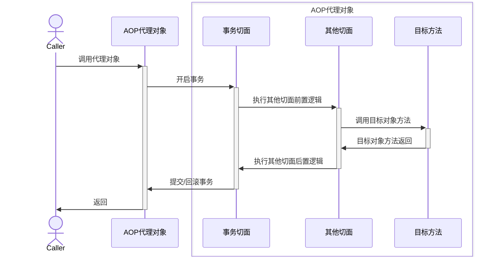

# Spring Transactional

Spring `@Transactional`的配置方式有两种:

1. xml配置文件中，添加事务管理器bean配置

```xml
<!-- 事务管理器配置，单数据源事务 -->
    <bean id="myTransactionManager"
        class="org.springframework.jdbc.datasource.DataSourceTransactionManager">
        <property name="dataSource" ref="myDataSource" />
    </bean>
<!-- 使用annotation定义事务 -->
    <tx:annotation-driven transaction-manager="myTransactionManager" />
```

2. 在使用事务的方法或者类上添加 `@Transactional("myTransactionManager")`注解.
  - 标注在类前：标示类中所有方法都进行事务处理
  - 标注在接口、实现类的方法前：标示方法进行事务处理

<!--more-->

## Spring `@Transactional`的传播行为

|事务传播行为|说明|
|:---|:---|
|`@Transactional(propagation=Propagation.REQUIRED)`|如果有事务， 那么加入事务， 没有的话新建一个(默认情况)|
|`@Transactional(propagation=Propagation.NOT_SUPPORTED)`|容器不为这个方法开启事务|
|`@Transactional(propagation=Propagation.REQUIRES_NEW)`|不管是否存在事务，都创建一个新的事务，原来的挂起，新的执行完毕，继续执行老的事务|
|`@Transactional(propagation=Propagation.MANDATORY)`|必须在一个已有的事务中执行，否则抛出异常|
|`@Transactional(propagation=Propagation.NEVER)`|必须在一个没有的事务中执行，否则抛出异常(与Propagation.MANDATORY相反)|
|`@Transactional(propagation=Propagation.SUPPORTS)`|如果其他bean调用这个方法，在其他bean中声明事务，那就用事务。如果其他bean没有声明事务，那就不用事务|

## spring `@Transactional`的属性

|属性|类型|描述|
|:---|:---|:---|
|value|String|可选的限定描述符，指定使用的事务管理器|
|propagation|enum: Propagation|可选的事务传播行为设置|
|isolation|enum: Isolation|可选的事务隔离级别设置|
|readOnly|boolean|读写或只读事务，默认读写|
|timeout|int (in seconds granularity)|事务超时时间设置|
|rollbackFor|Class对象数组，必须继承自Throwable|导致事务回滚的异常类数组|
|rollbackForClassName|类名数组，必须继承自Throwable|导致事务回滚的异常类名字数组|
|noRollbackFor|Class对象数组，必须继承自Throwable|不会导致事务回滚的异常类数组|
|noRollbackForClassName|类名数组，必须继承自Throwable|不会导致事务回滚的异常类名字数组|

## 事务

事务是应用程序中一系列严密的操作，所有操作必须成功完成，否则在每个操作中所作的所有更改都会被撤消。也就是事务具有原子性，一个事务中的一系列的操作要么全部成功，要么一个都不做。 
事务的结束有两种，当事务中的所以步骤全部成功执行时，事务提交。如果其中一个步骤失败，将发生回滚操作，撤消撤消之前到事务开始时的所以操作。

事务具有四个特征：原子性（ Atomicity ）、一致性（ Consistency ）、隔离性（ Isolation ）和持续性（ Durability ）。这四个特性简称为 ACID 特性。

- 原子性 \(Atomicity\): 原子性是指事务包含的所有操作要么全部成功，要么全部失败回滚。
- 一致性 \(Consistency\): 一致性是指事务必须使数据库从一个一致性状态变换到另一个一致性状态，也就是说一个事务执行之前和执行之后都必须处于一致性状态。
- 隔离性 \(Isolation\):隔离性是当多个用户并发访问数据库时，比如操作同一张表时，数据库为每一个用户开启的事务，不能被其他事务的操作所干扰，多个并发事务之间要相互隔离。即要达到这么一种效果：对于任意两个并发的事务T1和T2，在事务T1看来，T2要么在T1开始之前就已经结束，要么在T1结束之后才开始，这样每个事务都感觉不到有其他事务在并发地执行。

- 持久性\(Durability\): 持久性是指一个事务一旦被提交了，那么对数据库中的数据的改变就是永久性的，即便是在数据库系统遇到故障的情况下也不会丢失提交事务的操作。

## 隔离级别

|事务隔离级别|说明|
|:---|:---|
|`@Transactional(isolation = Isolation.READ_UNCOMMITTED)`|读取未提交数据(会出现脏读， 不可重复读)，基本不使用|
|`@Transactional(isolation = Isolation.READ_COMMITTED)`(oracle默认)|读取已提交数据(会出现不可重复读和幻读)|
|`@Transactional(isolation = Isolation.REPEATABLE_READ)`(mysql默认)|可重复读(会出现幻读)|
|`@Transactional(isolation = Isolation.SERIALIZABLE)`|串行化|

### 脏读

脏读是指在一个事务处理过程里读取了另一个未提交的事务中的数据。

当一个事务正在多次修改某个数据，而在这个事务中这多次的修改都还未提交，这时一个并发的事务来访问该数据，就会造成两个事务得到的数据不一致。

### 不可重复读

不可重复读是指在对于数据库中的某个数据，一个事务范围内多次查询却返回了不同的数据值，这是由于在查询间隔，被另一个事务修改并提交了。

例如事务T1在读取某一数据，而事务T2立马修改了这个数据并且提交事务给数据库，事务T1再次读取该数据就得到了不同的结果，发送了不可重复读。

不可重复读和脏读的区别是，脏读是某一事务读取了另一个事务未提交的脏数据，而不可重复读则是读取了前一事务提交的数据。

### 幻读

幻读是事务非独立执行时发生的一种现象。例如事务T1对一个表中所有的行的某个数据项做了从“1”修改为“2”的操作，这时事务T2又对这个表中插入了一行数据项，而这个数据项的数值还是为“1”并且提交给数据库。而操作事务T1的用户如果再查看刚刚修改的数据，会发现还有一行没有修改，其实这行是从事务T2中添加的，就好像产生幻觉一样，这就是发生了幻读。

幻读和不可重复读都是读取了另一条已经提交的事务（这点就脏读不同），所不同的是不可重复读查询的都是同一个数据项，而幻读更多的是一种全局的状态，所以需要的锁的粒度要更大。

## Spring @Transactional的工作原理

### 自动提交

默认情况下，数据库处于自动提交模式。每一条语句处于一个单独的事务中，在这条语句执行完毕时，如果执行成功则隐式的提交事务，如果执行失败则隐式的回滚事务。

事务管理，是一组相关的操作处于一个事务之中，因此必须关闭数据库的自动提交模式。这点，Spring会在org/springframework/jdbc/datasource/DataSourceTransactionManager.java中将底层连接的自动提交特性设置为false。

```java
// switch to manual commit if necessary。 this is very expensive in some jdbc drivers，
// so we don't want to do it unnecessarily (for example if we've explicitly
// configured the connection pool to set it already)。if (con。getautocommit())
{
    txobject.setmustrestoreautocommit(true);
    if (logger.isdebugenabled())
    {
        logger.debug("switching jdbc connection [" + con + "] to manual commit");
    }
    //首先将自动提交属性改为false
    con.setautocommit(false);
}
```

### spring事务回滚规则

Spring事务管理器回滚一个事务的推荐方法是在当前事务的上下文内抛出异常。Spring事务管理器会捕捉任何未处理的异常，然后依据规则决定是否回滚抛出异常的事务。

默认配置下，Spring只有在抛出的异常为运行时unchecked异常时才回滚该事务，也就是抛出的异常为RuntimeException的子类(Errors也会导致事务回滚)。而抛出checked异常则不会导致事务回滚。
Spring也支持明确的配置在抛出哪些异常时回滚事务，包括checked异常。也可以明确定义哪些异常抛出时不回滚事务。

还可以编程性的通过setRollbackOnly()方法来指示一个事务必须回滚，在调用完setRollbackOnly()后你所能执行的唯一操作就是回滚。

### Spring @Transactional的实现

Spring事务管理是基于接口代理或动态字节码技术，通过AOP实施事务增强的。

在代码运行时生成一个代理对象，根据@Transactional 的属性配置信息，这个代理对象决定该声明@Transactional 的目标方法是否由拦截器 TransactionInterceptor 来使用拦截。

在 TransactionInterceptor 拦截时，会在在目标方法开始执行之前创建并加入事务，并执行目标方法的逻辑, 最后根据执行情况是否出现异常，利用抽象事务管理 AbstractPlatformTransactionManager 操作数据源 DataSource 提交或回滚事务。 

下图以 CglibAopProxy 为例:


事务管理的框架是由抽象事务管理器 AbstractPlatformTransactionManager 来提供的，而具体的底层事务处理实现，由 PlatformTransactionManager 的具体实现类来实现，如事务管理器 DataSourceTransactionManager。不同的事务管理器管理不同的数据资源 DataSource，比如 DataSourceTransactionManager 管理 JDBC 的 Connection。

### 使用中的注意事项

Spring AOP 代理有 CglibAopProxy 和 JdkDynamicAopProxy 两种:

- 对于基于接口动态代理的AOP事务增强来说，由于接口的方法是public的，这就要求实现类的实现方法必须是public的（不能是protected，private等），同时不能使用static的修饰符。所以，可以实施接口动态代理的方法只能是使用“public”或“public final”修饰符的方法，其它方法不可能被动态代理，相应的也就不能实施AOP增强，也即不能进行Spring事务增强。
- 基于CGLib字节码动态代理的方案是通过扩展被增强类，动态创建子类的方式进行AOP增强植入的。由于使用final,static,private修饰符的方法都不能被子类覆盖，相应的，这些方法将不能被实施的AOP增强。

所以，必须特别注意这些修饰符的使用，`@Transactional` 注解只被应用到 public 可见度的方法上。 如果你在 protected、private 或者 package-visible 的方法上使用 `@Transactional` 注解，它也不会报错，但是这个被注解的方法将不会展示已配置的事务设置。

Spring团队的建议是你在 __具体的类__ 或 __类的方法__ 上使用 @Transactional 注解，而不要使用在类所要实现的任何接口上。你当然可以在接口上使用 `@Transactional` 注解，但是这将只能当你设置了基于接口的代理时它才生效。因为注解是不能继承的，这就意味着如果你正在使用基于类的代理时，那么事务的设置将不能被基于类的代理所识别，而且对象也将不会被事务代理所包装（将被确认为严重的）。因此，请接受Spring团队的建议并且在具体的类方法上使用 @Transactional 注解。

### 其他优化

* @Transactional 注解标识的方法，处理过程尽量的简单。尤其是带锁的事务方法，能不放在事务里面的最好不要放在事务里面。可以将常规的数据库查询操作放在事务前面进行，而事务内进行增、删、改、加锁查询等操作。

* @Transactional 注解的默认事务管理器bean是“transactionManager”，如果声明为其他名称的事务管理器，需要在方法上添加@Transational(“managerName”)。

* @Transactional 注解标注的方法中不要出现网络调用、比较耗时的处理程序，因为，事务中数据库连接是不会释放的，如果每个事务的处理时间都非常长，那么宝贵的数据库连接资源将很快被耗尽。

## Spring 的 AOP 的自调用问题

Spring事务使用AOP代理后的方法调用执行流程，如图所示：



调用事务时首先调用的是AOP代理对象而不是目标对象，首先执行事务切面，事务切面内部通过TransactionInterceptor环绕增强进行事务的增强。即进入目标方法之前开启事务，退出目标方法时提交/回滚事务。

这样在自我调用时，则会出现无法开启事务的问题，比如：

```java
public interface TargetService
{
    public void a();
    public void b();
}
@Service
public class TargetServiceImpl implements TargetService
{
    public void a()
    {
        this.b();
    }
    @Transactional(propagation = Propagation.REQUIRES_NEW)
    public void b()
    {
    //执行数据库操作
    }
}
```

此处的this指向目标对象，因此调用this.b()将不会执行b事务切面，即不会执行事务增强，因此b方法的事务定义“@Transactional(propagation = Propagation.REQUIRES_NEW)”将不会实施，即结果是b和a方法的事务是方法的事务定义是一样的。

显然使用Java动态代理是无法避免这个问题的，但是cglib可以通过继承来增强目标方法\(子类重写父类方法\)，为什么也会出现这个问题? 

这不是cglib的错,看下面的代码示例:

```java
public static <T> T createProxy(final T t){
   System.setProperty(DebuggingClassWriter.DEBUG_LOCATION_PROPERTY, "~/code");
  Enhancer enhancer=new Enhancer();
  enhancer.setClassLoader(CglibProxy.class.getClassLoader());
  enhancer.setSuperclass(t.getClass());  // 设置目标类
  enhancer.setCallback(new MethodInterceptor(){  // 回调方法，每次调用代理类的方法时，先执行该回调函数

      @Override
      public Object invoke(Object object, Method method, Object[] args，MethodProxy proxy)
              throws Throwable {
          proxy.invokeSuper(obj, args);
          return null;
      }

  });
  return (T)enhancer.create();
}
```

这是cglib使用的一个简单地例子，我们通过设置DebuggingClassWriter.DEBUG_LOCATION_PROPERTY的属性值来获取cglib生成的代理类。通过反编译代理类的class文件。我们可以发现代理类继承了目标类。代理类为每个目标类的方法生成两个方法，例如针对目标类中的每个非private方法，代理类会生成两个方法，以g方法为例：一个是@Override的g方法，一个是CGLIB$g$0（CGLIB$g$0相当于目标类的g方法）。

```java
public class Target$$EnhancerByCGLIB$$788444a0 extends Target implements Factory
{
    private MethodInterceptor CGLIB$CALLBACK_0;
    //... ...
    final void CGLIB$g$0()
    {
      super.g();
    }
    public final void g()
    {
      MethodInterceptor tmp4_1 = this.CGLIB$CALLBACK_0;
      if (tmp4_1 == null)
      {
        // 判断是否已经存在实现了MethodInterceptor接口的拦截对象
        // 如果没有的话就调用CGLIB$BIND_CALLBACKS方法来获取拦截对象
          CGLIB$BIND_CALLBACKS(this);
          tmp4_1 = this.CGLIB$CALLBACK_0;
      }
      if (this.CGLIB$CALLBACK_0 != null) {

          // @para1 obj ：代理对象本身
          // @para2 method ： 被拦截的方法对象
          // @para3 args：方法调用入参
          // @para4 proxy：用于调用被拦截方法的方法代理对象
          tmp4_1.intercept(this, CGLIB$g$0$Method, CGLIB$emptyArgs, CGLIB$g$0$Proxy);
      }
      else{
          super.g();
      }
    }
}
```

看到这里有点疑惑了，这样不会存在自调用的问题？那么下面看看spring是怎么使用的。

```java
// CglibAopProxy 部分 源码
enhancer.setCallbacks(callbacks);
-->  Callback[] callbacks = getCallbacks(rootClass);
--> {
      Callback aopInterceptor = new DynamicAdvisedInterceptor(this.advised);
      Callback[] mainCallbacks = new Callback[] {
            aopInterceptor,  // for normal advice
            targetInterceptor,  // invoke target without considering advice, if optimized
            new SerializableNoOp(),  // no override for methods mapped to this
            targetDispatcher, this.advisedDispatcher,
            new EqualsInterceptor(this.advised),
            new HashCodeInterceptor(this.advised)
      };
    }
--> private static class DynamicAdvisedInterceptor implements MethodInterceptor, Serializable {
        @Override
        public Object intercept(Object proxy, Method method, Object[] args, MethodProxy methodProxy) throws Throwable {
          // ......
          if (chain.isEmpty() && Modifier.isPublic(method.getModifiers())) {
              // We can skip creating a MethodInvocation: just invoke the target directly.
              // Note that the final invoker must be an InvokerInterceptor, so we know
              // it does nothing but a reflective operation on the target, and no hot
              // swapping or fancy proxying.
              Object[] argsToUse = AopProxyUtils.adaptArgumentsIfNecessary(method, args);
              //// 注意 此处是taget 不是 proxy,如果改为例子中的invokeSuper就没问题了
              retVal = methodProxy.invoke(target, argsToUse);

              //// 外部调用的时候其实调用的子类方法，子类方法通过MethodInterceptor处理注解，
              //// 然后调用原始对象(父类对象)的方法。至于父类方法再调用自己内部方法就跟子类无关了，所以也就处理不了注解了。
          }
          else {
              // We need to create a method invocation...
              retVal = new CglibMethodInvocation(proxy, target, method, args, targetClass, chain, methodProxy).proceed();
          }
        }
  }
```

MethodInterceptor的方法参数MethodProxy对象，在使用这个对象的时候的时候有两个方法可以让我们调用:

```java
 public Object invoke(Object obj, Object[] args) throws Throwable {
//...
            this.init();
            MethodProxy.FastClassInfo e = this.fastClassInfo;
            return e.f1.invoke(e.i1, obj, args);//f1 i1
//...
    }
    public Object invokeSuper(Object obj, Object[] args) throws Throwable {
  //...
            this.init();
            MethodProxy.FastClassInfo e = this.fastClassInfo;
            return e.f2.invoke(e.i2, obj, args);//f2 i2
//...
    }
private static class FastClassInfo {
        FastClass f1;//委托类
        FastClass f2;//代理类
        int i1;//委托类方法索引
        int i2;//代理类方法索引

        private FastClassInfo() {
        }
}
```

FastClass是Cglib实现的一种通过给方法建立下标索引来访问方法的策略，为了绕开反射。上面的描述代表MethodPeoxy可以根据对方法建立索引调用方法，而不需要使用传统Method的invoke反射调用，提高了性能.

为什么这么写? 可以参考[stackoverflow](https://stackoverflow.com/questions/48385780/why-spring-proxy-uses-delegate-pattern-instead-of-inheritancesuper)


* Option 1: Each aspect gets its own proxy. This obviously will not work unless you nest the proxies into each other according to aspect precedence. But nesting them into each other means inheritance, i.e. one proxy would have to inherit from the other outside-in. Try proxying a CGLIB proxy, it does not work, you get exceptions. Furthermore, CGLIB proxies are quite expensive and use perm-gen memory, see descriptions in this [CGLIB primer](http://mydailyjava.blogspot.com/2013/11/cglib-missing-manual.html).

* Option 2: Use composition instead of inheritance. Composition is more flexible. Having one proxy to which you can register aspects as needed solves the inheritance problem, but also means delegation: The proxy registers the aspects and calls their methods during runtime in the right order before/after the actual real object's code is executed (or not, if an @Around advice never calls proceed()). See this example from the Spring manual about [manually registering aspects to a proxy](https://docs.spring.io/spring/docs/current/spring-framework-reference/core.html#aop-aspectj-programmatic):

### 使用 AspectJ 取代 Spring AOP 代理

AspectJ的AOP实现是在原class文件上增强(可以使用@EnableLoadTimeWeaving 开启加载时编译)，不会出现调用目标方法未触发增强切面的情况。

### 自注入

Self Injection, from Spring 4.3

```java
@Controller
class XService {
    @Autowired
    private YService yService;
    @Autowired
    private XService xService;
    public void doOutside(){
        xService.doInside();//从this换成了xService
    }
    @Transactional
    private void doInside(){
        //do sql statement
    }
}
@Controller
class Test {
    @Autowired
    private XService xService;
    public void test(){
        xService.doOutside();
    }
}
```

