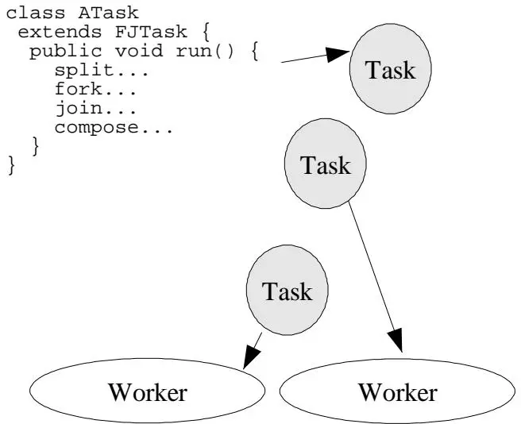
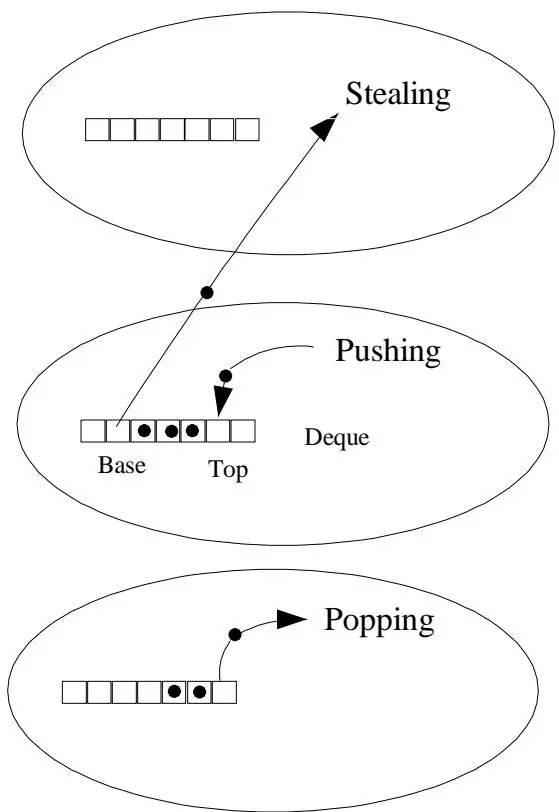
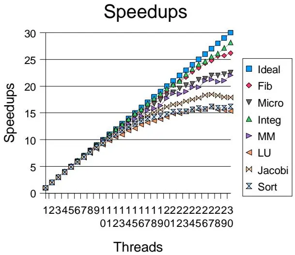
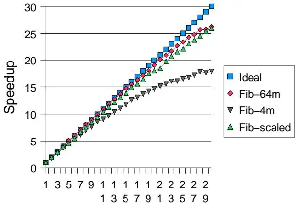
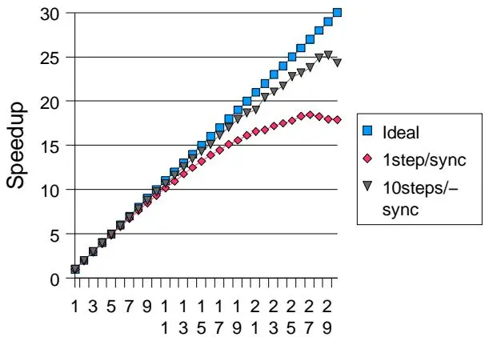
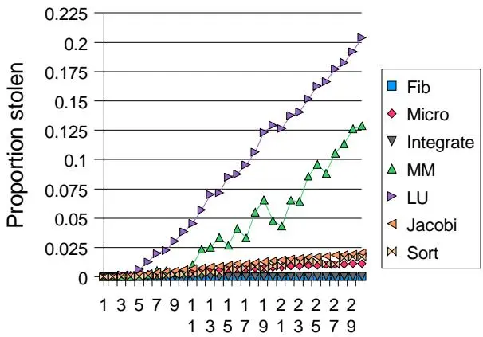
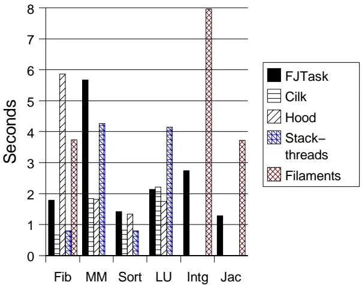

# Java并发之forkjoin框架

本文是论文 [A Java Fork/Join FrameWork](http://gee.cs.oswego.edu/dl/papers/fj.pdf)的简单介绍。

<!--more-->

## 摘要

本文描述了一个支持并行编程风格的 Java 框架的设计、实现和性能表现。在这种编程风格中，问题通过（递归地）将其分解为子任务来解决，这些子任务并行执行、等待完成，然后组合结果。总体设计是 Cilk 中发明的工作窃取框架的变体。主要实现技术围绕任务队列和工作线程的高效构建和管理。实测性能显示，大多数程序都能获得良好的并行加速效果，同时也揭示了可能的改进方向。

## 1. 引言

fork/join并行性是获得良好并行性能最简单、最有效的设计技术之一。fork/join算法是常见分治算法的并行版本，通常采用以下形式：

fork/join的经典形式如下:

```java
Result solve(Problem problem) {
  if (problem is small)
    directly solve problem
  else {
    1. split problem into independent parts
    2. fork new subtasks to solve each part
    3. join all subtasks
    4. compose result from subresults
  }
}
```

- fork操作启动一个新的并行fork/join子任务。
- join操作导致当前任务在fork的子任务完成之前不会继续执行。

fork/join算法与其他分治算法一样，几乎总是递归的，反复拆分子任务直到它们小到可以使用简单、简短的顺序方法来解决。

## 2. 设计

fork/join程序可以使用任何支持构建并行执行的子任务的框架来运行，并配有等待其完成的机制。然而，java.lang.Thread 类（以及 Java 线程通常基于的 POSIX pthreads）对于支持 fork/join 程序来说并非最优选择：

**问题1：同步开销**  
fork/join任务具有简单且规律性的同步和管理需求。fork/join任务产生的计算图允许比通用线程更高效的调度策略。例如，fork/join任务除了等待子任务外永远不需要阻塞。因此，跟踪阻塞通用线程所需的开销和记账工作被浪费了。

**问题2：线程开销**  
在合理的基任务粒度下，构造和管理线程的成本可能大于任务本身的计算时间。虽然粒度在特定平台上运行程序时可以并且应该进行调整，但抵消线程开销所需的极粗粒度限制了利用并行性的机会。

简而言之，标准线程框架对于支持大多数 fork/join 程序来说太重了。

### 2.1 解决方案：轻量级框架

虽然这些想法肯定有更长的历史，但第一个提供系统化解决方案的已发布框架是 Cilk。Cilk 和其他轻量级可执行框架在操作系统的基本线程或进程机制之上构建了专门的 fork/join 支持。这种策略同样适用于 Java。

创建这样一个 Java 轻量级执行框架的主要优势在于使 fork/join 程序能够以更可移植的方式编写，并能在支持 JVM 的各种系统上运行。

### 2.2 FJTask框架设计

FJTask 框架基于 Cilk 中使用的设计的变体。所有这些框架将任务映射到线程的方式与操作系统将线程映射到 CPU 的方式大致相同。

框架设计的四个核心组件：



1. **工作线程池**：建立一个工作线程池。每个工作线程是一个标准（"重量级"）线程（这里是 Thread 子类 FJTaskRunner 的实例），处理队列中保存的任务。通常，工作线程的数量与系统上的 CPU 数量相同。

2. **轻量级任务**：所有 fork/join 任务都是轻量级可执行类的实例，而不是线程的实例。在 Java 中，独立可执行任务必须实现 Runnable 接口并定义 run 方法。在 FJTask 框架中，这些任务继承 FJTask 而不是继承 Thread，两者都实现 Runnable。

3. **专门的队列和调度**：使用专门的队列和调度规则来管理任务并通过工作线程执行它们。这些机制由任务类中提供的少数方法触发：主要是 fork、join、isDone（完成状态指示器）以及一些便捷方法如 coInvoke（分叉然后连接两个或多个任务）。

4. **控制和管理工具**：FJTaskRunnerGroup 设置工作线程池，并在从普通线程调用时启动给定 fork/join 任务的执行。

### 2.3 斐波那契示例

作为该框架如何呈现给程序员的标准示例，下面是一个计算斐波那契函数的类：

```java
class Fib extends FJTask {
    static final int threshold = 13;
    volatile int number; // 参数/结果

    Fib(int n) { number = n; }

    int getAnswer() {
        if (!isDone())
            throw new IllegalStateException();
        return number;
    }

    public void run() {
        int n = number;
        if (n <= threshold) // 粒度控制
            number = seqFib(n);
        else {
            Fib f1 = new Fib(n - 1);
            Fib f2 = new Fib(n - 2);
            coInvoke(f1, f2);
            number = f1.number + f2.number;
        }
    }

    public static void main(String[] args) {
        try {
            int groupSize = 2;
            FJTaskRunnerGroup group = new FJTaskRunnerGroup(groupSize);
            Fib f = new Fib(35);
            group.invoke(f);
            int result = f.getAnswer();
            System.out.println("Answer: " + result);
        }
        catch (InterruptedException ex) {}
    }

    int seqFib(int n) {
        if (n <= 1) return n;
        else return seqFib(n-1) + seqFib(n-2);
    }
}
```

该版本比在每个新任务都在新的 java.lang.Thread 中运行的等效程序快三十倍以上。

### 2.4 调优参数

程序员通常感兴趣的调优参数只有两个：

1. **工作线程数**：要构造的工作线程数，通常应该对应于平台上可用的 CPU 数量（或更少，以保留处理能力用于其他不相关的目的）。

2. **粒度参数**：表示生成任务的开销超过潜在并行性收益的临界点。这个参数通常更依赖于算法而非平台。

## 3. 工作窃取

fork/join 框架的核心在于其轻量级调度机制。FJTask 采用 Cilk 工作窃取调度器开创的基本策略：

- 每个工作线程在自己的调度队列中维护可运行任务。
- 队列维护为双端队列（即 deque，通常读作"decks"），支持 LIFO 推入和弹出操作，以及 FIFO 获取操作。
- 由给定工作线程运行的任务生成的子任务被推入该工作线程自己的 deque。
- 工作线程以 LIFO（最新优先）顺序处理自己的 deque，通过弹出任务。
- 当工作线程没有本地任务可运行时，它尝试从另一个随机选择的工作线程获取（"窃取"）任务，使用 FIFO（最旧优先）规则。
- 当工作线程遇到 join 操作时，它处理其他任务（如果有的话），直到目标任务被确认已完成（通过 isDone）。
- 当工作线程没有工作且无法从其他线程窃取时，它会退让并稍后重试。



### 3.1 LIFO与FIFO规则的优势

对每个线程处理自己的任务使用 LIFO 规则，但对窃取其他任务使用 FIFO 规则，对于一大类递归 fork/join 设计是最优的：

- **减少争用**：通过让窃取者在 deque 的另一端操作来减少争用。
- **大任务优先**：利用递归分治算法尽早生成"大"任务的特性。被窃取的较旧任务可能提供更大的工作单元。

与仅使用粗粒度分区或不使用递归分解的程序相比，使用相对较小任务粒度进行基本操作的程序往往运行得更快。

## 4. 实现

该框架已用约 800 行纯 Java 代码实现，主要在类 FJTaskRunner 中，它是 java.lang.Thread 的子类。FJTask 本身只维护一个布尔完成状态，所有其他操作都通过委托给其当前工作线程来执行。

### 4.1 双端队列（Deque）

为了实现高效和可扩展的执行，任务管理必须尽可能快。创建、推入和后续弹出任务类似于顺序程序中的过程调用开销。

deque 的基本结构采用通用方案：每个 deque 使用一个（虽然是可调整大小的）数组，加上两个索引。顶部索引在 push 和 pop 时改变。底部索引仅由 take 修改。

因为 deque 数组被多个线程访问，有时没有完全同步，但单个 Java 数组元素不能声明为 volatile，所以每个数组元素实际上是一个指向维护单个 volatile 引用的小转发对象的固定引用。

### 4.2 无锁同步优化

deque 实现中的主要挑战围绕同步及其避免。每次 push 和 pop 操作都需要获取锁会成为瓶颈。然而，Cilk 中采用的策略的改编提供了一个解决方案：

- Push 和 pop 操作仅由拥有线程调用。
- 通过在 take 上的入口锁，可以轻松地将对 take 操作的访问限制为一次只允许一个窃取线程。

将 top 和 base 索引定义为 volatile 确保 pop 和 take 如果确信 deque 有多个元素，则可以在不锁定的情况下继续。这是通过类似 Dekker 的算法完成的：

```java
// push 预减 top
if (--top >= base) ...

// take 预增 base
if (++base < top) ...
```

### 4.3 窃取和空闲

工作窃取框架中的工作线程对正在运行的程序的同步需求一无所知。当所有线程都有大量工作时，这种方案的简单性会带来高效执行。

这里的主要问题是当工作线程没有本地任务且无法从任何其他线程窃取时该怎么办：

1. 从任何其他线程获取工作失败的线程在尝试额外窃取之前会降低其优先级
2. 执行 Thread.yield 在尝试之间
3. 将其注册为在 FJTaskRunnerGroup 中不活动
4. 如果所有其他线程都变为不活动，它们都会阻塞等待额外的顶层任务
5. 否则，在给定数量的额外自旋之后，线程进入睡眠阶段

## 5. 性能

本节报告的指标揭示了框架的一些基本特性。

### 5.1 测试程序

下表简要描述了七个 fork/join 测试程序：

| 程序 | 描述 |
|------|------|
| Fib | 斐波那契程序，参数 47，粒度阈值 13 |
| Integrate | 递归高斯求积 |
| Micro | 棋类游戏的最佳走法查找器 |
| Sort | 对 1 亿个数字进行合并/快速排序 |
| MM | 2048 × 2048 双精度矩阵乘法 |
| LU | 分解 4096 × 4096 双精度矩阵 |
| Jacobi | 迭代网格松弛：100步最近邻平均 |

对于主要测试，程序在运行 Solaris 7 的 30-CPU Sun Enterprise 10000 上运行。

### 5.2 加速比

可扩展性测量是通过使用 1...30 个工作线程组运行相同问题集获得的。

加速比报告为 Time_n / Time_1。整体最佳加速比出现在积分程序中（30 个线程时加速比为 28.2）。最差的是 LU 分解程序（30 个线程时加速比为 15.35）。



### 5.3 垃圾回收的影响

现代 GC 设施与 fork/join 框架完美匹配：这些程序可以生成大量任务，其中几乎所有任务在执行后很快变成垃圾。

代际半空间复制收集器很好地处理了这一点，因为它们只遍历和复制非垃圾单元。

**GC测试结果**：使用主要实验中使用的内存设置在 5.1 秒内执行的 Fib 四线程运行，如果在禁用代际复制阶段的情况下运行需要 9.1 秒。



然而，当内存分配速率如此之高以至于线程必须几乎持续停止来执行垃圾回收时，这些 GC 机制会变成可扩展性问题。

### 5.4 内存局部性和带宽

四个测试程序创建并操作非常大的共享数组或矩阵：对数字排序、乘法、分解或对矩阵执行松弛。

结果显示，增加的内存流量导致更差的加速比。

元素宽度也影响绝对性能：只使用一个线程，排序字节需要 122.5 秒，而排序长整数需要 242.4 秒。

### 5.5 任务同步

工作窃取框架在处理频繁的全局任务同步时有时会遇到问题。工作线程继续轮询更多工作，尽管没有任何工作，从而产生争用。

Jacobi 程序说明了其中一些问题。该程序执行 100 步，每一步中所有单元格都根据简单的最近邻平均公式进行更新。一个全局（基于树的）屏障分隔每一步。



### 5.6 任务局部性

FJTask 与其他 fork/join 框架一样，针对工作线程在本地消费其创建的大部分任务的情况进行了优化。当这种情况不发生时，性能可能会受到影响：

- 窃取任务的开销比弹出任务的开销大得多
- 在大多数任务对共享数据操作的情况下，运行你自己的细分任务可能保持更好的数据访问局部性



### 5.7 与其他框架的比较

对跨语言和框架的程序进行比较是不可能的。然而，相对测量可以显示 FJTask 框架与用其他语言（这里是 C 和 C++）编写的类似框架相比的一些基本优势和局限性。

从一到四个线程的加速比在不同的框架和测试程序中非常相似（在 3.0 到 4.0 之间）。



FJTask 在 JVM 上对主要对数组和矩阵进行浮点计算的程序通常表现更差。尽管 JVM 正在改进，但它们仍然不总是与 C 和 C++ 程序中使用的强大后端优化器竞争。

## 6. 结论

本文已证明在纯 Java 中支持可移植、高效、可扩展的并行处理是可能的。

### 6.1 主要发现

尽管可扩展性结果仅针对单个 JVM 显示，但一些主要经验发现应该更普遍地成立：

1. **代际GC**：虽然代际 GC 通常与并行性配合良好，但当垃圾生成速率迫使非常频繁的垃圾回收时，它可能会阻碍可扩展性。结果还表明，在多处理器 JVM 上提供调优选项以将内存扩展到活动处理器数量的必要性。

2. **可扩展性**：FJTask 在常见的 2 路、4 路和 8 路 SMP 机器上为几乎任何 fork/join 程序提供近乎理想的加速比。

3. **应用程序特征**：应用程序程序的特征（包括内存局部性、任务局部性、全局同步的使用）通常对可扩展性和绝对性能的影响比框架、JVM 或底层操作系统的特征更大。

### 6.2 未来工作

除了增量改进外，该框架的未来工作可能包括：
- 构建有用的应用程序
- 在不同 JVM 上的测量
- 为多处理器集群使用而设计的扩展开发

## 7. 参考文献

- [1] Agesen, Ole, David Detlefs, and J. Eliot B. Moss. Garbage Collection and Local Variable Type-Precision and Liveness in Java Virtual Machines. In Proceedings of 1998 ACM SIGPLAN Conference on Programming Language Design and Implementation (PLDI), 1998.

- [2] Agesen, Ole, David Detlefs, Alex Garthwaite, Ross Knippel, Y.S. Ramakrishna, and Derek White. An Efficient Meta-lock for Implementing Ubiquitous Synchronization. In Proceedings of OOPSLA '99, ACM, 1999.

- [3] Arora, Nimar, Robert D. Blumofe, and C. Greg Plaxton. Thread Scheduling for Multiprogrammed Multiprocessors. In Proceedings of the Tenth Annual ACM Symposium on Parallel Algorithms and Architectures (SPAA), 1998.

- [4] Blumofe, Robert D. and Dionisios Papadopoulos. Hood: A User-Level Threads Library for Multiprogrammed Multiprocessors. Technical Report, University of Texas at Austin, 1999.

- [5] Frigo, Matteo, Charles Leiserson, and Keith Randall. The Implementation of the Cilk-5 Multithreaded Language. In Proceedings of 1998 ACM SIGPLAN Conference on Programming Language Design and Implementation (PLDI), 1998.

- [6] Gosling, James, Bill Joy, and Guy Steele. The Java Language Specification, Addison-Wesley, 1996.

- [7] Lea, Doug. Concurrent Programming in Java, second edition, Addison-Wesley, 1999.

- [8] Lowenthal, David K., Vincent W. Freeh, and Gregory R. Andrews. Efficient Fine-Grain Parallelism on Shared-Memory Machines. Concurrency-Practice and Experience, 10,3:157-173, 1998.

- [9] Simpson, David, and F. Warren Burton. Space efficient execution of deterministic parallel programs. IEEE Transactions on Software Engineering, December, 1999.

- [10] Taura, Kenjiro, Kunio Tabata, and Akinori Yonezawa. "Stackthreads/MP: Integrating Futures into Calling Standards." In Proceedings of ACM SIGPLAN Symposium on Principles & Practice of Parallel Programming (PPoPP), 1999.

