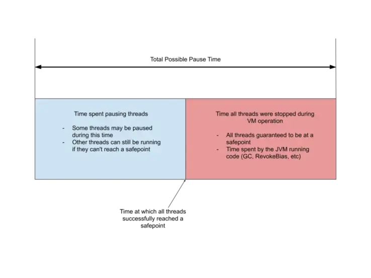

# Java虚拟机-SafePoint

> A point in program where the state of execution is known by the VM。

HotSpot的安全点定义: Safepoint 是程序执行过程中的一个点，在这个点，所有的GC根都是已知的，所有的堆对象内容都是一致的。从全局角度来看，所有的线程都必须在安全点阻塞，然后GC才能运行。（作为一种特殊情况，运行JNI代码的线程可以继续运行，因为它们只使用句柄。在安全点期间，它们必须阻塞而不是加载句柄的内容。）从局部角度来看，安全点是代码块中的一个特别点，执行线程可能会在该点阻塞GC。大多数执行点都符合安全点的条件。每个安全点都有强不变量，这些不变量在非安全点可能会被忽略。

总而言之，Safepoint 指在 Java 虚拟机中，程序执行时的一个特殊点。在 Safepoint 处，所有的线程都会被暂停下来，以便进行JVM 的一些特定的操作[<sup>1</sup>](#refer-anchor-1)。例如:

- 定时进入 SafePoint：经过`-XX:GuaranteedSafepointInterval`配置的时间，都会让所有线程进入 Safepoint，一旦所有线程都进入，立刻从 Safepoint 恢复。这个定时主要是为了一些没必要立刻 Stop the world 的任务执行，推荐设置-XX:GuaranteedSafepointInterval=0关闭这个定时
- 由于 jstack，jmap 和 jstat 等命令，也就是 Signal Dispatcher 线程要处理的大部分命令，都会导致 Stop the world：这种命令都需要采集堆栈信息，所以需要所有线程进入 Safepoint 并暂停。
- 偏向锁取消(这个不一定会引发整体的 Stop the world，参考 JEP 312: Thread-Local Handshakes):Java 认为，锁大部分情况是没有竞争的（某个同步块大多数情况都不会出现多线程同时竞争锁），所以可以通过偏向来提高性能。即在无竞争时，之前获得锁的线程再次获得锁时，会判断是否偏向锁指向我，那么该线程将不用再次获得锁，直接就可以进入同步块。但是高并发的情况下，偏向锁会经常失效，导致需要取消偏向锁，取消偏向锁的时候，需要 Stop the world，因为要获取每个线程使用锁的状态以及运行状态。
- Java Instrument 导致的 Agent 加载以及类的重定义：由于涉及到类重定义，需要修改栈上和这个类相关的信息，所以需要 Stop the world。
- Java Code Cache 相关：当发生 JIT 编译优化或者去优化，需要 OSR 或者 Bailout 或者清理代码缓存的时候，由于需要读取线程执行的方法以及改变线程执行的方法，所以需要 Stop the world
- GC：这个由于需要每个线程的对象使用信息，以及回收一些对象，释放某些堆内存或者直接内存，所以需要 Stop the world
- JFR 的一些事件：如果开启了 JFR 的 OldObject 采集，这个是定时采集一些存活时间比较久的对象，所以需要 Stop the world。同时，JFR 在 dump 的时候，由于每个线程都有一个 JFR 事件的 buffer，需要将 buffer 中的事件采集出来，所以需要 Stop the world。

<!--more-->

## SafePoint 如何实现？

SafePoint 可以插入到代码的某些位置，每个线程运行到 SafePoint 代码时，主动去检查是否需要进入 SafePoint，这个主动检查的过程，被称为 Polling。

理论上，可以在每条 Java 编译后的字节码的边界，都放一个检查 Safepoint 的机器命令。线程执行到这里的时候，会执行 Polling 询问 JVM 是否需要进入 SafePoint，这个询问是会有性能损耗的，所以 JIT 会优化尽量减少 SafePoint。

经过 JIT 编译优化的代码，会在所有方法的返回之前，和所有无界循环回跳之前放置一个 SafePoint(防止发生 GC 需要 Stop the world 时，该线程一直不能暂停)。

```java
public void run() {
    while (true) {
        // Polling SafePoint
        if (shouldProcessTask()) {
            processTask();
        }
    }
}
```

但是对于明确有界循环，为了减少 SafePoint，是不会在回跳之前放置一个SafePoint，例如:

```java
for (int i = 0; i < 100000000; i++) {
    // do something
}
```
在有界for循环里面是不会放置 SafePoint 的，这也导致了一些性能优化的问题。

> 注意，仅针对 int 有界循环，如果i 类型是long 还是会插入 SafePoint。

```java
for (int i = 0; i < 100000000; i++) {
     processTask();
}
```

上面的代码理论是会在`processTask()`函数返回前检查 SafePoint。但是实际上仍可能不进行 SafePoint 检查。因为 JIT 优化可能导致 SafePoint 被擦除，例如方法被内联时，就不会进行 SafePoint 检查。

> 可以禁用 JIT `-Djava.compiler=NONE`，看看是否由于 JIT 导致。

## SafePoint 流程

在JVM中，存在一个单例的原始线程VM Thread[<sup>3</sup>](#refer-anchor-3)，它会产生创建所有其他JVM线程，同时也会被其他线程用于执行一些成本较高的VM Operions[<sup>1</sup>](#refer-anchor-1)。这些VM Operations会保存在VMOperationQueue中，通过自轮询方法loop()进行处理。

在VM Thread退出和轮询处理VM Operations的过程中，需要STW来保证结果的准确性，就调用`SafepointSynchronize::begin()`进入SafePoint。

- `VMThread::run() -> SafepointSynchronize::begin()`，意味着JVM即将关闭，此时会进入SafePoint，进行退出前的检查，并等待native thread执行完毕，最终关闭整个JVM。此时就没有调用`SafepointSynchronize::end()`
- `VMThread::loop() -> SafepointSynchronize::begin()`。处理完VM Operations后，通过调用`SafepointSynchronize::end()`退出SafePoint。

接下来，分析下`SafepointSynchronize::begin()`内的操作。由于JVM线程可能处于不同的状态，为了能够让它们能够进入SafePoint，JVM设计了不同的机制。

### 解释执行中

调用`Interpreter::notice_safepoints()`方法，通知解释器更新dispatch table，在下一条字节码执行前，强制检查`SafePoint`条件.

### 本地方法代码段执行中

当某个线程在执行native函数的时候。此时该线程在执行JVM管理之外的代码，不能对JVM的执行状态做任何修改，因而JVM要进入safepoint不需要关心它。JVM外部要对JVM执行状态做修改必须要通过JNI。所有能修改JVM执行状态的JNI函数在入口处都有safepoint检查。

如果VM thread发现一个Java thread正在执行native code，并不会等待该Java thread阻塞，不过当该Java thread从native code返回时，必须检查safepoint状态，看是否需要进行阻塞。这里涉及到两个状态：Java thread state和safepoint state，两者之间有着严格的读写顺序，一般可以通过内存屏障实现，但是性能开销比较大，Hotspot采用另一种方式，调用os::serialize_thread_states()把每个线程的状态依次写入到同一个内存页中,通过VM thread执行一系列mprotect os call，保证之前所有线程状态的写入可以被顺序执行，效率更高。

> 所以也可以把正在执行native函数的线程看作“已经进入了safepoint”，或者把这种情况叫做“在safe-region里”。

### 编译执行中

如果想进入safepoint，则设置polling page不可读，当Java thread发现该内存页不可读时，最终会被阻塞挂起。在SafepointSynchronize::begin()方法中，通过os::make_polling_page_unreadable()方法设置polling page为不可读。方法make_polling_page_unreadable()在不同系统的实现不一样:

```cpp
// linux下实现
// Mark the polling page as unreadable
void os::make_polling_page_unreadable(void) {
  if( !guard_memory((char*)_polling_page, Linux::page_size()) )
    fatal("Could not disable polling page");
};

// solaris下实现
// Mark the polling page as unreadable
void os::make_polling_page_unreadable(void) {
  if( mprotect((char *)_polling_page, page_size, PROT_NONE) != 0 )
    fatal("Could not disable polling page");
};
```

在JIT编译中，编译器会把safepoint检查的操作插入到机器码指令中，比如下面的指令：

```c
0x01b6d627: call   0x01b2b210         ; OopMap{[60]=Oop off=460}      
                                      ;*invokeinterface size      
                                      ; - Client1::main@113 (line 23)      
                                      ;   {virtual_call}      
0x01b6d62c: nop                       ; OopMap{[60]=Oop off=461}      
                                      ;*if_icmplt      
                                      ; - Client1::main@118 (line 23)      
0x01b6d62d: test   %eax,0x160100      ;   {poll}      
0x01b6d633: mov    0x50(%esp),%esi      
0x01b6d637: cmp    %eax,%esi     
```

test %eax,0x160100 就是一个检查polling page是否可读的操作，如果不可读，则该线程会被挂起等待。

### 阻塞中 

即使线程已经满足了block condition，也要等到safepoint operation完成，如GC操作，才能返回。

### 状态转换中 

会去检查safepoint状态，如果需要阻塞，就把自己挂起。

> safepoint 的相关代码在 `safepoint.cpp`[<sup>2</sup>](#refer-anchor-2)中，

### polling page 原理

Polling Page可以理解为是JVM申请的一块页空间，是专门用于SafePoint检测。在JVM初始化时，会通过mmap申请一块大小为Linux:page_siez()（即4K）的空间作为Polling Page。在初始化时，页空间会设置为可读。

```cpp
polling_page = (address) ::mmap(NULL, Linux::page_size(), PROT_READ, MAP_PRIVATE|MAP_ANONYMOUS, -1, 0);
```

`SIGSEGV` 是一个内核发送出来的信号，当线程尝试访问不被允许访问的内存区域，或以错误的类型访问内存区域时，会触发该信号。进而触发JVM的signal handler来阻塞这个线程。

当收到SIGSEGV信号，且接收信号的线程是应用线程，就会判断发生段错误的地址是不是Polling Page[<sup>5</sup>](#refer-anchor-5)。

```cpp
if (thread->thread_state() == _thread_in_Java) {
  if (sig == SIGSEGV && os::is_poll_address((address)info->si_addr)) {
    stub = SharedRuntime::get_poll_stub(pc);
  }
}
static bool is_poll_address(address addr)  {
    return addr >= _polling_page && addr < (_polling_page + os::vm_page_size());
}
```

此时，如果发生段错误的地址高于_polling_page地址，且在以_polling_page地址为起始的一个页空间内，则认为是Polling Page发生了段错误，触发stub地址对应的注册函数进行处理[<sup>6</sup>](#refer-anchor-6)，而这个注册函数，就是 `SafepointSynchronize::handle_polling_page_exception`。

```cpp
#if defined(COMPILER2) || INCLUDE_JVMCI
  // Vectors are generated only by C2 and JVMCI.
  bool support_wide = is_wide_vector(MaxVectorSize);
  if (support_wide) {
    _polling_page_vectors_safepoint_handler_blob = generate_handler_blob(CAST_FROM_FN_PTR(address, SafepointSynchronize::handle_polling_page_exception), POLL_AT_VECTOR_LOOP);
  }
#endif // COMPILER2 || INCLUDE_JVMCI
  _polling_page_safepoint_handler_blob = generate_handler_blob(CAST_FROM_FN_PTR(address, SafepointSynchronize::handle_polling_page_exception), POLL_AT_LOOP);
  _polling_page_return_handler_blob    = generate_handler_blob(CAST_FROM_FN_PTR(address, SafepointSynchronize::handle_polling_page_exception), POLL_AT_RETURN);
... ... 
... ... 
address SharedRuntime::get_poll_stub(address pc) {
  address stub;
  // Look up the code blob
  CodeBlob *cb = CodeCache::find_blob(pc);
  ... ...

  bool at_poll_return = cb->as_nmethod()->is_at_poll_return(pc);
  bool has_wide_vectors = cb->as_nmethod()->has_wide_vectors();
  if (at_poll_return) {
    assert(SharedRuntime::polling_page_return_handler_blob() != nullptr,
           "polling page return stub not created yet");
    stub = SharedRuntime::polling_page_return_handler_blob()->entry_point();
  } else if (has_wide_vectors) {
    assert(SharedRuntime::polling_page_vectors_safepoint_handler_blob() != nullptr,
           "polling page vectors safepoint stub not created yet");
    stub = SharedRuntime::polling_page_vectors_safepoint_handler_blob()->entry_point();
  } else {
    assert(SharedRuntime::polling_page_safepoint_handler_blob() != nullptr,
           "polling page safepoint stub not created yet");
    stub = SharedRuntime::polling_page_safepoint_handler_blob()->entry_point();
  }
  log_debug(safepoint)("... found polling page %s exception at pc = "
                       INTPTR_FORMAT ", stub =" INTPTR_FORMAT,
                       at_poll_return ? "return" : "loop",
                       (intptr_t)pc, (intptr_t)stub);
  return stub;
}
```

test指令就是实现SafePoint检查的关键，指令的其中一个参数会设置为Polling Page的起始地址。

- 当不需要进入SafePoint时，由于Polling Page会初始化为可读状态，所以test执行会执行成功，线程继续执行；
- 当需要进入SafePoint时，JVM会将Polling Page设置为不可读，此时test命令由于尝试读取一块并不允许访问的内存区域而触发段错误，内核发出SIGSEGV信号，此时线程收到信号后，就会调用注册的`SafepointSynchronize::handle_polling_page_exception`函数进行处理，`handle_polling_page_exception`会阻塞线程(使用`SafepointSynchronize::block`方法)直到最终进入SafePoint。

在`SafepointSynchronize::end()`中，会最终唤醒所有挂起等待的线程。

```cpp
// 重新设置pooling page为可读
if (PageArmed) {
  // Make polling safepoint aware
  os::make_polling_page_readable();
  PageArmed = 0 ;
}
// 设置解释器为ignore_safepoints
Interpreter::ignore_safepoints();
... ...
// 唤醒所有挂起等待的线程
for(JavaThread *current = Threads::first(); current; current = current->next()) {
  // A problem occurring on Solaris is when attempting to restart threads
  // the first #cpus - 1 go well, but then the VMThread is preempted when we get
  // to the next one (since it has been running the longest).  We then have
  // to wait for a cpu to become available before we can continue restarting
  // threads.
  // FIXME: This causes the performance of the VM to degrade when active and with
  // large numbers of threads.  Apparently this is due to the synchronous nature
  // of suspending threads.
  //
  // TODO-FIXME: the comments above are vestigial and no longer apply.
  // Furthermore, using solaris' schedctl in this particular context confers no benefit
  if (VMThreadHintNoPreempt) {
    os::hint_no_preempt();
  }
  ThreadSafepointState* cur_state = current->safepoint_state();
  assert(cur_state->type() != ThreadSafepointState::_running, "Thread not suspended at safepoint");
  cur_state->restart();
  assert(cur_state->is_running(), "safepoint state has not been reset");
}

```

## SafePoint耗时



- 从启动安全点请求到所有线程到达安全点所花费的时间 
- 执行安全点操作所花费的时间。

SafePoint 阶段导致 Stop the world 时间过长的原因有：

- 等待所有线程中的某些线程进入 Safepoint 的时间过长，这个很可能和有大有界循环与 JIT 优化 有关，也很可能是 OpenJDK 11 引入的获取调用堆栈的类 StackWalker 的使用导致的，也可能是系统 CPU 资源问题或者是系统内存脏页过多或者发生 swap 导致的。
- 执行安全点操作耗时过长，需要看看是哪些操作导致的，例如偏向锁撤销过多， GC 时间过长等等，需要想办法减少这些操作消耗的时间，或者直接关闭这些事件（例如关闭偏向锁，关闭 JFR 的 OldObjectSample 事件采集）减少进入。
- 还有一个常常被忽略的原因，操作系统本身资源紧张，例如 CPU 负载太高导致拿不到 CPU。

## SafePoint VM Option

### 定时

- `-XX:GuaranteedSafepointInterval=5000`, 5s执行一次
- `-XX:GuaranteedSafepointInterval=0`,推荐关闭。

### 有界循环优化

JVM 为了避免安全点过多带来过重的负担，对循环有一项优化措施，认为循环次数较少的话，执行时间应该不会太长，所以使用 int 类型和范围更小的数据类型作为索引值的循环默认是不会被放置安全点的。这种循环被称为可数循环，相对应的，使用 long 或者范围更大的数据类型作为索引值的循环就被称为不可数循环，将被放置安全点。

`-XX:+UseCountedLoopSafepoints`: 可以避免GC发生时，线程因长时间运行counted loop，进入不到safepoint，而引起GC的STW时间过长。

### 关闭偏向锁

`-XX:-UseBiasedLocking`: 在高并发应用中，偏向锁并不能带来性能提升，反而因为偏向锁取消带来了很多没必要的某些线程进入安全点。

### Thread Local Handshake

Java10引入了Thread Local Handshake功能[<sup>7</sup>](#refer-anchor-7),通过减少全局安全点的数量来帮助 VM 实现更低的延迟。有了ThreadLocal Handshake这个新功能后，就允许一些操作只在单个线程执行，而不必要求所有的线程都达到安全点才行。操作有:

1. 偏向锁撤销。这个事情只需要停止单个线程就可以撤销偏向锁，而不需要停止所有的线程。
2. 减少不同类型的可服务性查询的总体VM延迟影响，例如获取具有大量Java线程的VM上的所有线程的stack trace可能是一个缓慢的操作。
3. 通过减少对信号（signals）的依赖来执行更安全的stack trace采样。
4. 使用所谓的非对称Dekker同步技术，通过与Java线程握手来消除一些内存障碍。 例如，G1和CMS里使用的“条件卡标记码”（conditional card mark code），将不再需要“内存屏障”这个东东。这样的话，G1发送的“写屏障（write barrier）”就可以被优化， 并且那些尝试要规避“内存屏障”的分支也可以被删除了。


### 日志

- jdk11前

```sh
-XX:+PrintGCApplicationStoppedTime
-XX:+PrintSafepointStatistics
-XX:PrintSafepointStatisticsCount=1
```

- jdk11后

```sh
-Xlog:safepoint=trace:stdout:utctime,level,tags
```

### 分析

```sh
-XX:+SafepointTimeout
-XX:SafepointTimeoutDelay=<timeout in ms>
```

哪些线程超过 xxx ms没有到达safepoint。

## async-profiler

通常CPU Profiler有两种实现:

- Sampling:基于对StackTrace的“采样”进行实现，核心原理如下：
  - 引入Profiler依赖，或直接利用Agent技术注入目标JVM进程并启动Profiler。
  - 启动一个采样定时器，以固定的采样频率每隔一段时间（毫秒级）对所有线程的调用栈进行Dump。
  - 汇总并统计每次调用栈的Dump结果，在一定时间内采到足够的样本后，导出统计结果，内容是每个方法被采样到的次数及方法的调用关系。
- Instrumentation则是利用Instrument API，对所有必要的Class进行字节码增强，在进入每个方法前进行埋点，方法执行结束后统计本次方法执行耗时，最终进行汇总。

Sampling由于低开销的特性，更适合用在CPU密集型的应用中，以及不可接受大量性能开销的线上服务中。而Instrumentation则更适合用在I/O密集的应用中、对性能开销不敏感以及确实需要精确统计的场景中。社区的Profiler更多的是基于Sampling来实现。

基于Sampling的CPU Profiler通过采集程序在不同时间点的调用栈样本来近似地推算出热点方法，因此，从理论上来讲Sampling CPU Profiler必须遵循以下两个原则：

- 样本必须足够多。
- 程序中所有正在运行的代码点都必须以相同的概率被Profiler采样。
如果只能在安全点采样，就违背了第二条原则。因为我们只能采集到位于安全点时刻的调用栈快照，意味着某些代码可能永远没有机会被采样，即使它真实耗费了大量的CPU执行时间，这种现象被称为“SafePoint Bias”。

async-profiler是通过AsyncGetCallTrace实现的CPU Profiler，不受安全点影响。

async-profiler提供了--ttsp的选项，用来分析safepoint事件，如下：

```sh
## --ttsp or 
$ asprof -e wall -t -i 5ms --ttsp -f result.html 8983 
```

可以仅在发生超时safepoint时才采集线程栈，使用

```
--begin SafepointSynchronize::print_safepoint_timeout
--end RuntimeService::record_safepoint_synchronized
```

因为safepoint超时的时候会调用SafepointSynchronize::print_safepoint_timeout方法打印上面介绍过的超时未到safepoint线程的日志。

最后一个到达safepoint的线程会调用`Monitor::notify_all`唤醒safepoint协调线程，那使用`-e Monitor::notify_all`抓取的线程栈会更加准确


## 参考

<div id="refer-anchor-1"></div>

- [1][jdk10: vm_operations.hpp](https://hg.openjdk.org/jdk10/jdk10/hotspot/file/5ab7a67bc155/src/share/vm/runtime/vm_operations.hpp)

<div id="refer-anchor-2"></div>

- [2][jdk10: safepoint.cpp](https://hg.openjdk.org/jdk10/jdk10/hotspot/file/5ab7a67bc155/src/share/vm/runtime/safepoint.cpp)

<div id="refer-anchor-3"></div>

- [3][jdk10: vmThread.cpp](https://hg.openjdk.org/jdk10/jdk10/hotspot/file/5ab7a67bc155/src/share/vm/runtime/vmThread.cpp)

<div id="refer-anchor-4"></div>

- [4][jdk10: globalDefinitions.hpp](https://hg.openjdk.org/jdk10/jdk10/hotspot/file/46bb2774fc88/src/share/vm/utilities/globalDefinitions.hpp)

<div id="refer-anchor-5"></div>

- [5][jdk10: os_linux_x86.cpp](https://hg.openjdk.org/jdk10/jdk10/hotspot/file/46bb2774fc88/src/os_cpu/linux_x86/vm/os_linux_x86.cpp)

<div id="refer-anchor-6"></div>

- [6][jdk10: sharedRuntime.cpp](https://hg.openjdk.org/jdk10/jdk10/hotspot/file/2ed5748b6eec/src/share/vm/runtime/sharedRuntime.cpp)

<div id="refer-anchor-7"></div>

- [7][JEP 312: Thread-Local Handshakes](https://openjdk.org/jeps/312)

- [8][Safepoints: Meaning, Side Effects and Overheads](https://psy-lob-saw.blogspot.com/2015/12/safepoints.html)

- [9][JVM CPU Profiler技术原理及源码深度解析](https://tech.meituan.com/2019/10/10/jvm-cpu-profiler.html)

