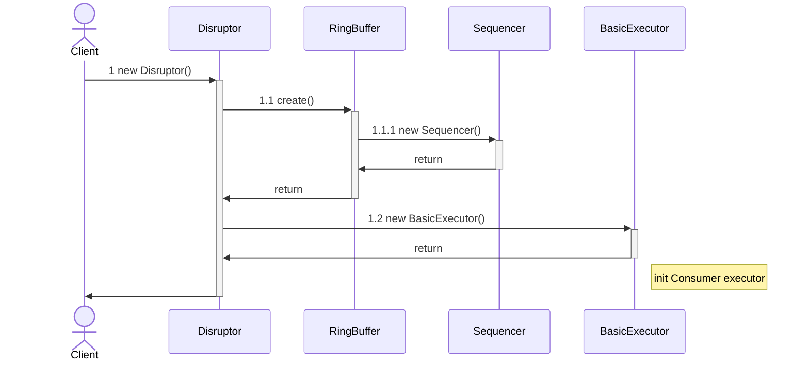
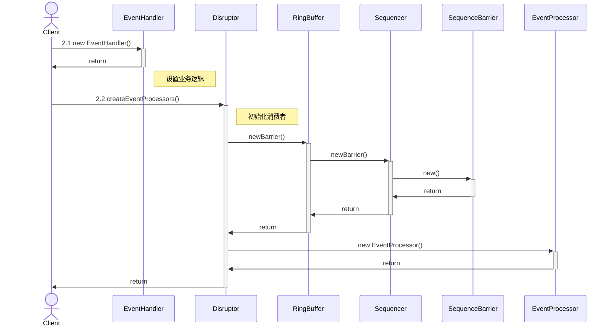
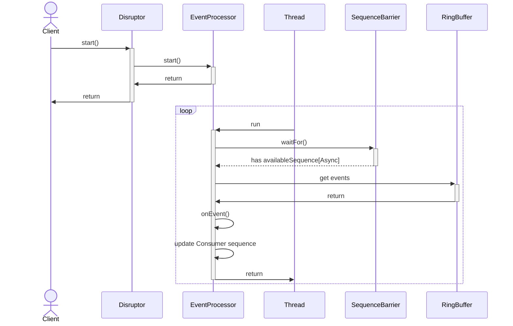
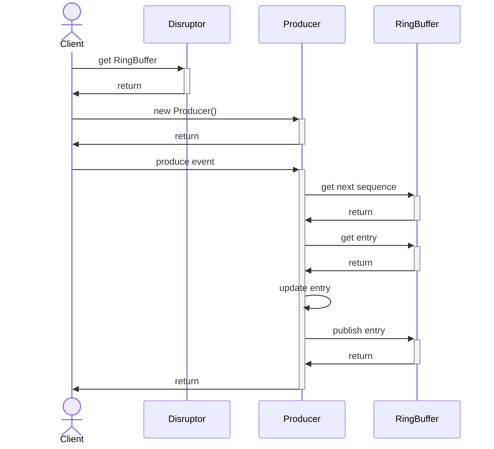
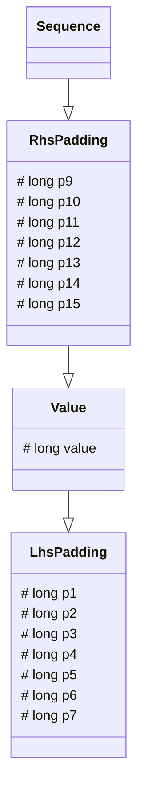

# disruptor学习笔记

LMAX Disruptor是一个高性能的线程间消息库。下面是其简单架构示意图


<!--more-->

## 核心组件

* Ring Buffer: Disruptor底层数据结构实现，核心类，是线程间交换数据的中转地；
* Sequence: 序号，声明一个序号，用于跟踪ringbuffer中任务的变化和消费者的消费情况；
* Sequencer: Sequencer是disruptor的真正核心。序号管理器，负责消费者/生产者各自序号、序号栅栏的管理和协调；
* Sequence Barrier: 序号栅栏，管理和协调生产者的游标序号和各个消费者的序号，确保生产者不会覆盖消费者未来得及处理的消息，确保存在依赖的消费者之间能够按照正确的顺序处理；
* Wait Strategy: 等待策略，决定了消费者如何等待事件。
* Event : 生产者传递给消费者的数据单元。
* EventProcessor: 事件处理器，监听RingBuffer的事件，并消费可用事件，从RingBuffer读取的事件会交由实际的生产者实现类来消费；它会一直侦听下一个可用的序号，直到该序号对应的事件已经准备好。
* EventHandler: 业务处理器，是实际消费者的接口，完成具体的业务逻辑实现，第三方实现该接口；代表着消费者。
* Producer: 生产者接口，第三方线程充当该角色，producer向RingBuffer写入事件\(实际调用Sequencer方法\)。对于ringbuffer内的存储空间而言，实际上的生产者是Sequencer。
* EventHandlerGroup——业务处理器分组，管理多个业务处理器的依赖关系，提供then()、before()、after()等api;
* ConsumerRepository: 维持`EventHandler`s 和 `EventProcessor`s 关系的仓库;
```mermaid
classDiagram
    class DataProvider~T~{
        +get(long sequence) T
    }
    &lt;&lt;interface>> DataProvider
    class RingBuffer{
        - Sequencer sequencer
        - int bufferSize
        - Object[] entries
        + next() long
        + addGatingSequences() 
        + newBarrier() SequenceBarrier
        + getCursor() long
        + publish(long sequence)
        + get() Object
    }
    RingBuffer ..|> DataProvider: 发布事件
    class Producer{
       - RingBuffer ringBuffer 
    }
    Producer "1" *--> "1" RingBuffer: 生产事件
    class Sequencer{
        + isAvailable(long sequence) boolean
        + addGatingSequences()
        + removeGatingSequence(Sequence sequence) boolean
        + newBarrier() SequenceBarrier
        + ~T~ newPoller(DataProvider~T~ provider, Sequence... gatingSequences) EventPoller~T~
    }
    &lt;&lt;interface>> Sequencer
    class AbstractSequencer{
        - int bufferSize
        - WaitStrategy waitStrategy
        - Sequence cursor 
        - Sequence[] gatingSequences
        + getCursor() long
        + getBufferSize() long
        + addGatingSequences()
        + removeGatingSequence(Sequence sequence) boolean
        + newBarrier() SequenceBarrier
    }
    &lt;&lt;abstract>> AbstractSequencer
    AbstractSequencer ..|> Sequencer: 实现
    RingBuffer "1" *--> "1" Sequencer: 属性
    class WaitStrategy
    &lt;&lt;interface>> WaitStrategy
    AbstractSequencer "1" *--> "1" WaitStrategy: 属性
    class Sequence
    AbstractSequencer "1" *-->"*" Sequence : 管理序号
    AbstractSequencer "1" *-->"*" SequenceBarrier : 管理消费序号顺序约束
    class EventProcessor{
        + getSequence() long
        + halt()
    }
    &lt;&lt;interface>> EventProcessor
    class BatchEventProcessor{
        - SequenceBarrier sequenceBarrier
        - EventHandler eventHandler
        - Sequence sequence
        - DataProvider dataProvider
        + run()
        + notifyStart()
        + notifyShutdown()
    }
    BatchEventProcessor..|> EventProcessor: 实现
    BatchEventProcessor "1" *--> "1" RingBuffer: 消费事件
    BatchEventProcessor "1" *--> "1" Sequence: 消费事件的序号
    BatchEventProcessor "1" *--> "1" SequenceBarrier: 消费序号顺序约束
    class EventHandler{
        + onEvent()
    }
    &lt;&lt;interface>> EventHandler
    BatchEventProcessor "1" *--> "1" EventHandler: 属性
    class ExceptionHandler{
        + handleEventException()
    }
    &lt;&lt;interface>> ExceptionHandler
    BatchEventProcessor "1" *--> "1" ExceptionHandler: 属性
```

## 如何使用

使用例子来自[官方demo](https://github.com/LMAX-Exchange/disruptor/wiki/Getting-Started)

### event

首先，定义将携带数据的事件。

```java
public class LongEvent{
    private long value;

    public void set(long value){
        this.value = value;
    }
}
```

为了让Disruptor能够预先分配这些事件，我们需要一个工厂EventFactory。

```java
import com.lmax.disruptor.EventFactory;

public class LongEventFactory implements EventFactory<LongEvent>{
    public LongEvent newInstance(){
        return new LongEvent();
    }
}
```

### consumer

```java
import com.lmax.disruptor.EventHandler;

public class LongEventHandler implements EventHandler<LongEvent>{
    public void onEvent(LongEvent event, long sequence, boolean endOfBatch){
        System.out.println("Event: " + event);
    }
}
```

### producer

```java
import com.lmax.disruptor.RingBuffer;

public class LongEventProducer{
    private final RingBuffer<LongEvent> ringBuffer;

    public LongEventProducer(RingBuffer<LongEvent> ringBuffer){
        this.ringBuffer = ringBuffer;
    }

    public void onData(ByteBuffer bb){
        long sequence = ringBuffer.next();  // 获取序号
        try{
            // 获得序号对应的对象空间
            LongEvent event = ringBuffer.get(sequence);
            // 向对象中填充数据
            event.set(bb.getLong(0));
        }
        finally{
            // 发布
            ringBuffer.publish(sequence);
        }
    }
}
```

Disruptor的3.0版本，添加了更丰富的Lambda风格的API，以帮助开发人员将此复杂性封装在Ring Buffer中，因此3.0之后发布消息的首选方法是通过API的Event Publisher / Event Translator部分。例如:

```java
import com.lmax.disruptor.RingBuffer;
import com.lmax.disruptor.EventTranslatorOneArg;

public class LongEventProducerWithTranslator
{
    private final RingBuffer<LongEvent> ringBuffer;
    public LongEventProducerWithTranslator(RingBuffer<LongEvent> ringBuffer)
    {
        this.ringBuffer = ringBuffer;
    }
    private static final EventTranslatorOneArg<LongEvent, ByteBuffer> TRANSLATOR =
        new EventTranslatorOneArg<LongEvent, ByteBuffer>()
        {
            public void translateTo(LongEvent event, long sequence, ByteBuffer bb)
            {
                event.set(bb.getLong(0));
            }
        };

    public void onData(ByteBuffer bb)
    {
        ringBuffer.publishEvent(TRANSLATOR, bb);
    }
}
```

这种方法的另一个优点是翻译器代码可以被拉入一个单独的类中，并可以轻松地单独进行单元测试。Disruptor提供了许多不同的接口（EventTranslator，EventTranslatorOneArg，EventTranslatorTwoArg等），可以实现这些接口以提供翻译。

### example

```java
import com.lmax.disruptor.dsl.Disruptor;
import com.lmax.disruptor.RingBuffer;
import java.nio.ByteBuffer;
import com.lmax.disruptor.BlockingWaitStrategy;
import java.util.concurrent.ThreadFactory;

public class LongEventMain
{
    public static void main(String[] args) throws Exception
    {
        // 消费者线程工厂
       ThreadFactory threadFactory = new ThreadFactory(){

            @Override
            public Thread newThread(Runnable r) {
                return new Thread(r);
            }
        };

        // 事件工厂
        LongEventFactory eventFactory = new LongEventFactory();

        // ringbuffer的大小，2的幂
        int bufferSize = 1024;

        // Construct the Disruptor
        Disruptor<LongEvent> disruptor = new Disruptor<>(
                eventFactory,
                bufferSize,
                threadFactory,
                ProducerType.SINGLE,
                new BlockingWaitStrategy() // 等待策略
            );

        // Connect the handler
        disruptor.handleEventsWith(new LongEventHandler()); // 1个消费者
        // disruptor.handleEventsWith(new LongEventHandler()); // 连接两次，2个消费者

        // Start the Disruptor, starts all threads running
        disruptor.start();

        // Get the ring buffer from the Disruptor to be used for publishing.
        RingBuffer<LongEvent> ringBuffer = disruptor.getRingBuffer();

        LongEventProducer producer = new LongEventProducer(ringBuffer);

        ByteBuffer bb = ByteBuffer.allocate(8);
        for (long l = 0; true; l++)
        {
            bb.putLong(0, l);
            producer.onData(bb);
            Thread.sleep(1000);
        }
    }
}
```

## 源码分析

### 时序图

1. 初始化Disruptor



2. 初始化消费者



3. 消费者消费数据



4. 生产数据



### Sequence



这里对于Sequence的核心就是value这个volatile long类型的变量，它就是代表下一个位置。p1~p15这些是为了避免CPU伪共享的出现\(false sharing\)。在value前后添加，保证每个CacheLine中只有一个Disruptor中的Sequence。

下面详细分析Sequence源码:

```java
public class Sequence extends RhsPadding {
    static final long INITIAL_VALUE = -1L;
    private static final Unsafe UNSAFE;
    private static final long VALUE_OFFSET;

    static{
        UNSAFE = Util.getUnsafe();
        try{
            VALUE_OFFSET = UNSAFE.objectFieldOffset(Value.class.getDeclaredField("value"));
        }
        catch (final Exception e){
            throw new RuntimeException(e);
        }
    }

    /**
     * 默认初始value为-1
     */
    public Sequence(){
        this(INITIAL_VALUE);
    }

    public Sequence(final long initialValue){
        UNSAFE.putOrderedLong(this, VALUE_OFFSET, initialValue);
    }

    /**
     * volatile read
     */
    public long get(){
        return value;
    }

    /**
     * 利用Unsafe更新value的地址内存上的值从而更新value的值
     */
    public void set(final long value){
        UNSAFE.putOrderedLong(this, VALUE_OFFSET, value);
    }

    /**
     * 利用Unsafe原子更新value
     */
    public void setVolatile(final long value){
        UNSAFE.putLongVolatile(this, VALUE_OFFSET, value);
    }

    /**
     * 利用Unsafe CAS
     */
    public boolean compareAndSet(final long expectedValue, final long newValue){
        return UNSAFE.compareAndSwapLong(this, VALUE_OFFSET, expectedValue, newValue);
    }

    /**
     * 原子增长1
     */
    public long incrementAndGet(){
        return addAndGet(1L);
    }

    /**
     * 原子增长提供的值
     */
    public long addAndGet(final long increment) {
        long currentValue;
        long newValue;

        do{
            currentValue = get();
            newValue = currentValue + increment;
        }
        while (!compareAndSet(currentValue, newValue));
        return newValue;
    }
}
```

### Producer\(Sequencer\)

```mermaid
classDiagram
    class Sequenced{
        + getBufferSize() int 
        + hasAvailableCapacity(int requiredCapacity) boolean
        + remainingCapacity() long 
        + next() long
        + next(int n) long
        + tryNext() long
        + tryNext(int n) long
        + publish(long sequence)
        + publish(long lo, long hi) 
    }
    &lt;&lt;interface>> Sequenced
    class Cursored{
        + getCursor() long
    }
    &lt;&lt;interface>> Cursored
    class Sequencer
    &lt;&lt;interface>> Sequencer
    Sequencer ..|> Sequenced
    Sequencer ..|> Cursored
    class AbstractSequencer
    &lt;&lt;abstract>> AbstractSequencer
    AbstractSequencer --|> Sequencer
    class SingleProducerSequencerPad
    &lt;&lt;abstract>> SingleProducerSequencerPad
    SingleProducerSequencerPad --|> AbstractSequencer
     class SingleProducerSequencerFields
    &lt;&lt;abstract>> SingleProducerSequencerFields
    SingleProducerSequencerFields--|> SingleProducerSequencerPad
     class SingleProducerSequencer
    SingleProducerSequencer--|>SingleProducerSequencerFields
    class MultiProducerSequencer
    MultiProducerSequencer--|> AbstractSequencer
```

* Cursored接口：实现此接口的类，可以理解为，记录某个sequence的类。例如，生产者在生产消息时，需要知道当前ringBuffer下一个生产的位置，这个位置需要更新，每次更新，需要访问getCursor来定位。
* Sequenced接口：实现此接口类，可以理解为，实现一个有序的存储结构，也就是RingBuffer的一个特性。一个Producer，在生产Event时，先获取下一位置的Sequence，之后填充Event，填充好后再publish，这之后，这个Event就可以被消费处理了。
    * getBufferSize获取ringBuffer的大小
    * hasAvailableCapacity判断空间是否足够
    * remainingCapacity获取ringBuffer的剩余空间
    * next申请下一个或者n个sequence(value)作为生产event的位置
    * tryNext尝试申请下一个或者n个sequence(value)作为生产event的位置，容量不足会抛出InsufficientCapacityException
    * publish发布Event
* Sequencer接口：Sequencer接口，扩展了Cursored和Sequenced接口。
    * INITIAL_CURSOR_VALUE： -1 为 sequence的起始值
    * claim： 申请一个特殊的Sequence，只有设定特殊起始值的ringBuffer时才会使用（一般是多个生产者时才会使用）
    * isAvailable：非阻塞，验证一个sequence是否已经被published并且可以消费.
    * addGatingSequences：将这些sequence加入到需要跟踪处理的gatingSequences中.
    * removeGatingSequence：移除某个sequence.
    * newBarrier：给定一串需要跟踪的sequence，创建SequenceBarrier。SequenceBarrier是用来给多消费者确定消费位置是否可以消费用的.
    * getMinimumSequence：获取这个ringBuffer的gatingSequences中最小的一个sequence.
    * getHighestPublishedSequence：获取最高可以读取的Sequence.

抽象类AbstractSequencer实现Sequencer这个接口,定义了5个域.

```java
// 是用来原子更新gatingSequences 的工具类
private static final AtomicReferenceFieldUpdater<AbstractSequencer, Sequence[]> SEQUENCE_UPDATER =
        AtomicReferenceFieldUpdater.newUpdater(AbstractSequencer.class, Sequence[].class, "gatingSequences");
// 记录生产目标RingBuffer的大小
protected final int bufferSize;
// 生产者的等待策略
protected final WaitStrategy waitStrategy;
// 生产序号，初始为-1
protected final Sequence cursor = new Sequence(Sequencer.INITIAL_CURSOR_VALUE);
protected volatile Sequence[] gatingSequences = new Sequence[0];

// ------------------ 原子更新 数组gatingSequences------------------
public final void addGatingSequences(Sequence... gatingSequences){
    SequenceGroups.addSequences(this, SEQUENCE_UPDATER, this, gatingSequences);
}
public boolean removeGatingSequence(Sequence sequence){
    return SequenceGroups.removeSequence(this, SEQUENCE_UPDATER, sequence);
}
```

AbstractSequencer的构造函数中对bufferSize做了约束，只能是大于1的2的幂。

```java
public AbstractSequencer(int bufferSize, WaitStrategy waitStrategy)
{
    if (bufferSize < 1)
    {
        throw new IllegalArgumentException("bufferSize must not be less than 1");
    }
    if (Integer.bitCount(bufferSize) != 1)
    {
        throw new IllegalArgumentException("bufferSize must be a power of 2");
    }

    this.bufferSize = bufferSize;
    this.waitStrategy = waitStrategy;
}
```

对于newBarrier，返回的是一个ProcessingSequenceBarrier：SequenceBarrier之后会详细说明，这里我们可以理解为用来协调消费者消费的对象。例如消费者A依赖于消费者B，就是消费者A一定要后于消费者B消费，也就是A只能消费B消费过的，也就是A的sequence一定要小于B的。这个Sequence的协调，通过A和B设置在同一个SequenceBarrier上实现。同时，我们还要保证所有的消费者只能消费被Publish过的。

Disruptor分为单生产者和多生产者，先来关注下单生产者的核心类SingleProducerSequencer。

```java
    /**
     * Set to -1 as sequence starting point
     */
    long nextValue = Sequence.INITIAL_VALUE;
    long cachedValue = Sequence.INITIAL_VALUE;

// ...
@Override
public boolean hasAvailableCapacity(int requiredCapacity){
    return hasAvailableCapacity(requiredCapacity, false);
}

private boolean hasAvailableCapacity(int requiredCapacity, boolean doStore){
    //下一个生产Sequence位置
    long nextValue = this.nextValue;
    // 下一位置加上所需容量减去整个bufferSize，可能不止一圈，
    // 如果为正数，那证明至少转了一圈，则需要检查gatingSequences（由消费者更新里面的Sequence值）以保证不覆盖还未被消费的。
    long wrapPoint = (nextValue + requiredCapacity) - bufferSize;
    // 这里缓存所有gatingSequences最小的那个
    long cachedGatingSequence = this.cachedValue;
    if (wrapPoint > cachedGatingSequence || cachedGatingSequence > nextValue){
        if (doStore){
            cursor.setVolatile(nextValue);  // StoreLoad 内存屏障
        }
        // 获取数组所有元素和nextValue之中的最小值
        long minSequence = Util.getMinimumSequence(gatingSequences, nextValue);
        this.cachedValue = minSequence;
        //只要wrapPoint大于缓存的所有gatingSequences最小的那个，返回false
        if (wrapPoint > minSequence){
            return false;
        }
    }
    return true;
}
@Override
public long next(){
    return next(1);
}

@Override
public long next(int n){
    if (n < 1){
        throw new IllegalArgumentException("n must be > 0");
    }

    long nextValue = this.nextValue;

    long nextSequence = nextValue + n;
    long wrapPoint = nextSequence - bufferSize;
    long cachedGatingSequence = this.cachedValue;

    if (wrapPoint > cachedGatingSequence || cachedGatingSequence > nextValue){
        cursor.setVolatile(nextValue);  // StoreLoad 内存屏障

        long minSequence;
        //只要wrapPoint大于最小的gatingSequences，那么不断唤醒消费者去消费，并利用LockSupport让出CPU，直到wrapPoint不大于最小的gatingSequences
        while (wrapPoint > (minSequence = Util.getMinimumSequence(gatingSequences, nextValue))){
            // next方法和之前的hasAvailableCapacity同理，只不过这里是相当于阻塞的
            // 控制生产者，不能覆盖未消费信息
            LockSupport.parkNanos(1L); // TODO: Use waitStrategy to spin?
        }

        this.cachedValue = minSequence;
    }
    this.nextValue = nextSequence;
    return nextSequence;
}

@Override
public long tryNext() throws InsufficientCapacityException{
    return tryNext(1);
}

@Override
public long tryNext(int n) throws InsufficientCapacityException{
    if (n < 1){
        throw new IllegalArgumentException("n must be > 0");
    }

    if (!hasAvailableCapacity(n, true)){
        throw InsufficientCapacityException.INSTANCE;
    }
    long nextSequence = this.nextValue += n;
    return nextSequence;
}

@Override
public long remainingCapacity(){
    long nextValue = this.nextValue;

    long consumed = Util.getMinimumSequence(gatingSequences, nextValue);
    long produced = nextValue;
    return getBufferSize() - (produced - consumed);
}

@Override
public void claim(long sequence){
    this.nextValue = sequence;
}

@Override
public void publish(long sequence){
    //cursor代表可以消费的sequence
    cursor.set(sequence);
    waitStrategy.signalAllWhenBlocking();
}

@Override
public void publish(long lo, long hi){
    publish(hi);
}

@Override
public boolean isAvailable(long sequence){
    return sequence <= cursor.get(); // 用cursor，判断是否可以消费
}

@Override
public long getHighestPublishedSequence(long lowerBound, long availableSequence){
    return availableSequence;
}
```

RingBuffer的头由AbstractSequencer中名字为Cursor的Sequence对象维护，用来协调生产者向RingBuffer中填充数据。表示队列尾的Sequence，是由消费者维护。这样的话，队列尾的维护就是无锁的。但是，在生产者方确定RingBuffer是否已满就需要跟踪更多信息。为此，AbstractSequencer中有个属性Sequence[] gatingSequences是用来跟踪相关Sequence。

下面用一个例子来描述工作流程：

- RingBuffer: size = 4,假设有不断通过SequenceBarrier消费的消费者。SingleProducerSequencer的gatingSequences数组内保存这一个指向某个Sequence的引用，同时这个Sequence也会被SequenceBarrier更新以表示消费者消费到哪里了。\(disruptor注册消费者时，会把消费者维护的队列尾的Sequence放到gatingSequences数组中。\)

|field|SingleProducerSequencer|
|:---|:---|
|nextValue|-1|
|cachedValue|-1|
|cursor|-1|
|gatingSequences|[{Sequence:-1}]|

- SingleProducerSequencer这时生产两个Event，要放入RingBuffer。则假设先调用hasAvailableCapacity(2)判断下。代码流程是： `wrapPoint = (nextValue + requiredCapacity) - bufferSize = (-1 + 2) - 4 = -3 ; -3 < cachedValue`,所以不用检查gateSequences直接返回true。假设next(2)成功，之后调用publish更新cursor，这样消费者调用isAvailable根据Cursor就可以判断，sequence:0和sequence:1可以消费了。
- 假设这之后，消费者消费了一个Event，更新Sequence为0.

|field|SingleProducerSequencer|
|:---|:---|
|nextValue|1|
|cachedValue|-1|
|cursor|1|
|gatingSequences|[{Sequence:0}]|

- 生产者要生产四个Event，调用hasAvailableCapacity(4)检查。代码流程是： `wrapPoint = (nextValue + requiredCapacity) - bufferSize = (1 + 4) - 4 = 1 ;1 > cachedValue`。所以要重新检查，这时最小的Sequence是0，但是1 仍然大于最小的Sequence，所以更新cachedValue，返回false。

下面看看多生产者核心类MultiProducerSequencer:

MultiProducerSequencer是多生产者类，线程安全，**与单一生产者不同的是，这里的cursor不再是可以消费的标记，而是多线程生产者抢占的标记。可以消费的sequence由availableBuffer来判断标识**。这个类没有缓存行填充。

```java
private static final Unsafe UNSAFE = Util.getUnsafe();
private static final long BASE = UNSAFE.arrayBaseOffset(int[].class);
private static final long SCALE = UNSAFE.arrayIndexScale(int[].class);
// gatingSequence的缓存，和之前的单一生产者的类似
private final Sequence gatingSequenceCache = new Sequence(Sequencer.INITIAL_CURSOR_VALUE);

// 每个槽存过几个Event，就是sequence到底转了多少圈，存在这个数组里，下标就是每个槽。为什么不直接将sequence存入availableBuffer，因为这样sequence值会过大，很容易溢出
private final int[] availableBuffer;
private final int indexMask;
private final int indexShift;

public MultiProducerSequencer(int bufferSize, final WaitStrategy waitStrategy){
    super(bufferSize, waitStrategy);
    availableBuffer = new int[bufferSize];
    indexMask = bufferSize - 1;
    indexShift = Util.log2(bufferSize);
    initialiseAvailableBuffer();
}
// availableBuffer数组初始化每个值都为-1
private void initialiseAvailableBuffer(){
    for (int i = availableBuffer.length - 1; i != 0; i--){
        setAvailableBufferValue(i, -1);
    }
    setAvailableBufferValue(0, -1);
}
/**
 *--------------
 *    数组头   * BASE
 * reference1 * SCALE
 * reference2 * SCALE
 * reference3 * SCALE
 *--------------
 */

private void setAvailableBufferValue(int index, int flag){
    long bufferAddress = (index * SCALE) + BASE;
    UNSAFE.putOrderedInt(availableBuffer, bufferAddress, flag);
}

@Override
public boolean hasAvailableCapacity(final int requiredCapacity) {
    return hasAvailableCapacity(gatingSequences, requiredCapacity, cursor.get());
}

private boolean hasAvailableCapacity(Sequence[] gatingSequences, final int requiredCapacity, long cursorValue){
    //下一位置加上所需容量减去整个bufferSize，如果为正数，那证明至少转了一圈，则需要检查gatingSequences（由消费者更新里面的Sequence值）以保证不覆盖还未被消费的
    //由于最多只能生产不大于整个bufferSize的Events。所以减去一个bufferSize与最小sequence相比较即可
    long wrapPoint = (cursorValue + requiredCapacity) - bufferSize;
    //缓存
    long cachedGatingSequence = gatingSequenceCache.get();
    //缓存失效条件
    if (wrapPoint > cachedGatingSequence || cachedGatingSequence > cursorValue){
        long minSequence = Util.getMinimumSequence(gatingSequences, cursorValue);
        gatingSequenceCache.set(minSequence);
        //空间不足
        if (wrapPoint > minSequence){
            return false;
        }
    }
    return true;
}
@Override
public long next(int n) {
    if (n < 1) {
        throw new IllegalArgumentException("n must be > 0");
    }

    long current;
    long next;

    do {
        //首先通过缓存判断空间是否足够
        current = cursor.get();
        next = current + n;

        long wrapPoint = next - bufferSize;
        long cachedGatingSequence = gatingSequenceCache.get();
        //如果缓存不满足
        if (wrapPoint > cachedGatingSequence || cachedGatingSequence > current) {
            //重新获取最小的
            long gatingSequence = Util.getMinimumSequence(gatingSequences, current);
            //如果空间不足，则唤醒消费者消费，并让出CPU
            if (wrapPoint > gatingSequence) {
                waitStrategy.signalAllWhenBlocking();
                LockSupport.parkNanos(1); // TODO, should we spin based on the wait strategy?
                continue;
            }
            //重新设置缓存
            gatingSequenceCache.set(gatingSequence);
        } //如果空间足够，尝试CAS更新cursor，更新cursor成功代表成功获取n个槽，退出死循环
        else if (cursor.compareAndSet(current, next)) { // 线程安全
            break;
        }
    }
    while (true);
    //返回最新的cursor值
    return next;
}
public long tryNext(int n) throws InsufficientCapacityException {
    if (n < 1) {
        throw new IllegalArgumentException("n must be > 0");
    }

    long current;
    long next;
    //尝试获取一次，若不成功，则抛InsufficientCapacityException
    do {
        current = cursor.get();
        next = current + n;

        if (!hasAvailableCapacity(gatingSequences, n, current)) {
            throw InsufficientCapacityException.INSTANCE;
        }
    }
    while (!cursor.compareAndSet(current, next));

    return next;
}
@Override
public void publish(long sequence) {
    setAvailable(sequence);
    waitStrategy.signalAllWhenBlocking();
}

@Override
public void publish(long lo, long hi) {
    for (long l = lo; l <= hi; l++) {
        setAvailable(l);
    }
    waitStrategy.signalAllWhenBlocking();
}

/**
    * 发布某个sequence之前的都可以被消费了需要将availableBuffer上对应sequence下标的值设置为第几次用到这个槽
    * @param sequence
    */
private void setAvailable(final long sequence) {
    setAvailableBufferValue(calculateIndex(sequence), calculateAvailabilityFlag(sequence));
}

/**
    * 某个sequence右移indexShift，代表这个Sequence是第几次用到这个ringBuffer的某个槽，也就是这个sequence转了多少圈
    * @param sequence
    * @return
    */
private int calculateAvailabilityFlag(final long sequence) {
    return (int) (sequence >>> indexShift); // k+n*2^N
}

/**
    * 定位ringBuffer上某个槽用于生产event，对2^n取模 = 对2^n -1
    * @param sequence
    * @return
    */
private int calculateIndex(final long sequence) {
    return ((int) sequence) & indexMask;
}
@Override
public boolean isAvailable(long sequence){
    int index = calculateIndex(sequence);
    int flag = calculateAvailabilityFlag(sequence);
    long bufferAddress = (index * SCALE) + BASE;  // 某个槽对应的状态数组的元素位置
    return UNSAFE.getIntVolatile(availableBuffer, bufferAddress) == flag; // flag相同说明可消费
}
@Override
public long getHighestPublishedSequence(long lowerBound, long availableSequence){
    for (long sequence = lowerBound; sequence <= availableSequence; sequence++){
        if (!isAvailable(sequence)){
            return sequence - 1;
        }
    }
    return availableSequence;
}
```

### RingBuffer

```mermaid
classDiagram
    class RingBufferPad{
       long p1
       long p2
       long p3
       long p4
       long p5
       long p6
       long p7
    }
    class RingBufferFields{
       int bufferSize
       Sequencer sequencer 
    }
   RingBufferFields --|>RingBufferPad
   class RingBuffer
   RingBuffer --|>RingBufferFields
   RingBuffer ..|> Cursored
   RingBuffer ..|> EventSequencer
   RingBuffer ..|> EventSink
   &lt;&lt;interface>> Cursored
   &lt;&lt;interface>> EventSequencer
   &lt;&lt;interface>> EventSink
   EventSequencer ..|> DataProvider
   EventSequencer ..|> Sequenced
   &lt;&lt;interface>> DataProvider
   &lt;&lt;interface>> Sequenced
```

disruptor构造时会创建ringbuffer实例\(调用`RingBuffer.create`\)。在`RingBuffer.create`方法中，会根据不同的生产者情况\(多个或单个\)创建对应的序号管理器，然后是调用RingBuffer的构造方法，并返回。

```java
public static <E> RingBuffer<E> create(
        ProducerType producerType,
        EventFactory<E> factory,
        int bufferSize,
        WaitStrategy waitStrategy) {
    switch (producerType){
        case SINGLE:
            return createSingleProducer(factory, bufferSize, waitStrategy);
            // finally return new RingBuffer<E>(factory, sequencer);
        case MULTI:
            return createMultiProducer(factory, bufferSize, waitStrategy);
            // finally return new RingBuffer<E>(factory, sequencer);
        default:
            throw new IllegalStateException(producerType.toString());
        }
}
```

下面来看看 RingBuffer的构造过程。

```java
public final class RingBuffer<E> extends RingBufferFields<E> implements Cursored, EventSequencer<E>, EventSink<E>
{
    public static final long INITIAL_CURSOR_VALUE = Sequence.INITIAL_VALUE;
    protected long p1, p2, p3, p4, p5, p6, p7;
    RingBuffer(EventFactory<E> eventFactory,Sequencer sequencer){
        super(eventFactory, sequencer);
    }
    //...
}
// 可以看到构造函数只是调用了父类的构造

abstract class RingBufferPad
{
    protected long p1, p2, p3, p4, p5, p6, p7;
}

abstract class RingBufferFields<E> extends RingBufferPad
{
    private static final int BUFFER_PAD;
    private static final long REF_ARRAY_BASE;
    private static final int REF_ELEMENT_SHIFT;
    private static final Unsafe UNSAFE = Util.getUnsafe();

    static
    {
        final int scale = UNSAFE.arrayIndexScale(Object[].class); // 判断引用句柄占位长度
        if (4 == scale) // reference是4个字节
        {
            REF_ELEMENT_SHIFT = 2; // 位移数  a << 2 ==  a * 4
        }
        else if (8 == scale) // reference是8个字节
        {
            REF_ELEMENT_SHIFT = 3;
        }
        else
        {
            throw new IllegalStateException("Unknown pointer size");
        }
        // 缓存行填充128字节，缓存行长度一般是64字节
        BUFFER_PAD = 128 / scale;
        // 数组对象偏移位置
        REF_ARRAY_BASE = UNSAFE.arrayBaseOffset(Object[].class) + (BUFFER_PAD << REF_ELEMENT_SHIFT); // 排除缓存填充后的数组的起始位置
    }

    private final long indexMask;
    private final Object[] entries;
    protected final int bufferSize;
    protected final Sequencer sequencer;

    RingBufferFields(EventFactory<E> eventFactory,Sequencer sequencer){
        this.sequencer = sequencer;
        this.bufferSize = sequencer.getBufferSize();

        if (bufferSize < 1)
        {
            throw new IllegalArgumentException("bufferSize must not be less than 1");
        }
        if (Integer.bitCount(bufferSize) != 1)
        {
            throw new IllegalArgumentException("bufferSize must be a power of 2");
        }
        // ring buffer 必须是 2的幂
        this.indexMask = bufferSize - 1;
        /**
         * 结构：缓存行填充，避免频繁访问的任一entry与另一被修改的无关变量写入同一缓存行
         * --------------
         * *   数组头   * BASE
         * *   Padding  * 128字节
         * * reference1 * SCALE
         * * reference2 * SCALE
         * * reference3 * SCALE
         * ..........
         * *   Padding  * 128字节
         * --------------
         */
        this.entries = new Object[sequencer.getBufferSize() + 2 * BUFFER_PAD];
        //利用eventFactory初始化RingBuffer的每个槽,预分配内存
        fill(eventFactory);
    }

    private void fill(EventFactory<E> eventFactory){
        for (int i = 0; i < bufferSize; i++)
        {
            entries[BUFFER_PAD + i] = eventFactory.newInstance();
        }
    }

    @SuppressWarnings("unchecked")
    protected final E elementAt(long sequence){
        return (E) UNSAFE.getObject(entries, REF_ARRAY_BASE + ((sequence & indexMask) << REF_ELEMENT_SHIFT));
        // m % 2^n  <=>  m & (2^n - 1)
        // 对数组容量快速取余，使用余数定位，类似为环状队列
    }
}
```

再来看看RingBuffer实现的接口:

```java
public interface DataProvider<T>{
    // 这个方法就是获取某个sequence对应的对象，对象类型在这里是抽象的（T）。这个方法对于RingBuffer会在两个地方调用，第一个是在生产时，这个Event对象需要被生产者获取往里面填充数据。第二个是在消费时，获取这个Event对象用于消费。
    T get(long sequence);
}
```

EventSequencer接口没有自己的方法，只是为了将Sequencer和DataProvider合起来。

EventSink代表RingBuffer是一个以Event槽为基础的数据结构。同时实现EventSequencer和EventSink代表RingBuffer是一个以Event槽为基础元素保存的数据结构。

EventSink接口的主要方法都是发布Event，发布一个Event的流程是：

* 申请下一个Sequence
* 申请成功则获取对应槽的Event
* 初始化并填充对应槽的Event
* 发布Event。

这里，初始化，填充Event是通过实现EventTranslator，EventTranslatorOneArg，EventTranslatorTwoArg，EventTranslatorThreeArg，EventTranslatorVararg这些EventTranslator来做的。我们看下EventTranslator，EventTranslatorOneArg和EventTranslatorVararg的源码:

```java
public interface EventTranslator<T>
{
    /**
     * Translate a data representation into fields set in given event
     *
     * @param event    into which the data should be translated.
     * @param sequence that is assigned to event.
     */
    void translateTo(final T event, long sequence);
}

public interface EventTranslatorOneArg<T, A>
{
    /**
     * Translate a data representation into fields set in given event
     *
     * @param event    into which the data should be translated.
     * @param sequence that is assigned to event.
     * @param arg0     The first user specified argument to the translator
     */
    void translateTo(final T event, long sequence, final A arg0);
}

public interface EventTranslatorVararg<T>
{
    /**
     * Translate a data representation into fields set in given event
     *
     * @param event    into which the data should be translated.
     * @param sequence that is assigned to event.
     * @param args     The array of user arguments.
     */
    void translateTo(final T event, long sequence, final Object... args);
}
```

他们由生产者用户实现，将Event初始化并填充。在发布一条Event的时候，这些Translator的translate方法会被调用。在translate方法初始化并填充Event。对于EventTranslator，translate方法只接受Event和Sequence作为参数，对于其他的，都还会接受一个或多个参数用来初始化并填充Event。

EventSink接口是用来发布Event的，在发布的同时，调用绑定的Translator来初始化并填充Event。EventSink接口的大部分方法接受不同的Translator来处理Event：

```java
public interface EventSink<E> {
    /**
     * 申请下一个Sequence->申请成功则获取对应槽的Event->利用translator初始化并填充对应槽的Event->发布Event
     * @param translator translator用户实现，用于初始化Event，这里是不带参数Translator
     */
     void publishEvent(EventTranslator<E> translator);

    /**
     * 尝试申请下一个Sequence->申请成功则获取对应槽的Event->利用translator初始化并填充对应槽的Event->发布Event
     * 若空间不足，则立即失败返回
     * @param translator translator用户实现，用于初始化Event，这里是不带参数Translator
     * @return 成功true，失败false
     */
     boolean tryPublishEvent(EventTranslator<E> translator);

     <A> void publishEvent(EventTranslatorOneArg<E, A> translator, A arg0);

     <A> boolean tryPublishEvent(EventTranslatorOneArg<E, A> translator, A arg0);

     <A, B> void publishEvent(EventTranslatorTwoArg<E, A, B> translator, A arg0, B arg1);

     <A, B> boolean tryPublishEvent(EventTranslatorTwoArg<E, A, B> translator, A arg0, B arg1);

     <A, B, C> void publishEvent(EventTranslatorThreeArg<E, A, B, C> translator, A arg0, B arg1, C arg2);

     <A, B, C> boolean tryPublishEvent(EventTranslatorThreeArg<E, A, B, C> translator, A arg0, B arg1, C arg2);

     void publishEvent(EventTranslatorVararg<E> translator, Object... args);

     boolean tryPublishEvent(EventTranslatorVararg<E> translator, Object... args);

    /**
     * 包括申请多个Sequence->申请成功则获取对应槽的Event->利用每个translator初始化并填充每个对应槽的Event->发布Event
     * @param translators
     */
     void publishEvents(EventTranslator<E>[] translators);

     void publishEvents(EventTranslator<E>[] translators, int batchStartsAt, int batchSize);

     boolean tryPublishEvents(EventTranslator<E>[] translators);

     boolean tryPublishEvents(EventTranslator<E>[] translators, int batchStartsAt, int batchSize);

     <A> void publishEvents(EventTranslatorOneArg<E, A> translator, A[] arg0);

     <A> void publishEvents(EventTranslatorOneArg<E, A> translator, int batchStartsAt, int batchSize, A[] arg0);

     <A> boolean tryPublishEvents(EventTranslatorOneArg<E, A> translator, A[] arg0);

     <A> boolean tryPublishEvents(EventTranslatorOneArg<E, A> translator, int batchStartsAt, int batchSize, A[] arg0);

     <A, B> void publishEvents(EventTranslatorTwoArg<E, A, B> translator, A[] arg0, B[] arg1);

     <A, B> void publishEvents(
            EventTranslatorTwoArg<E, A, B> translator, int batchStartsAt, int batchSize, A[] arg0,
            B[] arg1);

     <A, B> boolean tryPublishEvents(EventTranslatorTwoArg<E, A, B> translator, A[] arg0, B[] arg1);

     <A, B> boolean tryPublishEvents(
            EventTranslatorTwoArg<E, A, B> translator, int batchStartsAt, int batchSize,
            A[] arg0, B[] arg1);

     <A, B, C> void publishEvents(EventTranslatorThreeArg<E, A, B, C> translator, A[] arg0, B[] arg1, C[] arg2);

     <A, B, C> void publishEvents(
            EventTranslatorThreeArg<E, A, B, C> translator, int batchStartsAt, int batchSize,
            A[] arg0, B[] arg1, C[] arg2);

     <A, B, C> boolean tryPublishEvents(EventTranslatorThreeArg<E, A, B, C> translator, A[] arg0, B[] arg1, C[] arg2);

     <A, B, C> boolean tryPublishEvents(
            EventTranslatorThreeArg<E, A, B, C> translator, int batchStartsAt,
            int batchSize, A[] arg0, B[] arg1, C[] arg2);

     void publishEvents(EventTranslatorVararg<E> translator, Object[]... args);

     void publishEvents(EventTranslatorVararg<E> translator, int batchStartsAt, int batchSize, Object[]... args);

     boolean tryPublishEvents(EventTranslatorVararg<E> translator, Object[]... args);

     boolean tryPublishEvents(EventTranslatorVararg<E> translator, int batchStartsAt, int batchSize, Object[]... args);
}
```

> RingBufferd的控制大部分是通过sequencer来实现的。

### EventHandler

EventHandler只有一个onEvent方法，OnEvent抽象了事件处理逻辑。

```java
public interface EventHandler<T>{
    /**
     * event :发布的事件
     * sequence:事件的序号
     * endOfBatch: 是否是一批事件的结尾事件
     */
    void onEvent(T event, long sequence, boolean endOfBatch) throws Exception;
}
// 聚合操作，批量操作EventHandler
public final class AggregateEventHandler<T> implements EventHandler<T>, LifecycleAware{
    private final EventHandler<T>[] eventHandlers;
    @SafeVarargs
    public AggregateEventHandler(final EventHandler<T>... eventHandlers){
        this.eventHandlers = eventHandlers;
    }

    @Override
    public void onEvent(final T event, final long sequence, final boolean endOfBatch)throws Exception{
        for (final EventHandler<T> eventHandler : eventHandlers){
            eventHandler.onEvent(event, sequence, endOfBatch);
        }
    }
    // 触发生命周期方法
    @Override
    public void onStart(){
        for (final EventHandler<T> eventHandler : eventHandlers){
            if (eventHandler instanceof LifecycleAware){
                ((LifecycleAware) eventHandler).onStart();
            }
        }
    }

    @Override
    public void onShutdown(){
        for (final EventHandler<T> eventHandler : eventHandlers){
            if (eventHandler instanceof LifecycleAware){
                ((LifecycleAware) eventHandler).onShutdown();
            }
        }
    }
}
```

WorkHandler类似于EventHandler，主要用于WorkerPool。

```java
public interface WorkHandler<T>{
    void onEvent(T event) throws Exception;
}
```

### WaitStrategy

```mermaid
classDiagram
   class WaitStrategy
   &lt;&lt;interface>> WaitStrategy
   class SleepingWaitStrategy
   SleepingWaitStrategy ..|> WaitStrategy
   class YieldingWaitStrategy
   YieldingWaitStrategy ..|> WaitStrategy
   class TimeoutBlockingWaitStrategy
   TimeoutBlockingWaitStrategy ..|> WaitStrategy
   class PhasedBackoffWaitStrategy
   PhasedBackoffWaitStrategy ..|> WaitStrategy
    class LiteTimeoutBlockingWaitStrategy
   LiteTimeoutBlockingWaitStrategy ..|> WaitStrategy
    class BusySpinWaitStrategy
   BusySpinWaitStrategy ..|> WaitStrategy
    class BlockingWaitStrategy
   BlockingWaitStrategy ..|> WaitStrategy
    class LiteBlockingWaitStrategy
   LiteBlockingWaitStrategy ..|> WaitStrategy
```

在Disruptor中，有很多需要等待的情况。等待方法的具体实现是由WaitStrategy实现。

```java
public interface WaitStrategy {
    /**
     * @param sequence 需要等待available的sequence
     * @param cursor 对应RingBuffer的Cursor
     * @param dependentSequence 需要等待（依赖）的Sequence
     * @param barrier 多消费者注册的SequenceBarrier
     * @return 已经available的sequence
     */
    long waitFor(long sequence, Sequence cursor, Sequence dependentSequence, SequenceBarrier barrier)
            throws AlertException, InterruptedException, TimeoutException;
    /**
     * 唤醒所有等待的消费者
     */
    void signalAllWhenBlocking();
}
```

#### BlockingWaitStrategy

BlockingWaitStrategy是一种利用锁和等待机制的WaitStrategy，CPU消耗少，但是延迟比较高。

```java
public final class BlockingWaitStrategy implements WaitStrategy{
    private final Object mutex = new Object();

    @Override
    public long waitFor(long sequence, Sequence cursorSequence, Sequence dependentSequence, SequenceBarrier barrier) throws AlertException, InterruptedException{
        long availableSequence;
        if (cursorSequence.get() < sequence){
            synchronized (mutex){
                while (cursorSequence.get() < sequence){
                    //检查是否Alert，如果Alert，则抛出AlertException
                    //Alert在这里代表对应的消费者被halt停止了
                    barrier.checkAlert();
                    // 当前cursorSequence小于想消费的sequence
                    // 调用wait方法，线程等待
                    mutex.wait();
                }
            }
        }
        // 当前依赖的序号小于想消费的sequence
        while ((availableSequence = dependentSequence.get()) < sequence){
            barrier.checkAlert();
            // 一次自旋等待
            ThreadHints.onSpinWait(); //自旋优化
        }
        return availableSequence;
    }

    @Override
    // 生产者在生产Event之后会调用signalAllWhenBlocking()唤醒等待，让所有消费者重新检查。
    // 所以waitFor方法中lock await中只检查cursorSequence.get() < sequence而不是dependentSequence.get() < sequence.
    public void signalAllWhenBlocking(){
        synchronized (mutex){
            mutex.notifyAll();
        }
    }

    @Override
    public String toString(){
        return "BlockingWaitStrategy{" +
            "mutex=" + mutex +
            '}';
    }
}

/**
 * JDK 9 Thread 类中的新方法 onSpinWait​() --from JDK 9 doc
 * 表示调用者暂时无法执行，直到其他活动执行某些操作为止。通过在自旋等待循环结构的迭代中调用此方法，调用线程向暗示JVM它正在忙于等待。JVM可以采取措施来提高调用自旋等待循环结构的性能。
 * class EventHandler {
 *        volatile boolean eventNotificationNotReceived;
 *        void waitForEventAndHandleIt() {
 *            while ( eventNotificationNotReceived ) {
 *                java.lang.Thread.onSpinWait();
 *             }
 *            readAndProcessEvent();
 *        }
 *
 *        void readAndProcessEvent() {
 *            // Read event from some source and process it
 *             . . .
 *        }
 *    }
 *
 */
public final class ThreadHints{
    private static final MethodHandle ON_SPIN_WAIT_METHOD_HANDLE;

    static{
        final MethodHandles.Lookup lookup = MethodHandles.lookup();

        MethodHandle methodHandle = null;
        try{
            // 获取方法引用
            methodHandle = lookup.findStatic(Thread.class, "onSpinWait", methodType(void.class));
        }
        catch (final Exception ignore){
        }
        ON_SPIN_WAIT_METHOD_HANDLE = methodHandle;
    }

    private ThreadHints(){}
    public static void onSpinWait() {
        // Call java.lang.Thread.onSpinWait() on Java SE versions that support it. Do nothing otherwise.
        // This should optimize away to either nothing or to an inlining of java.lang.Thread.onSpinWait()
        if (null != ON_SPIN_WAIT_METHOD_HANDLE){
            try{
                ON_SPIN_WAIT_METHOD_HANDLE.invokeExact();
            }
            catch (final Throwable ignore){}
        }
    }
}
```

#### SleepingWaitStrategy

SleepingWaitStrategy是另一种较为平衡CPU消耗与延迟的WaitStrategy，在不同次数的重试后，采用不同的策略选择继续尝试或者让出CPU或者sleep。这种策略延迟不均匀。

```java
public final class SleepingWaitStrategy implements WaitStrategy {
    // 重试200次
    private static final int DEFAULT_RETRIES = 200;
    private static final long DEFAULT_SLEEP = 100;

    private final int retries;
    private final long sleepTimeNs;

    public SleepingWaitStrategy(){
        this(DEFAULT_RETRIES, DEFAULT_SLEEP);
    }

    public SleepingWaitStrategy(int retries){
        this(retries, DEFAULT_SLEEP);
    }

    public SleepingWaitStrategy(int retries, long sleepTimeNs){
        this.retries = retries;
        this.sleepTimeNs = sleepTimeNs;
    }

    @Override
    public long waitFor(
        final long sequence, Sequence cursor, final Sequence dependentSequence, final SequenceBarrier barrier)
        throws AlertException{
        long availableSequence;
        int counter = retries;
        //直接检查dependentSequence.get() < sequence
        while ((availableSequence = dependentSequence.get()) < sequence){
            counter = applyWaitMethod(barrier, counter);
        }

        return availableSequence;
    }

    @Override
    public void signalAllWhenBlocking(){}

    private int applyWaitMethod(final SequenceBarrier barrier, int counter) throws AlertException{
        //检查是否需要终止
        barrier.checkAlert();
        //如果在200~100,重试
        if (counter > 100){
            --counter;
        }
        //如果在100~0,调用Thread.yield()让出CPU
        else if (counter > 0){
            --counter;
            Thread.yield();
        }
        //<0的话，利用LockSupport.parkNanos(1L)来sleep最小时间
        else{
            LockSupport.parkNanos(sleepTimeNs);
        }

        return counter;
    }
}
```

#### YieldingWaitStrategy

YieldingWaitStrategy 会使用100%CPU，当别的线程请求CPU资源时，会易于放弃CPU占用。

```java
public final class YieldingWaitStrategy implements WaitStrategy{
    // 100 次尝试
    private static final int SPIN_TRIES = 100;

    @Override
    public long waitFor(
        final long sequence, Sequence cursor, final Sequence dependentSequence, final SequenceBarrier barrier) throws AlertException, InterruptedException {
        long availableSequence;
        int counter = SPIN_TRIES;

        while ((availableSequence = dependentSequence.get()) < sequence)
        {
            counter = applyWaitMethod(barrier, counter);
        }

        return availableSequence;
    }

    @Override
    public void signalAllWhenBlocking(){}

    private int applyWaitMethod(final SequenceBarrier barrier, int counter)
        throws AlertException{
        barrier.checkAlert();

        if (0 == counter){
            Thread.yield();
        }
        else{
            --counter;
        }

        return counter;
    }
}
```

#### BusySpinWaitStrategy

BusySpinWaitStrategy是一种延迟最低，最耗CPU的策略。通常用于消费线程数小于CPU数的场景。

```java
public final class BusySpinWaitStrategy implements WaitStrategy{
    @Override
    public long waitFor(
        final long sequence, Sequence cursor, final Sequence dependentSequence, final SequenceBarrier barrier)
        throws AlertException, InterruptedException{
        long availableSequence;
        //一直while自旋检查
        while ((availableSequence = dependentSequence.get()) < sequence){
            barrier.checkAlert();
            ThreadHints.onSpinWait(); //自旋优化
        }

        return availableSequence;
    }

    @Override
    public void signalAllWhenBlocking(){}
}
```

> 剩下的WaitStrategy此处就不详细说明。

### SequenceBarrier

序号栅栏（SequenceBarrier）和序号（Sequence）搭配使用，协调和管理消费者与生产者的工作节奏，避免了锁和CAS的使用。在Disruptor3.0中，各个消费者和生产者持有自己的序号，这些序号的变化必须满足如下基本条件：

* 消费者序号数值必须小于生产者序号数值；
* 消费者序号数值必须小于其前置（依赖关系）消费者的序号数值；
* 生产者序号数值不能大于消费者中最小的序号数值，以避免生产者速度过快，将还未来得及消费的消息覆盖。

> 第三点在生产者一节中已经详细分析。

SequenceBarrier只有一个实现类，就是ProcessingSequenceBarrier。

```java
final class ProcessingSequenceBarrier implements SequenceBarrier
{
    private final WaitStrategy waitStrategy; //等待策略waitStrategy
    private final Sequence dependentSequence; //一组依赖sequence
    private volatile boolean alerted = false;
    private final Sequence cursorSequence; // 定位序号cursorSequence
    private final Sequencer sequencer; //生产者Sequencer

    ProcessingSequenceBarrier(
        final Sequencer sequencer,
        final WaitStrategy waitStrategy,
        final Sequence cursorSequence,
        final Sequence[] dependentSequences){
        this.sequencer = sequencer;
        this.waitStrategy = waitStrategy;
        this.cursorSequence = cursorSequence;
        if (0 == dependentSequences.length){
            dependentSequence = cursorSequence;
        }
        else{
            dependentSequence = new FixedSequenceGroup(dependentSequences);
        }
    }
    @Override
    public long waitFor(final long sequence) throws AlertException, InterruptedException, TimeoutException{
        //检查是否需要alerted
        checkAlert();
        // 通过等待策略获取下一个可消费的sequence
        // 需要大于cursorSequence和dependentSequence，可以通过dependentSequence实现先后消费
        long availableSequence = waitStrategy.waitFor(sequence, cursorSequence, dependentSequence, this);
        /** 这里并不保证返回值availableSequence一定等于 given sequence，他们的大小关系取决于采用的WaitStrategy。
　　　　 * 1、YieldingWaitStrategy在自旋100次尝试后，会直接返回dependentSequence的最小seq，这时并不保证返回值>=given sequence
　　　　 *2、BlockingWaitStrategy则会阻塞等待given sequence可用为止，可用并不是说availableSequence == given sequence，
        *而应当是指 >=
long availableSequence = waitStrategy.waitFor(sequence, cursorSequence, dependentSequence, this);
        */

        //如果当前可用的序号小于期望获取的下一个序号，则返回availableSequence，这将导致调用者EventProcessor继续wait
        if (availableSequence < sequence){
            return availableSequence;
        }
        //获取消费者可以消费的最大的可用序号，支持批处理效应，提升处理效率。
        //当availableSequence > sequence时，需要遍历 sequence --> availableSequence，找到最前一个准备就绪，可以被消费的event对应的seq。
        //最小值为：sequence-1
        return sequencer.getHighestPublishedSequence(sequence, availableSequence);
    }

}
```

### EventProcessor

```mermaid
classDiagram
   class Runnable
   &lt;&lt;interface>> Runnable
   class EventProcessor
   &lt;&lt;interface>> EventProcessor
    EventProcessor ..|>Runnable
    class BatchEventProcessor
    BatchEventProcessor --|>EventProcessor
    class NoOpEventProcessor
    NoOpEventProcessor --|>EventProcessor
    class WorkProcessor
    WorkProcessor --|>EventProcessor
   
```

EventProcessor抽象了消费方式\(如何触发消费方法\)。通过类依赖关系可以发现，EventProcessor都是实现了Runnable接口，可以把它们当做线程处理。

#### BatchEventProcessor

```java
public final class BatchEventProcessor<T> implements EventProcessor{
    private static final int IDLE = 0;
    private static final int HALTED = IDLE + 1;
    private static final int RUNNING = HALTED + 1;

    private final AtomicInteger running = new AtomicInteger(IDLE);
    private ExceptionHandler<? super T> exceptionHandler = new FatalExceptionHandler();
    private final DataProvider<T> dataProvider;
    private final SequenceBarrier sequenceBarrier;
    private final EventHandler<? super T> eventHandler;
    private final Sequence sequence = new Sequence(Sequencer.INITIAL_CURSOR_VALUE); // 消费者维护的尾
    private final TimeoutHandler timeoutHandler;
    private final BatchStartAware batchStartAware;

    /**
     * @param dataProvider    对应的RingBuffer
     * @param sequenceBarrier 依赖关系，通过构造不同的sequenceBarrier用互相的dependentsequence，我们可以构造出先后消费关系
     * @param eventHandler    用户实现的处理消费的event的业务消费者.
     */
    public BatchEventProcessor(
        final DataProvider<T> dataProvider,
        final SequenceBarrier sequenceBarrier,
        final EventHandler<? super T> eventHandler) {
        this.dataProvider = dataProvider;
        this.sequenceBarrier = sequenceBarrier;
        this.eventHandler = eventHandler;

        if (eventHandler instanceof SequenceReportingEventHandler) {
            ((SequenceReportingEventHandler<?>) eventHandler).setSequenceCallback(sequence);
        }

        batchStartAware =
            (eventHandler instanceof BatchStartAware) ? (BatchStartAware) eventHandler : null;
        timeoutHandler =
            (eventHandler instanceof TimeoutHandler) ? (TimeoutHandler) eventHandler : null;
    }
    @Override
    public void run(){
        //检查状态
        if (running.compareAndSet(IDLE, RUNNING))
        {
            // 重置负责中断和恢复的alert标记为false
            sequenceBarrier.clearAlert();
            //如果用户实现的EventHandler继承了LifecycleAware，则执行其onStart方法
            notifyStart();
            try
            {
                if (running.get() == RUNNING)
                {
                    processEvents();
                }
            }
            finally
            {
                notifyShutdown();
                running.set(IDLE);
            }
        }
        else
        {
            // This is a little bit of guess work.  The running state could of changed to HALTED by
            // this point.  However, Java does not have compareAndExchange which is the only way
            // to get it exactly correct.
            if (running.get() == RUNNING)
            {
                throw new IllegalStateException("Thread is already running");
            }
            else
            {
                earlyExit();
            }
        }
    }
    private void processEvents(){
        T event = null;
        //sequence初始值为-1，当前值是已经消费过的，消费新的+1
        long nextSequence = sequence.get() + 1L;
        while (true){
            try{
                //获取当前可以消费的最大sequence
                final long availableSequence = sequenceBarrier.waitFor(nextSequence);
                if (batchStartAware != null){
                    // 触发生命周期事件
                    batchStartAware.onBatchStart(availableSequence - nextSequence + 1);
                }
                // EventProcessor批量消费
                while (nextSequence <= availableSequence){
                    event = dataProvider.get(nextSequence);
                    eventHandler.onEvent(event, nextSequence, nextSequence == availableSequence);
                    nextSequence++;
                }
                // 更新尾序号
                sequence.set(availableSequence);
            }
            catch (final TimeoutException e){
                notifyTimeout(sequence.get()); // 触发超时事件
            }
            catch (final AlertException ex){
                if (running.get() != RUNNING){
                    break;
                }
            }
            catch (final Throwable ex){
                exceptionHandler.handleEventException(ex, nextSequence, event);
                sequence.set(nextSequence);
                nextSequence++;
            }
        }
    }
}
```

#### WorkProcessor

```java
public void run()
{
    if (!running.compareAndSet(false, true))
    {
        throw new IllegalStateException("Thread is already running");
    }
    sequenceBarrier.clearAlert();

    notifyStart();

    boolean processedSequence = true;
    long cachedAvailableSequence = Long.MIN_VALUE;
    long nextSequence = sequence.get();
    T event = null;
    while (true) {
        try{
            if (processedSequence){
                processedSequence = false;
                do
                {
                    //获取下一个可以消费的Sequence
                    nextSequence = workSequence.get() + 1L;
                    sequence.set(nextSequence - 1L);
                }
                // 多个WorkProcessor之间，如果共享一个workSequence，
                // 可以实现互斥消费，因为只有一个线程可以CAS更新成功
                while (!workSequence.compareAndSet(nextSequence - 1L, nextSequence));
            }

            if (cachedAvailableSequence >= nextSequence){
                event = ringBuffer.get(nextSequence);
                workHandler.onEvent(event);
                processedSequence = true;
            }
            else{
                cachedAvailableSequence = sequenceBarrier.waitFor(nextSequence);
            }
        }
        catch (final TimeoutException e){
            notifyTimeout(sequence.get());
        }
        catch (final AlertException ex){
            if (!running.get()){
                break;
            }
        }
        catch (final Throwable ex){
            // handle, mark as processed, unless the exception handler threw an exception
            exceptionHandler.handleEventException(ex, nextSequence, event);
            processedSequence = true;
        }
    }
    notifyShutdown();
    running.set(false);
}
```

#### WorkerPool

```java
public final class WorkerPool<T>{
    private final AtomicBoolean started = new AtomicBoolean(false);
    private final Sequence workSequence = new Sequence(Sequencer.INITIAL_CURSOR_VALUE);
    private final RingBuffer<T> ringBuffer;
    // WorkProcessors are created to wrap each of the provided WorkHandlers
    private final WorkProcessor<?>[] workProcessors;
    @SafeVarargs
    public WorkerPool(
        final RingBuffer<T> ringBuffer,
        final SequenceBarrier sequenceBarrier,
        final ExceptionHandler<? super T> exceptionHandler,
        final WorkHandler<? super T>... workHandlers){
        this.ringBuffer = ringBuffer;
        final int numWorkers = workHandlers.length;
        workProcessors = new WorkProcessor[numWorkers];

        for (int i = 0; i < numWorkers; i++){
            //  workHandlers[i]共享同一个workSequence，所以，同一个WorkerPool内，是互斥消费。
            workProcessors[i] = new WorkProcessor<>(
                ringBuffer,
                sequenceBarrier,
                workHandlers[i],
                exceptionHandler,
                workSequence);
        }
    }
}
```

---
参考资料：

* [官方wiki](https://github.com/LMAX-Exchange/disruptor/wiki/Introduction)
* [线程间共享数据无需竞争](http://ifeve.com/sharing-data-among-threads-without-contention/)
* [并发框架Disruptor译文](http://ifeve.com/disruptor/)
* [Disruptor3.0的实现细节](https://www.cnblogs.com/daoqidelv/p/6995888.html)
* [高并发数据结构Disruptor解析](https://blog.csdn.net/zhxdick/article/details/51549399)

