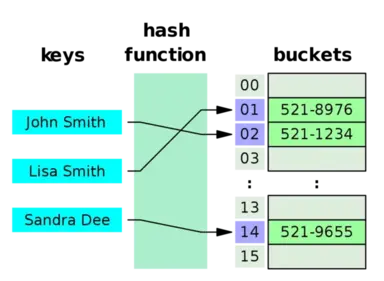
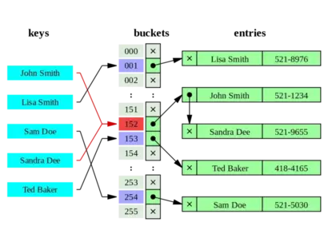

# Hash算法简介

散列技术是在记录的存储位置和它的关键字之间建立一个确定的对应关系f，使得每个关键字key对应一个存储位置`f(key)`。査找时，根据这个确定的对应关系找到给定值key的映射`f(key)`,若査找集合中存在这个记录，则必定在`f(key)`的位置上。

我们把这种对应关系f称为散列函数，又称为哈希(Hash)函数。按这个思想，采用散列技术将记录存储在一块连续的存储空间中，这块连续存储空间称为散列表或哈希表（Hashtable)。那么关键字对应的记录存储位置我们称为散列地址。

<!--more-->

## 散列过程

整个散列过程其实就是两步:

1. 在存储的时候，通过散列函数计算记录的散列地址，并按此散列地址存储该记录。
2. 当査找记录时，我们通过同样的散列函数计算记录的散列地址，按此散列地址访问该记录。



## 散列表的优势与劣势

散列技术最适合的求解问题是査找与给定值相等的记录。对于査找来说，简化了比较过程，效率就会大大提高。但万事有利就有弊，散列技术不具备很多常规数据结构的能力。

比如同样的关键字能对应很多记录的情况，不适合用散列技术。举个例子,一个班级几十个学生，他们的性别有男有女，你用关键字“男”去査找，对应的有许多学生的记录，这显然是不合适的。这个时候可以用班级学生的学号或者身份证号来散列存储，此时一个号码唯一对应一个学生才比较合适。

同样散列表也不适合范围查找，比如査找一个班级18-22岁的同学，在散列表中没法进行。

## 哈希冲突

在理想的情况下，每一个关键字，通过散列函数计算出来的地址都是不一样的，可现实中并非如此。



我们时常会碰到两个关键字key1 ≠ key2，但是却有f (key1) = f (key2)，这种现象我们称为冲突（collision)，并把key1和 key2称为这个散列函数的同义词（synonym）。尽管我们可以通过精心设计的散列函数让冲突尽可能的少，但是不能完全避免。于是如何处理冲突就成了一个很重要的问题。后面会有关于这个问题的几个解决方案。

## 散列函数的设计

散列函数的设计原则:

1. 计算简单。防止频繁地査找，带来过大开销。
2. 散列地址分布均匀。对于冲突问题，最好的办法就是尽量让散列地址均匀地分布在存储空间中，这样可以保证存储空间的有效利用，并减少为处理冲突而耗费的时间。

下面介绍一些常用的散列函数构造方法:

### 直接定址法

* 如果我们现在要对0-100岁的人口数字统计表，那么我们对年龄这个关键字就可以直接用年龄的数字作为地址。此时f(key) = key。
* 如果我们现在要统计的是80后出生年份的人口数，那么我们对出生年份这个关键字可以用年份减去1980来作为地址。此时f (key) = key-1980。

简而言之，直接定址法就是取关键字的某个线性函数值为散列地址,`f(key) = a × key + b`, 这样的散列函数优点就是简单、均匀，也不会产生冲突，但问题是这需要事先知道关键字的分布情况，适合査找表较小且连续的情况。由于这样的限制，在现实应用中，直接定址法虽然简单，但却并不常用。

### 数字分析法

数字分析法是取数据元素关键字中某些取值较均匀的数字位作为哈希地址的方法。即当关键字的位数很多时，可以通过对关键字的各位进行分析，丢掉分布不均匀的位，作为哈希值。它只适合于所有关键字值已知的情况。通过分析分布情况把关键字取值区间转化为一个较小的关键字取值区间。


### 除留余数法

除留余数法此方法为最常用的构造散列函数方法。对于散列表长为m的散列函数公式为： `f(key) = key mod p ( p ≤ m)`。mod是取模（求余数）的意思。事实上，这方法不仅可以对关键字直接取模，也可在折叠、平方取中后再取模。很显然，本方法的关键就在于选择合适的p。

如何合理选取p值？使用除留余数法的一个经验是，若散列表表长为m，**通常p为小于或等于表长（最好接近m)的最小质数或不包含小于20质因子的合数**。

> 之所以要模质数，是因为对于特殊数据，模合数的话会发生大量碰撞，而模质数可以避免这种情况.（例如公差为m的等差数列且m与模数存在公因数）。

### 平方散列法（平方取中法）

先通过求关键字的平方值扩大相近数的差别，然后根据表长度取平方数中间的几位数作为散列函数值。又因为一个乘积的中间几位数和乘数的每一位都相关，所以由此产生的散列地址较为均匀。

公式：f(k) = ((k * k) >> X) << Y。

|关键字|关键字的平方|哈希函数值|
|:---|:---|:---|
|1234|1522756|227|
|2143|4592449|924|
|4132|17073424|734|
|3214|10329796|297|


### 斐波那契散列法

和平方散列法类似，此种方法使用斐波那契数列的值作为乘数而不是自己。

1. 对于 16 位整数而言，这个乘数是 40503。
2. 对于 32 位整数而言，这个乘数是 2654435769。
3. 对于 64 位整数而言，这个乘数是 11400714819323198485。


### 折叠法

将关键字拆分成几部分，然后将这几部分组合在一起，以特定的方式进行转化形成Hash地址。假如知道图书的ISBN号为8903-241-23，可以将Hash(key)=89+03+24+12+3作为Hash地址。

### Time33算法

Time33是字符串哈希函数。现在几乎所有流行的HashMap都采用了DJB Hash Function，俗称“Times33”算法。Times33的算法很简单，就是不断的乘33。

```java
public String time33(String skey) {
  if (skey == null) return null;
  int hash = 5381;
  for (int i = 0, len = skey.length(); i < len; ++i) {
    int cc = skey.charAt(i);
    // hash(i-1)*33+cc 
    hash += (hash << 5) + cc;
  }
  hash &= 0x7fffffff;
  return String.valueOf(hash);
}
```

## 哈希冲突的解决方案

### 开放地址法

当冲突发生时，使用某种探测技术在散列表中形成一个探测序列。沿此序列逐个单元地查找，直到找到给定的关键字，或者碰到一个开放的地址（即该地址单元为空）为止（若要插入，在探查到开放的地址，则可将待插入的新结点存人该地址单元）。**查找时探测到开放的地址则表明表中无待查的关键字，即查找失败**。

就是一旦发生了冲突，就去寻找下一个空的散列地址，只要散列表足够大，空的散列地址总能找到，并将记录存入,`fi(key) = (f(key)+di) MOD m (di=1,2,3,......,m-1)`。

比如说，我们的关键字集合为{12,67,56,16,25,37,22,29,15,47,48,34},表长为12。 我们用散列函数f(key) = key mod l2。当计算前S个数{12,67,56,16,25}时，都是没有冲突的散列地址，直接存入：

|index|0|1|2|3|4|5|6|7|8|9|10|11|
|:---|:---|:---|:---|:---|:---|:---|:---|:---|:---|:---|:---|:---|
|value|12|25|||16|||67|56||||

计算key = 37时，发现f(37) = 1，此时就与25所在的位置冲突。

于是我们应用上面的公式f(37) = (f(37)+1) mod 12 = 2。于是将37存入下标为2的位置。

|index|0|1|2|3|4|5|6|7|8|9|10|11|
|:---|:---|:---|:---|:---|:---|:---|:---|:---|:---|:---|:---|:---|
|value|12|25|37||16|||67|56||||

接下来22,29,15,47都没有冲突，正常的存入：

|index|0|1|2|3|4|5|6|7|8|9|10|11|
|:---|:---|:---|:---|:---|:---|:---|:---|:---|:---|:---|:---|:---|
|value|12|25|37|15|16|29||67|56||22|47|

到了 key=48，我们计算得到f(48) = 0，与12所在的0位置冲突了，不要紧，我们f(48) = (f(48)+1) mod 12 = 1，此时又与25所在的位置冲突。于是f(48) = (f(48)+2) mod 12=2，还是冲突……一直到 f(48) = (f(48)+6) mod 12 = 6时，才有空位，机不可失，赶快存入：

|index|0|1|2|3|4|5|6|7|8|9|10|11|
|:---|:---|:---|:---|:---|:---|:---|:---|:---|:---|:---|:---|:---|
|value|12|25|37|15|16|29|48|67|56||22|47|

我们把这种解决冲突的开放定址法称为**线性探测法**。

#### 二次探测法

考虑深一步，如果发生这样的情况，当最后一个key=34，f(key)=10,与22所在的位置冲突，可是22后面没有空位置了，反而它的前面有一个空位置，尽管可以不断地求余数后得到结果，但效率很差。

因此我们可以改进di = 1, -1, 4, -4,……, q^2, -q^2 (q <= m/2),这样就等于是可以双向寻找到可能的空位置。

#### 伪随机探测

可以改进di为伪随机数，建立一个伪随机数发生器，并给定一个随机数做起点。

### 双散列

这种方法是同时构造多个不同的哈希函数 Hi=Hash1(key)  i=1，2，…，k

当哈希地址Hi=Hash1(key)发生冲突时，再计算Hi=Hash2(key) ……，直到冲突不再产生。这种方法不易产生聚集，但增加了计算时间。

### 散列扩容

总之，开放定址法只要在散列表未填满时，总是能找到不发生冲突的地址，是我们常用的解决冲突的办法。那么问题来了，空间不够怎么办？一种解决方法是建立另外一个大约两倍大的表，再用一个新的散列函数，扫描整个原始表然后按照新的映射插入到新的表里。

比如我们把{6, 15, 23, 24,6}插入到Size=7的闭散列里，Hash（x）= x % 7，用线性探测的方法解决冲突，会得到这样一个结果；

|index|0|1|2|3|4|5|6|
|:---|:---|:---|:---|:---|:---|:---|:---|
|value|6|15|23|24|||13|

整个表里填满了70%以上，于是我们要建立一个新的表，newSize=17，这是离原规模2倍大小的最近素数。新的散列函数是Hash( x ) = x % 17。扫描原来的表，把所有元素插入到新的表里，得到这个：

|index|0|1|2|3|4|5|6|7|8|9|10|11|12|13|14|15|16|
|:---|:---|:---|:---|:---|:---|:---|:---|:---|:---|:---|:---|:---|:---|:---|:---|:---|:---|
|value|||||||6|23|24|||||13||15||

这一顿操作就是散列扩容。可以看出这会付出很昂贵的代价：运行时间O（N）

### 链地址法--拉链法(哈希桶)

开放定址法的思路就是一旦发生了冲突，就去寻找下一个空的散列地址。那么，有冲突就非要换地方呢，我们直接就在原地处理行不行呢？

于是我们就有了链地址法。

将所有关键字为同义词的记录存储在一个单链表中，我们称这种表为同义词子表，在散列表中只存储所有同义词子表的头指针。


拉链法解决冲突的做法是：将所有关键字为同义词的结点链接在同一个单链表中。若选定的散列表长度为m，则可将散列表定义为一个由m个头指针组成的指针数组T[0..m-1]。凡是散列地址为i的结点，均插入到以T[i]为头指针的单链表中。T中各分量的初值均应为空指针。在拉链法中，装填因子α可以大于 1，但一般均取α≤1。

> 散列表的装填因子定义为：α= 填入表中的元素个数 / 散列表的长度

当元素个数超过表长度乘以装填因子时，需要对hash桶扩容(和hash表扩容一样，运行时间O（N）)。

#### 拉链法的优势与缺点

与开放定址法相比，拉链法有如下几个优点：

* 拉链法处理冲突简单，且无堆积现象，即非同义词决不会发生冲突，因此平均查找长度较短；
* 由于拉链法中各链表上的结点空间是动态申请的，故它更适合于造表前无法确定表长的情况；
* 开放定址法为减少冲突，要求装填因子α较小，故当结点规模较大时会浪费很多空间。而拉链法中可取α≥1，且结点较大时，拉链法中增加的指针域可忽略不计，因此节省空间；
* 在用拉链法构造的散列表中，删除结点的操作易于实现。只要简单地删去链表上相应的结点即可。而对开放地址法构造的散列表，删除结点不能简单地将被删结 点的空间置为空，否则将截断在它之后填人散列表的同义词结点的查找路径。这是因为各种开放地址法中，空地址单元（即开放地址）都是查找失败的条件。因此在用开放地址法处理冲突的散列表上执行删除操作，只能在被删结点上做删除标记，而不能真正删除结点。

拉链法的缺点：

* 指针需要额外的空间，故当结点规模较小时，开放定址法较为节省空间，而若将节省的指针空间用来扩大散列表的规模，可使装填因子变小，这又减少了开放定址法中的冲突，从而提高平均查找速度。

## 常用 Hash 算法

- MD5
- CRC
- [MurmurHash](https://github.com/aappleby/smhasher)
- [XxHash](https://github.com/Cyan4973/xxHash)

## 参考

- [1] [General Purpose Hash Function Algorithms](http://www.partow.net/programming/hashfunctions/)
- [2] [为什么哈希函数要模质数](https://www.cnblogs.com/cryingrain/p/11144225.html)

