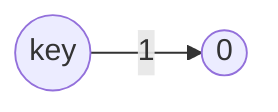
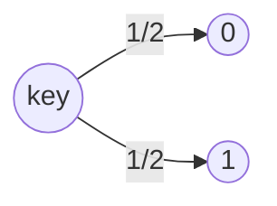

# 一致性Hash算法-JumpHash

google 提出了 [Jump consistent hash](https://arxiv.org/pdf/1406.2294.pdf) 算法，跳转一致性哈希不需要存储，速度更快，并且在均匀划分key方面做得更好。它的主要限制是桶必须按顺序编号，这使得它 比分布式 Web 缓存更适合数据存储应用程序

<!--more-->

### 算法说明

先令f(key, n)为一致性哈希算法，输出的为[0,n)之间的数字，代表数据在对应的节点上。

1. n=1 时，对于任意的key，输出应该都是0。
2. n=2 时，为了保持均匀，应该有1/2的结果保持为0，1/2的结果输出为1。
3. n=3 时，应该有1/3的结果保持为0，1/3的结果保持为1，1/3的结果保持为2。
4. 依次递推，节点数由n变为n+1时，f(key, n)里面应该有n/(n+1)的结果不变，有1/(n+1)的结果变为n。

这个使用概率公式来表示，就是这样的代码:

```java
int ch(int key, int num_buckets) {
    random.seed(key);
    int b = 0; // This will track ch(key, j+1).
    for (int j = 1; j < num_buckets; j++) {
        if (random.next() < 1.0 / (j + 1)) b = j;
    }
    return b;
}
```

下面我们来演示下数据在扩容时的变化。

n=1 时，一定输出0，即落到桶0



n扩容到2 时，为了保持均匀，应该有1/2的结果保持为0，1/2的结果输出为1。



n扩容到3 时，应该有1/3的结果保持为0，1/3的结果保持为1，1/3的结果保持为2。

 ```mermaid
flowchart LR
    id0((0))-->| 1/2  *  2/3 | id2((0))
    id0((0))-->| 1/2  *  1/3 | id4((2))
    id1((1))-->| 1/2  *  2/3 | id3((1))
    id1((1))-->| 1/2  *  1/3 | id4((2))
```

关键在于n=2到n=3的过程，每个数字的概率从1/2转化到了1/3。

之后，我们可以得出一个规律：增加一个节点，数据不发生变化的概率是n/(n+1) 再乘以之前每个数字的概率1/n，就可以得出每个数字最新的概率1/(n+1).

这个算法唯一的缺点是复杂度太高，是O(n)的。所以需要进行优化。

### 算法优化

在上一小节中，我们了解到f(key, n)算法的正确性。除了复杂度是O(n)外，我们还可以确定，循环越往后，结果改变的概率会越来越低。

结果改变指的是，增加一个节点后，一个固定的key输出的结果发生了改变。如果我们能够快速计算出这个固定的key在哪些节点下发生了改变，就可以快速计算出最终答案(跳过这些不变key)。

假设某一次结果是b，经过若干次概率测试，下一次改变为a，则从b+1到a-1这中间，不管节点如何变化，这个key的结果都是不会变化的。根据上一小节的到的概率变化公式，新增一个节点数字不变化的概率是n/(n+1)。那从b+1到i不变化的概率就是(b+1)/i（中间的抵消了）。

如果我们有一个均匀的随机函数r，可以确定当r<(b+1)/i时(触发了不变化的概率)，f(i)=f(b+1)。
那么i的上界就是(b+1)/r向上取整。这个上限也是下一次key发生变化的节点数量。

```java
int ch(int key, int num_buckets) {
    random.seed(key);
    int b = -1; // bucket number before the previous jump
    int j = 0; // bucket number before the current jump
    while (j < num_buckets) {
        b = j;
        double r = random.next();
        j = floor((b + 1) / r);
    }
    return b;
}
```
现在来分析下它的时间复杂度。 因为 r的分布是均匀的， 在槽位数将变化为 i的时候跳跃发生的概率是 1/i， 那么预期的跳跃次数就是 1/2+..+1/i+..+1/n, 调和级数和自然对数的差是收敛到一个小数的， 所以复杂度是 $O(ln(n))$.

> 考虑退出条件是j >= num_buckets.j 每次大约是原来的2倍（由于r是均匀的，所以期望是1/2），`j = floor((j + 1) * 2)`

[优化后的代码](https://github.com/chutian0610/java-algorithms-impl/blob/master/src/main/java/info/victorchu/algorithms/hash/consistent/jumphash/JumpHash.java):

```java
// 7 = 0x0111
private static final long UNSIGNED_MASK = 0x7fffffffffffffffL;
private static final long JUMP = 1L << 31;
private static final long CONSTANT = Long.parseUnsignedLong("2862933555777941757");

/**key是无符号数*/
static int jumpConsistentHash(final long key, final int buckets) {
    long k = key;
    long b = -1;
    long j = 0;

    while (j < buckets) {
        b = j;
        k = k * CONSTANT + 1L;//伪随机数生成器
        // j=(b+1)*x/y则是上面的求上界的公式，其中y/x通过浮点数运算来产生(0,1)内的一个随机数。
        j = (long) ((b + 1L) * (JUMP / toDouble((k >>> 33) + 1L)));
    }
    return (int) b;
}
// 无符号long转double
private static double toDouble(final long n) {
    double d = n & UNSIGNED_MASK;
    if (n < 0) {
        d += 0x1.0p63; // 1*2的63次方
    }
    return d;
}
```

跳跃一致性哈希在执行速度、内存消耗、映射均匀性上都比经典的哈希环法要好。 这一点也可以理解， 跳跃一致性哈希的算法设计就是源于对均匀性的推理。关于内存消耗上的对比结果， 其实已然不言自明。 经典的一致性哈希环需要数据结构的支撑， 空间复杂度是 $O(N)$ 的， 而跳跃一致性哈希算法几乎没有额外内存消耗。一切看上去都很美好, 但是，跳跃一致性哈希算法有两个显著缺点：

* 无法自定义槽位标号: 跳跃一致性哈希算法中， 因为我们没有存储任何数据结构， 所以我们无法自定义槽位标号， 标号是从 0开始数过来的。
* 只能在尾部增删节点: 假如我们在非尾部添加一个新的槽位， 会导致这个位置后续的槽位的标号全部发生变化。 所以在非尾部插入新槽位没有意义， 我们只能在尾部插入。对于在非尾部删除一个槽位也是一样的, 我们只能在尾部删除.

### 跳跃一致性哈希下的热扩容和容灾

新加一个全新的节点时， 必然要迁移数据才可以服务。 可以采用和一致性哈希环法类似的办法， 即数据备份+请求中继。

新加入的节点对于读取不到的数据，可以把请求中继(relay)到老节点，并把这个数据迁移过来。「老节点」是什么？ 假如此次扩容时，节点数目由 n变为 n+1，老节点的标号则可以由 ch(k,n)计算得出， 即节点数量为 n的时候的 k的槽位标号。

当我们移除一个节点时（节点数目由 n+1变为 n），会造成什么影响？如果是移除尾结点，和上面新增时的方法类似，通过计算出老节点(老节点的标号则可以由 ch(k,n+1)计算得出)和数据备份即可。但是现实情况下，不可能保证异常节点就是尾结点，如果这种情况发生，我们该怎么办？

显然对于容灾，冗余是必不可少的，在执行数据写操作时，同时写一份数据到备份节点。 备份节点这样选定：

* 尾部节点备份一份数据到老节点。
* 非尾部节点备份一份数据到右侧邻居节点。

这样，当移除一个非尾部节点i时，通过请求中继和备份, 我们仍可以正确请求值。


我们同样可以尝试虚拟节点(影子节点)的办法来做权重。增加一层虚拟桶，使用jump consistent hash来将 key分配到虚拟桶中，然后在虚拟桶和实际桶之间建立一个映射关系。这样我们就可以通过映射关系来设置实际桶的权重；也可以在任意位置删除和添加实际桶，只需要维护好映射关系即可。当然，这样做的代价就是，算法本来可以的无内存占用的，现在需要有一块内存来维护映射关系了。

跳跃一致性哈希法最显著的特点是： 实现轻巧、快速、内存占用小、映射均匀、算法精妙。 但是，原始的跳跃一致性哈希算法的缺点也很明显，不支持自定义的槽位标号、而且只能在尾部增删槽位。在这个算法下做热扩容和容灾也是有路可循的， 但是不及哈希环直观。

## 算法实现

[github 地址](https://github.com/chutian0610/java-algorithms-impl/tree/master/src/main/java/info/victorchu/algorithms/hash/consistent/jumphash)

```java
/**
 * 跳转Hash.
 * <a href="https://arxiv.org/pdf/1406.2294.pdf">paper</a>
 */
public class JumpHash {

    /* **************** jump hash begin******************* */

    // 7 = 0x0111
    private static final long UNSIGNED_MASK = 0x7fffffffffffffffL;
    private static final long JUMP = 1L << 31;
    private static final long CONSTANT = Long.parseUnsignedLong("2862933555777941757");

    /**
     * key是无符号数
     */
    static int jumpConsistentHash(final long key, final int buckets) {
        long k = key;
        long b = -1;
        long j = 0;

        while (j < buckets) {
            b = j;
            k = k * CONSTANT + 1L;//伪随机数生成器
            // j=(b+1)*x/y则是上面的求上界的公式，其中y/x通过浮点数运算来产生(0,1)内的一个随机数。
            j = (long) ((b + 1L) * (JUMP / toDouble((k >>> 33) + 1L)));
        }
        return (int) b;
    }

    // 无符号long转double
    private static double toDouble(final long n) {
        double d = n & UNSIGNED_MASK;
        if (n < 0) {
            d += 0x1.0p63; // 1*2的63次方
        }
        return d;
    }
    /* **************** jump hash end ******************* */

}
```

## 参考

<div id="refer-anchor-1"></div>

- [1] [Jump consistent hash](https://arxiv.org/pdf/1406.2294.pdf) 
- [2] [Consistent Hashing: Algorithmic Tradeoffs](https://dgryski.medium.com/consistent-hashing-algorithmic-tradeoffs-ef6b8e2fcae8#890d)

