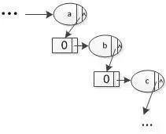
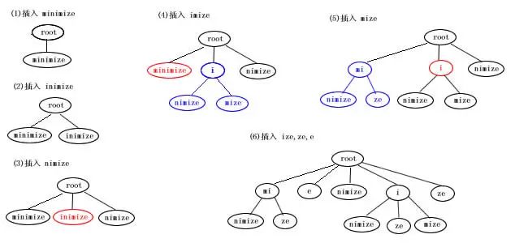

# 算法之trie字典树

## 算法之trie字典树

 Trie树，又称字典树、前缀树、单词查找树、键树，是一种多叉树形结构，是一种哈希树的变种。Trie树典型应用是用于快速检索（最长前缀匹配），统计，排序和保存大量的字符串，所以经常被搜索引擎系统用于文本词频统计，搜索提示等场景。它的优点是最大限度地减少无谓的字符串比较，查询效率比较高。

Trie的核心思想是空间换时间，利用字符串的公共前缀来降低查询时间的开销以达到提高效率的目的。

<!--more-->

它有3个基本性质：

* 根节点不包含字符，除根节点外每一个节点都只包含一个字符。
* 从根节点到某一节点，路径上经过的字符连接起来，为该节点对应的字符串。
* 每个节点的所有子节点包含的字符都不相同。

### 树的构建

搭建Trie的方法很简单，其实就是将单词的每个字母逐一插入Trie树。插入前先看字母对应的节点是否存在，存在则共享该节点，不存在则创建对应的节点。比如要插入新单词and，就有下面几步：

1. 插入第一个字母"a"，发现root节点存在子节点a，则共享节点a
2. 插入第二个字母"n"，发现节点a存在子节点n，则共享节点n
3. 插入第三个字母"d"，发现节点n不存在子节点d，则创建子节点d。
4. 至此，单词and中所有字母已被插入Trie树中，然后设置节点d中的标志位，标记路径root->a->n->d这条路径上所有节点的字符可以组成一个单词and.


### Trie树的查询

 从root节点开始按照单词的字母顺序向下遍历Trie树，遍历完成有两种情况：

1. 单词中每个字母都在Trie树中被查找过，此时Trie树不一定被遍历完
2. 单词中部分字母未在Trie树中被查找过，此时Trie树一定被遍历完

查询单词是否存在，我们不会管遍历完成时是上面的哪种情况，我们只需要关注遍历结束时Trie树最后一个被遍历的节点last。若节点last中设置了标志位（即表示路径root->…->last上所有节点的字符可以组成一个单词）则表示被查询的单词存在于Trie树中，否则表示不存在。

### 算法思想

Trie的核心思想是空间换时间，利用字符串的公共前缀来降低查询时间的开销以达到提高效率的目的。

假设字符的种数有m个，有若干个长度为n的字符串构成了一个Trie树，即每个节点的可能子节点数量为m，Trie树的高度为n。很明显我们浪费了大量的空间来存储字符，此时Trie树的最坏空间复杂度为O(m^n)。也正由于每个节点的出度为m，所以我们能够沿着树的一个个分支高效的向下逐个字符的查询，而不是遍历所有的字符串来查询，此时Trie树的最坏时间复杂度为O(n)。这正是空间换时间的体现，也是利用公共前缀降低查询时间开销的体现。

### Java 实现

```java
import java.util.HashMap;
import java.util.Map;

public class TrieTree{
    private static final String point1 = "└── ";
    private static final String point2 = "|—— ";
    private static final String pre1= "    ";
    private static final String pre2= "|   ";

    public static void main(String[] args) {
        TrieTree trie = new TrieTree();

        trie.insert("Programming");
        trie.insert("Progming");
        trie.insert("Progm");
        trie.insert("Problem");
        trie.printTree();

        System.out.println(trie.find("Progm"));
    }

    private TrieNode root = new TrieNode('.');

    public void printTree(){
        printNode(root);
    }
    private void printNode(TrieNode node){
        printNode(root,0,false,"");
    }

    private void printNode(TrieNode node,int level,boolean isLastChild,String pre){
        String isWord = level == 0?"":node.isEndOfData()?"(+)":"(-)";
        System.out.println(getPreString(pre,level,isLastChild)+node.getData()+isWord);
        String currentPre = getLevelPre(pre,level,isLastChild);
        if(!node.getChildren().isEmpty()){
            level = level+1;
            int size = node.getChildren().size();
            int count = 0;
            for (Character key: node.getChildren().keySet()) {
                TrieNode subNode = node.getChild(key);
                count++;
                if(count == size){
                    printNode(subNode,level,true,currentPre);
                }else {
                    printNode(subNode,level,false,currentPre);
                }
            }
        }
    }

    private String getPreString(String pre,int level,boolean isLastChild){
        if(level == 0){
            return pre;
        }
        if(isLastChild){
            return pre+point1;
        }else {
            return pre+point2;
        }
    }

    private String getLevelPre(String pre,int level,boolean isLastChild){
        if(level ==0){
            return pre;
        }else {
            StringBuilder sb = new StringBuilder();
            sb.append(pre);
            if(isLastChild) {
                sb.append(pre1);
            }else {
                sb.append(pre2);
            }
            return sb.toString();
        }
    }
    // 插入元素
    public void insert(String word) {
        TrieNode current = root;

        for (int i = 0; i < word.length(); i++) {
            Map<Character,TrieNode> children = current.getChildren();
            if(children.containsKey(word.charAt(i))){
                // pass
                current = children.get(word.charAt(i));
            }else {
                current = new TrieNode(word.charAt(i),false);
                children.put(word.charAt(i),current);
            }
        }
        current.setEndOfData(true);
    }
    // 寻找元素
    public boolean find(String word) {
        TrieNode current = root;
        for (int i = 0; i < word.length(); i++) {
            char ch = word.charAt(i);
            TrieNode node = current.getChild(ch);
            if (node == null) {
                return false;
            }
            current = node;
        }
        return current.isEndOfData();
    }
    // 删除元素
    public boolean delete(String word) {
        return delete(root, word, 0);
    }

    private boolean delete(TrieNode current, String word, int index) {
        if (index == word.length()) {
            if (!current.isEndOfData()) {
                return false;
            }
            current.setEndOfData(false);
            // 如果没有其他公共前缀单词，则将当前前缀从trie中删除·
            return current.getChildren().isEmpty();
        }
        char ch = word.charAt(index);
        TrieNode node = current.getChildren().get(ch);
        if (node == null) {
            return false;
        }
        boolean shouldDeleteCurrentNode = delete(node, word, index + 1) && !node.isEndOfData();

        if (shouldDeleteCurrentNode) {
            current.deleteChild(ch);
            return current.getChildren().isEmpty();
        }
        return false;
    }

}

class TrieNode{
    private Map<Character,TrieNode> children = new HashMap<>();
    private Character data;
    private boolean endOfData = false;

    public TrieNode(Character data) {
        this.data = data;
    }

    public TrieNode(Character data, boolean endOfData) {
        this.data = data;
        this.endOfData = endOfData;
    }

    public Character getData() {
        return data;
    }

    public void setData(Character data) {
        this.data = data;
    }

    public boolean isEndOfData() {
        return endOfData;
    }

    public void setEndOfData(boolean endOfData) {
        this.endOfData = endOfData;
    }

    public Map<Character, TrieNode> getChildren() {
        return children;
    }

    public TrieNode getChild(Character name) {
        return children.get(name);
    }

    public void addChild(Character name, TrieNode child) {
        children.put(name,child);
    }
    public boolean deleteChild(Character name){
        if(children.containsKey(name)){
            children.remove(name);
            return true;
        }
        return false;
    }
}
```

### 压缩trie

在Trie树中，我们存储的是字符，很多情况下，我们会有如下情况:



为了解决Trie树中有这样孤立的一串字符节点，我们采用了压缩trie树的方法。这是一个典型的压缩trie树的插入过程：



> 这种方法的关键是比较两个字符串的相同前缀

```java
import java.util.HashMap;
import java.util.Map;
import java.util.Set;

public class TrieTree{

    private static final String point1 = "└── ";
    private static final String point2 = "|—— ";
    private static final String pre1= "    ";
    private static final String pre2= "|   ";

    private TrieNode root = new TrieNode(".");

    public void printTree(){
        printNode(root);
    }
    private void printNode(TrieNode node){
        printNode(root,0,false,"");
    }

    private void printNode(TrieNode node,int level,boolean isLastChild,String pre){
        String isWord = level == 0?"":node.isWord()?"(+)":"(-)";
        System.out.println(getPreString(pre,level,isLastChild)+node.getData()+isWord);
        String currentPre = getLevelPre(pre,level,isLastChild);
        if(!node.getChildren().isEmpty()){
            level = level+1;
            int size = node.getChildren().size();
            int count = 0;
            for (String key: node.getChildren().keySet()) {
                TrieNode subNode = node.getChild(key);
                count++;
                if(count == size){
                    printNode(subNode,level,true,currentPre);
                }else {
                    printNode(subNode,level,false,currentPre);
                }
            }
        }
    }

    private String getPreString(String pre,int level,boolean isLastChild){
        if(level == 0){
            return pre;
        }
        if(isLastChild){
            return pre+point1;
        }else {
            return pre+point2;
        }
    }

    private String getLevelPre(String pre,int level,boolean isLastChild){
        if(level ==0){
            return pre;
        }else {
            StringBuilder sb = new StringBuilder();
            sb.append(pre);
            if(isLastChild) {
                sb.append(pre1);
            }else {
                sb.append(pre2);
            }
            return sb.toString();
        }
    }

    public void insert(String word) {
        insertToNode(root,word);
    }
    private void insertToNode(TrieNode current,String word){
        Map<String,TrieNode> children = current.getChildren();
        if(children.isEmpty()){
            children.put(word,new TrieNode(word,true));
        }else {
            String likeWord = null;
            TrieNode likeNode = null;
            String pre = null;
            for (TrieNode child :children.values()) {
                pre = child.getSamePrefix(word);
                if ( pre!= null) {
                    likeWord = child.getData();
                    likeNode = child;
                    break;
                }
            }
            if(likeWord == null){
                // 不存在共同前缀的单词
                children.put(word,new TrieNode(word,true));
            }else {
                // 存在共同前缀的单词
                if(word.equals(likeWord)){
                    likeNode.setWord(true);
                    return;
                }
                if(pre.length() == likeWord.length()){
                    String leftWord = word.substring(pre.length());
                    insertToNode(likeNode,leftWord);
                    return;
                }
                if(pre.length()< likeWord.length()){
                    TrieNode parent = new TrieNode(pre,false);
                    likeNode.setData(likeWord.substring(pre.length()));
                    current.getChildren().remove(likeWord);
                    parent.getChildren().put(likeNode.getData(),likeNode);
                    if(word.length()>pre.length()) {
                        TrieNode child = new TrieNode(word.substring(pre.length()), true);
                        parent.getChildren().put(child.getData(), child);
                    }else {
                        parent.setWord(true);
                    }

                    current.getChildren().put(parent.getData(),parent);
                }
            }
        }
    }

    public boolean find(String word) {
        TrieNode current = root;
        return findInNode(current,word);
    }

    private boolean findInNode(TrieNode current,String word){
        if(current.getChildren().isEmpty()){
            return false;
        }
        TrieNode node = null;
        String preWord = null;
        for (TrieNode child: current.getChildren().values()) {
            String pre = child.getSamePrefix(word);
            if(pre != null){
                node = child;
                preWord = pre;
                break;
            }
        }
        if(node == null){
            return false;
        }
        if(node.getData().equals(word)){
            return node.isWord();
        }

        if(preWord.length() < node.getData().length()){
            return false;
        }

        if(preWord.length() == node.getData().length()){
            return findInNode(node,word.substring(preWord.length()));
        }
        return false;
    }

    public boolean delete(String word) {
        return deleteInNode(root,word);
    }

    private boolean deleteInNode(TrieNode current,String word){
        if(current.getChildren().isEmpty()){
            return false;
        }
        TrieNode node = null;
        String preWord = null;
        for (TrieNode child: current.getChildren().values()) {
            String pre = child.getSamePrefix(word);
            if(pre != null){
                node = child;
                preWord = pre;
                break;
            }
        }
        if(node == null){
            return false;
        }
        if(preWord.length() < node.getData().length()){
            return false;
        }
        if(node.getData().equals(word)){
            if(!node.isWord()){
                return false;
            }
            if(node.getChildren().size() == 0){
                current.getChildren().remove(word);
            }
            if(node.getChildren().size() > 1){
                node.setWord(false);
            }
            if(node.getChildren().size() == 1){
                Set<String> keys = node.getChildren().keySet();
                String key  =(String) keys.toArray()[0];
                TrieNode child = node.getChild(key);
                child.setData(word+child.getData());
                current.getChildren().remove(word);
                current.getChildren().put(child.getData(),child);
            }
            return true;
        }

        if(preWord.length() == node.getData().length()){
            if(deleteInNode(node,word.substring(preWord.length()))){
                if(node.getChildren().size() ==1 && !node.isWord()){
                    Set<String> keys = node.getChildren().keySet();
                    String key  =(String) keys.toArray()[0];
                    TrieNode child = node.getChild(key);
                    child.setData(preWord+child.getData());
                    current.getChildren().remove(preWord);
                    current.getChildren().put(child.getData(),child);
                }
                return true;
            }else {
                return false;
            }
        }
        return false;
    }

}

class TrieNode{
    private Map<String,TrieNode> children = new HashMap<>();
    private String data;
    private boolean isWord = false;

    public boolean isWord() {
        return isWord;
    }

    public void setWord(boolean word) {
        isWord = word;
    }

    public TrieNode(String data) {
        this.data = data;
    }

    public TrieNode(String data, boolean isWord) {
        this.data = data;
        this.isWord = isWord;
    }

    public Map<String, TrieNode> getChildren() {
        return children;
    }

    public TrieNode getChild(String name) {
        return children.get(name);
    }

    public void setChildren(Map<String, TrieNode> children) {
        this.children = children;
    }

    public String getData() {
        return data;
    }

    public void setData(String data) {
        this.data = data;
    }

    public String getSamePrefix(String word){
        if (word == null || data == null){
            return null;
        }
        int length = word.length()>data.length()?data.length():word.length();
        StringBuilder sb =new StringBuilder();
        for (int i =0;i<length;i++){
            if(data.charAt(i) == word.charAt(i)){
                sb.append(data.charAt(i));
            }else {
                break;
            }
        }
        if(sb.length()>0){
            return sb.toString();
        }else {
            return null;
        }
    }
}
```

