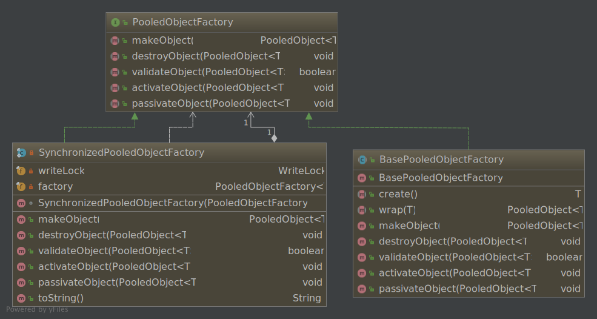
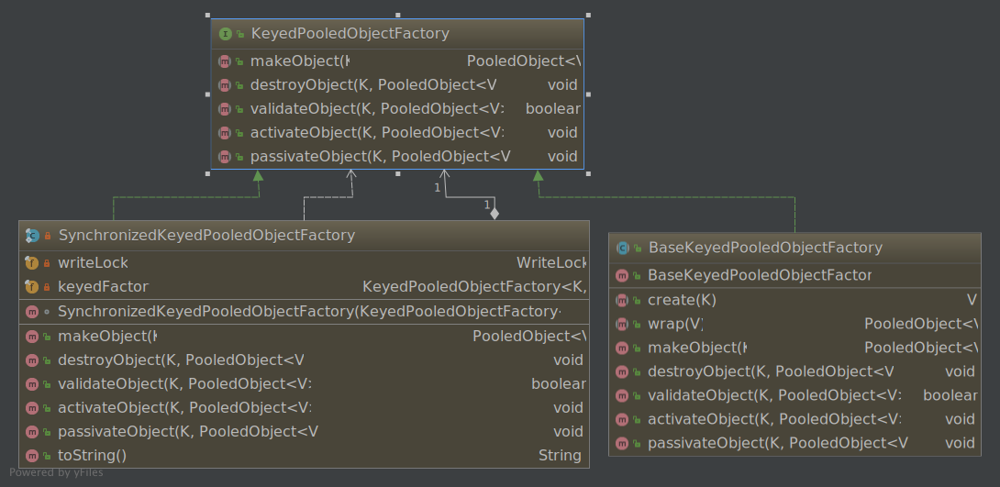
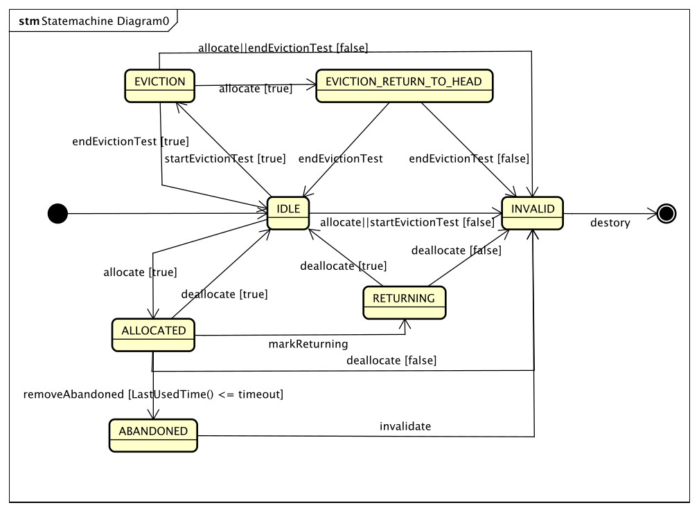

# 从apache-common-pool看如何写一个通用池

对象的创建和销毁在一定程度上会消耗系统的资源，虽然jvm的性能在近几年已经得到了很大的提高，对于多数对象来说，没有必要利用对象池技术来进行对象的创建和管理。但是对于有些对象来说，其创建的代价还是比较昂贵的，比如线程、tcp连接、数据库连接等对象。对于那些创建耗时较长，或者资源占用较多的对象，比如网络连接，线程之类的资源，通常使用池化来管理这些对象，从而达到提高性能的目的。

apache-common-pool提供了一个通用的对象池技术的实现。可以很方便的基于它来实现自己的对象池。比如DBCP和Jedis他们的内部对象池的实现就是依赖于apache-common-pool(本文分析的是apache common pool2)。

<!--more-->

## 组件分析

先来看看apache-common-pool的组成结构:

* PooledObjectFactory|KeyedPooledObjectFactory: 池化对象工厂，负责对PooledOjbect的创建，状态验证，销毁, 钝化，激活工作。
* PooledObject: 池化对象，这个就是前面所说需要池化的资源，被池化的对象可以抽离出共有属性，如，创建时间，状态，最近一次使用时间等。
* ObjectPool|KeyedObjectPool: 对象池，它是负责和对象使用者直接打交道的, 对使用者提供获取对象，返还对象接口。

## 池化对象工厂

### PooledObjectFactory

PooledObjectFactory是一个池化对象工厂接口，定义了生成对象、激活对象、钝化对象、销毁对象的方法，其方法和继承关系如下图：



```java
public interface PooledObjectFactory<T> {
  // 生成对象
  PooledObject<T> makeObject() throws Exception;

  // 销毁对象
  void destroyObject(PooledObject<T> p) throws Exception;

  // 验证对象
  boolean validateObject(PooledObject<T> p);

  // 激活对象
  void activateObject(PooledObject<T> p) throws Exception;
  
  // 销毁对象
  void passivateObject(PooledObject<T> p) throws Exception;
}
```

从类图中可以看到 PooledObjectFactory有两个实现类:

* `BasePooledObjectFactory<T>`
* `SynchronizedPooledObjectFactory<T>`

`BasePooledObjectFactory<T>`是有个抽象类，提供了两个抽象方法:

* `public abstract T create() throws Exception;`: 用来创建泛型实例
* `public abstract PooledObject<T> wrap(T obj);`: 用来将泛型实例包装为池化对象

`BasePooledObjectFactory<T>`的继承方法基本是空实现或默认实现，除了`makeObject`方法。

```java
@Override
public PooledObject<T> makeObject() throws Exception {
  return wrap(create());
}
```

下面来看看`SynchronizedPooledObjectFactory<T>`,这是一个基于装饰器模式设计的同步对象工厂,可以看到内部存在两个属性，一个是可重入读写锁的写锁，一个是对象工厂的实例。所有继承方法都进行了锁的功能扩展，例如:

```java
@Override
public PooledObject<T> makeObject() throws Exception {
  writeLock.lock(); // 使用锁装饰方法
  try {
    return factory.makeObject();
  } finally {
    writeLock.unlock();
  }
}
```

### KeyedPooledObjectFactory

KeyedPooledObjectFactory 也是一个池化对象工厂接口，和 PooledObjectFactory 相比，特点是可以通过key来查找池化对象。

```java
public interface KeyedPooledObjectFactory<K, V> {
  // 生成对象
  PooledObject<V> makeObject(K key) throws Exception;

  // 销毁对象
  void destroyObject(K key, PooledObject<V> p) throws Exception;

  // 验证对象
  boolean validateObject(K key, PooledObject<V> p);

  // 激活对象
  void activateObject(K key, PooledObject<V> p) throws Exception;

  // 钝化对象
  void passivateObject(K key, PooledObject<V> p) throws Exception;
}
```



从类图中可以看到 KeyedPooledObjectFactory 也有两个实现类:

* `BaseKeyedPooledObjectFactory<K, V>`
* `SynchronizedKeyedPooledObjectFactory<K, V>`

这两个实现类的特点和 PooledObjectFactory 的两个实现类类似，此处就不多说了。

### 生命周期

当通过对象工厂创建对象时:

* 每当需要新实例时，都会调用`makeObject()`。
* 在从池中借用之前已钝化的实例时都会调用`activateObject()`。
* 在激活的实例上调用`validateObject`，以确保它们可以从池中借用;在归还池的实例钝化之前调用`validateObject`.`validateObject`只会在已被激活的实例上使用。
* 当每个实例返回池时，会调用`passivateObject`。
* 当从池中“删除”时，会在每个实例上调用destroyObject

> PooledObjectFactory必须是线程安全的。ObjectPool唯一的承诺是，对象的同一个实例不会一次传递给PoolableObjectFactory的多个方法。

## 池化对象

池化对象是对象池中对象的包装类，用于记录对象池需要的额外信息，例如状态，时间等。

### PooledObject

```java
public interface PooledObject<T> extends Comparable<PooledObject<T>> {
    // 获取池化对象容器的内部实例。
    T getObject();

    // 获取对象创建时间。
    long getCreateTime();

    // 最近一次处在活动状态时间。
    long getActiveTimeMillis();

    // 最近一次空闲状态时间。
    long getIdleTimeMillis();

    // 最近一次取出时间。
    long getLastBorrowTime();

    // 最近一次归还时间。
    long getLastReturnTime();

    /**
      * 最近一次使用时间,
      * 如果对象池实现了TrackedUse接口，返回 TrackedUse.getLastUsed() 和 getLastBorrowTime() 的最大值，
      * 否则 等同于 `getLastBorrowTime()`。
     */
    long getLastUsedTime();

    // PooledObject接口继承了comparable接口,\(compareTo 方法\),即池化对象是可以相互比较的，注意比较逻辑和 equals 方法不一致。
    @Override
    int compareTo(PooledObject<T> other);

    @Override
    boolean equals(Object obj);
    @Override
    int hashCode();
    @Override
    String toString();

    // 试图将池化对象的状态设置为EVICTION,设置成功返回true，反之返回false。
    boolean startEvictionTest();

    // 通知池化对象驱逐检查已经完成。
    boolean endEvictionTest(Deque<PooledObject<T>> idleQueue);

    // 分配对象,仅当当前状态是空闲\(IDLE\)时返回 true。
    boolean allocate();

    // 解除分配对象
    boolean deallocate();

    // 设置池化对象的状态为INVALIDs
    void invalidate();

    // 是否使用抛弃对象的调用堆栈
    void setLogAbandoned(boolean logAbandoned);

    // 通知对象被使用
    void use();

    // 输出堆栈调用记录
    void printStackTrace(PrintWriter writer);

    // 获取当前对象状态
    PooledObjectState getState();

    // 标记为抛弃状态
    void markAbandoned();

    // 标记为归还状态
    void markReturning();
}
```


### DefaultPooledObject

从上面的类图中我们可以看到 DefaultPooledObject实现了 PooledObject 接口。

```java
public class DefaultPooledObject<T> implements PooledObject<T> {
private final T object;
@GuardedBy("this")
private PooledObjectState state = PooledObjectState.IDLE;
private final long createTime = System.currentTimeMillis();
private volatile long lastBorrowTime = createTime;
private volatile long lastUseTime = createTime;
private volatile long lastReturnTime = createTime;
private volatile boolean logAbandoned = false;
private volatile CallStack borrowedBy = NoOpCallStack.INSTANCE;
private volatile CallStack usedBy = NoOpCallStack.INSTANCE;
private volatile long borrowedCount = 0;
...
}
```

DefaultPooledObject 被设计为线程安全的类。可以看到 属性上都有volatile修饰，涉及到修改属性的方法，在方法上都添加了对象级的 synchronize 锁。注意到有3个属性没有volatile修饰，其中createTime和 object 对于实例来说是不变的，一旦赋值，不会修改，所以不需要同步处理，state 则是在每处读写的地方都加了对象锁。PooledSoftReference 是对DefaultPooledObject 的扩展，用于包装软引用。


> CallStack 用于记录和打印调用堆栈。

### PooledObject 的状态流转

PooledObject 有下面几个状态,\(在PooledObjectState中定义\):
  
* IDLE: 空闲状态，在空闲队列中。
* ALLOCATED: 使用中
* EVICTION: 正在进行驱逐检查,在空闲队列中。
* EVICTION_RETURN_TO_HEAD: 正在进行驱逐检查时，试图分配该对象，从空闲队列中去除，由于正在检查，分配失败，当通过空闲检查后，重新放回到空闲队列头部。
* VALIDATION: 验证状态，在空闲队列中。
* VALIDATION_PREALLOCATED: 验证时试图分配，验证完后分配。
* VALIDATION_RETURN_TO_HEAD: 驱逐检查后正在验证，验证完后，放入空闲队列头部。
* INVALID: 无效，将会/已被销毁。
* ABANDONED: 抛弃状态，即将无效。
* RETURNING: 返回到池中。



## 对象池

### ObjectPool

```java
public interface ObjectPool<T> extends Closeable {

    /**
     * Obtains an instance from this pool.
     */
    T borrowObject() throws Exception, NoSuchElementException, IllegalStateException;

    /**
     * Returns an instance to the pool. By contract, <code>obj</code>
     */
    void returnObject(T obj) throws Exception;

    /**
     * Invalidates an object from the pool.
     */
    void invalidateObject(T obj) throws Exception;

    /**
     * Creates an object using the PooledObjectFactory or other
     * implementation dependent mechanism, passivate it, and then place it in
     * the idle object pool.
     */
    void addObject() throws Exception, IllegalStateException ,UnsupportedOperationException;

    /**
     * Returns the number of instances currently idle in this pool.
     */
    int getNumIdle();

    /**
     * Returns the number of instances currently borrowed from this pool.
     */
    int getNumActive();

    /**
     * Clears any objects sitting idle in the pool。
     */
    void clear() throws Exception, UnsupportedOperationException;

    /**
     * Closes this pool, and free any resources associated with it.
     */
    @Override
    void close();
}
```

ObjectPool 是一个简单的对象池接口。下面是一个简单的使用示例:

```java
 Object obj = null;
 try {
     // pre-loading a pool with idle objects.
     pool.addObject();
     // Obtains an instance from this pool.
     obj = pool.borrowObject();
     try {
         //...use the object...
     } catch(Exception e) {
         // invalidate the object
         pool.invalidateObject(obj);
         // do not return the object to the pool twice
         obj = null;
     } finally {
         // make sure the object is returned to the pool
         if(null != obj) {
             pool.returnObject(obj);
        }
     }
 } catch(Exception e) {
       // failed to borrow an object
 }
```

ObjectPool有几个实现类。下面来看看它们:

### ProxiedObjectPool

ProxiedObjectPool 实现了代理模式。

```java
public class ProxiedObjectPool<T> implements ObjectPool<T> {

    private final ObjectPool<T> pool;
    private final ProxySource<T> proxySource;

    /**
     * Create a new proxied object pool.
     *
     * @param pool  The object pool to wrap
     * @param proxySource The source of the proxy objects
     */
    public ProxiedObjectPool(final ObjectPool<T> pool, final ProxySource<T> proxySource) {
        this.pool = pool;
        this.proxySource = proxySource;
    }

    @SuppressWarnings("unchecked")
    @Override
    public T borrowObject() throws Exception, NoSuchElementException, IllegalStateException {
        UsageTracking<T> usageTracking = null;
        if (pool instanceof UsageTracking) {
            usageTracking = (UsageTracking<T>) pool;
        }
        final T pooledObject = pool.borrowObject();
        final T proxy = proxySource.createProxy(pooledObject, usageTracking);
        return proxy;
    }

    @Override
    public void returnObject(final T proxy) throws Exception {
        final T pooledObject = proxySource.resolveProxy(proxy);
        pool.returnObject(pooledObject);
    }

    @Override
    public void invalidateObject(final T proxy) throws Exception {
        final T pooledObject = proxySource.resolveProxy(proxy);
        pool.invalidateObject(pooledObject);
    }
    // ... ...
}
```

从源码可以看到，ProxiedObjectPool通过ProxySource实现对内部的ObjectPool的动态代理，可以给对象添加一些额外的信息，实现更好的控制。

包内还提供了ProxySource的JDK和cglib的实现，详细代码可以看JdkProxySource和CglibProxySource。

### ErodingObjectPool

ErodingObjectPool 提供了一个基于时间和空闲对象数判断的动态收缩的对象池\(漏池\)。

```java
private final ObjectPool<T> pool;
private final ErodingFactor factor;
public ErodingObjectPool(final ObjectPool<T> pool, final float factor) {
    this.pool = pool;
    this.factor = new ErodingFactor(factor);
}
@Override
public void returnObject(final T obj) {
    boolean discard = false;
    final long now = System.currentTimeMillis();
    synchronized (pool) {
        if (factor.getNextShrink() < now) { // XXX: Pool 3: move test
                                            // out of sync block
            final int numIdle = pool.getNumIdle();
            if (numIdle > 0) {
                discard = true;
            }

            factor.update(now, numIdle);
        }
    }
    try {
        // 动态收缩
        if (discard) {
            pool.invalidateObject(obj);
        } else {
            pool.returnObject(obj);
        }
    } catch (final Exception e) {
        // swallowed
    }
}
// --------------------------------------------------
private static final class ErodingFactor {
/** Determines frequency of "erosion" events */
private final float factor;

/** Time of next shrink event */
private transient volatile long nextShrink;

/** High water mark - largest numIdle encountered */
private transient volatile int idleHighWaterMark;

public ErodingFactor(final float factor) {
    this.factor = factor;
    nextShrink = System.currentTimeMillis() + (long) (900000 * factor);
    // now + 15 min  * factor
     idleHighWaterMark = 1;
 }

 public void update(final long now, final int numIdle) {
     final int idle = Math.max(0, numIdle);
     idleHighWaterMark = Math.max(idle, idleHighWaterMark);
     final float maxInterval = 15f;
     final float minutes = maxInterval +
             ((1f - maxInterval) / idleHighWaterMark) * idle;
     nextShrink = now + (long) (minutes * 60000f * factor);
 }

 public long getNextShrink() {
     return nextShrink;
 }
}
```

根据上面的源码，可以看到在向池中返回对象时，会进行判断，此时可能返回对象或把对象设为无效。而判断条件是传入的 factor 和 空闲对象数 numIdle。nextShrink的动态变化\(可以在ErodingFactor的update方法中看到\)，从而实现对象池的动态收缩。

### SynchronizedObjectPool

SynchronizedObjectPool 是基于装饰器模式设计的。通过内置的ReentrantReadWriteLock装饰了pool的各个方法，实现了具有读写锁的线程安全的对象池。

```java
private static final class SynchronizedObjectPool<T> implements ObjectPool<T> {
    private final ReentrantReadWriteLock readWriteLock = new ReentrantReadWriteLock();
    private final ObjectPool<T> pool;
    // ... ...
 }
```

### SoftReferenceObjectPool

SoftReferenceObjectPool管理的对象的软引用,，SoftReferenceObjectPool是线程安全的。SoftReferenceObjectPool 继承自BaseObjectPool，BaseObjectPool是一个抽象类，方法大多是空实现或是空实现。下面我们来看看SoftReferenceObjectPool的内容。

```java
public class SoftReferenceObjectPool<T> extends BaseObjectPool<T> {
    // 池化对象的构建工厂
    private final PooledObjectFactory<T> factory;
    // 结合软引用的 ReferenceQueue
    private final ReferenceQueue<T> refQueue = new ReferenceQueue<>();
    // 被借出的对象数
    private int numActive = 0;
    // 销毁的对象数
    private long destroyCount = 0;
    // 创建的对象数
    private long createCount = 0;
    // 空闲对象队列
    private final LinkedBlockingDeque<PooledSoftReference<T>> idleReferences =
        new LinkedBlockingDeque<>();
    // 所有对象的存储队列
    private final ArrayList<PooledSoftReference<T>> allReferences =
        new ArrayList<>();

  // 新增对象
  @Override
  public synchronized void addObject() throws Exception {
    assertOpen();
    if (factory == null) {
        throw new IllegalStateException("Cannot add objects without a factory.");
    }
    final T obj = factory.makeObject().getObject();
    createCount++;
    // 创建软引用，并在 queue中注册
    final PooledSoftReference<T> ref = new PooledSoftReference<>(
            new SoftReference<>(obj, refQueue));
    allReferences.add(ref);

    boolean success = true;
    if (!factory.validateObject(ref)) {
        success = false;
    } else {
        factory.passivateObject(ref);
    }

    final boolean shouldDestroy = !success;
    if (success) {
        idleReferences.add(ref);
        notifyAll(); // numActive has changed
        // 没有发现 wait 方法的使用？此处可能不需要notifyAll()
    }

    if (shouldDestroy) {
        try {
            destroy(ref);
        } catch (final Exception e) {
            // ignored
        }
    }
  }
  private void destroy(final PooledSoftReference<T> toDestroy) throws Exception {
    toDestroy.invalidate();
    idleReferences.remove(toDestroy);
    allReferences.remove(toDestroy);
    try {
        factory.destroyObject(toDestroy);
    } finally {
        destroyCount++;
        // 注意，SoftReference是对象的软引用，而不是池化对象的软引用
        // 此处将SoftReference的引用对象强制设为 null,防止其他地方持有对象的引用，导致无法回收
        toDestroy.getReference().clear();
    }
  }
  // ... ...
}
```

其他方法都较简单，这里就不赘述了。

## GenericObjectPool详解

GenericObjectPool是最常用的对象池，继承自抽象类BaseGenericObjectPool，提供了一些可配置的对象池功能，GenericObjectPool被设计为线程安全。

### config

|配置|默认值|描述|
|:---|:---|:---|
|maxTotal|8|池中最多可用的实例个数|
|maxIdle|8|池中最大空闲的个数|
|minIdle|0|池中最少空闲的个数|
|lifo|true|是否 LIFO，后进先出|
|fairness|false|等待线程拿空闲连接的方式，为true是先进先出的方式获取空闲对象|
|maxWaitMillis|-1|当连接池资源耗尽时，调用者最大阻塞的时间，超时将跑出异常,单位:毫秒数.默认为-1时表示永不超时.|
|evictorShutdownTimeoutMillis|`10L * 1000L`|驱逐者线程shutdown的等待时间|
|minEvictableIdleTimeMillis|`1000L * 60L * 30L`|对象空闲的最小时间，达到此值后空闲对象将可能会被移除，单位毫秒。负值表示不移除|
|softMinEvictableIdleTimeMillis|`1000L * 60L * 30L`|对象空闲的最小时间，达到此值后空闲对象将可能会被移除，但是会保留minIdle个空闲对象，单位毫秒。若minEvictableIdleTimeMillis为正数，那么该配置会被覆盖|
|numTestsPerEvictionRun|3|对于驱逐者线程而言，每次检测的链接资源的个数。如果numTestsPerEvictionRun>=0,每次检查numTestsPerEvictionRun和空闲对象数的较小值,否则,返回`Math.ceil(idleObjects.size() /Math.abs((double) numTestsPerEvictionRun))`|
|evictionPolicy|null|驱逐者线程驱逐策略,2.6版本提供|
|evictionPolicyClassName|`DefaultEvictionPolicy.class.getName()`|驱逐者线程驱逐策略,2.6之前版本提供|
|testOnCreate|false|创建对象时，是否使用validateObject验证|
|testOnBorrow|false|借出对象时，是否使用validateObject验证|
|testOnReturn|false|归还对象时，是否使用validateObject验证|
|testWhileIdle|false|空闲对象在驱逐者线程检查后，是否使用validateObject验证|
|timeBetweenEvictionRunsMillis|-1L|驱逐者检测线程检测的周期，毫秒数。如果为负值，表示不运行.|
|blockWhenExhausted|true|当池中active数量达到阀值时，是否阻塞borrowObject。|

### 创建对象池

对象池的构造方法接受参数，对象工厂和对象池配置。在构造器中会初始化空闲对象容器idleObjects和所有对象容器 allObjects。此外，还可以设置AbandonedConfig，用于*丢弃借出，但是长时间未使用的对象*。

```java
private final Map<IdentityWrapper<T>, PooledObject<T>> allObjects =
        new ConcurrentHashMap<>();
idleObjects = new LinkedBlockingDeque<>(config.getFairness());
```

### 对象租借

```java
public T borrowObject(final long borrowMaxWaitMillis) throws Exception {
    // #1 对象池是打开的
    assertOpen();

    // #2 租借前，Abandoned处理
    final AbandonedConfig ac = this.abandonedConfig;
    if (ac != null && ac.getRemoveAbandonedOnBorrow() &&
        (getNumIdle() < 2) &&(getNumActive() > getMaxTotal() - 3) ) {
        removeAbandoned(ac);
    }

    PooledObject<T> p = null;

    // Get local copy of current config so it is consistent for entire
    // method execution
    final boolean blockWhenExhausted = getBlockWhenExhausted();

    boolean create;
    final long waitTime = System.currentTimeMillis();

    while (p == null) {
        create = false;
        // #3 取出一个空闲对象
        p = idleObjects.pollFirst();
        if (p == null) {
            // #3.1 idleObjects为空，新建对象
            p = create();
            if (p != null) {
                create = true;
            }
        }
        // #3.2 阻塞策略
        if (blockWhenExhausted) {
            if (p == null) {
                // #3.3 对象池已达上限，无法新建对象
                if (borrowMaxWaitMillis < 0) {
                    // #3.4 租借等待时间 <0,一直阻塞直到有空闲
                    p = idleObjects.takeFirst();
                } else {
                    // #3.5 有时间上限的阻塞
                    p = idleObjects.pollFirst(borrowMaxWaitMillis,TimeUnit.MILLISECONDS);
                }
            }
            if (p == null) {
                throw new NoSuchElementException("Timeout waiting for idle object");
            }
        } else {
            if (p == null) {
                throw new NoSuchElementException("Pool exhausted");
            }
        }
        if (!p.allocate()) {
            // #4 申请使用失败，置空
            p = null;
        }

        if (p != null) {
            try {
                // #5 激活对象
                factory.activateObject(p);
            } catch (final Exception e) {
                try {
                    destroy(p);
                } catch (final Exception e1) {
                    // Ignore - activation failure is more important
                }
                p = null;
                if (create) {
                    final NoSuchElementException nsee = new NoSuchElementException("Unable to activate object");
                    nsee.initCause(e);
                    throw nsee;
                }
            }
            if (p != null && (getTestOnBorrow() || create && getTestOnCreate())) {
                boolean validate = false;
                Throwable validationThrowable = null;
                try {
                    // #6 验证对象
                    validate = factory.validateObject(p);
                } catch (final Throwable t) {
                    PoolUtils.checkRethrow(t);
                    validationThrowable = t;
                }
                if (!validate) {
                    try {
                        destroy(p);
                        destroyedByBorrowValidationCount.incrementAndGet();
                    } catch (final Exception e) {
                        // Ignore - validation failure is more important
                    }
                    p = null;
                    if (create) {
                        final NoSuchElementException nsee = new NoSuchElementException("Unable to validate object");
                        nsee.initCause(validationThrowable);
                        throw nsee;
                    }
                }
            }
        }
    }
    // #7 更新状态
    updateStatsBorrow(p, System.currentTimeMillis() - waitTime);
    return p.getObject();
}
```

### 对象归还

```java
public void returnObject(final T obj) {
    // #1 获取对象对应的池化对象
    final PooledObject<T> p = allObjects.get(new IdentityWrapper<>(obj));
    if (p == null) {
        if (!isAbandonedConfig()) {
            throw new IllegalStateException("Returned object not currently part of this pool");
        }
        return; // Object was abandoned and removed
    }

    // #2 修改对象状态
    markReturningState(p);
    final long activeTime = p.getActiveTimeMillis();

    if (getTestOnReturn() && !factory.validateObject(p)) {
        // #3 验证未通过
        try {
            destroy(p);
        } catch (final Exception e) {
            swallowException(e);
        }
        try {
            // #4 池容量判断
            ensureIdle(1, false);
        } catch (final Exception e) {
            swallowException(e);
        }
        // #5 更新对应状态
        updateStatsReturn(activeTime);
        return;
    }

    try {
        // #3 钝化对象
        factory.passivateObject(p);
    } catch (final Exception e1) {
        swallowException(e1);
        try {
            destroy(p);
        } catch (final Exception e) {
            swallowException(e);
        }
        try {
            // #4 池容量判断
            ensureIdle(1, false);
        } catch (final Exception e) {
            swallowException(e);
        }
         // #5 更新对应状态
        updateStatsReturn(activeTime);
        return;
    }

    // #4 解除使用
    if (!p.deallocate()) {
        throw new IllegalStateException(
                "Object has already been returned to this pool or is invalid");
    }

    final int maxIdleSave = getMaxIdle();
    if (isClosed() || maxIdleSave > -1 && maxIdleSave <= idleObjects.size()) {
        // #5 池关闭或容量达上限，销毁对象
        try {
            destroy(p);
        } catch (final Exception e) {
            swallowException(e);
        }
    } else {
        // #5 进入空闲容器
        if (getLifo()) {
            idleObjects.addFirst(p);
        } else {
            idleObjects.addLast(p);
        }
        if (isClosed()) {
            // Pool closed while object was being added to idle objects.
            // Make sure the returned object is destroyed rather than left
            // in the idle object pool (which would effectively be a leak)
            clear();
        }
    }
    // #6 更新对应状态
    updateStatsReturn(activeTime);
}
```

### evictor 检查

#### 启动evictor入口

启动“空闲对象的驱逐者线程”的入口是：`BaseGenericObjectPool.setTimeBetweenEvictionRunsMillis`方法

```java
 public final void setTimeBetweenEvictionRunsMillis(final long timeBetweenEvictionRunsMillis) {
    this.timeBetweenEvictionRunsMillis = timeBetweenEvictionRunsMillis;
    startEvictor(timeBetweenEvictionRunsMillis);
}
```

#### 启动

```java
final void startEvictor(final long delay) {
    synchronized (evictionLock) {
        if (null != evictor) { // 先释放资源
            EvictionTimer.cancel(evictor, evictorShutdownTimeoutMillis, TimeUnit.MILLISECONDS);
            evictor = null;
            evictionIterator = null;
        }
        if (delay > 0) {
            evictor = new Evictor();
            EvictionTimer.schedule(evictor, delay, delay);
        }
    }
}
// --------------------------
// 定时启动 evictor 线程
// 提供一个所有"对象池"共享的"空闲对象的驱逐定时器
static synchronized void schedule(
            final BaseGenericObjectPool<?>.Evictor task, final long delay, final long period) {
    if (null == executor) {
        executor = new ScheduledThreadPoolExecutor(1, new EvictorThreadFactory());
        executor.setRemoveOnCancelPolicy(true);
    }
    final ScheduledFuture<?> scheduledFuture =
            executor.scheduleWithFixedDelay(task, delay, period, TimeUnit.MILLISECONDS);
    task.setScheduledFuture(scheduledFuture);
}
```

#### 驱逐者实现

```java
class Evictor implements Runnable {
    /**  
     * 运行对象池维护线程。  
     * 驱逐对象具有驱逐者的资格，同时保证空闲实例可用的最小数量。  
     * 因为调用"驱逐者线程"的定时器是被所有对象池共享的，  
     * 但对象池可能存在不同的类加载器中，所以驱逐者必须确保采取的任何行为
     * 都得在与对象池相关的工厂的类加载器下。  
     */  
    @Override
    public void run() {
        final ClassLoader savedClassLoader =
                Thread.currentThread().getContextClassLoader();
        try {
            if (factoryClassLoader != null) {
                // Set the class loader for the factory
                // factoryClassLoader 是 classloader 的弱引用
                final ClassLoader cl = factoryClassLoader.get();
                if (cl == null) {
                    // The pool has been dereferenced and the class loader
                    // GC'd. Cancel this timer so the pool can be GC'd as
                    // well.
                    cancel();
                    return;
                }
                Thread.currentThread().setContextClassLoader(cl);
                // 见上方中文注释
                // [相关的一个 bug](https://issues.apache.org/jira/browse/POOL-161)
            }

            // Evict from the pool
            try {
                evict();
            } catch(final Exception e) {
                swallowException(e);
            } catch(final OutOfMemoryError oome) {
                // Log problem but give evictor thread a chance to continue
                // in case error is recoverable
                oome.printStackTrace(System.err);
            }
            // Re-create idle instances.
            try {
                ensureMinIdle();
            } catch (final Exception e) {
                swallowException(e);
            }
        } finally {
            // Restore the previous CCL
            Thread.currentThread().setContextClassLoader(savedClassLoader);
        }
    }
}
```

#### evictor方法

```java
public void evict() throws Exception {
    // #1 确保"对象池"还打开着
    assertOpen();

    if (idleObjects.size() > 0) {
        PooledObject<T> underTest = null;
        // #2 获取"驱逐回收策略"
        final EvictionPolicy<T> evictionPolicy = getEvictionPolicy();

        synchronized (evictionLock) {
            // #3 获取"驱逐配置"
            final EvictionConfig evictionConfig = new EvictionConfig(
                    getMinEvictableIdleTimeMillis(),
                    getSoftMinEvictableIdleTimeMillis(),
                    getMinIdle());

            final boolean testWhileIdle = getTestWhileIdle();

            // #4 对所有待检测的"空闲对象"进行驱逐检测 ，注意循环次数，即检测个数是可配置的
            for (int i = 0, m = getNumTests(); i < m; i++) {
                // #4.1 初始化"驱逐检测对象(空闲池对象)的迭代器"  
                if (evictionIterator == null || !evictionIterator.hasNext()) {
                    evictionIterator = new EvictionIterator(idleObjects);
                }
                if (!evictionIterator.hasNext()) {
                    // Pool exhausted, nothing to do here
                    return;
                }

                try {
                    underTest = evictionIterator.next();
                } catch (final NoSuchElementException nsee) {
                    // Object was borrowed in another thread
                    // Don't count this as an eviction test so reduce i;
                    i--;
                    evictionIterator = null;
                    continue;
                }
                // #4.2 将"池对象"标记为"开始驱逐状态"  
                if (!underTest.startEvictionTest()) {
                    // Object was borrowed in another thread
                    // Don't count this as an eviction test so reduce i;
                    i--;
                    continue;
                }

                // User provided eviction policy could throw all sorts of
                // crazy exceptions. Protect against such an exception
                // killing the eviction thread.
                boolean evict;
                try {
                    // #4.3 进行真正的"驱逐检测"操作
                    evict = evictionPolicy.evict(evictionConfig, underTest,
                            idleObjects.size());
                } catch (final Throwable t) {
                    // Slightly convoluted as SwallowedExceptionListener
                    // uses Exception rather than Throwable
                    PoolUtils.checkRethrow(t);
                    swallowException(new Exception(t));
                    // Don't evict on error conditions
                    evict = false;
                }

                if (evict) {
                     // #4.3.1 如果"池对象"是可驱逐的，则销毁它  
                    destroy(underTest);
                    destroyedByEvictorCount.incrementAndGet();
                } else {
                    // #4.3.2 否则，是否允许空闲时进行有效性测试  
                    if (testWhileIdle) {
                        boolean active = false;
                        try {
                            // #4.3.2.1 先激活"池对象"  
                            factory.activateObject(underTest);
                            active = true;
                        } catch (final Exception e) {
                            destroy(underTest);
                            destroyedByEvictorCount.incrementAndGet();
                        }
                        if (active) {
                            if (!factory.validateObject(underTest)) {
                                // #4.3.2.2 如果"池对象"不是有效的，则销毁它
                                destroy(underTest);
                                destroyedByEvictorCount.incrementAndGet();
                            } else {
                                try {
                                    // #4.3.2.3 否则，钝化并放回池中
                                    factory.passivateObject(underTest);
                                } catch (final Exception e) {
                                    destroy(underTest);
                                    destroyedByEvictorCount.incrementAndGet();
                                }
                            }
                        }
                    }
                     // #4.3.2.4 通知"空闲对象队列"，驱逐测试已经结束  
                    if (!underTest.endEvictionTest(idleObjects)) {
                        // TODO - May need to add code here once additional
                        // states are used
                    }
                }
            }
        }
    }
    final AbandonedConfig ac = this.abandonedConfig;
    if (ac != null && ac.getRemoveAbandonedOnMaintenance()) {
        // #5 移除"被废弃的池对象"
        removeAbandoned(ac);
    }
}
```

#### 驱逐策略

在evict()方法中最后对象是否要被驱逐是调用了evictionPolicy.evict()的方法来判断的，commons-pool提供的驱逐策略如下：

```java
public class DefaultEvictionPolicy<T> implements EvictionPolicy<T> {
    @Override
    public boolean evict(EvictionConfig config, PooledObject<T> underTest,
            int idleCount) {
        //getIdleTimeMillis()空闲时间
        //config.getIdleSoftEvictTime()空闲连接大于配置的最小值时的超时时间
        //config.getIdleEvictTime()空闲连接超时时间与数量无关
        if ((config.getIdleSoftEvictTime() < underTest.getIdleTimeMillis() &&
                config.getMinIdle() < idleCount) ||
                config.getIdleEvictTime() < underTest.getIdleTimeMillis()) {
            return true;
        }
        return false;
    }
}
```

驱逐策略是支持自定义的，这里使用的是设计模式中的策略模式，我们只要实现EvictionPolicy接口，然后调用setEvictionPolicy()方法既可以更换驱逐策略.

