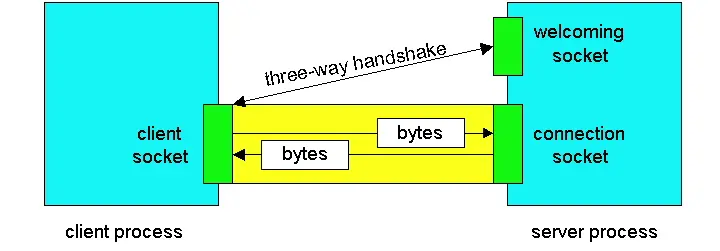
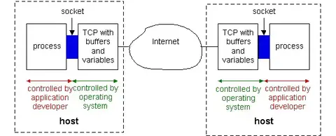
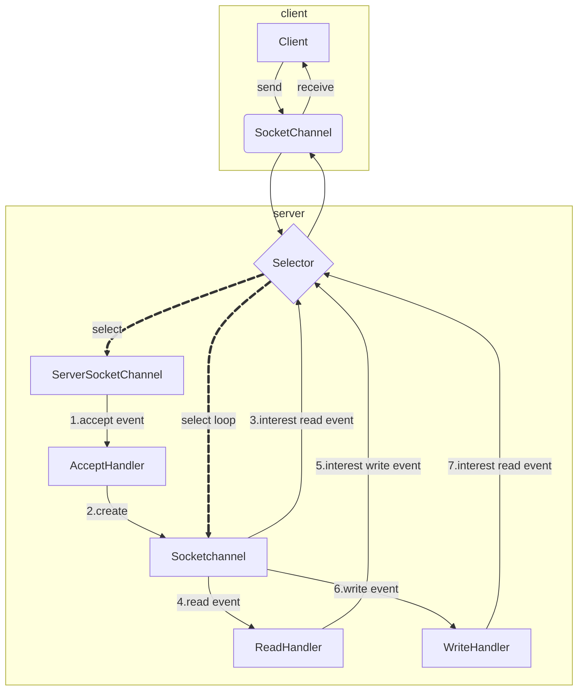
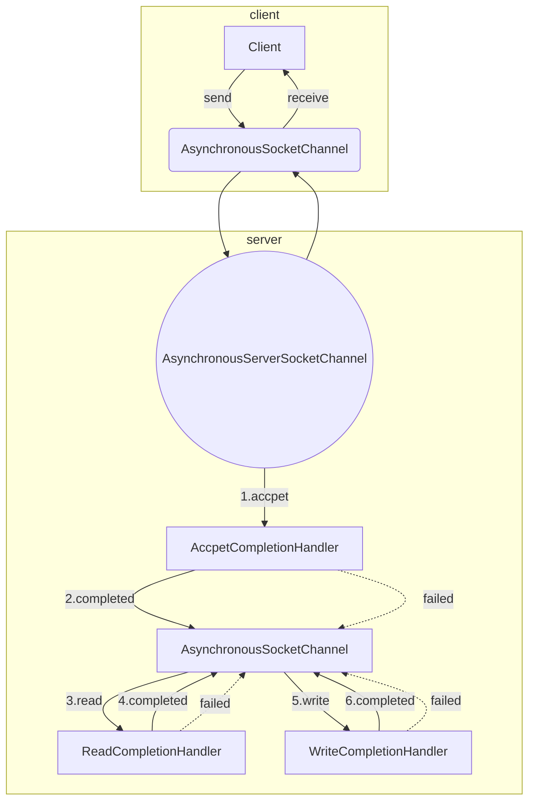

# Java Socket 编程简介

先来看个最简 DEMO(双向通信):


```java
// server端
public class SocketServer {
  public static void main(String[] args) throws Exception {
    ServerSocket server = new ServerSocket(8080);
    
    // 阻塞等待连接
    Socket socket = server.accept();

    // 从socket中获取输入流，并建立缓冲区进行读取
    InputStream inputStream = socket.getInputStream();
    byte[] bytes = new byte[1024];
    int len;
    StringBuilder sb = new StringBuilder();
    while ((len = inputStream.read(bytes)) != -1) {
      sb.append(new String(bytes, 0, len,"UTF-8"));
    }
    System.out.println("Received: " + sb);
    OutputStream outputStream = socket.getOutputStream();
    outputStream.write("hello client".getBytes("UTF-8"));
    outputStream.flush();

    // 关闭流&连接
    inputStream.close();
    outputStream.close();
    socket.close();
    server.close();
  }
}
// client 端
public class SocketClient {
  public static void main(String args[]) throws Exception {
    Socket socket = new Socket("127.0.0.1", 8080);
    // 建立连接后获得输出流
    OutputStream outputStream = socket.getOutputStream();
    String message="hello server";
    outputStream.write(message.getBytes("UTF-8"));
    //通知server消息发送完成
    socket.shutdownOutput();
    
    // 读取消息
    InputStream inputStream = socket.getInputStream();
    byte[] bytes = new byte[1024];
    int len;
    StringBuilder sb = new StringBuilder();
    while ((len = inputStream.read(bytes)) != -1) {
      sb.append(new String(bytes, 0, len,"UTF-8"));
    }
    System.out.println("Received: " + sb);

    // 关闭流&连接
    inputStream.close();
    outputStream.close();
    socket.close();
  }
}
```

<!--more-->

## 原理简介

随着服务器进程的运行，客户端进程可以向服务器发起传输控制协议。这是在客户端程序中通过创建套接字对象来完成的。当客户端创建其套接字对象时，它指定了服务器进程的地址，即服务器的IP地址和进程的端口号。一旦创建套接字对象，客户端中的TCP发起三次握手，并与服务器建立传输控制协议。三次握手对客户端和服务器程序完全透明。



在三次握手期间，客户端进程敲响服务器进程的欢迎门。当服务器“听到”敲响时，它会创建一个专用于该特定客户端的新门（即一个新套接字）。在我们下面的示例中，欢迎门是一个ServerSocket对象，我们称之为welcomSocket。当客户端敲响这扇门时，程序调用welcomSocket的接受（）方法，该方法为客户端创建一个新门。在握手阶段结束时，客户端的套接字和服务器的新套接字之间存在一个传输控制协议。从今以后，我们将新套接字称为服务器的“连接套接字”。



从应用程序的角度来看，传输控制协议是客户端套接字和服务器连接套接字之间的直接虚拟管道。客户端进程可以将任意字节发送到其套接字中；TCP保证服务器进程将接收（通过连接套接字）发送顺序中的每个字节。此外，正如人们可以进出同一扇门一样，客户端进程也可以从其套接字接收字节，服务器进程也可以将字节发送到其连接套接字中。

## 从流中解析消息

从上面的介绍可以看出 TCP 可以被抽象的视为一条字节流，TCP 协议保证了数据的顺序和exactly once。但是由于数据是流的方式传递，如何从流中获取一条消息就是用户进程需要关心的。

### 关闭流

有一种取巧的简单方案就是关闭流。

可以通过`socket.close()`来关闭流，当Socket关闭的时候，服务端就会收到响应的关闭信号，那么服务端也就知道流已经关闭了，这个时候读取操作完成，就可以继续后续工作。这种方式有一些缺点:

- 客户端Socket关闭后，将不能接受服务端发送的消息，也不能再次发送消息
- 如果客户端想再次发送消息，需要重现创建Socket连接

还可以通过Socket关闭输出流的方式，这种方式调用的方法是：

```java
socket.shutdownOutput()
```

如果关闭了输出流，那么相应的Socket也将关闭，和直接关闭Socket一个性质。调用`Socket的shutdownOutput()`方法，底层会告知服务端我这边已经写完了，那么服务端收到消息后，就能知道已经读取完消息，如果服务端有要返回给客户的消息那么就可以通过服务端的输出流发送给客户端，如果没有，直接关闭Socket。这种方式通过关闭客户端的输出流，告知服务端已经写完了，虽然可以读到服务端发送的消息，但是还是有一点点缺点：不能再次发送消息给服务端，如果再次发送，需要重新建立Socket连接。

### 多次消息交互

上面关闭流的方式只适用于 client 和 server 单次交互的场景。如果考虑到多次交互，情况就复杂了。

### 粘包和半包问题

- 粘包问题是指当发送两条消息时，比如发送了 ABC 和 DEF，但另一端接收到的却是 ABCD，像这种一次性读取了两条数据的情况就叫做粘包（正常情况应该是一条一条读取的）。
- 半包问题是指，当发送的消息是 ABC 时，另一端却接收到的是 AB 和 C 两条信息，像这种情况就叫做半包。

因为 TCP 是面向连接的传输协议，TCP 传输的数据是以流的形式，而流数据是没有明确的开始结尾边界，所以 TCP 也没办法判断哪一段流属于一个消息。粘包的主要原因：

- 发送方每次写入数据 < Socket缓冲区大小；
- 接收方读取Socket 缓冲区数据不够及时。

粘包和半包的解决方案有2 种：

- 发送方和接收方规定固定大小的缓冲区，也就是发送和接收都使用固定大小的 byte[] 数组长度，当字符长度不够时使用空字符弥补(不推荐，不够灵活)。
- 使用消息协议可以从流中提取出一条完整的消息（多余的数据可以暂存在 Buffer 中，用于拼接下一条消息）。然后就可以暂停读流，转而开始处理数据。

### 消息协议

消息协议有两种实现方案:

- 结尾特殊字符(适用于简单场景)
- 指定消息长度(通用解法)

#### 结尾特殊字符

一种简单的协议是双方约定一个字符或者一个短语，来当做消息发送完成的结尾标识，例如每次均只发送一行数据，即以`\n`字符为结尾标识。又或者是每次发送多行数据，以单独一行的`end\n`字符串作为结尾标识。

这么做的优缺点如下：

- 优点：不需要关闭流，当发送完一条命令（消息）后可以再次发送新的命令（消息）
- 缺点：需要额外的约定结束标志，太简单的容易出现在要发送的消息中，误被结束，太复杂的不好处理，还占带宽

#### 指定消息长度

先指定后续命令的长度，然后读取指定长度的内容做为一条消息。


读取步骤为，先读取4个字节的长度，然后根据数据长度读取消息体。这种事先约定好长度的做法解决了之前提到的种种问题，Redis的Java客户端Jedis就是用这种方式实现的。

当然固定长度的长度位也可以改为变长的长度位，以支持大数据量消息。这里举个简单的方案，将长度值转换为 bit 数组。每 7bit 数据用8bit 存。如果是中间 7bit，对应8bit最高位是 1，如果是最高位 7bit，对应 8bit 最高位是 0. 例如长度`27979=1 1011010 1001011`可以表示为下面的结构。


实际读取长度的时候按 8bit 读取，直到 8bit 的最高位是 0，停止读取。

#### 协议头 & 校验位

实际在生产中，一般还会在消息头部增加定长协议头和在消息尾部增加校验位。用于更好的判断消息类型和保证消息的完整性。

## 优化

### 并发优化

服务端可以引入线程池来提升吞吐量。将Connection Socket转交给单独的线程去处理。

```java
try (ServerSocket ss = new ServerSocket(PORT)) {
    while (true) {
        try {
            System.out.println("Waiting for client...");
            // 阻塞
            Socket socket = ss.accept();
            System.out.println("New client connected: " + socket.getRemoteSocketAddress());
            executor.submit(() -> {
                new Handler(socket).handle();
            });
        }
        catch (IOException e) {
            e.printStackTrace();
        }
    }
}
catch (IOException e) {
    // ignored
    e.printStackTrace();
}
```

### 连接超时

在创建Socket对象时，可以通过connect方法的重载版本来设置连接超时时间。例如：

```java
Socket socket = new Socket();
SocketAddress address = new InetSocketAddress("example.com", 80);
int timeout = 5000; // 设置超时时间为5秒
socket.connect(address, timeout);
```

如果在指定的超时时间内无法建立连接，将抛出SocketTimeoutException异常

### 设置读取超时时间

使用setSoTimeout方法可以设置Socket的读取超时时间。例如：

```java
Socket socket = new Socket("localhost", 8080);
socket.setSoTimeout(5000); // 设置读取超时时间为5秒
InputStream in = socket.getInputStream();
try {
    in.read(); // 读取数据
} catch (SocketTimeoutException e) {
    // 捕获超时异常
}
```

### 参数调优

socket 支持以下参数调优(java.net.SocketOptions类中维护)：

- TCP_NODELAY：对此连接禁用 Nagle 算法。
- SO_BINDADDR：用于获取获取套接字的本地地址绑定。
- SO_REUSEADDR: 支持快速复用端口，或者多程序绑定不同IP地址的相同端口。
- SO_BROADCAST：此选项启用和禁用发送广播消息的处理能力。
- IP_MULTICAST_IF：设置用于发送多播包的传出接口。
- IP_MULTICAST_IF2：设置用于发送多播包的传出接口。
- IP_MULTICAST_LOOP：此选项启用或禁用多播数据报的本地回送。
- IP_TOS：此选项为 TCP 或 UDP 套接字在 IP 地址头中设置服务类型或流量类字段。
- SO_LINGER：指定关闭时逗留的超时值。
- SO_TIMEOUT：设置阻塞 Socket 操作的超时值，选项必须在进入阻塞操作前设置才能生效。
  - ServerSocket.accept();
  - SocketInputStream.read();
  - DatagramSocket.receive(); 
- SO_SNDBUF：设置传出网络 I/O 的平台所使用的基础缓冲区大小的提示。
- SO_RCVBUF：设置传入网络 I/O 的平台所使用基础缓冲区的大小的提示。
- SO_KEEPALIVE：当为TCP套接字设置了keepalive选项，并且在两个小时（注：实际值取决于实现）内没有任何数据交换时，TCP将自动向对端发送keepalive探测。该探测是一个TCP段，对等体必须对其进行响应。预计会有以下三种反应之一：
  - 对等体以预期的ACK响应。不会通知应用程序（因为一切正常）。TCP将在另一个2小时不活动后发送另一个探测。- 对端响应一个RST，告诉本地TCP对端主机已经崩溃并重新启动。套接字已关闭。
  - 对端没有响应。处理步骤套接字已关闭。此选项的目的是检测对等主机是否崩溃。仅对TCP套接字有效
- SO_OOBINLINE：当设置OOBINLINE选项时，在套接字上接收到的任何TCP紧急数据将通过套接字输入流接收。当该选项被禁用时（这是默认值），紧急数据将被静默丢弃。

### 判断Socket是否可用

#### TCP KeepAlive

在Linux系统中，TCP Keep-Alive的参数可以通过系统配置来调整。这些参数包括：

- tcp_keepalive_time：空闲多长时间后发送第一个探测包。
- tcp_keepalive_intvl：发送探测包的间隔时间。
- tcp_keepalive_probes：发送探测包的最大次数。

```sh
## 查看当前参数
cat /proc/sys/net/ipv4/tcp_keepalive_time
cat /proc/sys/net/ipv4/tcp_keepalive_intvl
cat /proc/sys/net/ipv4/tcp_keepalive_probes

## 修改参数（需要管理员权限）
sysctl -w net.ipv4.tcp_keepalive_time=60
sysctl -w net.ipv4.tcp_keepalive_intvl=15
sysctl -w net.ipv4.tcp_keepalive_probes=5
sysctl -p  # 使配置生效
```

上述修改是整个系统级别。Java中可以通过setKeepAlive方法启用或禁用TCP Keep-Alive功能，但无法直接设置其详细参数（如空闲时间、探测间隔等），这些参数依赖于系统配置。然而，在Java 11及以上版本中，可以通过ExtendedSocketOptions来设置这些参数。

```java
Socket socket = new Socket();
socket.connect(new InetSocketAddress("example.com", 80));

// 启用Keep-Alive
socket.setKeepAlive(true);

// 设置Keep-Alive参数（仅在Java 11及以上版本有效）
socket.setOption(ExtendedSocketOptions.TCP_KEEPIDLE, 60);   // 空闲时间（秒）
socket.setOption(ExtendedSocketOptions.TCP_KEEPINTERVAL, 15); // 探测间隔（秒）
socket.setOption(ExtendedSocketOptions.TCP_KEEPCOUNT, 5);    // 探测次数
```

TCP Keep-Alive机制本身并不会自动重连。它的主要作用是在连接空闲一段时间后，发送探测包来检查连接是否仍然有效。如果探测失败，TCP协议栈会通知应用程序连接已经不可用，但不会自动尝试重新建立连接。如果需要在TCP Keep-Alive失败后实现重连功能，通常需要在应用程序层面进行处理。应用程序可以监听连接状态的变化，当检测到连接失效时，按照一定的策略（如立即重试、指数退避重试等）尝试重新建立连接。

> 但是如果发送方发送的数据包没有收到接收方回复的ACK数据包，则TCP Keep-alive机制就不会被启动，而TCP会启动超时重传机制，这样就使得TCP Keep-alive机制在未收到ACK包时失效。

#### 协议心跳包

双方需要约定，什么样的消息属于心跳包，什么样的消息属于正常消息，假设，我们定义前两个字节为消息的长度，那么我们就可以定义第3个字节为消息的属性，可以指定一位为消息的类型，1为心跳，0为正常消息。那么要做的有如下：

- 客户端发送心跳包
- 服务端获取消息判断是否是心跳包，若是返回ACK
- 当客户端一定时间内发送失败或是未收到 ACK，就可以断定连接不可用，进行重连

心跳包的优点

- TCP KeepAlive，仅提供检测连接功能。
- 应用层心跳包不依赖于传输层协议，无论传输层协议是TCP还是UDP都可以用
- 应用层心跳包可以定制，可以应对更复杂的情况或传输一些额外信息
- KeepAlive仅代表连接保持着，而心跳包往往还代表客户端可正常工作

## 非阻塞 IO

在[IO 模型](/post/2021/03/e424f5f0/)一文中介绍了 NIO和 AIO。

在[Socket示例](https://github.com/chutian0610/code-lab/tree/main/demos/jdk-lab/src/main/java/info/victorchu/jdk/lab/usage/socket)中实现了 NIO 和 AIO 的简单 demo。

### NIO

一个简单的 NIO 例子如下;

```java
public class NIOServer {
    public static void main(String[] args) throws IOException {
        // 创建Selector
        Selector selector = Selector.open();

        // 创建ServerSocketChannel
        ServerSocketChannel serverSocketChannel = ServerSocketChannel.open();
        serverSocketChannel.configureBlocking(false); // 设置为非阻塞模式
        serverSocketChannel.bind(new InetSocketAddress(8888)); // 绑定端口

        // 注册到Selector，监听ACCEPT事件
        serverSocketChannel.register(selector, SelectionKey.OP_ACCEPT);

        // 循环等待事件
        while (true) {
            selector.select(); // 阻塞直到有事件发生
            Iterator<SelectionKey> iterator = selector.selectedKeys().iterator();

            while (iterator.hasNext()) {
                SelectionKey key = iterator.next();
                iterator.remove(); // 移除当前处理的key

                if (key.isAcceptable()) { // 有新的客户端连接
                    ServerSocketChannel server = (ServerSocketChannel) key.channel();
                    SocketChannel socketChannel = server.accept();
                    socketChannel.configureBlocking(false);
                    socketChannel.register(selector, SelectionKey.OP_READ); // 注册到Selector，监听READ事件
                    System.out.println("客户端已连接：" + socketChannel.getRemoteAddress());
                } else if (key.isReadable()) { // 有可读数据
                    SocketChannel socketChannel = (SocketChannel) key.channel();
                    ByteBuffer buffer = ByteBuffer.allocate(1024);
                    int bytesRead = socketChannel.read(buffer);

                    if (bytesRead > 0) { // 读取到数据
                        buffer.flip();
                        byte[] data = new byte[buffer.remaining()];
                        buffer.get(data);
                        String message = new String(data, "UTF-8").trim();
                        System.out.println("收到客户端消息：" + message);

                        // 回显消息给客户端
                        String response = "服务器已收到：" + message;
                        ByteBuffer responseBuffer = ByteBuffer.wrap(response.getBytes("UTF-8"));
                        socketChannel.write(responseBuffer);
                    } else if (bytesRead == -1) { // 客户端断开连接
                        socketChannel.close();
                        System.out.println("客户端已断开连接：" + socketChannel.getRemoteAddress());
                    }
                }
            }
        }
    }
}
```

NIOServer流程如下：



### AIO

一个简单的 AIO 例子如下;

```java
public class AIOServer {
    private final AsynchronousServerSocketChannel serverChannel;

    public AIOServer(int port) throws IOException {
        this.serverChannel = AsynchronousServerSocketChannel.open().bind(new InetSocketAddress(port));
        System.out.println("服务器已启动，端口：" + port);
        accept();
    }

    private void accept() {
        serverChannel.accept(this, new CompletionHandler<AsynchronousSocketChannel, AIOServer>() {
            @Override
            public void completed(AsynchronousSocketChannel clientChannel, AIOServer server) {
                System.out.println("新客户端已连接：" + clientChannel.getRemoteAddress());
                // 继续监听新的连接
                server.accept();
                // 处理新连接的读写
                handleClient(clientChannel);
            }

            @Override
            public void failed(Throwable exc, AIOServer server) {
                exc.printStackTrace();
                server.accept();
            }
        });
    }

    private void handleClient(final AsynchronousSocketChannel clientChannel) {
        ByteBuffer buffer = ByteBuffer.allocate(256);

        clientChannel.read(buffer, buffer, new CompletionHandler<Integer, ByteBuffer>() {
            @Override
            public void completed(Integer result, ByteBuffer attachment) {
                if (result == -1) {
                    try {
                        clientChannel.close();
                    } catch (IOException e) {
                        e.printStackTrace();
                    }
                    return;
                }

                attachment.flip();
                String message = new String(attachment.array(), 0, result).trim();
                System.out.println("收到客户端消息：" + message);

                // 回显消息给客户端
                clientChannel.write(ByteBuffer.wrap(("服务器已收到：" + message).getBytes()), null,
                        new CompletionHandler<Integer, Void>() {
                            @Override
                            public void completed(Integer result, Void attachment) {
                                // 准备下一次读取
                                attachment.clear();
                                clientChannel.read(attachment, attachment, this);
                            }

                            @Override
                            public void failed(Throwable exc, Void attachment) {
                                exc.printStackTrace();
                                try {
                                    clientChannel.close();
                                } catch (IOException e) {
                                    e.printStackTrace();
                                }
                            }
                        });
            }

            @Override
            public void failed(Throwable exc, ByteBuffer attachment) {
                exc.printStackTrace();
                try {
                    clientChannel.close();
                } catch (IOException e) {
                    e.printStackTrace();
                }
            }
        });
    }
    public static void main(String[] args) throws IOException {
        new AIOServer(8888);
    }
}
```



