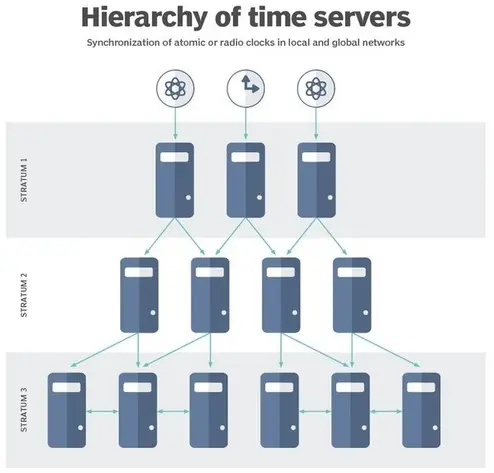
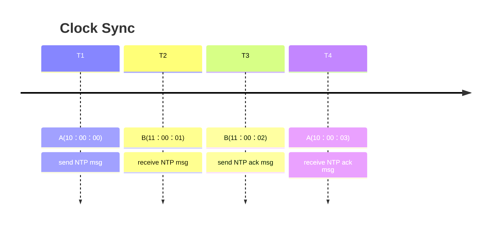

# 时钟回拨

在java编程中我们偶尔能看到“时钟回拨”的现象:

```java
//now() returns 2019-01-13T22:34:05.681Z
order.setCreationTime(Instant.now());

//... 执行一些其他工作

//now() returns 2019-01-13T22:34:03.123Z
//发现时间比创建时间提前了，仿佛时间被回拨
order.setCancelationTime(Instant.now());
```

<!--more-->

## 时钟类型

操作系统中的时钟分为两种: 

- CLOCK_MONOTONIC: 指单调时钟，以绝对时间为准，获取的时间为系统重启到现在的时间，更改系统时间对它没有影响。一定是单调递增的，因为时间不可逆。
- CLOCK_REALTIME: 指现实世界时间，也被称为挂钟时间(wall time)。其实质是相对时间(相对于1970.01.01)，受系统时间影响。wall time不一定是单调递增的。因为wall time是指现实中的实际时间，如果系统要与网络中某个节点时间同步、或者由系统管理员觉得这个wall time与现实时间不一致，有可能改变这个wall time。

## Java中的时间

- `System.currentTimeMillis()` 是基于系统时间的wall time。不保证单调的增加。在时钟调整（例如通过 NTP）的情况下，它可能会以任何一种方式（向前或向后）变化。
- `System.nanoTime()` 是单调的，当且仅当[底层平台支持CLOCK_MONOTONIC](https://bugs.java.com/bugdatabase/view_bug?bug_id=6458294)时。


## NTP

NTP，英文全称：Network Time Protocol，中文全名网络时间协议，是一种用于在计算机网络中同步设备时钟的协议。

它的主要目标是确保网络中的各个设备都具有一致的时间参考，以便它们可以协同工作，进行时间戳记录、数据同步和各种计算任务。NTP采用分层结构来确保时间同步，使网络中的所有设备都能获得准确的时间信息。


### 层级结构

层级（Stratum）在网络时间协议（NTP）中是用来表示时钟源的分级系统。NTP的分级结构确保了高精度的时间同步，因为它允许网络中的设备根据它们与更高级别的时钟源的接近程度来选择时间源。这有助于确保即使在互联网这样复杂的网络环境中，时间同步也可以保持在可接受的范围内。

NTP使用分层的时间源系统，每个层次都称为"层"，顶层的参考时钟被分配编号0。每个层的服务器与下一层的服务器同步，这种分层结构有助于防止层次结构中的循环依赖。



层级编号表示与参考时钟的距离，而不一定代表质量或可靠性。较高层的时间源通常质量更高。NTP数据包中的层字段设置为0表示未指定层级。

- Stratum 0: 这是最高的层级，通常由地球上的主要时间源提供，例如全球定位系统（GPS）卫星，原子钟等。Stratum 0时钟源被认为是最准确和最可信赖的。NTP服务器无法被分配到Stratum 0。
- Stratum 1: 这一层级包括直接与Stratum 0时钟源连接的NTP服务器。通常，这些NTP服务器是高精度的，例如使用GPS信号或原子钟，以获得准确的时间。Stratum 1服务器也称为主服务器，它们提供时间信息给下级的Stratum。
- Stratum 2: Stratum 2包括那些与Stratum 1服务器同步的NTP服务器。这些服务器依赖于Stratum 1服务器提供的时间信息，但它们仍然可以提供相对高精度的时间。Stratum 2服务器通常用于局域网或其他小规模网络中。
- Stratum 3: Stratum 3包括与Stratum 2服务器同步的NTP客户端。这些客户端通过网络连接到Stratum 2服务器，以获得时间同步。Stratum 3服务器通常用于更大规模的网络。

NTP的层级结构可以继续下去，一直到Stratum 15或16，这些层级通常表示未同步的设备或系统。随着层级的下降，时间同步的准确性会降低，因为每一级都会在上级的基础上添加一些网络延迟。

在同一Stratum内的时间服务器之间，它们可以通过点对点通信来协商时间，以确保它们的时钟保持一致。

> 层级上限为15，层级 16 用于表示设备未同步。每台计算机上的NTP算法使用贝尔曼-福特最短路径生成树，以最小化所有客户端到第 1 层服务器的累积往返延迟。除了层级，NTP还使用参考标识符来标识每个服务器的同步源。这有助于确定每个服务器的同步路径。

**分层结构确保了时间同步的可靠性，因为在发生故障或问题时，系统可以切换到更高层次的时间服务器，以保持时间准确性**。

### 时钟同步流程

系统时钟的同步流程如下所示：



1. RouterA 发送一个 NTP 报文给 RouterB，该报文中带有它离开 RouterA 时的时间戳10:00:00（T1）。
2. 此 NTP 报文到达 RouterB 时， RouterB 加上到达时间戳 11:00:01（T2）。
3. 此 NTP 报文离开 RouterB 时， RouterB 再加上离开时间戳 11:00:02（T3）。
4. RouterA 接收到该响应报文时，加上新的时间戳 10:00:03（T4）。至此， RouterA 获得了足够信息来计算以下两个重要参数:
    - NTP 报文来回一个周期的时延：`Delay= (T4-T1)-(T3–T2)`。
    - RouterA 相对 RouterB 的时间差：`Offset= ((T2-T1)+(T3–T4))/2`(前提是两个方向的时延相等)。
5. RouterA 根据计算得到 Delay 为 2 秒， Offset 为 1 小时。RouterA 根据这使用计算得到的网络延迟和服务器的时间戳来调整自己的本地时钟(T3+Delay)，实现与 RouterB 的时钟同步。

时间同步不是一次性事件，而是定期进行的。客户端设备通常每隔一段时间（通常是每10分钟或每小时）与NTP服务器进行一次时间同步，以确保时钟的准确性。此后的时间同步交换通常只需要一次消息交换，因为客户端已经与NTP服务器建立了时间校准。

**那么是不是使用NTP就可能出现时钟回拨呢**？

并不绝对。通常情况下，ntpd小步调整时钟，使得时间尺度有效连续且无间断。在极端网络拥塞条件下，往返延迟抖动可以超过3秒，同步距离（等于往返延迟的一半加误差预算项）可以变得非常大。ntpd算法丢弃超过128毫秒的样本偏移，除非没有样本偏移小于128毫秒的间隔超过900秒。之后的第一个样本，无论偏移多少，都将时钟步进到指定的时间。

由于这种行为，一旦设置了时钟，即使在网络路径拥塞和抖动的极端情况下，时钟也很少偏离超过128毫秒。有时，特别是当ntpd首次启动时，错误可能会超过128毫秒。如果本地时钟相对于服务器的时间将来超过128秒，这有时可能会导致时钟向后设置。

在某些应用程序中，这种行为可能是不可接受的。如果命令行中包含-x选项，时钟将永远不会步进，只会使用转换校正。在决定使用-x选项之前，应该仔细研究这些问题。由于NTP协议和算法设计所基于的正确性原则，最大可能的转换速率被限制在百万分之500（PPM）。因此，本地时钟可能需要很长时间才能收敛到可接受的偏移，时钟超出可接受范围的每秒钟大约2000秒。在此期间，本地时钟将与任何其他网络时钟不一致，系统不能用于需要正确同步网络时间的分布式应用程序。

## 参考

- [1] [stackoverflow. is there any consistent monotonic clock implementation in java](https://stackoverflow.com/questions/34778744/is-there-any-consistent-monotonic-clock-implementation-in-java)
- [2] [ntpd - 网络时间协议 （NTP） 守护程序](https://doc.ntp.org/documentation/4.1.0/ntpd/)

