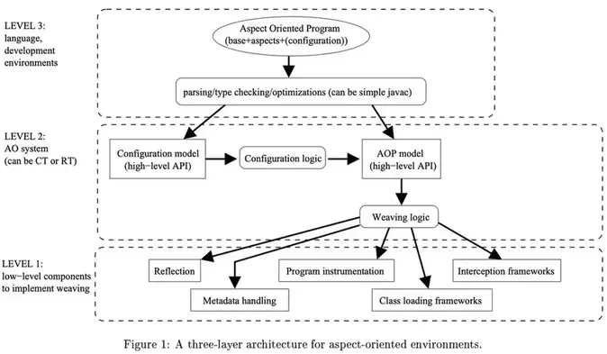

# AOP标准:aopalliance

AOP Alliance 项目是许多对Aop和java有浓厚兴趣的软件开发人员联合成立的开源项目，旨在确定Aop的标准。面向切面编程是设计和开发应用程序的一个好方案，AOP 提供了一种通用方法来构建关注点(横切关注点)，并将它们灵活地作为模块插入应用。但是，也带来了问题： 不同的AOP实现并不能适配所有环境。

大多数人不相信完美系统，我们认为一个系统总是能处理给定的一个问题和环境(不需要适配其他)。现在已经有了很多的AOP实现或AOP相关的技术，例如，通用代理，拦截器或字节码翻译工具。具体如下:

- AspectJ: 面向切面的源码级和字节码级别的织入器。
- AspectWerkz: 一个面向切面框架(字节码动态织入,支持XML配置)。
- BCEL: 一个字节码翻译器
- JAC: 一个面向切面框架(字节码动态织入，可配置切面)
- Javassist: 字节码翻译器，有高级API。
- JBoss-AOP: 拦截和基于元数据的AOP框架(支持独立运行和在JBoss应用服务器种运行)
- JMangler: 一个字节码翻译器，支持兼容翻译
- Nanning: 一个面向切面织入器框架
- Prose: 一个面向切面动态字节码织入框架


对我们而言，这些实现没有好与坏的区别，都适合于某些问题或环境。AOP Alliance的目的不是提出新的AOP模型，也不是提供一个更好的AOP实现来解决所有场景的问题。其目的在于提炼所有AOP实现的共同核心能力:

- 避免重复造轮子，尽量重用
- 简化某个环境下现有AOP组件的适配
- 简化开发工具集成AOP能力的工作

<!--more-->

## 面向切面架构

当我们构建面向切面的环境(AOE)时，设计者需要定义一个架构。在现有的大多数AOE中，架构定义并组合基本的模块/组件/APIS。通过对现有工具的学习，我们可以发现一些通用组件(在架构中提供相似的能力，但不一定使用相同的技术实现)。例如，JBoss的织入器使用Javassist来实现拦截机制(在客户端侧)，而JAC的织入器使用BCEL来实现拦截机制(在服务器端)。其他技术，例如调用JIT编译器可以被用来实现相同的功能。所有的方法都严重依赖环境。

一个典型的架构如下图所示:



上图中包含了一些组件(方块)和一些核心逻辑(圆角方块)。我们可以基于图中架构来运行一个面向切面程序。架构被分为3层:

* 底层提供了基本组件用于实现对目标程序的织入
* 系统层提供了AOP的基本组件，实现了面向切面语义
* 应用层提供了开发者使用AOP的方法和AOP的辅助工具(例如，类型检查，可视化工具，调试工具等等)

aopalliance通过上图，定义了AOP使用的标准API。其中最重要的组件是底层组件，因为他们的实现会影响AOP使用的环境。一些技术特征也在系统参数上有很深的影响,例如:

1. 切面是否支持动态织入和取消织入? 
2. 系统是否支持可伸缩的分发? 
3. 系统是否能和内置的切面(例如持久化或事务)共存。

工具例如IDE，调试工具，建模工具等等也对系统层组件相当感兴趣。有一个通用AOP概念的操作API也有助于工具能够更好的支持不同环境的多个AOP实现。AOP Alliance不会解决织入逻辑和配置逻辑，因为他实际上依赖于AOP的环境和实现。

## AOP Alliance 组件

下面我们来深入下AOP Alliance组件。底层组件是非常重要的，因为整个AOP环境依赖于他们来实现。他们实现的方式是至关重要的并且可能极大的影响系统属性，例如性能，伸缩性，可集成性或安全。

### 反射(reflection)

反射API对于任何AOP环境都是非常重要的。实际上，织入器需要自省目标程序的类，然后才能应用切面。例如，一个切点需要应用于一个类的所有方法(通过类似正则的表达式或者ALL关键字)，那么织入器需要使用反射API来准确地知道需要被横切的方法列表。

当织入处理在运行时处理时，SUN的java.lang.reflect 实现足以构建AOP运行环境。然而，在大多数的现有系统中，织入处理发生在编译期或是类加载期。在这些场景下，需要一个特殊实现的反射API。根据AOP Alliance，标准化这个API是非常重要的，可以基于AOP的运行环境上下文来选择其底层实现。

### 程序增强(program instrumentation)

从织入器的角度来看，如果反射是被编织程序的读访问，那么instrumentation就是写访问。然而，在AOP中，允许的程序修改操作是一些被缩减的操作。允许的修改操作是对程序现有架构的增量修改操作，所以切面可以被正确的组合在一起。这种增量修改被称为instrumentation。

对于instrumentation没有标准的API，但是类似于反射，instrumentation可以发生在运行期，编译期，或类加载期。此外，对于每种时期，根据AOP运行环境上下文，执行不同的instrumentation实现。例如，instrumentation可以在直接源码上或在字节码上。

### 拦截框架(interception frameworks)

对于构建AOP运行环境非常有用的另一个基础组件是拦截框架。通过动态代理，java 提供了一个标准的API/框架用于拦截。但是在透明度，性能等方面，我们可以通过其他实现(大多数使用 instrumentation API)来进行增强。所以，定义一个标准清晰的拦截API/框架是很有意义的。

拦截框架有很多优势，因为他们可以很简单的实现AOP模型中的环绕切面，此外，大多数时间他们可以通过纯JAVA单独地提供相当干净的仿AOP的代码。因此，很多拦截器框架已经被许多项目和环境实现。

### 元数据处理

当实现AOP运行环境时，特别是和拦截框架组合在一起的时候，元数据处理是很有用的。他允许织入器通过非侵入式的方式扩展类的语义。因为大多数的元数据实现允许动态，也可以被用于切面的动态配置。

尽管Java1.5提供了一个标准的元数据实现，提供一个标准API以允许多个实现也是很有意义的。这也会考虑一些环境特异性，例如分布式，序列化，他们在默认实现中未被正确处理。

### 类加载框架

在许多AOP运行环境中，字节码级别的操作是被需要的。这也有助于实现拦截框架，或直接实现织入器的程序增强。在一些场景，字节码级别的操作可以在类加载时完成，因为AOP instrumentation是非常简单的，所以大多数的AOP运行环境使用Java的灵活的类加载架构。

然而，有些环境也使用类加载器实现他们自己的功能。例如，分布式环境可能使用特定的类加载器生成存根。在这些环境内，AOP的类加载机制可能由于类加载冲突从而导致系统崩溃。因此，我们认为规范化一个类加载框架是很有必要的，这样可以便于不同环境的不同类加载器共同协做。

## API

aopalliance的包结构如下:

```
$ org.aopalliance.aop
  - Advice.java
  - AspectException.java
$ org.aopalliance.instrument
  - Instrumentation.java
  - InstrumentationError.java
  - Instrumentor.java
  - UndoNotSupportedException.java
$ org.aopalliance.intercept
  - ConstructorInterceptor
  - ConstructorInvocation
  - FieldAccess.java
  - FieldInterceptor.java
  - Interceptor
  - Invocation
  - Joinpoint
  - MethodInterceptor
  - MethodInvocation
$ org.aopalliance.reflect
  - Class.java
  - ClassLocator.java
  - Code.java
  - Field.java
  - Locator.java
  - Member.java
  - Metadata.java
  - Method.java
  - ProgramUnit.java
  - UnitLocator.java
```

类图如下([查看大图](mermaid.svg)):


```mermaid
classDiagram
    class Advice{
        &lt;&lt;Interface>>
    }
    class Interceptor{
        &lt;&lt;Interface>> 
    }
    Advice &lt;|-- Interceptor
    class ConstructorInterceptor{
        &lt;&lt;Interface>>
        + construct(ConstructorInvocation invocation):Object
    }
    ConstructorInvocation &lt;.. ConstructorInterceptor 
    Interceptor <|-- ConstructorInterceptor
    
    class FieldInterceptor{
        &lt;&lt;Interface>> 
        + get(FieldAccess fieldRead):Object
        + set(FieldAccess fieldWrite):Object
    }
    FieldAccess <.. FieldInterceptor 
    Interceptor <|-- FieldInterceptor

    class MethodInterceptor{
        &lt;&lt;Interface>> 
        + invoke(MethodInvocation invocation):Object
    }
    Interceptor <|-- MethodInterceptor
    MethodInvocation <.. MethodInterceptor 
    
    class Joinpoint{
        &lt;&lt;Interface>>
        + proceed(): Object
    }
    
    class FieldAccess{
        &lt;&lt;Interface>>
        + getField():Field
        + getValueToSet():Object
        + getAccessType:int
    }
    Field <.. FieldAccess 
    
    class Invocation{
        &lt;&lt;Interface>>
        + getArguments():Object[]
    }
    Joinpoint <|-- Invocation

    class MethodInvocation{
        &lt;&lt;Interface>> 
        + getMethod():Method
    }
    Invocation <|-- MethodInvocation
    Method <.. MethodInvocation 

    class ConstructorInvocation{
        &lt;&lt;Interface>> 
        + getConstructor:java.lang.reflect.Constructor
    }
    Invocation <|-- ConstructorInvocation

    class ProgramUnit{
        &lt;&lt;Interface>> 
        + getLocator():UnitLocator
        + getMetadata(Object key):Metadata
        + getMetadatas():Metadata[]
        + addMetadata(Metadata metadata)
        + removeMetadata(Object key)
    }
    UnitLocator <.. ProgramUnit 
    Metadata <.. ProgramUnit 

    class Class{
        &lt;&lt;Interface>> 
        + getClassLocator():ClassLocator
        + getName():String
        + getFields():Field[]
        + getDeclaredFields():Field[] 
        + getMethods(): Method[]
        + getDeclaredMethods(): Method[] 
        + getSuperclass(): Class
        + getInterfaces(): Class[]
    }
    ProgramUnit <|-- Class
    ClassLocator <.. Class 
    Field <.. Class 
    Method <.. Class 

    class Member{
        &lt;&lt;Interface>> 
        + getDeclaringClass():Class 
        + getName():String
        + getModifiers():int 
    }
    ProgramUnit <|-- Member

    class Method{
        &lt;&lt;Interface>> 
        + getCallLocator():CodeLocator
        + getCallLocator(Side side):CodeLocator
        + getBody():Code
    }
    Member <|-- Method
    CodeLocator <.. Method 
    Side <.. Method

    class Field{
        &lt;&lt;Interface>> 
        + getReadLocator():CodeLocator
        + getReadLocator(Side side):CodeLocator
        + getWriteLocator():CodeLocator
        + getWriteLocator(Side side):CodeLocator
    }
    Member <|-- Field
    CodeLocator <.. Field 
    Side <.. Field

    class Locator{
        &lt;&lt;Interface>> 
    }
    class UnitLocator{
        &lt;&lt;Interface>> 
    }
    Locator <|-- UnitLocator

    class Metadata{
        &lt;&lt;Interface>> 
        + getKey():Object
        + getValue(): Object
    }

    class CodeLocator{
        &lt;&lt;Interface>> 
    }
    Locator <|-- CodeLocator
    class ClassLocator{
        &lt;&lt;Interface>> 
    }
    UnitLocator <|-- ClassLocator
    
    class Code{
        &lt;&lt;Interface>> 
        + getLocator():CodeLocator
        + getCallLocator(Method calleeMethod):CodeLocator
        + getReadLocator(Field readField):CodeLocator
        + getWriteLocator(Field writtenField):CodeLocator
        + getThrowLocator(Class exceptionType):CodeLocator
        + getCatchLocator(Class exceptionType):CodeLocator
    }
    CodeLocator &lt;.. Code 

    class Instrumentation{
        &lt;&lt;Interface>> 
        + getLocation():Locator
        + getType():InstrumentationType
    }
    InstrumentationType <.. Instrumentation

    class Instrumentor{
        &lt;&lt;Interface>> 
        + createClass(String name):ClassLocator
        + addInterface(ClassLocator location, String newInterfaceName): Instrumentation
        + setSuperClass(ClassLocator location, String newSuperClassName):Instrumentation
        + addClass(ClassLocator location,String className):Instrumentation
        + addMethod(ClassLocator location, String name,String[] parameterTypeNames, String[] parameterNames,Code body):Instrumentation
        + addField(ClassLocator location, String name,String typeName, Code initializator):Instrumentation
        + addBeforeCode(CodeLocator location, Code beforeCode, Instrumentation before, Instrumentation after):Instrumentation
        + addAfterCode(CodeLocator location,   Code afterCode,  Instrumentation before,  Instrumentation after):Instrumentation
        + addAroundCode(CodeLocator location, Code aroundCode, String proceedMethodName, Instrumentation before,  Instrumentation after):Instrumentation
        + undo(Instrumentation instrumentation)
    }
    Instrumentation<..Instrumentor
    ClassLocator<..Instrumentor
    Code<..Instrumentor

    class InstrumentationType{
        &lt;&lt;enumeration>>
        ADD_INTERFACE
        SET_SUPERCLASS
        ADD_CLASS
        ADD_AFTER_CODE
        ADD_BEFORE_CODE
        ADD_AROUND_CODE
        ADD_METADATA
    }

    class Side{
        &lt;&lt;enumeration>>
        USER_SIDE
        PROVIDER_SIDE
    }
```

### 概念

- Advice定义了AOP框架在某个Joinpoint的通用处理逻辑,而interceptor只是Advice处理逻辑中的一种类型或方式,表示的仅仅是采用拦截处理机制实现了Advice这种功能;
- joinpoint:程序执行过程中一个运行时joinpoint,在这些点关联的静态位置通常会安装有一些Interceptor;当程序运行到这个运行时joinpoint时，AOP框架会拦截运行时jointpoint的执行，把运行时joinpoint交给已安装的interceptor们进行处理。


## 参考

- [1] [aopalliance 官网](https://aopalliance.sourceforge.net/)
- [2] [aopalliance github](https://github.com/hoverruan/aopalliance)

