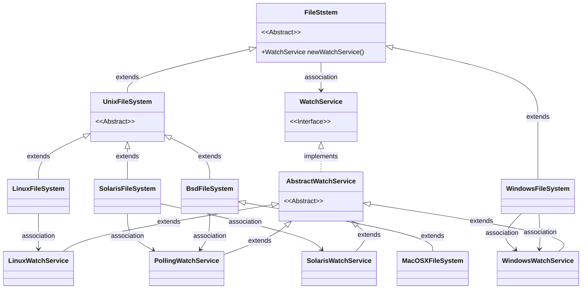
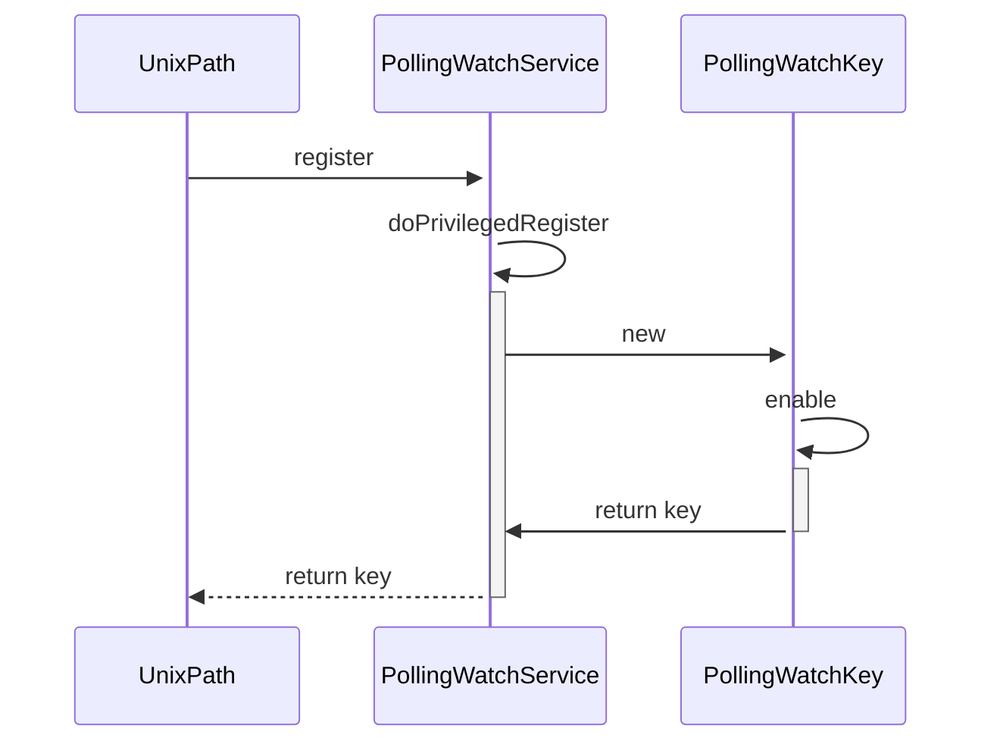
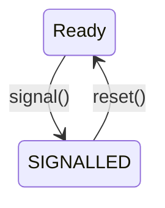

# Java File WatchService

java 的 nio包提供了对文件系统的监控服务，主要使用系统原生文件服务，同时在没有原生服务的时候，使用轮询来监控。下面是一个代码示例:

```java
    String path = "/tmp";
    // 获取当前OS平台下的文件系统监控器
    WatchService watcher = FileSystems.getDefault().newWatchService();
    //将监控器注册给指定的文件节点,该方法会让监控器线程就绪并运行，调用完后监控器就开始监控

    /* 文件变化枚举类型
     * ENTRY_CREATE：创建
     * ENTRY_DELETE：删除
     * ENTRY_MODIFY：修改
     */
    Paths.get(path).register(watcher,
        StandardWatchEventKinds.ENTRY_CREATE,
        StandardWatchEventKinds.ENTRY_DELETE,
        StandardWatchEventKinds.ENTRY_MODIFY);

    while (true) {
        WatchKey key = watcher.take();
        // 获得WatchKey（监控池）中的具体监控信息,
        // !!! 一个文件变化动作可能会引发一系列的事件，因此WatchKey中保存着一个事件列表List<WatchEvent<?>> list
        for (WatchEvent<?> event: key.pollEvents()) {

            System.out.println(event.context() + " comes to " + event.kind());
        }
        // 完成一次监控就需要重置监控器一次.
        boolean valid = key.reset(); 
        if (!valid) {
            break;
        }
    }
// ---------- output --------------
// tmp.log comes to ENTRY_DELETE
```

<!--more-->

监控池只能表示某一个时间节点下的文件变化信息，并不能动态保存这些信息；像register方法，刚注册完是返回的监控池是一个空的监控池，因为刚刚开启线程，什么都还没有发生，即使后面发生了文件修改，那么该监控池对象的内容还是保持不变，仍然是空的。当你主动去获取新的监控池时才会将更新的内容放入获取到的监控池中。

- `WatchService.poll()` 尝试获取下一个变化信息的监控池，如果没有变化则返回null
- `WatchService.take()` 尝试获取下一个变化信息的监控池，如果没有变化则一直等待

## 不同Filesystem的WatchService

下图是对应FileSystem 和 WatchService的关系。



> 注意，SolarisFileSystem 在大版本5之后使用SolarisWatchService.

关于平台特性的 WatchService,此处就不分析了，我们来看看PollingWatchService的相关实现。首先看下它的父类AbstractWatchService的实现。

## AbstractWatchService

```java
abstract class AbstractWatchService implements WatchService {

    // signaled keys waiting to be dequeued
    private final LinkedBlockingDeque<WatchKey> pendingKeys =
        new LinkedBlockingDeque<WatchKey>();

    //watchservice 关闭标志key, 特殊无意义消息用于防止消费者阻塞
    private final WatchKey CLOSE_KEY =
        new AbstractWatchKey(null, null) {
            @Override
            public boolean isValid() {
                return true;
            }

            @Override
            public void cancel() {
            }
        };

    // used when closing watch service
    private volatile boolean closed;
    private final Object closeLock = new Object();

    protected AbstractWatchService() {
    }

    abstract WatchKey register(Path path,
                               WatchEvent.Kind<?>[] events,
                               WatchEvent.Modifier... modifers)
        throws IOException;

    // used by AbstractWatchKey to enqueue key
    final void enqueueKey(WatchKey key) {
        pendingKeys.offer(key);
    }

    /**
     * Throws ClosedWatchServiceException if watch service is closed
     */
    private void checkOpen() {
        if (closed)
            throw new ClosedWatchServiceException();
    }

    /**
     * Checks the key isn't the special CLOSE_KEY used to unblock threads when
     * the watch service is closed.
     */
    private void checkKey(WatchKey key) {
        if (key == CLOSE_KEY) {
            // 重新入队，防止有线程阻塞，直到不再有线程阻塞。
            enqueueKey(key);
        }
        checkOpen();
    }

    @Override
    public final WatchKey poll() {
        checkOpen();
        WatchKey key = pendingKeys.poll();
        checkKey(key);
        return key;
    }

    @Override
    public final WatchKey poll(long timeout, TimeUnit unit)
        throws InterruptedException
    {
        checkOpen();
        WatchKey key = pendingKeys.poll(timeout, unit);
        checkKey(key);
        return key;
    }

    @Override
    public final WatchKey take()
        throws InterruptedException
    {
        checkOpen();
        WatchKey key = pendingKeys.take();
        checkKey(key);
        return key;
    }

    /**
     * Tells whether or not this watch service is open.
     */
    final boolean isOpen() {
        return !closed;
    }

    /**
     * Retrieves the object upon which the close method synchronizes.
     */
    final Object closeLock() {
        return closeLock;
    }

    /**
     * Closes this watch service. This method is invoked by the close
     * method to perform the actual work of closing the watch service.
     */
    abstract void implClose() throws IOException;

    @Override
    public final void close()
        throws IOException
    {
        synchronized (closeLock) { 
            // 此处加锁，防止多次调用 implclose()方法
            if (closed)
                return;
            closed = true;

            implClose();

            // clear pending keys and queue special key to ensure that any
            // threads blocked in take/poll wakeup
            pendingKeys.clear();
            // 插入一条标志结束的key，防止调用线程一直阻塞
            pendingKeys.offer(CLOSE_KEY);
        }
    }
}
```

可以看到AbstractWatchService使用生产者消费者模式，pendingKeys是消息队列。WatchService使用特殊的CLOSE_KEY 用于防止Close时线程阻塞在队列上。

## PollingWatchService

下面来看下PollingWatchService 对 AbstractWatchService 抽象方法的实现，主要是WatchKey事件是如何产生的。

```java
class PollingWatchService extends AbstractWatchService{
    // 注册 map，用于存放注册信息。
    private final Map<Object,PollingWatchKey> map =
        new HashMap<Object,PollingWatchKey>();

    // polling 定时线程池
    private final ScheduledExecutorService scheduledExecutor;

    PollingWatchService() {
        scheduledExecutor = Executors
            .newSingleThreadScheduledExecutor(new ThreadFactory() {
                 @Override
                 public Thread newThread(Runnable r) {
                     Thread t = new Thread(r);
                     t.setDaemon(true);
                     return t;
                 }});
    }

    @Override
    WatchKey register(final Path path, WatchEvent.Kind<?>[] events,WatchEvent.Modifier... modifiers)
         throws IOException{

        final Set<WatchEvent.Kind<?>> eventSet =
            new HashSet<WatchEvent.Kind<?>>(events.length);
        for (WatchEvent.Kind<?> event: events) {
            // standard events
            if (event == StandardWatchEventKinds.ENTRY_CREATE ||
                event == StandardWatchEventKinds.ENTRY_MODIFY ||
                event == StandardWatchEventKinds.ENTRY_DELETE){
                eventSet.add(event);
                continue; // 跳过无法识别的 event
            }
            // OVERFLOW is ignored
            if (event == StandardWatchEventKinds.OVERFLOW) {
                continue;
            }

            // null/unsupported
            if (event == null)
                throw new NullPointerException("An element in event set is 'null'");
            throw new UnsupportedOperationException(event.name());
        }
        if (eventSet.isEmpty())
            throw new IllegalArgumentException("No events to register");

        // 改变 polling 的时间间隔，敏感度调节(如果支持)
        SensitivityWatchEventModifier sensivity = SensitivityWatchEventModifier.MEDIUM;
        if (modifiers.length > 0) {
            for (WatchEvent.Modifier modifier: modifiers) {
                if (modifier == null)
                    throw new NullPointerException();
                if (modifier instanceof SensitivityWatchEventModifier) {
                    sensivity = (SensitivityWatchEventModifier)modifier;
                    continue;
                }
                throw new UnsupportedOperationException("Modifier not supported");
            }
        }

        // check if watch service is closed
        if (!isOpen())
            throw new ClosedWatchServiceException();

        // registration is done in privileged block as it requires the
        // attributes of the entries in the directory.
        try {
            final SensitivityWatchEventModifier s = sensivity;
            return AccessController.doPrivileged(
                new PrivilegedExceptionAction<PollingWatchKey>() {
                    @Override
                    public PollingWatchKey run() throws IOException {
                        return doPrivilegedRegister(path, eventSet, s);
                    }
                });
        } catch (PrivilegedActionException pae) {
            Throwable cause = pae.getCause();
            if (cause != null && cause instanceof IOException)
                throw (IOException)cause;
            throw new AssertionError(pae);
        }
    }

    // registers directory returning a new key if not already registered or
    // existing key if already registered
    private PollingWatchKey doPrivilegedRegister(Path path,
                                                 Set<? extends WatchEvent.Kind<?>> events,
                                                 SensitivityWatchEventModifier sensivity)
        throws IOException
    {
        // check file is a directory and get its file key if possible
        BasicFileAttributes attrs = Files.readAttributes(path, BasicFileAttributes.class);
        if (!attrs.isDirectory()) {
            throw new NotDirectoryException(path.toString());
        }
        Object fileKey = attrs.fileKey();
        if (fileKey == null)
            throw new AssertionError("File keys must be supported");

        // grab close lock to ensure that watch service cannot be closed
        synchronized (closeLock()) {
            if (!isOpen())
                throw new ClosedWatchServiceException();

            PollingWatchKey watchKey;
            synchronized (map) {
                watchKey = map.get(fileKey);
                if (watchKey == null) {
                    // new registration
                    watchKey = new PollingWatchKey(path, this, fileKey);
                    map.put(fileKey, watchKey);
                } else {
                    // update to existing registration
                    // 更新配置前，先禁用
                    watchKey.disable();
                }
            }
            // 此处开启 定时 polling 线程
            watchKey.enable(events, sensivity.sensitivityValueInSeconds());
            return watchKey;
        }
    }

    @Override
    void implClose() throws IOException {
        synchronized (map) {
            // 先 close 资源
            for (Map.Entry<Object,PollingWatchKey> entry: map.entrySet()) {
                PollingWatchKey watchKey = entry.getValue();
                watchKey.disable();
                watchKey.invalidate();
            }
            map.clear();
        }
        AccessController.doPrivileged(new PrivilegedAction<Void>() {
            @Override
            public Void run() {
                scheduledExecutor.shutdown();
                return null;
            }
         });
    }
}
```



通过上面的分析,主要实现逻辑应该是在 watchkey 中实现。

### WatchKey

下面先看下AbstractWatchKey。AbstractWatchKey有两个状态。 Ready时才能通过`signal()`方法入队，入队后还能监听事件。只有通过`reset()`方法才能出队(事件必须被消费完)。



`signalEvent`方法中还支持了事件合并操作。

```java
abstract class AbstractWatchKey implements WatchKey {

    /**
     * 最大可以记录 event 事件数
     */
    static final int MAX_EVENT_LIST_SIZE    = 512;

    /**
     * 容量溢出标志事件
     */
    static final Event<Object> OVERFLOW_EVENT =
        new Event<Object>(StandardWatchEventKinds.OVERFLOW, null);

    /**
     * Possible key states
     */
    private static enum State { READY, SIGNALLED };

    // reference to watcher
    private final AbstractWatchService watcher;

    // reference to the original directory
    private final Path dir;

    // key state
    private State state;

    // pending events
    private List<WatchEvent<?>> events;

    // maps a context to the last event for the context (iff the last queued
    // event for the context is an ENTRY_MODIFY event).
    private Map<Object,WatchEvent<?>> lastModifyEvents;

    protected AbstractWatchKey(Path dir, AbstractWatchService watcher) {
        this.watcher = watcher;
        this.dir = dir;
        this.state = State.READY;
        this.events = new ArrayList<WatchEvent<?>>();
        this.lastModifyEvents = new HashMap<Object,WatchEvent<?>>();
    }

    final AbstractWatchService watcher() {
        return watcher;
    }

    /**
     * Return the original watchable (Path)
     */
    @Override
    public Path watchable() {
        return dir;
    }

    /**
     * Enqueues this key to the watch service
     */
    final void signal() {
        synchronized (this) {
            if (state == State.READY) { // 避免重复入队
                state = State.SIGNALLED;
                watcher.enqueueKey(this);
            }
        }
    }

    /**
     * 发送事件
     */
    @SuppressWarnings("unchecked")
    final void signalEvent(WatchEvent.Kind<?> kind, Object context) {
        boolean isModify = (kind == StandardWatchEventKinds.ENTRY_MODIFY);
        synchronized (this) {
            int size = events.size();
            if (size > 0) {
                // if the previous event is an OVERFLOW event or this is a
                // repeated event then we simply increment the counter
                // 合并相同事件
                WatchEvent<?> prev = events.get(size-1);
                if ((prev.kind() == StandardWatchEventKinds.OVERFLOW) ||
                    ((kind == prev.kind() &&
                     Objects.equals(context, prev.context()))))
                {
                    ((Event<?>)prev).increment();
                    return;
                }

                // if this is a modify event and the last entry for the context
                // is a modify event then we simply increment the count
                // 合并修改事件
                if (!lastModifyEvents.isEmpty()) {
                    if (isModify) {
                        WatchEvent<?> ev = lastModifyEvents.get(context);
                        if (ev != null) {
                            assert ev.kind() == StandardWatchEventKinds.ENTRY_MODIFY;
                            ((Event<?>)ev).increment();
                            return;
                        }
                    } else {
                        // not a modify event so remove from the map as the
                        // last event will no longer be a modify event.
                        // 如果不是修改事件，删除最近修改记录。
                        lastModifyEvents.remove(context);
                    }
                }

                // if the list has reached the limit then drop pending events
                // and queue an OVERFLOW event
                if (size >= MAX_EVENT_LIST_SIZE) {
                    kind = StandardWatchEventKinds.OVERFLOW;
                    isModify = false;
                    context = null;
                }
            }

            // non-repeated event
            Event<Object> ev =
                new Event<Object>((WatchEvent.Kind<Object>)kind, context);
            if (isModify) {
                lastModifyEvents.put(context, ev);
            } else if (kind == StandardWatchEventKinds.OVERFLOW) {
                // drop all pending events
                events.clear();
                lastModifyEvents.clear();
            }
            events.add(ev);
            signal(); // 此处watchkey入队
        }
    }

    @Override
    public final List<WatchEvent<?>> pollEvents() {
        synchronized (this) {
            List<WatchEvent<?>> result = events;
            events = new ArrayList<WatchEvent<?>>();
            lastModifyEvents.clear();
            return result;
        }
    }

    // 重置 watchkey
    @Override
    public final boolean reset() {
        synchronized (this) {
            if (state == State.SIGNALLED && isValid()) {
                if (events.isEmpty()) {
                    state = State.READY;
                } else {
                    // pending events so re-queue key
                    watcher.enqueueKey(this);
                }
            }
            return isValid();
        }
    }

    /**
     * WatchEvent implementation
     */
    private static class Event<T> implements WatchEvent<T> {
        private final WatchEvent.Kind<T> kind;
        private final T context;
        // ... ...

    }
}
```

下面是PollingWatchService中对AbstractWatchKey的实现PollingWatchKey，会通过定时任务，定时调用`signalEvent()`。在定时任务中，主要是通过两次文件夹的快照状态，产生 CREATE，MODIFY和DELETE事件。

```java
private class PollingWatchKey extends AbstractWatchKey {
        private final Object fileKey;

        // current event set
        private Set<? extends WatchEvent.Kind<?>> events;

        // the result of the periodic task that causes this key to be polled
        private ScheduledFuture<?> poller;

        // indicates if the key is valid
        private volatile boolean valid;

        // used to detect files that have been deleted
        private int tickCount;

        // map of entries in directory
        private Map<Path,CacheEntry> entries;

        PollingWatchKey(Path dir, PollingWatchService watcher, Object fileKey)
            throws IOException
        {
            super(dir, watcher);
            this.fileKey = fileKey;
            this.valid = true;
            this.tickCount = 0;
            this.entries = new HashMap<Path,CacheEntry>();

            // get the initial entries in the directory
            try (DirectoryStream<Path> stream = Files.newDirectoryStream(dir)) {
                for (Path entry: stream) {
                    // don't follow links
                    long lastModified =
                        Files.getLastModifiedTime(entry, LinkOption.NOFOLLOW_LINKS).toMillis();
                    entries.put(entry.getFileName(), new CacheEntry(lastModified, tickCount));
                }
            } catch (DirectoryIteratorException e) {
                throw e.getCause();
            }
        }

        Object fileKey() {
            return fileKey;
        }

        @Override
        public boolean isValid() {
            return valid;
        }

        void invalidate() {
            valid = false;
        }

        // 开启定时 polling
        void enable(Set<? extends WatchEvent.Kind<?>> events, long period) {
            synchronized (this) {
                // update the events
                this.events = events;

                // create the periodic task
                Runnable thunk = new Runnable() { public void run() { poll(); }};
                this.poller = scheduledExecutor
                    .scheduleAtFixedRate(thunk, period, period, TimeUnit.SECONDS);
            }
        }

        // disables periodic polling
        void disable() {
            synchronized (this) {
                if (poller != null)
                    poller.cancel(false);
            }
        }

        @Override
        public void cancel() {
            valid = false;
            synchronized (map) {
                map.remove(fileKey());
            }
            disable();
        }

        /**
         * Polls the directory to detect for new files, modified files, or
         * deleted files.
         */
        synchronized void poll() {
            if (!valid) {
                return;
            }

            // update tick, 轮询次数
            tickCount++;

            // open directory
            DirectoryStream<Path> stream = null;
            try {
                stream = Files.newDirectoryStream(watchable());
            } catch (IOException x) {
                // directory is no longer accessible so cancel key
                cancel();
                signal();
                return;
            }

            // iterate over all entries in directory
            try {
                for (Path entry: stream) {
                    long lastModified = 0L;
                    try {
                        lastModified =
                            Files.getLastModifiedTime(entry, LinkOption.NOFOLLOW_LINKS).toMillis();
                    } catch (IOException x) {
                        // unable to get attributes of entry. If file has just
                        // been deleted then we'll report it as deleted on the
                        // next poll
                        continue;
                    }

                    // lookup cache, 根据上次快照,产生文件变化事件
                    CacheEntry e = entries.get(entry.getFileName());
                    if (e == null) {
                        // new file found
                        entries.put(entry.getFileName(),
                                     new CacheEntry(lastModified, tickCount));

                        // queue ENTRY_CREATE if event enabled
                        if (events.contains(StandardWatchEventKinds.ENTRY_CREATE)) {
                            signalEvent(StandardWatchEventKinds.ENTRY_CREATE, entry.getFileName());
                            continue;
                        } else {
                            // if ENTRY_CREATE is not enabled and ENTRY_MODIFY is
                            // enabled then queue event to avoid missing out on
                            // modifications to the file immediately after it is
                            // created.
                            if (events.contains(StandardWatchEventKinds.ENTRY_MODIFY)) {
                                signalEvent(StandardWatchEventKinds.ENTRY_MODIFY, entry.getFileName());
                            }
                        }
                        continue;
                    }

                    // check if file has changed
                    if (e.lastModified != lastModified) {
                        if (events.contains(StandardWatchEventKinds.ENTRY_MODIFY)) {
                            signalEvent(StandardWatchEventKinds.ENTRY_MODIFY,
                                        entry.getFileName());
                        }
                    }
                    // entry in cache so update poll time
                    e.update(lastModified, tickCount);

                }
            } catch (DirectoryIteratorException e) {
                // ignore for now; if the directory is no longer accessible
                // then the key will be cancelled on the next poll
            } finally {

                // close directory stream
                try {
                    stream.close();
                } catch (IOException x) {
                    // ignore
                }
            }

            // iterate over cache to detect entries that have been deleted
            Iterator<Map.Entry<Path,CacheEntry>> i = entries.entrySet().iterator();
            while (i.hasNext()) {
                Map.Entry<Path,CacheEntry> mapEntry = i.next();
                CacheEntry entry = mapEntry.getValue();
                if (entry.lastTickCount() != tickCount) {
                    Path name = mapEntry.getKey();
                    // remove from map and queue delete event (if enabled)
                    i.remove();
                    if (events.contains(StandardWatchEventKinds.ENTRY_DELETE)) {
                        signalEvent(StandardWatchEventKinds.ENTRY_DELETE, name);
                    }
                }
            }
        }
    }


    /**
     * Entry in directory cache to record file last-modified-time and tick-count
     */
    private static class CacheEntry {
        private long lastModified;
        private int lastTickCount;

        CacheEntry(long lastModified, int lastTickCount) {
            this.lastModified = lastModified;
            this.lastTickCount = lastTickCount;
        }

        int lastTickCount() {
            return lastTickCount;
        }

        long lastModified() {
            return lastModified;
        }

        void update(long lastModified, int tickCount) {
            this.lastModified = lastModified;
            this.lastTickCount = tickCount;
        }
    }
```

