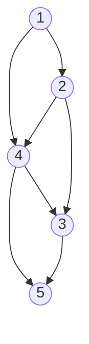
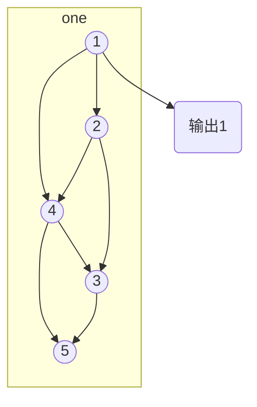
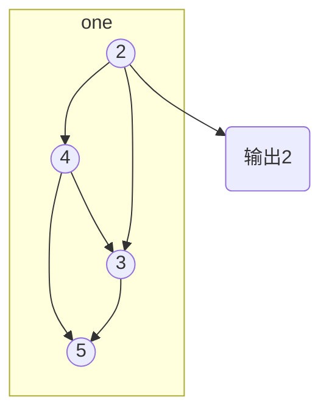
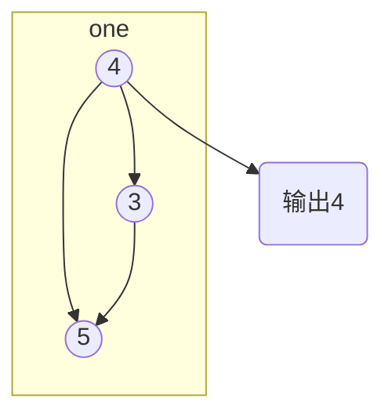
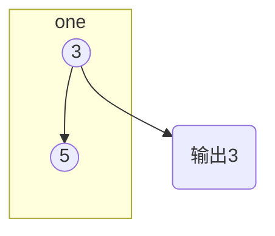
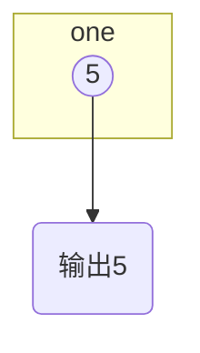

# 算法之拓扑排序

拓扑排序（Topological Sorting）是一个有向无环图（DAG, Directed Acyclic Graph）的所有顶点的线性序列。且该序列必须满足下面两个条件：

1. 每个顶点出现且只出现一次。
2. 若存在一条从顶点 A 到顶点 B 的路径，那么在序列中顶点 A 出现在顶点 B 的前面。



> 有向无环图（DAG）才有拓扑排序，非DAG图没有拓扑排序一说。

<!--more-->

## 拓扑排序的算法步骤

一个 DAG 图，如何写出它的拓扑排序呢？

1. 从 DAG 图中选择一个 没有前驱（即入度为0）的顶点并输出。
2. 从图中删除该顶点和所有以它为起点的有向边。
3. 重复 1 和 2 直到当前的 DAG 图为空或当前图中不存在无前驱的顶点为止。后一种情况说明有向图中必然存在环。因此，也可以通过拓扑排序来判断一个 DAG 图是否有环。

* step 1



* step 2



* step 3



* step 4



* step 5



## 例子

拓扑排序通常用来"排序"具有依赖关系的任务。比如，如果用一个DAG图来表示一个工程，其中每个顶点表示工程中的一个任务，用有向边`<A,B>`表示在做任务 B 之前必须先完成任务 A。故在这个工程中，任意两个任务要么具有确定的先后关系，要么是没有关系，绝对不存在互相矛盾的关系（即环路）。

```java
import java.util.ArrayList;
import java.util.Arrays;
import java.util.Comparator;
import java.util.Iterator;
import java.util.List;

/**
 * @Author victor
 * @Email victorchu0610@outlook.com
 * @Data 2019/8/20
 * @Version 1.0
 * @Description 有向图拓扑排序
 */
public class TopologicalSortingGraph<V extends Comparable> {

    // 邻接表
    private List<Node<V>> nodes = new ArrayList<>();

    // 默认比较器,支持动态设置
    private Comparator<V> comparator = new Comparator<V>() {
        @Override
        public int compare(V o1, V o2) {
            return o1.compareTo(o2);
        }
    };

    public void setComparator(Comparator<V> comparator) {
        this.comparator = comparator;
    }

    public void addEdge(V from,V to){
        Node<V> node1 = findNode(from);
        if(node1 == null){
            node1 = new Node<>();
            node1.setInner(from);
            nodes.add(node1);
        }

        Node<V> node2 = findNode(to);
        if(node2 == null){
            node2 = new Node<>();
            node2.setInner(to);
            nodes.add(node2);

        }

        node1.addOutGoing(node2);
        node2.addInCome(node1);

    }

    private Node<V> findNode(V value){
        for (Node<V> item:nodes) {
            if(comparator.compare(item.getInner(),value)==0){
                return item;
            }
        }
        return null;
    }

    public List<V> sort(){
        List<V> results = new ArrayList<>();
        sort0(nodes,results);
        return results;
    }

    private static <V> void sort0(List<Node<V>> nodeList,List<V> results){
        if(nodeList.size()==0){
            return;
        }
        boolean containsEmptyInCome = false;
        int count =0;
        // 找到输入为0的节点
        List<Integer> todo = new ArrayList<>();
        for (Node<V> item : nodeList) {
            if (item.getInComingCount() == 0) {
                todo.add(count);
            }
            count++;
        }
        todo.sort(Comparator.reverseOrder());
        // 倒序删除输入为0的节点
        for (int index:todo) {
            System.out.println(nodeList.get(index).getInner());
            containsEmptyInCome= true;
            List<Node<V>> outGoings = nodeList.get(index).getOutGoings();
            for (Node<V> outGoing:outGoings) {
                outGoing.getInComes().remove(nodeList.get(index));
            }
            results.add(nodeList.get(index).getInner());
            nodeList.remove(index);
        }
        if(!containsEmptyInCome){
            throw new RuntimeException("DAG contains cyclic dependencies:"+ Arrays.toString(nodeList.toArray()));
        }
        // 递归
        sort0(nodeList,results);
    }

    static class Node<V> {
        public List<Node<V>> getInComes() {
            return inComes;
        }

        public List<Node<V>> inComes = new ArrayList<>();

        public List<Node<V>> getOutGoings() {
            return outGoings;
        }

        public List<Node<V>> outGoings = new ArrayList<>();
        private V inner;

        public V getInner() {
            return inner;
        }

        public void setInner(V inner) {
            this.inner = inner;
        }

        public void addOutGoing(Node<V> node){
            outGoings.add(node);
        }

        public void addInCome(Node<V> node){
            inComes.add(node);
        }

        public int getInComingCount(){
            return inComes.size();
        }
    }

    public static void main(String[] args) {
        TopologicalSortingGraph<Integer> topologicalSortingGraph = new TopologicalSortingGraph<>();
        topologicalSortingGraph.addEdge(1,2);
        topologicalSortingGraph.addEdge(1,4);
        topologicalSortingGraph.addEdge(2,4);
        topologicalSortingGraph.addEdge(2,3);
        topologicalSortingGraph.addEdge(4,3);
        topologicalSortingGraph.addEdge(4,5);
        topologicalSortingGraph.addEdge(3,5);
        System.out.println(Arrays.toString(topologicalSortingGraph.sort().toArray()));
    }
}
```

