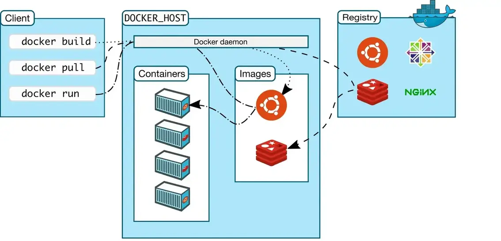
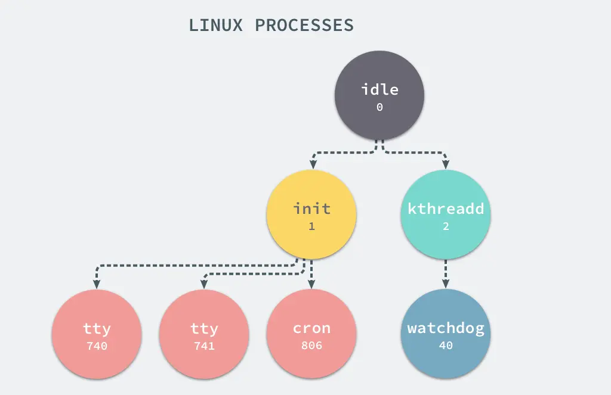
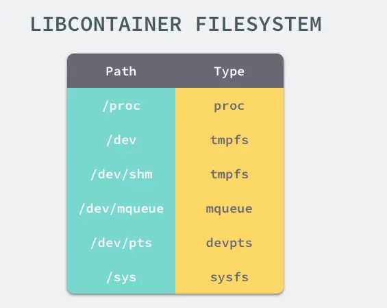
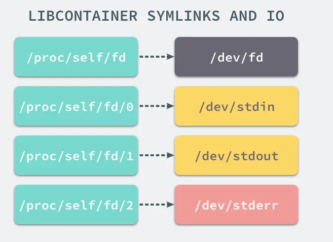
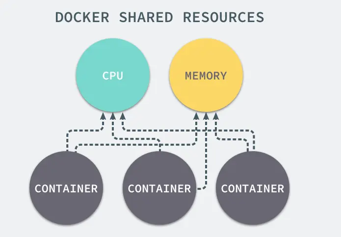
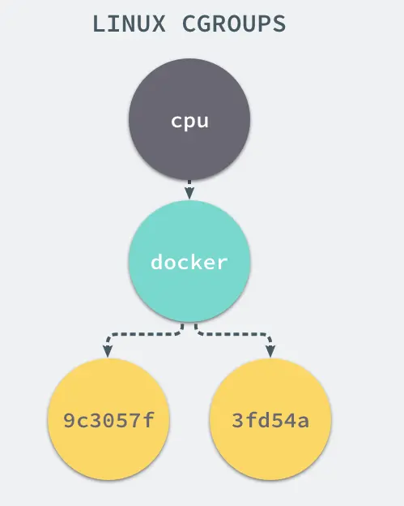
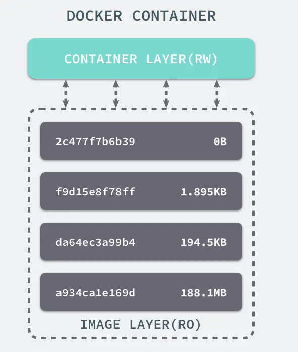
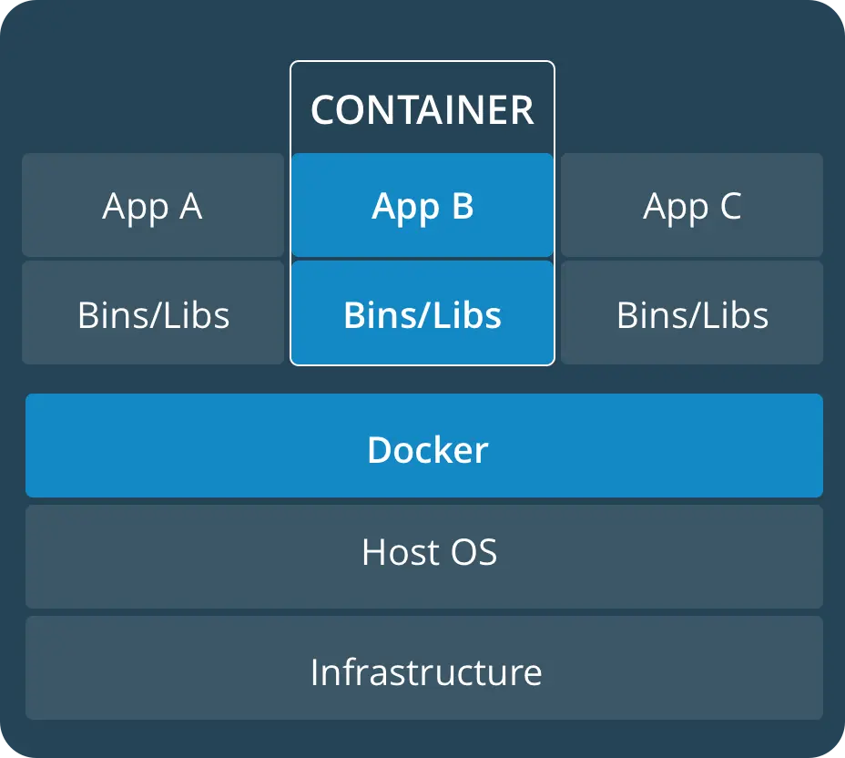
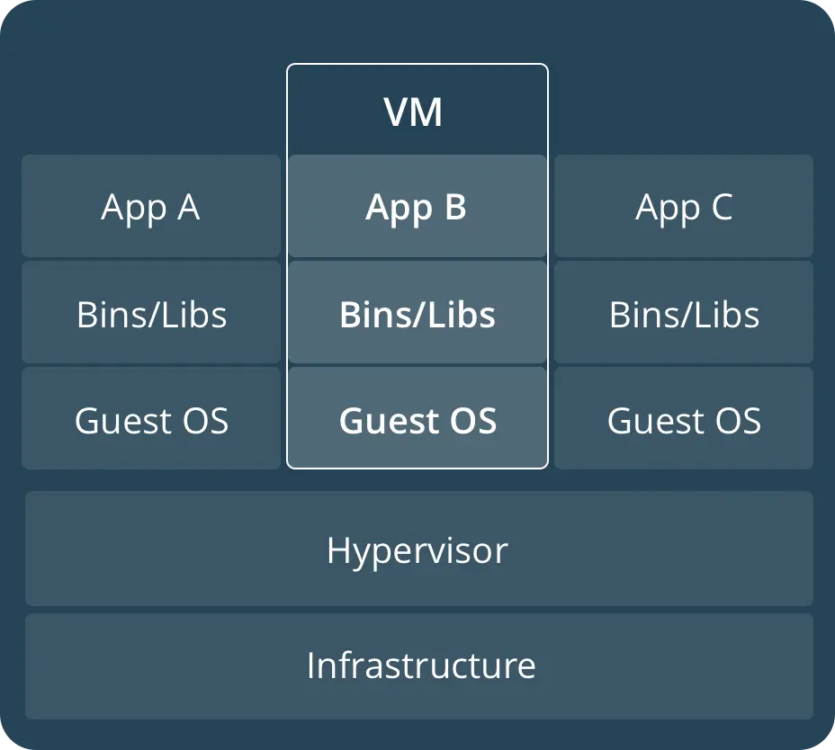

# docker 简介

Docker是一个用于开发,交付和运行应用程序的开放平台.Docker提供了在松散隔离的环境(称为容器)中打包和运行应用程序的功能.隔离和安全性使您可以在给定主机上同时运行多个容器.容器是轻量级的,因为它们不需要虚拟机管理程序的额外负载,而是直接在主机的内核中运行.这意味着与使用虚拟机相比,可以在给定的硬件组合上运行更多的容器.甚至可以在实际上是虚拟机的主机中运行Docker容器！

Docker提供了工具和平台来管理容器的生命周期：

* 使用容器开发应用程序及其支持组件.
* 容器成为分发和测试应用程序的单元.
* 准备就绪后,可以将应用程序作为容器或协调服务部署到生产环境中.

举个例子:

1. 开发人员在本地编写代码,并使用Docker容器与同事共享工作.
2. 使用Docker将其应用程序推送到测试环境中,并执行自动和手动测试.
3. 当开发人员发现错误时,他们可以在开发环境中对其进行修复,然后将其重新部署到测试环境中以进行测试和验证.
4. 测试完成后,将修补程序推送给生产环境就像将更新的映像推送到生产环境一样简单.

<!--more-->

## 什么是 docker ?


docker具有以下几个组件:

* 命令行界面CLI客户端.
* REST API,程序可以用来与守护程序进行通信并指示其操作的接口.
* 后台守护进程.

### docker 架构



Docker使用客户端-服务器架构.Docker 客户端与Docker 守护进程进行对话,该守护进程完成了构建,运行和分发Docker容器的繁重工作.Docker客户端和守护程序可以 在同一系统上运行,也可以将Docker客户端连接到远程Docker守护程序.Docker客户端和守护程序在UNIX套接字或网络接口上使用REST API进行通信.

### Docker守护程序

Docker守护程序(dockerd)侦听Docker API请求并管理Docker对象,例如图像,容器,网络和卷.守护程序还可以与其他守护程序通信以管理Docker服务.

### Docker客户端

Docker客户端(docker)是许多Docker用户与Docker交互的主要方式.当您使用诸如之类的命令时docker run,客户端会将这些命令发送到dockerd,以执行这些命令.该docker命令使用Docker API.Docker客户端可以与多个守护程序通信.

### Docker仓库

Docker 仓库存储Docker镜像.Docker Hub是任何人都可以使用的公共仓库,并且默认情况下,Docker已配置为在Docker Hub上查找镜像.您甚至可以运行自己的私人仓库.如果使用Docker数据中心(DDC),则其中包括Docker可信仓库(DTR).

使用docker pull或docker run命令时,所需的镜像将从配置的仓库中提取.使用该docker push命令时,会将镜像推送到配置的仓库.

### 镜像\(image\)

镜像是用于创建docker容器的只读模板.通常,一个镜像是基于另一个镜像,并进行了一些其他的自定义.例如,可以基于ubuntu镜像,构建镜像,同时安装上apache服务器和应用程序,及相关配置文件.

### 容器\(container\)

容器是镜像的运行实例,可以使用docker API 或CLI创建,启动,停止,移动或删除容器.可以将一个或多个网络或存储连接到容器,甚至是根据当前状态创建新的镜像.默认情况下,容器与其他容器及其主机之间的隔离度相对较高,该配置可以自己控制.

## 底层原理


Docker利用Linux核心中的资源分离机制(例如cgroups),Linux核心名字空间(namespaces)以及联合文件系统(UnionFS),来创建独立的容器(containers).

## 命名空间

命名空间是 Linux 核心在 2.4 版本后逐渐引入的一项用于运行隔离的模块.Linux 内核的命名空间,能够将计算机资源进行切割划分,形成各自独立的空间.

我们可以使用命令`sudo ls -l /proc/[pid]/ns`查看pid为`[pid]`的进程所属的namespace.

```sh
~ sudo ls -l /proc/1/ns
total 0
lrwxrwxrwx 1 root root 0 1月   3 18:14 cgroup -> 'cgroup:[4026531835]'
lrwxrwxrwx 1 root root 0 1月   3 18:14 ipc -> 'ipc:[4026531839]'
lrwxrwxrwx 1 root root 0 1月   3 18:14 mnt -> 'mnt:[4026531840]'
lrwxrwxrwx 1 root root 0 1月   3 18:14 net -> 'net:[4026531992]'
lrwxrwxrwx 1 root root 0 1月   3 18:14 pid -> 'pid:[4026531836]'
lrwxrwxrwx 1 root root 0 1月   3 18:14 pid_for_children -> 'pid:[4026531836]'
lrwxrwxrwx 1 root root 0 1月   3 18:14 user -> 'user:[4026531837]'
lrwxrwxrwx 1 root root 0 1月   3 18:14 uts -> 'uts:[4026531838]'
~ sudo ls -l /proc/2/ns
total 0
lrwxrwxrwx 1 root root 0 1月   3 18:14 cgroup -> 'cgroup:[4026531835]'
lrwxrwxrwx 1 root root 0 1月   3 18:14 ipc -> 'ipc:[4026531839]'
lrwxrwxrwx 1 root root 0 1月   3 18:14 mnt -> 'mnt:[4026531840]'
lrwxrwxrwx 1 root root 0 1月   3 18:14 net -> 'net:[4026531992]'
lrwxrwxrwx 1 root root 0 1月   3 18:14 pid -> 'pid:[4026531836]'
lrwxrwxrwx 1 root root 0 1月   3 18:14 pid_for_children -> 'pid:[4026531836]'
lrwxrwxrwx 1 root root 0 1月   3 18:14 user -> 'user:[4026531837]'
lrwxrwxrwx 1 root root 0 1月   3 18:14 uts -> 'uts:[4026531838]'
```

可以看到namespace共分为7种类型.分别为ipc、mnt、pid、uts、net、cgroups、user.
如果某个软链接如ipc指向了同一个ipc namespace,那么这两个进程则是在同一个ipc namespace下的.

* PID: 进程标识符和能力
* UTS: 主机名和域名
* MNT: 文件系统访问和结构
* IPC: 通过共享内存的进程间通信
* NET: 网络访问和结构
* USR: 用户名和标识
* cgroups: 资源保护

### namespace API

linux 提供了namespace的操作API.分别是`clone()`,`setns()`和`unshare()`.

#### `clone()`

`clone()`的功能是创建一个新的进程.和系统调用`fork()`不同,`clone()`创建新进程时有很多新的选项.

```C
/*
 * child_func: 表示子进程运行的主函数
 * child_stack：子进程使用的栈空间
 * flags：表示使用哪些 CLONE标志位
 * args：可用于传入用户参数
 */
int clone(int (*child_func)(void *), void *child_stack, int flags, void *arg);
```

|Namespace|clone标志|
|:---|:---|
|UTS|CLONE_NEWUTS|
|IPC|CLONE_NEWIPC|
|PID|CLONE_NEWPID|
|Network|CLONE_NEWNET|
|Mount|CLONE_NEWNS|
|User|CLONE_NEWUSER|
|Cgroup|CLONE_NEWCGROUP|

通过上面的clone标志位,可以在创建新进程的同时创建namespace.

> [Clone创建namespace的C语言实现](http://crosbymichael.com/creating-containers-part-1.html).

#### `setns()`

`setns()`的功能是将进程加入到一个已经存在的namespace中.在进程都结束的情况下,也可以通过挂载的形式把namespace保留下来,保留namespace的目的是为以后有进程加入作准备.在docker中,使用docker exec命令在已经运行的容器中执行新的命令,就需要用到该方法.通过setns()系统调用,进程从原先的namespace加入到某个已经存在的namespace,通常为了使新加入的pid namespace生效,会在setns()函数执行后使用clone()创建子进程继续执行新命令,让原先的进程结束运行.

#### `unshare()`

`unshare()`的功能是在原进程上进行namespace隔离.与clone()很像,不同的是,unshare()运行在原先的进程上,不需要启动一个新进程.调用unshare()的主要作用就是,不启动新进程就可以起到隔离的作用,相当于跳出原先的namespace进行操作,这样,就可以在原进程进行了一些需要隔离的操作.linux中自带unshare命令,就是通过unshare()系统调用实现的,docker目前并没有使用这个系统调用.

### PID

进程是 Linux 以及现在操作系统中非常重要的概念,它表示一个正在执行的程序,也是在现代分时系统中的一个任务单元.

linux 进程中有两个非常特殊,一个是 pid 为 1 的 `/sbin/init` 进程,另一个是 pid 为 2 的 `kthreadd` 进程,这两个进程都是被 Linux 中的上帝进程 idle 创建出来的,其中前者负责执行内核的一部分初始化工作和系统配置,也会创建一些类似 getty 的注册进程,而后者负责管理和调度其他的内核进程.



以进程为例,通过 PID Namespace,我们可以造就一个独立的进程运行空间,在其中进程的编号又会从 1 开始.在这个空间中运行的进程,完全感知不到外界系统中的其他进程或是其他进程命名空间中运行的进程.


### 网络

Docker 虽然可以通过命名空间创建一个隔离的网络环境,但是 Docker 中的服务仍然需要与外界相连才能发挥作用.
每一个使用 docker run 启动的容器其实都具有单独的网络命名空间,Docker 为我们提供了四种不同的网络模式,Host、Container、None 和 Bridge 模式(默认的网络模式).


* Host: 容器将不会虚拟出自己的网卡,配置自己的IP等,而是使用宿主机的IP和端口.
* Container: 创建的容器不会创建自己的网卡,配置自己的IP,而是和一个指定的容器共享IP、端口范围.
* None: 该模式关闭了容器的网络功能.
* Bridge: 此模式会为每一个容器分配、设置IP等,并将容器连接到一个docker0虚拟网桥,通过docker0网桥以及Iptables nat表配置与宿主机通信.

Docker 默认的网络设置模式：网桥模式.在这种模式下,除了分配隔离的网络命名空间之外,Docker 还会为所有的容器设置 IP 地址.当 Docker 服务器在主机上启动之后会创建新的虚拟网桥 docker0,随后在该主机上启动的全部服务在默认情况下都与该网桥相连.


在默认情况下,每一个容器在创建时都会创建一对虚拟网卡,两个虚拟网卡组成了数据的通道,其中一个会放在创建的容器中,会加入到名为 docker0 网桥中.

docker0 会为每一个容器分配一个新的 IP 地址并将 docker0 的 IP 地址设置为默认的网关.网桥 docker0 通过 iptables 中的配置与宿主机器上的网卡相连,所有符合条件的请求都会通过 iptables 转发到 docker0 并由网桥分发给对应的机器.

整个网络部分的功能都是通过 Docker 拆分出来的 [libnetwork](https://github.com/docker/libnetwork/blob/master/docs/design.md) 实现的,它提供了一个连接不同容器的实现,同时也能够为应用给出一个能够提供一致的编程接口和网络层抽象的容器网络模型.libnetwork 中最重要的概念,容器网络模型由以下的几个主要组件组成,分别是 Sandbox、Endpoint 和 Network:


在容器网络模型中,每一个容器内部都包含一个 Sandbox,其中存储着当前容器的网络栈配置,包括容器的接口、路由表和 DNS 设置,Linux 使用网络命名空间实现这个 Sandbox,每一个 Sandbox 中都可能会有一个或多个 Endpoint,在 Linux 上就是一个虚拟的网卡 veth,Sandbox 通过 Endpoint 加入到对应的网络中,这里的网络可能就是我们在上面提到的 Linux 网桥或者 VLAN.

### 挂载点

我们已经通过 Linux 的命名空间解决了进程和网络隔离的问题,在 Docker 进程中我们已经没有办法访问宿主机器上的其他进程并且限制了网络的访问,但是 Docker 容器中的进程仍然能够访问或者修改宿主机器上的其他目录,这是我们不希望看到的.

在新的进程中创建隔离的挂载点命名空间需要在 clone 函数中传入 CLONE_NEWNS,这样子进程就能得到父进程挂载点的拷贝,如果不传入这个参数子进程对文件系统的读写都会同步回父进程以及整个主机的文件系统.

如果一个容器需要启动,那么它一定需要提供一个根文件系统(rootfs),容器需要使用这个文件系统来创建一个新的进程,所有二进制的执行都必须在这个根文件系统中.



想要正常启动一个容器就需要在 rootfs 中挂载以上的几个特定的目录，除了上述的几个目录需要挂载之外我们还需要建立一些符号链接保证系统 IO 不会出现问题.



为了保证当前的容器进程没有办法访问宿主机器上其他目录,我们在这里还需要通过 [libcotainer](https://github.com/opencontainers/runc/blob/master/libcontainer/SPEC.md) 提供的 pivor_root 或者 chroot 函数改变进程能够访问个文件目录的根节点.

## cgroups

我们通过 Linux 的命名空间为新创建的进程隔离了文件系统、网络并与宿主机器之间的进程相互隔离,但是命名空间并不能够为我们提供物理资源上的隔离,比如 CPU 或者内存,如果在同一台机器上运行了多个对彼此以及宿主机器一无所知的『容器』,这些容器却共同占用了宿主机器的物理资源.



如果其中的某一个容器正在执行 CPU 密集型的任务,那么就会影响其他容器中任务的性能与执行效率,导致多个容器相互影响并且抢占资源.如何对多个容器的资源使用进行限制就成了解决进程虚拟资源隔离之后的主要问题,而 Control Groups(简称 CGroups)就是能够隔离宿主机器上的物理资源,例如 CPU、内存、磁盘 I/O 和网络带宽.

> cgroups是Linux内核提供的一种机制,这种机制可以根据需求把一系列系统任务及其子任务整合(或分隔)到按资源划分等级的不同组内,从而为系统资源管理提供一个统一的框架.

进入到sys/fs/cgroup/目录下,我们可以看到许多目录.这些如blkio、cpu、cpuacct等目录都是cgroups机制的子系统.blkio负责为块设备设定输入/输出限制,比如物理驱动设备——磁盘.cpu使用调度程序控制任务对cpu的使用,cpuacct自动生成cgroup中任务对CPU资源使用情况的报告.

```sh
~ cd /sys/fs/cgroup/
~ ls
blkio    cpu,cpuacct  freezer  net_cls           perf_event  systemd
cpu      cpuset       hugetlb  net_cls,net_prio  pids        unified
cpuacct  devices      memory   net_prio          rdma
```

为了让cgroups便于用户理解和使用,也为了用精简的内核代码为cgroup提供熟悉的权限和命名空间管理,**内核开发者们按照Linux虚拟文件系统转换器接口实现了一套名为cgroup的文件系统,非常巧妙地用来表示cgroups的层级概念,把各个子系统的实现都封装到文件系统的各项操作中**.那么,我们就可以像操作文件一样对cgroups的层级进行浏览和操作管理.除了cgroup文件系统以外,内核没有为cgroups的访问和操作添加任何系统调用.

下面介绍下几个相关术语:

* cgroups：cgroups是Linux内核中的一个机制,我们用它来作容器资源的限制等功能.
* cgroup：cgroup中文叫做控制组.它是cgroups实现资源控制的一个基本单位.cgroup表示按某种资源控制标准划分而成的一个任务组.它其中包含有一个或多个任务.
* task：前面介绍cgroup时提到的任务就是task.任务表示系统的一个进程或线程.之所以把进程和线程统称为任务,是因为内核本身的调度和管理并没有对进程和线程做区分,只根据clone创建时传入参数的不同从概念上区别进程和线程,所以cgroups中简化.
* subsystem：cgroups中的子系统.一个子系统就是一个资源调度控制器.比如前面一开始让大家看的cpu、memory、blkio、cpuacct等都是子系统.
* hierarchy：中文叫做层级.层级由一系列cgroup以一个树状结构排列而成.每个层级通过绑定对应的子系统进行资源控制.前面一开始看到的目录就是子系统,而这些子系统就挂载着层级.一个层级内创建一个目录就类似于fork一个cgroup,这个cgroup继承了父cgroup的配置属性.当然,后面可以进行配置属性的修改.

```sh
## 在/sys/fs/cgroup 目录下
~ cgroup tree -L 1
## 目录下的是子系统.
.
├── blkio
├── cpu -> cpu,cpuacct  
├── cpuacct -> cpu,cpuacct
├── cpu,cpuacct
├── cpuset
├── devices
├── freezer
├── hugetlb
├── memory
├── net_cls -> net_cls,net_prio
├── net_cls,net_prio
├── net_prio -> net_cls,net_prio
├── perf_event
├── pids
├── rdma
├── systemd
└── unified
~ cd cpu
~ tree -L 1
## 子系统里是默认父配置
.
├── cgroup.clone_children
├── cgroup.procs
├── cgroup.sane_behavior
├── cpuacct.stat
├── cpuacct.usage
├── cpuacct.usage_all
├── cpuacct.usage_percpu
├── cpuacct.usage_percpu_sys
├── cpuacct.usage_percpu_user
├── cpuacct.usage_sys
├── cpuacct.usage_user
├── cpu.cfs_period_us
├── cpu.cfs_quota_us
├── cpu.shares
├── cpu.stat
├── notify_on_release
├── release_agent
├── system.slice
├── tasks
└── user.slice
```

如果我们在cpu目录下创建一个组cgroup1.cgroup1文件夹内会默认创建和cpu目录下相同的配置文件,并继承默认父配置的值.



cgroups为我们提供了四项功能：

* 资源限制：cgroups可以对任务使用的资源总额进行限制.如cpu的使用,memory的使用.
* 优先级分配：通过分配的CPU时间片数量及磁盘IO带宽大小,实际上就相当于控制了任务运行的优先级.
* 资源统计：cgroups可以统计系统的资源使用量,如CPU使用时长、内存用量等信息,该功能可以用于资源使用的计费.
* 任务控制：cgroups可以对任务执行挂起、恢复等操作.

一个子系统就是一个资源控制器,每个子系统都独立地控制一种资源.

* blkio：可以为块设备设定输入/输出限制,比如物理驱动设备.
* cpu：使用调度程序控制任务对CPU的使用.
* cpuacct：自动生成cgroup中任务对CPU资源使用情况的报告.实际就是记录CPU的使用情况.
* cpuset：可以为cgroup中的任务分配独立的CPU和内存.当然,分配独立的CPU的前提是节点是多处理器的.
* devices：可以开启或关闭cgroup中任务对设备的访问.
* freezer：可以挂起或恢复cgroup中的任务.这就是cgroups的任务控制功能.
* memory：可以设定cgroup中任务对内存使用量的限定,并且自动生成这些任务对内存资源使用情况的报告.
* perf_event：使用后使cgroup中的任务可以进行统一的性能测试.
* net_cls：Docker没有直接使用它,它通过使用等级识别符标记网络数据包,从而允许Linux流量控制程序识别从具体cgroup中生成的数据包.
* pids：用来限制cgroup中任务的数量.
* hugetlb：支持cgroups限制巨页的使用.

当cgroup使用的资源超出了分配的限额会有什么后果呢？
以内存为例,当进程所需的内存超过了它所属的cgroup最大限额时,如果Linux设置了OOM,那么进程会收到OOM信号并结束；否则进程就会被挂起,进入睡眠状态,直到cgroup中其他进程释放了足够的内存资源为止.Docker中是默认开启OOM的.其他子系统的资源限制与此类似.

## UnionFS

Linux 的命名空间和控制组分别解决了不同资源隔离的问题,前者解决了进程、网络以及文件系统的隔离,后者实现了 CPU、内存等资源的隔离,但是在 Docker 中还有另一个非常重要的问题需要解决 - 也就是镜像.

Docker 镜像其实本质就是一个压缩包,我们可以使用下面的命令将一个 Docker 镜像中的文件导出:

```sh
~ docker export $(docker create busybox) | tar -C rootfs -xvf -
~ ls
bin  dev  etc  home proc root sys  tmp  usr  var
```

可以看到这个 busybox 镜像中的目录结构与 Linux 操作系统的根目录中的内容并没有太多的区别,可以说 Docker 镜像就是一个文件.

### 存储驱动

Docker 使用了一系列不同的存储驱动管理镜像内的文件系统并运行容器,这些存储驱动与 Docker 卷(volume)有些不同,存储引擎管理着能够在多个容器之间共享的存储.Docker 中的每一个镜像都是由一系列只读的层组成的,Dockerfile 中的每一个命令都会在已有的只读层上创建一个新的层:

```docker
FROM ubuntu:15.04
COPY . /app
RUN make /app
CMD python /app/app.py
```

容器中的每一层都只对当前容器进行了非常小的修改,上述的 Dockerfile 文件会构建一个拥有四层 layer 的镜像:



当镜像被 docker run 命令创建时就会在镜像的最上层添加一个可写的层,也就是容器层,所有对于运行时容器的修改其实都是对这个容器读写层的修改.容器和镜像的区别就在于,所有的镜像都是只读的,而每一个容器其实等于镜像加上一个可读写的层,**也就是同一个镜像可以对应多个容器**.

### AUFS

UnionFS 其实是一种为 Linux 操作系统设计的用于把多个文件系统『联合』到同一个挂载点的文件系统服务.而 AUFS 即 Advanced UnionFS 其实就是 UnionFS 的升级版,它能够提供更优秀的性能和效率.

AUFS 作为联合文件系统,它能够将不同文件夹中的层联合(Union)到了同一个文件夹中,这些文件夹在 AUFS 中称作分支,整个『联合』的过程被称为联合挂载(Union Mount):


每一个镜像层或者容器层都是 `/var/lib/docker/` 目录下的一个子文件夹;在 Docker 中,所有镜像层和容器层的内容都存储在`/var/lib/docker/aufs/diff/` 目录中.而 `/var/lib/docker/aufs/layers/` 中存储着镜像层的元数据,每一个文件都保存着镜像层的元数据,最后的 `/var/lib/docker/aufs/mnt/` 包含镜像或者容器层的挂载点,最终会被 Docker 通过联合的方式进行组装.


上面的这张图片非常好的展示了组装的过程,每一个镜像层都是建立在另一个镜像层之上的,同时所有的镜像层都是只读的,只有每个容器最顶层的容器层才可以被用户直接读写,所有的容器都建立在一些底层服务(Kernel)上,包括命名空间、控制组、rootfs 等等,这种容器的组装方式提供了非常大的灵活性,只读的镜像层通过共享也能够减少磁盘的占用.

AUFS 只是 Docker 使用的存储驱动的一种,除了 AUFS 之外,Docker 还支持了不同的存储驱动,包括 aufs、devicemapper、overlay2、zfs 和 vfs 等等,在最新的 Docker 中,overlay2 取代了 aufs 成为了推荐的存储驱动,但是在没有 overlay2 驱动的机器上仍然会使用 aufs 作为 Docker 的默认驱动.

想要查看当前系统的 Docker 上使用了哪种存储驱动只需要使用以下的命令就能得到相对应的信息：

```sh
$ docker info | grep Storage
Storage Driver: aufs
```

## 容器VS虚拟机

容器在Linux上本地运行，并与其他容器共享主机的内核。相比之下，虚拟机（VM）运行"GUEST"操作系统，并通过虚拟机管理程序对主机资源进行虚拟访问。通常，VM会产生大量开销，超出了应用程序所消耗的开销。

|docker|vm|
|:---|:---|
|||

