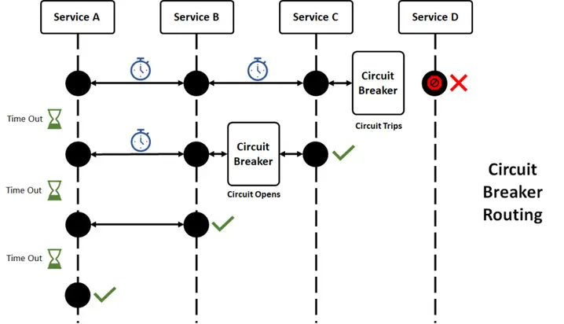
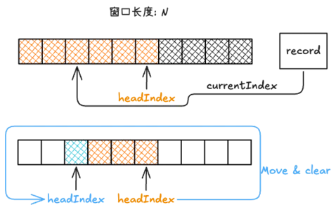

# 设计模式-断路器

**什么是短路器？**

断路器本身是指电气安全装置，旨在保护电路免受超过设备可以安全承载的电流。断路器可以重置（手动或自动）以恢复正常运行。在软件工程中用于保护系统稳定性，防止资源过载。

<!--more-->

## 断路器模式

断路器有以下特征:

- 有打开和关闭两种状态
- 资源充足时变成关闭状态
- 资源不足时变成打开状态

接口定义如下:

```java
public interface CircuitBreaker {
    Boolean isTripped();
}
```

基于接口，可以实现 CPU 和 内存等系统资源的熔断器。例如:

```java
public class CPUCircuitBreaker implement CircuitBreaker{
    private double cpuThreshold;
    private OperatingSystemMXBean operatingSystemMXBean =
            ManagementFactory.getOperatingSystemMXBean();
    public CPUCircuitBreaker(double cpuThreshold){
        this.cpuThreshold = cpuThreshold;
    }
    Boolean isTripped(){
        double localSeenCPUUsage = operatingSystemMXBean.getSystemLoadAverage();
        return (localSeenCPUUsage >= cpuThreshold);
    }
}
```

## 微服务断路器模式

上节介绍的断路器模式是一种简单的模式，因为其所保护资源可以量化，且能自动恢复。在微服务调用场景，熔断器实现变得更加复杂。微服务设计模式和面向服务的体系结构比单机设计模式更有优势。比如，高可用性，易于部署，良好的容错性。但与此同时，这种微服务和面向服务的设计模式有一个最大的缺点，那就是它会进入级联故障循环，因为服务可能在相同或不同的位置，甚至在不同的网络中。所以，处理这种由于服务不可用而导致的级联故障，我们需要熔断器设计模式。

### 微服务的问题

假设我们有四种不同的服务，即服务A、B、C和D。

- 由于客户端请求，服务A将调用服务B，B调用C，C调用D。
- 但是，由于某种原因，服务D异常了。因此，其他服务与服务D建立的连接将等待。
- 如果服务D将保持无响应的状态。服务C将不断重试以与服务D建立连接。此时 C 将无法响应服务 B。
- 最终这会导致服务 A 异常。甚至是整个系统的雪崩失败。


对于这个问题，可以通过引入断路器来解决。当连续故障的数量达到定义的阈值级别时，服务的连接线程将立即断开。在定义的时间之后，断路器将允许有限数量的服务再次通信。如果有限数量的请求成功，那么断路器将正常工作并允许连接。

- 服务之间的所有连接都将通过断路器。
- 当服务D发生故障且最大故障数达到服务C的断路器阈值时，断路器将关闭，连接将立即停止。
- 之后一段时间内打开的连接中只有有限的连接允许进行通信，以测试不可用服务的稳定性。
- 如果测试连接成功，则跨服务的通信将正常恢复。
- 如果连接失败，断路器将创建监视器和警报事件，或者如果我们有任何自我修复的实施，将被触发。



### 断路器架构

断路器应该有三种状态。

- 断路器-关闭-允许连接通过
- 断路器-打开-断开连接
- 断路器-有限关闭-允许有限数量的连接进行测试


- 关闭状态：当一切正常时，断路器保持关闭状态，所有请求都传递给服务。如果故障数量增加到阈值以上，断路器跳闸并进入打开状态。
- 打开状态：在这种状态下，断路器立即返回错误，甚至不调用服务。超时时间过去后，断路器进入半开状态。通常，它将有一个指定超时的监控系统。
- 半开状态：在这种状态下，断路器允许来自服务的有限数量的请求通过并调用操作。如果请求成功，则断路器将进入关闭状态。但是，如果请求继续失败，则返回打开状态。

两个关键设置控制断路器的行为：

- 故障阈值-断路器触发的故障百分比阈值。例如，在过去10秒内>50%失败。
- 等待持续时间-断路器在转换到半开状态进行试验之前保持开路状态的时间。例如，30秒。

较低的故障阈值和较长的等待时间会导致断路器更频繁地打开并保持更长时间的打开。应根据下游服务的波动性和所需的故障模式调整设置。

### 阈值统计

如何统计故障率？

### 固定窗口

- 将时间划分为固定的窗口大小，例如需要判断 10s 内的失败率，那么就把窗口大小设置为 10s。
- 在窗口时间段内，每来一个请求，对计数器加1。
- 窗口时间结束后，计数器清零，从新开始计数。

固定窗口实现简单，但是有个问题，断路器必须在整个窗口结束时才能感知异常，这显然不太合适。

### 滑动窗口

滑动窗口算法在固定窗口的基础上，将一个窗口分成了若干个小窗，然后每个小窗口维护一个独立的计数器。很显然滑动窗口的感知时长是小窗口的大小。感知更及时。



### 断路器问题

断路器在理论上看起来很棒——可以防止分布式系统中的级联故障。但就像所有事情一样，有一个问题——如果设计不当，它们实际上可能会使服务退化变得更糟。

关键问题是断路器假设服务要么完全可用，要么完全不可用。但是现代分布式系统通常通过分片或单元等机制实现部分降级。

以分片非关系型数据库为例。如果一个分片过载，对该分片的请求将开始失败，而其他分片仍在运行。过于急切的断路器可能会将整个服务视为关闭。然后，本来可以成功的请求也不必要地失败了。断路器将部分退化转化为完全失败。

一种解决方法是服务器向客户端指示哪个特定部分过载，客户端使用相应的迷你断路器。然而，这种解决方法可能既复杂又昂贵。[<sup>2</sup>](#refer-anchor-2)

### Hystrix Circuit Breaker 实现


Hystrix Circuit Breaker基于时间滑动窗口统计失败率。

### 客户端断路器

指数补偿是一种通过反馈，成倍地降低某个过程的速率，以逐渐找到合适速率的算法。在以太网中，该算法通常用于冲突后的调度重传。根据时隙和重传尝试次数来决定延迟重传。

在c次碰撞后（比如请求失败），会选择0和 $2^{c-1}$ 之间的随机值(最长不超过阈值上限，例如 10s)作为时隙的数量。

- 对于第1次碰撞来说，每个发送者将会等待0或1个时隙进行发送。
- 而在第2次碰撞后，发送者将会等待0到3个时隙进行发送。
- 而在第3次碰撞后，发送者将会等待0到7个时隙进行发送。

以此类推，随着重传次数的增加，延迟的程度也会指数增长。

下面是一个简单的例子:

```java
public class ExponentialBackOff
{
    private final long initialWait;
    private final long maxWait;
    private final String serverUpMessage;
    private final String serverDownMessage;
    private final Logger log;

    private boolean serverUp = true;

    private long currentWaitInMillis = -1;

    public ExponentialBackOff(Duration initialWait, Duration maxWait, String serverUpMessage, String serverDownMessage, Logger log)
    {
        this.initialWait = requireNonNull(initialWait, "initialWait is null").toMillis();
        this.maxWait = requireNonNull(maxWait, "maxWait is null").toMillis();
        checkArgument(this.initialWait <= this.maxWait, "initialWait %s is less than maxWait %s", initialWait, maxWait);

        this.serverUpMessage = requireNonNull(serverUpMessage, "serverUpMessage is null");
        this.serverDownMessage = requireNonNull(serverDownMessage, "serverDownMessage is null");
        this.log = requireNonNull(log, "log is null");
    }

    public synchronized void success()
    {
        if (!serverUp) {
            serverUp = true;
            log.info(serverUpMessage);
        }
        currentWaitInMillis = -1;
    }

    public synchronized Duration failed(Throwable t)
    {
        if (serverUp) {
            serverUp = false;
            log.debug("{}: {}", serverDownMessage, t.getMessage());
        }
        log.debug(serverDownMessage,t);

        if (currentWaitInMillis <= 0) {
            currentWaitInMillis = initialWait;
        }
        else {
            currentWaitInMillis = Math.min(currentWaitInMillis * 2, maxWait);
        }
        return Duration.of(currentWaitInMillis, ChronoUnit.MILLIS);
    }
}
```


## 参考

- [1] [Circuit breaker design pattern](https://en.wikipedia.org/wiki/Circuit_breaker_design_pattern)

<div id="refer-anchor-2"></div>

- [2] [Will circuit breakers solve my problems?](https://brooker.co.za/blog/2022/02/16/circuit-breakers.html)

- [3] [Exponential backoff](https://en.wikipedia.org/wiki/Exponential_backoff)

