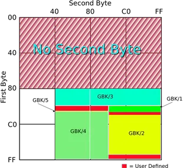

# 字符集和编码

计算机内部，所有信息最终都是一个二进制值。每一个二进制位（bit）有0和1两种状态，因此八个二进制位就可以组合出256种状态，这被称为一个字节（byte）。也就是说，一个字节一共可以用来表示256种不同的状态。如果将这每一个状态对应一个符号，就是256个符号，从00000000到11111111。


- Character 字符。即我们看到的单个符号，像“A”、“啊”等
- Code point 代码点。一个无符号数字，通常用16进制表示。代码点与字符的一一对应关系称为字符集（Character Set），这种对应关系肯定不止一种，也就导致了不同字符集的出现，像 ASCII、ISO-8859-1、GB2312、GBK、Unicode 等。
- Bytes 二进制字节。其含义为代码点在内存或磁盘中的表示形式。代码点与二进制字节的一一对应关系称为编码（Encoding），当然这种对应关系也不是唯一的，所以编码也有很多种，像 ASCII、ISO-8859-1、ENC-CN、GBK、UTF-8等。

例如，ASCII 字符集只是定义了字符与字符码（character code，也称 code point 代码点）的对应关系。也就是说这一层面只是规定了字符A用 65 表示，至于这个 65 在内存或硬盘中怎么表示，它不管，那是 ASCII 编码做的事。
<!--more-->

## ASCII 码

上个世纪60年代，美国制定了一套字符编码，对英语字符与二进制位之间的关系，做了统一规定。这被称为 ASCII 码，一直沿用至今。

ASCII 码一共规定了128个字符的编码，比如空格SPACE是32（二进制00100000），大写的字母A是65（二进制01000001）。这128个符号（包括32个不能打印出来的控制符号,从0开始的32种状态分别规定了特殊的用途），只占用了一个字节的后面7位，最前面的一位统一规定为0。

|Dec|Hex|Binary|Char|Description|
|:---|:---|:---|:---|:---|
|0|00|00000000|NUL|Null|
|1|01|00000001|SOH|Start of Header|
|2|02|00000010|STX|Start of Text|
|3|03|00000011|ETX|End of Text|
|4|04|00000100|EOT|End of Transmission|
|5|05|00000101|ENQ|Enquiry|
|6|06|00000110|ACK|Acknowledge|
|7|07|00000111|BEL|Bell|
|8|08|00001000|BS|Backspace|
|9|09|00001001|HT|Horizontal Tab|
|10|0A|00001010|LF|Line Feed|
|11|0B|00001011|VT|Vertical Tab|
|12|0C|00001100|FF|Form Feed|
|13|0D|00001101|CR|Carriage Return|
|14|0E|00001110|SO|Shift Out|
|15|0F|00001111|SI|Shift In|
|16|10|00010000|DLE|Data Link Escape|
|17|11|00010001|DC1|Device Control 1|
|18|12|00010010|DC2|Device Control 2|
|19|13|00010011|DC3|Device Control 3|
|20|14|00010100|DC4|Device Control 4|
|21|15|00010101|NAK|Negative Acknowledge|
|22|16|00010110|SYN|Synchronize|
|23|17|00010111|ETB|End of Transmission Block|
|24|18|00011000|CAN|Cancel|
|25|19|00011001|EM|End of Medium|
|26|1A|00011010|SUB|Substitute|
|27|1B|00011011|ESC|Escape|
|28|1C|00011100|FS|File Separator|
|29|1D|00011101|GS|Group Separator|
|30|1E|00011110|RS|Record Separator|
|31|1F|00011111|US|Unit Separator|
|32|20|00100000|space|Space|
|33|21|00100001|!|exclamation mark|
|34|22|00100010|"|double quote|
|35|23|00100011|#|number|
|36|24|00100100|$|dollar|
|37|25|00100101|%|percent|
|38|26|00100110|&|ampersand|
|39|27|00100111|'|single quote|
|40|28|00101000|(|left parenthesis|
|41|29|00101001|)|right parenthesis|
|42|2A|00101010|*|asterisk|
|43|2B|00101011|+|plus|
|44|2C|00101100|,|comma|
|45|2D|00101101|-|minus|
|46|2E|00101110|.|period|
|47|2F|00101111|/|slash|
|48|30|00110000|0|zero|
|49|31|00110001|1|one|
|50|32|00110010|2|two|
|51|33|00110011|3|three|
|52|34|00110100|4|four|
|53|35|00110101|5|five|
|54|36|00110110|6|six|
|55|37|00110111|7|seven|
|56|38|00111000|8|eight|
|57|39|00111001|9|nine|
|58|3A|00111010|:|colon|
|59|3B|00111011|;|semicolon|
|60|3C|00111100|<|less than|
|61|3D|00111101|=|equality sign|
|62|3E|00111110|>|greater than|
|63|3F|00111111|?|question mark|
|64|40|01000000|@|at sign|
|65|41|01000001|A| |
|66|42|01000010|B| |
|67|43|01000011|C| |
|68|44|01000100|D| |
|69|45|01000101|E| |
|70|46|01000110|F| |
|71|47|01000111|G| |
|72|48|01001000|H| |
|73|49|01001001|I| |
|74|4A|01001010|J| |
|75|4B|01001011|K| |
|76|4C|01001100|L| |
|77|4D|01001101|M| |
|78|4E|01001110|N| |
|79|4F|01001111|O| |
|80|50|01010000|P| |
|81|51|01010001|Q| |
|82|52|01010010|R| |
|83|53|01010011|S| |
|84|54|01010100|T| |
|85|55|01010101|U| |
|86|56|01010110|V| |
|87|57|01010111|W| |
|88|58|01011000|X| |
|89|59|01011001|Y| |
|90|5A|01011010|Z| |
|91|5B|01011011|[|left square bracket|
|92|5C|01011100|`\`|backslash|
|93|5D|01011101|]|right square bracket|
|94|5E|01011110|^|caret / circumflex|
|95|5F|01011111|_|underscore|
|96|60|01100000|`|grave / accent|
|97|61|01100001|a| |
|98|62|01100010|b| |
|99|63|01100011|c| |
|100|64|01100100|d| |
|101|65|01100101|e| |
|102|66|01100110|f| |
|103|67|01100111|g| |
|104|68|01101000|h| |
|105|69|01101001|i| |
|106|6A|01101010|j| |
|107|6B|01101011|k| |
|108|6C|01101100|l| |
|109|6D|01101101|m| |
|110|6E|01101110|n| |
|111|6F|01101111|o| |
|112|70|01110000|p| |
|113|71|01110001|q| |
|114|72|01110010|r| |
|115|73|01110011|s| |
|116|74|01110100|t| |
|117|75|01110101|u| |
|118|76|01110110|v| |
|119|77|01110111|w| |
|120|78|01111000|x| |
|121|79|01111001|y| |
|122|7A|01111010|z| |
|123|7B|01111011|{|left curly bracket|
|124|7C|01111100|`|`|vertical bar|
|125|7D|01111101|}|right curly bracket|
|126|7E|01111110|~|tilde|
|127|7F|01111111|DEL|delete|
## 非 ASCII 编码

英语用128个符号编码就够了，但是用来表示其他语言，128个符号是不够的。比如，在法语中，字母上方有注音符号，它就无法用 ASCII 码表示。于是，一些欧洲国家就决定，利用字节中闲置的最高位编入新的符号。比如，法语中的`é`的编码为130（二进制10000010）。这样一来，这些欧洲国家使用的编码体系，可以表示最多256个符号。

但是，这里又出现了新的问题。不同的国家有不同的字母，因此，哪怕它们都使用256个符号的编码方式，代表的字母却不一样。比如，130在法语编码中代表了é，在希伯来语编码中却代表了字母Gimel (ג)，在俄语编码中又会代表另一个符号。但是不管怎样，所有这些编码方式中，0--127表示的符号是一样的，不一样的只是128--255的这一段。

## GB(中文)

汉字编码中现在主要用到的有三类，包括GBK，GB2312和Big5。

GB2312又称国标码，由国家标准总局发布，1981年5月1日实施，通行于大陆。新加坡等地也使用此编码。它是一个简化字的编码规范，当然也包括其他的符号、字母、日文假名等，共7445个图形字符，其中汉字占6763个。我们平时说6768个汉字，实际上里边有5个编码为空白，所以总共有6763个汉字。

GB2312规定“对任意一个图形字符都采用两个字节表示，每个字节均采用七位编码表示”，习惯上称第一个字节为“高字节”，第二个字节为“低字节”。GB2312中汉字的编码范围为，第一字节0xB0-0xF7(对应十进制为176-247)，第二个字节0xA0-0xFE（对应十进制为160-254）。

GB2312将代码表分为94个区，对应第一字节（0xa1-0xfe）；每个区94个位（0xa1-0xfe），对应第二字节，两个字节的值分别为区号值和位号值加32（2OH），因此也称为区位码。01-09区为符号、数字区，16-87区为汉字区（0xb0-0xf7），10-15区、88-94区是有待进一步标准化的空白区。


2、Big5又称大五码，主要为香港与台湾使用，即是一个繁体字编码。每个汉字由两个字节构成，第一个字节的范围从0X81－0XFE（即129-255），共126种。第二个字节的范围不连续，分别为0X40－0X7E（即64-126），0XA1－0XFE（即161-254），共157种。


3、GBK是GB2312的扩展，是向上兼容的，因此GB2312中的汉字的编码与GBK中汉字的相同。GBK中每个汉字仍然包含两个字节，第一个字节的范围是0x81-0xFE（即129-254），第二个字节的范围是0x40-0xFE（即64-254）。GBK中有码位23940个，包含汉字21003个。94 * 94 的区位码分布可以参考下面这个图



## unicode

不同地区都试图设计对自己地区语言支持最好的编码方案。如此以来，全世界出现了上百种编码方案。这产生了很大的问题。按照我自己的理解，我认为问题是这样的。在使用不同编码的系统之间，都需要进行编码的转换。然而由于每种编码都只能表示全世界中的某些语言的字符，因而在从编码A转换为编码B的过程中，就会出现编码A的某个字符不能用编码B表示，因此无法转换的错误。必须小心的检查数据才能避免这个问题。除此以外，对软件开发者而言，开发支持多种语言的软件也变得非常复杂，因此开发者会倾向于开发只支持一种语言的程序。这影响了软件在全世界的使用。

Unicode的第一个版本诞生于1991年。Unicode的最特别之处在于，打破了自电报时代起所固有的传统思路，即每个字符必须直接和一串比特序列进行对应。在这样的直接对应关系中间增加了一个新的层次：码点（code point），这是一个整数，每个字符都有唯一的一个整数与之对应。因此，字符首先对应到码点，然后码点再和对应的二进制编码对应。

简略的来说，Unicode编码的内容其实很简单：第一步，对于全世界需要编码的字符，每个字符分配一个整数（码点）作为字符的ID。第二步，将码点对应到二进制串上。Unicode定义的码点的取值范围从 0 到 10FFFF（16进制），这个范围被称为code space（编码空间）。根据编码空间的大小，可以确定至少需要21比特才能编码所有的Unicode字符。在Unicode标准中，定义了3种编码方案，分别被称为：UTF-8、UTF-16和UTF-32。

UTF是 Unicode Transformation Format 的简称。意思是，Unicode虽然定义了每个字符到一个整数的映射，但是这个整数怎么存储、传输和编码就在UTF中进行定义。在UTF-8中，用8bit作为一个基本的code unit。每个字符的编码长度，都会是code unit的整数倍。因此UTF-8中，字符的编码可能是8比特、16比特、24比特或者32比特。同理，UTF-16中code unit 长度是16比特，可能的编码长度是16比特或者32比特。UTF-32中code unit 长度是32比特，所有字符的编码都是32比特。

Java的[Unicode 字符-数字映射](https://www.ssec.wisc.edu/~tomw/java/unicode.html)

### utf-8

UTF-8 最大的一个特点，就是它是一种变长的编码方式。它可以使用1~4个字节表示一个符号，根据不同的符号而变化字节长度。

UTF-8 的编码规则很简单，只有二条：

1. 对于单字节的符号，字节的第一位设为0，后面7位为这个符号的 Unicode 码。因此对于英语字母，UTF-8 编码和 ASCII 码是相同的。
2. 对于n字节的符号（n > 1），第一个字节的前n位都设为1，第n + 1位设为0，后面字节的前两位一律设为10。剩下的没有提及的二进制位，全部为这个符号的 Unicode 码。

|码点|Unicode符号范围 (十六进制)| UTF-8编码方式（二进制）|
|:---|:----|:----|
|`U+0000-U+007F`|`0000 0000-0000 007F`| `0xxxxxxx`|
|`U+0080-U+07FF`|`0000 0080-0000 07FF` | `110xxxxx 10xxxxxx`|
|`U+0800-U+FFFF`|`0000 0800-0000 FFFF` | `1110xxxx 10xxxxxx 10xxxxxx`|
|`U+10000-U+1FFFF`|`0001 0000-0010 FFFF` | `11110xxx 10xxxxxx 10xxxxxx 10xxxxxx`|

上图x表示用于存储码点数据的位。

汉字严的 Unicode 是`4E25(100111000100101)`，根据上表，可以发现4E25处在第三行的范围内`(0000 0800 - 0000 FFFF)`，因此严的 UTF-8 编码需要三个字节，即格式是`1110xxxx 10xxxxxx 10xxxxxx`。然后，从严的最后一个二进制位开始，依次从后向前填入格式中的x，多出的位补0。这样就得到了，严的 UTF-8 编码是11100100 10111000 10100101，转换成十六进制就是E4B8A5。

UTF-8 的一大优势在于对 ASCII 字符超节省空间，存储扩展拉丁字符与 UTF-16 的情况一样，存储汉字字符比 UTF-32 更优。

UTF-8 的劣势是查找第 N 个字符时需要O(N) 的时间，也就是说，字符串越长，就需要更长的时间来查找其中的每个字符。其次是在对字节流解码、字符编码时，需要遵循上面两条规则，比 UTF-16、UTF-32 略麻烦。

### UTF-16

Unicode的范围为`U+0000~U+10FFFF`,`U+0000~U+FFFF`这段区间，正好16位就可以表示.`U+10000~U+10FFFF`这段区间共有1048576个码位。这部分码位只有使用32位才能存储，在UTF16中被映射成一个代理对。一个代理对包含一个高位代理编码单元和一个低位代理编码单元，都是16比特的。每个16位各存一半(√1048576=1024)。32位二进制数字中，前后16位中各存10位就够用了。剩余的6位用来存放标志位。高位代理的范围是U+D800～U+DBFF，转换成二进制，它的格式应该是1101 10xx xxxx xxxx，低位代理的范围是U+DC00～U+DFFF，转换成二进制，它的格式应该是1101 11xx xxxx xxxx。很明显，UTF-16 比 UTF-32 节约一半的存储空间，如果用不到 65535 之上的字符的话，也能够在O(1)时间内找到第 N 个字符。

> 为了配合UTF-16,Unicode中也将上述两个代理位区间(即区间`D800~DFFF`)屏蔽掉，不允许分配任何字符。防止出现单16位和双16位的混淆。

### UTF-32

UTF-32将每个Unicode标量值映射成一个无符号的32比特的编码单元，数值与Unicode标量值相同，这是一种定长的编码方案。UTF-32 的好处是能够在O(1)时间内找到第 N 个字符，因为第 N 个字符的编码的起点是 N*4 个字节，当然，劣势更明显，四个字节表示一个字符。

> 注意，UTF-32无法编码U+D800～U+DFFF之间的码位，因为它们不属于Unicode标量值。

### 大小端 

* 大端模式，是指数据的高字节保存在内存的低地址中，而数据的低字节保存在内存的高地址中，这样的存储模式有点儿类似于把数据当作字符串顺序处理：地址由小向大增加，而数据从高位往低位放；这和我们的阅读习惯一致。
* 小端模式，是指数据的高字节保存在内存的高地址中，而数据的低字节保存在内存的低地址中，这种存储模式将地址的高低和数据位权有效地结合起来，高地址部分权值高，低地址部分权值低。

UTF-8的每个code unit都是一个字节，因此没有大小端存储问题,所以用 UTF-8 编码的文件在任何计算机中保存的字节流都是一致的，这是其很重要另一优势。我们知道不同的计算机存储字节的顺序是不一样的，这也就意味着`U+4E2D` 在 UTF-16 可以保存为`4E 2D`，也可以保存成`2D 4E`，这取决于计算机是采用大端模式还是小端模式，UTF-32 的情况也类似。为了解决这个问题，引入了 BOM (Byte Order Mark)，它是一特殊的不可见字符，位于文件的起始位置，标示该文件的字节序。对于 UTF-16 来说，BOM 为`U+FEFF`（FF 比 FE 大 1），如果 UTF-16 编码的文件以`FF FE`开始，那么就意味着其字节序为小端模式，如果以`FE FF`开始，那么就是大端模式。 

### BOM 字符

BOM的英文全称是"byte order mark"，它是Unicode字符编码方案中的一个特殊字符，它是作为辅助之用的字符，而不是一个可打印字符。BOM指代的字节序列如果出现在字节流的最前面，它有以下几个作用：

1. 表明编码得到字节流采用的是大端序，还是小端序。一个Unicode字符可以使用1个字节，2个字节或者4个字节进行编码，在采用2个字节或者4个字节进行编码时，又可以使用大端序或者小端序，在一个处理程序接收到这样的字节流后，可以通过字节流的最前面的字节序列，即BOM字符的字节序列采用的是大端序还是小端序，来获知编码得到该字节流时使用的是大端序还是小端序。
2. 表明编码得到字节流有很大可能性采用了Unicode编码方案。
3. 表明具体采用哪个Unicode编码方案。在不同的Unicode编码方案中，BOM字符对应的字节序列不一样，基于该点，根据获得的BOM字符的字节序列，可以推测出所采用的Unicode编码方案。

* 在UTF-8中，BOM字符对应的字节序列是`0xef,0xbb,0xbf`。在UTF-8中，不推荐使用BOM字符，因为在使用UTF-8编码方案编码得到的字节流中，很容易就可以根据一些字符对应的特殊的字节序列而检测出所使用的编码方案是UTF-8。UTF-8一直使用大端序，不使用小端序。
* 在UTF-16中，BOM字符对应的字节序列是`0xfe 0xff`(小端序)或`0xff 0xfe`(大端序)。
* 在UTF-32中，BOM字符对应的字节序列是`0x00 0x00 0xfe 0xff`(小端序)，或`0xff 0xfe 0x00 0x00`(大端序)。

以字符𐌂（Old Italic Letter Ke）为例，它的码位是U+10302，二进制表示是0000 0001 0000 0011 0000 0010，减去U+10000（二进制为0000 0001 0000 0000 0000 0000），得到0000 0000 0000 0011 0000 0010。从右到左填充进模版，得到1101 1000 0000 0000 1101 1111 0000 0010，对应的十六进制是D800 DF02。

UTF-16 编码有大小端之别，即 UTF-16BE 和 UTF-16LE，在每一个文件的最前面分别加入一个表示编码顺序的字符,一个 U+FEFF 或 U+FFFE（UTF-16BE 以 FEFF 代表，UTF-16LE 以 FFFE 代表)，其中 U+FEFF 字符在 Unicode 中代表的意义是 ZERO WIDTH NO-BREAK SPACE，顾名思义，它是个没有宽度也没有断字的空白。

```sh
$ file bom.txt
bom.txt: UTF-8 Unicode (with BOM) text, with no line terminators
## 用 vi 打开文件 
## 设置 UTF-16 Little-endian 格式，执行命令 :set fileencoding=utf-16le
## 保存并退出 vi :wq!
$ file bom.txt
bom.txt: Little-endian UTF-16 Unicode text, with no line terminators

## 设置 UTF-16 Big-endian 格式，执行命令① :set fileencoding=utf-16 或者② :set fileencoding=utf-16be
## 保存并退出 vi :wq!
$ file bom.txt
bom.txt: Big-endian UTF-16 Unicode text
```

Linux 和 Windows 关于 BOM 的区别:

* Linux 默认的编码格式为 UTF-8。
* Linux 保存文件的编码格式为UTF-8，如：abc.txt 查看编码格式：`file abc.txt: UTF-8 Unicode text`
* Windows 默认的编码格式为 GBK。
* Windows 自带的记事本等软件， 在保存一个以UTF-8编码的文件时， 会在文件开始的地方插入三个不可见的字符（0xEF 0xBB 0xBF， 即BOM）。 如： utf8.txt

UTF-8 BOM 是文本流（0xEF、0xBB、0xBF） 开始时的字节序列，允许读取器更可靠地猜测文件在 UTF-8 中编码。虽然BOM字符起到了标记文件编码的作用但它并不属于文件的内容部分， 所以会产生一些问题：

- BOM 用来表示编码的字节序， 但是由于字节序对 UTF-8 无效，因此不需要 BOM。
- BOM 不仅在 JSON 中非法且破坏了JSON 解析器。
- BOM 会阻断一些脚本： Shell scripts， Perl scripts， Python scripts， Ruby scripts， Node.js。
- BOM 对 PHP 很不友好： PHP 不能识别 BOM 头， 且不会忽略BOM， 所以在读取、包含或者引用这些文件时， 会把BOM作为该文件开头正文的一部分。根据嵌入式语言的特点， 这串字符将被直接执行（显示）出来。由于页面的 top padding 为0， 导致无法让整个网页紧贴浏览器顶部。

> 根据 Unicode标准 不建议使用 UTF-8 文件的 BOM，所以在将文件保存为 UTF-8 的编码格式时，一定要注意一般不使用 UTF-8 with BOM 的编码格式。
### 不可见字符

在Unicode中有很多[不可见的字符](https://invisible-characters.com/)：常规空格字符（例如U + 0020空格），特定于语言的填充符（例如韩语韩文字母的U + 3164韩文填充符）或特殊字符（例如U + 2800盲文图案空白）。

其中最特别的是不可见的零宽字符，顾名思义，就是字节宽度为 0 的特殊字符。比如 Byte-Order Mark 就是零宽字符的一种。零宽度字符是一些不可见的，不可打印的字符。它们存在于页面中主要用于调整字符的显示格式，下面就是一些常见的零宽度字符及它们的 Unicode 码和原本用途：

- zero-width space（ZWSP）用于较长单词的换行分隔。`Unicode: U+200B，HTML: &#8203;`
- zero-width non-joiner（ZWNJ）放在两个字符之间，用于阻止这两个字符发生连字效果。`Unicode: U+200C，HTML: &#8204;`
- zero-width joiner（ZWJ）是一个控制字符，放在某些需要复杂排版语言（如阿拉伯语、印地语）的两个字符之间，使得这两个本不会发生连字的字符产生了连字效果。`Unicode: U+200D，HTML: &#8205;`
- Left-to-right mark（LRM）是一种控制字符，用于在混合文字方向的多种语言文本中（例：混合左至右书写的英语与右至左书写的希伯来语），规定排版文字书写方向为左至右。`Unicode: U+200E，HTML: &lrm;、&#x200E; 或 &#8206;`
- Right-to-left mark（RLM）是右至左控制字符，用于在混合文字方向的多种语言文本中，规定排版文字书写方向为右至左。`Unicode: U+200F，HTML: &rlm;、&#x200F; 或 &#8207;`
- Word joiner（WJ），自 Unicode 3.2 版本（2002 年发布）之后，替代了之前的 zero width no-break space(ZWNBSP)，用来表示不应该在此处进行单词的换行分割。`Unicode: U+2060，HTML: &#8288;、&NoBreak;`
- Byte Order Mark（BOM），表示字节顺序标识。Unicode 3.2 之后，使用 `U+FEFF` 来代表 BOM。而在 3.2 版本之前，`U+FEFF` 是用来表示 zero width no-break space（ZWNBSP）的，即不进行换行。

### 零宽字符应用

- 传递隐秘信息: 利用零宽度字符不可见的特性，我们可以用零宽度字符在任何未对零宽度字符做过滤的网页内插入不可见的隐形文本。
- 隐形水印: 通过零宽度字符我们可以对内部文件添加隐形水印。在浏览者登录页面对内部文件进行浏览时，我们可以在文件的各处插入使用零宽度字符加密的浏览者信息，如果浏览者又恰好使用复制粘贴的方式在公共媒体上匿名分享了这个文件，我们就能通过嵌入在文件中的隐形水印轻松找到分享者了。
- 逃脱关键字过滤: 通过零宽度字符我们可以轻松逃脱关键字过滤。关键字自动过滤是维持互联网社区秩序的一项重要工具，只需导入关键字库和匹配相应关键字，即可将大量的预设关键字拒之门外。使用谐音与拼音来逃脱关键字过滤会让语言传递信息的效率降低，而使用零宽度字符可以在逃脱关键字过滤的同时将词义原封不动地传达给接受者，大大提高信息传播者与接受者之间交流的效率。

>  介绍两个工具 `https://yuanfux.github.io/zero-width-web/` 或 `http://www.atoolbox.net/Tool.php?Id=829`

当然更多的使用场景是安全问题。2017年11月 BBC 报道了一个假冒 WhatsApp 的新闻。假应用似乎与官方应用属于同一个开发者名下。原来这些骗子通过在开发者名字中加入 Unicode 的非打印空格（nonprintable space），绕开验证。在 Google Play 维护人员发现之前，下载假应用超过 100 万人。

有些零宽字符是用来影响输出字符的显示方式的，意味着用户不仅可以复制粘贴数据，也能键入处理指令。例如，使用右到左覆盖（U+202E）来转变文本方向。例如，用谷歌地图搜索 Ninjas。该查询字符串实际上转换了搜索单词的方向，尽管页面上的搜索区域显示着“ninjas”，但是实际上搜索的是“sajnin”。这种漏洞利用非常流行，XKCD 漫画网站上有一张相应漫画。


> 混合数据和处理指令——可有效执行的代码——不是个好主意

### 隐形水印生成方法

1. 第一步我们需要将明文字符串每个字符都转成二进制串。
2. 第二步，将二进制串转为零度字符串，转换规则如下：
- 1 转换为 u200b 零宽度字符（zero-width space）
- 0 转换为 u200c 零宽度断字符（zero-width non-joiner）
- 其他（剩余就是空格） 转换为 u200d 零宽度连字符 (zero-width joiner)
- 最后使用 ufeff 零宽度非断空格符 (zero width no-break space) 作为分隔符


### 易混淆字符

Unicode 努力覆盖全世界书写语言中的所有符号，必然有很多看起来相似的字符。人类甚至无法把它们区分开来，但是电脑能毫不费力地识别出差别。对这个问题的一种令人惊讶的滥用是拟态（Mimic）。拟态是一项有趣的应用，将软件开发所使用的常见符号，例如冒号和分号，替换成相似的 Unicode 字符。这能在代码编译工具中制造混乱，留下一脸懵逼的开发者。

[unicode.org 提供了一个易混淆字母列表](http://www.unicode.org/Public/security/latest/confusables.txt)

相似符号带来的问题，远不止是简单的恶作剧。花哨的叫法是 homomorphic attacks（同态攻击）。利用这些漏洞，会导致严重的安全问题。在 2017 年 4 月，一位安全研究员通过混合不同字符集中的字母，成功地注册了一个看起来与 apple.com 非常相似的域名，甚至为它拿到了 SSL 证书。各大浏览器都愉快地显示了 SSL 挂锁，将该域名列为安全域名。

### Locale
为了适应多语言环境，Linux/Mac 系统通过 locale 来设置系统的语言环境，下面是我在 Mac 终端输入locale得到的输出

```
LANG="en_US.UTF-8"         <==主语言的环境
LC_COLLATE="en_US.UTF-8"   <==字串的比较排序等
LC_CTYPE="en_US.UTF-8"     <==语言符号及其分类
LC_MESSAGES="en_US.UTF-8"  <==信息显示的内容，如功能表、错误信息等
LC_MONETARY="en_US.UTF-8"  <==币值格式的显示等
LC_NUMERIC="en_US.UTF-8"   <==数字系统的显示信息
LC_TIME="en_US.UTF-8"      <==时间系统的显示资料
LC_ALL="en_US.UTF-8"       <==语言环境的整体设定
```

locale 按照所涉及到的文化传统的各个方面分成12个大类，上面的输出只显示了其中的 6 类。为了设置方便，我们可以通过设置LC_ALL、LANG来改变这 12 个分类熟悉。其优先级关系为

```
LC_ALL > LC_* > LANG
```

设置好 locale，操作系统在进行文本字节流解析时，如果没有明确制定其编码，就用 locale 设定的编码方案，当然现在的操作系统都比较聪明，在用默认编码方案解码不成功时，会尝试其他编码，现在比较成熟的编码测探技术有Mozila 的 UniversalCharsetDetection 与 ICU 的 Character Set Detection 。

### Java

一般来说，高级编程语言都提供都对字符的支持，像 Java 中的 Character 类就采用 UTF-16 编码方案。我们可以做个简单的实验来验证 Java 中确实使用 UTF-16 编码来存储字符：

```java
public class EncodingTest {  
    public static void main(String[] args) {
        String s  = "中国人a";
        try {
            //线程睡眠，阻止线程退出
            Thread.sleep(10000000);
        } catch (InterruptedException e) {
            e.printStackTrace();
        }
    }
}
```

在使用 javac 编译这个类时，javac 会按照操作系统默认的编码去解析字节流，如果你保存的源文件编码与操作系统默认不一致，是可能出错的，可以在启动 javac 命令时，附加`-encoding <encoding>`选项来指明源代码文件所使用的编码。

```sh
## 编译生成 .class 文件
javac -encoding utf-8 EncodingTest.java  
## 执行该类
java EncodingTest  
## 使用 jps 查看其 pid，然后用 jmap 把程序运行时内存的内容 dump 下来
jmap -dump:live,format=b,file=encoding_test.bin <pid>  
## 在 Linux/Mac 系统上，使用 xxd 命令以十六进制查看该文件，我这里用管道传给了 vim
xxd encoding_test.bin | vim -  
## 结果
## 4e2d是“中”的 code point，
## 56fd是“国”的 code point， 
## 4eba是“人”的 code point，
## 0061是“a”的 code point。(两个字节)
## 而在 UTF-16 编码中，0-66535之间的字符直接用两个字节存储，这也就证明了 Java 中的 Character 是使用 UTF-16 编码的。
```


## 参考

- [1] [utf8everywhere](http://utf8everywhere.org/)

