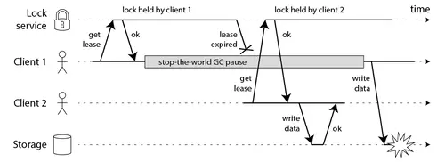

# 分布式锁简介

在分布式场景中分布式锁是一种很常见的需求。实现一个分布式锁要注意以下几点:

* 安全: 独享（相互排斥）。在任意一个时刻，只有一个客户端持有锁。
* 锁失效保护: 无死锁。即便持有锁的客户端崩溃（crashed)或者网络被分裂（gets partitioned)，锁仍然可以被获取。
* 集群容错。 只要大部分节点都活着，客户端就可以获取和释放锁。
* 原子性：获取释放锁最好是原子操作，获取释放锁的性能要好。
* 可重入(optional): 同一个线程在没有释放锁之前，如果想再次操作，可以直接获得锁。
* 阻塞/非阻塞(optional)：若没有获取到锁，返回获取失败。

<!--more-->

## 单Redis实例实现分布式锁

我们先讨论一下在单Redis实例这种简单情况下实现分布式锁的正确做法。

获取锁使用命令:

```lua
SET resource_name my_random_value NX PX 30000
```

这个命令**仅在不存在key的时候才能被执行成功（NX选项）**，并且这个key**有一个30秒的自动失效时间（PX属性）**。这个key的值是“my_random_value”(一个随机值），这个值在所有的客户端必须是唯一的，所有同一key的获取者（竞争者）这个值都不能一样。

value的值必须是随机数主要是为了更安全的释放锁，释放锁的时候使用脚本告诉Redis:**只有key存在并且存储的值和我指定的值一样才能告诉我删除成功**。可以通过以下Lua脚本实现：

```lua
if redis.call("get",KEYS[1]) == ARGV[1] then
    return redis.call("del",KEYS[1])
else
    return 0
end
```

使用这种方式释放锁可以避免删除别的客户端获取成功的锁。举个例子：

1. 客户端A取得资源锁，但是紧接着被一个其他操作阻塞了。
2. 当客户端A运行完毕其他操作后要释放锁时，原来的锁早已超时并且被Redis自动释放，并且在这期间资源锁又被客户端B再次获取到。
3. 如果仅使用DEL命令将key删除，那么这种情况就会把客户端B的锁给删除掉。
4. 使用Lua脚本就不会存在这种情况，因为脚本仅会删除value等于客户端A的value的key（value相当于客户端的一个签名）。

这个随机字符串应该怎么设置？我认为它应该是从/dev/urandom产生的一个20字节随机数，但是我想你可以找到比这种方法代价更小的方法，只要这个数在你的任务中是唯一的就行。例如一种安全可行的方法是使用/dev/urandom作为RC4的种子和源产生一个伪随机流;一种更简单的方法是把以毫秒为单位的unix时间和客户端ID拼接起来，理论上不是完全安全，但是在多数情况下可以满足需求.

key的失效时间，被称作“锁定有效期”。它不仅是key自动失效时间，而且还是一个客户端持有锁多长时间后可以被另外一个客户端重新获得。失效时间避免了持有锁的客户端崩溃（crashed)或者网络被分裂（gets partitioned)时出现死锁现象。

此时一个单Redis实例的分布式锁就已经实现完成了。但是这种设计还存在单点故障问题:如果Redis节点突然断电或发生其他问题，会丢掉一些锁。你可能会说，可以通过增加一个slave节点解决这个问题。但这通常是行不通的。这样做，我们不能实现资源的独享,因为Redis的主从同步通常是异步的(可能出现同一个锁被两个客户端持有)。

在这种场景（主从结构）中存在明显的竞态:

1. 客户端A从master获取到锁
2. 在master将锁同步到slave之前，master宕掉了。
3. slave节点被晋级为master节点
4. 客户端B取得了同一个资源被客户端A已经获取到的另外一个锁。安全失效！

## RedLock

为了解决，Redis单点的问题。Redis的作者antirez提出了RedLock的解决方案[<sup>1</sup>](#refer-anchor-1)。RedLock的核心思想就是，同时使用多个Redis Master来冗余，且这些节点都是完全的独立的，也不需要对这些节点之间的数据进行同步。

我们假设有N个Redis master。这些节点完全互相独立，不存在主从复制或者其他集群协调机制。之前我们已经描述了在Redis单实例下怎么安全地获取和释放锁。我们确保将在每个实例上使用此方法获取和释放锁(**我们需要在不同的机器上面或者虚拟机上面运行这些实例，这样保证他们不会同时都宕掉**)。

1. 获取当前Unix时间，以毫秒为单位。
2. 依次尝试从N个实例，使用相同的key和随机值获取锁。在步骤2，当向Redis设置锁时,客户端应该设置一个网络连接和响应超时时间，这个超时时间应该小于锁的失效时间。例如你的锁自动失效时间为10秒，则超时时间应该在5-50毫秒之间。这样可以避免服务器端Redis已经挂掉的情况下，客户端还在死死地等待响应结果。如果服务器端没有在规定时间内响应，客户端应该尽快尝试另外一个Redis实例。
3. 客户端使用当前时间减去开始获取锁时间（步骤1记录的时间）就得到获取锁使用的时间。当且仅当从大多数（这里是N/2+1个节点）的Redis节点都取到锁，并且使用的时间小于锁失效时间时，锁才算获取成功。
4. 如果取到了锁，key的真正有效时间等于有效时间减去获取锁所使用的时间（步骤3计算的结果）。
5. 如果因为某些原因，获取锁失败（没有在至少N/2+1个Redis实例取到锁或者取锁时间已经超过了有效时间），客户端应该在所有的Redis实例上进行解锁（即便某些Redis实例根本就没有加锁成功）。

当客户端无法取到锁时：应该在一个随机延迟后重试,防止多个客户端在同时抢夺同一资源的锁（这样会导致脑裂，没有人能取到锁）。客户端取得大部分Redis实例锁所花费的时间越短，脑裂出现的概率就会越低（必要的重试），理想情况下，客户端应该同时（并发地）向所有Redis发送SET命令。

需要强调，当客户端从大多数Redis实例获取锁失败时，应该尽快地释放（部分）已经成功取到的锁，这样其他的客户端就不必非得等到锁过完“有效时间”才能取到（然而，如果已经存在网络分裂，客户端已经无法和Redis实例通信，此时就只能等待key的自动释放了，等于被惩罚了）。

上面描述的只是获取锁的过程，而释放锁的过程比较简单：**客户端向所有Redis节点发起释放锁的操作，不管这些节点当时在获取锁的时候成功与否**。这是为什么呢？设想这样一种情况，客户端发给某个Redis节点的获取锁的请求成功到达了该Redis节点，这个节点也成功执行了SET操作，但是它返回给客户端的响应包却丢失了。这在客户端看来，获取锁的请求由于超时而失败了，但在Redis这边看来，加锁已经成功了。因此，释放锁的时候，客户端也应该对当时获取锁失败的那些Redis节点同样发起请求。实际上，**这种情况在异步通信模型中是有可能发生的：客户端向服务器通信是正常的，但反方向却是有问题的**。

### 安全的高可用

我们假设客户端从大多数Redis实例取到了锁。所有的实例都包含同样的key，并且key的有效时间也一样。然而，key肯定是在不同的时间被设置上的，所以key的失效时间也不是精确的相同。我们假设第一个设置的key时间是T1(开始向第一个server发送命令前时间），最后一个设置的key时间是T2(得到最后一台server的答复后的时间），我们可以确认，第一个server的key至少会存活 MIN_VALIDITY=TTL-(T2-T1)-CLOCK_DRIFT。所有其他的key的存活时间，都会比这个key时间晚，所以可以肯定，所有key的失效时间至少是MIN_VALIDITY。

当大部分实例的key被设置后，其他的客户端将不能再取到锁，因为至少N/2+1个实例已经存在key。所以，如果一个锁被（客户端）获取后，客户端自己也不能再次申请到锁(违反互相排斥属性）。

然而我们也想确保，当多个客户端同时抢夺一个锁时不能两个都成功。

**如果客户端在获取到大多数redis实例锁，使用的时间接近或者已经大于失效时间，客户端将认为锁是失效的锁，并且将释放掉已经获取到的锁**，所以我们只需要考虑在有效时间范围内获取到大部分锁这种情况。上面已经讨论过，在MIN_VALIDITY时间内，将没有客户端再次取得锁。所以只有一种情况，多个客户端会在相同时间取得N/2+1实例的锁，那就是取得锁的时间大于失效时间（TTL time)，这样取到的锁也是无效的.

系统的高可用基于三个主要特性:

1. 锁的自动释放（因为key失效了）：最终锁可以再次被使用.
2. 客户端通常会将没有获取到的锁删除，或者锁被取到后，使用完后，客户端会主动（提前）释放锁，而不是等到锁失效另外的客户端才能取到锁。.
3. 当客户端重试获取锁时，需要等待一段时间，这个时间必须大于从大多数Redis实例成功获取锁使用的时间，以最大限度地避免脑裂。

当网络出现问题时系统在失效时间(TTL)内就无法服务，这种情况下我们的程序就会为此付出代价。如果网络持续的有问题，可能就会出现死循环了。这种情况发生在当客户端刚取到一个锁还没有来得及释放锁就被网络隔离.如果网络一直没有恢复，这个算法会导致系统不可用.

### 性能，崩溃恢复和Redis同步

由于N个Redis节点中的大多数能正常工作就能保证Redlock正常工作，因此理论上它的可用性更高。我们前面讨论的单Redis节点的分布式锁在failover的时候锁失效的问题，在Redlock中不存在了，但如果有节点发生崩溃重启，还是会对锁的安全性有影响的。具体的影响程度跟Redis对数据的持久化程度有关。

假设一共有5个Redis节点：A, B, C, D, E。设想发生了如下的事件序列：

1. 客户端1成功锁住了A, B, C，获取锁成功（但D和E没有锁住）。
2. 节点C崩溃重启了，但客户端1在C上加的锁没有持久化下来，丢失了。
3. 节点C重启后，客户端2锁住了C, D, E，获取锁成功。

这样，客户端1和客户端2同时获得了锁（针对同一资源）。

在默认情况下，Redis的AOF持久化方式是每秒写一次磁盘（即执行fsync），因此最坏情况下可能丢失1秒的数据。为了尽可能不丢数据，Redis允许设置成每次修改数据都进行fsync，但这会降低性能。当然，即使执行了fsync也仍然有可能丢失数据（这取决于系统而不是Redis的实现）。所以，上面分析的由于节点重启引发的锁失效问题，总是有可能出现的。为了应对这一问题，antirez又提出了延迟重启(delayed restarts)的概念。也就是说，**一个节点崩溃后，先不立即重启它，而是等待一段时间再重启，这段时间应该大于锁的有效时间(lock validity time)**。这样的话，这个节点在重启前所参与的锁都会过期，它在重启后就不会对现有的锁造成影响。使用延迟重启可以在不采用持久化策略的情况下达到同样的安全，然而这样做有时会让系统转化为彻底不可用。比如大部分的redis实例都崩溃了，系统在失效时间内任何锁都将无法加锁成功。

### 锁的扩展

如果你的工作可以拆分为许多小步骤，可以将有效时间设置的小一些，使用锁的一些扩展机制。在工作进行的过程中，当发现锁剩下的有效时间很短时，可以再次向redis的所有实例发送一个Lua脚本，让key的有效时间延长一点（前提还是key存在并且value是之前设置的value)。

客户端扩展TTL时必须像首次取得锁一样在大多数实例上扩展成功才算再次取到锁，并且是在有效时间内再次取到锁（算法和获取锁是非常相似的）。这样做从技术上将并不会改变算法的正确性，所以扩展锁的过程中仍然需要达到获取到N/2+1个实例这个要求。

## Is RedLock Safe ?

RedLock算法基于了一个假设:多个进程之间没有时钟同步，但每个进程都以相同的时钟频率前进，时间差相对于失效时间来说几乎可以忽略不计。换句话说就是，每个计算机都有一个本地时钟，我们可以容忍多个计算机之间有较小的时钟漂移。只有在锁的有效时间（在步骤3计算的结果）范围内客户端能够做完它的工作，锁的安全性才能得到保证（锁的实际有效时间通常要比设置的短，因为计算机之间有时钟漂移的现象）。

> 然而，用于一致性算法的最实用的系统模型是带有不可靠故障检测器的异步模型。这意味着该算法不对时序做任何假设：进程可能会暂停任意时间长度，数据包可能会在网络中被任意延迟，时钟可能会被错误地错误–尽管如此，该算法仍有望正确执行事情。

> 算法可以使用时钟的唯一目的是生成超时，以避免在节点发生故障时永远等待。但是超时不必一定是准确的：仅仅因为一个请求超时，并不意味着另一个节点肯定是宕机的-也可能是网络中存在较大的延迟，或者您的本地时钟是错的。当用作故障检测器时，超时仅是某些错误的猜测。

Martin Kleppmann在2016-02-08这一天发表了一篇blog，名字叫"How to do distributed locking"[<sup>2</sup>](#refer-anchor-2)。Martin这篇文章大体可以分为两大部分：

* 前半部分，与Redlock无关。Martin指出，即使我们拥有一个完美实现的分布式锁（带自动过期功能），在没有共享资源参与进来提供某种fencing机制的前提下，我们仍然不可能获得足够的安全性。
* 后半部分，是对Redlock本身的批评。Martin指出，由于Redlock本质上是建立在一个同步模型之上，对系统的记时假设(timing assumption)有很强的要求，因此本身的安全性是不够的。

### 过期方式分布式锁的缺陷

首先我们讨论一下前半部分的关键点。Martin给出了下面这样一份时序图:



在上面的时序图中，假设锁服务本身是没有问题的，它总是能保证任一时刻最多只有一个客户端获得锁且具有超时功能。客户端1在获得锁之后发生了很长时间的GC pause，在此期间，它获得的锁过期了，而客户端2获得了锁。当客户端1从GC pause中恢复过来的时候，它不知道自己持有的锁已经过期了，它依然向共享资源（上图中是一个存储服务）发起了写数据请求，而这时锁实际上被客户端2持有，因此两个客户端的写请求就有可能冲突（锁的互斥作用失效了）。

如果客户端使用没有GC的语言来实现，是不是就没有这个问题呢？Martin指出，系统环境太复杂，仍然有很多原因导致进程的pause，比如虚存造成的缺页故障(page fault)，再比如CPU资源的竞争。即使不考虑进程pause的情况，网络延迟也仍然会造成类似的结果。

总结起来就是说，即使锁服务本身是没有问题的，而仅仅是客户端有长时间的pause或网络延迟，仍然会造成两个客户端同时访问共享资源的冲突情况发生。

那怎么解决这个问题呢？Martin给出了一种方法，称为fencing token。fencing token是一个单调递增的数字，当客户端成功获取锁的时候它随同锁一起返回给客户端。而客户端访问共享资源的时候带着这个fencing token，这样提供共享资源的服务就能根据它进行检查，拒绝掉延迟到来的访问请求（避免了冲突）。如下图：


在上图中，客户端1先获取到的锁，因此有一个较小的fencing token，等于33，而客户端2后获取到的锁，有一个较大的fencing token，等于34。客户端1从GC pause中恢复过来之后，依然是向存储服务发送访问请求，但是带了fencing token = 33。存储服务发现它之前已经处理过34的请求，所以会拒绝掉这次33的请求。这样就避免了冲突。

请注意，这要求存储服务器在检查令牌中发挥积极作用，并拒绝令牌已倒退的所有写操作。例如，如果您将ZooKeeper用作锁定服务，则可以将zxid 或znode版本号用作防护令牌，并且状态良好。

但是，这导致我们遇到Redlock的第一个大问题：它没有任何生成防护令牌的工具。该算法不会产生任何保证每次客户端获取锁都会增加的数字。这意味着即使该算法在其他方面是完美的，也将无法安全使用，因为在一个客户端暂停或其数据包被延迟的情况下，您无法防止客户端之间的竞争状态。

Redlock算法使用的唯一随机值不能提供所需的单调性。仅在一个Redis节点上保留一个计数器是不够的，因为该节点可能会失败。在多个节点上保留计数器将意味着它们将不同步。您可能只需要一个共识算法即可生成防护令牌。

### RedLock 的问题

现在我们再讨论一下Martin的文章的后半部分。

Redis 使用gettimeofday而非单调时钟来确定密钥的到期时间。gettimeofday的手册页明确指出，返回的时间会受到系统时间的不连续跳跃-也就是说，它可能突然向前跳跃几分钟，甚至跳（例如，如果时钟由NTP同步，因为它与NTP服务器的差异太大，或者时钟是由管理员手动调整的）。因此，如果系统时钟在做怪异的事情，则很容易发生Redis中的密钥过期比预期快得多或慢得多的情况。

对于异步模型中的算法来说，这不是一个大问题：这些算法通常可确保始终保持其安全性，而无需进行任何时序假设。只有活动属性取决于超时或其他故障检测器。这意味着，即使系统中的时序无处不在(进程暂停，网络延迟，时钟向前和向后跳动)，算法的性能也可能会陷入困境，但是该算法永远不会错误的决定。

但是，Redlock不是这样的。它的安全性取决于许多时序假设：它假设所有Redis节点在过期前大约保持正确的时间长度;与有效期相比，网络延迟小;而且该过程的暂停时间比有效期短得多。

Martin在文中构造了一些事件序列，能够让Redlock失效（两个客户端同时持有锁）。为了说明Redlock对系统记时(timing)的过分依赖，他首先给出了下面的一个例子(还是假设有5个Redis节点A, B, C, D, E):

1. 客户端1从Redis节点A, B, C成功获取了锁(多数节点)。由于网络问题，与D和E通信失败。
2. 节点C上的时钟发生了向前跳跃，导致它上面维护的锁快速过期。
3. 客户端2从Redis节点C, D, E成功获取了同一个资源的锁(多数节点)。
4. 客户端1和客户端2现在都认为自己持有了锁。

上面这种情况之所以有可能发生，本质上是因为Redlock的安全性(safety property)对系统的时钟有比较强的依赖，一旦系统的时钟变得不准确，算法的安全性也就保证不了了。Martin在这里其实是要指出分布式算法研究中的一些基础性问题，或者说一些常识问题，即好的分布式算法应该基于异步模型(asynchronous model)，算法的安全性不应该依赖于任何记时假设(timing assumption)。在异步模型中：进程可能pause任意长的时间，消息可能在网络中延迟任意长的时间，甚至丢失，系统时钟也可能以任意方式出错。一个好的分布式算法，这些因素不应该影响它的安全性(safety property)，只可能影响到它的活性(liveness property)，也就是说，即使在非常极端的情况下（比如系统时钟严重错误），算法顶多是不能在有限的时间内给出结果而已，而不应该给出错误的结果。这样的算法在现实中是存在的，像比较著名的Paxos，或Raft。但显然按这个标准的话，Redlock的安全性级别是达不到的。

随后，Martin觉得前面这个时钟跳跃的例子还不够，又给出了一个由客户端GC pause引发Redlock失效的例子。如下：

1. 客户端1向Redis节点A, B, C, D, E发起锁请求。
2. 各个Redis节点已经把请求结果返回给了客户端1，但客户端1在收到请求结果之前进入了长时间的GC pause。
3. 在所有的Redis节点上，锁过期了。
4. 客户端2在A, B, C, D, E上获取到了锁。
5. 客户端1从GC pause从恢复，收到了前面第2步来自各个Redis节点的请求结果。客户端1认为自己成功获取到了锁。
6. 客户端1和客户端2现在都认为自己持有了锁。

Martin给出的这个例子其实有点问题。在Redlock算法中，客户端在完成向各个Redis节点的获取锁的请求之后，会计算这个过程消耗的时间，然后检查是不是超过了锁的有效时间(lock validity time)。也就是上面的例子中第5步，客户端1从GC pause中恢复过来以后，它会通过这个检查发现锁已经过期了，不会再认为自己成功获取到锁了。随后antirez在他的反驳文章中就指出来了这个问题，但Martin认为这个细节对Redlock整体的安全性没有本质的影响。

初看起来，这个例子跟文章前半部分分析通用的分布式锁时给出的GC pause的时序图是基本一样的，只不过那里的GC pause发生在客户端1获得了锁之后，而这里的GC pause发生在客户端1获得锁之前。但两个例子的侧重点不太一样。Martin构造这里的这个例子，是为了强调在一个分布式的异步环境下，长时间的GC pause或消息延迟（上面这个例子中，把GC pause换成Redis节点和客户端1之间的消息延迟，逻辑不变），会让客户端获得一个已经过期的锁。从客户端1的角度看，Redlock的安全性被打破了，因为客户端1收到锁的时候，这个锁已经失效了，而Redlock同时还把这个锁分配给了客户端2。换句话说，Redis服务器在把锁分发给客户端的途中，锁就过期了，但又没有有效的机制让客户端明确知道这个问题。而在之前的那个例子中，客户端1收到锁的时候锁还是有效的，锁服务本身的安全性可以认为没有被打破，后面虽然也出了问题，但问题是出在客户端1和共享资源服务器之间的交互上。

## antirez的回复

antirez认为，Martin的文章对于Redlock的批评可以概括为两个方面(与Martin文章的前后两部分对应):

* 带有自动过期功能的分布式锁，必须提供某种fencing机制来保证对共享资源的真正的互斥保护。Redlock提供不了这样一种机制。
* Redlock构建在一个不够安全的系统模型之上。它对于系统的记时假设(timing assumption)有比较强的要求，而这些要求在现实的系统中是无法保证的。

antirez对这两方面分别进行了反驳。

### fencing机制

> When starting to work with a shared resource, we set its state to `<token>`, then we operate the read-modify-write only if the token is still the same when we write.

译文：当开始和共享资源交互的时候，我们将它的状态设置成`<token>`，然后仅在token没改变的情况下我们才执行“读取-修改-写回”操作。)

> You want to modify locked resource X. You set X.currlock = token. Then you read, do whatever you want, and when you write, you “write-if-currlock == token”. If another client did X.currlock = somethingelse, the transaction fails.

译文： 假设你要修改资源X，那么遵循下面的伪码所定义的步骤。

1. 先设置X.currlock = token。
2. 读出资源X（包括它的值和附带的X.currlock）。
3. 按照”write-if-currlock == token”的逻辑，修改资源X的值。意思是说，
    * 如果对X进行修改的时候，X.currlock仍然和当初设置进去的token相等，那么才进行修改；
    * 如果这时X.currlock已经是其它值了，那么说明有另外一方也在试图进行修改操作，那么放弃当前的修改，从而避免冲突。

在Martin提出的fencing token机制中,需要比较fetching token的大小，再决定是否处理请求。antirez表示实现这个功能，资源服务器一定能提供互斥的原子操作。那么此时为什么还需要一个分布式锁呢？

因此，antirez认为这种fencing机制是很累赘的，他之所以还是提出了这种"Check and Set"操作，只是为了证明在提供fencing token这一点上，Redlock也能做到。但是，这里仍然有一些不明确的地方，如果将”write-if-currlock == token”看做是原子操作的话，这个逻辑势必要在资源服务器上执行，那么第二步为什么还要“读出资源X”呢？除非这个“读出资源X”的操作也是在资源服务器上执行，它包含在“判断-写回”这个原子操作里面。而假如不这样理解的话，“读取-判断-写回”这三个操作都放在客户端执行，那么看不出它们如何才能实现原子性操作。在下面的讨论中，我们暂时忽略“读出资源X”这一步。

这个基于random token的"Check and Set"操作，如果与Martin提出的递增的fencing token对比一下的话，至少有两点不同：

1. "Check and Set" 对于写操作要分成两步来完成（设置token、判断-写回），而递增的fencing token机制只需要一步（带着token向资源服务器发起写请求）。
2. 递增的fencing token机制能保证最终操作共享资源的顺序，那些延迟时间太长的操作就无法操作共享资源了。但是基于random token的"Check and Set"操作不会保证这个顺序，那些延迟时间太长的操作如果后到达了，它仍然有可能操作共享资源（当然是以互斥的方式）。

对于第二点操作顺序上的不同，antirez认为这个顺序没有意义，关键是能互斥访问就行了。他写下了下面的话：

> So the goal is, when race conditions happen, to avoid them in some way.  
> ……  
> Note also that when it happens that, because of delays, the clients are accessing concurrently, the lock ID has little to do with the order in which the operations were indented to happen.

译文：

```
我们的目标是，当竞争条件出现的时候，能够以某种方式避免。
……
还需要注意的是，当那种竞争条件出现的时候，比如由于延迟，客户端是同时来访问的，锁的ID的大小顺序跟那些操作真正想执行的顺序，是没有什么关系的。
```

这里的lock ID，跟Martin说的递增的token是一回事。随后，antirez举了一个“将名字加入列表”的操作的例子：

```
T0: Client A receives new name to add from web.
T0: Client B is idle
T1: Client A is experiencing pauses.
T1: Client B receives new name to add from web.
T2: Client A is experiencing pauses.
T2: Client B receives a lock with ID 1
T3: Client A receives a lock with ID 2
```

两个客户端执行"添加名字"的操作，A本来是排在B前面的，但获得锁的顺序却是B排在A前面。因此，antirez说，锁的ID的大小顺序跟那些操作真正想执行的顺序，是没有什么关系的。关键是能排出一个顺序来，能互斥访问就行了。那么，至于锁的ID是递增的，还是一个random token，自然就不那么重要了。

> **此处不能一概而论，需要考虑A和B操作有无因果关系。如果有因果关系，那么顺序性可以保证因果关系**。

Martin提出的fencing token机制缺少太多的技术细节。Hacker News上也有人提出了相关的疑问：

1. 关于资源服务器本身的架构细节。
2. 资源服务器对于fencing token进行检查的实现细节，比如是否需要提供一种原子操作。

关于上述问题（1），Hacker News上有一位叫dwenzek的用户发表了下面的评论：

>  the issue around the usage of fencing tokens to reject any late usage of a lock is unclear just because the protected resource and its access are themselves unspecified. Is the resource distributed or not? If distributed, does the resource has a mean to ensure that tokens are increasing over all the nodes? Does the resource have a mean to rollback any effects done by a client which session is interrupted by a timeout?（译文：…… 关于使用fencing token拒绝掉延迟请求的相关议题，是不够清晰的，因为受保护的资源以及对它的访问方式本身是没有被明确定义过的。资源服务是不是分布式的呢？如果是，资源服务有没有一种方式能确保token在所有节点上递增呢？对于客户端的Session由于过期而被中断的情况，资源服务有办法将它的影响回滚吗？）

这些疑问在Hacker News上并没有人给出解答。而关于分布式的资源服务器架构如何处理fencing token，另外一名分布式系统的专家Flavio Junqueira在他的一篇blog中有所提及[<sup>3</sup>](#refer-anchor-3)。

关于上述问题（2），Hacker News上有一位叫reza_n的用户发表了下面的疑问：

> I understand how a fencing token can prevent out of order writes when 2 clients get the same lock. But what happens when those writes happen to arrive in order and you are doing a value modification? Don’t you still need to rely on some kind of value versioning or optimistic locking? Wouldn’t this make the use of a distributed lock unnecessary?（译文： 我理解当两个客户端同时获得锁的时候fencing token是如何防止乱序的。但是如果两个写操作恰好按序到达了，而且它们在对同一个值进行修改，那会发生什么呢？难道不会仍然是依赖某种数据版本号或者乐观锁的机制？这不会让分布式锁变得没有必要了吗？）

为了简单起见，我们假设有一台（先不考虑分布式的情况）通过RPC进行远程访问文件服务器，它无法提供对于文件的互斥访问（否则我们就不需要分布式锁了）。现在我们按照Martin给出的说法，加入fencing token的检查逻辑。由于Martin没有描述具体细节，我们猜测至少有两种可能。

第一种可能，我们修改了文件服务器的代码，让它能多接受一个fencing token的参数，并在进行所有处理之前加入了一个简单的判断逻辑，保证只有当前接收到的fencing token大于之前的值才允许进行后边的访问。而一旦通过了这个判断，后面的处理不变。

现在想象reza_n描述的场景，客户端1和客户端2都发生了GC pause，两个fencing token都延迟了，它们几乎同时到达了文件服务器，而且保持了顺序。那么，我们新加入的判断逻辑，应该对两个请求都会放过，而放过之后它们几乎同时在操作文件，还是冲突了。既然Martin宣称fencing token能保证分布式锁的正确性，那么上面这种可能的猜测也许是我们理解错了。

当然，还有第二种可能，就是我们对文件服务器确实做了比较大的改动，让这里判断token的逻辑和随后对文件的处理放在一个原子操作里了。这可能更接近antirez的理解。这样的话，前面reza_n描述的场景中，两个写操作都应该成功。

#### 基于ZooKeeper的分布式锁

很多人（也包括Martin在内）都认为，如果你想构建一个更安全的分布式锁，那么应该使用ZooKeeper，而不是Redis。那么我们来看下zookeeper是如何处理这一问题的。

一个基于ZooKeeper构建分布式锁的描述（当然这不是唯一的方式）：

* 客户端尝试创建一个znode节点，比如/lock。那么第一个客户端就创建成功了，相当于拿到了锁；而其它的客户端会创建失败（znode已存在），获取锁失败。
* 持有锁的客户端访问共享资源完成后，将znode删掉，这样其它客户端接下来就能来获取锁了。
* znode应该被创建成ephemeral的。这是znode的一个特性，它保证如果创建znode的那个客户端崩溃了，那么相应的znode会被自动删除。这保证了锁一定会被释放。
* 释放锁的过程相对比较简单，就是删除自己创建的那个子节点即可。

看起来这个锁相当完美，没有Redlock过期时间的问题，而且能在需要的时候让锁自动释放。但仔细考察的话，并不尽然。ZooKeeper是怎么检测出某个客户端已经崩溃了呢？实际上，每个客户端都与ZooKeeper的某台服务器维护着一个Session，这个Session依赖定期的心跳(heartbeat)来维持。如果ZooKeeper长时间收不到客户端的心跳（这个时间称为Sesion的过期时间），那么它就认为Session过期了，通过这个Session所创建的所有的ephemeral类型的znode节点都会被自动删除。

设想如下的执行序列：

1. 客户端1创建了znode节点/lock，获得了锁。
2. 客户端1进入了长时间的GC pause。
3. 客户端1连接到ZooKeeper的Session过期了。znode节点/lock被自动删除。
4. 客户端2创建了znode节点/lock，从而获得了锁。
5. 客户端1从GC pause中恢复过来，它仍然认为自己持有锁
6. 最后，客户端1和客户端2都认为自己持有了锁，冲突了。

这与之前Martin在文章中描述的由于GC pause导致的分布式锁失效的情况类似。上面的情况说明，如果会话超时不可信，仅通过ZooKeeper获取锁定是不够的。但是，如果获取锁还意味着需要访问受锁保护的共享资源，则情况并非完全如此。假设每次客户端获得一个锁定以独占访问资源时，它都会访问该资源，并且在资源上标记，以保证更早获得锁的客户端无法访问资源。在上述情况下，客户端C1认为它仍然持有该锁，但是当它尝试访问共享资源时，它失败了，因为它具有来自C2的更早标记。

在执行任何写操作之前，客户端需要通过ZooKeeper获取锁，并使用一个纪元数字来隔离以前的客户端。如果纪元号是唯一的并且严格增加，则数据存储会拒绝来自先前客户端的请求。客户端可以使用新的纪元号乐观地执行对数据存储的写入，并且仅当请求中的纪元号大于或等于数据存储器具有的纪元号时，写入才会成功。

但是资源存储服务是分布式的,我们该怎么保证？最简单的方法是确保客户端在执行任何操作之前更新所有节点上的纪元。在获得新的纪元号后，客户端向其需要访问的数据存储中的所有节点发送更新纪元的请求。为了简化讨论，我们假设它是一个小的复制数据存储，并且客户端写入所有节点。如果客户端执行了此操作，则没有一个较旧的时代的客户端能够成功执行请求。

这种方法的主要问题是这样的静态系统不能容错，数据存储节点的任何崩溃都会阻止进度，这是很糟糕的。像kafka这样的系统会依赖zookeeper来处理容错。在实际系统中，可能为了容错，只要上面讲的标记和写入操作在多数节点上完成就算成功完成了（Flavio Junqueira并没有展开去讲）。在这里我们能看到的，最重要的，是这种标记操作如何起作用的方式。这有点类似于Paxos协议（Paxos协议要求每个proposal对应一个递增的数字，执行accept请求之前先执行prepare请求）。antirez提出的random token的方式显然不符合Flavio Junqueira对于“标记”操作的定义，因为它无法区分新的token和旧的token。只有递增的数字才能确保最终收敛到最新的操作结果上。

> What systems like Apache Kafka and Apache BookKeeper have done to make groups fault tolerant is to rely on ZooKeeper to coordinate the reconfiguration of replica groups. If a node is crashed or simply partitioned away, then it is removed from the current replica group and the new group is agreed upon through ZooKeeper. ZooKeeper here serves as a sequencer for the the group reconfigurations by totally ordering these changes, and it also detects crashes of nodes with ephemeral znodes. This scheme of having a master implementing a Paxos-like protocol to perform reconfigurations of replica groups is the essence of the Vertical Paxos work . The concept of ballot in Vertical Paxos is pretty much the epoch we discuss here. It also relies on process groups, reconfigurations of such groups, and message broadcasts for replication like in Virtual Synchrony.

分布式系统中使用锁进行互斥是棘手的。使用锁定服务时，仅依靠这些服务提供的租约和会话方案通常是不够的，因为它们取决于时间，从而在没有任何其他机制的情况下使共享资源不受保护。在这里，我们讨论了使用纪元来隔离资源。一般想法是通过防止旧的作者回来并弄乱状态来确保共享资源是一致的。并非总是可能在旧有系统中引入这样的纪元。

在这个分布式数据存储服务（共享资源）的例子中，客户端在标记完成之后执行写入操作的时候，存储服务的节点需要判断epoch number是不是最新，然后确定能不能执行写入操作。如果按照上一节我们的分析思路，这里的epoch判断和接下来的写入操作，是不是在一个原子操作里呢？根据Flavio Junqueira的相关描述，我们相信，应该是原子的。那么既然资源本身可以提供原子互斥操作了，那么分布式锁还有存在的意义吗？应该说有。客户端可以利用分布式锁有效地避免冲突，等待写入机会，这对于包含多个节点的分布式资源尤其有用（当然，是出于效率的原因）。

看起来，用ZooKeeper实现的分布式锁也不一定就是安全的。该有的问题它还是有。但是，ZooKeeper作为一个专门为分布式应用提供方案的框架，它提供了一些非常好的特性，是Redis之类的方案所没有的。像前面提到的ephemeral类型的znode自动删除的功能就是一个例子。

还有一个很有用的特性是ZooKeeper的watch机制。这个机制可以这样来使用，比如当客户端试图创建/lock的时候，发现它已经存在了，这时候创建失败，但客户端不一定就此对外宣告获取锁失败。客户端可以进入一种等待状态，等待当/lock节点被删除的时候，ZooKeeper通过watch机制通知它，这样它就可以继续完成创建操作（获取锁）。这可以让分布式锁在客户端用起来就像一个本地的锁一样：加锁失败就阻塞住，直到获取到锁为止。这样的特性Redlock就无法实现。

加入watch机制实现的分布式锁:

1. 客户端调用create()方法创建名为`_locknode_/guid-lock-`的节点，需要注意的是，这里节点的创建类型需要设置为EPHEMERAL_SEQUENTIAL。
2. 客户端调用getChildren(“_locknode_”)方法来获取所有已经创建的子节点，同时在这个节点上注册上子节点变更通知的Watcher。
3. 客户端获取到所有子节点path之后，如果发现自己在步骤1中创建的节点是所有节点中序号最小的，那么就认为这个客户端获得了锁。
4. 如果在步骤3中发现自己并非是所有子节点中最小的，说明自己还没有获取到锁，就开始等待，直到下次子节点变更通知的时候，再进行子节点的获取，判断是否获取锁。

> zookeeper中临时顺序节点有几个特性：
> * 节点的生命周期和客户端会话绑定，即创建节点的客户端会话一旦失效，那么这个节点也会被清除。
> * 每个父节点都会负责维护其子节点创建的先后顺序，并且如果创建的是顺序节点（SEQUENTIAL）的话，父节点会自动为这个节点分配一个整形数值，以后缀的形式自动追加到节点名中，作为这个节点最终的节点名。

小结一下，基于ZooKeeper的锁和基于Redis的锁相比在实现特性上有两个不同：

1. 在正常情况下，客户端可以持有锁任意长的时间，这可以确保它做完所有需要的资源访问操作之后再释放锁。这避免了基于Redis的锁对于有效时间(lock validity time)到底设置多长的两难问题。实际上，基于ZooKeeper的锁是依靠Session（心跳）来维持锁的持有状态的，而Redis不支持Sesion。
2. 基于ZooKeeper的锁支持在获取锁失败之后等待锁重新释放的事件。这让客户端对锁的使用更加灵活。

顺便提一下，如上所述的基于ZooKeeper的分布式锁的实现，并不是最优的。它会引发“herd effect”（羊群效应），降低获取锁的性能。在步骤4中，"即获取所有的子点，判断自己创建的节点是否已经是序号最小的节点"，这个过程，在整个分布式锁的竞争过程中，大量重复运行，并且绝大多数的运行结果都是判断出自己并非是序号最小的节点，从而继续等待下一次通知，如果在集群规模大的时候，会对Server造成很大的性能影响，并且如果一旦同一时间有多个节点的客户端断开连接，这个时候，服务器就会像其余客户端发送大量的事件通知——这就是所谓的羊群效应。而这个问题的根源在于，没有找准客户端真正的关注点。一个更好的实现参见下面:

1. 客户端调用create()方法创建名为`_locknode_/guid-lock-`的节点，需要注意的是，这里节点的创建类型需要设置为EPHEMERAL_SEQUENTIAL。
2. 客户端调用`getChildren("_locknode_")`方法来获取所有已经创建的子节点，注意，这里不注册任何Watcher。
3. 客户端获取到所有子节点path之后，如果发现自己在步骤1中创建的节点序号最小，那么就认为这个客户端获得了锁。
4. 如果在步骤3中发现自己并非所有子节点中最小的，说明自己还没有获取到锁。此时客户端需要找到比自己小的那个节点，然后对其调用exist()方法，同时注册事件监听。
5. 之后当这个被关注的节点被移除了，客户端会收到相应的通知。这个时候客户端需要再次调用`getChildren("_locknode_")`方法来获取所有已经创建的子节点，确保自己确实是最小的节点了，然后进入步骤3。

#### Chubby的分布式锁是怎样做fencing的？

提到分布式锁，就不能不提Google的Chubby。Chubby是Google内部使用的分布式锁服务，有点类似于ZooKeeper，但也存在很多差异。Chubby对外公开的资料，主要是一篇论文，叫做[“The Chubby lock service for loosely-coupled distributed systems”](https://research.google.com/archive/chubby.html)，Chubby自然也考虑到了延迟造成的锁失效的问题。论文里有一段描述如下：

> a process holding a lock L may issue a request R, but then fail. Another process may ac- quire L and perform some action before R arrives at its destination. If R later arrives, it may be acted on without the protection of L, and potentially on inconsistent data.（译文： 一个进程持有锁L，发起了请求R，但是请求失败了。另一个进程获得了锁L并在请求R到达目的方之前执行了一些动作。如果后来请求R到达了，它就有可能在没有锁L保护的情况下进行操作，带来数据不一致的潜在风险。）

这跟Martin的分析大同小异。Chubby给出的用于解决（缓解）这一问题的机制称为sequencer，类似于fencing token机制。锁的持有者可以随时请求一个sequencer，这是一个字节串，它由三部分组成：

* 锁的名字。
* 锁的获取模式（排他锁还是共享锁）。
* lock generation number（一个64bit的单调递增数字）。作用相当于fencing token或epoch number。

客户端拿到sequencer之后，在操作资源的时候把它传给资源服务器。然后，资源服务器负责对sequencer的有效性进行检查。检查可以有两种方式：

* 调用Chubby提供的API，CheckSequencer()，将整个sequencer传进去进行检查。这个检查是为了保证客户端持有的锁在进行资源访问的时候仍然有效。
* 将客户端传来的sequencer与资源服务器当前观察到的最新的sequencer进行对比检查。可以理解为与Martin描述的对于fencing token的检查类似。

当然，如果由于兼容的原因，资源服务本身不容易修改，那么Chubby还提供了一种机制：

* lock-delay。Chubby允许客户端为持有的锁指定一个lock-delay的时间值（默认是1分钟）。当Chubby发现客户端被动失去联系的时候，并不会立即释放锁，而是会在lock-delay指定的时间内阻止其它客户端获得这个锁。这是为了在把锁分配给新的客户端之前，让之前持有锁的客户端有充分的时间把请求队列排空(draining the queue)，尽量防止出现延迟到达的未处理请求。

可见，为了应对锁失效问题，Chubby提供的三种处理方式：CheckSequencer()检查、与上次最新的sequencer对比、lock-delay，它们对于安全性的保证是从强到弱的。而且，这些处理方式本身都没有保证提供绝对的正确性(correctness)。但是，Chubby确实提供了单调递增的lock generation number，这就允许资源服务器在需要的时候，利用它提供更强的安全性保障。

### 时钟

Martin认为Redlock会失效的情况主要有三种：

* 时钟发生跳跃。
* 长时间的GC pause。
* 长时间的网络延迟。

antirez肯定意识到了这三种情况对Redlock最致命的其实是第一点：时钟发生跳跃。这种情况一旦发生，Redlock是没法正常工作的。而对于后两种情况来说，Redlock在当初设计的时候已经考虑到了，对它们引起的后果有一定的免疫力。所以，antirez接下来集中精力来说明通过恰当的运维，完全可以避免时钟发生大的跳动，而Redlock对于时钟的要求在现实系统中是完全可以满足的。

Martin在提到时钟跳跃的时候，举了两个可能造成时钟跳跃的具体例子：

* 系统管理员手动修改了时钟。
* 从NTP服务收到了一个大的时钟更新事件。

antirez反驳说：

* 手动修改时钟这种人为原因，不要那么做就是了。否则的话，如果有人手动修改Raft协议的持久化日志，那么就算是Raft协议它也没法正常工作了。
* 使用一个不会进行“跳跃”式调整系统时钟的ntpd程序（可能是通过恰当的配置），对于时钟的修改通过多次微小的调整来完成。

而Redlock对时钟的要求，并不需要完全精确，它只需要时钟差不多精确就可以了。比如，要记时5秒，但可能实际记了4.5秒，然后又记了5.5秒，有一定的误差。不过只要误差不超过一定范围，这对Redlock不会产生影响。antirez认为呢，像这样对时钟精度并不是很高的要求，在实际环境中是完全合理的。

> The delay can only happen after steps 3, resulting into the lock to be considered ok while actually expired, that is, we are back at the first problem Martin identified of distributed locks where the client fails to stop working to the shared resource before the lock validity expires. Let me tell again how this problem is common with all the distributed locks implementations, and how the token as a solution is both unrealistic and can be used with Redlock as well.（译文：延迟只能发生在第3步之后，这导致锁被认为是有效的而实际上已经过期了，也就是说，我们回到了Martin指出的第一个问题上，客户端没能够在锁的有效性过期之前完成与共享资源的交互。让我再次申明一下，这个问题对于所有的分布式锁的实现是普遍存在的，而且基于token的这种解决方案是不切实际的，但也能和Redlock一起用。）

我们提到过，Martin的文章分为两大部分，其中前半部分与Redlock没有直接关系，而是指出了任何一种带自动过期功能的分布式锁在没有提供fencing机制的前提下都有可能失效。这里antirez所说的就是指的Martin的文章的前半部分。换句话说，对于大延迟给Redlock带来的影响，恰好与Martin在文章的前半部分针对所有的分布式锁所做的分析是一致的，而这种影响不单单针对Redlock。Redlock的实现已经保证了它是和其它任何分布式锁的安全性是一样的。当然，与其它“更完美”的分布式锁相比，Redlock似乎提供不了Martin提出的那种递增的token，但antirez在前面已经分析过了，关于token的这种论证方式本身就是“不切实际”的，或者退一步讲，Redlock能提供的unique token也能够提供完全一样的效果。

关于大延迟对Redlock的影响，antirez和Martin在Twitter上有下面的对话：

```
antirez:
@martinkl so I wonder if after my reply, we can at least agree about unbound messages delay to don’t cause any harm.

Martin:
@antirez Agree about message delay between app and lock server. Delay between app and resource being accessed is still problematic.

译文：
antirez问：我想知道，在我发文回复之后，我们能否在一点上达成一致，就是大的消息延迟不会给Redlock的运行造成损害。
Martin答：对于客户端和锁服务器之间的消息延迟，我同意你的观点。但客户端和被访问资源之间的延迟还是有问题的。
```

通过这段对话可以看出，对于Redlock在第4步所做的锁有效性的检查，Martin是予以肯定的。但他认为客户端和资源服务器之间的延迟还是会带来问题的。Martin在这里说的有点模糊。就像antirez前面分析的，客户端和资源服务器之间的延迟，对所有的分布式锁的实现都会带来影响，这不单单是Redlock的问题了。

## 总结


讨论进行到这，Martin和antirez之间谁对谁错其实并不是那么重要了。只要我们能够对Redlock（或者其它分布式锁）所能提供的安全性的程度有充分的了解，那么我们就能做出自己的选择了。

这里再次引用Martin的发言: 锁定的目的是确保在可能尝试执行同一工作的多个节点中，只有一个实际上可以执行（一次至少一次）。这项工作可能是将一些数据写入共享存储系统，执行一些计算，调用某些外部API等。从高层次上讲，您可能想在分布式应用程序中锁定的原因有两个： 效率或正确性。为了区分这些情况，您可以考虑锁定失败的情况：

* 效率：进行锁定可以避免不必要地重复执行两次相同的工作（例如，一些昂贵的计算）。如果锁定失败并且两个节点最终完成相同的工作，则结果是成本略有增加（您最终向AWS支付的费用比原本多5美分）或带来的不便（例如，用户最终两次收到相同的电子邮件通知）。  
* 正确性：进行锁定可以防止并发进程踩到彼此的脚趾并弄乱系统状态。如果锁定失败，并且两个节点同时处理同一数据，则结果将导致文件损坏，数据丢失，永久性不一致，向患者使用的药物剂量错误或其他一些严重问题。


如果是为了效率(efficiency)而使用分布式锁，允许锁的偶尔失效，那么使用单Redis节点的锁方案就足够了，简单而且效率高。Redlock则是个过重的实现(heavyweight)。

- 在前面的讨论中，可以的得知RedLock的正确性前提是`时钟正确`,时钟问题在实际工作中是不可避免的。
- 其次一般基于Redis构建分布式锁的一个主要原因是QPS的考量，而ReadLock本身需要对多节点进行访问，这是一个较重的实现。
- 如果觉得单节点的单点问题很重要，可以考虑基于`主从+哨兵`方式部署Redis。

如果是为了正确性(correctness)在很严肃的场合使用分布式锁，那么不要使用Redlock。它不是建立在异步模型上的一个足够强的算法，它对于系统模型的假设中包含很多危险的成分(对于timing)。而且，它没有一个机制能够提供fencing token。应该考虑类似Zookeeper的方案，或者支持事务的数据库。这样可以保证足够强的锁定。同时**在资源层一定要支持fencing token,来屏蔽网络延迟，进程暂停等大延迟导致客户端的错误请求**。


## 参考

<div id="refer-anchor-1"></div>

- [1] [Distributed locks with Redis](https://redis.io/topics/distlock)

<div id="refer-anchor-2"></div>

- [2] [How to do distributed locking](http://martin.kleppmann.com/2016/02/08/how-to-do-distributed-locking.html)

<div id="refer-anchor-3"></div>

- [3] [Note on fencing and distributed locks](https://fpj.me/2016/02/10/note-on-fencing-and-distributed-locks/)

<div id="refer-anchor-4"></div>

- [4] [基于Redis的分布式锁到底安全吗（上）？](http://zhangtielei.com/posts/blog-redlock-reasoning.html)

<div id="refer-anchor-5"></div>

- [5] [基于Redis的分布式锁到底安全吗（下）？](http://zhangtielei.com/posts/blog-redlock-reasoning-part2.html)

