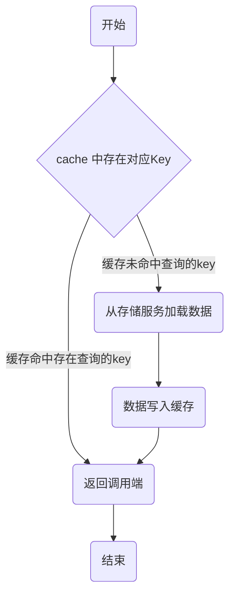
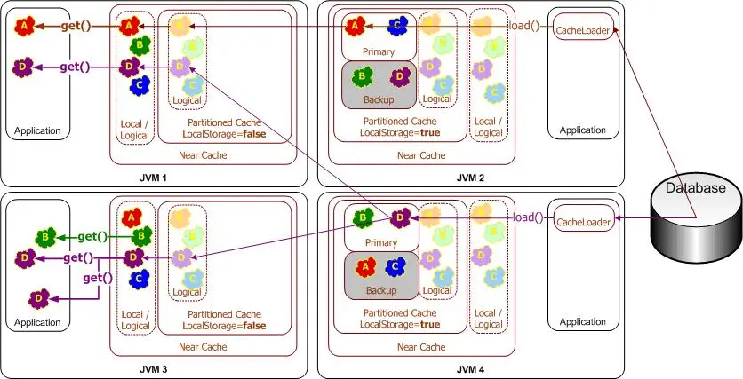

# 缓存的一些思考

缓存常被用于处理高并发,高性能问题,在现今的系统中被广泛使用。缓存模式，简单来说就是利用时间局限性原理，通过空间换时间来达到加速数据获取的目的。

缓存的读写性能很高，预热快，在数据访问存在性能瓶颈或遇到突发流量，系统读写压力大增时，可以快速部署上线，同时在流量稳定后，也可以随时下线，从而使系统的可扩展性大大增强。

但是，在系统中引入缓存后，会增加系统的复杂度。

<!--more-->

## 简单引入

### 应用自己管理缓存

应用可以通过实现Cache-Aside模式来自己管理缓存。

> Cache-Aside Pattern:
> * 失效：应用程序先从cache取数据，没有得到，则从数据库中取数据，成功后，放到缓存中。
> * 命中：应用程序从cache中取数据，取到后返回。
> * 更新：先把数据存到数据库中，成功后，再让缓存失效。

在读取缓存方面，都是先查缓存，如果击穿缓存，再查数据库等其他长期存储服务。

在更新缓存方面，有了多种实现方式:
1. 先删除缓存，再更新数据库
2. 先更新缓存，再更新数据库
3. 更新完数据库，更新缓存
4. 更新完数据库，删除缓存

下面我们来对这几种方案进行分析。

#### 先删(更新)缓存，再更新数据库

该方案会导致不一致的原因是。有一个请求A进行更新操作，同时另一个请求B进行查询操作。那么会出现如下情形:

1. 请求A进行写操作，删除(更新)缓存
2. 请求B查询发现缓存不存在
3. 请求B去数据库查询得到旧值
4. 请求B将旧值写入缓存
5. 请求A将新值写入数据库

上述情况就会导致不一致的情形出现。而且，如果不采用给缓存设置过期时间策略，该数据永远都是脏数据。

那么，如何解决呢？采用延时双删策略。

1. 先淘汰缓存
2. 再写数据库（这两步和原来一样）
3. 休眠1秒，再次淘汰缓存

这么做，可以将1秒内所造成的缓存脏数据，再次删除。那么，这个1秒怎么确定的，具体该休眠多久呢？针对上面的情形，应该自行评估自己的项目的读数据业务逻辑的耗时。然后在读数据业务逻辑的耗时基础上加上写数据的耗时即可。这么做的目的，就是确保读请求结束，写请求可以删除读请求造成的缓存脏数据。

* 采用这种同步淘汰策略，吞吐量降低怎么办？那就将第二次删除作为异步的。自己起一个线程，异步删除。
* 第二次删除,如果删除失败怎么办？维护消息队列，支持重试机制。

#### 先更新数据库，再更新缓存

假设同时有请求A和请求B进行更新操作，那么会出现

1. 线程A更新了数据库
2. 线程B更新了数据库
3. 线程B更新了缓存
4. 线程A更新了缓存

请求A更新缓存应该比请求B更新缓存早才对，但是因为网络等原因，B却比A更早更新了缓存。这就导致了脏数据，因此不考虑。

#### 先更新数据库，再删缓存

这种情况不存在并发问题么？NO.假设有两个请求，一个请求A做查询操作，一个请求B做更新操作，那么会有如下情形产生

1. 缓存刚好失效
2. 请求A查询数据库，得一个旧值
3. 请求B将新值写入数据库
4. 请求B删除缓存
5. 请求A将查到的旧值写入缓存

如果发生上述情况，还是会发生脏数据。但是发生上述情况有一个先天性条件，就是步骤3 的写数据库操作比步骤2 的读数据库操作耗时更短，才有可能使得步骤4 先于步骤5。可是数据库的读操作的速度远快于写操作的，这一情形很难出现。从概率角度来说这种策略比第二种更安全。

当然，从严谨的角度来看，上述现象还是有可能出现的。那么我们仍需要解决这一问题。采用上面给出的异步延时删除策略，保证读请求完成以后，再进行删除操作。

上述的方法实质上是通过补偿实现了最终一致性。**考虑到高性能高并发的应用场景，缓存数据双写一致性问题，并不太适合通过锁，异步队列等方式来处理**。一个更安全的方法是使用乐观锁，在数据中记录version时，更新缓存时，判断version的单调性。

## 独立缓存系统

对于独立的缓存系统,有下面几种模式:

* Read-Through
* Write-Through
* Write-Behind
* Refresh-Ahead

### Read-Through

当应用系统向缓存系统请求数据时（例如使用key=x向缓存请求数据）:
* 如果缓存中并没有对应的数据存在（key=x的value不存在），缓存系统将向底层数据源的读取数据,然后将其放置在缓存中。
* 如果数据在缓存中存在（命中key=x），则直接返回缓存中存在的数据。

这就是所谓的Read-throug。

### Write-Through

当应用系统对缓存中的数据进行更新时（例如调用put方法更新或添加条目），缓存系统会同步更新缓存数据和底层数据源。

### Write-Behind

当应用系统对缓存中的数据进行更新时（例如调用put方法更新或添加条目），缓存系统会在指定的时间后(write-behind delay)向底层数据源更新数据(后写队列)。数据源中的数据将永远不会比后写缓存延迟超过write-behind delay。

* 应用程序的性能得以提高，因为用户不必等待将数据写入基础数据源。（稍后，数据将通过其他执行线程写入。）
* 应用程序的数据库负载大大减少：由于读取和写入操作的数量都减少了，因此数据库负载也减少了。与其他任何缓存方法一样，通过缓存减少了读取次数。Write-Behind会减少写操作，这些操作通常要贵得多。因为在"后写"间隔内对同一对象的多次更改被"合并"，并且仅一次写入底层数据源（"写合并"），因此通常可以减少写入。
* 应用程序与数据库故障有所隔离。写入失败将导致将对象重新排队以进行写入。
* 线性可伸缩性：对于一个应用程序来说，要处理更多的并发用户，您只需要增加集群中的节点数即可；可以通过增加后写间隔来调整对数据库负载的影响。

- 由于后写有效地使高速缓存成为存储系统（直到将后写队列已写入db），因此必须允许后写缓存支持持久化。
- 数据库更新发生在高速缓存事务之外。也就是说，在大多数情况下，缓存事务将在数据库事务开始之前完成。这意味着数据库事务绝不能失败。如果不能保证，则必须考虑回滚。

### Refresh-Ahead

在缓存过期之前自动，异步地从缓存加载器中重新加载（刷新）任何最近访问的缓存条目。如果大量用户正在访问对象，则提前刷新特别有用。值在缓存中保持最新状态，避免了由于从缓存存储区重新加载过多而导致的延迟。

## 缓存的性能问题

* 缓存穿透
  * 缓存穿透是指用户频繁查询数据存储中不存在的数据，这类数据，查不到数据所以也不会写入缓存，所以每次都会查询数据存储，导致数据存储压力过大。
  * 解决方案
    * 增加数据校验(bloom过滤器)
    * 查询不到时，缓存空对象
* 缓存击穿
  * 高并发下，当某个缓存失效时，可能出现多个进程同时查询数据存储，导致数据存储压力过大。
  * 解决方案：
    * 使用二级缓存
    * 通过加锁或者队列降低查询数据库存储的并发数量
    * 考虑延长部分数据是过期时间，或者设置为永不过期
* 缓存雪崩
  * 高并发下，大量缓存同时失效，导致大量请求同时查询数据存储，导致数据存储压力过大.
  * 解决方案:
    * 使用二级缓存
    * 通过加锁或者队列降低查询数据库存储的并发数量
    * 根据数据的变化频率，设置不同的过期时间，避免在同一时间大量失效
    * 考虑延长部分数据是过期时间，或者设置为永不过期

## 参考

- [1] [Why does Facebook use delete to remove the key-value pair in Memcached instead of updating the Memcached during write request to the backend?](https://www.quora.com/Why-does-Facebook-use-delete-to-remove-the-key-value-pair-in-Memcached-instead-of-updating-the-Memcached-during-write-request-to-the-backend)
* [2] [Read-Through, Write-Through, Write-Behind, and Refresh-Ahead Caching](https://docs.oracle.com/cd/E15357_01/coh.360/e15723/cache_rtwtwbra.htm#COHDG200)

